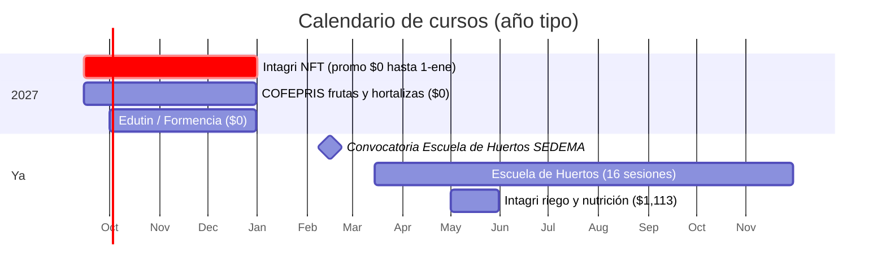

# Cursos y capacitación

**En una línea:** los cursos en línea y presenciales que valen la pena para este huerto, casi todos
gratuitos, con precio, formato, enlace, qué aportan y en qué fase tomarlos; el primero (Intagri,
hortalizas de hoja en NFT) está en promoción a $0 y se toma hoy aunque la Fase 2 llegue en meses.

!!! info "Cómo usar esta página"
    - Precios MXN al 12-sep-2026, **verificados** en la página del curso salvo indicación.
    - Orden de prioridad: ① Intagri NFT (gratis ahora) → ② COFEPRIS frutas y hortalizas (gratis,
      oficial) → ③ Escuela de Huertos Urbanos SEDEMA (convocatoria ~febrero) → ④ Edutin / Formencia
      como calentamiento → ⑤ Intagri riego y nutrición cuando el NFT venda.
    - Fuente completa: [research/libros-cursos §f](../research/libros-cursos.md) y
      [research/normativa-fiscal](../research/normativa-fiscal.md).

## Tabla de cursos

| Curso | Quién lo da | Precio (MXN) | Formato / duración | Qué aporta a este proyecto | Fase | Enlace |
|---|---|---|---|---|---|---|
| **Producción de Hortalizas de Hoja en Hidroponía o NFT** | Intagri (Celaya, Gto.; la capacitadora agrícola privada más establecida de México), Dr. Alfredo Rodríguez Delfín (UNALM) | **$742 → en promoción a $0 hasta el 1 de enero** (verificado) | Curso virtual grabado | Instalación de NFT, soluciones nutritivas, desórdenes nutricionales, camas flotantes: es exactamente la Fase 2, del mismo autor del PDF *Formulación de Soluciones Nutritivas* | **Inscribirse hoy** (Semana 0); estudiarlo en Fase 1–2 | [programa](https://www.intagri.com/memorias/hortalizas/Produccion-hortalizas-hoja-hidroponia/programa-detallado) |
| **Control sanitario de frutas y hortalizas frescas y/o mínimamente procesadas** | COFEPRIS vía aprende.gob.mx | **$0** | En línea, oficial 2026 | Lo que un verificador espera de un empacado de vegetales; constancia para la carpeta de inocuidad | Fase 1 (con el aviso 05-018) | [curso](https://cursos.aprende.gob.mx/courses/course-v1:COFEPRIS+CSDF26041X+2026_04/about) |
| **Escuela de Huertos Urbanos "Raíces del Barrio"** | SEDEMA CDMX | **$0** (verificado) | Seminario-taller de 48 h / 16 sesiones (mar–nov), cupo 40, certificado oficial | Suelo, sanidad, riego, emprendimiento verde, normativa; sobre todo **red de contactos** con la escena de agricultura urbana de la ciudad (clientes, aliados, destino del sustrato usado) | Convocatoria **~febrero** (la 2026 cerró el 9 de marzo); apuntarse a la 2027 | [convocatoria](https://www.sedema.cdmx.gob.mx/comunicacion/nota/sedema-lanza-convocatoria-para-el-seminario-taller-escuela-de-huertos-urbanos) · [nota alternativa](https://almomento.mx/sedema-abre-registro-para-escuela-de-huertos-urbanos-con-cupo-limitado/) |
| Recorridos gratuitos por huertos urbanos (Huerto Tlatelolco, Fábrica de Huertos Atlampa) | SEDEMA | $0 | Presencial | Networking y ver instalaciones reales en CDMX | Cualquier fase | vía la misma convocatoria de SEDEMA |
| Capacitación y asesoría técnica de la alcaldía / SEDEMA | Ley de Huertos Urbanos CDMX | $0 | Presencial, a solicitud | Derecho que da la ley al presentar el aviso de huerto (art. 28); en algunos casos donan insumos | Semana 0 (pedirla al entregar el aviso) | [Ley (PAOT)](https://paot.org.mx/centro/leyes-normas-htmls/ley-de-huertos-2382.html) |
| **Curso de hidroponía** | Edutin Academy | **$0**; certificado opcional de pago (tarifa por país) | En línea, a tu ritmo | Plantas, técnicas hidropónicas, construcción de NFT y raíz flotante caseros; calentamiento antes del de Intagri | Fase 1 | [curso](https://edutin.com/curso-de-hidroponia-1412) |
| Cultivo Hidropónico desde Cero | Formencia | **$0**; certificado opcional aprox. $55 USD | 12 unidades (~12 h) | pH, CE, sustratos, plagas, montaje | Fase 1 | [curso](https://formencia.com/course/cultivo-hidroponico-desde-cero/) |
| Manejo del Riego y Nutrición de Hortalizas Hidropónicas | Intagri | **$1,113** (verificado) | 2 h 54 min, acceso 30 días, constancia | Programación de riego y soluciones nutritivas (tomate/pimiento/pepino: enfoque a fruto) | Fase 3 o cuando el NFT facture; segundo en prioridad | [curso](https://www.intagri.com/memorias/horticultura-protegida/riego-nutricion-hortalizas-hidroponicas) |
| Cursos básico / intensivo / en línea de hidroponía | Asociación Hidropónica Mexicana (Toluca) | Por teléfono/WhatsApp +52 722 231 1808 (no publicados) | Presencial cerca de CDMX y en línea | Opción presencial mexicana; también venden sus libros | Fase 1–2 | [AHM](https://www.hidroponia.org.mx/) |
| Manejo Higiénico de Alimentos (el estándar que exige el Distintivo H) | Varios proveedores en línea [POR VERIFICAR: proveedor y costo] | [POR VERIFICAR] | En línea | Constancia que pide el área de compras de hoteles para ti y cualquier ayudante | Fase 1–2 | — |
| Consultoría 1:1 de Donny Greens | Donny Greens (vía Calendly, en USD) | De pago (USD) | Videollamada | Solo si el lado comercial se atora tras 15 visitas; el material gratuito de su canal basta | Opcional | [donnygreens.com](https://www.donnygreens.com/) |

## Qué NO tomar (por ahora)

| Curso | Precio | Por qué no |
|---|---|---|
| Diplomado Internacional en Horticultura Protegida (Intagri, Zoom) | aprox. $19,900–25,000 (no verificado) | Caro y sobredimensionado para 30 m² | 
| Curso de pago de Curtis Stone (microgreens) | Cotizar en sitio | El material gratuito de On The Grow + Donny Greens + Curtis Stone cubre lo mismo ([Videos](videos.md)) |
| Curso Completo Microgreens (TusMicrogreens, español) | De pago | El sitio no respondió en la verificación de enlaces; solo tendría sentido si el inglés fuera barrera |
| Chapingo / UNAM / Coursera / edX | — | No se localizó un curso abierto y vigente sobre hidroponía o agricultura urbana con página verificable [POR VERIFICAR: buscar en cada plataforma] |

## Calendario

## Al terminar cada curso

- [ ] Constancia en PDF en la carpeta de inocuidad (los hoteles piden evidencia de capacitación:
      [research/inocuidad-operativa §6](../research/inocuidad-operativa.md)).
- [ ] Una página de notas "qué cambia en mi SOP" commiteada al repo (densidad, banda pH/EC, higiene).
- [ ] Contactos de la Escuela de Huertos anotados como posibles clientes/aliados y como destino del
      sustrato usado ([07 §12](../referencia/07-puntos-ciegos-y-riesgos.md)).

## Fuentes

[research/libros-cursos](../research/libros-cursos.md) · [research/normativa-fiscal](../research/normativa-fiscal.md) ·
[research/inocuidad-operativa](../research/inocuidad-operativa.md) · [05-aprendizaje](../referencia/05-aprendizaje.md) ·
[normativa](../referencia/normativa.md)
