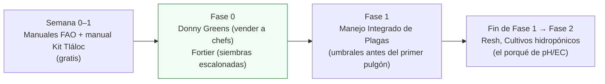

# Libros y manuales

**En una línea:** los libros que dan **criterio** (no recetas) para cada fase del huerto, con precio
verificado en México, dónde comprarlos hoy, qué aportan a este proyecto y en qué fase leerlos; más
los manuales gratuitos en PDF que cubren la técnica sin gastar un peso.

!!! info "Cómo usar esta página"
    - Precios MXN al 12-sep-2026; **verificado** = visto en la ficha ese día; **aprox.** = de
      resultados de búsqueda (Mercado Libre y a veces Amazon bloquean la verificación automática).
    - Regla: los libros se compran **por fase**, como todo lo demás; el total de la compra inicial es
      ~$1,600 y lo demás sale de ingresos de Fase 1.
    - Fuente completa con alternativas de tienda: [research/libros-cursos](../research/libros-cursos.md);
      ruta resumida: [05-aprendizaje](../referencia/05-aprendizaje.md).

## Plan de lectura por fase

## Compra ya (Fase 0, ~$885 + $429 en Fase 1)

| Título | Autor / editorial | Precio (MXN) | Dónde | Qué aporta a este proyecto | Fase para leerlo |
|---|---|---|---|---|---|
| **Microgreens: The Insiders Secrets To Growing Gourmet Greens & Building A Wildly Successful Microgreen Business** (inglés) | Donny Greens | **$396.60** (verificado) | [Amazon MX](https://www.amazon.com.mx/Microgreens-Insiders-Building-Successful-Microgreen/dp/191366600X) · [Kindle](https://www.amazon.com.mx/Microgreens-Insiders-Building-Successful-Microgreen-ebook/dp/B0867N7R45) | Precios por charola, venta a restaurantes y suscripciones directas; el autor vive de entregas semanales a chefs. Es el libro del gate G0→1 | **Fase 0, antes de la primera visita** ([Visitar a un chef](../guias/visitar-a-un-chef.md)) |
| **El jardinero horticultor. Manual para cultivar con éxito pequeñas huertas biointensivas** (español; es *The Market Gardener*) | Jean-Martin Fortier / Ediciones Atalanta, 2020, 268 pp. | **$488** (verificado; Amazon MX $589.72) | [El Péndulo](https://pendulo.com/libro/jardinero-horticultor-el_393665) (en stock en 8 sucursales CDMX: recoger hoy) · [Amazon MX](https://www.amazon.com.mx/El-jardinero-horticultor-cultivar-biointensivas/dp/8412074378) · [ficha editorial](https://www.edicionesatalanta.com/catalogo/el-jardinero-horticultor/) | Planeación de siembras escalonadas, estandarización de camas/charolas, herramientas mínimas y canal directo con 10+ años de datos; la disciplina de las siembras lunes/jueves de Fase 1 | Fase 0–1 |
| **Manejo Integrado de Plagas** | Jorge Toledo y Francisco Infante (coords.) / Trillas, México; 24 investigadores (ECOSUR) | **$429** (verificado) | [Amazon MX](https://www.amazon.com.mx/Manejo-Integrado-Plagas-Toledo-Arreola/dp/9682483247) | Criterio de **umbrales**: cuándo intervenir y cuándo basta ventilar; muestreo y control biológico. Directo contra pulgón en albahaca y fusarium en charolas; base intelectual de la auditoría V8 | Fase 1, antes del primer pulgón ([Control de plagas](../guias/control-de-plagas.md)) |

## Compra al final de la Fase 1, con ingresos (~$900)

| Título | Autor / editorial | Precio (MXN) | Dónde | Qué aporta | Fase |
|---|---|---|---|---|---|
| **Cultivos hidropónicos**, 5ª ed. (español, 558 pp.) | Howard M. Resh / Mundi-Prensa | **$899** "últimas unidades" (verificado; entrega a CDMX) · plan B **$1,088.21** Buscalibre (7 unidades) · Mundi-Prensa MX $1,149.50–1,210 (stock dudoso) | [Casa del Libro](https://latam.casadellibro.com/libro-cultivos-hidroponicos-5-ed-suelo-para-tecnicos-y-agricultores-profesionales-asi-como-para-los/9788484760054/796153) · [Buscalibre](https://www.buscalibre.com.mx/libro-cultivos-hidroponicos/9788484760054/p/979920) · [Mundi-Prensa](https://www.mundiprensa.mx/catalogo/9788484760054/cultivos-hidroponicos) | LA referencia: formulación de soluciones, NFT, oxigenación, manejo de pH/EC, síntoma → deficiencia. El **porqué** de las bandas pH 5.8–6.2 y EC 1.2–1.8 que programas en ESPHome; lo desactualizado es solo iluminación LED (traducción de la 5ª ed., 2001) | Fase 2 ([Dosificación v2](../fases/fase-2/dosificacion-v2.md)) |

## Escalones accesibles en español (mientras llega Resh)

| Título | Autor / editorial | Precio (MXN) | Dónde | Qué aporta | Fase |
|---|---|---|---|---|---|
| **Hidroponia** | Ma. del Pilar Longar Blanco / Trillas | **$275** (verificado) | [El Sótano](https://www.elsotano.com/buscar?SotK=hidroponia) (recolección en CDMX) | Introducción mexicana en papel; buen primer libro si Resh intimida | Fase 1–2 |
| **Hidroponía básica** (154 pp.) | Gloria Samperio Ruiz / Ed. Diana; fundadora de la Asociación Hidropónica Mexicana | aprox. $150–350 usado | [búsqueda ML](https://listado.mercadolibre.com.mx/libro-hidroponia-basica-gloria-samperio) · [AHM (venta directa, tel. +52 722 231 1808)](https://www.hidroponia.org.mx/index.php/hidroponia-publicaciones-libros-hidroponia-basica-hidroponia-comercial-gloria-samperio/libro-hidroponia-basica) | Contextualizado a México; la AHM también vende *Hidroponía comercial* y *Manual de Sanidad Vegetal* (precios por teléfono) | Fase 1–2 |
| Manejo Fitosanitario del Cultivo de Hortalizas (ICA) | ICA | aprox. $300–500 (no verificado) | [Amazon MX](https://www.amazon.com.mx/Manejo-Fitosanitario-del-Cultivo-Hortalizas/dp/9588779073) | Alternativa al de Trillas; enfoque andino, plagas equivalentes | Opcional |

## Segunda ronda (solo si el inglés no estorba)

| Título | Autor | Precio (MXN) | Dónde | Qué aporta | Veredicto |
|---|---|---|---|---|---|
| **The Urban Farmer** (inglés; no tiene traducción) | Curtis Stone / New Society | **$582.67** (40 % desc., verificado; importado, 11–15 días hábiles) | [Buscalibre MX](https://www.buscalibre.com.mx/libros/search?q=the+urban+farmer+curtis+stone) · [ficha del editor](https://newsociety.com/book/the-urban-farmer/) | El más cercano al caso: urbano, restaurantes, poco capital, valor por m² ("quick crops" = por qué microgreens van primero) | Se traslapa ~60 % con Fortier: segunda ronda |
| Microgreens: A Guide To Growing Nutrient-Packed Greens | Franks & Richardson | **$872.49** nuevo / $677.30 usado (verificado) | [Amazon MX](https://www.amazon.com.mx/Microgreens-Growing-Nutrient-Packed-Greens/dp/1423603648) | Argumentos culinarios por variedad para la hoja de precios | Caro para lo que aporta: opcional |
| Growing Microgreens for Profit | Craig Wallin | papel no disponible; Kindle aprox. $100–200 | [Amazon MX](https://www.amazon.com.mx/Growing-Microgreens-Profit-Craig-Wallin/dp/B0884H7P15) | Los 3 mejores canales de venta, semilla al mayoreo | Solo Kindle |
| MICROGREENS BUSINESS: A Complete Step by Step Guide (Kindle) | Ronald Mason | aprox. $100–200 (no verificado) | [Amazon MX](https://www.amazon.com.mx/MICROGREENS-BUSINESS-COMPLETE-GROWING-PROFITABLE-ebook/dp/B098T7JPNR) | Arranque en espacio limitado | Alternativa barata al de Donny Greens |
| The Market Gardener (inglés) | Fortier | **$582.67** (verificado) | [Buscalibre](https://www.buscalibre.com.mx/libros/search?q=the+market+gardener+fortier) | Versión original | Redundante si compras la edición en español |

## Manuales gratuitos (PDF, todos verificados)

Descárgalos la semana 0: con esto la técnica de microgreens y la teoría de NFT quedan cubiertas
sin gastar.

| Manual | Quién | Qué aporta | Fase | Enlace |
|---|---|---|---|---|
| **La Huerta Hidropónica Popular** (132 pp.) | FAO (Marulanda & Izquierdo) | EL manual FAO de hidroponía de bajo costo para América Latina: sustratos, soluciones, raíz flotante y NFT casero | 0–2 | [PDF](https://www.fao.org/4/ah501s/ah501s.pdf) |
| **Una huerta para todos** (5ª ed., ~34 MB) | FAO | Curso completo de producción de hortalizas a pequeña escala urbana/periurbana | 0–1 | [PDF](https://www.fao.org/3/i3846s/i3846s.pdf) |
| **Manual de consulta del productor urbano** | FAO | Producción + comercialización en ciudad (incluye la parte de mercado) | 0 | [PDF](https://www.fao.org/4/a1177s/a1177s.pdf) |
| Agricultura urbana y periurbana en América Latina (folleto) | FAO | Panorama y casos; contexto, no operación | — | [PDF](https://www.fao.org/fileadmin/templates/FCIT/PDF/Brochure_FAO_3.pdf) |
| **Manual de hidroponía** (32 pp.) | Oasis Grower Solutions (Smithers Oasis México) | Germinación en espuma agrícola y manejo en NFT: el manual del producto que compras en Fase 2 | 2 | [PDF](https://www.guao.org/sites/default/files/biblioteca/Manual%20de%20hidropon%C3%ADa.pdf) |
| 15 manuales de hidroponía (índice) | Infolibros | Destacan el *Manual de producción hidropónica para hortalizas de hoja en NFT* (Brenes & Jiménez, TEC Costa Rica, 27 pp.: la lectura corta más pegada a la Fase 2) y *Formulación de Soluciones Nutritivas* (Rodríguez Delfín, UNALM) | 2 | [índice](https://infolibros.org/libros-pdf-gratis/temas-varios/hidroponia/) |
| Manual de hidroponía familiar: hágalo fácil (~60 pp.) | Freddy Soto / InfoAgronomo | Hidroponía en sustrato paso a paso [URL vista en búsqueda, no abierta] | 1 | [descarga](https://infoagronomo.net/manual-de-hidroponia-familiar-hagalo-facil/) |
| **Manual de instalación Kit Tláloc** (junio 2019, 1.8 MB) | Isla Urbana (vía Engineering for Change) | Instalación ilustrada del sistema estándar de captación pluvial de CDMX; autoinstalable | 1 | [PDF](https://www.engineeringforchange.org/wp-content/uploads/2020/07/MANUAL-INSTALACI%C3%93N-KIT-TL%C3%81LOC-12-JUNIO-2019CH.pdf) |
| Manuales de Buenas Prácticas Agrícolas | SENASICA | La plantilla de tu bitácora de inocuidad (agua, desinfección, higiene, trazabilidad por lote) | 1 | [manuales](https://www.gob.mx/senasica/documentos/manuales-buenas-practicas-agricolas) |
| Manejo integrado de plagas en hortalizas (breve) | Red de Huertos Alicante | Manual corto descargable [URL vista en búsqueda, no abierta: verificar descarga] | 1 | [PDF](https://redhuertosalicante.wordpress.com/wp-content/uploads/2014/08/manejo-integrado-de-plagas-en-hortalizas.pdf) |
| Guías PDF gratuitas de On The Grow (densidades por charola, 43 variedades) | On The Grow | Completan los rendimientos de girasol/chícharo por charola 1020 (checkout de $0 con correo) | 0 | [seeding guide](https://onthegrow.net/products/free-microgreen-seeding-guide-pdf) · [tray-specific](https://onthegrow.net/products/free-tray-specific-microgreen-seeding-guide-pdf) |
| Johnny's Micro Greens Yield Trial 2017 + Comparison Chart | Johnny's Selected Seeds | El único dataset público con semilla pesada y rendimiento medido por charola 1020 (29 variedades); clasificación rápida/lenta por especie | 0 | [yield trial (PDF)](https://www.johnnyseeds.com/on/demandware.static/-/Library-Sites-JSSSharedLibrary/default/dwa67c24b8/assets/information/micro-greens-yield-trial-results-tech-sheet.pdf) · [comparison chart (PDF)](https://www.johnnyseeds.com/on/demandware.static/-/Library-Sites-JSSSharedLibrary/default/dw82bb95b4/assets/information/microgreens-comparison-chart-pdf.pdf) |
| Libro de control ecológico de plagas en huertos urbanos CDMX | FES Zaragoza UNAM | Pulgón, mosca blanca y trips en huertos urbanos de la ciudad; descargable | 1 | [página](https://www.zaragoza.unam.mx/plagas-control-huertos-urbanos-cdmx/) |
| Safer Sprout Production (2ª ed.) y video de tratamiento de semilla | Sprout Safety Alliance (Illinois Tech / FDA) | Marco de sanitización de semilla para brotes; capacitación autodidacta | 0 | [SSA](https://www.iit.edu/ssa) |

## Qué NO comprar

- *The Winter Market Gardener* (Fortier & Sylvestre, $705.94): CDMX casi no tiene invierno limitante.
- El libro de $197 USD (~$3,650) de On The Grow: sus guías PDF gratuitas cubren lo operativo.
- Ningún libro "serio" de microgreens comerciales en español: no existe (hueco real del mercado
  editorial). Si aparece, PR a esta página.

## Pendientes de verificación

- PDF oficial vigente de SADER/INIFAP o manual UNAM/Chapingo con URL institucional estable: no se
  localizó; los manuales FAO cubren el mismo terreno.
- Descarga del manual breve de MIP de la Red de Huertos Alicante (solo vista en búsqueda).
- Precios de Mercado Libre (bloqueo 403): revisar a mano.

## Fuentes

[research/libros-cursos](../research/libros-cursos.md) · [research/recetas-produccion-economia](../research/recetas-produccion-economia.md) ·
[research/inocuidad-operativa](../research/inocuidad-operativa.md) · [research/clima-agronomia](../research/clima-agronomia.md) ·
[05-aprendizaje](../referencia/05-aprendizaje.md) · [`bom/fase0.csv`](https://github.com/AndresIslas99/HomeGreen/blob/main/bom/fase0.csv) ·
[`bom/fase2.csv`](https://github.com/AndresIslas99/HomeGreen/blob/main/bom/fase2.csv)
