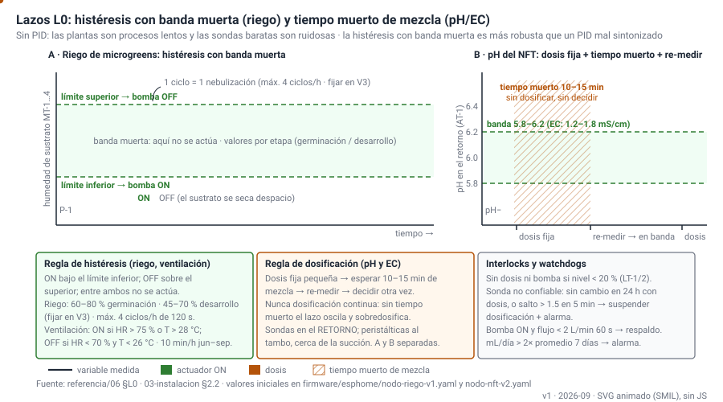
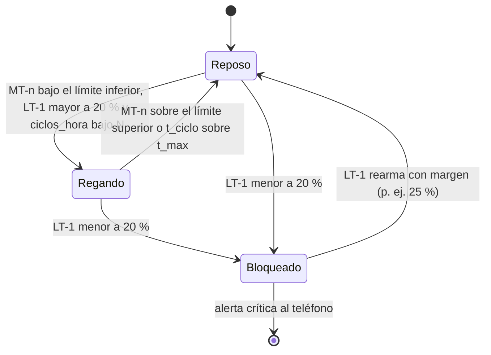
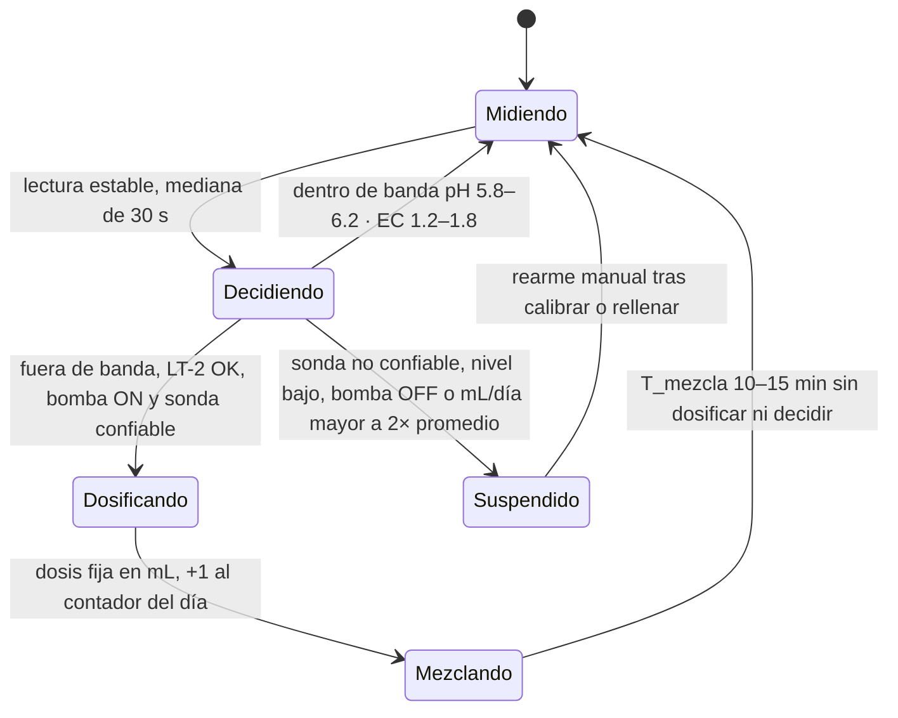
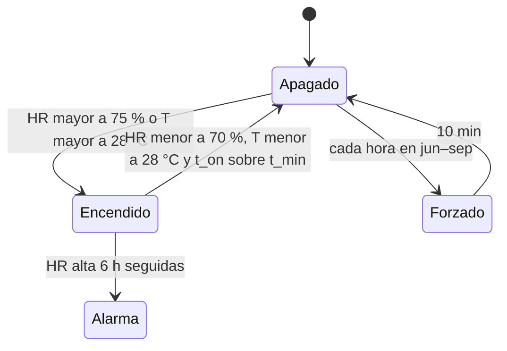
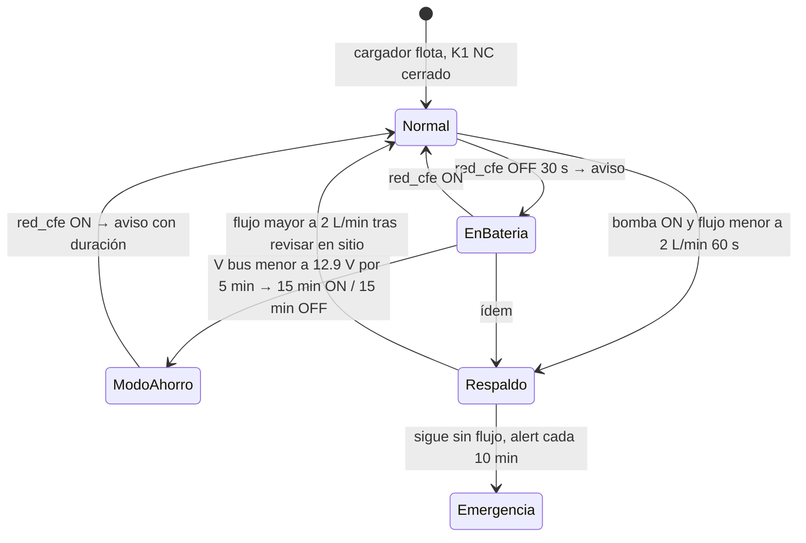
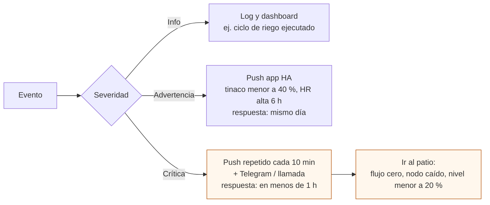

# Diseño de control

**En una línea:** cinco lazos de máquina (L0) por histéresis con banda muerta —riego,
pH, EC, nivel y ventilación— más la continuidad del NFT, con interlocks por nivel y cinco
watchdogs; ESPHome ejecuta, Home Assistant avisa y optimiza, y nada que pueda matar un
cultivo depende de que Home Assistant esté vivo.

!!! info "Qué decide esta página"
    - **Setpoints, bandas y persistencias** de cada lazo, con su fuente; lo que aún no se
      ha medido lleva `[POR VERIFICAR: cómo]`.
    - **Quién ejecuta qué:** cableado (fail-safe físico) → ESPHome (lazos locales) →
      Home Assistant (alarmas, escalamiento, modo ahorro, calendario) → tú.
    - **Tags de instrumentos** de [hidraulico.md §6](hidraulico.md) y **pines** de
      [electrico.md](electrico.md); los YAML viven en `firmware/esphome/` y
      `firmware/homeassistant/` ([software/firmware](../software/firmware.md),
      [software/home-assistant](../software/home-assistant.md)).
    - **Cómo se prueba:** dry-run V3, ausencia V5, simulacro de apagón V11
      ([validacion/](../validacion/index.md)).
    - **Prerequisitos:** [Diseño eléctrico](electrico.md), [Diseño hidráulico](hidraulico.md),
      [06-validacion §L0](../referencia/06-validacion-y-lazos-agenticos.md).

## Por qué histéresis y no PID

Las plantas son procesos lentos (horas) y las sondas de $300–1,250 son ruidosas y derivan.
Un lazo ON/OFF con **banda muerta** (no actúa mientras la variable está entre dos límites)
es más robusto que un PID mal sintonizado: no oscila, no sobredosifica y se entiende en un
vistazo ([06-validacion §L0](../referencia/06-validacion-y-lazos-agenticos.md)). Para pH y EC
se añade **tiempo muerto de mezcla**: dosis fija pequeña → esperar 10–15 min → re-medir →
decidir otra vez; nunca dosificación continua ([03-instalacion §2.2](../referencia/03-instalacion.md)).

## Quién ejecuta qué (y qué pasa si esa capa se cae)

| Capa | Dónde corre | Qué hace | Si se cae |
|---|---|---|---|
| Cableado (fail-safe físico) | Gabinete B, bus 12 V | Bomba NFT principal por contacto **K1 NC**; solenoides **NC**; batería siempre en paralelo | No se cae: sin electrónica la bomba corre y el tinaco no se vacía |
| ESPHome (lazos locales) | ESP32 de cada nodo | Riego, ventilación, dosificación con tiempo muerto, interlocks por nivel, contador de flujo, `restore_mode: RESTORE_DEFAULT_ON` | El nodo reinicia y vuelve al estado seguro; HA lo detecta como caído en 5–10 min |
| Home Assistant | Mini PC + router en UPS | Alarmas y escalamiento, respaldo de bomba por flujo cero, modo ahorro por voltaje, calendario de calibración, export CSV | Los lazos locales siguen; pierdes avisos (por eso el UPS) |
| Operador (L1) | 10 min al día | Panel de excepciones, inspección visual, bitácora | Ver [datos.md](datos.md) |

Regla: **una capa solo escala problemas hacia arriba, nunca los resuelve dos veces**
([06-validacion](../referencia/06-validacion-y-lazos-agenticos.md)).

## Setpoints y bandas

| Lazo | Variable (tag / entidad) | Referencia o banda | Actuador | Regla | Fuente |
|---|---|---|---|---|---|
| Riego microgreens | Humedad de sustrato MT-1…4 (`sensor.humedad_sustrato_n1…n4`) | Banda por etapa: germinación (más húmeda) y desarrollo `[POR VERIFICAR: la fuente no fija %; calibrar el ADC de cada sensor en seco/saturado y fijar límites en el dry-run V3 con 4 charolas testigo]` | P-1 diafragma 12 V + nebulizadores (K1 del nodo riego) | ON si < límite inferior; OFF si > límite superior; máx. N ciclos/h `[POR VERIFICAR: N y duración máxima por ciclo, medidos en V3]` | [06 §L0](../referencia/06-validacion-y-lazos-agenticos.md) |
| pH NFT | AT-1 en el retorno (`sensor.ph_nft`) | **5.8–6.2** | DP-3 peristáltica pH− (AquAcid) | Dosis fija pequeña → T_mezcla **10–15 min** → re-medir | [06 §L0](../referencia/06-validacion-y-lazos-agenticos.md), [03 §2.2](../referencia/03-instalacion.md) |
| EC NFT | AT-2 en el retorno (`sensor.ec_nft`, mS/cm) | **1.2–1.8 mS/cm** según cultivo | DP-1 (A) y DP-2 (B), nunca juntas en el mismo bote | Igual: dosis + tiempo muerto; nunca continua | [06 §L0](../referencia/06-validacion-y-lazos-agenticos.md) |
| Nivel tinaco | LT-1 JSN-SR04T (`sensor.nivel_tinaco`) | **> 20 %** | Bloqueo de P-1, SV-1 y dosificación | Interlock: nivel bajo = nada dosifica ni bombea; advertencia < 40 % | [06 §L0](../referencia/06-validacion-y-lazos-agenticos.md), [hidraulico §6](hidraulico.md) |
| Nivel tambo | LT-2 `[POR VERIFICAR: sensor no definido en bom/fase2 — flotador con contacto o segundo JSN-SR04T]` | Alto: cierra SV-1 · Bajo: bloquea | SV-1 llenado, P-1/P-2, DP-1/2/3 | Interlock: sin dosificación ni bomba con nivel bajo o bomba OFF | [hidraulico §5.3](hidraulico.md) |
| Ventilación | SHT31 T/HR (`sensor.humedad_ambiente`, `sensor.temperatura_ambiente`) | Referencia **HR < 75 %, T < 28 °C**; arranque a **HR > 70 %** | Ventilador 12 V (K2 del nodo riego) | Histéresis en la banda 70–75 %: ON arriba de 75 % o T > 28 °C, OFF abajo de 70 % `[POR VERIFICAR: la fuente da los dos umbrales, no el sentido de la banda; ajustar en V3 viendo cuánto tarda en bajar la HR]`; **forzado 10 min/h en temporada de lluvia** (jun–sep) | [06 §L0](../referencia/06-validacion-y-lazos-agenticos.md), [02 §1](../referencia/02-restricciones-y-requisitos.md) |
| Temperatura de solución | TT-2 DS18B20 en TK-2 (`sensor.temperatura_solucion`) | **18–22 °C**; advertencia > 25 °C | Ninguno (sombra, cambio de solución) | Informativo; arriba de 25 °C cae el oxígeno disuelto | [hidraulico §6](hidraulico.md) |
| Continuidad NFT: flujo | FT-1 YF-S201 (`sensor.flujo_nft`, 450 pulsos/L) | 8–16 L/min normal; **< 2 L/min** = sin flujo | K2 bomba de respaldo + alerta crítica | Bomba comandada ON y flujo < 2 L/min por **60 s** → respaldo + crítica; apagar la principal (protege en seco) `[POR VERIFICAR: 06 dice 60 s y el YAML del informe 2 min; este diseño usa 60 s y se ajusta tras medir el caudal real]` | [06 watchdogs](../referencia/06-validacion-y-lazos-agenticos.md), [research §5.2](../research/electrico-respaldo-seguridad.md) |
| Continuidad NFT: red CFE | `binary_sensor.red_cfe_presente` (GPIO23, `delayed_off: 5s`) | Presente / ausente | Notificación | Ausente 30 s → aviso "corte de luz" con voltaje y autonomía | [research §5.1–5.2](../research/electrico-respaldo-seguridad.md) |
| Continuidad NFT: batería | `sensor.voltaje_bateria_nft` (GPIO36, ×5.7) | Flotación ≤ 13.6 V; **< 12.9 V** = 30–40 % restante | `script.ciclo_bomba_15_15` | < 12.9 V por 5 min **y** red ausente → modo ahorro 15 min ON / 15 min OFF (≈ 2.5 días) | [research §2.3 y §5.2](../research/electrico-respaldo-seguridad.md) |
| Heladas (sur de CDMX) | `sensor.temperatura_ambiente` | Alarma **< 6 °C** | Cerrar túnel, masa térmica o calefactor 500 W en relé (K4) | Solo dic–feb en Tlalpan/Xochimilco/Milpa Alta | [02 §1](../referencia/02-restricciones-y-requisitos.md) |

!!! warning "Qué NO decide el agente ni Home Assistant"
    Los setpoints de esta tabla los cambias tú, con un commit en `firmware/` que cite la
    evidencia (semana, KPI o experimento V6). El agente L3 *propone* setpoints; nunca los
    escribe solo ([06 §L3](../referencia/06-validacion-y-lazos-agenticos.md)).

## Lazo 1 · Riego de microgreens (Fase 1)

- **Una bomba, cuatro sensores.** El nodo v1 tiene una sola bomba (K1) y válvulas manuales
  por nivel en el manifold; el lazo decide con **el más seco de MT-1…4** y el caudal por
  nivel se iguala a mano `[POR VERIFICAR: decidir en V3 si conviene la mediana; regar cada
  nivel por separado exige una solenoide por nivel en K4]`.
- **Nivel 5 (oscuridad) no se nebuliza:** se atomiza a mano 1–2×/día
  ([03 §0.3](../referencia/03-instalacion.md)); un capacitivo ahí solo sirve de alarma.
- **Después del destape el riego es solo por abajo:** los nebulizadores mojan el sustrato
  desde el borde de la charola, nunca el follaje `[POR VERIFICAR: orientación de boquillas en el commissioning]`.
- `t_max` (duración máxima de un ciclo) y `N` (ciclos por hora) son los dos watchdogs del
  lazo: un sensor que "se seca" para siempre (conector corroído) no debe dejar la bomba
  encendida.

## Lazo 2 · pH y EC con tiempo muerto (Fase 2)

- **Orden de dosificación** en un depósito nuevo: A → mezcla → B → mezcla → pH− → medir;
  A y B nunca en el mismo bote (el calcio precipita con fosfatos y sulfatos)
  ([hidraulico §5.3](hidraulico.md)).
- **Dosis fija:** tamaño en mL `[POR VERIFICAR: fijarlo en el dry-run de dosificación del
  commissioning de Fase 2 (03 §Fase 2): con 200 L de agua, medir cuánto mueve el pH una dosis
  y elegir la que lo mueva menos de una décima]`.
- **Sondas en el retorno, peristálticas al tambo cerca de la succión**
  ([03 §2.2](../referencia/03-instalacion.md)): si dosificas junto a la sonda, el lazo ve el
  concentrado y oscila.
- **Sonda no confiable** (las baratas fallan *mintiendo*, no callando): si pH o EC no cambian
  nada en 24 h con dosificaciones hechas, o saltan > 1.5 unidades en 5 min → marcar,
  suspender dosificación automática, alarma ([06 watchdogs](../referencia/06-validacion-y-lazos-agenticos.md)).
- **Calibración quincenal** con buffers 4.0/6.86 y patrón EC 1.413 mS/cm, como evento del
  calendario de HA con alarma ([calibrar-sondas-ph-ec](../guias/calibrar-sondas-ph-ec.md));
  cambio completo de solución cada 2–3 semanas ([cambiar-solucion-nft](../guias/cambiar-solucion-nft.md)).

## Lazo 3 · Ventilación por humedad relativa (Fase 1)

La ventilación forzada por histéresis de HR es **la automatización más importante del
proyecto**, más que el riego: entre junio y septiembre la HR de 70–89 % convierte cualquier
túnel cerrado en incubadora de moho, damping-off y botrytis
([02 §1](../referencia/02-restricciones-y-requisitos.md), [research/clima-agronomia](../research/clima-agronomia.md)).
`t_min` (tiempo mínimo encendido) evita el parpadeo del ventilador cuando la HR ronda el
límite `[POR VERIFICAR: 5–10 min, ajustar en V3]`. En dic–feb en alcaldías del sur, no
forzar de noche y mantener la alarma de helada < 6 °C.

## Lazo 4 · Continuidad del NFT (Fase 2)

- Cinco automatizaciones con YAML listo en
  [research/electrico-respaldo-seguridad §5.2](../research/electrico-respaldo-seguridad.md):
  bomba sin flujo → respaldo + crítica; corte de CFE → aviso; escalación corte + sin flujo
  (`alert`, repite cada 10 min); modo ahorro por voltaje; nodo caído. Los pines de este
  diseño difieren del YAML del informe (ver nota en [electrico.md](electrico.md)); la
  lógica no.
- **Tras cada corte el sistema se auto-recupera** (ESPHome y HA arrancan solos) y no debe
  haber falso "sin flujo" al restaurar: el contador de pulsos necesita unos segundos de
  bomba corriendo antes de evaluar ([07-puntos-ciegos §2](../referencia/07-puntos-ciegos-y-riesgos.md)).

## Watchdogs y escalamiento

Un lazo que actúa sin verificar que la acción ocurrió no es un lazo, es una esperanza
([06-validacion](../referencia/06-validacion-y-lazos-agenticos.md)).

| Watchdog | Condición | Acción | Severidad |
|---|---|---|---|
| Bomba tapada / línea rota | `switch.bomba_nft` ON y `sensor.flujo_nft` < 2 L/min por 60 s | K2 respaldo ON, principal OFF, alerta | Crítica |
| Sonda descalibrada o muerta | Sin cambio en 24 h con dosis, o salto > 1.5 en 5 min | Suspender dosificación, marcar "no confiable" | Crítica |
| Nodo caído | Sin heartbeat 10 min (entidades `unavailable` 5 min en el YAML del informe) | Alerta; el nodo reinicia por sí mismo | Crítica |
| Corte de luz | `red_cfe_presente` OFF 30 s | Aviso con voltaje y autonomía; al volver, duración del corte | Advertencia (crítica si además no hay flujo) |
| Deriva de dosificación | mL dosificados/día > 2× promedio móvil de 7 días | Alerta (fuga, sonda mintiendo, depósito contaminado) | Advertencia |
| Riego sin fin | Ciclo > `t_max` o > N ciclos/h | Cortar bomba, alerta | Advertencia |
| Tinaco bajo | LT-1 < 40 % | Push | Advertencia |
| Tinaco crítico | LT-1 < 20 % | Interlock + push repetido | Crítica |
| HR alta sostenida | HR > 75 % durante 6 h con ventilador ON | Push (revisar cortinas, densidad) | Advertencia |

Canales y tiempos de respuesta: [06 §Escalamiento](../referencia/06-validacion-y-lazos-agenticos.md).
La llamada telefónica (Twilio, CallMeBot o similar) es opcional; el push repetido con
`interruption-level: critical` (iOS) o canal de importancia alta (Android) es el mínimo.

## Qué corre en ESPHome y qué en Home Assistant

| Función | ESPHome (nodo) | Home Assistant | Por qué ahí |
|---|---|---|---|
| Riego por histéresis, ventilación | Sí (`on_value_range` / lambda) | Solo expone setpoints (`input_number`) y grafica | Debe funcionar sin Wi-Fi |
| Dosificación con tiempo muerto, interlocks | Sí (script con `delay` de 10–15 min y condiciones) | Suspende por "sonda no confiable" y deriva diaria | El tiempo muerto no debe depender de la red |
| Bomba NFT principal | Cableado K1 NC + `restore_mode: RESTORE_DEFAULT_ON` | Solo manda apagar para mantenimiento | Fail-safe físico |
| Respaldo por flujo cero | Sí, local (K2) | Además notifica y registra | Un router caído no debe impedir el respaldo |
| Detector de red, voltaje de batería | Sí (`binary_sensor` con `delayed_off: 5s`; `adc` ×5.7) | Aviso, modo ahorro (`script.ciclo_bomba_15_15`), escalación | La decisión de ahorro admite latencia |
| Calendario de calibración, export CSV, informe L3 | — | Sí | Tareas de datos, no de control |

Pines por nodo: [electrico.md](electrico.md). Nombres de entidades: [datos.md §2](datos.md).
YAML: `firmware/esphome/nodo-riego-v1.yaml`, `nodo-nft-v2.yaml`, `firmware/homeassistant/automations.yaml`
([software/firmware](../software/firmware.md), [software/home-assistant](../software/home-assistant.md)).

## Cómo se prueba (antes de poner una sola planta)

Dry-run **V3**: 72 h con agua sola y fallas inyectadas; se acepta con el 100 % de las fallas
detectadas en el canal correcto y ningún actuador en estado inseguro
([validacion/v03-dry-run](../validacion/v03-dry-run.md)). Tabla FMEA-lite que se llena en la prueba:

| Falla inyectada | Efecto esperado | Detección | Respuesta esperada | Observado |
|---|---|---|---|---|
| Desconectar la bomba NFT | Flujo cero con bomba ON | FT-1 < 2 L/min 60 s | K2 respaldo + crítica | |
| Pellizcar la línea | Flujo bajo | FT-1 | Igual | |
| Vaciar el tinaco < 20 % | Interlock | LT-1 | P-1 y SV-1 bloqueados; crítica | |
| Apagar un ESP32 | Nodo caído | Heartbeat | Alerta en 5–10 min; K1 NC mantiene la bomba | |
| Cortar el Wi-Fi 30 min | Sin telemetría | HA | Lazos locales siguen; alerta de nodo caído; sin actuación insegura | |
| Botar el breaker del patio 10 min (V11) | Corte de CFE | `red_cfe` | Bomba sigue en batería; llegan 2 alertas; sin falso "sin flujo" al restaurar | |
| Sonda pH fuera del agua | Lectura fija o salto | Regla de sonda no confiable | Dosificación suspendida + alerta | |
| Reiniciar HA | Sin cerebro | — | Nada cambia en el agua; al volver, sin alarmas falsas | |

Después de producción: **V5** (4 días sin tocar nada) y **V11** cada mes
([simulacro-de-apagon](../guias/simulacro-de-apagon.md)).

## Errores típicos

!!! warning "PID con sondas baratas"
    Un PID sobre una sonda de $329 que deriva persigue ruido y sobredosifica. Histéresis con
    banda muerta; el PID no aporta nada en un proceso de horas.

!!! warning "Dosificar de corrido hasta que la sonda vea la banda"
    La sonda está en el retorno y el tambo tarda 10–15 min en mezclar: sin tiempo muerto
    dosificas diez veces lo necesario y el pH se va al otro lado. Dosis fija → esperar → re-medir.

!!! warning "Sondas junto a la salida de la peristáltica"
    Ven el concentrado, no la solución. Sondas en el retorno, peristálticas al tambo cerca de la succión.

!!! warning "Ventilador sin banda ni tiempo mínimo"
    Con un solo umbral el ventilador parpadea cada minuto y el relé muere en semanas. Banda
    70–75 % y `t_min`.

!!! warning "Confiar en Home Assistant para que corra el agua"
    Un router reiniciado no puede matar 8 líneas de albahaca. K1 NC, `restore_mode`, respaldo
    local por flujo. HA avisa y optimiza.

!!! warning "Alarmas que nunca se probaron"
    Un respaldo que no se prueba mensualmente falla el día del corte real. V3 antes de
    producción, V11 cada mes.

!!! warning "Ignorar el 'no confiable'"
    Volver a activar la dosificación sin calibrar es apostar el cultivo a un número
    aleatorio. Calibrar, re-medir con el medidor de mano, y solo entonces rearmar.

## Al terminar

- [ ] La tabla de setpoints coincide con `firmware/esphome/*.yaml` y con los `input_number` de HA.
- [ ] Cada `[POR VERIFICAR]` de esta página tiene fecha y método en la bitácora del dry-run V3.
- [ ] La tabla FMEA-lite de V3 está llena con la columna "Observado" al 100 %.
- [ ] Simulacro V11 hecho y anotado; el "falso sin flujo" no apareció.
- [ ] Sabes qué capa resuelve cada alarma y no la resuelves dos veces.
- Registrar en bitácora: cada cambio de setpoint = commit en `firmware/` (mensaje
  `setpoint: <lazo> <valor anterior> → <nuevo> · evidencia`) y una fila en
  `bitacora/electrico.csv` con `evento = simulacro_apagon` o `test_gfci` cuando aplique
  ([electrico.md](electrico.md)).
- Siguiente paso: [Flashear ESPHome](../guias/flashear-esphome.md) →
  [Configurar Home Assistant](../guias/configurar-home-assistant.md) →
  [Dry-run V3](../validacion/v03-dry-run.md) → [Datos](datos.md) para cerrar el ciclo con el informe semanal.

## Fuentes

- [referencia/06-validacion-y-lazos-agenticos.md](../referencia/06-validacion-y-lazos-agenticos.md) — lazos L0, bandas, watchdogs, escalamiento, V3/V5/V11.
- [referencia/03-instalacion.md](../referencia/03-instalacion.md) — §1.3 lógica v1, §2.2 dosificación v2, §2.3 DC-first, commissioning.
- [referencia/02-restricciones-y-requisitos.md](../referencia/02-restricciones-y-requisitos.md) y [research/clima-agronomia.md](../research/clima-agronomia.md) — HR > 70 %, T, heladas.
- [research/electrico-respaldo-seguridad.md](../research/electrico-respaldo-seguridad.md) — §5 YAML de ESPHome y las 5 automatizaciones, umbrales 2 L/min, 12.9 V, 30 s.
- [referencia/07-puntos-ciegos-y-riesgos.md](../referencia/07-puntos-ciegos-y-riesgos.md) — auto-recuperación tras el corte.
- [diseno/hidraulico.md](hidraulico.md) §6 puntos de medición y [diseno/electrico.md](electrico.md) tabla de pines.
