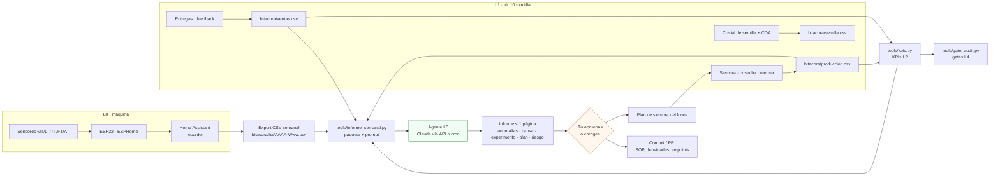
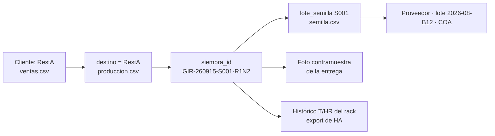

# Diseño de datos

**En una línea:** la bitácora CSV es el sensor de los lazos L2–L4, Home Assistant guarda lo
que miden los nodos, y cada domingo `tools/informe_semanal.py` junta ambos y se los entrega
al agente L3, que propone anomalías, causas, un experimento y el plan de siembra; tú apruebas.

!!! info "Qué decide esta página"
    - **Esquema de la bitácora** (`bitacora/*.csv`), el **formato de lote** `VAR-AAMMDD-Slote-pos`
      y las reglas de captura que hacen posible un mock recall en < 2 h.
    - **Entidades de Home Assistant** por nodo (nombres que usan el firmware, las
      automatizaciones y el export).
    - **Retención y exportación**: qué se guarda, cuánto tiempo y dónde.
    - **El flujo semanal** hacia los KPIs L2, el informe del agente L3 y los gates L4, con el
      contrato de prompt exacto.
    - **Prerequisitos:** [Cómo usar esta guía](../empieza-aqui/como-usar-esta-guia.md),
      [Control](control.md), [06-validacion](../referencia/06-validacion-y-lazos-agenticos.md).

## Vista general



Regla de diseño ([06-validacion](../referencia/06-validacion-y-lazos-agenticos.md)): **el
agente nunca ejecuta compras ni cambia setpoints solo**; el PR es el mecanismo de aprobación
y el historial de informes + decisiones se vuelve el manual de operación real del huerto.

## 1. Bitácora: la fuente de verdad de producción y ventas

Un CSV por tema, versionado en este repo, **una fila por evento, llenada el mismo día**
(30 s por evento), nunca de memoria al final de la semana. Plantillas con encabezado en
[`bitacora/`](https://github.com/AndresIslas99/HomeGreen/blob/main/bitacora/produccion.csv).

### `bitacora/produccion.csv`

| Campo | Tipo | Ejemplo | Regla |
|---|---|---|---|
| `siembra_id` | texto, clave | `GIR-260915-S001-R1N2` | Formato de lote (abajo); el mismo código va en masking tape sobre la charola y en la etiqueta al empacar |
| `fecha_siembra` | AAAA-MM-DD | `2026-09-15` | El día real de siembra, no el planeado |
| `variedad` | texto | `girasol` | Minúsculas, sin acentos: `girasol`, `chicharo`, `rabano`, `betabel`, `brocoli`, `arugula`, `amaranto`, `cilantro`, `albahaca` |
| `lote_semilla` | texto | `S001` | Consecutivo interno del costal; se resuelve en `semilla.csv` |
| `densidad_g` | entero | `135` | Gramos de semilla seca por charola 1020 |
| `dias_oscuridad` | entero | `3` | Días con charola invertida y peso |
| `fecha_cosecha` | AAAA-MM-DD | `2026-09-24` | Vacío mientras la charola está en el rack |
| `rendimiento_g` | entero | `420` | Gramos cosechados, pesados (la báscula, no el ojo) |
| `merma_pct` | entero | `5` | % de la charola tirado o no vendible; `100` si se tiró completa (moho, plaga) |
| `destino` | texto | `RestA` | Cliente (mismo nombre que en `ventas.csv`), `muestra`, `casa` o `basura` |
| `precio_mxn` | número | `105` | Precio de venta de esa charola o su parte |
| `observaciones` | texto libre | `primer lote proveedor nuevo; sanitizado H2O2 3%` | Sanitización, remojo, incidencias, temperatura de entrega, número de remisión |

Fila de ejemplo (de [06-validacion](../referencia/06-validacion-y-lazos-agenticos.md)):

```csv
siembra_id,fecha_siembra,variedad,lote_semilla,densidad_g,dias_oscuridad,fecha_cosecha,rendimiento_g,merma_pct,destino,precio_mxn,observaciones
GIR-260915-S001-R1N2,2026-09-15,girasol,S001,135,3,2026-09-24,420,5,RestA,105,primer lote proveedor nuevo; sanitizado H2O2 3%
```

Los campos que [research/inocuidad-operativa §5](../research/inocuidad-operativa.md) pide
por charola y que aquí van en `observaciones` (o en columnas extra si prefieres, sin quitar
las 12 base): sanitización de semilla (método, temperatura, minutos, operador), remojo (h,
fuente de agua), lote de la paca de coco, fuente del agua de riego, fecha de destape,
incidencias, número de remisión y temperatura a la entrega.

### `bitacora/ventas.csv`

| Campo | Tipo | Ejemplo | Regla |
|---|---|---|---|
| `fecha` | AAAA-MM-DD | `2026-09-24` | Fecha de entrega |
| `cliente` | texto | `RestA` | Mismo nombre que `destino` en producción; el cliente es el restaurante, no el chef |
| `producto` | texto | `charola girasol` / `clamshell 100 g rabano` | Formato + variedad |
| `cantidad` | entero | `4` | Piezas entregadas |
| `precio_unit_mxn` | número | `105` | Lista $90–120 charola viva; finas $130–180; clamshell $50–90 ([00-plan-maestro](../referencia/00-plan-maestro.md)) |
| `entregado_a_tiempo` | `si` / `no` | `si` | Dentro de la ventana pactada (p. ej. martes 9–12 h) |
| `feedback` | texto libre | `quiere más arúgula` | La respuesta a la única pregunta por WhatsApp tras la entrega |

### `bitacora/semilla.csv` (registro de costales — propuesta de este diseño)

[06-validacion](../referencia/06-validacion-y-lazos-agenticos.md) pide que `S001` esté
"ligado en un registro aparte al proveedor, su lote y su COA"; este es ese registro.

| Campo | Ejemplo | Regla |
|---|---|---|
| `lote_semilla` | `S001` | Clave; consecutivo desde el primer costal |
| `variedad` | `girasol` | |
| `proveedor` | `Hydro Environment` / `CEDA` | Con enlace o teléfono en observaciones |
| `lote_proveedor` | `2026-08-B12` | El impreso en el costal |
| `coa` | `si` / `no` | Certificado de análisis (negativo a *Salmonella*/E. coli); archivo en `bitacora/coa/S001.pdf` |
| `fecha_compra` | `2026-09-10` | |
| `kg` | `5` | |
| `germinacion_v1_pct` | `92` | Prueba V1 de 50 semillas; aceptar ≥ 85 % (girasol y chícharo ≥ 80 %) |
| `observaciones` | `flotantes 3 %` | |

Otros CSV que proponen las páginas hermanas: `bitacora/electrico.csv` (tierra, GFCI,
simulacros; [electrico.md](electrico.md)) y, en Fase 2, el registro de cambios de solución
NFT ([cambiar-solucion-nft](../guias/cambiar-solucion-nft.md)).

### Formato de lote `VAR-AAMMDD-Slote-pos`

```
[VARIEDAD 3 letras]-[AAMMDD siembra]-[S + lote semilla]-[posición]
GIR-260915-S001-R1N2  →  girasol · sembrado 15-sep-2026 · costal S001 · rack 1, nivel 2
```

- Legible por humanos, rastreable en minutos **hacia atrás** (qué costal, qué COA) y
  **hacia adelante** (qué clientes) ([06-validacion](../referencia/06-validacion-y-lazos-agenticos.md),
  [research/inocuidad-operativa §5](../research/inocuidad-operativa.md)).
- Se escribe en masking tape sobre la charola el día de siembra y se copia a la etiqueta al
  empacar (machote de etiqueta B2B en el informe de inocuidad).
- Códigos de variedad (tabla propuesta; la fuente solo ejemplifica `GIR`): `GIR` girasol ·
  `CHI` chícharo · `RAB` rábano · `BET` betabel · `BRO` brócoli · `ARU` arúgula · `AMA`
  amaranto · `CIL` cilantro · `ALB` albahaca · `HIE` hierbabuena.
- Posición: `R<rack>N<nivel>` en microgreens. Para hierbas NFT
  `[POR VERIFICAR: extender el formato a línea y canastilla, p. ej. ALB-261005-S012-L3; la
  fuente solo define rack y nivel — decidirlo antes del primer trasplante de Fase 2]`.
- Validación en `tools/kpis.py`: expresión `^[A-Z]{3}-\d{6}-S\d{3}-R\dN\d$`; una fila que no
  cumple se reporta, no se descarta.

### Trazabilidad en dos sentidos (mock recall V10)



Una vez al año, elegir un lote al azar y demostrar en **< 2 horas** a qué clientes llegó y de
qué costal salió ([mock-recall](../guias/mock-recall.md), [validacion/v10](../validacion/v10-mock-recall.md)).

## 2. Entidades de Home Assistant

Nombres que usan `firmware/esphome/*.yaml`, `firmware/homeassistant/automations.yaml`,
`dashboard-huerto.yaml` y el export semanal. Los cinco marcados con ✔ vienen del YAML de
[research/electrico-respaldo-seguridad §5](../research/electrico-respaldo-seguridad.md); el
resto es la propuesta de este diseño `[POR VERIFICAR: que coincidan con los YAML de
firmware/ y con software/firmware.md; si cambias un nombre, cámbialo en los tres lugares]`.

### Nodo de riego v1 (`nodo-riego-v1`)

| Entidad | Tag | Unidad | Origen | Uso |
|---|---|---|---|---|
| `sensor.humedad_sustrato_n1` … `_n4` | MT-1…4 | % (ADC calibrado seco/saturado) | GPIO32–35 | Lazo de riego, gráfica por nivel |
| `sensor.temperatura_ambiente` | — | °C | SHT31 I2C | Ventilación, alarma de helada |
| `sensor.humedad_ambiente` | — | % HR | SHT31 | Ventilación, alarma HR 6 h |
| `sensor.temperatura_tinaco` | TT-1 | °C | DS18B20 GPIO4 | Informativo |
| `sensor.nivel_tinaco` | LT-1 | % (de distancia JSN-SR04T) | GPIO5/18 | Interlocks, advertencia < 40 %, crítica < 20 % |
| `switch.bomba_riego` | P-1 (riego) | on/off | Relé K1 GPIO25 | Actuador del lazo de riego |
| `switch.ventilador` | — | on/off | K2 GPIO26 | Ventilación |
| `switch.luces_t8` | — | on/off | K3 GPIO27 → K5 | Fotoperiodo 12–14 h |
| `switch.reserva_k4` | — | on/off | K4 GPIO14 | Tapete térmico dic–feb o luz nivel 5 |
| `counter.ciclos_riego_hora` | — | ciclos | HA helper | Watchdog N ciclos/h |

### Nodo NFT v2 (`nodo-nft-v2`)

| Entidad | Tag | Unidad | Origen | Uso |
|---|---|---|---|---|
| `sensor.ph_nft` | AT-1 | pH | GPIO34 vía RC | Lazo pH, sonda no confiable |
| `sensor.ec_nft` | AT-2 | mS/cm | GPIO35 | Lazo EC |
| `sensor.temperatura_solucion` | TT-2 | °C | DS18B20 GPIO4 | Advertencia > 25 °C |
| `sensor.flujo_nft` ✔ | FT-1 | L/min (450 pulsos/L) | `pulse_counter` GPIO27 | Watchdog bomba sin flujo |
| `binary_sensor.red_cfe_presente` ✔ | — | on/off | GPIO23, `delayed_off: 5s` | Aviso de corte, escalación |
| `sensor.voltaje_bateria_nft` ✔ | — | V (×5.7) | GPIO36 | Modo ahorro < 12.9 V |
| `switch.bomba_nft` ✔ | P-1 (NFT) | on/off | K1 NC GPIO14, `restore_mode: RESTORE_DEFAULT_ON` | Reposo = ON |
| `switch.bomba_nft_respaldo` ✔ | P-2 | on/off | K2 GPIO32 | Respaldo por flujo cero |
| `switch.peristaltica_a`, `_b`, `_ph` | DP-1/2/3 | on/off | MOSFET GPIO25/26/33 | Dosificación |
| `switch.solenoide_llenado`, `switch.solenoide_purga` | SV-1 / SV-2 | on/off | GPIO12 / 13 | Llenado y purga |
| `binary_sensor.nivel_tambo_bajo` | LT-2 | on/off | `[POR VERIFICAR: sensor a definir]` | Interlock |
| `binary_sensor.nft_emergencia` | — | template | `red_cfe` off **y** flujo < 2 | `alert` cada 10 min |
| `counter.ml_dosificados_dia` (×3) | — | mL | HA helper | Watchdog de deriva 2× |
| `input_number.setpoint_ph_min/max`, `..._ec_min/max`, `..._hr_on/off` | — | — | HA helper | Setpoints visibles y versionados |
| `calendar.huerto` | — | — | HA | Calibración quincenal, cambio de solución, simulacro mensual |

Nombres de los nodos y pines: [electrico.md](electrico.md). Qué corre dónde: [control.md](control.md).

## 3. Retención y exportación

| Dato | Dónde vive | Cuánto tiempo | Fuente de la regla |
|---|---|---|---|
| Lecturas de sensores (cada 10–30 s) | `recorder` de HA en el mini PC | `[POR VERIFICAR: la fuente no fija días; propuesta 30 días de detalle + estadísticas de largo plazo de HA]` | — |
| Export semanal (T, HR, pH, EC, riegos, alarmas) | `bitacora/ha/AAAA-Www.csv` en este repo (propuesta) | ≥ 12 meses | Insumo del informe L3 ([06 §L3](../referencia/06-validacion-y-lazos-agenticos.md)); bitácoras ≥ 12 meses ([research/inocuidad-operativa §4](../research/inocuidad-operativa.md)) |
| `bitacora/produccion.csv`, `ventas.csv`, `semilla.csv`, `electrico.csv` | Git | Para siempre (son pequeños) | Trazabilidad V10 y gates L4 |
| Informes del agente y decisiones | `bitacora/informes/AAAA-Www.md` (propuesta) + mensajes de commit | Para siempre | "El histórico de informes + decisiones se vuelve el manual de operación" ([06 §L3](../referencia/06-validacion-y-lazos-agenticos.md)) |
| Fotos contramuestra de cada entrega | Carpeta por fecha (fuera de Git) | 12 meses | [research/inocuidad-operativa §5](../research/inocuidad-operativa.md) |
| COA de semilla, resultados de laboratorio | `bitacora/coa/`, carpeta de inocuidad | Vigencia < 6 meses para el paquete B2B; archivo permanente | [research/inocuidad-operativa §6](../research/inocuidad-operativa.md) |
| Timesheet V9 | `bitacora/timesheet.csv` (propuesta; [timesheet-semanal](../guias/timesheet-semanal.md)) | 4 semanas mínimo, luego mensual | [06 §V9](../referencia/06-validacion-y-lazos-agenticos.md) |

Opcional en el mini PC: InfluxDB + Grafana para el histórico largo y el dashboard que se
enseña a los chefs ("hierbas monitoreadas 24/7") — el CSV semanal sigue siendo el insumo
del agente ([06 §L3](../referencia/06-validacion-y-lazos-agenticos.md),
[research/electronica-automatizacion](../research/electronica-automatizacion.md)).

## 4. KPIs L2 desde la bitácora (`tools/kpis.py`)

| KPI | Fórmula con columnas | Meta | Umbral rojo |
|---|---|---|---|
| Sell-through | charolas con `destino` = cliente ÷ charolas con `fecha_cosecha` en la semana | ≥ 90 % | < 75 % dos semanas seguidas → **no sembrar más volumen** |
| Merma de producción | charolas con `merma_pct` = 100 (o suma de merma) ÷ charolas sembradas | ≤ 10 % | > 20 % → congelar variedad nueva, correr V8 |
| Entregas a tiempo | `entregado_a_tiempo` = si ÷ filas de `ventas.csv` | 100 % | < 90 % |
| Recompra | clientes con pedido esta semana **y** la anterior ÷ clientes de la anterior | ≥ 80 % | cliente ancla sin pedir 2 semanas → visita presencial |
| Margen variable | (`precio_unit_mxn` − insumos − reparto) ÷ precio; insumos por variedad de [08-recetas](../referencia/08-recetas-y-economia-unitaria.md) | ≥ 60 % | < 45 % |
| CAC | horas de venta + muestras (`destino` = muestra) ÷ clientes nuevos | a la baja | > 3 visitas y 3 muestras por cliente |
| Feedback | filas con `feedback` no vacío ÷ entregas | ≥ 50 % | 2 quejas del mismo tipo |

Definiciones, metas y reglas de decisión: [06 §L2](../referencia/06-validacion-y-lazos-agenticos.md)
y [validacion/kpis](../validacion/kpis.md). `tools/kpis.py` solo usa la biblioteca estándar
de Python 3.11 y escribe una tabla Markdown ([software/herramientas-cli](../software/herramientas-cli.md)).

## 5. El flujo semanal hacia el informe del agente L3


La semana tipo de la animación sale de [00-plan-maestro](../referencia/00-plan-maestro.md)
(siembras lunes y jueves), [03-instalacion §0.3](../referencia/03-instalacion.md) (cosecha
la mañana del día de entrega), [research/cobranza-b2b](../research/cobranza-b2b.md) (fresh
sheet domingo 18:00, confirmación lunes 12:00, recordatorio lunes 9:00, corte de factura
viernes; el machote pone la entrega en "martes y/o jueves" como marcador: los días de ruta
se pactan con cada cliente) y [06-validacion](../referencia/06-validacion-y-lazos-agenticos.md)
(L1 diario, L2 y L3 el domingo, calibración quincenal, V8 semanal, V11 mensual).

### Qué recibe el agente cada domingo

1. Export CSV de Home Assistant (o InfluxDB) de la semana: T, HR, pH, EC, riegos, alarmas.
2. `bitacora/produccion.csv` (siembras, cosechas, mermas).
3. `bitacora/ventas.csv` con el feedback de clientes.
4. Los KPIs de L2 y los experimentos V6 activos.

`tools/informe_semanal.py` arma ese paquete (recorta a las últimas 5 semanas para comparar
la actual con las 4 anteriores) y le antepone **este contrato, sin cambios**
([06 §L3](../referencia/06-validacion-y-lazos-agenticos.md)):

```text
Eres el agrónomo/analista de un microhuerto comercial en CDMX. Con los CSV adjuntos:
1. ANOMALÍAS: desviaciones de la semana vs las 4 anteriores (ambiente, consumo de agua,
   dosificación, rendimiento por variedad). Solo las significativas, con evidencia numérica.
2. CAUSA PROBABLE: para cada anomalía, hipótesis rankeadas y qué dato falta para confirmar.
3. EXPERIMENTO: propone máximo UN experimento A/B para la semana entrante (formato V6),
   con métrica, tamaño de muestra (charolas) y criterio de éxito.
4. PLAN: borrador de plan de siembra de la semana (variedades y cantidades) a partir de
   pedidos recurrentes + sell-through, con su razonamiento.
5. RIESGO: la única cosa que más probabilidad tiene de salir mal la próxima semana.
Responde en ≤ 1 página. No inventes datos: si un CSV está vacío o roto, dilo.
```

### Qué pasa con la respuesta

```mermaid
sequenceDiagram
    participant T as Tú, domingo
    participant S as tools/informe_semanal.py
    participant A as Agente L3
    participant G as Git / firmware
    T->>S: exportar CSV de HA + bitácora
    S->>A: paquete de 5 semanas + contrato de prompt
    A-->>T: informe ≤ 1 página (anomalías, causa, 1 experimento, plan, riesgo)
    T->>T: aprobar o corregir el plan de siembra
    T->>G: commit del informe + decisión (bitacora/informes/AAAA-Www.md)
    T->>G: si cambia un SOP, densidad o setpoint: commit con la evidencia
    Note over A,G: Nivel 2 (Fase 2+): el agente lee la API de HA y abre PRs; el merge lo haces tú
```

- **El humano aprueba o corrige; el agente nunca ejecuta compras ni cambia setpoints solo.**
- Máximo **un** experimento V6 activo a la vez; se adopta el cambio solo si mejora ≥ 10 % la
  métrica primaria sin empeorar las secundarias ([validacion/v06](../validacion/v06-experimento-ab.md)).
- Si un CSV llega vacío o roto, el informe lo dice y esa semana se arregla la captura, no
  el cultivo.
- El agente corre como Claude vía API o como una sesión de Claude Code lanzada por cron
  ([06 §L3](../referencia/06-validacion-y-lazos-agenticos.md)); la clave de API vive fuera
  del repo (`secrets`), nunca en el YAML ni en el CSV.

## 6. Gates L4 desde los datos (`tools/gate_audit.py`)

| Gate | Métrica que lee | De dónde | Umbral |
|---|---|---|---|
| G0→1 | clientes con ≥ 3 compras semanales consecutivas | `ventas.csv` | ≥ 2 |
| G0→1 (b) | margen variable en ventas reales | `ventas.csv` + insumos de [08-recetas](../referencia/08-recetas-y-economia-unitaria.md) | ≥ 55 % |
| G1→2 | clientes fijos + pedidos rechazados 2 semanas seguidas | `ventas.csv` + `observaciones` | 4–5 fijos |
| G1→2 (b) | alarmas críticas por semana y pérdidas por fallo de riego en 30 días | export de HA + `produccion.csv` | < 2/semana y cero |
| G2→3 | neto mensual por 3 meses y horas/semana | contabilidad + `timesheet.csv` | ≥ $12k/mes y ≤ 9 h |

Un gate no alcanzado no se renegocia a la baja; se itera o se detiene
([06 §L4](../referencia/06-validacion-y-lazos-agenticos.md), [validacion/gates](../validacion/gates.md)).

## Errores típicos

!!! warning "Llenar la bitácora el domingo de memoria"
    Los rendimientos se inventan y la merma desaparece. 30 s por evento, el mismo día, con la
    báscula enfrente.

!!! warning "Charola sin masking tape"
    Sin `siembra_id` físico, el mock recall se vuelve una adivinanza. Cinta y plumón indeleble
    el día de siembra; QR después si dan ganas.

!!! warning "Cambiar el nombre de una entidad en un solo lugar"
    Las automatizaciones dejan de disparar en silencio. Firmware, `automations.yaml`,
    dashboard y esta tabla en el mismo commit.

!!! warning "Dejar que el agente 'arregle' el setpoint"
    El informe propone; el commit lo haces tú con la evidencia en el mensaje. Un agente con
    permiso de escritura sobre el YAML es un lazo sin humano.

!!! warning "Exportar solo cuando algo salió mal"
    Sin las 4 semanas anteriores el agente no puede decir qué es anómalo. El export es
    dominical, siempre, aunque la semana haya sido aburrida.

## Al terminar

- [ ] `bitacora/produccion.csv` y `ventas.csv` tienen filas reales desde la charola #1; `semilla.csv` tiene el costal S001 con su V1.
- [ ] Cada charola del rack tiene su `siembra_id` en masking tape y coincide con el CSV.
- [ ] Las entidades de HA de la sección 2 existen con esos nombres (o la tabla se actualizó).
- [ ] Hubo un domingo completo: export → `informe_semanal.py` → informe → plan aprobado → commit.
- [ ] Un mock recall de prueba (V10) tomó menos de 2 h.
- Registrar en bitácora: el informe y la decisión de cada domingo en `bitacora/informes/AAAA-Www.md`.
- Siguiente paso: [Timesheet semanal](../guias/timesheet-semanal.md) →
  [KPIs](../validacion/kpis.md) → [Gates](../validacion/gates.md) →
  [Herramientas CLI](../software/herramientas-cli.md).

## Fuentes

- [referencia/06-validacion-y-lazos-agenticos.md](../referencia/06-validacion-y-lazos-agenticos.md) — esquema de datos, formato de lote, L2/L3/L4, contrato de prompt, V6/V9/V10.
- [research/inocuidad-operativa.md](../research/inocuidad-operativa.md) — §4 registros ≥ 12 meses, §5 trazabilidad por lote y campos por charola, §6 paquete documental.
- [research/electrico-respaldo-seguridad.md](../research/electrico-respaldo-seguridad.md) — §5 nombres de entidades del nodo NFT y automatizaciones.
- [referencia/00-plan-maestro.md](../referencia/00-plan-maestro.md), [03-instalacion.md](../referencia/03-instalacion.md) y [research/cobranza-b2b.md](../research/cobranza-b2b.md) — semana operativa (siembras, cosecha, cobro).
- [referencia/08-recetas-y-economia-unitaria.md](../referencia/08-recetas-y-economia-unitaria.md) — insumos por variedad para el margen.
- [diseno/electrico.md](electrico.md) y [diseno/hidraulico.md](hidraulico.md) — pines y tags que nombran las entidades.
