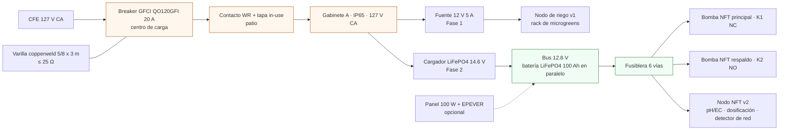
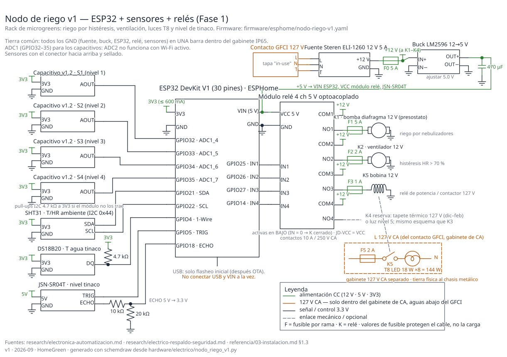
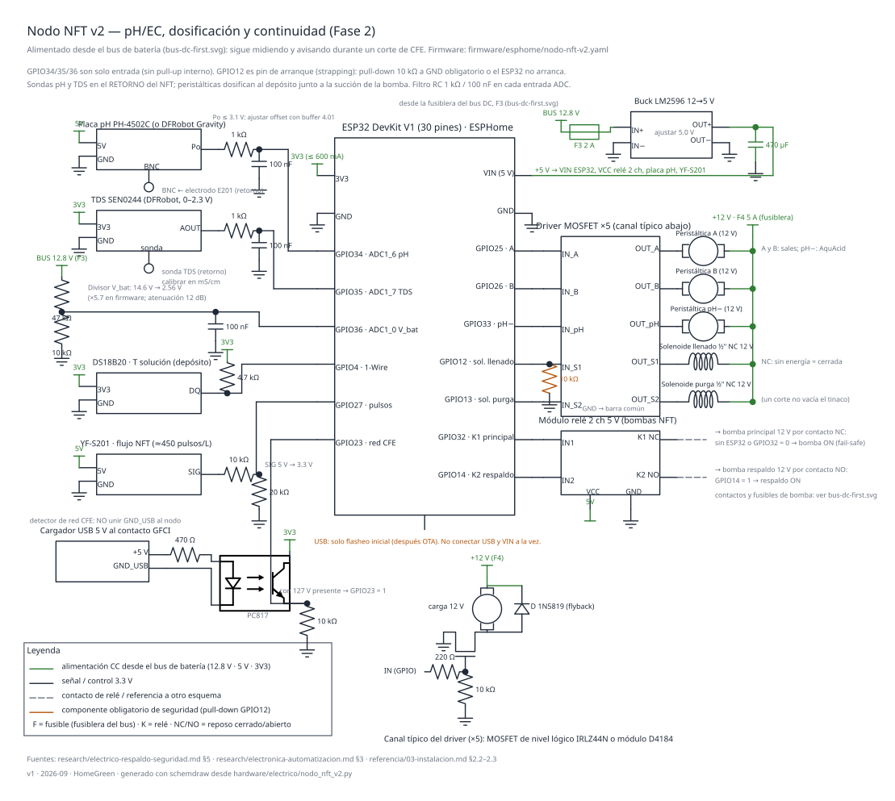
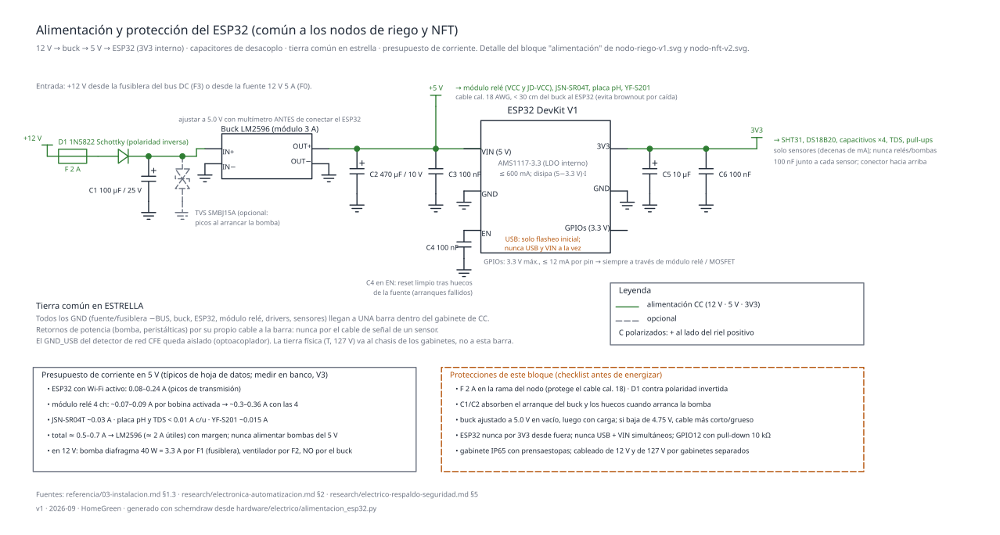

# Diseño eléctrico

**En una línea:** cómo se alimenta, se protege y se cablea todo lo eléctrico del huerto (dos nodos ESP32, relés, bombas, luces y el respaldo del NFT) para que nadie se electrocute con las manos mojadas, nada se incendie y la bomba del NFT no se detenga cuando CFE corte la luz.

!!! info "Antes de empezar"
    - **Tiempo:** 30 min de lectura; el armado se reparte en [Fase 1](../fases/fase-1/automatizacion-v1.md) (nodo de riego) y [Fase 2](../fases/fase-2/electrico-respaldo.md) (NFT + respaldo). · **Costo:** electrónica v1 ~$3,200–4,800; paquete respaldo + seguridad ~$8,500–14,500 (fuente: [research/electrico-respaldo-seguridad.md §6](../research/electrico-respaldo-seguridad.md)). · **Personas:** tú + medio día de electricista certificado para GFCI y tierra.
    - **Necesitas:** las listas de [compras Fase 1](../fases/fase-1/compras.md) y [compras Fase 2](../fases/fase-2/compras.md) (o el [BOM por fase](../referencia/bom.md)), multímetro, cautín, prensaestopas y dos gabinetes IP65.
    - **Prerequisitos:** [Antes de gastar un peso](../empieza-aqui/antes-de-gastar-un-peso.md) (consumo actual del recibo CFE y tarifa DAC), [Instalar GFCI y tierra](../guias/instalar-gfci-y-tierra.md), [Montar gabinete IP65](../guias/montar-gabinete-ip65.md).

## Visión general

Seis reglas que gobiernan todo el diseño; cada esquema de abajo es una de ellas hecha dibujo:

1. **Seguridad antes del primer relé.** El patio es "lugar mojado" según la NOM-001-SEDE-2012: GFCI en todo el circuito exterior, contacto WR con tapa "in-use", tierra física real (≤ 25 Ω) y toda la electrónica en gabinete IP65 ([03-instalacion §1.3](../referencia/03-instalacion.md)).
2. **127 V CA y 12 V CC nunca en el mismo gabinete.** Gabinete A (CA: cargador, fuente 12 V) y gabinete B (CC: fusiblera, relés, buck, ESP32).
3. **DC-first para el NFT.** La bomba de recirculación es de 12 V y cuelga de una batería LiFePO4 que está *siempre* en paralelo con el cargador: el corte de CFE no se conmuta, no se nota ([03-instalacion §2.3](../referencia/03-instalacion.md)).
4. **El fail-safe es físico, no de software.** La bomba principal va por un contacto normalmente cerrado (NC): sin ESP32, sin Wi-Fi y sin Home Assistant, la bomba sigue.
5. **Cada fusible protege un cable, no una carga.** Fusible principal en el borne de la batería y una fusiblera con un fusible por rama.
6. **Tierra común en estrella.** Todos los retornos de 12 V a una sola barra; la tierra física de 127 V va al chasis de los gabinetes, no a esa barra.

| Esquema | Qué resuelve | Fase | Script que lo genera |
|---|---|---|---|
| [Nodo de riego v1](#1-nodo-de-riego-v1) | Riego por histéresis, ventilación, luces T8, nivel de tinaco | 1 | `hardware/electrico/nodo_riego_v1.py` |
| [Nodo NFT v2](#2-nodo-nft-v2) | pH/EC, dosificación, flujo, detector de red CFE, voltaje de batería | 2 | `hardware/electrico/nodo_nft_v2.py` |
| [Bus DC-first](#3-bus-dc-first) | Continuidad de la bomba NFT ante cortes (batería + fusiblera + K1/K2) | 2 | `hardware/electrico/bus_dc_first.py` |
| [Tablero, GFCI y tierra](#4-tablero-gfci-y-tierra-fisica) | Circuito de 127 V del patio, GFCI, contacto intemperie, electrodo de tierra | 1 | `hardware/electrico/tablero_gfci_tierra.py` |
| [Alimentación del ESP32](#5-alimentacion-y-proteccion-del-esp32) | 12 V → 5 V → 3V3, desacoplo, tierra en estrella, presupuesto de corriente | 1 y 2 | `hardware/electrico/alimentacion_esp32.py` |

Los cinco SVG viven en `docs/assets/diagramas/electrico/` y se regeneran con `python3 hardware/electrico/<script>.py` (necesitan `schemdraw` 0.23). Cada uno lleva título, leyenda, fuentes y la marca `v1 · 2026-09`.

## Los cinco esquemas

### 1. Nodo de riego v1

**Qué muestra.** El nodo que vive en el gabinete IP65 junto al rack: un ESP32 DevKit V1 lee 4 sensores capacitivos de humedad de sustrato (uno por nivel del rack), el SHT31 de temperatura/humedad ambiente, el DS18B20 del tinaco y el JSN-SR04T de nivel; y manda un módulo relé de 4 canales que conmuta la bomba de diafragma de 12 V (riego por nebulizadores), el ventilador, las luces T8 y una reserva.

**Decisiones clave.**

- Los 4 capacitivos van a **ADC1** (GPIO32–35): ADC2 deja de funcionar en cuanto el Wi-Fi está activo. GPIO34/35 son solo entrada, perfectos para sensores.
- El ECHO del JSN-SR04T es de 5 V: divisor 10 kΩ / 20 kΩ antes de GPIO18. El TRIG va directo (el módulo acepta 3.3 V).
- Las luces T8 (8 × 18 W = 144 W, [bom/fase1.csv](../referencia/bom.md)) **no** se conmutan con el contacto del módulo relé de 5 V: el canal K3 excita la bobina de 12 V de un relé de potencia/contactor que vive en el gabinete de CA. Así el módulo relé nunca ve 127 V.
- K4 queda libre para el tapete térmico de dic–feb (mismo esquema que K3) o la luz del quinto nivel.
- Alimentación: fuente Steren ELI-1260 12 V 5 A ($399, [research/electronica-automatizacion.md §2](../research/electronica-automatizacion.md)) con fusible general F0 5 A, y un buck LM2596 ajustado a 5.0 V para el ESP32, el módulo relé y el JSN-SR04T. Para intemperie, la alternativa Mean Well IP67 XLG-75-12-A.

**Cómo leerlo.** Verde = alimentación CC; ámbar = 127 V (solo dentro del gabinete de CA); negro = señal 3.3 V. Las entradas del módulo relé son activas en bajo: en ESPHome el `switch` lleva `inverted: true`.

### 2. Nodo NFT v2

**Qué muestra.** El nodo de Fase 2, alimentado desde el bus de batería (por eso sigue midiendo y avisando durante un corte). Entradas: placa pH (PH-4502C para validar el lazo, DFRobot Gravity cuando el NFT venda), TDS SEN0244, DS18B20 del depósito, YF-S201 de flujo, detector de presencia de red CFE y divisor 47 kΩ / 10 kΩ para leer el voltaje de la batería. Salidas: 3 peristálticas (A, B, pH−) y 2 solenoides ½" NC vía driver MOSFET, y un módulo relé de 2 canales para las bombas principal (K1) y respaldo (K2) del bus.

**Decisiones clave.**

- **Sondas pH y TDS en el retorno** del NFT, nunca junto a la salida de dosificación ([03-instalacion §2.2](../referencia/03-instalacion.md)). Filtro RC 1 kΩ / 100 nF en cada entrada ADC: el ADC del ESP32 es ruidoso y las sondas son de alta impedancia.
- **Detector de red CFE aislado.** Un cargador USB de 5 V enchufado al contacto GFCI del patio alimenta el LED de un optoacoplador PC817 (470 Ω en serie); el fototransistor lleva GPIO23 a 3V3 cuando hay 127 V. GPIO23 se configura `INPUT_PULLDOWN` (más 10 kΩ externo). El GND del cargador USB **no** se une al GND del nodo: esa es la gracia del optoacoplador.
- **Divisor de batería 47k/10k → GPIO36:** 14.6 V (absorción del cargador) se vuelven 2.56 V; en ESPHome `attenuation: 12db` y `multiply: 5.7` ([research/electrico-respaldo-seguridad.md §5.1](../research/electrico-respaldo-seguridad.md)).
- **GPIO12 es pin de arranque (strapping):** si está alto al encender, el ESP32 no arranca. Lleva pull-down de 10 kΩ obligatorio y se maneja por MOSFET (no por módulo relé activo en bajo, que lo dejaría alto).
- **K1 por contacto NC:** con el ESP32 apagado o GPIO32 en bajo, la bomba principal está encendida. Solo se energiza K1 para apagarla (mantenimiento). K2 (NO, en GPIO14) enciende la bomba de respaldo cuando el YF-S201 reporta flujo cero con bomba comandada. **La principal va en GPIO32 y no en GPIO14 a propósito:** GPIO14 emite un pulso al arrancar el ESP32 y en la principal eso sería un corte breve del riego.
- Solenoides **NC**: un corte de luz no vacía el tinaco ([bom/fase2.csv](../referencia/bom.md)).

### 3. Bus DC-first

**Qué muestra.** La arquitectura de continuidad ([03-instalacion §2.3](../referencia/03-instalacion.md)): CFE → GFCI → contacto intemperie → cargador LiFePO4 (14.4–14.6 V absorción, ≤ 13.6 V flotación) → nodo +BUS. La batería Epcom LI100A12PRO (12.8 V 100 Ah, $4,459 verificado) se conecta a ese mismo nodo a través de un fusible principal F0 de 30 A a ≤ 30 cm del borne y un seccionador S1. De la fusiblera salen F1 (bomba principal, 10 A, contacto K1 NC), F2 (bomba respaldo, 10 A, K2 NO), F3 (nodo NFT, 2 A), F4 (peristálticas y solenoides, 5 A), F5 (reserva) y F6 (libre). El panel Ugreen de 100 W con controlador EPEVER LS2024B es opcional y se conecta en paralelo al mismo nodo.

**Por qué así y no con inversor.** Respaldar la periférica de 0.5 HP a 120 V exigiría ~680 Ah y >$30,000 en baterías; una bomba de diafragma de 12 V de 40 W necesita ~40 Ah para 12 h ([research/electrico-respaldo-seguridad.md §2](../research/electrico-respaldo-seguridad.md)). La periférica de 127 V queda solo para llenado y purga.

El comportamiento en el tiempo (corte → batería → respaldo → restauración) está animado en [dc-first-failover.svg](../assets/diagramas/animaciones/dc-first-failover.svg) y se prueba con el [simulacro de apagón](../guias/simulacro-de-apagon.md) (validación [V11](../validacion/v11-apagon.md)).

### 4. Tablero, GFCI y tierra física

**Qué muestra.** El circuito de 127 V que sale de la casa al patio: breaker Square D QO120GFI de 20 A ($1,159 verificado) en el centro de carga, conductores calibre 12 AWG THW-LS en conduit hasta un contacto dúplex WR con tapa "in-use" (~$249 aprox.), clavija de uso rudo SJT al gabinete A (CA) y de ahí 12 V al gabinete B (CC). Abajo, el electrodo: varilla copperweld 5/8" × 3 m unida con abrazadera de bronce o soldadura exotérmica a un conductor calibre 8 AWG continuo hasta la barra de tierra del centro de carga. El puente de unión neutro–tierra existe **solo** en el centro de carga principal.

**Qué pedirle al electricista.** Los 25 Ω medidos con telurómetro por escrito; si sale más, segunda varilla en paralelo o intensificador de tierra (GEM). Botón TEST del GFCI cada mes. Si el presupuesto no da para el breaker GFCI, la alternativa mínima es un contacto GFCI Square D ($389) aguas arriba de todo lo del patio ([research/electrico-respaldo-seguridad.md §3.6](../research/electrico-respaldo-seguridad.md)).

!!! danger "GFCI y tierra no se sustituyen entre sí"
    El GFCI dispara con ~5 mA de fuga y protege personas; la tierra da camino de falla y protege equipos. Se necesitan los dos. Un GFCI que "dispara mucho" está detectando una fuga real (una fuente goteada, un cable pelado en el tinaco): se busca la fuga, no se quita el GFCI.

### 5. Alimentación y protección del ESP32

**Qué muestra.** El bloque que se repite en ambos nodos: +12 V (de la fusiblera o de la fuente) → fusible 2 A → diodo Schottky 1N5822 contra polaridad invertida → C1 100 µF (+ TVS SMBJ15A opcional para los picos de la bomba) → buck LM2596 ajustado a 5.0 V **antes** de conectar el ESP32 → C2 470 µF + C3 100 nF → VIN. El regulador AMS1117 interno entrega los 3V3 para sensores; C5 10 µF + C6 100 nF en ese riel y 100 nF junto a cada sensor. C4 100 nF en EN evita arranques fallidos cuando la fuente tiene huecos.

**Regla de oro:** el 3V3 del ESP32 solo alimenta sensores (decenas de mA). Relés, bombas y ventiladores se alimentan del 12 V (por su propio fusible) o del 5 V del buck (módulo relé), nunca del ESP32.

## Tabla de pines por nodo

Los pines de esta tabla son los que usa el firmware (`firmware/esphome/nodo-riego-v1.yaml` y `nodo-nft-v2.yaml`, documentados en [Firmware ESPHome](../software/firmware.md)). Si cambias un pin, cámbialo en los tres lugares: YAML, script del esquema y esta tabla.

### Nodo de riego v1 (ESP32 DevKit V1, 30 pines)

| GPIO | Canal | Función | Periférico | Componente ESPHome | Notas |
|---|---|---|---|---|---|
| 32 | ADC1_CH4 | entrada analógica | Capacitivo S1 (nivel 1) | `adc`, `attenuation: 12db` | ADC1 funciona con Wi-Fi activo |
| 33 | ADC1_CH5 | entrada analógica | Capacitivo S2 (nivel 2) | `adc` | |
| 34 | ADC1_CH6 | entrada analógica | Capacitivo S3 (nivel 3) | `adc` | solo entrada, sin pull-up interno |
| 35 | ADC1_CH7 | entrada analógica | Capacitivo S4 (nivel 4) | `adc` | solo entrada |
| 21 | SDA | I2C | SHT31 (dirección 0x44) | `i2c`, `sht3xd` | pull-ups 4.7 kΩ a 3V3 si el módulo no los trae |
| 22 | SCL | I2C | SHT31 | `i2c` | |
| 4 | — | 1-Wire | DS18B20 tinaco | `one_wire`, `dallas_temp` | pull-up 4.7 kΩ a 3V3 |
| 5 | — | salida digital | JSN-SR04T TRIG | `ultrasonic` | pin de arranque: como salida no da problema |
| 18 | — | entrada digital | JSN-SR04T ECHO | `ultrasonic` | divisor 10 kΩ / 20 kΩ (ECHO es de 5 V) |
| 25 | — | salida | Relé K1: bomba diafragma 12 V | `switch` gpio, `inverted: true` | módulo activo en bajo |
| 26 | — | salida | Relé K2: ventilador 12 V | `switch` | |
| 27 | — | salida | Relé K3 → relé de potencia K5: luces T8 127 V | `switch` | K5 vive en el gabinete de CA |
| 14 | — | salida | Relé K4: reserva (tapete térmico / luz nivel 5) | `switch` | |
| VIN | — | 5 V | buck LM2596 | — | nunca USB y VIN a la vez |
| 3V3 | — | 3.3 V salida | capacitivos, SHT31, DS18B20 | — | ≤ 600 mA en total, solo sensores |

### Nodo NFT v2 (ESP32 DevKit V1, 30 pines)

| GPIO | Canal | Función | Periférico | Componente ESPHome | Notas |
|---|---|---|---|---|---|
| 34 | ADC1_CH6 | entrada analógica | Placa pH (Po) vía RC 1 kΩ / 100 nF | `adc` | solo entrada; Po ≤ 3.1 V ajustando el offset con buffer 4.01 |
| 35 | ADC1_CH7 | entrada analógica | TDS SEN0244 (AOUT) vía RC | `adc` | calibrar en mS/cm con patrón 1.413 |
| 36 | ADC1_CH0 (VP) | entrada analógica | Divisor 47 kΩ / 10 kΩ del bus 12.8 V | `adc`, `multiply: 5.7` | 14.6 V → 2.56 V |
| 4 | — | 1-Wire | DS18B20 del depósito | `one_wire`, `dallas_temp` | pull-up 4.7 kΩ |
| 27 | — | contador de pulsos | YF-S201 (≈ 450 pulsos/L) vía divisor 10k/20k | `pulse_counter` | señal Hall de 5 V |
| 23 | — | entrada digital | Detector de red CFE (PC817 desde cargador USB) | `binary_sensor` gpio, `INPUT_PULLDOWN` | 127 V presente → 1; GND_USB aislado |
| 25 | — | salida | Peristáltica A (12 V) vía MOSFET | `switch` | canal típico: 220 Ω gate, 10 kΩ pull-down, 1N5819 flyback |
| 26 | — | salida | Peristáltica B | `switch` | |
| 33 | — | salida | Peristáltica pH− (AquAcid) | `switch` | |
| 12 | — | salida | Solenoide llenado ½" NC | `switch` | **pin de arranque: pull-down 10 kΩ obligatorio** |
| 13 | — | salida | Solenoide purga ½" NC | `switch` | |
| 32 | — | salida | Relé K1 (contacto **NC**) → bomba NFT principal | `switch`, `RESTORE_DEFAULT_ON` | reposo = bomba ON (fail-safe) |
| 14 | — | salida | Relé K2 (contacto NO) → bomba NFT respaldo | `switch` `inverted: true`, `RESTORE_DEFAULT_OFF` | GPIO14 emite un pulso al arrancar el ESP32: en el respaldo (NO) es un parpadeo inofensivo; en la principal sería un corte |
| 16, 17 | — | entradas | Flotadores "tambo alto" / "tambo bajo" (LT-2, **opcionales**) | `binary_sensor` gpio, `INPUT_PULLUP` | cierran a GND; sin flotador, pines al aire y el interlock de nivel queda desactivado. LT-2 no está en `bom/fase2.csv` [POR VERIFICAR: elegir flotador con contacto o un segundo JSN-SR04T y agregarlo al BOM] |
| VIN | — | 5 V | buck desde F3 del bus | — | |

!!! note "Diferencias con el YAML del informe de investigación"
    El YAML de ejemplo en [research/electrico-respaldo-seguridad.md §5.1](../research/electrico-respaldo-seguridad.md) usa GPIO34 para el voltaje de batería, GPIO26 para la red CFE y GPIO25/33 para las bombas. Aquí GPIO34/35 quedan para pH/TDS (ADC1 de solo entrada), el voltaje va a GPIO36, la red CFE a GPIO23 y las bombas a GPIO32 (principal, K1 NC) y GPIO14 (respaldo, K2 NO), para que un solo nodo cubra dosificación **y** continuidad. La lógica de las 5 automatizaciones del informe no cambia; solo los pines.

    La asignación que manda es siempre la de [`firmware/esphome/nodo-nft-v2.yaml`](https://github.com/AndresIslas99/HomeGreen/blob/main/firmware/esphome/nodo-nft-v2.yaml): si esta tabla y el YAML difieren, el YAML es el que se flashea ([Firmware § Nodo NFT v2](../software/firmware.md#nodo-nft-v2)).

**Pines que no se usan en ningún nodo y por qué:** GPIO0, GPIO2 y GPIO15 (pines de arranque: pueden impedir el flasheo o el boot), GPIO6–11 (flash interna), GPIO1/3 (UART0 del USB). GPIO19 queda libre para ampliaciones (p. ej. un segundo DS18B20 o un LED de estado); GPIO16/17 quedan libres **solo si no pones los flotadores opcionales del tambo**.

## Tabla de cableado

Criterio de diseño: caída de tensión ≤ 3 % (0.36 V en 12 V, 3.8 V en 127 V) con la resistencia tabulada del cobre (8 AWG ≈ 2.1 Ω/km, 10 ≈ 3.3, 12 ≈ 5.2, 14 ≈ 8.3, 16 ≈ 13.2, 18 ≈ 21, 22 ≈ 53) y longitud de ida y vuelta. Los calibres de 127 V los confirma el electricista contra la tabla de ampacidad de la NOM-001 [POR VERIFICAR: tabla 310-15 de la NOM-001-SEDE-2012 y ficha del cable comprado].

| Tramo | Corriente de diseño | Calibre | Colores | Longitud máx. | Protección | Notas |
|---|---|---|---|---|---|---|
| Centro de carga → contacto WR del patio (127 V) | 20 A (breaker) | 12 AWG THW-LS ×3 en conduit | L negro · N blanco · T verde/desnudo | 18 m a 20 A (la carga real es < 5 A: sobra) | QO120GFI 20 A | sin empalmes fuera de caja |
| Contacto WR → gabinete A | 15 A | SJT 3 × 14 AWG uso rudo | negro/blanco/verde | 3 m | el mismo GFCI | clavija con tapa "in-use" cerrada |
| K5 (relé de potencia) → tubos T8 (127 V) | 1.2 A (144 W) | 14 AWG | negro/blanco/verde | 15 m | F5 2 A | dentro de canaleta, tierra al chasis del rack |
| Borne + de batería → fusiblera | 30 A | 10 AWG (o 8 AWG) | rojo / negro | 1.5 m | F0 30 A a ≤ 30 cm del borne | terminales de ojillo, tuerca con arandela de presión |
| Fusiblera → bomba NFT 12 V (×2) | 5 A (60 W) | 14 AWG | rojo / negro | 4 m (6 m con 12 AWG) | F1, F2 10 A | contacto K1/K2 en el positivo |
| Fusiblera → peristálticas y solenoides | ≤ 1 A por canal [POR VERIFICAR: corriente en la ficha del vendedor] | 18 AWG | rojo / negro | 8 m | F4 5 A | retorno de cada carga a la barra, no al ESP32 |
| Fuente 12 V 5 A → bomba diafragma / ventilador (nodo riego) | 5 A / 2 A | 14 AWG / 18 AWG | rojo / negro | 4 m / 8 m | F1 5 A / F2 2 A | |
| Fusiblera o fuente → buck del nodo | 0.7 A | 18 AWG | rojo / negro | 5 m | F3 2 A (F0 5 A en riego) | |
| Buck → VIN del ESP32 | 0.7 A | 18–20 AWG | rojo / negro | 0.3 m | — | más largo = brownout al transmitir Wi-Fi |
| Capacitivos de sustrato (3 hilos) | mA | 22–24 AWG blindado o par trenzado | rojo 3V3 · negro GND · amarillo AOUT | 3 m (regla práctica, señal analógica) | — | conector hacia arriba y sellado |
| SHT31 (I2C, 4 hilos) | mA | 22–24 AWG blindado | rojo · negro · azul SDA · blanco SCL | 1–2 m (regla práctica a 100 kHz) | — | pull-ups 4.7 kΩ |
| DS18B20 (1-Wire, 3 hilos) | mA | 22 AWG | rojo · negro · amarillo DQ | 10 m con 4.7 kΩ (regla práctica) | — | el sumergible ya trae 1–3 m |
| JSN-SR04T | mA | el cable del módulo (2.5 m) | — | no alargar más de 5 m [POR VERIFICAR: ficha del módulo] | — | zona muerta ~20 cm sobre el nivel máximo |
| YF-S201 | mA | 22 AWG | rojo · negro · amarillo | 5 m | — | divisor 10k/20k en el nodo |
| Electrodo pH (BNC) | — | el coaxial del electrodo | — | **no se alarga** (alta impedancia) | — | placa pH cerca del retorno |
| Tierra física: barra del tablero → varilla | falla | 8 AWG desnudo o verde | verde | la mínima posible, continuo | — | abrazadera de bronce o soldadura exotérmica |
| Tierra de equipo: contacto → chasis de gabinetes | falla | 12 AWG | verde | con el circuito | — | nunca a tubería ni al neutro |

Código de colores en CC: **rojo** +12 V, **negro** GND, **naranja** +5 V, **amarillo** señales analógicas, **azul/blanco** I2C. Etiqueta cada extremo con cinta y marcador: el mantenimiento de las 2 a. m. lo agradece.

## Consumo y autonomía de la batería

Números de la fuente ([research/electrico-respaldo-seguridad.md §2.3 y §3.5](../research/electrico-respaldo-seguridad.md)):

- Bomba de diafragma 12 V de 40 W → 3.3 A. 12 h continuas = 480 Wh ≈ 38–40 Ah.
- Fórmula: `autonomía [h] = Ah × DoD × 12.8 V ÷ P [W]`. Con LiFePO4 100 Ah al 90 % DoD y 40 W: 100 × 0.9 × 12.8 ÷ 40 = 28.8 h (la fuente redondea a 28–30 h). Sumar el nodo NFT (≈ 2 W [POR VERIFICAR: medir con multímetro en el banco de pruebas, V3]) baja a ≈ 27 h.
- Modo supervivencia 15 min ON / 15 min OFF (el NFT lo tolera; la película y la esponja retienen humedad): consumo a la mitad → ≈ 2.5 días.

| Batería | Ah útiles | Bomba 40 W continua | Modo 15/15 | Costo (fuente) |
|---|---|---|---|---|
| LiFePO4 100 Ah Epcom LI100A12PRO (90 % DoD) | 90 Ah | 28–30 h | ≈ 2.5 días | $4,459 verificado |
| LiFePO4 50 Ah (90 % DoD) | 45 Ah | 13–14 h | ≈ 27 h | aprox. $2,300–3,200 |
| AGM 100 Ah (50 % DoD sano) | 50 Ah | 15 h | ≈ 30 h | aprox. $3,000–4,500 |
| Steren BR-1224 24 Ah plomo sellada (arranque austero) | ~12 Ah | — | ≈ 7 h | $1,290 verificado |

**Solar.** CDMX tiene 5.0–5.5 h solares pico; un panel de 100 W produce ≈ 450–500 Wh/día y la bomba 24/7 consume ≈ 960 Wh/día: el panel **no** sostiene la operación (harían falta 250–300 W), pero flota la batería sin CFE y en un corte diurno la estira a varios días. Por eso es "Fase 2.5", no día 1.

**Energía mensual estimada de todo el huerto** (para vigilar el umbral DAC de 250 kWh/mes de promedio móvil, [07-puntos-ciegos §1](../referencia/07-puntos-ciegos-y-riesgos.md)):

| Carga | Potencia | Horas/día | kWh/mes | Fuente del dato |
|---|---|---|---|---|
| Bomba NFT 12 V (a través del cargador) | 40 W | 24 | ≈ 29 + pérdidas del cargador | 960 Wh/día en la fuente |
| Luces T8 8 × 18 W | 144 W | 12–14 | 52–60 (≈ $60–90/mes) | [02-restricciones](../referencia/02-restricciones-y-requisitos.md), bom/fase1 |
| Bomba de riego 12 V (ciclos de nebulización) | 40–80 W | ≈ 4 [POR VERIFICAR: sumar ciclos reales en HA] | 5–10 | estimación |
| Refrigerador de cosecha (usado, 9–11 pies) | — | — | 25–40 | nota de bom/fase2 |
| Cerebro (mini PC) + router + UPS | ≈ 15–30 W [POR VERIFICAR: medir] | 24 | 11–22 | estimación |
| 2 nodos ESP32 + sensores | ≈ 1–2 W c/u [POR VERIFICAR: medir] | 24 | 1.5–3 | estimación |
| Ventilador 12 V, tapete térmico (dic–feb) | [POR VERIFICAR: ficha del producto elegido] | — | — | — |
| **Total huerto (sin ventilador ni tapete)** | | | **≈ 125–165 kWh/mes** | |

Si el recibo actual de la casa ya ronda los 100 kWh/mes, el huerto la deja pegada al umbral DAC: por eso la bomba periférica de 370 W (~$260/mes) se descarta y la sumergible de 65 W (~$45/mes) o la de diafragma de 12 V son las únicas opciones sensatas ([02-restricciones §5](../referencia/02-restricciones-y-requisitos.md)).

## Lista de protecciones

| # | Protección | Dónde | Valor | Qué evita |
|---|---|---|---|---|
| 1 | Breaker GFCI Square D QO120GFI (o contacto GFCI Square D) | centro de carga / aguas arriba del patio | 20 A, dispara con ~5 mA | electrocución con manos mojadas |
| 2 | Tierra física: varilla copperweld 5/8" × 3 m + conductor 8 AWG | tablero → registro en el patio | ≤ 25 Ω medidos | equipo energizado sin camino de falla |
| 3 | Contacto WR con tapa "in-use" + clavija SJT uso rudo | patio | 15/20 A | lluvia y riego sobre el contacto |
| 4 | Gabinete A (CA) y gabinete B (CC) IP65 con prensaestopas, separados | patio | IP65 | goteo sobre fuentes/relés; mezcla 127 V–12 V |
| 5 | Fusible principal F0 ANL/MIDI | ≤ 30 cm del borne + de la batería | 30 A | cortocircuito del cable de batería (incendio) |
| 6 | Seccionador S1 | entre batería y bus | 30 A | trabajar con el bus vivo |
| 7 | Fusiblera de 6 vías | gabinete B | F1/F2 10 A bombas · F3 2 A nodo · F4 5 A dosificación · F5 2 A reserva | cada rama protege su cable |
| 8 | Fusibles del nodo de riego | gabinete B (Fase 1) | F0 5 A fuente · F1 5 A bomba · F2 2 A ventilador · F3 1 A bobina K5 · F5 2 A luces (127 V) | ídem |
| 9 | Diodo Schottky D1 1N5822 | entrada del buck | — | polaridad invertida al conectar la batería |
| 10 | C1/C2/C3, C5/C6, C4 en EN | alimentación del ESP32 | 100 µF · 470 µF · 100 nF · 10 µF · 100 nF | reinicios por huecos de tensión |
| 11 | TVS SMBJ15A (opcional) | entrada 12 V del nodo | 15 V | picos de la bomba y solenoides |
| 12 | Diodo flyback 1N5819 por canal MOSFET | driver de peristálticas y solenoides | — | picos inductivos que matan el MOSFET |
| 13 | Pull-down 10 kΩ en GPIO12 | nodo NFT | 10 kΩ | ESP32 que no arranca |
| 14 | Divisores 10k/20k en ECHO y YF-S201; RC 1 kΩ/100 nF en ADC | entradas | — | 5 V en un pin de 3.3 V; ruido en las sondas |
| 15 | BMS interno de la LiFePO4 | batería | corte por bajo voltaje | descarga profunda |
| 16 | K1 por contacto NC + `restore_mode: RESTORE_DEFAULT_ON` | bus DC / firmware | — | bomba parada por un reinicio o un nodo muerto |
| 17 | Watchdog "bomba ON sin flujo" (YF-S201) → K2 respaldo + alerta crítica | Home Assistant | < 2 L/min por 2 min | bomba tapada o línea rota ([06-validacion](../referencia/06-validacion-y-lazos-agenticos.md)) |
| 18 | Solenoides NC; interlock "sin dosificación si nivel bajo o bomba apagada" | firmware | — | vaciar el tinaco; dosificar en seco |
| 19 | UPS DataShield DS-600 para router + cerebro | casa | 600 VA | quedarse sin alertas durante el corte |
| 20 | Prueba mensual: botar el breaker del patio 10 min | operación | — | descubrir en el apagón real que algo no funcionaba |

Normativa (nivel divulgativo, no asesoría legal): NOM-001-SEDE-2012, texto en el DOF citado en [research/electrico-respaldo-seguridad.md §4](../research/electrico-respaldo-seguridad.md) y resumido en [Normativa](../referencia/normativa.md). Numeración de artículos (210-8 GFCI en exteriores, 406 lugares mojados, 110-11 equipo apto, 250 puesta a tierra) [POR VERIFICAR: confirmar numeración exacta en el texto del DOF]. Separación mínima entre dos varillas de tierra [POR VERIFICAR: Art. 250 de la NOM-001].

## Errores típicos

!!! warning "Sensores en ADC2"
    Los capacitivos leen bien en la mesa y "se vuelven locos" al conectar Wi-Fi: estaban en GPIO0/2/4/12–15/25–27 (ADC2). Solo ADC1 (GPIO32–39) para analógicos.

!!! warning "GPIO12 alto en el arranque"
    El nodo NFT arranca en la mesa pero no en campo: el módulo relé activo en bajo o el cable largo dejan GPIO12 alto al encender. Pull-down de 10 kΩ y driver MOSFET; o mueve el solenoide a GPIO19 (o a GPIO16/17 si no usas los flotadores del tambo).

!!! warning "Buck sin ajustar"
    El LM2596 sale de fábrica con la salida cerca de la entrada (≈ 12 V). Ajústalo a 5.0 V con multímetro **antes** de conectar el ESP32; si no, es un ESP32 menos.

!!! warning "USB y VIN a la vez"
    Flashear por USB con el buck conectado alimenta dos fuentes contra el mismo riel. Primer flasheo en la mesa por USB; en campo, todo por OTA.

!!! warning "Relés alimentados del 3V3"
    Cuatro bobinas de 5 V (~0.3 A) del 3V3 del ESP32 reinician el nodo cada vez que arranca la bomba. VCC y JD-VCC del módulo al 5 V del buck.

!!! warning "GND por el cable de señal"
    El retorno de la bomba pasa por el negro del sensor y las lecturas saltan al encenderla. Cada carga regresa por su propio cable a la barra de tierra en estrella.

!!! warning "Conector del capacitivo hacia abajo"
    Los sensores capacitivos mueren por corrosión del conector, no del sensor: conector hacia arriba, sellado con esmalte o epóxica, y el pack de 10 tiene 20–30 % de piezas malas ([research/electronica-automatizacion.md](../research/electronica-automatizacion.md)).

!!! warning "ECHO o YF-S201 directo al GPIO"
    Ambos entregan 5 V. Sin divisor 10k/20k el pin aguanta unos días y luego deja de leer.

!!! warning "Batería sin fusible en el borne"
    Un cable de 10 AWG en corto contra una LiFePO4 de 100 Ah se pone rojo antes de que el BMS reaccione. F0 de 30 A a ≤ 30 cm del borne positivo, siempre.

!!! warning "Quitar el GFCI porque dispara"
    Dispara porque hay fuga: una fuente goteada, un cable pelado en el tinaco, un contacto sin tapa. Se busca la fuga con el circuito desenergizado; nunca se puentea.

!!! warning "127 V y 12 V en el mismo gabinete"
    Un cable de 127 V suelto sobre la fusiblera de 12 V se lleva los dos nodos y, si hay agua, a la persona. Gabinete A y gabinete B, prensaestopas separados.

!!! warning "Confiar en Home Assistant para que corra el agua"
    Si la bomba depende de una automatización, un router reiniciado mata el cultivo. K1 por contacto NC: HA avisa y optimiza; la continuidad es física.

!!! warning "Solenoide NO en vez de NC"
    Con un solenoide normalmente abierto, el corte de luz vacía el tinaco al NFT. Solo válvulas NC.

!!! warning "Alargar el cable del electrodo de pH"
    El electrodo es de altísima impedancia: cada metro extra de coaxial suma ruido y deriva. La placa pH va a menos de un metro del retorno; lo que se alarga es el cable de 3.3 V al ESP32.

!!! warning "Puente neutro–tierra en el patio"
    Unir N y T en el contacto del patio hace que el GFCI dispare "sin razón" y que el neutro cargue la tierra. El puente existe solo en el centro de carga principal.

## Al terminar

- [ ] Los 5 SVG abren en el navegador y coinciden con lo que hay dentro de los gabinetes (fotos en la bitácora).
- [ ] Tabla de pines igual en `firmware/esphome/*.yaml`, en los scripts de `hardware/electrico/` y en esta página.
- [ ] Electricista entregó por escrito: valor de tierra (≤ 25 Ω), modelo del breaker GFCI, calibre de los conductores.
- [ ] Botón TEST del GFCI probado; simulacro de apagón de 10 min pasado (la bomba sigue, llegan 2 alertas).
- [ ] Todos los fusibles etiquetados con su valor y su rama; repuestos de cada valor en el gabinete.
- Registrar en bitácora: crea `bitacora/electrico.csv` con campos `fecha,evento,gabinete,rama,valor_medido,unidad,quien,observaciones` (eventos: `tierra_ohm`, `test_gfci`, `simulacro_apagon`, `fusible_cambiado`, `v_bateria`).
- Siguiente paso: [Flashear ESPHome](../guias/flashear-esphome.md) → [Configurar Home Assistant](../guias/configurar-home-assistant.md) → [Dry-run V3](../validacion/v03-dry-run.md). Diseño de los lazos de control en [Control](control.md); la parte hidráulica (bombas, válvulas, sondas en el circuito de agua) en [Hidráulico](hidraulico.md).

## Fuentes

- [research/electrico-respaldo-seguridad.md](../research/electrico-respaldo-seguridad.md) — dimensionamiento del respaldo, cotizaciones, NOM-001-SEDE-2012, YAML del detector de red y automatizaciones.
- [research/electronica-automatizacion.md](../research/electronica-automatizacion.md) — componentes v1/v2, proveedores y precios.
- [referencia/03-instalacion.md](../referencia/03-instalacion.md) §1.3 (alimentación y seguridad eléctrica) y §2.3 (arquitectura DC-first).
- [referencia/06-validacion-y-lazos-agenticos.md](../referencia/06-validacion-y-lazos-agenticos.md) — lazos L0 y watchdogs.
- [referencia/07-puntos-ciegos-y-riesgos.md](../referencia/07-puntos-ciegos-y-riesgos.md) y [02-restricciones-y-requisitos.md](../referencia/02-restricciones-y-requisitos.md) — tarifa DAC y consumo.
- [bom/fase1.csv y bom/fase2.csv](../referencia/bom.md) — partidas de automatización, respaldo y seguridad.
- Texto de la NOM-001-SEDE-2012 en el DOF: <https://dof.gob.mx/nota_detalle.php?codigo=5280607&fecha=29/11/2012>
