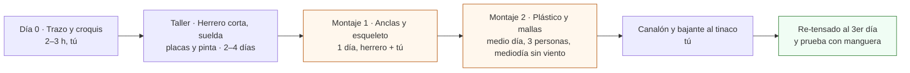
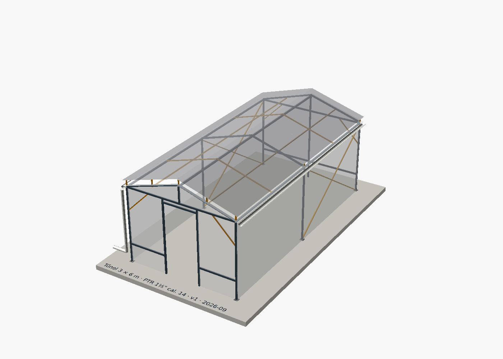
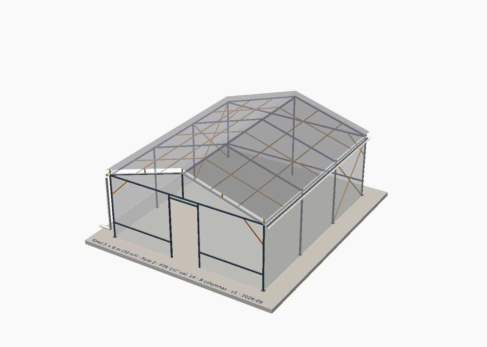

# Estructura del túnel

**En una línea:** un túnel a dos aguas de PTR 1½" cal. 14, anclado a la losa con placas y
anclas de cuña, con pendiente de 30 %, plástico UV tensado y malla antigranizo separada 150 mm:
diseñado en Fase 1 a 3 × 6 m para crecer a 5 × 6 m en Fase 2 sin tirar nada.

!!! info "Antes de empezar"
    - **Tiempo:** 20 min de lectura; la construcción se reparte en 4 semanas (colchón 6) en
      [Fase 1 · Túnel](../fases/fase-1/tunel.md). · **Costo:** estructura DIY 3 × 6 m
      ≈ $10,700–15,300 todo incluido; ampliación a 5 × 6 m ≈ $15,300–21,500
      ([research/estructura-invernadero.md](../research/estructura-invernadero.md)). ·
      **Personas:** tú + herrero (2–4 días) + 2 ayudantes el día del plástico.
    - **Necesitas:** las listas de [compras Fase 1](../fases/fase-1/compras.md) y
      [Fase 2](../fases/fase-2/compras.md) (o el [BOM por fase](../referencia/bom.md)),
      rotomartillo ½", broca de concreto 3/8", llave 9/16", nivel, hilo y escuadra
      ([04-herramientas](../referencia/04-herramientas.md)).
    - **Prerequisitos:** [Antes de gastar un peso](../empieza-aqui/antes-de-gastar-un-peso.md)
      (¿el patio es tuyo o de condominio? ¿se puede perforar la losa?),
      [Layout del patio](layout-patio.md) (dónde va el túnel respecto a coladeras, tinaco y acceso).

## Vista general

Cinco reglas gobiernan el diseño; todo lo demás (cortes, anclas, pendientes) sale de ellas:

1. **El enemigo es la succión del viento, no el peso.** Un túnel de 18 m² con plástico es una
   vela de ~20 m²; las rachas de tormenta en CDMX llegan a 50–80 km/h. Se ancla SIEMPRE, con
   placas y anclas de cuña, y se triangula con contravientos
   ([research/instalacion-tunel-detalle.md §1](../research/instalacion-tunel-detalle.md)).
2. **Pendiente ≥ 25 % a dos aguas.** El granizo y el agua tienen que escurrir; las bolsas de
   agua/hielo son la causa #1 de colapso del plástico. Aquí: 30 %.
3. **Malla antigranizo 10–20 cm por encima del plástico** (aquí 150 mm), como segunda piel
   sobre postes cortos. El pico estadístico de granizo es agosto: no se desmonta temprano
   ([02-restricciones](../referencia/02-restricciones-y-requisitos.md)).
4. **Largueros por la cara interior** de cabios y columnas para que ninguna arista roce el
   plástico; plástico tensado al mediodía con perfil zigzag; cortinas laterales enrollables.
5. **La canaleta nace con la estructura:** canalón de PVC en cada alero con 0.5–1 % de
   pendiente hacia la bajante y el tinaco ([hidraulico.md §3](hidraulico.md)).



| Modelo | Qué decide | Render | Archivo OpenSCAD |
|---|---|---|---|
| Túnel 3 × 6 m | Geometría, cortes y anclaje de Fase 1 | [`tunel-3x6.png`](../assets/diagramas/cad/tunel-3x6.png) | [`hardware/cad/tunel_3x6.scad`](https://github.com/AndresIslas99/HomeGreen/blob/main/hardware/cad/tunel_3x6.scad) |
| Túnel 5 × 6 m | Ampliación de Fase 2 con el mismo módulo | [`tunel-5x6.png`](../assets/diagramas/cad/tunel-5x6.png) | [`hardware/cad/tunel_5x6.scad`](https://github.com/AndresIslas99/HomeGreen/blob/main/hardware/cad/tunel_5x6.scad) |
| Patio Fase 2 | Cómo cabe todo en los 80 m² | [`patio-fase-2-3d.png`](../assets/diagramas/cad/patio-fase-2-3d.png) | [`hardware/cad/patio_fase2.scad`](https://github.com/AndresIslas99/HomeGreen/blob/main/hardware/cad/patio_fase2.scad) |

Los modelos son paramétricos: cambias `ancho`, `largo`, `n_porticos` o `pendiente` al
principio del archivo y el modelo imprime la nueva lista de cortes en consola. Cómo
modificarlos y re-renderizar: [`hardware/cad/README.md`](https://github.com/AndresIslas99/HomeGreen/blob/main/hardware/cad/README.md).

---

## 1. Geometría del túnel 3 × 6 m (Fase 1)



**Cómo leerlo.** Gris oscuro = PTR 1½" (estructura principal); ámbar = PTR 1" (cabios
intermedios, largueros de techo, contravientos, postes de la malla); superficie blanca
translúcida = plástico UV cal. 720; gris translúcido superior = malla antigranizo a 150 mm;
media caña blanca en cada alero = canalón de PVC con bajante en la esquina noreste (hacia el
tinaco). La puerta va en la cabecera norte porque el acceso del patio se supone al norte
([layout-patio.md](layout-patio.md)).

| Parámetro | Valor | Por qué / fuente |
|---|---|---|
| Ancho × largo (exterior) | 3.0 × 6.0 m (18 m²) | Rango 15–20 m² de Fase 1 ([00-plan-maestro](../referencia/00-plan-maestro.md)) |
| Pórticos / columnas | 3 pórticos, 6 columnas, a 3.0 m | "Túnel 6 columnas, 24 anclas" del informe de anclaje; entre pórticos va un **cabio intermedio** de PTR 1" a 1.5 m para que el plástico no se pandee |
| Altura de alero (columna) | 2.00 m | Rango 2.2–2.4 m de altura total del informe de estructura; alero a 2.0 m deja pasar racks de 1.83 m |
| Pendiente del techo | 30 % (16.7°) → peralte 0.45 m | Mínimo 25 % ([03-instalacion §1.1](../referencia/03-instalacion.md)) |
| Altura de cumbrera (eje) | 2.49 m | Calculada: 2.00 + 0.04 (alero) + 0.45 |
| Cabio (corte) | 1.586 m | Calculado por el modelo (hipotenusa + un perfil de traslape) |
| Perfil principal | PTR 1½" × 1½" cal. 14 (38 mm, pared 1.9 mm) | [Sodimac $403; $382.85 con 5+ piezas](https://www.sodimac.com.mx/sodimac-mx/product/433713/ptr-1-1-2x1-1-2-calibre-14/433713) |
| Perfil ligero | PTR 1" × 1" (25 mm) | Largueros ligeros y contravientos ([bom/fase1.csv](../referencia/bom.md)) |
| Puerta | 0.90 × 1.90 m, cabecera norte, jambas + dintel + pendolón | Corrediza, abatible o traslape de malla: las 3 opciones están en la guía de Hydro Environment |
| Travesaños de cabecera | uno bajo (rodapié a 0.50 m) y uno alto (a la altura del alero) | Secuencia de armado §2, paso 9 del informe |
| Contravientos | 1 cruz de San Andrés por fachada larga (primera crujía) + 4 escuadras a 45° en esquinas | "Sin esto el marco se paralelogramea con la primera racha" ([research/estructura-invernadero.md](../research/estructura-invernadero.md)) |
| Malla antigranizo | 150 mm sobre el plástico, sobre postes cortos de PTR 1" y alambre galvanizado | 10–20 cm de separación; cristal/monofilamento HDPE |
| Canalón | PVC ~11 cm en cada alero, 0.75 % hacia la bajante 3" | 0.5–1 % ([research/instalacion-tunel-detalle.md §4](../research/instalacion-tunel-detalle.md)) |

!!! tip "¿Postes cada 3 m o cada 2 m?"
    [03-instalacion §1.1](../referencia/03-instalacion.md) pide "postes cada ≤ 2 m"; el informe
    de anclaje presupuesta 6 columnas (3 m). El modelo concilia ambas cosas con cabios
    intermedios sin columna cada 1.5 m. Si tu herrero prefiere columnas cada 2 m, pon
    `n_porticos = 4` en `tunel_3x6.scad`: son 2 columnas, 8 anclas y ~1 tramo más de PTR.

## 2. Ampliación a 5 × 6 m (Fase 2)



El mismo módulo `tunel()` con `ancho = 5000`, `n_porticos = 4` y `largueros_techo = 2`. Se
ensancha, no se alarga: la cumbrera, los largueros de alero, las 6 columnas, la puerta y sus
placas/anclas se reutilizan; se agregan 2 columnas (claros de 2 m, como pide
[03-instalacion](../referencia/03-instalacion.md)), cabios nuevos de 2.63 m y una cabecera más
ancha. Los cabios viejos de 1.59 m sirven como escuadras o largueros cortos.

| Parámetro | 3 × 6 m (Fase 1) | 5 × 6 m (Fase 2) |
|---|---|---|
| Superficie | 18 m² | 30 m² |
| Columnas / anclas | 6 / 24 | 8 / 32 |
| Separación entre pórticos | 3.0 m (+ cabio intermedio a 1.5 m) | 2.0 m (+ cabio intermedio a 1.0 m) |
| Peralte / cumbrera (eje) | 0.45 m / 2.49 m | 0.75 m / 2.79 m |
| Cabio | 1.59 m | 2.63 m |
| Largueros intermedios de techo | 1 por agua | 2 por agua |
| Tirantes de la cruz de San Andrés | 3.50 m | 2.72 m |
| PTR 1½" (metros lineales) | 58.0 m | 82.1 m (+24.1 m) |
| PTR 1" (metros lineales) | 38.3 m | 57.5 m (+19.2 m) |
| Techo que capta lluvia (2 aguas) | 2 × 1.55 × 6 ≈ 18.6 m² → ~19 L por mm de lluvia | 2 × 2.61 × 6 ≈ 31 m² → ~31 L por mm |

Con una tormenta de 30 mm el techo de Fase 1 manda ~560 L al tinaco de 750 L y el de Fase 2
~940 L (aritmética con 1 mm = 1 L/m²; el informe da 500–600 L para 15–20 m²): el rebosadero
del tinaco a la coladera no es opcional ([hidraulico.md §3](hidraulico.md)).

## 3. Lista de cortes de PTR

Las listas las imprime el modelo (`ECHO` de OpenSCAD) con los parámetros de arriba; las
longitudes son de eje a eje **más un perfil de traslape** en los cabios. Pide al herrero que
las confirme sobre el trazo real antes de cortar (uniones a tope, sin cartabones) y que
agregue 1–2 cm por pieza si va a escuadrar en campo.

=== "3 × 6 m (Fase 1)"

    | Pieza | Perfil | Cantidad | Longitud |
    |---|---|---|---|
    | Columna | PTR 1½" | 6 | 2,000 mm |
    | Cabio a dos aguas | PTR 1½" | 6 | 1,586 mm |
    | Cumbrera | PTR 1½" | 1 | 6,000 mm |
    | Larguero de alero | PTR 1½" | 2 | 6,000 mm |
    | Travesaño alto de cabecera | PTR 1½" | 2 | 2,924 mm |
    | Travesaño bajo (rodapié) cabecera sur | PTR 1½" | 1 | 2,924 mm |
    | Travesaño bajo cabecera norte (partido por la puerta) | PTR 1½" | 2 | 974 mm |
    | Poste central cabecera sur | PTR 1½" | 1 | 2,450 mm |
    | Jamba de puerta | PTR 1½" | 2 | 2,000 mm |
    | Dintel de puerta | PTR 1½" | 1 | 900 mm |
    | Pendolón cabecera norte | PTR 1½" | 1 | 412 mm |
    | Cabio intermedio (arco sin columna) | PTR 1" | 4 | 1,586 mm |
    | Larguero intermedio de techo | PTR 1" | 2 | 6,000 mm |
    | Tirante de cruz de San Andrés (fachadas largas) | PTR 1" | 4 | 3,500 mm |
    | Escuadra de esquina a 45° (cabeceras) | PTR 1" | 4 | 849 mm |
    | Poste de malla antigranizo | PTR 1" | 15 | 170 mm |
    | **Total PTR 1½"** | | 25 piezas | **58.0 m** |
    | **Total PTR 1"** | | 29 piezas | **38.3 m** |

    Placas base: 6 de 100 × 100 mm (solera 3/16"–¼") con 4 barrenos de 7/16". Anclas de cuña
    3/8" × 5": 24.

=== "5 × 6 m (Fase 2)"

    | Pieza | Perfil | Cantidad | Longitud |
    |---|---|---|---|
    | Columna | PTR 1½" | 8 (6 reutilizadas + 2) | 2,000 mm |
    | Cabio a dos aguas | PTR 1½" | 8 | 2,630 mm |
    | Cumbrera | PTR 1½" | 1 (reutilizada) | 6,000 mm |
    | Larguero de alero | PTR 1½" | 2 (reutilizados) | 6,000 mm |
    | Travesaño alto de cabecera | PTR 1½" | 2 | 4,924 mm |
    | Travesaño bajo cabecera sur | PTR 1½" | 1 | 4,924 mm |
    | Travesaño bajo cabecera norte (partido) | PTR 1½" | 2 | 1,974 mm |
    | Poste central cabecera sur | PTR 1½" | 1 | 2,750 mm |
    | Jamba de puerta | PTR 1½" | 2 (reutilizadas) | 2,000 mm |
    | Dintel de puerta | PTR 1½" | 1 (reutilizado) | 900 mm |
    | Pendolón cabecera norte | PTR 1½" | 1 | 712 mm |
    | Cabio intermedio (arco sin columna) | PTR 1" | 6 | 2,630 mm |
    | Larguero intermedio de techo | PTR 1" | 4 (2 reutilizados) | 6,000 mm |
    | Tirante de cruz de San Andrés | PTR 1" | 4 | 2,721 mm |
    | Escuadra de esquina a 45° | PTR 1" | 4 (reutilizadas) | 849 mm |
    | Poste de malla antigranizo | PTR 1" | 20 (15 reutilizados) | 170 mm |
    | **Total PTR 1½"** | | 29 piezas | **82.1 m** |
    | **Total PTR 1"** | | 38 piezas | **57.5 m** |

    Placas base: 8 (2 nuevas). Anclas de cuña 3/8" × 5": 32 (8 nuevas).

### Cuántos tramos de 6 m comprar

El mínimo teórico (metros ÷ 6) no incluye el desperdicio de corte. Las columnas de "tramos
reales" las calcula el propio modelo: empaqueta las piezas en tramos por primer ajuste
decreciente con 3 mm de kerf por corte y lo imprime en consola (`ECHO: "PTR 1 1/2: tramos
REALES de 6 m …"`) con el detalle de qué piezas salen de cada tramo, para tramos de 6.00 m y
de 6.10 m, porque el PTR llega en 6.0–6.10 m según el proveedor
([research/estructura-invernadero.md](../research/estructura-invernadero.md)). Cómo leerlo:
[README de CAD](https://github.com/AndresIslas99/HomeGreen/blob/main/hardware/cad/README.md).

| Perfil | Túnel | Mínimo teórico | Tramos reales de 6.00 m | Tramos reales de 6.10 m | Lo que dice el BOM / informe |
|---|---|---|---|---|---|
| PTR 1½" cal. 14 | 3 × 6 m | 10 | **11** (el 11.º lleva solo el dintel de 0.9 m: hazlo en PTR 1" con el sobrante del tramo de postes de malla y son 10) | **10** | 15 tramos en [bom/fase1.csv](../referencia/bom.md); 14–16 en el informe (que mete ahí también largueros y contravientos) |
| PTR 1" | 3 × 6 m | 7 | **7** | **7** | 4 tramos "aprox." en bom/fase1.csv → **[POR VERIFICAR: al cotizar, subir la línea de PTR 1" a 7 tramos o hacer los 4 tirantes de 3.5 m en redondo liso, como admite el informe]** |
| PTR 1½" cal. 14 | 5 × 6 m (total) | 14 | **16** | **15** | 20–24 en el informe (todo en 1½") |
| PTR 1" | 5 × 6 m (total) | 10 | **10** | **10** | — |

Antes de comprar, pregunta al proveedor el largo real del tramo: entre 6.00 y 6.10 m hay un
tramo de PTR 1½" de diferencia (~$383) en cada túnel.

Costo del acero con precios de la fuente de verdad (aritmética, no cotización): 3 × 6 m →
11 × $382.85 = **$4,211** de PTR 1½" (Sodimac, 5+ piezas) + 7 × ~$275 ≈ **$1,925 aprox.** de
PTR 1"; 5 × 6 m → 16 × $382.85 = $6,126 + 10 × ~$275 ≈ $2,750 aprox. Coincide con los
$5,400–6,100 / $7,700–9,200 del informe de estructura. Sodimac tiene stock en tienda y flete
gratis arriba de $1,000 ([research/instalacion-tunel-detalle.md §5](../research/instalacion-tunel-detalle.md)).

!!! warning "Tres columnas de 2.00 m no caben en un tramo de 6.00 m"
    6,000 + dos cortes de sierra > 6,000. El PTR se vende en tramos de 6.0–6.10 m (informe de
    estructura): si el tuyo llega de 6.10 m, caben tres; si es de 6.00 m exactos, corta las
    columnas a 1.99 m o acepta un tramo más. Es el desperdicio que separa el "mínimo teórico"
    de los "tramos reales".

## 4. Anclaje: placa base + 4 anclas de cuña 3/8" × 5"

Es el método A del informe de anclaje y **la opción recomendada** para rachas de 50–80 km/h:
resiste tracción y cortante, es desmontable y es la más barata
([research/instalacion-tunel-detalle.md §1](../research/instalacion-tunel-detalle.md)).

| Elemento | Especificación | Fuente |
|---|---|---|
| Placa | 100 × 100 mm, solera 3/16"–¼" (el modelo dibuja 6 mm), soldada al pie de la columna, fondo anticorrosivo + esmalte en los primeros 30 cm | Informe §1 y §2 paso 5 |
| Barrenos de la placa | 4 de 7/16" (11 mm), a 70 mm entre centros (15 mm al borde de la placa; el modelo permite `ancla_sep` y `placa_lado` mayores, p. ej. 120 mm) | Informe §2 paso 5 (7/16" para ancla 3/8") |
| Ancla | Cuña (taquete expansivo) 3/8" × 5" — [$36 c/u en Home Depot](https://www.homedepot.com.mx/s/ancla%20de%20cu%C3%B1a) → 24 × $36 = **$864** (Fase 1); 32 × $36 = $1,152 (Fase 2) | Informe §1 |
| Empotramiento | ≈ 100 mm en la losa (127 mm de ancla − 6 mm de placa − ~22 mm de rondana, tuerca y rosca) | Aritmética sobre el modelo |
| Perforación | Rotomartillo + broca de concreto 3/8"; profundidad = empotramiento + 1 cm; **soplar/aspirar el polvo** (el polvo baja la carga de extracción hasta la mitad) | Informe §1 |
| Apriete | Torque firme con llave 9/16"; plomo y nivel de cada columna ANTES de apretar | Informe §2 pasos 6–7 |
| Losa | Sana, ≥ 10 cm de espesor, sin grietas; **nunca a menos de 15 cm del borde**; averiguar qué hay debajo (impermeabilización, tubos, cables) | Informe §1 |
| Sellado | Perímetro de cada placa con sellador PU (Sikaflex) o silicón estructural; las placas no deben crear presas ni tapar coladeras | Informe §1 y §2 paso 10 |
| Alternativa | Ancla 1/2" × 3-3/4" ($60 c/u) si la losa es dudosa o si quieres sobrar para la ampliación | Informe §1, método B |
| Plan B sin perforar | Dados de concreto de ≥ 80 kg por poste + cables a 4 vientos + cumbrera baja: inferior, solo en renta/condominio sin permiso | Informe §1, método D |

!!! warning "El BOM y un informe dicen 3/8" × 3"; el informe detallado dice 3/8" × 5""
    [bom/fase1.csv](../referencia/bom.md) y [research/estructura-invernadero.md](../research/estructura-invernadero.md)
    presupuestan anclas de 3/8" × 3" (2–4 por placa, ~$1,100 con placas). El informe de
    instalación, más reciente y detallado, fija **4 anclas de 3/8" × 5" por placa ($36 c/u, $864
    el túnel)**; esta página y el modelo usan esa especificación (más empotramiento, mismo
    diámetro de broca). [POR VERIFICAR: unificar la fila de anclaje en bom/fase1.csv al cerrar la
    compra.]

La guía paso a paso (marcar, perforar, limpiar, colocar, apretar, sellar) está en
[Anclar el túnel](../guias/anclar-el-tunel.md).

## 5. Pendientes

| Dónde | Pendiente | Por qué |
|---|---|---|
| Techo a dos aguas | **30 %** (mínimo 25 %; nunca techo plano ni curva tendida) | Escurre agua y granizo; evita bolsas de hielo que revientan el plástico ([03-instalacion §1.1](../referencia/03-instalacion.md)) |
| Canalón | **0.5–1 %** (≈ 1 cm por cada 2 m; el modelo usa 0.75 %) hacia la bajante 3" | Captación pluvial al tinaco con filtro de hojas + purga de primeras lluvias ([hidraulico.md](hidraulico.md)) |
| Líneas NFT dentro del túnel | **2–3 %** (el modelo usa 2.5 % = 75 mm en 3 m), soportes cada ≤ 1.5 m | Sin panza a media línea = sin raíces podridas ([03-instalacion §2.1](../referencia/03-instalacion.md)) |
| Piso del patio | La que ya tiene; las placas y el tinaco **no** deben bloquearla ni tapar coladeras | Advertencia textual de la guía de Hydro Environment |

Los desniveles del piso se corrigen en la placa/base (calzas), nunca rellenando la losa.

## 6. Cargas de viento y granizo: por qué se ancla y se triangula

Cifras de los informes ([instalacion-tunel-detalle §1](../research/instalacion-tunel-detalle.md)
y [estructura-invernadero](../research/estructura-invernadero.md)):

- Rachas de tormenta en CDMX, mayo–septiembre: **50–80 km/h** (ocasionalmente más), con granizo.
- A 80 km/h la presión dinámica es **~300 Pa**; sobre un costado de 5 × 2.2 m (~11 m²) son
  **~330 kgf de empuje lateral**, y la succión (levantamiento) sobre un techo con plástico es
  del mismo orden — estimación propia del informe, no cálculo estructural.
- El túnel pesa **~150–250 kg**: el problema no es el peso, es que el plástico trabaja como
  vela. El anclaje debe evitar tanto el desplazamiento lateral como el volteo (guía de Hydro
  Environment citando a Oklahoma State University).
- Las bardas del patio reducen el viento directo pero generan **turbulencia y efecto Venturi**
  entre muros: se ancla igual.
- Granizo: ~2–3 días al año en un punto fijo y 5–6 eventos severos por temporada, pico en
  agosto ([research/clima-agronomia.md](../research/clima-agronomia.md)); rompe plástico cal. 720
  sin malla.

Orden de magnitud para este túnel, con la misma presión de 300 Pa (aritmética simple, sin
coeficientes de forma; **no sustituye un cálculo estructural**):

| Túnel | Costado largo | Empuje lateral | Techo | Succión teórica máxima | Por ancla (24 / 32) |
|---|---|---|---|---|---|
| 3 × 6 m | 6 × 2.0 = 12 m² | ~3.6 kN ≈ 360 kgf | 18.6 m² | ~5.6 kN ≈ 570 kgf, menos 150–250 kg de peso ≈ 320–420 kgf netos | ~15 kgf de cortante + ~13–18 kgf de extracción |
| 5 × 6 m | 12 m² (cabecera ~12 m²) | ~360 kgf | 31 m² | ~9.4 kN ≈ 950 kgf, menos peso ≈ 700–800 kgf netos | ~11 kgf de cortante + ~22–25 kgf de extracción |

Una ancla de cuña de 3/8" bien colocada en concreto sano resiste **cientos de kg** a extracción
(informe §1): cuatro por placa dan margen holgado incluso si una falla. Lo que sí se rompe sin
diseño es lo demás: el marco sin contravientos se paralelogramea, el plástico flojo se rasga
a latigazos, y el techo tendido acumula hielo. De ahí las cuatro reglas: anclar, triangular
(cruz de San Andrés por fachada + escuadras en esquinas), tensar con perfil zigzag y
pendiente ≥ 25 % con malla separada.

!!! danger "Cortinas abiertas en tormenta = vela doble"
    Con rachas fuertes, las cortinas laterales se cierran y se amarran; con granizo, la malla
    ya está arriba desde mayo. Si el túnel es de contrapesos (plan B), el informe exige además
    poder abrir cortinas para despresurizar: por eso ese plan es inferior.

## 7. Secuencia de armado (resumen)

Resumen de [research/instalacion-tunel-detalle.md §2](../research/instalacion-tunel-detalle.md);
la ruta crítica son las 2–4 semanas del herrero, así que se pide cotización el día 1.

1. **Día 0 — Trazo (tú, 2–3 h).** Croquis con ancho/largo/altura, puerta, pasillos, racks,
   ventilación, tinaco y coladera. Cumbrera a lo largo del viento dominante si se puede. Hilo,
   escuadra 3-4-5 y diagonales iguales ±1 cm; marcar los 6 puntos de columna; nivel de manguera.
2. **Taller — Fabricación (herrero, 2–4 días).** Cortar PTR según la [lista de cortes](#3-lista-de-cortes-de-ptr);
   soldar placas base con 4 barrenos 7/16"; fondo anticorrosivo + esmalte.
3. **Montaje 1 — Bases y esqueleto (herrero + tú, 1 día).** Presentar pórticos, marcar
   barrenos, perforar, limpiar polvo, anclas 3/8" × 5" a torque firme → [Anclar el túnel](../guias/anclar-el-tunel.md).
   Levantar pórticos (mínimo 2 personas), plomo y nivel. Largueros laterales primero, luego
   cumbrera, **por la cara interior**. Travesaños de cabecera, poste central/jambas,
   contravientos. Retoque de pintura y sellador PU en placas.
4. **Montaje 2 — Cubiertas (3 personas, medio día, al MEDIODÍA, con sol y SIN viento).**
   Perfil sujetador solo en tramos rectos; lienzo de plástico de una sola pieza; tensar con
   el calor y fijar con zigzag; malla antigranizo por fuera sobre los postes de 150 mm; malla
   antiáfidos por dentro de los laterales; cabeceras y puerta → [Tensar plástico y mallas](../guias/tensar-plastico-y-mallas.md).
5. **Canalón y bajante (tú).** Soportes en el larguero bajo del alero, 0.5–1 % hacia la
   bajante, filtro de hojas y purga de primeras lluvias antes del tinaco → [Instalar canaleta y captación](../guias/instalar-canaleta-y-captacion.md).
6. **Tercer día de sol y viento:** re-tensar todo. Después, prueba con manguera a presión o
   la primera tormenta real: es el primer punto del commissioning de Fase 1
   ([03-instalacion](../referencia/03-instalacion.md)).

**Qué no hacer solo:** rolado/soldadura y montaje de pórticos (herrero); subir y tensar el
plástico (mínimo 3 personas); trabajar la cumbrera sin escalera estable. **Sí puedes solo:**
trazo, barrenos y anclas, perfil zigzag, canaleta, cortinas, pintura.

Guías de armado del proveedor (mismo lugar donde se compra plástico, perfil y zigzag):
[invernadero casero en patio/terraza/azotea](https://hydroenv.com.mx/como-hacer-un-invernadero-para-casa-patio-terraza-o-azotea/),
[armado de microtúnel por piezas numeradas](https://hydroenv.com.mx/armado-de-invernadero-para-jardin-tipo-microtunel-de-3-5-x-2-x-2/),
[instalar mallas y plásticos](https://hydroenv.com.mx/paso-a-paso-instala-mallas-y-plasticos-al-invernadero/) y su
[video de armado](https://www.youtube.com/watch?v=kShJ07HwPDw). La secuencia constructiva en
video, traducible 1:1 a PTR ([research/tutoriales-videos.md](../research/tutoriales-videos.md)):

<iframe width="560" height="315" src="https://www.youtube.com/embed/9g0WfUQC2Qo" title="Cómo hacer un invernadero casero, parte 1: la estructura (La Huertina de Toni)" frameborder="0" allowfullscreen></iframe>

## 8. Los otros modelos: rack, línea NFT y patio


Cómo se ve el patio de 80 m² (10 × 8 m, casa al sur, acceso al norte: **supuesto**; la planta
acotada y definitiva es [layout-patio.md](layout-patio.md)): el túnel de 5 × 6 m ocupa la mitad
oeste con la puerta al norte; dentro, dos bancadas de 4 líneas NFT de 3 m con pendiente hacia
el tambo de 200 L (sur) y tres racks Husky al norte; afuera, el tinaco de 750 L recibe la
bajante del canalón este; la zona de cosecha y el refrigerador quedan bajo techo junto a la
casa.

| Render | Qué muestra | Página que lo usa |
|---|---|---|
|  | Rack Husky 1830 × 914 × 457 mm: 3 charolas 1020 por nivel (la de 508 mm sobresale 25 mm del fondo de 457 mm), 2 tubos T8 de 120 cm por nivel iluminado (sobresalen 143 mm por lado), nivel superior e inferior tapados con charola invertida y peso, niveles medios en brote/desarrollo/cosecha. Claro libre sobre cada charola hasta el tubo: 277 mm. | [rack-y-charolas.md](rack-y-charolas.md) |
|  | Tubo sanitario 4" (OD 114 mm) × 3 m con 10 perforaciones a 200 mm entre centros (a 600, 800 … 2,400 mm del extremo alto), caída de 75 mm, soportes a 150 / 1,500 / 2,850 mm con vigas a 831 / 798 / 764 mm del piso, tapas, entrada ½" y retorno 2". **El diámetro de la perforación se mide en el cuerpo de la canastilla comprada, bajo el labio** (los 70 mm del modelo son solo de dibujo). | [hidraulico.md §2](hidraulico.md), [Armar una línea NFT](../guias/armar-linea-nft.md) |

## 9. Regenerar los renders

```bash
cd hardware/cad
xvfb-run -a openscad -o ../../docs/assets/diagramas/cad/tunel-3x6.png --autocenter --viewall \
  --imgsize=1400,1000 --projection=p --colorscheme=Tomorrow --camera=0,0,0,62,0,212,0 tunel_3x6.scad
```

Los cinco comandos, los parámetros que puedes tocar y cómo exportar STL/DXF están en
[`hardware/cad/README.md`](https://github.com/AndresIslas99/HomeGreen/blob/main/hardware/cad/README.md).
La lista de cortes se imprime en consola cada vez que renderizas.

## Errores típicos

!!! warning "Techo tendido o plano"
    Menos de 25 % de pendiente = bolsa de agua o hielo en la primera granizada. El parámetro
    `pendiente` no baja de 25.

!!! warning "Anclar sobre polvo, cerca del borde o en losa agrietada"
    El polvo del barreno reduce la carga de extracción hasta a la mitad; a < 15 cm del borde
    la losa se desconcha. Aspira, aléjate del borde y descarta tramos agrietados.

!!! warning "Largueros por fuera de los cabios"
    Cualquier arista que toque el plástico lo rasga con el viento. Largueros por la cara
    interior y perfil zigzag solo en tramos rectos.

!!! warning "Subir el plástico con viento o en la tarde"
    Se hace al mediodía, sin viento, entre 3 personas: el calor lo tensa y al enfriar queda
    tenso. En temporada de lluvias, por la mañana.

!!! warning "Tapar la coladera con una placa o el tinaco"
    El túnel respeta el drenaje existente; el tinaco lleno pesa ~470 kg (450 L) o más y va
    sobre piso firme con rebosadero a la coladera.

## Al terminar

- [ ] Las 6 (u 8) columnas a plomo y nivel, 4 anclas por placa apretadas y placas selladas.
- [ ] Cruz de San Andrés en cada fachada larga y escuadras en las 4 esquinas soldadas.
- [ ] Pendiente del techo medida ≥ 25 % (aquí 30 %): 45 cm de peralte en 1.5 m de media agua.
- [ ] Plástico tenso (sin latigazo con la mano), malla antigranizo a 10–20 cm por encima.
- [ ] Canalón con 0.5–1 % hacia la bajante; ninguna placa ni el tinaco tapan coladeras.
- [ ] Prueba con manguera a presión o primera tormenta real sin daño (commissioning Fase 1).
- Registrar en bitácora: fecha de montaje, herrero, número de anclas colocadas y fecha del
  último re-tensado (`bitacora/produccion.csv`, columna de observaciones) y guardar las
  cotizaciones en `informes/`.
- Siguiente paso: [Agua y captación](../fases/fase-1/agua.md) y, en Fase 2,
  [Sistema NFT](../fases/fase-2/nft.md).

## Fuentes

- [research/instalacion-tunel-detalle.md](../research/instalacion-tunel-detalle.md) — métodos de
  anclaje, cifras de viento (300 Pa, ~330 kgf), secuencia de armado, precios de anclas y PTR.
- [research/estructura-invernadero.md](../research/estructura-invernadero.md) — PTR y calibres,
  estimación de tramos, consideraciones de viento/lluvia, presupuesto DIY 3 × 6 y 5 × 6.
- [research/clima-agronomia.md](../research/clima-agronomia.md) — frecuencia de granizo, pico en agosto.
- [research/hidroponia-nft.md](../research/hidroponia-nft.md) — tubo sanitario 4", canastillas 3", 20 cm entre centros.
- [referencia/03-instalacion.md](../referencia/03-instalacion.md) — pendiente ≥ 25 %, postes ≤ 2 m, NFT 2–3 %.
- [referencia/01-proveedores-cdmx.md](../referencia/01-proveedores-cdmx.md) y
  [referencia/bom.md](../referencia/bom.md) (bom/fase1.csv, bom/fase2.csv) — precios y proveedores.
- [referencia/04-herramientas.md](../referencia/04-herramientas.md) — rotomartillo, brocas, niveles.
- Modelos: [`hardware/cad/`](https://github.com/AndresIslas99/HomeGreen/tree/main/hardware/cad) (OpenSCAD 2021.01).
