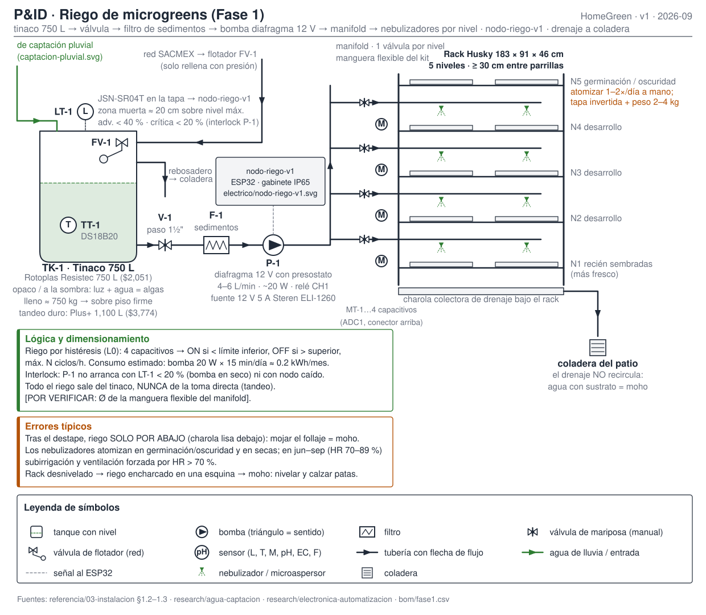
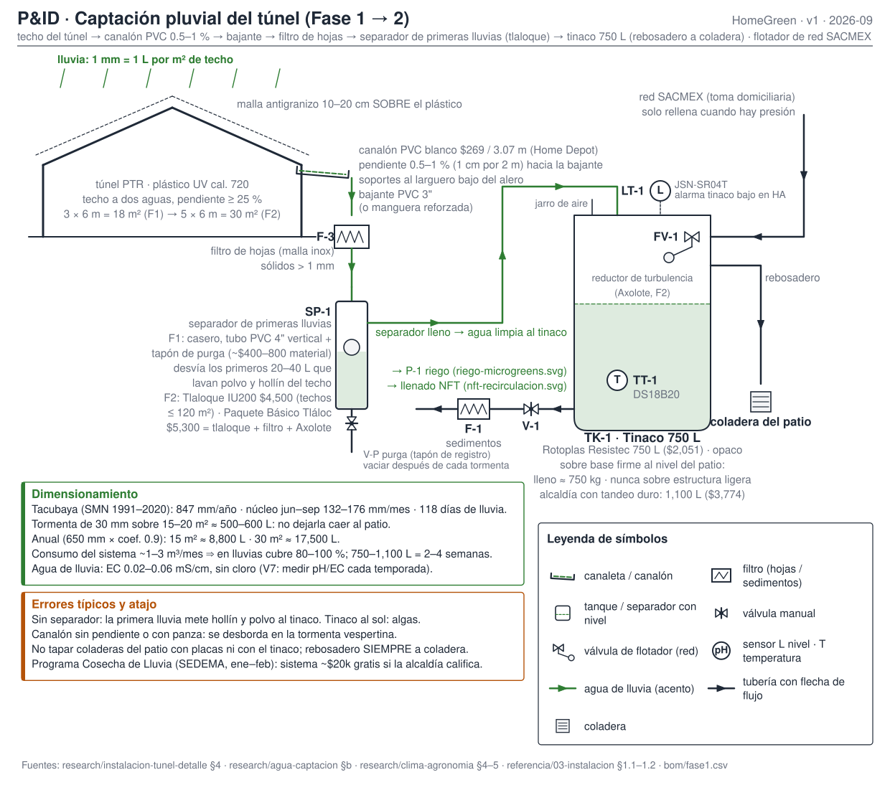
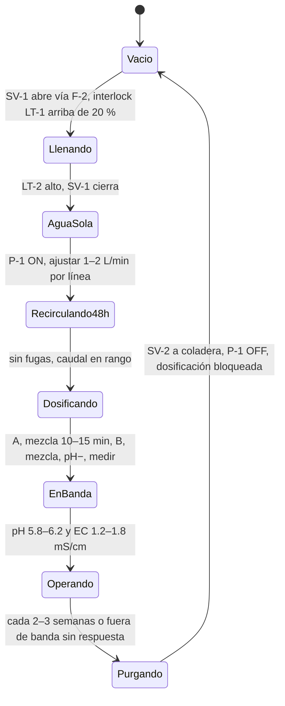

# Diseño hidráulico

**En una línea:** tres circuitos de agua —riego de microgreens, NFT recirculante y captación
pluvial— que comparten un solo principio: **todo corre desde el tinaco propio, nunca de la toma
directa**, y la recirculación del NFT cuelga de un bus de 12 V con batería, no de la red ni de
Home Assistant.

!!! info "Qué decide esta página"
    - **Diámetros, caudales, pendientes y volúmenes** de los tres circuitos, con el número y su fuente.
    - **Tags de instrumentos** (LT-1, FT-1, AT-1…) que usan los esquemas eléctricos
      ([electrico.md](electrico.md)), el firmware y las automatizaciones ([control.md](control.md)).
    - **Secuencias de llenado y purga** que se repiten en operación (cambio de solución cada 2–3
      semanas, purga del tlaloque tras cada tormenta).
    - Dónde va cada cosa en el patio: [layout-patio.md](layout-patio.md).
    - Los tres P&ID se generan con `hardware/hidraulico/pid.py` (solo Python estándar); si cambias un
      diámetro o un tag, cámbialo ahí y regenera.

## Vista general

```mermaid
flowchart LR
    LL[Lluvia sobre el techo del túnel<br/>1 mm = 1 L/m²] --> CAN[Canalón 0.5–1 %]
    CAN --> FH[Filtro de hojas] --> SP[SP-1 separador de<br/>primeras lluvias 20–40 L]
    SP --> TK1[(TK-1 Tinaco 750 L<br/>opaco, a la sombra)]
    RED[Red SACMEX<br/>solo cuando hay presión] --> FV1[FV-1 flotador] --> TK1
    TK1 -- rebosadero --> COL[(Coladera)]
    TK1 --> V1[V-1 + F-1 sedimentos] --> P1[P-1 diafragma 12 V<br/>4–6 L/min]
    P1 --> MAN[Manifold · 1 válvula por nivel] --> NEB[Nebulizadores rack 5 niveles]
    NEB -- drenaje, no recircula --> COL
    TK1 --> SV1[SV-1 solenoide NC] --> F2[F-2 dúplex sedimento + carbón] --> TK2[(TK-2 Tambo 200 L)]
    TK2 --> PP[P-1/P-2 diafragma 12 V<br/>bus batería LiFePO4] --> F3[F-1 malla 120] --> FT[FT-1 YF-S201]
    FT --> MNF[Manifold ¾ pulg · 8 válvulas] --> NFT[8 líneas PVC 4 pulg · 2–3 %<br/>1–2 L/min por línea]
    NFT --> RET[Retorno 2 pulg · AT-1 pH · AT-2 EC] --> TK2
    TK2 -- SV-2 purga cada 2–3 sem --> COL
```



Regla de diseño que gobierna todo lo demás (de [02-restricciones §2](../referencia/02-restricciones-y-requisitos.md)):
autonomía mínima de **2 semanas** sin red, porque en 2025–2026 hay tandeo formal en ~10
alcaldías. El sensor de nivel LT-1 y su alarma en HA son la mitigación, no un lujo.

---

## 1. Riego de microgreens (Fase 1)



**Flujo:** TK-1 → V-1 (paso) → F-1 (sedimentos) → P-1 (diafragma 12 V con presostato) → manifold con
una válvula manual por nivel → nebulizadores sobre cada parrilla del rack. El drenaje de las charolas
cae a una charola colectora bajo el rack y de ahí a la coladera: **no recircula** (agua con sustrato
y raíces es caldo de moho). El tinaco recibe agua de la captación pluvial y, cuando hay presión, de
la red por la válvula de flotador FV-1.

### Componentes

| Tag | Componente | Especificación | Precio (MXN) | Compra |
|---|---|---|---|---|
| TK-1 | Tinaco | Rotoplas Resistec 750 L; opaco o forrado; sobre piso firme (lleno ≈ 750 kg) | $2,051 verificado | [rotoplas.com.mx](https://rotoplas.com.mx/products/almacenamiento/tinacos/) · alcaldía con tandeo duro: Plus+ 1,100 L $3,774 |
| FV-1 | Válvula de flotador | Entrada de red; el Resistec es la línea "sin accesorios" | [POR VERIFICAR: precio suelto en Home Depot; o comprar el Tricapa 750 L "con accesorios" $3,549 que trae flotador, jarro de aire, multiconector y filtro de sedimentos] | [Home Depot Tricapa 750 L](https://www.homedepot.com.mx/p/rotoplas-tinaco-tricapa-750-l-con-accesorios-500027-164912) |
| V-1 | Válvula de paso + multiconector | Salida inferior del tinaco, multiconector 1½" | $97 (multiconector) · brida 2.3" $48 | [Home Depot tinaco 450](https://www.homedepot.com.mx/s/tinaco%20450) (accesorios en la misma línea) |
| F-1 | Filtro de sedimentos | El estándar del tinaco equipado basta para microgreens | incluido en "con accesorios"; suelto: Polyspun 1–5 µm $825 | [Agua Limpia](https://www.agualimpia.mx/collections/filtro-para-sedimento-y-carbon-activado) |
| P-1 | Bomba diafragma 12 V con presostato | Da presión para nebulizar; 4–6 L/min típico; ~20 W, 15 min/día | ~$350 aprox. | [búsqueda ML](https://listado.mercadolibre.com.mx/bomba-de-agua-diafragma-12v) |
| — | Kit nebulizadores / microaspersores | 10–30 boquillas con manguera; 2 boquillas por nivel N1–N4 | ~$250 aprox. | [búsqueda ML](https://listado.mercadolibre.com.mx/nebulizadores-de-riego) |
| — | Manguera de distribución | La del kit | [POR VERIFICAR: Ø de la manguera del kit elegido; anotarlo en el P&ID al comprar] | — |
| — | Válvulas manuales del manifold | 1 por nivel, para igualar caudal | incluidas en tubería/válvulas ~$750 aprox. (bom/fase2) o tlapalería | [Home Depot plomería](https://www.homedepot.com.mx/b/plomeria/tuberias-y-conexiones/sanitarias) |
| LT-1 | Nivel del tinaco | JSN-SR04T ultrasónico; zona muerta ≈ 20 cm sobre el nivel máximo | ~$150 aprox. | [UNIT](https://uelectronics.com/producto/sensor-ultrasonico-jns-sr04t/) |
| TT-1 | Temperatura del agua | DS18B20 sumergible (comprar 3: es el que más se maltrata) | ~$35 aprox. c/u | [UNIT](https://uelectronics.com/producto/ds18b20-sensor-de-temperatura-digital-de-acero-inoxidable-sumergible/) |
| MT-1…4 | Humedad de sustrato | Capacitivo v1.2, pack ×10 (20–30 % salen malos); conector hacia arriba, borde sellado | ~$300 aprox. el pack | [Amazon MX](https://www.amazon.com.mx/GalaxyElec-capacitivo-resistente-corrosi%C3%B3n-anal%C3%B3gico/dp/B082HV1JMG) |
| — | Fuente 12 V 5 A | Steren ELI-1260 (intemperie: Mean Well IP67) | $399 verificado | [Steren](https://www.steren.com.mx/eliminador-regulado-de-12-vcc-5-a.html) |
| — | Rack | Husky 183 × 91 × 46 cm, 5 niveles | $2,019 verificado | [Home Depot](https://www.homedepot.com.mx/p/husky-estante-de-5-niveles-de-acero-183-x-914-x-457-cm-negro-zrop361872-5llb-150281) |

Cantidades exactas y estado de cada precio: [`bom/fase1.csv`](https://github.com/AndresIslas99/HomeGreen/blob/main/bom/fase1.csv).
Alternativas y teléfonos: [01-proveedores §3 y §5](../referencia/01-proveedores-cdmx.md).

### Dimensionamiento

| Magnitud | Valor | De dónde sale |
|---|---|---|
| Caudal de P-1 | 4–6 L/min (diafragma 12 V 40–80 W) | [research/electrico-respaldo-seguridad §3](../research/electrico-respaldo-seguridad.md) |
| Consumo eléctrico del riego | 20 W × 15 min/día ≈ 0.2 kWh/mes | [research/puntos-ciegos](../research/puntos-ciegos.md) |
| Niveles regados | N1–N4 con nebulizador; N5 (oscuridad) se atomiza a mano 1–2×/día | [03-instalacion §0.3](../referencia/03-instalacion.md) |
| Separación entre parrillas | ≥ 30 cm | [03-instalacion §0.2](../referencia/03-instalacion.md) |
| Reserva | 750 L; 1,100 L en alcaldía con tandeo duro | [research/agua-captacion §d](../research/agua-captacion.md) |
| Control | histéresis por nivel con 4 capacitivos; máx. N ciclos/h; interlock LT-1 < 20 % | [06-validacion L0](../referencia/06-validacion-y-lazos-agenticos.md) |

!!! warning "Nebulizadores sí, pero no sobre el follaje"
    El SOP dice: tras el destape, **riego solo por abajo** (charola perforada dentro de charola
    lisa). Los nebulizadores sirven para germinación/oscuridad y para temporada seca; en
    junio–septiembre (HR 70–89 %) mojar el dosel es invitar al moho. La automatización v1 debe
    poder regar por nivel y también apagar un nivel completo cuando ese lote ya destapó.

---

## 2. NFT recirculante de hierbas (Fase 2)


**Flujo:** TK-2 (tambo 200 L) → V-0 → P-1 principal / P-2 respaldo en paralelo (diafragma 12 V
40–60 W, bus de batería) → F-1 malla 120 → FT-1 caudalímetro → subida ¾" → manifold con una
válvula por línea → 8 líneas de PVC sanitario 4" × 3 m con 2–3 % de pendiente → retorno por
gravedad en 2" con sondas de pH y EC → TK-2. Dosificación A/B/pH− con tres peristálticas al tambo,
cerca de la succión. Llenado desde TK-1 por solenoide SV-1 y dúplex sedimento + carbón (quita el
cloro de red); purga por SV-2 a la coladera para el cambio de solución.

### Componentes

| Tag | Componente | Especificación | Precio (MXN) | Compra |
|---|---|---|---|---|
| TK-2 | Depósito de solución | Tambo HDPE 200 L grado alimenticio, tapado, bajo sombra | $450–900 aprox. | [búsqueda ML](https://listado.mercadolibre.com.mx/tambos-de-200-litros) · [Plastank](https://www.plastank.mx/products/tambos-de-200-litros-abiertos) |
| P-1 / P-2 | Bombas de recirculación | Diafragma 12 V DC 40–60 W ×2 (principal + respaldo con relevador de transferencia); en bus LiFePO4 100 Ah → 28–30 h sin CFE | ~$650 aprox. c/u ($900–1,800 el par) | [búsqueda ML](https://listado.mercadolibre.com.mx/bomba-diafragma-12v) · arquitectura en [electrico.md](electrico.md) |
| — | Bomba 127 V para llenado / purga / trasiego | Sumergible 4500 LPH, 65 W; **no** periférica 0.5 HP (370 W ≈ $260/mes y te manda a DAC) | $1,199 verificado | [Hydro Environment](https://hydroenv.com.mx/producto/bomba-sumergible-4500-lph-para-hidroponia-y-estanques/) |
| F-1 | Filtro de malla | 120 mesh, 1", entrada/salida macho | $230 verificado | [Hydro Environment](https://hydroenv.com.mx/producto/filtro-de-malla-para-riego-de-1-pulgada-con-salida-y-entrada-tipo-macho/) |
| FT-1 | Caudalímetro | YF-S201, 450 pulsos/L, en la descarga de la bomba | $74 verificado (Tecneu, hoy agotado) / ~$90–130 ML | [Tecneu](https://www.tecneu.com/products/sensor-de-flujo-de-agua-caudalimetro-yf-s201) · [ML](https://listado.mercadolibre.com.mx/sensor-de-flujo-de-agua-yf-s201) |
| — | Líneas | Tubo PVC **sanitario** 4" × 6 m Amanco blanco ×4 (½ tramo por línea) | $415 c/u verificado ($1,660) | [Home Depot](https://www.homedepot.com.mx/p/amanco-wavin-tubo-sanitario-11-x-600-cm-blanco-amanco-942842-451963) |
| — | Conexiones 4" | Codo 90° $28.80 · codo 45° $18.31 · tapas y adaptadores de drenaje | ~$600 el lote | [Home Depot codo 4"](https://www.homedepot.com.mx/p/amanco-wavin-codo-pvc-4-513695-513695) |
| — | Distribución y retorno | Tubería ½"–¾" al manifold, retorno sanitario 2", válvula por línea | $600–900 aprox. | [Home Depot sanitarias](https://www.homedepot.com.mx/b/plomeria/tuberias-y-conexiones/sanitarias) |
| — | Canastillas 3" | 10 por línea ×8 = 80; **comprar antes de perforar** | $12.80 c/u ($1,024) | [Hydro Environment](https://hydroenv.com.mx/producto/canastilla-hidroponica-de-3-pulgadas/) |
| — | Sierra copa | Del diámetro del cuerpo de la canastilla (medir; típico 44–48 mm para las de 2") | ~$300 aprox. | [búsqueda ML](https://listado.mercadolibre.com.mx/truper-sierra-corta-circulos-bimetalica) |
| AT-1 | Sonda pH | Etapa 1: PH-4502C + E201-BNC; etapa 2: DFRobot Gravity cuando el NFT venda | $329 aprox. → $1,250 aprox. | [UNIT](https://uelectronics.com/producto/sensor-de-ph-liquido/) · [Geek Factory](https://www.geekfactory.mx/producto/kit-sensor-de-ph-para-arduino-gravity-dfrobot/) |
| AT-2 | Sonda EC/TDS | SEN0244; calibrar en mS/cm directo en ESPHome | ~$450 aprox. | [UNIT](https://uelectronics.com/producto/sensor-tds-meter-v1-0-analogico-sen0244/) |
| TT-2 | Temperatura de solución | DS18B20 en el tambo | ~$35 aprox. | [UNIT](https://uelectronics.com/producto/ds18b20-sensor-de-temperatura-digital-de-acero-inoxidable-sumergible/) |
| LT-2 | Nivel del tambo (interlock) | [POR VERIFICAR: no está en bom/fase2 — elegir flotador tipo boya con contacto o un segundo JSN-SR04T y agregarlo al BOM antes de comprar la electrónica v2] | — | — |
| DP-1/2/3 | Peristálticas 12 V | A, B, pH− (+1 repuesto; la manguera interna es consumible) | ~$225 aprox. c/u ($900) | [búsqueda ML](https://listado.mercadolibre.com.mx/bomba-peristaltica-12v) |
| SV-1 / SV-2 | Solenoides | 12 V ½" **NC** (un corte de luz no vacía el tinaco) | ~$200 aprox. c/u | [búsqueda ML](https://listado.mercadolibre.com.mx/valvula-solenoide-12v-1-2) · [UNIT](https://uelectronics.com/producto/electrovalvula-solenoide-1-2-pulgada-nc/) |
| F-2 | Dúplex de llenado | Portafiltros 10": sedimento 5 µm + carbón activado; cartuchos cada 4–6 meses | ~$800–1,200 aprox. | [Agua Limpia](https://www.agualimpia.mx/collections/filtro-para-sedimento-y-carbon-activado) · [ML](https://listado.mercadolibre.com.mx/filtro-sedimentos-y-carbon) |
| — | Nutriente | Solución para hortalizas 1.5 kg (rinde 1,000 L; pH 6.2–6.3, CE 1.0–1.5) | $349 verificado | [Hydro Environment](https://hydroenv.com.mx/producto/solucion-nutritiva-para-hortalizas-de-1-5-kg-rinde-para-1000-litros/) |
| — | pH− | AquAcid (o ácido fosfórico/cítrico grado alimenticio) | $516 verificado | [Hydro Environment](https://hydroenv.com.mx/producto/aquacid-buffer-para-bajar-ph-regulador-de-ph-para-hidroponia/) |
| — | Calibración | Buffer pH 4.01 $40 · sobres 6.86 ~$15 · EC 1.413 mS/cm Hanna $459.36 | ~$1,050/año con sonda de repuesto | [Insumos Cerveceros](https://insumoscerveceros.mx/inicio/1305-solucion-para-calibracion-de-ph-buffer-401-120-ml.html) · [Hanna](https://hannainst.com.mx/soluci%C3%B3n-de-calibraci%C3%B3n-de-ce-1-413-%C2%B5s-3-cm-valor-hi7031l) |

Sistema NFT completo de 8 líneas (sin túnel ni electrónica): **~$7,200–8,700**, 3× la capacidad
del paquete comercial de $5,779 ([research/hidroponia-nft](../research/hidroponia-nft.md)).
Cantidades: [`bom/fase2.csv`](https://github.com/AndresIslas99/HomeGreen/blob/main/bom/fase2.csv).

### Dimensionamiento

| Magnitud | Valor | De dónde sale |
|---|---|---|
| Caudal por línea | **1–2 L/min** (1 L en 30–60 s con botella y cronómetro) | [03-instalacion §2.1](../referencia/03-instalacion.md) |
| Caudal total | 8–16 L/min a 1–2 m de columna | [research/electrico-respaldo-seguridad §2.1](../research/electrico-respaldo-seguridad.md) |
| Pendiente de línea | **2–3 %** (2–3 cm por metro); soportes cada ≤ 1.5 m | [03-instalacion §2.1](../referencia/03-instalacion.md) |
| Línea | PVC sanitario 4" × 3 m, 10 sitios; centros 20 cm albahaca/arúgula, 15 cm cilantro | [03-instalacion §2.1](../referencia/03-instalacion.md) |
| Volumen de solución | 200 L para 8 líneas × ~30 plantas; **cambio completo cada 2–3 semanas** | [research/hidroponia-nft §d](../research/hidroponia-nft.md) · [03 §2.2](../referencia/03-instalacion.md) |
| Reposición | ~1–2 m³/mes (evaporación + consumo + cambios) | [research/hidroponia-nft §e](../research/hidroponia-nft.md) |
| Temperatura de solución | 18–22 °C; > 25 °C cae el oxígeno disuelto | [03-instalacion §2.1](../referencia/03-instalacion.md) |
| Bandas de control | pH 5.8–6.2 · EC 1.2–1.8 mS/cm | [06-validacion L0](../referencia/06-validacion-y-lazos-agenticos.md) |
| Autonomía sin CFE | 28–30 h continuas con LiFePO4 100 Ah; ~2.5 días en modo 15 min ON / 15 min OFF | [03-instalacion §2.3](../referencia/03-instalacion.md) |
| Tiempo crítico sin flujo | marchitez irreversible en 2–4 h con el túnel caliente | [research/electrico-respaldo-seguridad §1](../research/electrico-respaldo-seguridad.md) |

!!! tip "Ajuste de caudal por línea (commissioning y cada mes)"
    Con la bomba en marcha y todas las válvulas abiertas, pon una botella de 1 L bajo la salida de
    cada línea y cronometra: 30–60 s por litro = 1–2 L/min. Cierra un poco la válvula de las líneas
    rápidas (las cercanas al manifold) hasta que las 8 queden en rango. Anota los 8 tiempos en la
    bitácora; si una línea se sale de rango sin tocar la válvula, hay raíz o sedimento tapando.

---

## 3. Captación pluvial (Fase 1 → 2)



**Flujo:** techo del túnel (plástico UV, malla antigranizo encima) → canalón PVC con pendiente
0.5–1 % hacia la bajante → bajante 3" → F-3 filtro de hojas → SP-1 separador de primeras lluvias
(los primeros 20–40 L, que lavan polvo y hollín, se quedan en un tubo ciego con purga) → TK-1 por
la tapa, con reductor de turbulencia en Fase 2 → rebosadero a la coladera del patio. La red entra
por FV-1 solo como respaldo.

### Componentes

| Tag | Componente | Especificación | Precio (MXN) | Compra |
|---|---|---|---|---|
| — | Canalón | PVC blanco doméstico, 3.07 m; 2 tramos por alero de 6 m; soportes al larguero bajo | $269/tramo verificado; accesorios ~$40–120 aprox. c/u | [Home Depot canalón](https://www.homedepot.com.mx/s/canalon) |
| — | Bajante | PVC 3" o manguera reforzada al tinaco | [POR VERIFICAR: precio del tramo y codos en tienda] | misma línea del canalón |
| F-3 | Filtro de hojas | Malla inox; sólidos > 1 mm | F1: DIY dentro de ~$1,500 de captación; F2: incluido en Paquete Básico | [manual Tláloc (PDF gratis)](https://www.engineeringforchange.org/wp-content/uploads/2020/07/MANUAL-INSTALACI%C3%93N-KIT-TL%C3%81LOC-12-JUNIO-2019CH.pdf) |
| SP-1 | Separador de primeras lluvias | F1: tubo PVC 4" vertical + tapón de registro/purga (diseño idéntico al tlaloque); F2: Tlaloque IU200 (techos ≤ 120 m²) | F1 ~$400–800 material · F2 $4,500 verificado | [Tlaloque](https://islaurbana.mx/product/tlaloque/) |
| — | Paquete Básico Tláloc | Tlaloque + filtro de hojas + Axolote (reductor de turbulencia) | $5,300 verificado | [Isla Urbana](https://islaurbana.mx/product/paquete-basico-tlaloc/) |
| — | Kit Tláloc Urbano | Si también se conecta un faldón del techo de la casa: + pichancha flotante + tren de filtración | $10,100 verificado | [Isla Urbana](https://islaurbana.mx/product/kit-tlaloc-urbano/) |
| TK-1 / FV-1 / LT-1 / TT-1 | Tinaco, flotador, sensores | Los mismos de §1 | ver §1 | ver §1 |
| — | Coladera | La existente del patio: no taparla con placas ni con el tinaco | — | — |
| — | Programa Cosecha de Lluvia (SEDEMA) | Sistema de ~$20k **gratis** si la alcaldía califica; convocatoria enero–febrero | $0 | [guía](../guias/aplicar-cosecha-de-lluvia.md) · programascall@sedema.cdmx.gob.mx |

### Dimensionamiento

| Magnitud | Valor | De dónde sale |
|---|---|---|
| Regla base | 1 mm de lluvia = 1 L por m² de techo | [research/agua-captacion §b](../research/agua-captacion.md) |
| Lluvia anual | 847 mm (Tacubaya, SMN 1991–2020); núcleo jun–sep 132–176 mm/mes; 118 días de lluvia | [research/clima-agronomia §4–5](../research/clima-agronomia.md) |
| Tormenta típica | 30 mm sobre 15–20 m² ≈ 500–600 L en una tarde | [research/instalacion-tunel-detalle §4](../research/instalacion-tunel-detalle.md) |
| Captación anual | 15 m² ≈ 8,800 L · 30 m² ≈ 17,500 L (650 mm × coef. 0.9) | [research/agua-captacion §b](../research/agua-captacion.md) |
| Pendiente del canalón | 0.5–1 % (1 cm por cada 2 m) hacia la bajante | [research/instalacion-tunel-detalle §4](../research/instalacion-tunel-detalle.md) |
| Purga de primeras lluvias | 20–40 L por tormenta | [research/instalacion-tunel-detalle §4](../research/instalacion-tunel-detalle.md) |
| Calidad | EC 0.02–0.06 mS/cm, sin cloro: fuente premium para NFT | [research/agua-captacion §e](../research/agua-captacion.md) |
| Cobertura | en lluvias, 80–100 % del consumo de 1–3 m³/mes | [research/agua-captacion §b](../research/agua-captacion.md) |

---

## 4. Volúmenes y autonomía con tandeo

| Depósito | Volumen | Para qué | Nota |
|---|---|---|---|
| TK-1 tinaco | 750 L (1,100 L en tandeo duro) | reserva única de riego + llenado NFT | lleno pesa ~750 kg: al piso, nunca sobre estructura ligera |
| TK-2 tambo | 200 L | solución nutritiva en recirculación | se renueva completo cada 2–3 semanas → 200 L a la coladera cada vez |
| SP-1 tlaloque | 20–40 L | primeras lluvias de cada tormenta | se purga a mano después de la tormenta |
| Charola colectora | — | drenaje del rack | a coladera, no recircula |

**Autonomía (cálculo propio con las cifras de la fuente):** el sistema completo consume ~1–3 m³/mes
= 33–100 L/día. Con 750 L: **7–22 días**; con 1,100 L: **11–33 días**. La regla de "750–1,100 L
cubren 2–4 semanas" de [research/agua-captacion §d](../research/agua-captacion.md) se cumple en el
extremo bajo del consumo (Fase 1, sin NFT); con NFT en marcha y 3 m³/mes, 750 L son una semana.
Por eso:

- Alcaldía con tandeo frecuente (Tlalpan, Iztapalapa, Xochimilco, Tláhuac, Milpa Alta): **1,100 L
  + captación pluvial desde Fase 1**, no como mejora posterior.
- Fase 2 en cualquier alcaldía: mantener TK-1 ≥ 40 % antes de cada cambio de solución (200 L de
  golpe) y programar el cambio después de una tormenta en temporada de lluvias.
- Consulta el horario de tandeo de tu colonia en [Agua en tu Colonia (SACMEX)](https://aguaentucolonia.sacmex.cdmx.gob.mx)
  y ponlo en el calendario de HA junto a la alarma de LT-1.

---

## 5. Secuencias de llenado y purga

### 5.1 Puesta en marcha del tinaco (una vez, y tras cada limpieza)

1. **Nivela y asienta** el tinaco sobre piso firme al nivel del patio; rebosadero apuntando a la coladera.
2. **Conecta la red a FV-1** y deja llenar hasta que el flotador cierre. Mide y anota el tiempo de llenado: es tu referencia de presión de red.
3. **Purga la salida inferior** abriendo V-1 sin bomba unos segundos (arrastra el polvo de fábrica); cierra.
4. **Mide EC y pH** del agua de red con el medidor de mano ([V7](../validacion/v07-agua.md)): < 0.4 mS/cm sirve directo; > 0.8 obliga a lluvia/filtrado para el NFT.
5. **Instala LT-1** en la tapa con ≥ 20 cm de colchón sobre el nivel máximo y TT-1 sumergido; verifica en HA que el nivel lea 100 % con el flotador cerrado.

### 5.2 Cebado y purga de la línea de riego (Fase 1)

1. Abre V-1 y todas las válvulas del manifold; **arranca P-1 desde HA en modo manual**.
2. La diafragma es autocebante: en < 30 s debe salir agua por el nivel más lejano. Si no, revisa F-1 tapado o aire en la succión (V-1 a medio abrir).
3. Con las 4 líneas tirando, **cierra una por una** y confirma que el presostato apaga la bomba al cerrar la última (si no apaga, la bomba se calienta: hay fuga o el presostato no está tarado).
4. Ajusta cada válvula hasta que las boquillas de todos los niveles rocíen parejo; registra la posición.
5. **Purga de temporada** (cada 2–3 meses): retira las boquillas, corre 1 min a chorro por cada nivel a la charola colectora, lava el cartucho de F-1.

### 5.3 NFT: llenado inicial, cambio de solución y purga (Fase 2)



1. **Llenado:** con LT-1 > 20 %, HA abre SV-1; el agua pasa por F-2 (sedimento 5 µm + carbón activado: sin cloro libre) y entra al tambo. SV-1 cierra por LT-2 alto o por tiempo máximo (calcula con el caudal medido en 5.1; el tiempo máximo es el respaldo del sensor).
2. **48 h con agua sola** (commissioning [03 §Fase 2](../referencia/03-instalacion.md)): P-1 ON, ajusta 1–2 L/min por línea con botella y cronómetro, revisa cada unión y que ninguna línea encharque a media longitud.
3. **Dosificación inicial a mano**, con la bomba corriendo: solución A (o la fórmula genérica), espera 10–15 min de mezcla, mide; luego B; luego pH−. Nunca A y B en el mismo bote (el calcio precipita con fosfatos y sulfatos). Objetivo: pH 5.8–6.2, EC 1.2–1.8 mS/cm. Guía: [preparar-solucion-nutritiva](../guias/preparar-solucion-nutritiva.md).
4. **Operación:** el lazo L0 dosifica en dosis fijas pequeñas con tiempo muerto de mezcla; interlock sin dosificación si LT-2 bajo o bomba OFF. Sondas calibradas cada 15 días ([calibrar-sondas-ph-ec](../guias/calibrar-sondas-ph-ec.md)).
5. **Cambio completo cada 2–3 semanas** aunque la EC "se vea bien" (los micronutrientes se desbalancean): P-1 OFF → SV-2 abre (o V-8 manual) → 200 L a la coladera → cierra → vuelve a 1. Registra en bitácora. Guía: [cambiar-solucion-nft](../guias/cambiar-solucion-nft.md).
6. **Limpieza de F-1** cada semana (malla 120 con raíces finas y sedimento); cartuchos de F-2 cada 4–6 meses.

### 5.4 Captación: primera lluvia y rutina por tormenta

1. **Primera tormenta de la temporada** (finales de mayo): deja que SP-1 se llene y **purga dos veces** — el techo trae el polvo de toda la temporada seca. No conectes esa agua al NFT.
2. **Después de cada tormenta:** abre el tapón de purga de SP-1 (20–40 L a la coladera), cierra. Sin esto, la siguiente tormenta no separa nada.
3. **Cada mes en lluvias:** limpia la malla de F-3 y revisa que el canalón no tenga panza ni hojas (si se desborda en la tarde, primero pendiente, luego capacidad).
4. **Mide EC del agua captada** una vez por temporada ([V7](../validacion/v07-agua.md)): debe salir ≪ 0.3 mS/cm; si sube, el separador no está purgando.

---

## 6. Puntos de medición

| Tag | Variable | Sensor | Dónde | Banda / referencia | Alarma o acción |
|---|---|---|---|---|---|
| LT-1 | Nivel tinaco | JSN-SR04T | tapa de TK-1, ≥ 20 cm sobre nivel máx. | > 20 % | advertencia < 40 % (push); crítica < 20 % (bloquea P-1 y SV-1) |
| TT-1 | Temp. agua cruda | DS18B20 | sumergido en TK-1 | — | informativo (agua > 25 °C al tambo = O₂ bajo) |
| MT-1…4 | Humedad de sustrato | capacitivo v1.2 (ADC1) | 1 por nivel N1–N4, conector arriba | banda por etapa (germinación / desarrollo) | riego ON si < inferior, OFF si > superior; máx. N ciclos/h |
| FT-1 | Caudal NFT | YF-S201, 450 pulsos/L | descarga de P-1/P-2, antes del manifold | 8–16 L/min | crítica: bomba ON y < 2 L/min por 60 s → arranca P-2, alarma |
| AT-1 | pH | PH-4502C → DFRobot Gravity | retorno 2", solución mezclada | 5.8–6.2 | dosis de pH−; "no confiable" si no cambia en 24 h o salta > 1.5 en 5 min |
| AT-2 | EC | SEN0244 (en mS/cm) | retorno 2" | 1.2–1.8 mS/cm | dosis A/B; misma regla de sonda no confiable |
| TT-2 | Temp. solución | DS18B20 | tambo TK-2 | 18–22 °C | advertencia > 25 °C (sombra, cambio de solución) |
| LT-2 | Nivel tambo | [POR VERIFICAR: sensor a definir] | tambo TK-2 | — | interlock: sin dosificación ni P-1 con nivel bajo; cierra SV-1 en alto |
| manual | Caudal por línea | botella 1 L + cronómetro | salida de cada línea | 1 L en 30–60 s | commissioning y mensual; a bitácora |
| manual | EC/pH agua cruda y de lluvia | medidor de mano (~$450 aprox.) | llave del patio; TK-1 tras tormenta | red < 0.4 ideal, < 0.8 usable; lluvia 0.02–0.06 | V7 al arrancar y cada temporada; laboratorio 1×/año |
| manual | Tiempo de llenado del tinaco | cronómetro | FV-1 | referencia propia | cae → presión de red baja / tandeo |

Los tags LT/TT/MT/FT/AT siguen ISA simplificada (L nivel, T temperatura, M humedad, F flujo,
A analítica). Los mismos nombres van en los YAML de ESPHome ([software/firmware](../software/firmware.md))
y en los esquemas de [electrico.md](electrico.md).

---

## 7. Errores típicos

!!! danger "Los que cuestan un cultivo"
    - **Colgar el riego o el NFT de la toma directa.** Con tandeo, el primer corte largo seca las
      charolas o vacía la película del NFT. Todo desde TK-1.
    - **Bomba NFT de 127 V sin respaldo.** Sin recirculación, marchitez irreversible en 2–4 h.
      P-1/P-2 de 12 V en el bus de batería; la de 127 V solo llena y purga.
    - **Panza a media línea** (soportes a > 1.5 m) o pendiente < 2 %: agua estancada, raíces podridas.
    - **Tambo al sol** o sin tapa: > 25 °C, algas, oxígeno disuelto bajo.

!!! warning "Los que cuestan dinero o semanas"
    - **Periférica 0.5 HP corriendo 24/7:** 324 kWh/mes → tarifa DAC (~$2,600/mes de recibo).
    - **Tubo hidráulico cédula 40** en vez de sanitario: $1,401 vs $415 por tramo, sin beneficio (el NFT no lleva presión).
    - **Perforar antes de tener las canastillas:** un hoyo de 2" exacto deja caer la canastilla "de 2"".
    - **Sondas junto a la dosificación** o dosificación directa a una línea: lecturas falsas y oscilación.
    - **Peat pellets / turba** en NFT: tapan la malla 120 y ensucian la solución.
    - **Solenoides NA** en vez de NC: un corte de luz vacía el tinaco al tambo o a la coladera.
    - **Sin separador de primeras lluvias:** hollín y polvo del techo al tinaco; el dúplex F-2 se satura en semanas.
    - **Canalón sin pendiente**, o tinaco y placas tapando coladeras: el patio se inunda en la tormenta vespertina.
    - **Mojar el follaje tras el destape** con los nebulizadores: moho en jun–sep. Riego por abajo.
    - **Rack desnivelado:** riego encharcado en una esquina de la charola → moho en esa esquina.

---

## 8. Regenerar los diagramas

```bash
python3 hardware/hidraulico/pid.py --check
```

Escribe `docs/assets/diagramas/hidraulico/{riego-microgreens,nft-recirculacion,captacion-pluvial}.svg`,
valida el XML con `xml.dom.minidom` y exige > 4 KB por archivo. Solo biblioteca estándar; los SVG no
cargan fuentes ni scripts externos. Para cambiar un número, edítalo en la función `build_*`
correspondiente y regenera; los símbolos (tanque, bomba, filtro, válvula de mariposa, solenoide,
flotador, sensor, tubería con flechas, canaleta, nebulizador, coladera) están en la clase `Sheet`.

## Fuentes

- [03-instalacion](../referencia/03-instalacion.md) §1.2 sistema de agua, §2.1–2.3 NFT y DC-first
- [01-proveedores-cdmx](../referencia/01-proveedores-cdmx.md) §4 NFT, §5 agua
- [02-restricciones-y-requisitos](../referencia/02-restricciones-y-requisitos.md) §2 agua
- [06-validacion-y-lazos-agenticos](../referencia/06-validacion-y-lazos-agenticos.md) L0, watchdogs, V3, V7, V11
- [research/hidroponia-nft](../research/hidroponia-nft.md) · [research/agua-captacion](../research/agua-captacion.md)
- [research/instalacion-tunel-detalle](../research/instalacion-tunel-detalle.md) §4 canaleta y captación
- [research/electrico-respaldo-seguridad](../research/electrico-respaldo-seguridad.md) §2 dimensionamiento de bombas y batería
- [research/electronica-automatizacion](../research/electronica-automatizacion.md) sensores y actuadores
- [research/clima-agronomia](../research/clima-agronomia.md) §4–5 lluvia mensual
- [`bom/fase1.csv`](https://github.com/AndresIslas99/HomeGreen/blob/main/bom/fase1.csv) · [`bom/fase2.csv`](https://github.com/AndresIslas99/HomeGreen/blob/main/bom/fase2.csv)
