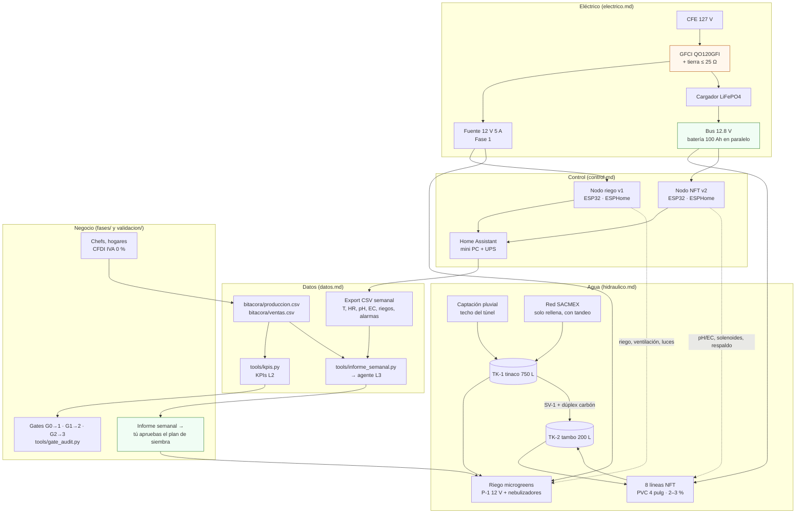

# Diseño del sistema

**En una línea:** el huerto es cinco bloques acoplados —agua, eléctrico, control, datos y
negocio— diseñados para que un corte de luz, un tandeo, un router reiniciado o una semana
sin vender no te cuesten el cultivo ni el proyecto; esta sección explica el *por qué* y el
*con qué* de cada bloque, y las [fases](../fases/fase-0/index.md) y [guías](../guias/sembrar-una-charola.md)
te dicen *cuándo* y *cómo*.

!!! info "Qué decide esta sección"
    - **Diseño** = decisiones de arquitectura con su número y su fuente (diámetros, calibres,
      bandas de control, esquema de datos). Se lee una vez, se consulta cuando algo se cambia.
    - **Fases** = qué comprar y armar en cada etapa, con gate al final. **Guías** = una tarea,
      una página, paso a paso.
    - Todo dato duro sale de [referencia/](../referencia/00-plan-maestro.md) y
      [research/](../research/electrico-respaldo-seguridad.md); lo que aún no está medido
      lleva la marca `[POR VERIFICAR: cómo]`.
    - **Prerequisitos:** [Antes de gastar un peso](../empieza-aqui/antes-de-gastar-un-peso.md)
      y [Cómo usar esta guía](../empieza-aqui/como-usar-esta-guia.md).

## Vista general: los cinco bloques

## Cómo se conectan los bloques

| De → a | Qué pasa entre ellos | Dónde está el detalle |
|---|---|---|
| Agua → control | Los sensores (LT-1 nivel, MT-1…4 humedad, TT-1/TT-2 temperatura, FT-1 caudal, AT-1 pH, AT-2 EC) viven en el circuito de agua y se leen desde los dos nodos ESP32 | [hidraulico.md §6](hidraulico.md) · [electrico.md (pines)](electrico.md) |
| Control → agua | Los nodos conmutan la bomba de riego, el ventilador, las peristálticas A/B/pH− y las solenoides SV-1/SV-2 por histéresis con banda muerta, nunca por PID | [control.md](control.md) |
| Eléctrico → agua | La recirculación del NFT cuelga de un bus de 12 V con batería LiFePO4 siempre en paralelo: sin CFE, la bomba sigue 28–30 h | [electrico.md §3](electrico.md) · [dc-first-failover.svg](../assets/diagramas/animaciones/dc-first-failover.svg) |
| Eléctrico → control | GFCI, tierra física y gabinetes IP65 separados (127 V / 12 V) antes del primer relé; el nodo NFT se alimenta del bus para seguir avisando en el corte | [electrico.md §4](electrico.md) · [instalar-gfci-y-tierra](../guias/instalar-gfci-y-tierra.md) |
| Control → datos | Home Assistant guarda todo lo medido y exporta un CSV por semana; las alarmas llegan al teléfono con tres severidades | [datos.md §2–3](datos.md) · [control.md (escalamiento)](control.md) |
| Operación → datos | Cada siembra, cosecha, merma y venta es una fila en `bitacora/*.csv` el mismo día, con el lote `VAR-AAMMDD-Slote-pos` en masking tape | [datos.md §1](datos.md) |
| Datos → negocio | Los KPIs L2 (sell-through, merma, entregas, recompra, margen) y el informe del agente L3 deciden qué sembrar; los gates L4 deciden si la siguiente fase se libera | [validacion/kpis](../validacion/kpis.md) · [validacion/gates](../validacion/gates.md) |
| Negocio → agua/eléctrico | Nada se construye antes de venderse: la Fase 1 (túnel + v1) se libera con G0→1, el NFT + respaldo con G1→2 | [00-plan-maestro](../referencia/00-plan-maestro.md) |

## Principios de diseño

Cinco reglas; cada página de diseño es una de ellas hecha números.

1. **DC-first.** La carga que no puede parar (bomba NFT, 40 W) es de 12 V y cuelga de una
   batería LiFePO4 12.8 V 100 Ah que está *siempre* en paralelo con el cargador. Respaldar
   la periférica de 0.5 HP a 120 V con inversor exigiría ~680 Ah y más de $30,000; la
   bomba de 12 V necesita ~40 Ah para 12 h ([research/electrico-respaldo-seguridad §2](../research/electrico-respaldo-seguridad.md),
   [03-instalacion §2.3](../referencia/03-instalacion.md)).
2. **El fail-safe es físico, no de software.** La bomba principal va por un contacto
   normalmente cerrado (K1 NC) con `restore_mode: RESTORE_DEFAULT_ON`; las solenoides son
   NC; sin ESP32, sin Wi-Fi y sin Home Assistant, el agua sigue circulando y el tinaco no se
   vacía. HA avisa y optimiza, no es requisito ([electrico.md](electrico.md), [control.md](control.md)).
3. **Histéresis con banda muerta, no PID.** Las plantas son procesos lentos y las sondas
   baratas son ruidosas: ON al cruzar el límite inferior, OFF al cruzar el superior, y para
   pH/EC dosis fija pequeña + tiempo muerto de mezcla de 10–15 min antes de re-medir
   ([06-validacion §L0](../referencia/06-validacion-y-lazos-agenticos.md)).
4. **Todo desde el tinaco, nunca de la toma directa.** En 2025–2026 hay tandeo formal en
   ~10 alcaldías; el sistema corre de reserva propia (750–1,100 L = 2–4 semanas) y la red
   solo rellena cuando hay presión ([02-restricciones §2](../referencia/02-restricciones-y-requisitos.md),
   [hidraulico.md](hidraulico.md)).
5. **Vender antes de construir.** Cada fase se financia con la anterior y su gate se
   escribe en Git antes de gastar; un gate no alcanzado se itera o se detiene, no se
   renegocia ([00-plan-maestro](../referencia/00-plan-maestro.md), [06-validacion §L4](../referencia/06-validacion-y-lazos-agenticos.md)).

!!! tip "La regla de oro de la operación"
    **Una capa solo escala problemas hacia arriba, nunca los resuelve dos veces.** Si L0
    (máquina) puede corregirlo, L1 (tú, 10 min al día) no lo toca; si L1 lo detecta pero no
    lo explica, lo empuja a L3 (agente semanal). Detalle en [control.md](control.md) y
    [datos.md](datos.md).

## Páginas de diseño

| Página | Qué decide | Fase | Diagramas que incrusta |
|---|---|---|---|
| [Eléctrico](electrico.md) | Nodos ESP32 (pines), bus DC-first, GFCI y tierra, alimentación y protecciones, calibres | 1 y 2 | `electrico/nodo-riego-v1.svg`, `nodo-nft-v2.svg`, `bus-dc-first.svg`, `tablero-gfci-tierra.svg`, `alimentacion-esp32.svg` |
| [Hidráulico](hidraulico.md) | Riego de microgreens, NFT recirculante y captación pluvial: diámetros, caudales, pendientes, tags de instrumentos, secuencias de llenado y purga | 1 y 2 | `hidraulico/riego-microgreens.svg`, `nft-recirculacion.svg`, `captacion-pluvial.svg` |
| [Control](control.md) | Lazos L0 (riego, pH/EC con tiempo muerto, ventilación, continuidad NFT), setpoints y bandas, interlocks, watchdogs y escalamiento de alarmas | 1 y 2 | `animaciones/lazo-histeresis.svg`, `dc-first-failover.svg` |
| [Datos](datos.md) | Bitácora CSV y formato de lote, entidades de Home Assistant, retención, KPIs L2 y el flujo semanal hacia el informe del agente L3 | 0 en adelante | `animaciones/semana-operativa.svg` |
| [Layout del patio](layout-patio.md) | Dónde va cada cosa en los 80 m² por fase: racks, túnel 3×6 → 5×6, tinaco, tambo, gabinetes, coladeras, tendidos | 0 a 3 | `layout/patio-fase-0.svg` … `patio-fase-3.svg`, `cad/patio-fase-2-3d.png` |
| [Estructura del túnel](estructura-tunel.md) | Geometría, cortes, anclaje, pendiente, plástico y malla antigranizo del túnel PTR | 1 y 2 | `cad/tunel-3x6.png`, `tunel-5x6.png` |
| [Rack y charolas](rack-y-charolas.md) | Rack Husky de 5 niveles, charolas 10×20, tubos T8, nebulizadores por nivel, zona de oscuridad | 0 y 1 | `layout/rack-alzado.svg`, `cad/rack-charolas.png` |

## Animaciones

Cinco SVG animados (SMIL, sin JavaScript, abren solos en cualquier navegador) que muestran
el sistema *en el tiempo*; cada uno vive en `docs/assets/diagramas/animaciones/`.

| Animación | Qué muestra | Se usa en |
|---|---|---|
| [nft-flujo.svg](../assets/diagramas/animaciones/nft-flujo.svg) | Partículas de solución recorriendo TK-2 → P-1 → F-1 → FT-1 → manifold → líneas → retorno; las sondas AT-1/AT-2 parpadean al medir y las peristálticas A/B/pH− dosifican al tambo | [hidraulico.md](hidraulico.md), [fase-2/nft](../fases/fase-2/nft.md) |
| [dc-first-failover.svg](../assets/diagramas/animaciones/dc-first-failover.svg) | Se corta CFE, la batería mantiene la bomba sin conmutación, el voltaje del bus baja despacio, llegan las alertas al teléfono, modo ahorro 15/15 y regreso de la red | [electrico.md](electrico.md), [control.md](control.md), [simulacro-de-apagon](../guias/simulacro-de-apagon.md) |
| [ciclo-microgreens.svg](../assets/diagramas/animaciones/ciclo-microgreens.svg) | Línea de tiempo 0–10 días de una charola de girasol: siembra → oscuridad con peso → destape → luz y riego por abajo → cosecha; los brotes crecen con el cursor | [sembrar-una-charola](../guias/sembrar-una-charola.md), [fase-0/siembra](../fases/fase-0/siembra.md) |
| [lazo-histeresis.svg](../assets/diagramas/animaciones/lazo-histeresis.svg) | Humedad de sustrato contra tiempo con límite superior e inferior y la bomba ON/OFF; pH con dosis fija, tiempo muerto de mezcla y re-medición | [control.md](control.md) |
| [semana-operativa.svg](../assets/diagramas/animaciones/semana-operativa.svg) | Calendario lun–dom: siembras lun y jue, cosecha y ruta mar y vie, cobro, fresh sheet del domingo, calibración quincenal y la revisión semanal con el informe del agente | [datos.md](datos.md), [timesheet-semanal](../guias/timesheet-semanal.md) |

## Cómo cambiar un diseño sin romper el resto

1. **Un número vive en un solo lugar.** Los pines están en `firmware/esphome/*.yaml`, en los
   scripts de `hardware/electrico/` y en la tabla de [electrico.md](electrico.md): si cambias
   uno, cambias los tres en el mismo commit. Lo mismo con los tags de instrumentos
   ([hidraulico.md §6](hidraulico.md)) y los setpoints ([control.md](control.md)).
2. **Los diagramas se regeneran, no se editan a mano:** `hardware/electrico/*.py`
   (schemdraw), `hardware/hidraulico/pid.py`, `hardware/cad/*.scad` (OpenSCAD). Las
   animaciones son SVG autocontenidos: ábrelos en el navegador antes de commitear.
3. **Un cambio de setpoint o de SOP es un commit** con la evidencia (semana, KPI, experimento
   V6) en el mensaje; el historial de Git es el manual de operación real
   ([06-validacion §L3](../referencia/06-validacion-y-lazos-agenticos.md)).
4. **Nada entra en producción sin su prueba:** dry-run V3 (72 h con inyección de fallas)
   para cualquier cambio de control, simulacro V11 para cualquier cambio en el bus DC,
   ensayo V2 para cualquier cambio de densidad ([validacion/](../validacion/index.md)).

## Al terminar

- [ ] Leíste las cinco reglas y sabes cuál página de diseño responde cada pregunta.
- [ ] Abriste las cinco animaciones en tu navegador (deben moverse solas, sin plugins).
- [ ] Ubicaste dónde vive cada número que podrías querer cambiar (pines, tags, setpoints, lote).
- Siguiente paso: [Eléctrico](electrico.md) e [Hidráulico](hidraulico.md) si vas a construir;
  [Control](control.md) y [Datos](datos.md) si vas a operar; [Layout del patio](layout-patio.md)
  si todavía estás decidiendo dónde va cada cosa.

## Fuentes

- [referencia/00-plan-maestro.md](../referencia/00-plan-maestro.md) — filosofía, mapa de fases y gates.
- [referencia/02-restricciones-y-requisitos.md](../referencia/02-restricciones-y-requisitos.md) — clima, tandeo, electricidad.
- [referencia/03-instalacion.md](../referencia/03-instalacion.md) — procedimiento por fases y arquitectura DC-first (§2.3).
- [referencia/06-validacion-y-lazos-agenticos.md](../referencia/06-validacion-y-lazos-agenticos.md) — lazos L0–L4, watchdogs, esquema de datos.
- [research/electrico-respaldo-seguridad.md](../research/electrico-respaldo-seguridad.md) — dimensionamiento del respaldo y automatizaciones.
- [research/hidroponia-nft.md](../research/hidroponia-nft.md) y [research/agua-captacion.md](../research/agua-captacion.md) — NFT y agua.
