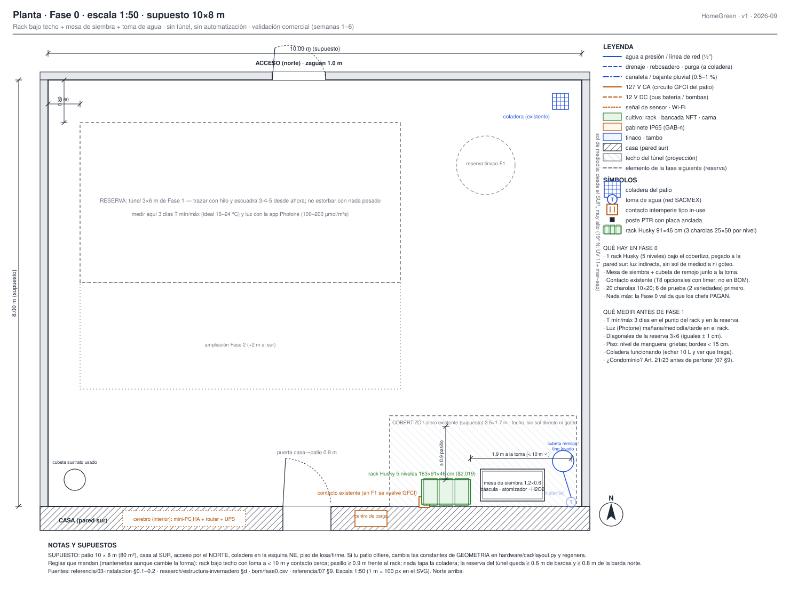
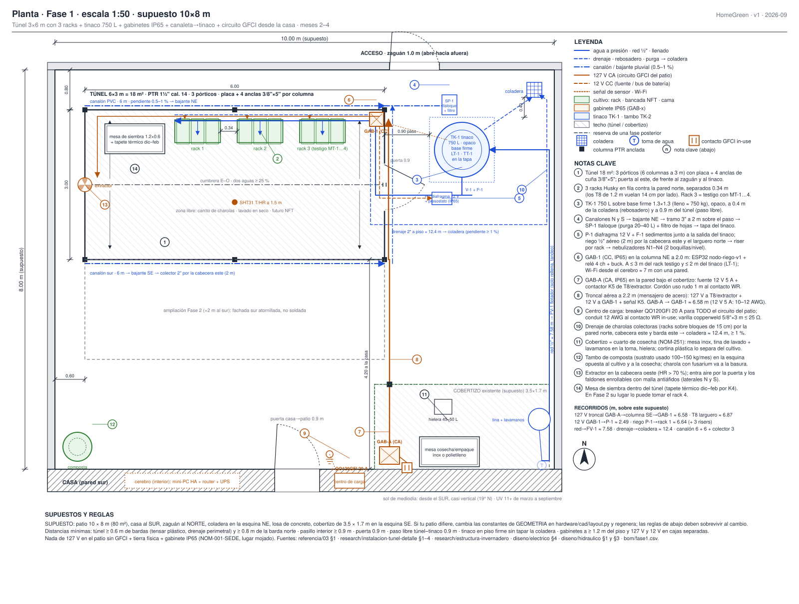
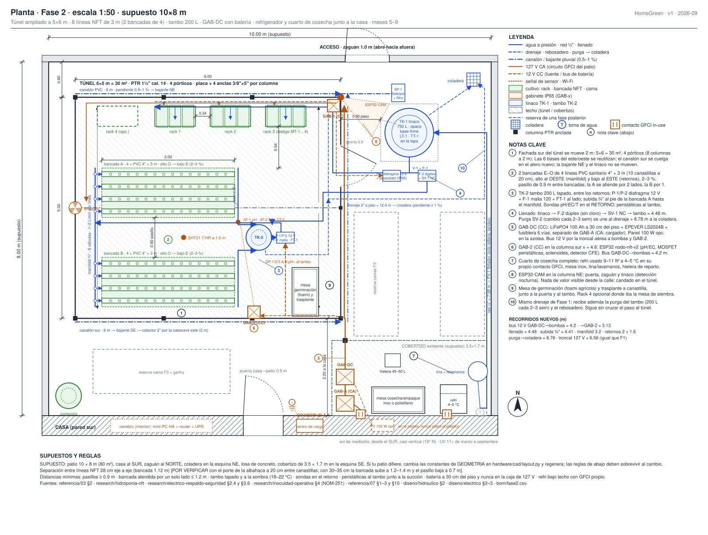
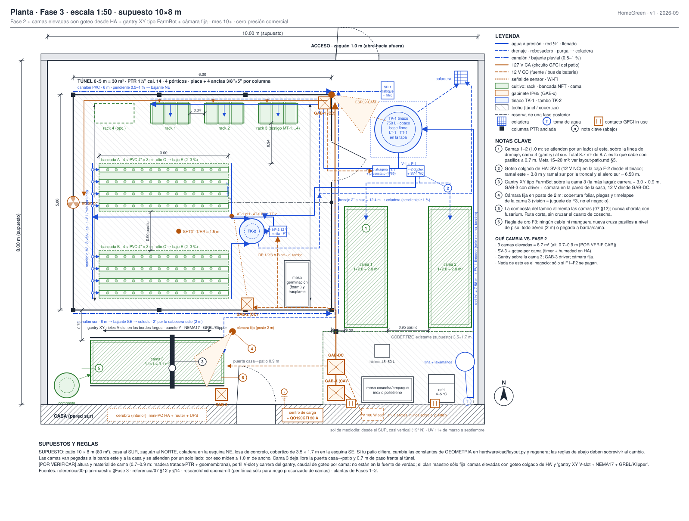

# Layout del patio por fase

**En una línea:** dónde va cada cosa en los 80 m² —racks, túnel, tinaco, tambo NFT, gabinetes, cuarto de cosecha, camas— y por dónde corren el agua y la electricidad, fase por fase, para que replantees el patio real en una mañana con hilo, cinta y escuadra.

!!! info "Qué decide esta página"
    - **La posición de cada elemento** en las cuatro plantas (Fase 0 → 3) y **qué cambia** de una fase a la siguiente sin tirar nada.
    - **Los recorridos** de agua (red, captación, riego, llenado, drenaje) y eléctricos (127 V, 12 V, señal) con su longitud sobre el supuesto: son los metros de cable, manguera y canalón que compras.
    - **Las distancias mínimas** (pasillos, separaciones, paso libre) que deben sobrevivir cuando tu patio no mida 10 × 8 m.
    - Cómo **adaptar** el plano a otro patio y el **checklist de replanteo** antes de perforar la losa.
    - Las plantas se generan con `hardware/cad/layout.py` (Python estándar, sin dependencias): cambia las constantes de la sección `GEOMETRIA` y regenera con `python3 hardware/cad/layout.py`. Escala 1:50 (1 m = 100 px), norte arriba, cotas en m.

!!! warning "Todo el patio del dibujo es un SUPUESTO"
    Patio de **10 × 8 m (80 m²), casa al sur, zaguán de 1.0 m al norte, coladera en la esquina noreste, losa de concreto, cobertizo existente de 3.5 × 1.7 m en la esquina sureste**. No conocemos tu predio. Lo que sí es diseño (y no supuesto) son las reglas de la sección [7. Distancias mínimas](#7-distancias-minimas-que-deben-sobrevivir-a-cualquier-patio): si las respetas, la forma exacta importa poco.

## 1. Cómo leer las plantas

- **Colores por sistema:** azul = agua (línea continua a presión, discontinua drenaje/purga, raya-punto canalón y bajante); ámbar = eléctrico (continua 127 V, discontinua 12 V CC, punteada señal/Wi-Fi); verde = cultivo (racks, bancadas NFT, camas); gris rayado = techos (túnel y cobertizo); gris discontinuo = reserva de una fase posterior.
- **Notas clave:** los círculos numerados del plano se explican en el bloque desplegable *«Leyenda y notas clave del plano»* que va debajo de cada imagen (también en las páginas de cada fase). Ese texto lo genera `hardware/cad/layout.py` en `docs/assets/diagramas/layout/<plano>.notas.md`: está fuera del dibujo a propósito, para leerlo a tamaño de lectura, buscarlo y copiarlo. Aquí abajo se repiten las decisiones, no el texto completo.
- **Tags de instrumentos** (TK-1, P-1, SV-1, LT-1, AT-1…) son los mismos de [hidraulico.md](hidraulico.md) y [electrico.md](electrico.md); los gabinetes son **GAB-A** (127 V CA), **GAB-1** (nodo de riego, CC), **GAB-2** (nodo NFT, CC), **GAB-DC** (batería y fusiblera) y **GAB-3** (gantry, Fase 3).
- **Orientación del túnel:** cumbrera este–oeste, puerta de 0.9 m en la cabecera **este** (de frente al zaguán y al tinaco), canalones en los aleros norte y sur con bajante en la esquina noreste. El render 3D `patio-fase-2-3d.png` de [estructura-tunel.md §8](estructura-tunel.md) tiene el túnel girado 90° (cumbrera norte–sur, puerta al norte): es un boceto de volumen; **manda esta planta**. Para que coincidan, en `hardware/cad/patio_fase2.scad` gira el túnel y cambia `tunel_cx`, `tunel_y0` y `tinaco_pos`.

## 2. Fase 0 — un rack bajo techo

??? note "Leyenda y notas clave del plano"

    --8<-- "assets/diagramas/layout/patio-fase-0.notas.md"

**Qué hay:** 1 rack Husky de 5 niveles (183 × 91 × 46 cm, $2,019 verificado, [BOM Fase 0](../referencia/bom.md)) pegado a la pared sur bajo el cobertizo, una mesa de siembra de 1.2 × 0.6 m junto a la toma de agua (1.6 m; el requisito es < 10 m), cubeta de remojo/tina, cubeta con tapa para sustrato usado en la esquina opuesta y el contacto existente (sin GFCI todavía). Nada más: la Fase 0 valida que los chefs **pagan** ([00-plan-maestro](../referencia/00-plan-maestro.md)).

**Por qué ahí:** el rack quiere luz indirecta, sin sol de mediodía (a 2,240 msnm el UV quema los brotes) y sin goteo; el cobertizo junto a la casa cumple las tres, tiene el contacto a 20 cm y la toma a < 2 m ([03-instalacion §0.1](../referencia/03-instalacion.md)).

**Qué haces con el resto del patio:** trazar con hilo y escuadra 3-4-5 la reserva del túnel de 3 × 6 m (a 0.6 m de las bardas oeste y 0.8 m de la norte) y medir ahí, durante 3 días, temperatura mín/máx (ideal 16–24 °C) y luz con la app Photone (100–200 µmol/m²s). No dejes nada pesado sobre la reserva ni sobre la futura base del tinaco.

## 3. Fase 1 — túnel 3 × 6, tinaco, gabinetes y GFCI

??? note "Leyenda y notas clave del plano"

    --8<-- "assets/diagramas/layout/patio-fase-1.notas.md"

**Qué cambia respecto a Fase 0:**

| Elemento | Dónde | Por qué ahí |
|---|---|---|
| Túnel 6 × 3 m (18 m²), 3 pórticos a 3 m, placa + 4 anclas de cuña 3/8" × 5" por columna | x 0.6–6.6, y 0.8–3.8 (0.6 m a la barda oeste, 0.8 m a la norte) | Deja 4.2 m libres hacia la casa para crecer 2 m en Fase 2 y para el paso; 0.6 m perimetrales para tensar plástico y drenar ([instalacion-tunel-detalle §2](../research/instalacion-tunel-detalle.md)) |
| Puerta 0.9 m en la cabecera este | y 1.9–2.8, abre hacia afuera | De frente al zaguán y al tinaco; el paso túnel–tinaco queda en 0.9 m |
| 3 racks Husky en fila | pared norte interior, x 2.4 / 3.65 / 4.9, separados 0.34 m | Los T8 de 120 cm vuelan 14 cm por lado; el rack 3 es el testigo con los 4 capacitivos y queda a ≤ 1.5 m de GAB-1 |
| Mesa de siembra 1.2 × 0.6 (+ tapete térmico dic–feb) | pared norte, oeste de los racks | Misma fila de trabajo; en Fase 2 su lugar lo puede tomar el rack 4 |
| Extractor | cabecera oeste, a 1.8 m | Tiro cruzado: entra aire por la puerta y los faldones, sale por el oeste |
| TK-1 tinaco 750 L sobre base firme 1.3 × 1.3 m | esquina NE, a 0.4 m de la coladera y 0.9 m del túnel | Lleno pesa ~750 kg: al piso, nunca sobre estructura; rebosadero corto a la coladera; base sombreada por la barda |
| SP-1 tlaloque + filtro de hojas | colgado del tramo de 3" a 2 m, junto al tinaco | El canalón norte baja en la esquina NE y cruza el paso **por arriba** (2 m); el canalón sur baja en la SE y sube por la cabecera este en un colector de 2" |
| P-1 (diafragma 12 V + presostato) + F-1 sedimentos | caja IP65 junto a la salida inferior del tinaco | Succión corta; la línea de riego ½" sube a 2 m, entra por la cabecera este sobre el dintel y corre por el larguero norte con un riser por rack |
| GAB-1 (nodo de riego, CC) | columna NE interior, a 2.0 m | ≤ 1.5 m del rack testigo (capacitivos: regla práctica 3 m), ≤ 2 m del tinaco (LT-1, TT-1) y de P-1; Wi-Fi a ~7 m del cerebro con una pared |
| GAB-A (127 V CA: fuente 12 V 5 A + contactor K5 de T8/extractor) | pared de la casa bajo el cobertizo, a 1.5 m | Cordón de uso rudo de 1 m al contacto WR in-use; bajo techo; en Fase 2 recibe el cargador |
| Troncal aérea a 2.2 m con mensajero de acero | cobertizo → columna SE → cabecera este → GAB-1 | 127 V (T8/extractor), 12 V (GAB-1) y señal K5 en un solo tendido; nunca cruza un pasillo a nivel de piso |
| Breaker QO120GFI 20 A + conduit 12 AWG + contacto WR + varilla copperweld 5/8" × 3 m | centro de carga y pared de la casa | Obligatorio antes del primer relé: el patio es "lugar mojado" ([electrico.md §4](electrico.md)) |
| Cuarto de cosecha (mesa inox, tina + lavamanos, hielera, cortina) | cobertizo | La mesa de siembra de Fase 0 se vuelve mesa de cosecha; corte separado del cultivo por cortina (NOM-251) |
| Tambo de composta | esquina SO | Lejos del cultivo y de la cosecha; 100–150 kg/mes de coco con raíces ([07 §12](../referencia/07-puntos-ciegos-y-riesgos.md)) |

**Drenaje (la decisión menos obvia):** las charolas colectoras de los 3 racks descargan a una manguera de 2" a nivel de piso que corre por la pared norte, baja por la cabecera este, sale del túnel en y = 3.1 m (al sur de la puerta), sigue por la barda este y llega a la coladera: **≈ 12.4 m con pendiente ≥ 1 %**. Para tener esa pendiente los racks van sobre bloques de 15 cm. Así ningún drenaje cruza el paso zaguán → puerta del túnel. Si en tu patio el recorrido pasa de ~12 m, usa tubo PVC sanitario de 2" en vez de manguera o drena a una cubeta con flotador [POR VERIFICAR: caudal real de drenaje de 3 racks; medirlo la primera semana con la charola colectora y una cubeta graduada].

## 4. Fase 2 — túnel 5 × 6, NFT, DC-first y cuarto de cosecha completo

??? note "Leyenda y notas clave del plano"

    --8<-- "assets/diagramas/layout/patio-fase-2.notas.md"

**Qué cambia respecto a Fase 1:**

| Elemento | Dónde | Por qué ahí |
|---|---|---|
| Fachada sur del túnel movida 2 m: 6 × 5 m = 30 m², 4 pórticos a 2 m | y 0.8–5.8; 2.2 m libres hasta la casa | Las bases de las columnas este/oeste se reutilizan; el canalón sur se cuelga en el alero nuevo; la bajante NE, el tinaco, GAB-1 y la troncal **no se mueven** |
| 2 bancadas NFT E–O de 4 líneas PVC sanitario 4" × 3 m | A: y 2.4–3.52 · B: y 4.42–5.54; x 1.2–4.2 | Alto al **oeste** (manifold ¾" con 8 válvulas) y bajo al **este** (retornos 2"), pendiente 2–3 %; pasillo de 0.9 m entre bancadas y 0.94 m frente a los racks; la A se atiende por dos lados, la B por uno |
| TK-2 tambo 200 L tapado + P-1/P-2 diafragma 12 V + F-1 malla 120 + FT-1 | entre los dos retornos, este de las bancadas | Retorno por gravedad; succión corta; sondas AT-1/AT-2/TT-2 en el retorno; peristálticas DP-1/2/3 dosifican al tambo junto a la succión ([03 §2.2](../referencia/03-instalacion.md)) |
| Subida ¾" bombas → manifold | al pie de la bancada A, por el piso pegada al tubo | No cruza pasillo; ≈ 4.4 m |
| Llenado: tinaco → F-2 dúplex sedimento + carbón → SV-1 NC → tambo | caja F-2 junto a P-1; entra al túnel por la cabecera este en y = 2.95 m | Quita el cloro de red antes del NFT; ≈ 4.5 m |
| Purga SV-2 (cambio cada 2–3 semanas, 200 L) | del tambo al drenaje de Fase 1 | Se une al colector de 2" dentro del túnel; ≈ 8.8 m a la coladera |
| GAB-2 (nodo NFT, CC) | columna sur en x = 4.6, a 1.5 m | 1.6 m a las sondas del retorno, 1.7 m a las bombas, 0.6 m del bus 12 V |
| GAB-DC (LiFePO4 100 Ah + EPEVER LS2024B + fusiblera) | pared de la casa bajo el cobertizo, batería a 30 cm del piso, caja separada de GAB-A | Bajo techo, cerca del cargador (GAB-A) y del contacto GFCI; bus 12 V por la troncal aérea: ≈ 4.2 m a las bombas (14 AWG cumple ≤ 3 % hasta 4 m; con 12 AWG hasta 6 m, [electrico.md §6](electrico.md)) |
| Panel 100 W (opcional) | azotea de la casa | Nunca sobre el plástico del túnel |
| Refrigerador usado 9–11 ft³ a 4–5 °C | cobertizo, contacto GFCI propio | El cortado a 20–25 °C dura < 1 día ([07 §3](../referencia/07-puntos-ciegos-y-riesgos.md)) |
| Mesa de germinación (foami) y trasplante | este del túnel, junto a la puerta y al tambo | Trasplante a canastilla sin cruzar el túnel |
| ESP32-CAM | columna NE, a 2 m | Ve puerta, zaguán y tinaco: detección nocturna ([07 §10](../referencia/07-puntos-ciegos-y-riesgos.md)) |
| Rack 4 (opcional) | donde estaba la mesa de siembra | La siembra pasa a la mesa del cobertizo |

!!! tip "Separación entre líneas NFT"
    El plano usa **28 cm eje a eje** (bancada de 1.12 m). Con albahaca de porte grande a 20 cm entre canastillas puede hacer falta 30–35 cm: la bancada sube a 1.2–1.4 m y el pasillo central baja a 0.7 m. Decide con la primera cosecha [POR VERIFICAR: ancho de dosel de albahaca Nufar/Genovese a 4–5 semanas en tu túnel].

## 5. Fase 3 — camas elevadas, goteo, gantry y cámara

??? note "Leyenda y notas clave del plano"

    --8<-- "assets/diagramas/layout/patio-fase-3.notas.md"

**Qué cambia respecto a Fase 2:** tres camas elevadas (alt. 0.7–0.9 m [POR VERIFICAR: material y altura no están en la fuente de verdad]) —dos de 1.0 × 2.8 m en la franja este, sobre la línea de drenaje, y una de 3.1 × 1.0 m al sur del túnel—, goteo colgado de HA desde el tinaco (SV-3 de 12 V NC en la caja F-2; ramal este ≈ 3.8 m y ramal sur por la troncal y el alero sur ≈ 6.5 m), gantry XY tipo FarmBot sobre la cama 3 (rieles V-slot en los bordes largos, carrera ≈ 3.0 × 0.9 m), GAB-3 con el driver en la pared de la casa y una cámara fija en poste de 2 m. La composta del tambo alimenta las camas sin cruzar el cuarto de cosecha.

**Sobre la meta de 15–20 m² de camas:** en este supuesto caben **8.7 m²** respetando pasillos ≥ 0.7 m, camas de ≤ 1.0 m atendidas por un lado y el paso al reparto. Para llegar a 15–20 m² tienes tres caminos, en orden de sensatez:

1. **No ampliar el túnel a 5 × 6** (quedarte en 3 × 6 con 3 racks + 4 líneas NFT): libera 12 m² al sur donde caben dos camas de 1.2 × 5 m atendidas por ambos lados (12 m²) → total ~20 m². Es la opción si la Fase 3 te importa más que la segunda bancada NFT.
2. **Camas en la azotea de la casa** (goteo desde el tinaco con la presurizadora de ¼ HP, [research/agua-captacion](../research/agua-captacion.md)): no compite con el negocio por el piso. [POR VERIFICAR: carga admisible de la losa de azotea; una cama de 1 × 3 m con 30 cm de sustrato húmedo pesa ~700 kg].
3. **Camas de dos niveles** (escalonadas contra la barda este): dobla la superficie de la franja este sin quitar pasillos, a costa de altura y de que el gantry solo cubra la cama baja.

Regla de oro de Fase 3: **ningún cable ni manguera nueva cruza pasillos a nivel de piso**; todo aéreo a 2 m o pegado a barda/cama. Nada de esto es el negocio: solo si Fases 1–2 se pagan ([00-plan-maestro §Fase 3](../referencia/00-plan-maestro.md)).

## 6. Recorridos de agua y eléctricos (metros sobre el supuesto)

Son las longitudes que compras (más 10–15 % de desperdicio y subidas/bajadas). Cambian si cambias la geometría; el script las recalcula e imprime en cada plano.

=== "Agua"

    | Recorrido | Trayecto | Longitud | Material | Fase |
    |---|---|---|---|---|
    | Red SACMEX → FV-1 flotador | toma en la pared de la casa → barda este (aéreo 1.5 m) → tinaco | ≈ 7.6 m | tubo/manguera ½" reforzada; solo rellena el tinaco, nunca alimenta riego directo | 1 |
    | Canalón norte y sur | aleros del túnel, pendiente 0.5–1 % hacia el este | 6 + 6 m (2 tramos de 3.07 m por alero, $269 c/u) | canalón PVC doméstico ([instalacion-tunel-detalle §4](../research/instalacion-tunel-detalle.md)) | 1 |
    | Bajante SE → colector → bajante NE → tlaloque → tinaco | cabecera este a 2 m + tramo horizontal sobre el paso | 3 m (F1) / 5 m (F2) + 1.3 m | PVC 2"–3" | 1 |
    | Rebosadero TK-1 → coladera | esquina NE | ≈ 1 m | manguera 1" | 1 |
    | Riego P-1 → risers de los racks | junto al tinaco → cabecera este (sobre el dintel) → larguero norte → 3 risers | ≈ 6.6 m + 3 × 2 m | manguera ½" del kit de nebulizadores | 1 |
    | Drenaje racks → coladera | pared norte → cabecera este → sale en y = 3.1 → barda este → coladera | ≈ 12.4 m, pendiente ≥ 1 % | manguera o PVC sanitario 2" | 1 |
    | Llenado tinaco → F-2 → SV-1 → TK-2 | caja F-2 → cabecera este (y = 2.95) → tambo | ≈ 4.5 m | tubo ½" | 2 |
    | Subida bombas → manifold | pie de la bancada A | ≈ 4.4 m | PVC/manguera ¾" | 2 |
    | Manifold + retornos | oeste / este de las bancadas | 3.2 m + 2 × 1.6 m | ¾" con 8 válvulas / sanitario 2" | 2 |
    | Purga SV-2 → coladera | tambo → colector de drenaje | ≈ 8.8 m | sanitario 2" | 2 |
    | Goteo camas (SV-3) | ramal este / ramal sur por la troncal y el alero sur | ≈ 3.8 m / ≈ 6.5 m | manguera ½" + cinta de goteo | 3 |

=== "Eléctrico"

    | Recorrido | Trayecto | Longitud | Conductor (ver [electrico.md §6](electrico.md)) | Fase |
    |---|---|---|---|---|
    | Centro de carga → contacto WR in-use | dentro de la casa, conduit | ≈ 1.5–3 m [POR VERIFICAR en sitio] | 12 AWG THW-LS ×3 en conduit; breaker QO120GFI | 1 |
    | Contacto WR → GAB-A | pared del cobertizo | 1 m | cordón SJT 3 × 14 AWG uso rudo | 1 |
    | Troncal aérea GAB-A → mástil → columna SE → cabecera este → GAB-1 | a 2.2 m con mensajero de acero | ≈ 6.6 m (igual en F1 y F2) | 127 V: 14 AWG (T8 + extractor, K5) · 12 V 5 A: 10–12 AWG por caída ≤ 3 % · señal K5: 18 AWG | 1 |
    | 127 V larguero norte → T8 de cada rack y extractor | dentro del túnel, a 2 m | ≈ 6.9 m + 3 bajadas | 14 AWG en canaleta, tierra al chasis del rack | 1 |
    | 12 V GAB-1 → P-1 | cabecera este a 2 m → caja P-1 | ≈ 2.5 m | 14 AWG | 1 |
    | Sensores → GAB-1 | MT-1…4 (rack 3), SHT31 (centro), LT-1/TT-1 (tinaco) | 1.5 / 2.5 / 2 m | 22–24 AWG blindado; conector capacitivo hacia arriba | 1 |
    | Wi-Fi cerebro → GAB-1 / GAB-2 | una pared | ≈ 7 m | — (si hay pérdida de paquetes, repetidor en la ventana) | 1 |
    | Bus 12 V GAB-DC → bombas NFT / → GAB-2 | troncal aérea → pared sur | ≈ 4.2 m / ≈ 3.1 m | 12 AWG (F1/F2 10 A en fusiblera) | 2 |
    | Sondas AT-1/AT-2/TT-2 → GAB-2 | retorno → columna sur | ≈ 1.6 m | cable BNC de la sonda [POR VERIFICAR: largo del cable de la sonda comprada] | 2 |
    | GAB-DC → GAB-3 (gantry) | pared de la casa, aéreo sobre la puerta | ≈ 2.3 m | 14 AWG | 3 |

!!! danger "Lo que no negocia ningún patio"
    Todo lo de 127 V en el patio cuelga de **un** breaker GFCI, va en conduit o cordón de uso rudo, entra a gabinetes IP65 por prensaestopas y tiene tierra física medida ≤ 25 Ω. 127 V y 12 V nunca comparten gabinete. Los cruces de pasillos son **aéreos a ≥ 2 m**, nunca por el piso ([electrico.md §4](electrico.md), [research/electrico-respaldo-seguridad §3.6](../research/electrico-respaldo-seguridad.md)).

## 7. Distancias mínimas que deben sobrevivir a cualquier patio

| Regla | Valor | De dónde sale |
|---|---|---|
| Túnel a bardas laterales / a la barda norte | ≥ 0.6 m / ≥ 0.8 m | Espacio para tensar plástico, canalón y drenaje perimetral ([03 §1.1](../referencia/03-instalacion.md)) |
| Anclas a bordes o grietas de la losa | ≥ 15 cm; losa sana ≥ 10 cm | [instalacion-tunel-detalle §1](../research/instalacion-tunel-detalle.md) |
| Pasillos de trabajo (racks, bancadas, cosecha) | ≥ 0.9 m; entre camas ≥ 0.7 m | Carrito de charolas y dos personas de frente; regla práctica del diseño |
| Bancada NFT atendida por un solo lado | ≤ 1.2 m de ancho | Alcance de brazo; la bancada B del plano mide 1.12 m |
| Separación entre racks en fila | ≥ 0.30 m (plano: 0.34 m) | Los T8 de 120 cm vuelan 14.3 cm por lado del rack de 91.4 cm |
| Paso libre túnel–tinaco / puerta del túnel | ≥ 0.9 m | Una persona con charola; puerta de 0.9 m ([estructura-tunel.md](estructura-tunel.md)) |
| Tinaco | al piso sobre base firme; rebosadero a ≤ 1 m de la coladera; sin tapar la coladera; opaco o a la sombra | 750 kg lleno ([03 §1.2](../referencia/03-instalacion.md)); algas ([research/agua-captacion](../research/agua-captacion.md)) |
| Toma de agua al punto de siembra | < 10 m | [03 §0.1](../referencia/03-instalacion.md) |
| Rack | bajo techo, sin sol de mediodía ni goteo; nivelado; sobre bloques de 15 cm si drena por manguera | [03 §0.2](../referencia/03-instalacion.md) |
| Sensores capacitivos → GAB-1 | ≤ 3 m | Señal analógica ([electrico.md §6](electrico.md)) |
| Gabinetes | a ≥ 1.2 m del piso; GAB-A (CA) y GAB-1/GAB-2/GAB-DC (CC) separados; batería a ≥ 30 cm del piso, bajo techo | [electrico.md §1](electrico.md) |
| Cerebro (mini-PC, router, UPS) | dentro de la casa | Humedad y robo ([07 §10](../referencia/07-puntos-ciegos-y-riesgos.md)) |
| Cruces de pasillos | cables y mangueras aéreos a ≥ 2 m; drenajes nunca cruzan el paso zaguán → puerta | Regla de oro de estas plantas |
| Cuarto de cosecha | bajo techo, separado del cultivo por cortina, con lavamanos y mesa inox/polietileno | NOM-251 ([research/inocuidad-operativa §4](../research/inocuidad-operativa.md)) |
| Composta | en la esquina opuesta al cultivo y a la cosecha, con tapa | Fungus gnats ([07 §12](../referencia/07-puntos-ciegos-y-riesgos.md)) |
| Sustrato usado con fusarium | fuera del área de producción el mismo día | [07 §12](../referencia/07-puntos-ciegos-y-riesgos.md) |

## 8. Cómo adaptar el plano a tu patio

1. **Levanta tu patio** en una hoja cuadriculada (1 cuadro = 0.5 m): bardas, casa, puertas, zaguán, coladera(s), toma, contacto, centro de carga, techos existentes, árboles y **pendiente del piso** (nivel de manguera: ¿hacia dónde corre el agua?). Foto de todo.
2. **Fija primero lo que no se mueve:** la coladera manda el drenaje y el rebosadero; el centro de carga manda por dónde entra el 127 V; el techo existente manda dónde va el rack de Fase 0 y el cuarto de cosecha.
3. **Coloca el túnel** con 0.6/0.8 m a bardas y la cumbrera paralela al lado largo del patio; **la puerta, del lado del zaguán**. Si el patio es más angosto que 4.2 m de ancho libre, el túnel de 3 m no cabe con pasillos: baja a 2.5 m de ancho o pon los racks en la cabecera.
4. **Pon el tinaco en la esquina más cercana a la coladera y al alero del túnel**, nunca donde tape la coladera ni donde estorbe el paso.
5. **Traza la troncal eléctrica** desde el contacto GFCI hasta la columna del túnel más cercana, siempre pegada a pared o aérea con mensajero; GAB-A donde hay techo, GAB-1 en la columna más cercana al rack testigo y al tinaco.
6. **Dibuja los drenajes** desde cada punto húmedo hasta la coladera comprobando que **ninguno cruce un pasillo**; si es inevitable, el cruce va bajo rampa pasacables y lo anotas en el plano.
7. **Edita `hardware/cad/layout.py`** (sección `GEOMETRIA`: `ACCESO`, `COLADERA`, `TOMA`, `CONTACTO`, `COBERTIZO`, `TUNEL_F1/F2`, `TINACO`, …), regenera y vuelve a leer las longitudes del bloque **Notas → Recorridos** (en el desplegable bajo cada plano, o en `docs/assets/diagramas/layout/<plano>.notas.md`): son tu lista de compra de cable, manguera y canalón.
8. **Patio en renta o condominio:** sin permiso de perforar, el anclaje son dados de ≥ 80 kg por columna y vientos ([instalacion-tunel-detalle §1](../research/instalacion-tunel-detalle.md)); verifica Art. 21/23 de la Ley de Propiedad en Condominio antes de gastar ([07 §9](../referencia/07-puntos-ciegos-y-riesgos.md)).

!!! example "Ejemplos rápidos"
    - **Patio de 8 × 10 m (largo norte–sur):** gira todo 90°: cumbrera norte–sur, puerta en la cabecera que mira al zaguán, tinaco en la esquina de la coladera. Es exactamente la orientación del render 3D.
    - **Coladera en el centro del patio:** el drenaje se acorta; cuida que el túnel no la tape (déjala en un pasillo) y que el rebosadero del tinaco llegue con ≥ 1 %.
    - **Sin cobertizo:** el rack de Fase 0 va dentro de la casa (cuarto de servicio) y el cuarto de cosecha se resuelve con un techo ligero de 2 × 2 m junto a la puerta de la casa, antes de la Fase 2.

## 9. Checklist de replanteo (antes de perforar)

- [ ] Plano propio dibujado con coladera, toma, contacto, centro de carga y pendiente del piso; foto de cada uno.
- [ ] Reserva del túnel trazada con hilo; diagonales iguales ± 1 cm; ninguna ancla a < 15 cm de borde o grieta; losa ≥ 10 cm (barreno de prueba).
- [ ] 3 días de T mín/máx y luz (Photone) medidos en el punto del rack y en la reserva.
- [ ] Coladera probada (10 L de golpe se van) y recorrido de cada drenaje marcado con gis, sin cruzar pasillos.
- [ ] Base del tinaco marcada; comprobado que el tinaco pasa por el zaguán (o por la casa) [POR VERIFICAR: Ø del Resistec 750 L en la ficha Rotoplas].
- [ ] Punto del contacto WR, trayecto del conduit y punto de la varilla de tierra acordados con el electricista (cotización por escrito).
- [ ] Trayecto de la troncal aérea marcado a 2.2 m; ningún cruce de pasillo a nivel de piso.
- [ ] Vecinos y condominio informados/consultados; uso de suelo verificado en SEDUVI ([07 §9](../referencia/07-puntos-ciegos-y-riesgos.md)).
- [ ] Longitudes del bloque **Notas → Recorridos** de la planta (desplegable bajo la imagen) copiadas a la lista de compras de Fase 1 (`docs/fases/fase-1/compras.md`).

Registrar en bitácora: una fila `SITIO-AAMMDD` en `bitacora/produccion.csv` con las medidas en `observaciones` (T mín/máx, µmol, diagonales, foto), igual que en [Montar el rack](../fases/fase-0/montaje.md). Si prefieres un `bitacora/obra.csv` aparte, créalo con `fecha,medida,valor,foto` [POR VERIFICAR: no existe aún en el repo].

## Fuentes

- [03-instalacion](../referencia/03-instalacion.md) §0.1–0.2 (sitio del rack), §1.1–1.3 (túnel, agua, seguridad eléctrica), §2 (NFT).
- [research/estructura-invernadero](../research/estructura-invernadero.md) (racks, túnel 3×6 → 5×6, anclaje y viento).
- [research/instalacion-tunel-detalle](../research/instalacion-tunel-detalle.md) §1 (anclaje), §2 (croquis y trazo), §4 (canalón, tlaloque, tinaco).
- [07-puntos-ciegos-y-riesgos](../referencia/07-puntos-ciegos-y-riesgos.md) §3 (frío), §9 (condominio), §10 (seguridad), §12 (residuos).
- [electrico.md](electrico.md), [hidraulico.md](hidraulico.md), [estructura-tunel.md](estructura-tunel.md), [rack-y-charolas.md](rack-y-charolas.md); BOM por fase en [referencia/bom.md](../referencia/bom.md) (`bom/fase1.csv`, `bom/fase2.csv`).
