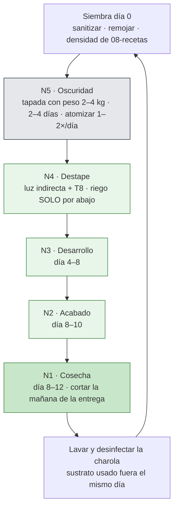

# Rack y charolas

**En una línea:** el rack Husky de 5 niveles (183 × 91 × 46 cm) es la unidad de producción de
microgreens: 3 charolas 1020 por nivel, oscuridad arriba, luz T8 y nebulizadores en los cuatro
niveles de abajo, y cada charola **baja un nivel por etapa** hasta cosecharse a la altura de la
mano. Esta página explica el alzado, cuántas charolas caben de verdad, qué carga aguanta, cómo se
ilumina y se riega cada nivel, y por dónde circulan las charolas.

!!! info "Antes de empezar"
    - **Tiempo:** 15 min de lectura; el armado real es 1.5–2 h en
      [Fase 0 · Montar el rack](../fases/fase-0/montaje.md). · **Costo:** rack $2,019
      (verificado, Home Depot) + 20 charolas ≈ $1,200 aprox. ([BOM Fase 0](../fases/fase-0/compras.md));
      en Fase 1 se suman 8 tubos T8 ($968 verificado) + nebulizadores ($250 aprox.)
      ([BOM Fase 1](../fases/fase-1/compras.md)). · **Personas:** 1 (2 para mover el rack armado).
    - **Necesitas:** el rack, 10 charolas perforadas + 10 lisas, plástico para forrar los
      entrepaños, nivel de burbuja, calzas, 4 bloques macizos de 15 cm, masking y marcador
      ([04-herramientas](../referencia/04-herramientas.md)).
    - **Prerequisitos:** [Layout del patio](layout-patio.md) (dónde va el rack: bajo techo, sin
      sol de mediodía ni goteo, toma a < 10 m) y el SOP de siembra
      ([Sembrar una charola](../guias/sembrar-una-charola.md)).

## Vista general

??? note "Leyenda, flujo de charolas y tablas del alzado"

    --8<-- "assets/diagramas/layout/rack-alzado.notas.md"

**Cómo leerlo.** Verde = charolas y dosel (achurado más alto = más días de cultivo); ámbar =
tubos T8 y sensores; azul = línea de nebulizadores, boquillas y charola colectora; gris oscuro
translúcido = zona de oscuridad (N5); gris = entrepaños de MDF forrados. La columna de
etiquetas a la derecha del rack marca el flujo de charolas: ① siembra arriba → ⑤ cosecha
abajo; cada etapa se explica completa en el desplegable de arriba, junto con la leyenda y las
tablas de capacidad, cargas, iluminación y riego. Cotas en cm; el dibujo se genera con
`hardware/cad/layout.py` (constantes `RACK_*`, `SHELF_TOPS`, `CANOPY`).

| Modelo | Qué decide | Render | Archivo |
|---|---|---|---|
| Alzado 2D | Niveles, zonas, luz, riego, capacidad y cargas | [`rack-alzado.svg`](../assets/diagramas/layout/rack-alzado.svg) | [`hardware/cad/layout.py`](https://github.com/AndresIslas99/HomeGreen/blob/main/hardware/cad/layout.py) |
| Rack 3D | Volumen real de charolas, tubos y riser; `charolas_por_nivel`, `niveles_iluminados`, `estado_niveles` | [`rack-charolas.png`](../assets/diagramas/cad/rack-charolas.png) | [`hardware/cad/rack_charolas.scad`](https://github.com/AndresIslas99/HomeGreen/blob/main/hardware/cad/rack_charolas.scad) |

!!! note "El render 3D muestra N1 tapado; el alzado muestra N1 en cosecha"
    Son las dos variantes de [03-instalacion §0.2](../referencia/03-instalacion.md): "nivel
    superior = germinación/oscuridad, niveles medios = desarrollo, nivel inferior = charolas recién
    sembradas (más fresco)". El alzado dibuja el **flujo normal** (N5 oscuridad → N1 cosecha); el
    render dibuja la **variante de verano** (con más de 27 °C arriba, las recién sembradas van
    abajo). Ver [§4](#4-zonas-por-nivel-y-flujo-de-charolas).

## 1. El rack: por qué el Husky y qué cambiarle

La carga nunca es el problema: una charola 1020 con coco saturado pesa 2.5–4 kg y un nivel lleno
no pasa de 40 kg. Lo que importa en un patio húmedo es **rigidez, tolerancia a la humedad y
entrepaños ajustables** ([research/estructura-invernadero §d](../research/estructura-invernadero.md)).

| Opción | Medidas (alto × ancho × fondo) | Carga por repisa | Precio | Charolas 1020 por nivel | Lectura |
|---|---|---|---|---|---|
| **Husky 5 niveles** ([Home Depot](https://www.homedepot.com.mx/p/husky-estante-de-5-niveles-de-acero-183-x-914-x-457-cm-negro-zrop361872-5llb-150281)) | 183 × 91.4 × 45.7 cm | 362.9 kg | **$2,019** verificado | **3** | La compra de Fase 0 y Fase 1; entrepaños de MDF: **forrarlos** |
| Husky ancho ([Home Depot](https://www.homedepot.com.mx/p/husky-estante-de-5-niveles-de-acero-183-x-12192-x-61-cm-negro-zrop482472-5llb-150283)) | 183 × 121.9 × 61 cm | 360 kg | $2,625 verificado | 4 (la charola de 50.8 cabe completa en 61 de fondo) | Mejor $/charola si el pasillo del túnel lo permite (30 cm más de ancho por rack) |
| HDX todo metal ([Home Depot](https://www.homedepot.com.mx/p/hdx-estante-metal-5-niveles-795-kg-de-carga-899-x-347-x-182-cm-resistente-121-755-121755)) | 182 × 89.9 × 34.7 cm | 159 kg | $2,089 verificado | 3, pero la charola vuela 16 cm | Sin MDF; el volado grande obliga a fijar las charolas: no lo recomendamos para nebulizar |
| Rack Adir galvanizado ([ML](https://www.mercadolibre.com.mx/estante-anaquel-rack-repisas-5-niveles-metalico-180x40x90-cm/p/MLM28717444)) | 180 × 90 × 40 cm | ≈ 35 kg aprox. | ≈ $1,100–1,600 aprox. | 3 (vuela 11 cm) | Versión austera de Fase 0; menos rígido, se oxida en 1–2 temporadas de riego |
| Whalen 5 repisas ([Costco](https://www.costco.com.mx/Hogar-y-Bano/Almacenaje-y-Organizacion/Estanteria-Multiusos/Whalen-Estante-de-5-Repisas-Ajustables/p/625073)) | 182.8 × 121.9 × 45.7 cm | 454 kg | agotado al 12-sep-2026 | 4 | El clásico de cuartos de cultivo; revisar en tienda física |

**Modificaciones obligatorias al Husky** ([03-instalacion §0.2](../referencia/03-instalacion.md)
y decisiones de diseño de esta wiki):

1. **Forrar cada entrepaño de MDF** con plástico grueso o poner una charola lisa debajo: el MDF
   se hincha con el primer riego que se derrama. Sube y baja los entrepaños con el rack vacío
   (se destraban a golpe de mazo de goma).
2. **Paso entre entrepaños ≥ 30 cm** (charola + brote + mano). Con 5 entrepaños en 183 cm el
   paso queda en **≈ 43 cm** (caras superiores a 10, 53, 96, 139 y 182 cm del piso en el
   alzado) [POR VERIFICAR con las posiciones reales de los postes del Husky: si los agujeros no
   coinciden, mantén ≥ 30 cm en N1–N4 y regala el sobrante a N5].
3. **Nivelar** con nivel de burbuja en los dos sentidos de cada entrepaño y **calzar las patas**:
   diferencia ≤ 1 cm entre esquinas. Una charola desnivelada encharca una esquina, y esa esquina
   es donde nace el moho.
4. **Bloques macizos de 15 cm bajo las cuatro patas** (Fase 1, decisión de
   [Layout del patio §3](layout-patio.md)): dan pendiente a la manguera de drenaje de la charola
   colectora hasta la coladera. Bloques de concreto, no ladrillo hueco.
5. **Separación ≥ 30 cm entre racks en fila**: los tubos T8 de 120 cm vuelan 14.3 cm por lado
   del rack de 91.4 cm.
6. **Tierra al chasis** del rack cuando lleve T8 (14 AWG verde desde GAB-A, [Eléctrico §6](electrico.md))
   y **una trampa amarilla pegajosa por rack** ([BOM Fase 1](../fases/fase-1/compras.md)).

## 2. Charolas 1020: doble charola y capacidad real

La charola "10×20" (1020) mide **25.4 × 50.8 cm** nominales; las mexicanas que se venden como
1020 miden 52 × 23 cm (Al Natural, $70 verificado) y las Bootstrap Farmer importadas 53.3 × 27.3
× 3.1 cm ([research/semillas-sustrato-charolas §c](../research/semillas-sustrato-charolas.md)).
El flujo estándar es **doble charola**: una perforada (drenaje) dentro de una lisa (riego por
fondo y tapa de oscuridad); para 20 charolas de Fase 0 son 10 + 10.

**Capacidad por geometría** (entrepaño de 91.4 × 45.7 cm):

| Dónde | Cuántas | Por qué |
|---|---|---|
| Por nivel, Husky 91.4 cm | **3** atravesadas | 3 × 25.4 = 76.2 cm de 91.4 (quedan 3.8 cm entre charolas); la charola de 50.8 vuela 5.1 cm sobre el fondo de 45.7 (2.5 por lado o todo al frente) |
| Por nivel, Husky 121.9 cm | 4 | 4 × 25.4 = 101.6 cm de 121.9; el fondo de 61 cm la recibe completa |
| En luz por rack (N1–N4) | **12 posiciones** | 4 niveles × 3 |
| En oscuridad por rack (N5) | 6–9 | 3 pilas de 2–3 charolas tapadas con peso |
| **En proceso por rack** | **18–21** | Suma de las dos filas anteriores |
| 3 racks (Fase 1) | 36 en luz + 18–27 en oscuridad | Ciclo de 8–12 días con ~7 días en luz: el techo es ≈ 36 charolas/semana; la meta de 25–35 pide 70–85 % de ocupación |

!!! warning "La investigación dice 8–10 por nivel: no cabe"
    [research/estructura-invernadero §d](../research/estructura-invernadero.md) afirma que en un
    nivel de 90 × 45 cm "caben 8–10 charolas 10×20". Geométricamente 8 charolas de 25 × 50 cm
    piden ~1 m² por nivel: en 0.42 m² caben 3. Toda la economía de esta wiki (30 charolas/semana
    con 3 racks, [07 §4](../referencia/07-puntos-ciegos-y-riesgos.md)) está calculada con **3 por
    nivel**. [POR VERIFICAR con el rack armado: mide el claro real entre postes; si las charolas
    compradas miden 23 cm de ancho, sigue siendo 3 (3 × 23 = 69 cm)].

En **Fase 0 el límite no es el rack sino las 10 charolas dobles del BOM** (≈ 10 en proceso,
≈ 6 cosechadas por semana); si en la semana 3 ya hay pedidos, compra 10 perforadas y 10 lisas
más ([Fase 0 · Compras](../fases/fase-0/compras.md)).

## 3. Cargas

| Elemento | Carga | Fuente / cálculo |
|---|---|---|
| Charola doble con coco saturado | 2.5–4 kg | [research/estructura-invernadero §d](../research/estructura-invernadero.md) |
| Nivel en luz (3 charolas) | 3 × 4 = **12 kg** | cálculo |
| N5 tapado (3 pilas de 2 charolas + peso de 2–4 kg) | 3 × (2 × 4 + 4) = **36 kg** | cálculo; el peso son ladrillos o una charola con agua |
| Carga viva total por rack | 4 × 12 + 36 ≈ **84 kg** | cálculo |
| Peso propio del rack | [POR VERIFICAR: dato de la caja; el Husky es acero + 5 tableros de MDF] | — |
| Capacidad de placa | 362.9 kg **por repisa**, 1,814 kg total | Home Depot (verificado) |
| Margen | > 10× por repisa | cálculo |

Reglas prácticas:

- El **centro de gravedad queda alto** (N5 es el nivel más cargado). Dentro del túnel, con
  faldones abiertos y rachas de 50–80 km/h, ancla el rack a la columna o larguero más cercano
  con una abrazadera o cincho de acero (recomendación de diseño; no está en la fuente de verdad).
- Los **4 bloques de 15 cm** deben ser macizos y estar nivelados entre sí; el rack cargado pesa
  ≈ 120–150 kg y cada pata concentra 30–40 kg en 10 cm²: en losa de concreto no hay problema,
  en piso de tierra pon una solera o placa.
- La **charola colectora** (una charola lisa o una tina baja bajo N1) recibe el goteo de todo
  el rack y drena por manguera a la coladera: es la única pieza que puede juntar más de 10 L,
  no la dejes llenarse.

## 4. Zonas por nivel y flujo de charolas

Las zonas salen del SOP de [03-instalacion §0.2–0.3](../referencia/03-instalacion.md) y de los
días por especie de [08-recetas](../referencia/08-recetas-y-economia-unitaria.md). Arriba hace
más calor (germina), abajo está más fresco (conserva): **cada charola baja un nivel por etapa**.

| Nivel | Zona | Días (típico) | Luz | Riego | Qué observas |
|---|---|---|---|---|---|
| **N5** (arriba, más cálido) | Oscuridad: pilas de 2–3 charolas tapadas con charola invertida + peso 2–4 kg, cubierta opaca | 0 → 2–4 (rábano/brócoli 2–3; girasol/chícharo 3–4; betabel 6–8) | Ninguna: sin T8 | Atomizar 1–2×/día a mano | Tallos amarillos levantan la tapa; raíces blancas parejas |
| **N4** | Destape / brote | 2–4 → 4–5 | Indirecta + T8 12–14 h | **Solo por abajo** desde aquí (agua entre la lisa y la perforada) | Verdea en 24–48 h |
| **N3** | Desarrollo | 4–8 | T8 12–14 h | Por abajo | Tallo y cotiledón abiertos |
| **N2** | Acabado | 8–10 | T8 12–14 h | Por abajo | Color y densidad finales |
| **N1** (abajo, más fresco) | Pre-cosecha → cosecha | 8–12 (betabel 13–18; cilantro 18–24) | T8 12–14 h | Suspender 12–24 h antes de cortar | Se corta la mañana de la entrega, tijera sobre el sustrato |

- **Posición en la bitácora:** el código de lote termina en la posición (`…-R1N5` = rack 1,
  nivel 5) como en [Sembrar una charola](../guias/sembrar-una-charola.md); cuando la charola
  baja de nivel no cambies el código, solo el campo `observaciones` si algo raro pasa.
- **Variante de verano** (> 27 °C en N5, junio–septiembre con HR de 70–89 %): invierte el
  arranque —las recién sembradas tapadas van a **N1**, el nivel más fresco— y la cosecha sube a
  N2; siembra ~10 % menos denso ([03 §0.3](../referencia/03-instalacion.md)).
- **Invierno** (diciembre–febrero, noches de 5–9 °C): la germinación se alarga 30–50 %; el
  tapete térmico de 380 aprox. va bajo la pila de N5 (relé K4 en Fase 1) o la pila se muda al
  punto más cálido de la casa ([Germinar en invierno](../guias/germinar-en-invierno.md)).
- **Siembras escalonadas:** con 3 posiciones por nivel y un ciclo de ~10 días, sembrar
  lunes y jueves llena N5 cada vez con 3–6 charolas y mantiene una charola cosechable en N1
  casi todos los días de entrega ([Fase 1 · índice](../fases/fase-1/index.md)).

## 5. Iluminación

| Parámetro | Valor | Fuente |
|---|---|---|
| Tubo | LED T8 18 W, 120 cm, 6500 K, 1,400 lm — **$121 c/u verificado** ([JWJ Light](https://jwjlight.mx/producto/tubo-led-t8-18w-120-cm/)) | [research/clima-agronomia §8](../research/clima-agronomia.md) |
| Por nivel | 2 tubos bajo el entrepaño de arriba, a 3 cm de su cara inferior, sobre el eje de la 1.ª y 3.ª charola | alzado |
| Por rack | 8 tubos (N1–N4; N5 no lleva) = 144 W; **$968** + canaletas y cable ≈ $400 aprox. | [BOM Fase 1](../fases/fase-1/compras.md) |
| Horario | 12–14 h/día por el relé K3 → contactor K5 en GAB-A (fusible F5 2 A, 14 AWG en canaleta, tierra al chasis) | [Eléctrico §1 y §6](electrico.md) |
| Consumo | 8 × 18 W × 13 h ≈ 1.9 kWh/día ≈ 52–60 kWh/mes ≈ $60–90/mes por rack | [02-restricciones](../referencia/02-restricciones-y-requisitos.md), [Eléctrico](electrico.md) |
| Meta de luz en la charola | 100–200 µmol/m²s (app Photone, a la altura de la charola) | [03 §0.1](../referencia/03-instalacion.md) |
| Distancia luz → dosel | 20–27 cm con paso de 43 cm (2 cm de brote en N4 hasta 9 cm de cosecha en N1) | alzado |
| Espectro | 6500 K estándar basta para un ciclo de 10 días sin floración: **no compres "grow lights"** | [research/clima-agronomia §8](../research/clima-agronomia.md) |

!!! danger "24 tubos y la tarifa DAC"
    El BOM de Fase 1 presupuesta **8 tubos: un rack**. Iluminar los 3 racks son 24 tubos
    (≈ $2,900), 432 W y ≈ 5.6 kWh/día ≈ 170 kWh/mes: con el consumo del hogar eso cruza los
    250 kWh/mes que reclasifican a **DAC** ([07 §1](../referencia/07-puntos-ciegos-y-riesgos.md)).
    Regla: mide primero con Photone; en CDMX la luz natural indirecta de un túnel con plástico
    al 25 % suele cubrir N2–N4, y noviembre–febrero es la época más soleada. Ilumina solo los
    niveles que no lleguen a 100 µmol/m²s y auditá el recibo con el medidor de enchufe antes de
    comprar el segundo juego [POR VERIFICAR: lectura Photone por nivel en tu túnel].

Ajuste fino: si un nivel en luz no llega a 100 µmol/m²s con los T8 encendidos, baja una posición
el entrepaño de arriba (acerca el tubo al dosel) antes de comprar más tubos; si pasa de
200 µmol/m²s en brote (N4), sube el entrepaño o apaga un tubo [POR VERIFICAR con luxómetro o
Photone: la equivalencia lm → µmol depende del espectro del tubo].

## 6. Riego por nivel

| Elemento | Cómo va en el rack | Fuente |
|---|---|---|
| Línea de nebulizadores | Una por nivel N1–N4, atrás, 2 cm bajo los tubos, con **2 boquillas** sobre las charolas 1 y 3; N5 se atomiza a mano | [Hidráulico §1](hidraulico.md) |
| Riser | Tubo ½" por el poste trasero desde el manifold de P-1 (diafragma 12 V con presostato, 4–6 L/min); **una válvula manual por nivel** para igualar caudal y para apagar un nivel completo cuando ese lote ya destapó | [Hidráulico §1](hidraulico.md) |
| Sensores | MT-1…MT-4 capacitivos, uno en la **charola testigo** (la primera) de cada nivel en luz del rack 3; conector hacia arriba y encintado; SHT31 de T/HR en el poste a ~1.1 m | [Eléctrico §1](electrico.md), [Fase 1 · Automatización](../fases/fase-1/automatizacion-v1.md) |
| Lógica | Histéresis por nivel (máx. N ciclos/h) con interlock de nivel de tinaco LT-1 < 20 % | [06-validacion L0](../referencia/06-validacion-y-lazos-agenticos.md) |
| Riego tras el destape | **Solo por abajo**: agua entre la charola lisa y la perforada; mojar el follaje desde N4 hacia abajo es invitar al moho | [03 §0.3](../referencia/03-instalacion.md) |
| Drenaje | Charola colectora bajo N1 → manguera → coladera (≈ 12 m con ≥ 1 % en el supuesto; por eso los bloques de 15 cm) | [Layout del patio §3](layout-patio.md) |
| Fase 0 | Sin bomba: atomizador de 1 L para la oscuridad y regadera/jarra para el riego por fondo | [BOM Fase 0](../fases/fase-0/compras.md) |

!!! warning "Nebulizadores sí, pero no sobre el follaje"
    Los nebulizadores sirven para la oscuridad (N5 a mano o N1 en verano), para hidratar el
    sustrato antes de sembrar y para la temporada seca (marzo–mayo). Una charola destapada se
    riega por abajo; si el nivel entero ya destapó, cierra su válvula ([Hidráulico §1](hidraulico.md)).

## Al terminar

- [ ] Rack forrado, nivelado (≤ 1 cm entre esquinas) y con paso ≥ 30 cm en N1–N4; niveles rotulados N1–N5 con masking.
- [ ] 3 charolas dobles caben en cada nivel sin forzar y el volado queda al frente.
- [ ] Charola colectora bajo N1 drenando a la coladera (Fase 1: sobre bloques de 15 cm).
- [ ] Lectura Photone por nivel anotada (antes y después de instalar T8).
- [ ] Fase 1: T8 encienden desde HA por K5, fusible F5 y tierra al chasis medidos; boquillas rocían parejo en los 4 niveles y cada válvula cierra sola su nivel.
- Registrar en bitácora: `bitacora/produccion.csv`, fila `SITIO-AAMMDD` con las lecturas de luz por nivel en `observaciones`; cada charola sembrada lleva su posición `RxNy` en `siembra_id`.
- Siguiente paso: [Sembrar una charola](../guias/sembrar-una-charola.md) y, en Fase 1, [Automatización v1](../fases/fase-1/automatizacion-v1.md).

## Fuentes

- [03-instalacion](../referencia/03-instalacion.md) §0.1 (sitio y luz), §0.2 (rack, zonas por nivel, separación ≥ 30 cm), §0.3 (SOP: oscuridad, destape, riego por abajo, cosecha).
- [research/estructura-invernadero §d](../research/estructura-invernadero.md) (racks, capacidad de carga, peso de charola, precios verificados).
- [research/semillas-sustrato-charolas §c](../research/semillas-sustrato-charolas.md) (charolas 1020, doble charola, precios).
- [research/clima-agronomia §8](../research/clima-agronomia.md) y [02-restricciones](../referencia/02-restricciones-y-requisitos.md) (T8 6500 K, fotoperiodo, consumo).
- [08-recetas](../referencia/08-recetas-y-economia-unitaria.md) (días por especie, densidades), [07 §1 y §4](../referencia/07-puntos-ciegos-y-riesgos.md) (DAC, 30 charolas/semana).
- [Eléctrico](electrico.md) (K5, fusibles, calibres), [Hidráulico](hidraulico.md) (P-1, manifold, nebulizadores), [Layout del patio](layout-patio.md) (posición, drenaje, separación entre racks); `bom/fase0.csv`, `bom/fase1.csv`.
