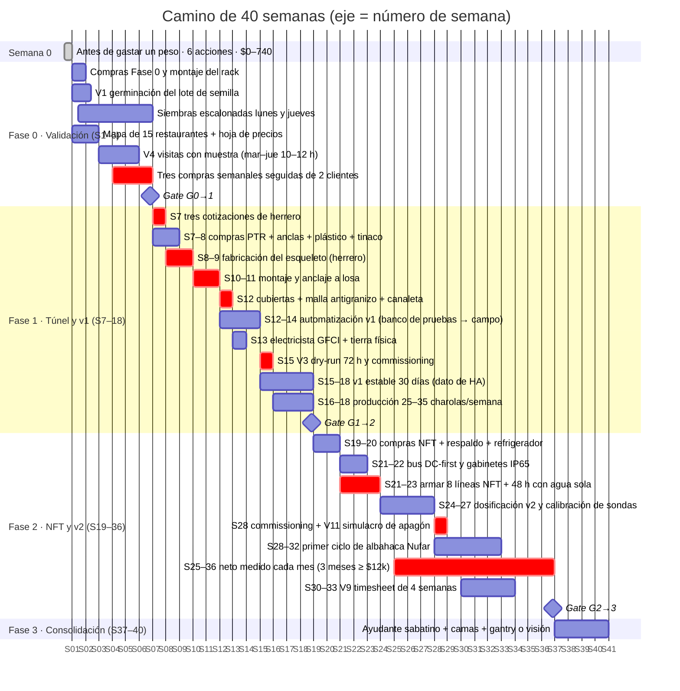

# Línea de tiempo: 40 semanas

**En una línea:** el calendario completo del proyecto, de la semana 0 al gate G2→3, con los hitos que puedes auditar, el clima que te va a tocar según el mes en que arranques y qué hacer cuando el herrero (la ruta crítica de la Fase 1) se retrasa.

!!! info "Antes de empezar"
    - **Tiempo:** 20 min de lectura; 10 min para fijar tu semana 1 en el calendario · **Costo:** $0 · **Personas:** 1
    - **Necesitas:** las decisiones de [Antes de gastar un peso](antes-de-gastar-un-peso.md) (sobre todo ① anclaje y ④ tinaco)
    - **Prerequisitos:** [Cómo usar esta guía](como-usar-esta-guia.md) (qué es un gate)

La semana 1 es la semana en que compras el rack. Todo lo demás se cuenta desde ahí. Las duraciones salen del [plan maestro](../referencia/00-plan-maestro.md) (Fase 0: semanas 1–6; Fase 1: meses 2–4; Fase 2: meses 5–9) y de la ruta crítica de la Fase 1 en [research/instalacion-tunel-detalle.md](../research/instalacion-tunel-detalle.md) (objetivo 4 semanas de túnel, colchón 6).

## El Gantt

El eje muestra el número de semana (S01…S40); las fechas internas del diagrama son solo para dibujarlo. Las barras rojas son la ruta crítica; los rombos son los gates.

Lectura rápida por fase:

- **Fase 0 (S1–6)** corre en paralelo: mientras las primeras charolas germinan, mapeas restaurantes; las visitas empiezan en S3 con muestra física; el gate exige que dos clientes hayan comprado tres semanas seguidas, así que la primera venta debe caer en S4 a más tardar.
- **Fase 1 (S7–18)** tiene una sola ruta crítica: el herrero. Cotizas el día 1 de S7, compras el mismo día (PTR en Sodimac con stock en tienda; anclas, canalón y tinaco en Home Depot con recogida en 24 h; plástico, perfil y zigzag en Hydro Environment, Tlalnepantla), el herrero fabrica en S8–9 y monta en S10–11, y tú cierras cubiertas en S12. El túnel toma 6 semanas con colchón; la automatización v1 se arma en la mesa desde S12 y entra al campo cuando el túnel está cerrado. El reloj de "v1 estable 30 días" arranca en el commissioning (S15).
- **Fase 2 (S19–36)** compra primero PVC, bomba y depósito; las sondas y peristálticas al final (el NFT funciona días en manual mientras la dosificación se afina). El respaldo DC-first se arma antes de la primera línea con plantas. El gate se mide durante 3 meses con contabilidad y timesheet: si las hierbas empiezan a facturar en S32, la ventana de 3 meses termina después de S36. **El gate se mide, no se apura.**

## Hitos con criterio de listo

| Hito | Semana | Criterio de listo (auditable por un tercero) | Validación |
|---|---|---|---|
| Semana 0 cerrada | S0 | Seis acciones con su criterio cumplido: régimen fiscal decidido, promedio CFE anotado, tandeo consultado, acuse del aviso guardado | [Antes de gastar un peso](antes-de-gastar-un-peso.md) |
| Rack en producción | S1 | Rack nivelado, 6 charolas de prueba de 2 variedades sembradas, `bitacora/produccion.csv` con las primeras filas | Commissioning Fase 0, [03](../referencia/03-instalacion.md) |
| Lote de semilla aceptado | S2 | V1: ≥85 % de germinación (girasol y chícharo ≥80 %) en 50 semillas | [V1](../validacion/v01-germinacion.md) |
| Rendimiento conocido | S3 | V2: 3 charolas por variedad pesadas, coeficiente de variación <15 % | [V2](../validacion/v02-rendimiento.md) |
| Primera ronda de visitas | S3–5 | Embudo registrado cada semana: visitados → probaron → pidieron → recurrentes (15 visitas) | [V4](../validacion/v04-smoke-test.md) |
| **Gate G0→1** | S6 | ≥2 clientes con 3 compras semanales seguidas **y** margen variable ≥55 % en ventas reales | [Gate G0→1](../fases/fase-0/gate.md) |
| Herrero contratado | S7 | 3 cotizaciones recibidas, una aceptada con fecha de entrega escrita; PTR comprado | [research/instalacion-tunel-detalle.md](../research/instalacion-tunel-detalle.md) |
| Esqueleto anclado | S11 | 6 columnas con placa base y 4 anclas de cuña 3/8"×5" cada una, plomo y nivel verificados, placas selladas con PU | [Anclar el túnel](../guias/anclar-el-tunel.md) |
| Túnel cerrado | S12 | Plástico tensado al mediodía sin viento, malla antigranizo 10–20 cm sobre el plástico, canaleta con pendiente 0.5–1 % y purga de primeras lluvias al tinaco | [Tensar plástico y mallas](../guias/tensar-plastico-y-mallas.md) |
| Patio eléctricamente seguro | S13 | GFCI en todo el circuito exterior, tapa intemperie "in-use", tierra física ≤25 Ω medidos, electrónica en gabinete IP65 | [Instalar GFCI y tierra](../guias/instalar-gfci-y-tierra.md) |
| v1 comisionada | S15 | V3: 72 h con agua sola y 100 % de las fallas inyectadas con alarma correcta; 4 charolas testigo 7 días sin intervención; captación llenando tinaco | [V3](../validacion/v03-dry-run.md) |
| **Gate G1→2** | S18 | 4–5 clientes fijos; pedidos rechazados 2 semanas seguidas; 30 días con <2 alarmas críticas/semana y cero pérdidas por riego | [Gate G1→2](../fases/fase-1/gate.md) |
| Líneas NFT probadas | S23 | 8 líneas con pendiente 2–3 % sin panza; 48 h recirculando agua sola sin fugas; 1–2 L/min por línea (botella de 1 L y cronómetro) | Commissioning Fase 2, [03](../referencia/03-instalacion.md) |
| Dosificación v2 | S27 | Dry-run en depósito con agua: pH baja y EC sube como se espera, los interlocks disparan; sondas calibradas con buffers 4.0/6.86 y EC 1.413 mS/cm | [Calibrar sondas](../guias/calibrar-sondas-ph-ec.md) |
| Respaldo probado | S28 | V11: breaker del patio abajo 10 min → la bomba sigue desde batería, llegan las 2 alertas, sin falso "sin flujo" al restaurar | [V11](../validacion/v11-apagon.md) |
| Primer ciclo de albahaca | S32 | pH/EC dentro de banda ≥90 % del tiempo según Home Assistant, no según memoria | [Fase 2 → NFT](../fases/fase-2/nft.md) |
| Timesheet honesto | S33 | V9: 4 semanas cronometradas; si da >12 h/semana se ataca el desperdicio antes de escalar | [V9](../validacion/v09-timesheet.md) |
| **Gate G2→3** | S36 o cuando se cumplan 3 meses seguidos | Neto ≥$12k/mes × 3 meses **y** ≤9 h/semana medidas | [Gate G2→3](../fases/fase-2/gate.md) |

## Calendario de riesgos climáticos y comerciales

El proyecto dura 40 semanas: te van a tocar las cuatro estaciones de CDMX. Escala: ■ riesgo presente, ■■ alto, ■■■ pico. Fuente: [02 §1](../referencia/02-restricciones-y-requisitos.md) y [research/clima-agronomia.md](../research/clima-agronomia.md).

| Riesgo | E | F | M | A | M | J | J | A | S | O | N | D | Qué haces |
|---|---|---|---|---|---|---|---|---|---|---|---|---|---|
| Helada (sur de CDMX: −1 a −4 °C) | ■■ | ■■ | · | | | | | | | | ■ | ■■ | Cerrar túnel de noche, alarma <6 °C, masa térmica o calefactor 500 W en relé; una helada mata el NFT de albahaca |
| Germinación lenta (<18 °C) | ■■ | ■■ | ■ | | | | | | | | ■ | ■■ | Tapete térmico (~$380) o cuarto a 22 °C; ciclos 30–50 % más largos |
| UV extremo (índice 11+) | | | ■■ | ■■ | ■■ | ■ | ■ | ■ | ■ | | | | Malla sombra 35 % sobre hierbas solo marzo–mayo; microgreens nunca al sol de mediodía |
| Granizo | | | | ■ | ■■ | ■■ | ■■ | ■■■ | ■■ | ■ | | | Malla antigranizo montada antes de mayo y no desmontarla temprano: el pico es agosto |
| Hongos / HR 70–89 % | | | | | ■ | ■■ | ■■■ | ■■■ | ■■■ | ■■ | | | Ventilación forzada por histéresis de HR >70 % (la automatización más importante); sembrar 10 % menos denso; riego solo por abajo; Gnatrol comprado antes de junio |
| Araña roja / secado (HR baja) | ■ | ■ | ■■ | ■■ | ■ | | | | | | ■ | ■ | Riego por abajo más frecuente; jabón potásico al envés |

Riesgos comerciales y de calendario ([07 §5](../referencia/07-puntos-ciegos-y-riesgos.md), [02 §2](../referencia/02-restricciones-y-requisitos.md)):

| Cuándo | Qué pasa | Qué haces |
|---|---|---|
| 24-dic a 6-ene | Muchos restaurantes de autor cierran; chefs de vacaciones | No programar gates comerciales en esas dos semanas; sembrar para hogares y cafés |
| Enero–febrero | Cráter estructural del sector: −30–50 % de ventas | Modelar enero con −35 % de ingreso; el colchón sale de noviembre–diciembre |
| Enero–febrero | Convocatoria Cosecha de Lluvia (SEDEMA) | Documentos listos desde diciembre: INE, CURP, comprobante ≤3 meses, predial |
| ~Febrero | Convocatoria Escuela de Huertos Urbanos (SEDEMA) | Registrarse: 48 h gratuitas y red de contactos |
| Semana Santa | −20 % de ventas | No lanzar variedad nueva esa semana |
| 28-may a 10-oct | Temporada de lluvia: tormenta vespertina intensa y corta | Instalar cubiertas y trabajar en altura por la mañana; captación pluvial llenando el tinaco; separador de primeras lluvias activo |

### Ejemplo: si tu semana 1 es el lunes 21 de septiembre de 2026

Corre la tabla con tu fecha real; este ejemplo muestra cómo se cruzan fases y clima.

| Bloque | Semanas | Fechas | Lo que implica |
|---|---|---|---|
| Semana 0 | S0 | 14–20 sep 2026 | Fin de lluvias: mide la EC de la llave con la red en régimen normal |
| Fase 0 | S1–6 | 21 sep – 1 nov 2026 | Rack bajo techo, sin riesgo climático. Octubre es buen mes para cerrar clientes: los restaurantes llegan con dinero a noviembre–diciembre |
| Fase 1 | S7–18 | 2 nov 2026 – 24 ene 2027 | Secas: ideal para construir y tensar plástico al mediodía. Noches de 5–9 °C: tapete térmico para germinar. **El gate G1→2 cae en enero, el cráter del sector:** mide "demanda insatisfecha" con los datos de noviembre–diciembre o extiende el gate a febrero. Cosecha de Lluvia se solicita en estas semanas |
| Fase 2 | S19–36 | 25 ene – 30 may 2027 | UV extremo marzo–mayo: malla sombra 35 % sobre las hierbas. La malla antigranizo ya quedó desde S12; verifica tensión antes de mayo. Compra Gnatrol antes de junio. Semana Santa −20 % |
| Fase 3 | S37–40 | 31 may – 27 jun 2027 | Arranca la lluvia: la ventilación por HR >70 % debe estar afinada y la captación llenando el tinaco |

!!! tip "Si puedes elegir cuándo arrancar"
    Arrancar la Fase 0 en septiembre–octubre pone la construcción del túnel en la temporada seca y la primera temporada de lluvias con el sistema ya comisionado. Arrancar en marzo pone la construcción en plena temporada de granizo y lluvia vespertina: sigue siendo posible, pero instala cubiertas solo por la mañana y compra la malla antigranizo con el PTR, no después.

## Qué hacer si se retrasa el herrero

El herrero es la ruta crítica de la Fase 1: todo lo demás llega antes si se pide el día 1. Reglas de decisión escritas de antemano:

1. **Día 1 de S7: tres cotizaciones con foto del croquis.** Herrero del barrio, [Habitissimo](https://www.habitissimo.com.mx/presupuesto/albaniles) y grupos de la alcaldía en Facebook Marketplace. Presupuesto razonable: 2–4 días de herrero ($2,500–4,000 aprox.) + 1 día de ayudante ($300–400). *Criterio de listo:* 3 números con fecha de entrega.
2. **Si en 5 días no tienes 2 cotizaciones:** amplía a "se hacen protecciones" de colonias vecinas y a soldadores por jornada ($600–1,000/día aprox. con herramienta). Tú compras el PTR: el herrero solo pone mano de obra y equipo.
3. **Si la fabricación pasa más de 6 días de lo pactado:** activa la cotización 2. El PTR ya es tuyo y está en tu patio; cambiar de herrero no pierde material.
4. **Si llegas a S13 sin esqueleto (2 semanas de retraso):** plan B sin herrero, el [kit micro túnel 2 × 3.5 m de Hydro Environment](https://hydroenv.com.mx/categoria-de-productos/Invernaderos/invernaderos-caseros/) ($5,699.90, piezas numeradas, armado en un día entre 2 personas) como puente. El túnel de PTR se construye en la Fase 2 junto con la ampliación a 5×6 m. Ojo con los tiempos de entrega del proveedor ([tabla oficial](https://hydroenv.com.mx/tiempos-de-entrega/)): kits sobre pedido 8–15 días hábiles; el rollo de malla antigranizo 8–10 días hábiles, por metro hay existencia.
5. **Mientras esperas, no te detengas:** arma la automatización v1 en la mesa (ESP32, relés, bomba en cubeta; flasheo por USB, después OTA), contrata al electricista para GFCI y tierra (no depende del túnel), prepara la base del tinaco (cada 100 L pesan 100 kg) y deja lista la canaleta. La producción de la Fase 0 sigue en el rack bajo techo: los clientes no esperan al túnel.
6. **Lo que no se recorta:** el reloj de "v1 estable 30 días" del gate G1→2 arranca cuando el nodo esté en campo con el túnel cerrado. Un retraso del herrero mueve el gate; no lo suaviza.

!!! warning "Error típico"
    Recibir el plástico y tensarlo con viento o en la tarde para "ganar tiempo". Se tensa al mediodía, con sol y sin viento, entre 3 personas: el calor lo estira y al enfriar queda tenso. Un lienzo mal tensado se rompe en la primera racha de 50–80 km/h.

## Al terminar

- [ ] Tu semana 1 está fijada en el calendario (el lunes que compras el rack) y las 40 semanas trasladadas a fechas
- [ ] Sabes en qué mes cae cada fase y qué riesgo climático la acompaña
- [ ] Las tres fechas de gate están en el calendario con su criterio pegado
- [ ] Tienes anotado el día 1 de S7 para pedir las 3 cotizaciones del herrero
- Registrar: crea un issue "Línea de tiempo" con la tabla de hitos y ve marcando cada uno con su fecha real ([cómo marcar avance](como-usar-esta-guia.md#como-marcar-tu-avance))
- Siguiente paso: [Fase 0 → Índice](../fases/fase-0/index.md)

## Fuentes

- [00 · Plan maestro](../referencia/00-plan-maestro.md): duración de fases, metas y checklist de 14 días.
- [03 · Instalación](../referencia/03-instalacion.md): commissioning de cada fase y orden de compra.
- [research/instalacion-tunel-detalle.md](../research/instalacion-tunel-detalle.md): ruta crítica de 4–6 semanas, lead times por proveedor, mano de obra, plan B sin herrero.
- [02 · Restricciones y requisitos](../referencia/02-restricciones-y-requisitos.md) y [research/clima-agronomia.md](../research/clima-agronomia.md): calendario de riesgo anual.
- [07 · Puntos ciegos y riesgos](../referencia/07-puntos-ciegos-y-riesgos.md): calendario comercial (enero, Semana Santa, cierres de diciembre).
- [06 · Validación y lazos agénticos](../referencia/06-validacion-y-lazos-agenticos.md): criterios de V1–V11 y gates.
