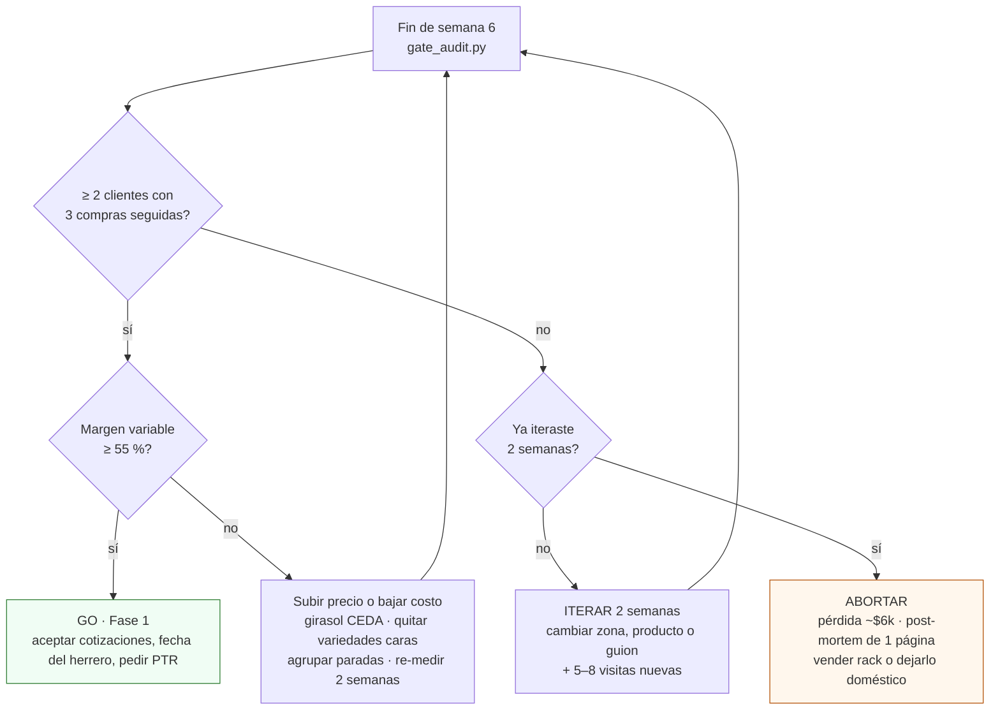

# Pasar el gate G0→1

**En una línea:** al cerrar la semana 6 corres `tools/gate_audit.py` sobre la bitácora,
comparas contra los dos umbrales escritos aquí antes de empezar y decides Go / iterar 2 semanas /
abortar — con las cotizaciones del túnel ya en la mano para no perder días si es Go.

!!! info "Antes de empezar"
    - **Tiempo:** 1 h de auditoría + 1 h de decisión · **Costo:** $0 (cotizar es gratis) · **Personas:** 1 + un tercero que pueda auditar los números (pareja, socio, contador)
    - **Necesitas:** `bitacora/produccion.csv`, `bitacora/ventas.csv` y `bitacora/embudo.csv` completos; Python 3.11 (`tools/` no usa dependencias); estado de cuenta del mes para conciliar los SPEI; cotizaciones de la §4.
    - **Prerequisitos:** [Sembrar](siembra.md) y [Vender](ventas.md) terminadas; commissioning de Fase 0 ([03](../../referencia/03-instalacion.md)); las reglas de gates en [validación/gates](../../validacion/gates.md).

## 1. Las métricas (tal cual están en 06 §L4)

| Gate | Métrica | Umbral | Fuente de dato | Decisión |
|---|---|---|---|---|
| **G0→1** | Clientes con ≥ 3 compras semanales consecutivas | **≥ 2** | `bitacora/ventas.csv` | Go / iterar 2 semanas más / abortar (pérdida acotada ~$6k) |
| **G0→1 (b)** | Margen variable en ventas reales | **≥ 55 %** | `bitacora/produccion.csv` + precios cobrados | Si falla: subir precio o bajar costo **antes** de invertir |

**Regla dura:** un gate no alcanzado no se renegocia a la baja; se itera o se detiene. Las
condiciones están en Git desde antes de la fase — los commits son el registro de que no se
movieron los postes ([06 §L4](../../referencia/06-validacion-y-lazos-agenticos.md)).

Definiciones para que un tercero pueda auditarlas:

- **Cliente** = el restaurante (razón social o nombre comercial), no el chef.
- **Compra semanal** = al menos una entrega en la semana ISO con `precio_unit_mxn × cantidad > 0`
  **y SPEI recibido**. Muestras gratis, pedidos no cobrados y hogares de prueba no cuentan.
- **Consecutivas** = 3 semanas ISO seguidas sin hueco. Una semana sin pedido reinicia la racha.
- **Margen variable** = (ingreso cobrado − insumos − reparto) ÷ ingreso cobrado, sobre lo que
  realmente se cobró (no la lista). **Insumos por charola** del
  [08](../../referencia/08-recetas-y-economia-unitaria.md): girasol CEDA $9.10 / Al Natural
  $29.50, rábano $49.30, arúgula $35.30, amaranto $7.50, brócoli $57.00, betabel $52.50
  (+ $3.50 por clamshell si va cortado). **Reparto**: $15–25 por parada de ruta propia,
  prorrateado entre las charolas de esa parada.

Ejemplo con dos clientes que piden cada semana 3 charolas de girasol a $105 y 2 de rábano a $155:

| Escenario | Ingreso / cliente-semana | Insumos + reparto | Margen variable |
|---|---|---|---|
| Girasol CEDA, precios de lista | $625 | 3 × 9.10 + 2 × 49.30 + 20 = $145.90 | **77 %** ✓ |
| Girasol Al Natural, precios de lista | $625 | 3 × 29.50 + 2 × 49.30 + 20 = $207.10 | **67 %** ✓ |
| Girasol Al Natural, precios promo ($75 / $130) | $485 | $207.10 | **57 %** al límite |

El precio decide el gate (b) más que el costo: por eso la promo de $60–90 es de un mes y solo en
girasol.

## 2. Cómo medirlas

### Con `tools/gate_audit.py`

```bash
python3 tools/gate_audit.py --gate G0-1 \
  --ventas bitacora/ventas.csv \
  --produccion bitacora/produccion.csv \
  --desde 2026-09-21 --hasta 2026-10-30
```

[POR VERIFICAR: la interfaz exacta se documenta en
[software/herramientas-cli](../../software/herramientas-cli.md) cuando el script esté en el
repositorio; la lógica que debe implementar es la de esta tabla.]

| Paso del script | Qué hace | Salida |
|---|---|---|
| 1. Leer `ventas.csv` | Filtra filas con `cantidad > 0` y `precio_unit_mxn > 0`; agrupa por `cliente` y semana ISO de `fecha` | Tabla cliente × semana |
| 2. Rachas | Para cada cliente, longitud máxima de semanas consecutivas con compra | `racha_max` por cliente |
| 3. Métrica (a) | Cuenta clientes con `racha_max ≥ 3` | `recurrentes = N` → **PASS** si ≥ 2 |
| 4. Leer `produccion.csv` | Cruza `destino` y `precio_mxn` de cada charola cosechada con el costo variable por `variedad` (tabla del 08) | Ingreso e insumos por charola vendida |
| 5. Métrica (b) | (Σ ingreso − Σ insumos − Σ reparto) ÷ Σ ingreso | `margen_variable = X %` → **PASS** si ≥ 55 % |
| 6. Apoyo (L2) | Sell-through, merma, entregas a tiempo, recompra | Contexto, no gate |
| 7. Informe | Markdown con las dos métricas, PASS/FAIL y la tabla cliente × semana | `bitacora/gates/G0-1-AAAA-MM-DD.md` |

### A mano (hoja de cálculo, 20 min)

1. Tabla dinámica de `ventas.csv`: filas = cliente, columnas = semana ISO, valor = Σ importe.
   Cuenta a mano las rachas de 3 celdas seguidas > 0 → métrica (a).
2. En `produccion.csv`, filtra `destino ≠ muestras` y `precio_mxn > 0`; suma `precio_mxn` (ingreso)
   y una columna nueva `costo_var` con el valor del 08 según `variedad`; resta el reparto (paradas
   × $20). Divide → métrica (b).
3. Concilia el ingreso contra los SPEI del estado de cuenta: lo no cobrado se quita del ingreso.

### KPIs de apoyo (no son gate, explican el resultado)

| KPI | Meta | Umbral rojo | Qué te dice si falla |
|---|---|---|---|
| Sell-through (vendidas ÷ cosechadas) | ≥ 90 % | < 75 % dos semanas | Sobreproduces o no vendes: no sembrar más volumen |
| Merma de producción (tiradas ÷ sembradas) | ≤ 10 % | > 20 % | Proceso fuera de control: V8, densidad, riego |
| Entregas a tiempo | 100 % | < 90 % | La ruta o la cosecha de la mañana no aguantan |
| Recompra semana a semana | ≥ 80 % | ancla sin pedir 2 semanas | Producto o relación, no precio |
| CAC | a la baja | > 3 visitas y 3 muestras por cliente | Zona o guion equivocados |
| Feedback (respuesta a la pregunta post-entrega) | ≥ 50 % | 2 quejas iguales | Cambiar producto esa semana |

([06 §L2](../../referencia/06-validacion-y-lazos-agenticos.md); `tools/kpis.py` los calcula desde la bitácora.)

## 3. Lo que debe estar cerrado además de los números

- [ ] 6 charolas de prueba (2 variedades) completaron ciclo con rendimiento pesado
- [ ] V1 hecha por lote de semilla; V2 de girasol y rábano con CV < 15 %
- [ ] Bitácora con filas reales desde la charola #1 (no reconstruida de memoria)
- [ ] Embudo con las 4 cifras de cada semana (S3–S6) y ≥ 15 visitas reales
- [ ] Todos los cobros por SPEI conciliados; remisiones firmadas archivadas
- [ ] Decisión fiscal tomada (RESICO-AGAPES vs persona moral): la Fase 1 factura semanalmente
- [ ] Permiso de perforar / situación de condominio resuelta: la Fase 1 ancla el túnel a la losa
- [ ] Merma real por especie y multiplicador real de girasol anotados (sustituyen los supuestos del 08)

## 4. Qué cotizar antes del gate (semanas 4–5) para no perder tiempo

Cotizar no compromete nada y el camino crítico de la Fase 1 es el **herrero** (2–4 días de
taller + montaje; 4 semanas de ruta con colchón de 6). Si el gate pasa un viernes, el lunes ya
hay número y fecha ([03 §1.1](../../referencia/03-instalacion.md),
[Fase 1 · Compras](../fase-1/compras.md), [Estructura del túnel](../../diseno/estructura-tunel.md)).

| Partida | A quién | Precio de referencia | Qué pedir exactamente |
|---|---|---|---|
| **Herrero** (3 cotizaciones) | Talleres de la colonia; preguntar en tlapalería | $2,500–4,000 por fabricar y montar el esqueleto; $200–400/día si trae su equipo | Túnel 3 × 6 m a dos aguas, PTR 1½" cal. 14, 6 columnas con placa base 10–15 cm (solera 3/16"), pendiente 30 %, uniones atornillables; con y sin material; fecha. Entrega la lista de cortes que imprime [`hardware/cad/tunel_3x6.scad`](https://github.com/AndresIslas99/HomeGreen/blob/main/hardware/cad/tunel_3x6.scad) |
| **PTR 1½" × 1½" cal. 14 × 6 m** | [Sodimac](https://www.sodimac.com.mx/sodimac-mx/product/433713/ptr-1-1-2x1-1-2-calibre-14/433713) (stock en tienda); volumen: Aceros Crea | $403 ($382.85 en 5+) | Número de tramos según la lista de cortes; si entregan 6.10 m caben tres columnas de 2.00 m por tramo |
| **Malla antigranizo** | [Capi Agrícola](https://www.capiagricola.com.mx/product/malla-antigranizo-negra-3-70-m-x-metro/) (por metro, 3.7 m de ancho); a medida: ICAPSA / HTA | $40/m → ~40 m lineales = $1,400–1,600 (el rollo de 200 m de Hydroenv, $4,799, sobra) | Metros lineales para 3 × 6 m con faldones; plazo de entrega. Obligatoria mayo–septiembre, pico en agosto |
| **Plástico UV cal. 720** | [Hydro Environment](https://hydroenv.com.mx/producto/metro-de-plastico-para-invernadero-25-sombra-6-2-m-de-ancho-cal-720/) (recoger en Tlalnepantla) | $193.50–215/m (6.2 m de ancho); perfil Polygrap $95/2 m + zigzag $103/kg; barato: corte 7.2 × 10 m invernaderosMX $1,100 | Metros para techo + cortinas; perfil y zigzag para tensar; guía de armado del proveedor |
| **Tinaco** | [Rotoplas](https://rotoplas.com.mx/products/almacenamiento/tinacos/) / Home Depot | Resistec 750 L $2,051 (Plus+ 1,100 L $3,774 si tu colonia tiene tandeo duro) | Disponibilidad en sucursal; base firme (lleno pesa 750 kg) |
| **Anclas de cuña 3/8" × 5"** | Home Depot | $36 c/u × 24 = ~$864 | 4 por placa, 6 placas |
| **Electricista certificado** | Recomendación local | $1,500–3,500 llave en mano: breaker Square D QO120GFI $1,159 o contacto GFCI $389 + tapa intemperie ~$249 + varilla copperweld + conector ~$400–800 | GFCI en todo el circuito del patio, tierra física ≤ 25 Ω medidos. Obligatorio antes del primer relé (NOM-001-SEDE, lugar mojado) |
| **Canalón PVC** | Home Depot | $269 / 3.07 m | Tramos para los dos aleros + bajante |

Total de referencia: túnel 3 × 6 m **≈ $10,700–15,300** todo incluido; Fase 1 completa con racks,
T8 y UPS **$31–42k** ([`bom/fase1.csv`](https://github.com/AndresIslas99/HomeGreen/blob/main/bom/fase1.csv)).
Mientras esperas el gate: apunta en el calendario la convocatoria **Cosecha de Lluvia** de SEDEMA
(enero–febrero; sistema de ~$20k sin costo si la alcaldía califica) y el Aviso de Funcionamiento
COFEPRIS gratuito al iniciar Fase 1 ([02 §2 y §4](../../referencia/02-restricciones-y-requisitos.md)).

## 5. La decisión



- **Go:** ambas métricas pasan. Mismo día: aceptar la cotización del herrero, fijar fecha, pedir
  PTR y malla; recomprar girasol de CEDA en costal; comprar 10 + 10 charolas más; arrancar
  [Fase 1](../fase-1/index.md).
- **Iterar (una sola vez, 2 semanas):** (a) falla. Lo que cambia se escribe antes de arrancar:
  zona (Roma–Condesa si empezaste al sur, o al revés), producto (charola viva en vez de cortado;
  rábano/arúgula en vez de solo girasol) o guion (administrador presente, referidos). Si tras
  15 visitas reales sigue habiendo 0 recurrentes, el problema es producto/precio/zona y se
  pivota antes de gastar en Fase 1 ([06 §V4](../../referencia/06-validacion-y-lazos-agenticos.md)).
- **Subir precio o bajar costo:** (b) falla con (a) aprobada. Primero precio (quitar promos,
  cobrar lista); luego costo (girasol CEDA validado, fuera betabel/brócoli caros hasta que
  Hydrocultura cotice, agrupar paradas de reparto). Re-medir 2 semanas con los clientes actuales.
- **Abortar:** (a) falla después de iterar, o las dos fallan y no hay hipótesis clara. Pérdida
  acotada ~$6k; el rack, las básculas y los libros se quedan. Post-mortem de una página
  (embudo, feedback textual de los chefs, precios ofrecidos vs aceptados) commiteado al repo:
  es lo único que vale de un experimento fallido.

!!! warning "Errores típicos"
    - **Contar como recurrente al que "seguro pide la próxima semana".** Solo cuentan semanas
      cobradas.
    - **Calcular el margen con precios de lista** cuando vendiste con promo, o sin el reparto.
    - **Renegociar el umbral** ("con 1 cliente y medio ya está"). Se itera o se detiene; no se
      mueven los postes.
    - **Pasar el gate sin la decisión fiscal ni el permiso de perforar:** la Fase 1 se atora en
      la semana 1 por eso, no por el herrero.

## Al terminar

- [ ] Informe de `gate_audit.py` (o la hoja manual) guardado en `bitacora/gates/G0-1-AAAA-MM-DD.md` y commiteado
- [ ] Decisión escrita con fecha: Go / iterar (qué cambia y fecha del re-gate) / abortar (post-mortem)
- [ ] Si Go: cotizaciones aceptadas, fecha del herrero, pedido de PTR y malla, recompra de girasol CEDA
- [ ] Si iterar: 5–8 restaurantes nuevos en el mapa y el cambio de producto/precio/zona aplicado el lunes
- **Registrar:** `git commit -m "G0→1: <Go|iterar|abortar> — <N> recurrentes, margen <X> %"`.
- **Siguiente paso:** [Fase 1 · Túnel y automatización v1](../fase-1/index.md) o, si iteras, de
  vuelta a [Vender a chefs](ventas.md).

## Fuentes

- [06-validación §L2, §L4, V4](../../referencia/06-validacion-y-lazos-agenticos.md) (métricas, umbrales, regla dura)
- [00-plan maestro](../../referencia/00-plan-maestro.md) (pérdida acotada, checklist de 14 días: "pedir cotización de malla y PTR")
- [08-recetas y economía unitaria](../../referencia/08-recetas-y-economia-unitaria.md) (costo variable por charola)
- [03-instalación §1.1](../../referencia/03-instalacion.md) y [01-proveedores §2, §5, §6c](../../referencia/01-proveedores-cdmx.md) (herrero, PTR, malla, plástico, tinaco, GFCI)
- [research/estructura-invernadero](../../research/estructura-invernadero.md) · [research/instalacion-tunel-detalle](../../research/instalacion-tunel-detalle.md) (anclaje, ruta crítica)
- [07-puntos ciegos](../../referencia/07-puntos-ciegos-y-riesgos.md) (CAC, cobranza, condominio, el número corregido)
