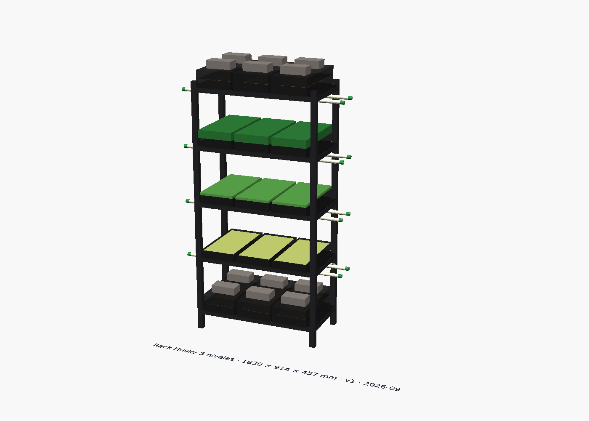
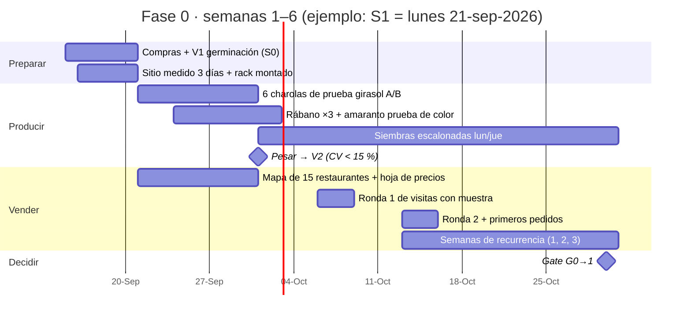

# Fase 0: validar que los chefs pagan

**En una línea:** en 6 semanas, con un rack bajo techo y ~$6,700–9,500 de equipo, produces
microgreens reales, se los llevas a 15 restaurantes y mides si al menos 2 te compran 3 semanas
seguidas pagando por SPEI — antes de gastar un peso en túnel, agua o electrónica.

!!! info "La fase en números"
    | | |
    |---|---|
    | **Objetivo** | Probar con dinero real que hay demanda: ≥ 2 clientes recurrentes **y** margen variable ≥ 55 % |
    | **Inversión** | $4,000–6,000 según el [plan maestro](../../referencia/00-plan-maestro.md); BOM real ~$9,500 con sanitización y libros, ~$6,700 versión austera ([compras](compras.md)) |
    | **Meta** | 2 clientes con ≥ 3 compras semanales consecutivas, cobradas |
    | **Duración** | Semanas 1–6: semanas 1–2 producir y pesar, semanas 3–6 vender y medir el embudo |
    | **Pérdida si falla** | ~$6k acotados; el rack, las básculas y los libros se quedan contigo |
    | **Gate de salida** | [G0→1](gate.md): 2 métricas, escritas antes de empezar |

La filosofía es la del plan: **vender antes de construir**. El riesgo #1 del proyecto es no
vender, y esta fase existe para acotarlo a ~$6k ([07 §riesgos](../../referencia/07-puntos-ciegos-y-riesgos.md)).
Todo lo demás (túnel, tinaco, ESP32, NFT) se compra solo si el gate pasa.

## Cómo se verá

??? note "Leyenda y notas clave del plano"

    --8<-- "assets/diagramas/layout/patio-fase-0.notas.md"

Un solo rack Husky de 5 niveles bajo techo, pegado a la pared sur (luz indirecta, sin sol de
mediodía ni goteo), una mesa de siembra de 1.2 × 0.6 m junto a la toma de agua (a < 10 m) y un
contacto existente cerca. Nada más. El patio del dibujo es un **supuesto de 10 × 8 m con casa
al sur y acceso al norte**; si el tuyo difiere, las reglas que se conservan son: rack bajo
techo con agua a < 10 m, pasillo ≥ 0.9 m frente al rack, nada tapa la coladera
([montaje](montaje.md)).

El rack con sus 5 niveles: oscuridad apilada con peso arriba, destape y desarrollo en medio,
cosecha abajo. Los tubos T8 del render son de Fase 1; en Fase 0 se produce con luz natural
indirecta ([02 §clima](../../referencia/02-restricciones-y-requisitos.md): nov–feb es la
época más soleada de CDMX). Modelo paramétrico en
[`hardware/cad/rack_charolas.scad`](https://github.com/AndresIslas99/HomeGreen/blob/main/hardware/cad/rack_charolas.scad).

## Las 6 semanas de un vistazo

Detalle semana por semana en [Línea de tiempo](../../empieza-aqui/linea-de-tiempo.md).

## Páginas de la fase (en orden)

| # | Página | Qué logras | Cuándo |
|---|---|---|---|
| 1 | [Comprar el equipo](compras.md) | Lista exacta de `bom/fase0.csv` agrupada en hoy / esta semana / cuando pase G0; un pedido por proveedor; A/B de girasol; sin chícharo de Hydroenv | Día 1–7 |
| 2 | [Montar el rack y elegir el sitio](montaje.md) | Sitio con luz indirecta y 16–24 °C medidos 3 días; rack nivelado; zonas por nivel | Día 2–5 |
| 3 | [Sembrar las primeras 6 semanas](siembra.md) | Siembras lunes/jueves, 6 charolas de prueba, V1 y V2, bitácora desde la charola #1 | Semana 1–6 |
| 4 | [Vender a chefs (smoke test V4)](ventas.md) | 15 restaurantes mapeados, muestra física, hoja de precios corregida, embudo semanal, SPEI contra entrega | Semana 3–6 |
| 5 | [Pasar el gate G0→1](gate.md) | Medir las 2 métricas con `tools/gate_audit.py`; Go / iterar / abortar; cotizaciones listas para Fase 1 | Fin de semana 6 |

!!! warning "Antes de la página 1"
    Resuelve lo de [Antes de gastar un peso](../../empieza-aqui/antes-de-gastar-un-peso.md):
    si eres socio o accionista de alguna persona moral **no puedes tributar en RESICO**
    (art. 113-E LISR) y cambia desde qué RFC facturas; si el patio es de condominio, el túnel
    de Fase 1 necesita asamblea. Ninguna de las dos bloquea la Fase 0, pero las dos se deciden
    ahora ([02 §3](../../referencia/02-restricciones-y-requisitos.md),
    [07 §9](../../referencia/07-puntos-ciegos-y-riesgos.md)).

## Qué NO es la Fase 0

- **No hay túnel, tinaco, ESP32, NFT ni lámparas.** Los T8 del rack son de Fase 1; si ya tienes
  un timer y tubos, úsalos, pero no están en el BOM.
- **No hay crédito.** SPEI contra entrega, cero excepciones: estás validando que *pagan*, no que
  *quieren* ([research/cobranza-b2b](../../research/cobranza-b2b.md)).
- **No hay chícharo** hasta conseguir arvejón grado alimento en la CEDA: con semilla a $340/kg
  pierde dinero a cualquier precio ≤ $98/charola ([08 §reglas](../../referencia/08-recetas-y-economia-unitaria.md)).
- **No se renegocia el gate a la baja.** Si no pasa, se itera 2 semanas o se detiene.

## Ritmo semanal

| Cuándo | Qué | Tiempo |
|---|---|---|
| Diario | Inspección visual (moho, color, estiramiento), muestreo de germinación, bitácora | 10 min |
| Lunes y jueves | Siembra escalonada + lavado de charolas | 45–60 min |
| Martes y viernes | Cosecha en la mañana, entrega, cobro SPEI, remisión firmada | 2–3 h |
| Martes–jueves 10–12 h | Visitas a restaurantes con muestra (semanas 3–6) | 2 mañanas |
| Domingo | KPIs L2 + las 4 cifras del embudo + plan de siembra de la semana | 30–60 min |

Es el lazo L1/L2 de [06-validación](../../referencia/06-validacion-y-lazos-agenticos.md):
la bitácora se llena el mismo día, nunca de memoria el domingo.

## El gate

| Métrica | Umbral | Fuente del dato | Si falla |
|---|---|---|---|
| Clientes con ≥ 3 compras semanales consecutivas | **≥ 2** | `bitacora/ventas.csv` | Iterar 2 semanas más (cambiar precio, zona o producto) o abortar con pérdida ~$6k |
| Margen variable en ventas reales | **≥ 55 %** | `bitacora/produccion.csv` + precios cobrados | Subir precio o bajar costo **antes** de invertir en Fase 1 |

Cómo medirlas, la matriz de decisión y qué cotizar mientras esperas: [gate.md](gate.md).

## Fuentes

- [00-plan-maestro](../../referencia/00-plan-maestro.md) · [03-instalación §Fase 0](../../referencia/03-instalacion.md)
- [06-validación (L4, V1, V2, V4)](../../referencia/06-validacion-y-lazos-agenticos.md)
- [08-recetas y economía unitaria](../../referencia/08-recetas-y-economia-unitaria.md)
- [research/mercado-precios](../../research/mercado-precios.md) · [research/cobranza-b2b](../../research/cobranza-b2b.md)
- [`bom/fase0.csv`](https://github.com/AndresIslas99/HomeGreen/blob/main/bom/fase0.csv)
