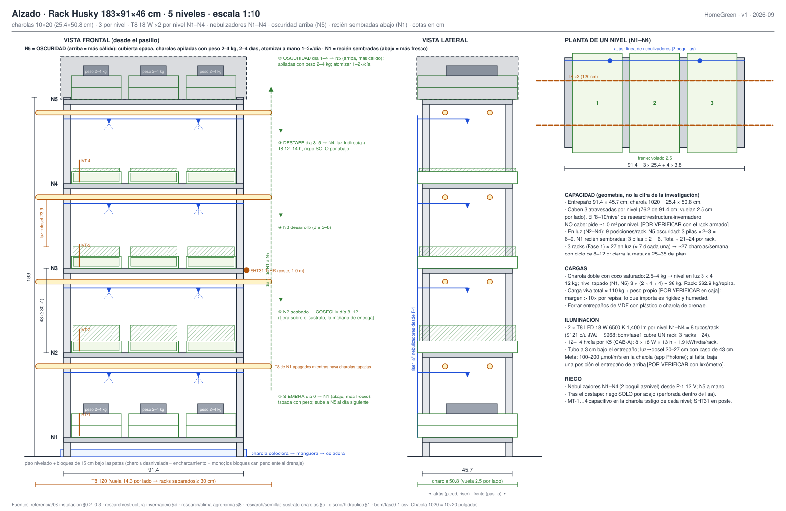

# Montar el rack y elegir el sitio

**En una línea:** eliges el punto del patio con luz indirecta (100–200 µmol/m²s), 16–24 °C
medidos durante 3 días y agua a menos de 10 m; armas, forras y nivelas el rack Husky y rotulas
qué nivel hace qué — un día de trabajo, y ninguna charola desnivelada (desnivel = agua en una
esquina = moho).

!!! info "Antes de empezar"
    - **Tiempo:** 10 min/día × 3 días de medición + 1 día de montaje (rack 1.5–2 h, estación de siembra 1 h, trazo de la reserva del túnel 30 min) · **Costo:** rack $2,019 Husky o ~$1,300 Adir ([compras](compras.md)) + plástico grueso para forrar entrepaños [POR VERIFICAR: no está en el BOM; sirve un rollo de plástico negro de tlapalería o charolas lisas extra] · **Personas:** 1 (2 para mover el rack armado)
    - **Necesitas:** rack, nivel de burbuja ([torpedo magnético ~$200, Home Depot](https://www.homedepot.com.mx/s/nivel+torpedo)), flexómetro 5 m, calzas (retazos de madera o plástico), plástico o charolas lisas para forrar, masking + marcador indeleble, teléfono con la app **Photone** (gratis, mide µmol/m²s) y una app de trayectoria solar (Sun Surveyor o similar), termómetro con mín/máx, hilo y estacas ([04-herramientas](../../referencia/04-herramientas.md)).
    - **Prerequisitos:** [Comprar el equipo](compras.md) · [Antes de gastar un peso](../../empieza-aqui/antes-de-gastar-un-peso.md) (¿patio propio o condominio?) · [Layout del patio](../../diseno/layout-patio.md) y [Rack y charolas](../../diseno/rack-y-charolas.md) para los porqués del diseño.

## Cómo queda

Lectura del plano (supuesto: patio de 10 × 8 m, casa al sur, acceso al norte, coladera en la
esquina noreste, piso de losa; si el tuyo difiere, cambia las constantes de `GEOMETRIA` en
`hardware/cad/layout.py` y regenera):

- **Rack bajo el cobertizo, pegado a la pared sur.** Ahí hay luz indirecta todo el día y el sol
  de mediodía —que a 19° N viene del sur y muy alto— no le pega; tampoco el goteo del alero.
- **Mesa de siembra junto a la toma de agua** (1.9 m en el dibujo; la regla es < 10 m) con la
  cubeta de remojo, la tina de lavado y la cubeta de sustrato usado.
- **Contacto existente cerca del rack.** En Fase 1 ese circuito se vuelve GFCI; en Fase 0 solo
  alimenta un timer si decides poner tubos.
- **Pasillo ≥ 0.9 m frente al rack y coladera libre.** Son las dos reglas que se conservan
  aunque cambie la forma del patio.
- **Reserva del túnel 3 × 6 m trazada desde ahora** (línea punteada): no se construye nada,
  pero no se estorba con nada pesado.

## Pasos

### 1. Elige el sitio (3 días antes de armar nada)

1. **Mide la luz con Photone.** Tres lecturas al día (9, 13 y 17 h) en el punto candidato, con
   el teléfono a la altura del nivel 3 del rack (~1 m). Meta: **100–200 µmol/m²s** de luz
   indirecta. *Criterio de listo:* las tres lecturas de los tres días caen en el rango; si la lectura
   de las 13 h se dispara muy por encima del rango, es sol directo y el punto no sirve.
2. **Descarta sol directo de mediodía y goteo.** Con la app de sol confirma que entre las 11 y
   las 16 h ninguna trayectoria (marzo–septiembre, índice UV 11+) cae sobre el rack; a
   2,240 msnm el UV quema microgreens tiernos. Bajo alero o cobertizo, y sin que la lluvia de
   junio–septiembre (132–176 mm/mes) escurra encima
   ([research/clima-agronomía §3–5](../../research/clima-agronomia.md)).
3. **Registra la temperatura mín/máx 3 días.** Ideal **16–24 °C**; por debajo de 14 °C la
   germinación se vuelve lenta, por encima de 27 °C desordenada. En septiembre–octubre las
   medias de Tacubaya son 17.6–18.4 °C: sin problema. Si tu Fase 0 cae en diciembre–febrero
   (noches de 5–9 °C en el centro, 5–6 °C en el sur), planea tapete térmico o el punto más
   cálido de la casa para la pila de oscuridad ([germinar en invierno](../../guias/germinar-en-invierno.md)).
4. **Confirma los servicios.** Toma de agua a < 10 m; contacto eléctrico a la mano; coladera
   funcionando (échale 10 L y mira que trague); piso plano (nivel de manguera entre las cuatro
   esquinas del rack: diferencia ≤ 1 cm o hay que calzar).
5. **Anota las mediciones** en `bitacora/produccion.csv` (campo `observaciones` de la primera
   fila, o una fila `SITIO-AAMMDD`): T mín/máx por día, µmol por hora. Es el primer dato del
   proyecto y lo vas a comparar contra el túnel en Fase 1.

### 2. Arma el rack

1. **Monta los 5 entrepaños con paso uniforme** (~43 cm entre caras en el Husky de 183 cm;
   la regla es ≥ 30 cm para que quepa charola + brote + mano). Capacidad de placa
   362.9 kg/repisa contra una carga real de ~12 kg por nivel (3 charolas dobles con coco
   saturado a 2.5–4 kg) y ≤ 30 kg en la pila de oscuridad con sus pesos: sobra margen.
   Rack cargado ≈ 60–90 kg + peso propio [POR VERIFICAR: peso del rack en la caja].
2. **Forra cada entrepaño.** El Husky trae entrepaños de MDF laminado: con agua se hinchan.
   Plástico grueso grapado por debajo o una charola lisa como bandeja; nada de dejar el MDF
   desnudo. *Criterio de listo:* derramas 200 mL de agua sobre el entrepaño y no toca madera.
3. **Nivela.** Nivel de burbuja en las dos direcciones sobre cada entrepaño; calza las patas
   con retazos hasta centrar la burbuja. Prueba definitiva: una charola lisa con 1 cm de agua
   en N1 y otra en N5; si el agua se carga a una esquina, sigue calzando. *Criterio de listo:*
   lámina de agua pareja en los dos niveles.
4. **Charola colectora bajo N1 → manguera → coladera.** Lo que escurra del riego por abajo no
   se queda en el piso (charco = mosca fungosa).
5. **Posición final.** Espalda a la pared, frente al pasillo de ≥ 0.9 m. Si en Fase 1 vas a
   poner T8 de 120 cm, deja ≥ 0.3 m libres a cada lado (los tubos vuelan 14.3 cm por lado del
   rack de 91.4 cm).

### 3. Rotula las zonas por nivel

Con masking en el poste, de arriba hacia abajo. La charola **baja un nivel conforme avanza**:
arriba es más cálido (germina rápido), abajo más fresco (frena el estiramiento antes de cortar).

| Nivel | Zona | Qué hay | Días del ciclo | Riego |
|---|---|---|---|---|
| **N5** (arriba, más cálido) | **Oscuridad / blackout** | Charolas recién sembradas, apiladas con peso de 2–4 kg encima, cubierta opaca (tela o plástico negro) | 0 → 2–4 | A mano: atomizar 1–2×/día |
| **N4** | Destape | Luz indirecta; primer verdeo | 3–5 | Solo por abajo (perforada dentro de lisa) |
| **N3** | Desarrollo | Tallo y cotiledón abiertos | 5–8 | Solo por abajo |
| **N2** | Acabado | Color y densidad finales | 8–10 | Solo por abajo |
| **N1** (abajo, más fresco) | Pre-cosecha → cosecha | Se corta la mañana de la entrega | 8–12 | Suspender 12–24 h antes de cortar |

En verano, con más de 27 °C arriba, el SOP de [03 §0.2](../../referencia/03-instalacion.md)
permite lo contrario: recién sembradas al nivel inferior, el más fresco. En septiembre–octubre
no hace falta.

**Capacidad (geometría del entrepaño de 91.4 × 45.7 cm):** caben 3 charolas 1020 atravesadas
por nivel (3 × 25.4 = 76.2 cm; vuelan 5.1 cm al frente). En luz (N1–N4): 12 posiciones; en
N5: 3 pilas de 2–3 charolas. Total ≈ 18–21 charolas en proceso por rack
[POR VERIFICAR con el rack armado]. **En Fase 0 el límite real no es el rack sino las 10
charolas dobles del BOM** (~10 en proceso ≈ 6 cosechadas por semana); si en la semana 3 ya hay
pedidos, compra 10 perforadas y 10 lisas más ([compras §"cuando pase G0"](compras.md)).

### 4. Arma la estación de siembra y lavado

- **Mesa de 1.2 × 0.6 m junto a la toma**, superficie lavable (plástico o acero; no madera
  desnuda: [NOM-251 aplicada](../../research/inocuidad-operativa.md)). Encima: báscula de
  precisión, báscula de cocina, tijera, termómetro, masking y marcador.
- **Cubeta de 19 L marcada en litros** solo para remojo (se lava y desinfecta entre lotes);
  **tina de lavado** para charolas; **cubeta de sustrato usado** que sale del área de producción
  el mismo día de la cosecha (composta o recolección de orgánicos; una charola con fusarium va a
  la basura en bolsa cerrada, nunca a la composta).
- **Dos atomizadores, uno etiquetado "H2O2 3 %"** que nunca toca agua de riego.
- Corte y empaque en la misma mesa pero **nunca sobre tierra ni con las charolas de cultivo
  encima**: la separación puede ser una cortina o simplemente el orden (primero cortar y
  empacar, después sembrar).

### 5. Traza la reserva del túnel (30 min, gratis)

No es de esta fase, pero cuesta cero y evita que el patio se llene de cosas donde va la
estructura de Fase 1:

1. Marca un rectángulo de **3 × 6 m** a ≥ 0.6 m de las bardas laterales y ≥ 0.8 m de la barda
   norte, con hilo y estacas; escuadra 3-4-5 y diagonales iguales ± 1 cm.
2. Revisa el piso dentro del rectángulo: grietas, bordes de losa a menos de 15 cm de donde irían
   las placas (ahí no se ancla), pendiente hacia la coladera.
3. Foto con fecha; nada pesado encima durante la Fase 0.
4. Si el patio es de condominio, el Art. 21/23 de la Ley de Propiedad en Condominio pide
   asamblea antes de perforar ([07 §9](../../referencia/07-puntos-ciegos-y-riesgos.md)):
   empieza a preguntar ahora, no en Fase 1.

!!! warning "Errores típicos"
    - **Rack "donde cabe" en vez de donde hay luz indirecta.** Un rack en el sol de la tarde
      cocina las charolas de N5 (>27 °C = germinación desordenada) y uno en un rincón oscuro da
      tallos largos y pálidos. Los 3 días de medición valen más que el rack.
    - **Charolas desniveladas.** Con riego por abajo, 5 mm de desnivel juntan el agua en una
      esquina y el moho aparece en 48 h. Calza hasta que la lámina de agua sea pareja.
    - **MDF sin forrar.** Se hincha en dos semanas y ya no nivela nunca.
    - **Tapar la coladera con la charola colectora o la cubeta.** Tormenta de septiembre = patio
      inundado y charolas de N1 flotando.

## Al terminar

- [ ] 9 lecturas de Photone (3 días × 3 horas) dentro de 100–200 µmol/m²s y sin sol directo de 11–16 h
- [ ] 3 días de T mín/máx dentro de 16–24 °C (o plan de tapete térmico anotado)
- [ ] Rack nivelado en sus 5 entrepaños (prueba de la lámina de agua en N1 y N5), entrepaños forrados
- [ ] Charola colectora conectada a la coladera; coladera traga 10 L
- [ ] Niveles rotulados N5→N1; masking y marcador en la mesa
- [ ] Estación de siembra armada; atomizador de H2O2 etiquetado; cubeta de remojo marcada en litros
- [ ] Reserva del túnel trazada y fotografiada
- **Registrar** en `bitacora/produccion.csv`: fila `SITIO-AAMMDD` con T mín/máx de los 3 días y
  las lecturas de luz en `observaciones`; foto del rack nivelado en `bitacora/fotos/`.
- **Siguiente paso:** [Sembrar las primeras 6 semanas](siembra.md).

## Fuentes

- [03-instalación §0.1–0.2](../../referencia/03-instalacion.md) (selección del sitio, montaje del rack, zonas)
- [02-restricciones §1](../../referencia/02-restricciones-y-requisitos.md) y [research/clima-agronomía](../../research/clima-agronomia.md) (UV, temperaturas mensuales, lluvia)
- [07-puntos ciegos §9 y §12](../../referencia/07-puntos-ciegos-y-riesgos.md) (condominio, residuos)
- [research/inocuidad-operativa §4](../../research/inocuidad-operativa.md) (NOM-251 en un cuarto de cosecha casero)
- Diagramas: `docs/assets/diagramas/layout/patio-fase-0.svg`, `rack-alzado.svg`; modelo [`hardware/cad/rack_charolas.scad`](https://github.com/AndresIslas99/HomeGreen/blob/main/hardware/cad/rack_charolas.scad)
- Guía escrita del rack de producción de On The Grow: [Professional Microgreens Grow Rack Setup](https://onthegrow.net/blogs/microgreens/professional-microgreens-grow-rack-setup-step-by-step-build-guide) (inglés)
