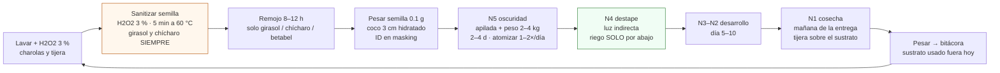
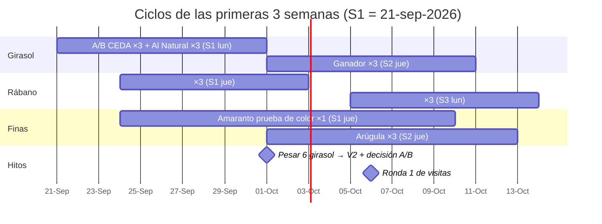

# Sembrar las primeras 6 semanas

**En una línea:** con siembras escalonadas lunes y jueves conviertes 10 charolas dobles en un
flujo continuo de girasol y rábano (más una fina de prueba), validas cada lote de semilla (V1) y
el rendimiento por variedad (V2), y sacas el dato que ninguna fuente pública tiene: cuántos
gramos da **tu** charola.

!!! info "Antes de empezar"
    - **Tiempo:** 45–60 min por siembra (lunes y jueves) + 10 min diarios de inspección + 1–2 h por cosecha (martes y viernes) · **Costo variable por charola** (semilla + coco + agua + desinfección + etiqueta, [08](../../referencia/08-recetas-y-economia-unitaria.md)): girasol CEDA $9.10, girasol Al Natural $29.50, rábano $49.30, arúgula $35.30, amaranto $7.50 · **Personas:** 1
    - **Necesitas:** la lista "hoy" de [compras](compras.md) (charolas, semilla, coco, básculas, agua oxigenada 3 %, termómetro, atomizadores), cubeta de remojo, masking + marcador, `bitacora/produccion.csv` abierto.
    - **Prerequisitos:** [Montar el rack](montaje.md) · guías [Prueba de germinación](../../guias/prueba-de-germinacion.md), [Sanitizar semilla](../../guias/sanitizar-semilla.md), [Sembrar una charola](../../guias/sembrar-una-charola.md), [Lavar y desinfectar charolas](../../guias/lavar-y-desinfectar-charolas.md).

## Las recetas de la Fase 0

Charola 1020 (25 × 50 cm). Síntesis de Johnny's, Bootstrap Farmer y True Leaf Market con
precios mexicanos ([08 §tabla operativa](../../referencia/08-recetas-y-economia-unitaria.md)):

| Especie | Semilla / charola | Remojo | Oscuridad | Días a cosecha | Rendimiento esperado | Merma plan | Rol en Fase 0 |
|---|---|---|---|---|---|---|---|
| **Girasol** | **135 g secos** (120–150) | 8–12 h | 2–3 d con peso 2–4 kg | 8–12 | 300–500 g (estimado: **pesar las primeras 6**) | 5–10 % | Ancla de volumen; prueba A/B CEDA vs específica |
| **Rábano** | **28 g** (25–30) | no | 2–3 d | 7–10 | 225–325 g (medido) | 2–5 % | Mejor $/charola-semana ($82); la "fina" de la hoja de precios |
| **Arúgula** | **11 g** (10–12) | **NUNCA** (mucílago) | 3–4 d | 10–14 | 200–285 g | 5–8 % | Segunda fina; riego solo por fondo |
| Amaranto | 10 g (8–12) | no | 2–4 d | 14–18 | 120–200 g | 10–15 % | **1 charola de prueba de color** (¿rojo o verde?) |
| Brócoli | 15 g (13–18) | no | 2–3 d | 9–13 | 250–330 g | 5–10 % | Segunda ola (semanas 4–8), cuando Hydrocultura confirme gramaje |
| Betabel | 30 g (25–35) | 4–8 h | 6–8 d (el más largo) | 13–18 | 180–270 g | 8–12 % | Segunda ola; poco volumen |
| Cilantro (entera) | 35 g (30–40) | 2–4 h + H2O2 | 7–9 d | 18–24 | 140–200 g | 8–12 % | Solo bajo pedido confirmado (21 días de rack) |
| Chícharo | 275 g | 6–24 h | 3–5 d | 9–13 | 350–600 g (estimado) | 3–8 % | **NO** hasta validar arvejón grado alimento de CEDA |

!!! tip "Ajuste de temporada"
    Si tus 6 semanas caen entre junio y el 10 de octubre (temporada de lluvia, HR 70–80 % con
    picos de 89 %): siembra **~10 % menos denso** (girasol ~120 g), riega **solo por abajo** desde
    el destape y ventila. De diciembre a febrero la germinación se alarga 30–50 %: suma días al
    calendario y usa tapete térmico ([02 §1](../../referencia/02-restricciones-y-requisitos.md),
    [germinar en invierno](../../guias/germinar-en-invierno.md)).

## La regla de flujo (lo que se repite dos veces por semana)



Las reglas que no se negocian (SOP completo en [03 §0.3](../../referencia/03-instalacion.md)):

- **Doble charola:** perforada con el sustrato dentro de una lisa; a partir del destape el agua
  va **entre las dos**, nunca sobre el follaje.
- **Peso encima durante la oscuridad** (2–4 kg: otra charola con agua o un ladrillo envuelto):
  fuerza raíces parejas y tallos rectos.
- **Sanitización de semilla** con agua oxigenada 3 % precalentada a 60 °C, 5 min con agitación y
  enjuague (rábano/brócoli: 10 min a temperatura ambiente); retira flotantes. El remojo tibio
  de girasol sin sanitizar es una incubadora de *Salmonella*
  ([research/inocuidad §2](../../research/inocuidad-operativa.md)).
- **Pelusa azul, verde o negra = charola a la basura** sin negociar; pelos radiculares blancos y
  uniformes son normales ([control de plagas](../../guias/control-de-plagas.md), umbral V8:
  > 10 % de charolas afectadas dispara el protocolo).
- **Cosecha con tijera limpia justo sobre el sustrato**, en la mañana del día de entrega; se pesa
  todo ([cosechar y empacar](../../guias/cosechar-y-empacar.md)).

## Calendario de 6 semanas

Supuestos: **10 charolas dobles** del BOM (máximo ~10 en proceso), siembras lunes y jueves,
entregas martes y viernes (la cosecha se hace esa mañana; las ventanas de 7–10 días del rábano y
8–12 del girasol dan holgura para cuadrar). Ejemplo con S1 = lunes 21-sep-2026; corre las fechas
si arrancas otro día.

| Semana | Lunes (siembra) | Jueves (siembra) | Cosechas de la semana | Para qué sirve |
|---|---|---|---|---|
| **S0** | Llega la semilla → **V1** de los 3 lotes (girasol CEDA, girasol Al Natural, rábano), 50 semillas cada uno | — | — | No se siembra nada que no haya pasado V1 |
| **S1** | **6 charolas de prueba:** 3 girasol CEDA + 3 girasol Al Natural, 135 g cada una, mismo remojo (8 h), posiciones alternadas en la pila | 3 rábano (28 g) + 1 amaranto (10 g, prueba de color) | — | A/B de semilla (V6) + V2 de girasol |
| **S2** | sin charolas libres (10 en proceso) | Cosecha de los 6 girasol (día 10) → **pesar** → lavar → sembrar 3 girasol (semilla ganadora) + 3 arúgula (11 g) | jue: 6 girasol · sáb: 3 rábano (día 9) | Decidir semilla de girasol; primeras muestras cortadas para las visitas de S3 |
| **S3** | 3 rábano | sin charolas libres | vie: 1 amaranto (¿rojo o verde?) · sáb: 3 girasol | Ronda 1 de visitas mar–jue con muestra cortada esa mañana |
| **S4** | 3 girasol + 1 muestra fina (mostaza o cilantro del sobre de ISLA) | 3 rábano + 3 girasol | lun: 3 arúgula · mar: 3 rábano | Primeros pedidos reales: charola viva entregada mar/vie |
| **S5** | sin charolas libres | 3 girasol + 1 arúgula | jue: 3 girasol + 1 muestra · sáb–dom: 3 rábano + 3 girasol | Semana 1 de recurrencia |
| **S6** | 3 rábano + 3 girasol | según pedidos confirmados (+15–20 % de colchón por merma) | jue: 3 girasol + 1 arúgula | Semanas 2–3 de recurrencia → [gate](gate.md) |

A partir de S2 salen **6–7 charolas por semana**: suficiente para muestrear 15 restaurantes (una
charola de girasol da 3–5 muestras de 100 g; una de rábano, 2–3) y surtir a 2 clientes con
2–3 charolas vivas cada uno. Los huecos de los lunes S2 y S5 y los jueves S3 son el límite de
las 10 charolas: **si en S3 ya hay dos restaurantes pidiendo, compra 10 perforadas y 10 lisas
más ($1,200)** y siembra 4–5 por turno. Cuando haya pedidos comprometidos, siembra siempre
15–20 % más que lo vendido ([07 §6](../../referencia/07-puntos-ciegos-y-riesgos.md)).



## Semana 0: prueba de germinación V1 antes de sembrar

Por cada lote (`S001` girasol CEDA, `S002` girasol Al Natural, `S003` rábano): 50 semillas entre
toalla húmeda, en bolsa, 3–5 días a temperatura ambiente; cuenta las que germinan.
**Aceptas el lote con ≥ 85 % (girasol y chícharo ≥ 80 %).** Un lote que no pasa se reclama o se
descarta; no se siembra "a ver qué pasa". Registra el % por `lote_semilla` en
`bitacora/semilla.csv` ([V1](../../validacion/v01-germinacion.md), guía
[prueba de germinación](../../guias/prueba-de-germinacion.md)). Antes de comprar el costal de
5 kg de CEDA, la V1 se repite con el costal nuevo: el grado botanero no trae certificado.

## Semanas 1–2: las 6 charolas de prueba y el A/B de girasol

Es un experimento V6 y un ensayo V2 al mismo tiempo, así que se controla todo menos la semilla:

1. **Mismo día, misma densidad (135 g secos), misma sanitización y remojo (8 h), mismo coco.**
   Etiqueta las charolas `GIR-260921-S001-R1N5` (CEDA) y `GIR-260921-S002-R1N5` (Al Natural)
   y en la pila de oscuridad alterna A/B/A/B/A/B para que la posición no sesgue.
2. **Métrica primaria:** gramos cosechados por charola al día 10. **Secundarias:** % de
   germinación en charola (cuenta 1 marca de 10 × 10 cm), cáscaras pegadas al cotiledón, moho.
3. **V2 por brazo:** coeficiente de variación = desviación estándar ÷ media × 100 con las 3
   charolas. Ejemplo: pesos 420, 450 y 400 g → media 423 g, desviación ≈ 25 g → **CV ≈ 6 %**
   (aceptable: < 15 %). Si CV ≥ 15 %, el proceso no está controlado: revisa densidad, riego o
   peso antes de vender esa variedad ([V2](../../validacion/v02-rendimiento.md)).
4. **Decisión A/B** (registrada en `observaciones` y en el registro de semilla):
   - CEDA pasó V1 ≥ 80 %, CV < 15 % y rinde ≥ 90 % del específico → **recompra costal 5 kg
     ($140) o bulto ($24/kg)**: la semilla baja de $25 a $4.60 por charola.
   - Si no → te quedas con Al Natural ($185/kg): sigue dejando 67–75 % de margen bruto.
5. **Rábano:** las 3 charolas del jueves son su V2. Con 28 g y 9 días debería salir en
   225–325 g con CV < 15 %; es la especie más noble para aprender.
6. **Pesa las 6 charolas de girasol sin excepción.** El multiplicador real (g cosechados ÷ g de
   semilla seca) es el único dato que ninguna fuente pública midió; descarga como cuarta fuente
   la [guía gratuita de densidades de On The Grow](https://onthegrow.net/products/free-tray-specific-microgreen-seeding-guide-pdf)
   (checkout de $0).

## Bitácora desde la charola #1

Una fila por charola en `bitacora/produccion.csv`, llenada el mismo día (30 s por evento):

```csv
siembra_id,fecha_siembra,variedad,lote_semilla,densidad_g,dias_oscuridad,fecha_cosecha,rendimiento_g,merma_pct,destino,precio_mxn,observaciones
GIR-260921-S001-R1N5,2026-09-21,girasol,S001,135,3,2026-10-01,420,5,muestras,0,A/B brazo CEDA; H2O2 3% 60C 5min; remojo 8h
GIR-260921-S002-R1N5,2026-09-21,girasol,S002,135,3,2026-10-01,455,3,muestras,0,A/B brazo Al Natural
RAB-260924-S003-R1N5,2026-09-24,rabano,S003,28,2,2026-10-03,260,0,RestA,155,V2 charola 1 de 3
```

`siembra_id` = `VAR-AAMMDD-Slote-posición` (girasol, sembrado 21-sep-2026, costal S001, rack 1
nivel 5); el mismo código va en masking sobre la charola y se copia a la etiqueta al empacar.
Con eso un problema se rastrea en minutos hacia atrás (qué costal) y hacia adelante (qué
clientes) ([06 §datos](../../referencia/06-validacion-y-lazos-agenticos.md),
[research/inocuidad §5](../../research/inocuidad-operativa.md)). Desde la semana 2 la columna
`merma_pct` sustituye los supuestos de la tabla de recetas con datos tuyos.

!!! warning "Errores típicos"
    - **Copiar los 250 g de girasol de algunas guías.** Es semilla ya remojada (pesa 1.5–1.8×);
      con 250 g secos la charola se enmohece. 120–150 g secos es el punto dulce.
    - **Remojo de más de 12 h sin cambiar el agua.** Cambia el agua si pasa de 12 h y lava la
      cubeta entre lotes.
    - **Mojar el follaje después del destape.** Desde ese día el riego es solo por abajo.
    - **Remojar arúgula.** Su mucílago la convierte en gelatina: nunca.
    - **No pesar "porque se ve bien".** Sin gramos no hay V2, no hay margen real y no hay gate.
    - **Sembrar chícharo de Hydroenv "para probar".** $93.50 de semilla por charola: la prueba
      cuesta más que lo que vende ([08 §reglas](../../referencia/08-recetas-y-economia-unitaria.md)).

## Al terminar (fin de la semana 6)

- [ ] V1 hecha y registrada para los 3 lotes (y para cualquier costal nuevo)
- [ ] 6 charolas de prueba de girasol completaron ciclo con rendimiento pesado (commissioning [03](../../referencia/03-instalacion.md))
- [ ] V2 de girasol y rábano con CV < 15 % (o la causa identificada y corregida)
- [ ] Decisión A/B de girasol tomada y escrita en la bitácora; recompra hecha si aplica
- [ ] Color del amaranto nacional anotado (rojo/verde) antes de ofrecerlo como "fino"
- [ ] `bitacora/produccion.csv` con ≥ 30 filas reales y merma por especie calculada
- [ ] Cero charolas con moho entregadas; charolas afectadas registradas como merma
- **Registrar:** los tres KPIs de producción del lazo L2 para el gate — merma de producción
  (charolas tiradas ÷ sembradas, meta ≤ 10 %), rendimiento medio por especie y costo variable
  real por charola.
- **Siguiente paso:** desde la semana 3, en paralelo, [Vender a chefs](ventas.md); al cerrar la
  semana 6, [Pasar el gate G0→1](gate.md).

## Fuentes

- [08-recetas y economía unitaria](../../referencia/08-recetas-y-economia-unitaria.md) · [research/recetas-produccion-economia](../../research/recetas-produccion-economia.md) (densidades, remojo, oscuridad, rendimientos, notas por especie)
- [03-instalación §0.3](../../referencia/03-instalacion.md) (SOP de siembra) · [06-validación V1, V2, V6, esquema de datos](../../referencia/06-validacion-y-lazos-agenticos.md)
- [research/inocuidad-operativa §2 y §5](../../research/inocuidad-operativa.md) (sanitización de semilla, lote y trazabilidad)
- [research/clima-agronomía §4–5](../../research/clima-agronomia.md) (temporada de lluvia, germinación en invierno)
- Videos: playlist de tutoriales por variedad de On The Grow ([girasol, chícharo, rábano, brócoli](https://www.youtube.com/playlist?list=PLkEXI0BumyG5OBbqj_wXM6gnPB6gJ4alW)) y su [guía escrita de charolas 10 × 20](https://onthegrow.net/blogs/microgreens/how-to-grow-microgreens-10x20-trays-complete-guide); más en [aprendizaje/videos](../../aprendizaje/videos.md).
