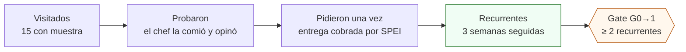

# Vender a chefs: el smoke test V4

**En una línea:** mapeas 15 restaurantes en un radio de 5 km, llegas sin cita martes–jueves de
10 a 12 con una muestra cortada esa mañana y una hoja de precios de una página, registras cada
semana *visitados → probaron → pidieron → recurrentes* y cobras por SPEI contra entrega — es la
única parte del proyecto que decide si hay Fase 1.

!!! info "Antes de empezar"
    - **Tiempo:** 2 mañanas por semana de visitas (semanas 3–6) + 2 entregas por semana; cerrar un cliente cuesta ~8–10 h y ~$650 de bolsillo en muestras y transporte ([07 §7](../../referencia/07-puntos-ciegos-y-riesgos.md)) · **Costo:** muestras (1 charola de girasol = 3–5 muestras de 100 g ≈ $9 de insumo; clamshell $3.50 c/u) + transporte · **Personas:** 1
    - **Necesitas:** producto de la semana 2 en adelante ([siembra](siembra.md)), 100 clamshells y etiquetas (o masking) de [compras](compras.md), hielera de 45–50 L con 4–6 gel packs [POR VERIFICAR: precio; no está en el BOM], hoja de precios impresa ([hoja de precios](../../guias/hoja-de-precios.md)), WhatsApp Business con catálogo, CLABE de una cuenta de negocio, talonario de remisiones en duplicado.
    - **Prerequisitos:** [Visitar a un chef](../../guias/visitar-a-un-chef.md) leída y el video de Donny Greens visto (abajo); decisión fiscal (RESICO vs persona moral) tomada **antes de la primera factura** ([Antes de gastar un peso](../../empieza-aqui/antes-de-gastar-un-peso.md)); [V4](../../validacion/v04-smoke-test.md).

## El embudo que vas a medir

La conversión visitado → recurrente esperable es **10–20 %**: de 15 visitas reales salen 2–3
clientes. Si tras 15 visitas hay 0 recurrentes, el problema es producto, precio o zona y se
pivota **antes** de la Fase 1 ([06 §V4](../../referencia/06-validacion-y-lazos-agenticos.md)).

## Pasos

### 1. Mapea 15 restaurantes (semanas 1–2, 2 h)

**Criterios de la lista** ([00 §Fase 0](../../referencia/00-plan-maestro.md),
[research/mercado-precios §6](../../research/mercado-precios.md)):

- Radio de **5 km** del patio (la ruta propia en moto cuesta $15–25 por parada; más lejos la
  logística se come el ticket).
- Prioridad: **cocina de autor, brunch, pokés/ensaladas, coctelería** (compran poco pero pagan
  premium y son vitrina), dark kitchens. Hoteles y cadenas después: piden carpeta de inocuidad
  y crédito a 30 días ([research/inocuidad §6](../../research/inocuidad-operativa.md)).
- Excluye los que tengan **menos de 6 meses operando** (mortalidad alta; nunca crédito) y
  cualquiera que ya tenga proveedor de microgreens con contrato visible.
- Mezcla de zonas para que **ningún cliente pese más del 25–30 % de tus ventas**: la meta no es
  1 grande sino 4–5 medianos.

| Zona | Por qué | Cuántos |
|---|---|---|
| **Roma – Condesa – Juárez – Polanco** | El corredor donde la narrativa "del productor a la mesa" ya está normalizada: Arca Tierra surte > 40 restaurantes desde San Miguel Chapultepec, Parián Condesa, Mercado el 100 en Roma Sur | 9–10 |
| **Coyoacán – San Ángel** | Brunch y cafés; menos denso, pero si el patio está al sur reduce la logística | 4–5 |
| Vitrina | [Mercado el 100](https://mercadoel100.org/contacto/) (Roma Sur, domingos 9:30–14:00): ahí ya vende Microverdes de la Ciudad; solicita ingreso y mientras úsalo como cliente-vitrina | 1 |

Guárdalo en `bitacora/prospectos.csv`:
`restaurante,zona,tipo,chef,administrador,whatsapp,mejor_horario,fecha_visita,probo,pidio,semanas_seguidas,notas`.

### 2. Prepara la muestra física

1. **Cosecha esa mañana** girasol + rábano (1 de volumen + 1 fina en cada muestra; arúgula y
   amaranto cuando los tengas). Clamshell de ~100 g por restaurante.
2. **Etiqueta** con el machote de [inocuidad §5](../../research/inocuidad-operativa.md):
   variedad, lote (`siembra_id`), cosechado el, consumir antes de, "conservar de 1 a 4 °C",
   "producto cultivado sin agroquímicos; se recomienda enjuagar antes de consumir", productor y
   WhatsApp. La leyenda de enjuague te protege sin arruinar el argumento de venta.
3. **Hielera con gel packs** (< 10 °C por 4–6 h): el cortado a 20–25 °C dura menos de un día
   ([07 §3](../../referencia/07-puntos-ciegos-y-riesgos.md)). Una muestra marchita vende lo
   contrario de lo que quieres.
4. **Lleva una charola viva de exhibición** para que el chef vea y corte; no la dejes salvo que
   ya sea un pedido cobrado.
5. Para 15 restaurantes en dos rondas necesitas ~4 charolas de girasol y ~3 de rábano: el
   calendario de [siembra](siembra.md) las tiene listas desde la semana 2.

### 3. Imprime la hoja de precios corregida

Una página, con estas cifras (la lista del plan original —$60–90 la charola y $250–450/kg el
cortado— estaba 2–3× barata y destruye el margen de todo menos el girasol;
[research/mercado-precios §4](../../research/mercado-precios.md)):

| Producto | Precio de lista | Volumen / promo |
|---|---|---|
| Charola viva de girasol (o chícharo cuando lo haya) | **$90–120** | $70–80 con 4+ charolas/semana; $60–90 **solo** como promoción del primer mes |
| Charola viva de variedades finas (rábano, brócoli, amaranto, arúgula, albahaca micro) | **$130–180** | — |
| Microgreens cortados, clamshell de 100 g, entregado | **$50–90** ($500–900/kg) | Solo bajo pedido y entregado el día del corte |

Condiciones impresas al pie:

- **Precios con IVA 0 % — producto agrícola fresco.**
- **Pago por SPEI contra entrega** (Fase 0). Remisión firmada en cada entrega.
- Entrega semanal fija **martes y viernes**; pedido por WhatsApp hasta el lunes 12:00.
- **Sin mínimo el primer mes** (gancho); después, pedido mínimo sugerido $350–400 para que la
  entrega no coma > 15 % del ticket.
- Charola viva: la recoges en la siguiente entrega o se cobra depósito ($60–70, lo que cuesta).

Plantilla y variantes en [hoja de precios](../../guias/hoja-de-precios.md).

### 4. La visita: guion de 90 segundos

**Sin cita, martes a jueves de 10 a 12 h** (antes del servicio de comida). Pregunta por el chef
o el sous chef; si no está, deja muestra + hoja + tu WhatsApp y pregunta a qué hora vuelve.

1. **Quién eres y de dónde viene** (10 s): "Produzco microgreens en mi patio en [colonia], a
   [X] km de aquí; esto lo corté hoy a las 7."
2. **Abre la muestra** (20 s): que pruebe girasol y rábano. Cállate mientras prueba.
3. **La oferta gancho** (20 s): entrega semanal fija, charola viva (cortas lo que usas, dura una
   semana en la cocina) o cortado el mismo día; sin mínimo el primer mes; sin crédito, pero sin
   sorpresas.
4. **Una pregunta** (20 s): "¿Qué usan hoy y cuánto les cuesta?" — es dato para tu hoja de
   precios y te dice si compites por precio (no) o por frescura (sí).
5. **Cierra con fecha** (20 s): pide su WhatsApp **y el del administrador** (el cliente es el
   restaurante, no el chef: la rotación de chefs es el riesgo #4 del plan) y di cuándo vuelves
   o cuándo cae la primera entrega.

Después:

- **48–72 h:** un mensaje con la foto de la charola del día y una sola pregunta: "¿algo que
  cambiarías del producto?" (KPI de feedback: meta ≥ 50 % de respuesta).
- **Cliente contento → pide 1 referido.** Baja el costo de adquisición ~70 %.
- **Cliente que pasa de 3 semanas → firma el acuerdo de suministro de 1 página** con el
  administrador o dueño (machote en
  [research/cobranza-b2b §4](../../research/cobranza-b2b.md): pedido hasta lunes 12:00, entrega
  mar/vie, rechazo solo en recepción, pago SPEI, IVA 0 %, vigencia indefinida con 14 días de
  aviso).

Ver antes de la primera ronda —On The Grow enseña a cultivar; Donny enseña a **vender** por
entrega semanal a chefs, y lleva 7 años viviendo de eso:

<iframe width="560" height="315" src="https://www.youtube.com/embed/MoSDSE8j7k8" title="Donny Greens — cómo vender microgreens a restaurantes" frameborder="0" allowfullscreen></iframe>

Complementos: su [playlist de negocio](https://www.youtube.com/playlist?list=PLA09_1g6En1FVnk3eu93LeIVCFNjqSTu0),
su libro *Microgreens: The Insiders Secrets* ([compras](compras.md)) y Curtis Stone,
[My 3 Most Profitable Microgreens](https://www.youtube.com/watch?v=KO-OuqbR3EE), para el mix
por margen.

### 5. Registra el embudo cada semana

El domingo, junto con los KPIs, una fila por semana en `bitacora/embudo.csv`:

| Semana | Visitados (acum.) | Probaron | Pidieron una vez | Recurrentes (≥ 3 sem.) | Conversión |
|---|---|---|---|---|---|
| S3 | 8 | 6 | 1 | 0 | — |
| S4 | 15 | 12 | 4 | 0 | — |
| S5 | 15 | 12 | 5 | 1 | 7 % |
| S6 | 15 | 13 | 5 | 2 | 13 % |

(Números de ejemplo: el gate pide la última columna.) Cada entrega es además una fila en
`bitacora/ventas.csv`:
`fecha,cliente,producto,cantidad,precio_unit_mxn,entregado_a_tiempo,feedback` — es lo que lee
`tools/gate_audit.py` ([gate](gate.md)). Reglas de lectura escritas de antemano
([06 §L2](../../referencia/06-validacion-y-lazos-agenticos.md)):

- **Muestras gratis y pedidos no cobrados no cuentan** como "pidieron".
- **Sell-through < 75 % dos semanas seguidas → no siembres más volumen:** el problema es venta.
- **Cliente que no pide 2 semanas → visita presencial**, no mensaje.
- **2 quejas del mismo tipo → cambia el producto** (densidad, corte, empaque) esa misma semana.

### 6. Entrega y cobra

1. **Cosecha la mañana de la entrega**, pesa, empaca, etiqueta con el `siembra_id`, hielera si es
   cortado; la charola viva viaja sin frío.
2. **Ruta propia en moto, 2 días fijos** (martes y viernes): $15–25 por parada. Para
   reposiciones ≤ 10 km, [DiDi Entrega Light desde $29](https://dplnews.com/didi-lanza-servicio-de-entrega-para-pequenos-paquetes-desde-29-pesos-en-mexico/)
   (9:00–19:00, paquete tipo mochila; una charola viva cabe justa: confirmar con el repartidor);
   urgencias, Uber Flash Moto (~$58 por ~5 km). Nunca a rutas de varios clientes.
3. **Remisión en duplicado firmada por quien recibe, siempre.** Inspección al momento; el
   rechazo solo procede en recepción y se repone en 24 h o se descuenta. Sin firma no hay deuda
   demostrable ([cobrar y suspender](../../guias/cobrar-y-suspender.md)).
4. **SPEI al momento o el mismo día, cero excepciones.** Efectivo solo con recibo foliado.
   Muestra gratis solo la primera semana. Un cliente que no pagó el mismo día recibe la
   siguiente entrega contra pago, sin drama: "política de la casa".
5. **Factura** CFDI 4.0 PUE (forma de pago 03 transferencia o 01 efectivo), IVA 0 %, clave
   `50404100`, con la leyenda de exención del art. 113-E si tributas en RESICO-AGAPES
   ([facturar CFDI](../../guias/facturar-cfdi.md)). **No emitas ninguna factura hasta resolver
   con contador desde qué RFC** (socio de persona moral = RESICO vetado); mientras, remisión +
   cobro [POR VERIFICAR con contador: si las ventas de la Fase 0 se facturan o se declaran de
   otra forma].
6. **Ruta de reparto** documentada en [ruta de reparto](../../guias/ruta-de-reparto.md) cuando
   pasen de 3 clientes.

### 7. Abre el canal de suscripción a hogares (lista de espera)

El jugador CDMX establecido, [MIJARDIIN](https://www.mijardiin.mx/microgreens), no da crédito:
cobra **suscripción prepagada** de 3 clamshells por $260/semana (5 por $415, 7 por $560, envío
incluido en zona centro). Diez hogares suscritos ≈ $10,000/mes extra con la misma producción y
desriesgan la dependencia de 4–5 restaurantes. El arranque formal es de Fase 1, pero en Fase 0:

- Abre una **lista de espera** por Instagram + WhatsApp (nombre, colonia, día preferido).
- Prueba el formato con **2–3 hogares conocidos, prepagados**: valida clamshell, etiqueta,
  hielera y ruta con cero riesgo de cobranza.
- Ningún canal debe pesar > 60 % del ingreso ([07 §5](../../referencia/07-puntos-ciegos-y-riesgos.md)).

!!! warning "Errores típicos"
    - **Vender a $60–90 "para entrar".** Solo el girasol con semilla de CEDA sobrevive ese
      precio; el rábano deja 18 % y el brócoli 5 %. La promo es del primer mes y solo en girasol.
    - **Dar crédito "porque es el primer cliente".** Estás validando que pagan. Un cliente que
      quiere pero no paga no cuenta para el gate.
    - **Formalizar con el chef.** Se va en 6 meses y el acuerdo se va con él: administrador o
      dueño, siempre.
    - **Entregar cortado sin frío.** Muere en horas; la charola viva evita todo eso y reduce el
      rechazo casi a cero.
    - **No preguntar "¿qué usan hoy?".** Es la única forma de saber contra quién compites y a
      qué precio.

## Al terminar (fin de la semana 6)

- [ ] 15 restaurantes visitados con muestra (≥ 12 con el chef o sous chef presente)
- [ ] `bitacora/embudo.csv` con las 4 cifras de cada semana (S3–S6)
- [ ] `bitacora/ventas.csv` con cada entrega; remisiones firmadas archivadas; SPEI conciliados contra el estado de cuenta
- [ ] ≥ 2 clientes con 3 semanas seguidas cobradas (o la decisión de iterar/abortar lista para el gate)
- [ ] Feedback de ≥ 50 % de los clientes tras entrega; quejas repetidas atendidas
- [ ] Acuerdo de suministro firmado con cada cliente que pasó de 3 semanas
- [ ] Lista de espera de hogares abierta; 2–3 hogares de prueba prepagados
- **Registrar:** los KPIs comerciales del lazo L2 (sell-through, entregas a tiempo, recompra,
  CAC en horas y muestras por cliente cerrado) en la hoja del domingo.
- **Siguiente paso:** [Pasar el gate G0→1](gate.md).

## Fuentes

- [00-plan maestro §Fase 0](../../referencia/00-plan-maestro.md) (lista de 10–15, horario, oferta gancho, embudo)
- [06-validación §L2 y V4](../../referencia/06-validacion-y-lazos-agenticos.md) (KPIs, reglas de decisión, smoke test)
- [research/mercado-precios](../../research/mercado-precios.md) (competidores, precios corregidos, zonas, logística) · [01-proveedores §7](../../referencia/01-proveedores-cdmx.md)
- [research/cobranza-b2b](../../research/cobranza-b2b.md) (SPEI contra entrega, remisión firmada, acuerdo de 1 página, protocolo 7/14/45)
- [07-puntos ciegos §3, §5, §7, §8](../../referencia/07-puntos-ciegos-y-riesgos.md) (cadena de frío, mercado 2026, CAC, cobranza)
- [research/inocuidad-operativa §5–6](../../research/inocuidad-operativa.md) (etiqueta, lote, lo que piden hoteles)
- Videos: [research/tutoriales-videos §a](../../research/tutoriales-videos.md)
