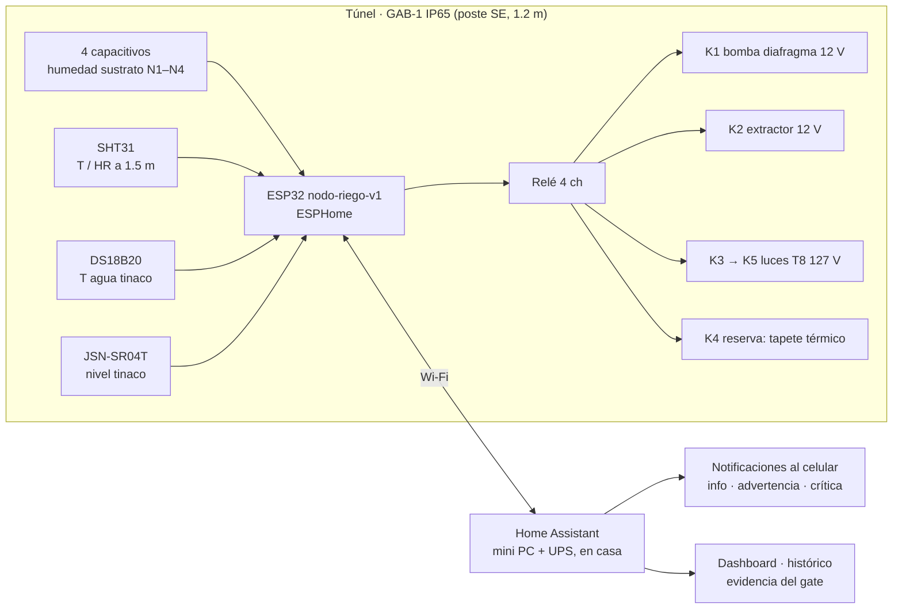

# Armar la automatización v1: riego, ventilación y alarmas

**En una línea:** armas el nodo de riego (ESP32 + 4 capacitivos + SHT31 + DS18B20 + JSN-SR04T
+ relé de 4 canales) primero en la mesa y luego en un gabinete IP65 en el túnel, con GFCI y
tierra física antes del primer relé, Home Assistant en casa con UPS, riego por histéresis,
ventilación por humedad y alarmas que llegan al teléfono — y lo pruebas 72 h con fallas
inyectadas antes de ponerle una sola charola.

!!! info "Antes de empezar"
    - **Tiempo:** banco de pruebas 1 día (S12) · Home Assistant 2–3 h (S12) · electricista medio día (S13) · cableado de campo 1 día (S13–14) · lógica y dashboard 3–4 h (S14) · dry-run V3 72 h + 7 días de charolas testigo (S15) · **Costo:** electrónica y cerebro ≈ $8,364 (pestaña S8 de [compras](compras.md)) + seguridad eléctrica ≈ $4,559 que vive en `bom/fase2.csv` y se adelanta aquí (GFCI $1,159, tapa + varilla + cable ~$900, electricista ~$2,500) · **Personas:** 1 + electricista certificado
    - **Necesitas:** todo lo de la S8; laptop con [ESPHome](../../software/firmware.md) y cable USB de datos; multímetro, cautín, protoboard y dupont para el banco ([04-herramientas](../../referencia/04-herramientas.md)); una cubeta de 19 L con agua para la bomba; el termohigrómetro de respaldo para contrastar el SHT31.
    - **Prerequisitos:** túnel cerrado ([túnel](tunel.md)) y tinaco con LT-1/TT-1 montados ([agua](agua.md)); [Eléctrico](../../diseno/electrico.md) (esquemas, tabla de pines, cableado y protecciones) y [Control](../../diseno/control.md) (lazos L0); guías [Flashear ESPHome](../../guias/flashear-esphome.md), [Configurar Home Assistant](../../guias/configurar-home-assistant.md), [Instalar GFCI y tierra](../../guias/instalar-gfci-y-tierra.md), [Montar gabinete IP65](../../guias/montar-gabinete-ip65.md).

## Cómo funciona



El nodo mide y actúa solo (lazo L0: histéresis, sin PID); Home Assistant guarda el histórico,
ajusta los setpoints, manda las alarmas y produce la evidencia del gate. Regla de diseño de
[06-validación](../../referencia/06-validacion-y-lazos-agenticos.md): un lazo que actúa sin
verificar que la acción ocurrió no es un lazo, es una esperanza.

## Cómo queda


Los tres esquemas se generan con schemdraw desde `hardware/electrico/*.py`; la explicación de
cada uno, la tabla de cableado (calibres, colores, longitudes máximas) y la lista de 20
protecciones están en [Eléctrico](../../diseno/electrico.md).

## Pasos

### 1. Banco de pruebas en la mesa (S12) — antes de tocar el patio

1. **Arma todo sobre la mesa:** ESP32 en protoboard, los 4 capacitivos, SHT31, DS18B20,
   JSN-SR04T, módulo relé y la bomba de diafragma metida en una cubeta con agua. Nada de
   127 V en esta etapa: las luces se simulan con un LED en la bobina de K5.
2. **Ajusta el buck LM2596 a 5.0 V con el multímetro ANTES de conectar el ESP32** (en vacío
   y luego con carga; si baja de 4.75 V, cable más corto o más grueso). Diodo Schottky,
   capacitores y fusible de 2 A como en el esquema de alimentación.
   *Criterio de listo:* 5.0 V en VIN con la bomba arrancando; el ESP32 no se reinicia.
3. **Flashea por USB la primera vez** con el YAML del repo
   ([`firmware/esphome/nodo-riego-v1.yaml`](https://github.com/AndresIslas99/HomeGreen/blob/main/firmware/esphome/nodo-riego-v1.yaml),
   guía [Flashear ESPHome](../../guias/flashear-esphome.md)); después todo es OTA. **Nunca USB
   y VIN a la vez.**
   *Criterio de listo:* el nodo aparece en la integración ESPHome de HA con todas sus entidades.
4. **Calibra los capacitivos** con el método seco/húmedo de la guía de SmartHomeScene
   (verificada en [research/tutoriales-videos §c](../../research/tutoriales-videos.md)): lee el
   voltaje de cada sensor en el aire y sumergido en agua hasta la línea, anota los dos valores
   por sensor y ponlos en `calibrate_linear` (0 % = seco, 100 % = húmedo) con filtro `median`.
   Descarta los que lean igual en aire y en agua (20–30 % del pack). Sella el borde de la PCB
   de los 4 buenos con esmalte.
   *Criterio de listo:* los 4 sensores leen 0–5 % en aire y 95–100 % en agua, y bajan
   parejo al secarse un sustrato de prueba.
5. **Verifica cada sensor contra una referencia:** JSN-SR04T contra una pared a 50 y 100 cm
   medidos con flexómetro (recuerda la zona muerta de ~20 cm); SHT31 contra el termohigrómetro
   de respaldo; DS18B20 en agua con hielo (≈ 0 °C). Cada relé debe hacer "clic" desde HA y la
   bomba arrancar en la cubeta.
   *Criterio de listo:* tabla de banco con lectura vs referencia por sensor (va al issue).

!!! warning "Error típico en el banco"
    Los capacitivos leen bien y "se vuelven locos" al conectar Wi-Fi: estaban en pines de
    ADC2. Solo **ADC1 (GPIO32–39)** para analógicos. Y un módulo relé alimentado del 3V3 del
    ESP32 reinicia el nodo cada vez que cierra una bobina: el relé va al 5 V del buck.

### 2. Home Assistant en casa (S12)

6. **Instala el cerebro dentro de la casa, no en el túnel** (humedad y robo: solo los nodos de
   $150 quedan a la intemperie). Mini PC ThinkCentre usado (~$3,000) o Pi 5 4 GB ($3,069) con
   el UPS chico para el cerebro **y el router**: sin internet no hay alarmas. Home Assistant
   OS + integración ESPHome nativa ([Configurar Home Assistant](../../guias/configurar-home-assistant.md),
   [Software → Home Assistant](../../software/home-assistant.md)).
7. **Dashboard mínimo:** humedad de sustrato de los 4 niveles, T/HR del túnel, nivel y
   temperatura del tinaco, estado de bomba/extractor/luces, y el panel de **excepciones**
   (últimas alarmas). El lazo L1 diario mira solo lo que salió de banda.
8. **App móvil con notificaciones** y, para lo crítico, un canal que suene aunque el teléfono
   esté en silencio (push repetido con `alert`; Telegram o llamada vía Twilio como escalación).
   *Criterio de listo:* una notificación de prueba llega al celular en < 10 s.

### 3. Seguridad eléctrica (S13) — obligatoria antes del primer relé en el patio

!!! danger "Lugar mojado"
    El patio es "lugar mojado" según la NOM-001-SEDE-2012 (texto en el DOF,
    [research/electrico-respaldo-seguridad §4](../../research/electrico-respaldo-seguridad.md)):
    GFCI en todo el circuito exterior, contacto resistente a intemperie con tapa "in-use",
    equipo en gabinete IP65 y puesta a tierra real. Agua + 127 V + manos mojadas es el
    escenario clásico de electrocución doméstica; una fuente barata goteada, el de incendio.

9. **Contrata medio día de electricista certificado** (~$1,500–3,500 llave en mano con tierra;
   pide 2–3 cotizaciones) para: breaker **Square D QO120GFI de 20 A ($1,159)** en el centro
   de carga para el circuito del patio (mínimo aceptable: contacto GFCI Square D $389 aguas
   arriba de todo), conductores cal. 12 en conduit, **contacto dúplex WR con tapa "in-use"**
   (~$249) y **varilla copperweld 5/8" × 3 m con conductor cal. 8 continuo** hasta la barra
   de tierra. Guía y qué pedirle por escrito: [Instalar GFCI y tierra](../../guias/instalar-gfci-y-tierra.md).
   *Criterio de listo:* **≤ 25 Ω medidos con telurómetro, por escrito**; si sale más, segunda
   varilla en paralelo o intensificador de tierra. Botón TEST del GFCI dispara.
10. **Dos gabinetes IP65 separados:** gabinete A (127 V CA: fuente ELI-1260) y gabinete B
    (12 V CC: fusiblera, relés, buck, ESP32), con prensaestopas, sin compartir prensaestopa ni
    empalmes fuera de caja ([Montar gabinete IP65](../../guias/montar-gabinete-ip65.md)). GFCI y
    tierra no se sustituyen: el GFCI protege personas (5 mA), la tierra da camino de falla y
    protege equipo.

### 4. Cableado de campo (S13–S14)

11. **GAB-1 en el poste sureste a 1.2 m** (layout), con el cable de 127 V de uso rudo entrando
    por su prensaestopa al gabinete A y la salida de 12 V al gabinete B. Fusibles del nodo:
    F0 5 A fuente · F1 5 A bomba · F2 2 A extractor · F3 1 A bobina de K5 · F5 2 A luces T8
    (127 V, en el gabinete A). Tierra común en estrella: todos los GND a una barra del gabinete B.
12. **Sensores de sustrato con el conector HACIA ARRIBA y encintado**, uno por nivel en una
    charola testigo (mueren por corrosión del conector, no del sensor); cable de 3 hilos
    22–24 AWG, máximo ~3 m. **SHT31 a 1.5 m en el centro** del túnel, con pull-ups de 4.7 kΩ
    si el módulo no los trae, cable blindado ≤ 2 m. **DS18B20 sumergido en el tinaco**
    (10 m con 4.7 kΩ). **JSN-SR04T en la tapa apuntando al agua sin obstáculos**, ECHO por el
    divisor 10 kΩ / 20 kΩ; no alargar su cable más de 5 m [POR VERIFICAR: ficha del módulo].
13. **Actuadores:** K1 → bomba de diafragma 12 V (14 AWG); K2 → extractor 12 V; K3 excita la
    bobina de 12 V del relé de potencia K5 que vive en el gabinete A y conmuta los **8 tubos T8
    (144 W)** por canaleta con tierra al chasis del rack — el módulo relé de 5 V **nunca ve
    127 V**; K4 → tapete térmico (dic–feb). Etiqueta cada extremo de cable.
    *Criterio de listo:* con el breaker abajo, continuidad de tierra desde el chasis de cada
    gabinete hasta la barra del tablero; con el breaker arriba, cada relé actúa desde HA y
    el GFCI **no** dispara.

### 5. Lógica en Home Assistant (S14)

Lazos L0 de la v1 (referencias de [06-validación](../../referencia/06-validacion-y-lazos-agenticos.md)
y [02 §1](../../referencia/02-restricciones-y-requisitos.md)):

| Lazo | Sensor | Regla | Actuador | Interlock |
|---|---|---|---|---|
| Riego por histéresis | mínimo de los 4 capacitivos (en v1 hay una bomba y válvulas manuales: el nivel más seco manda) | ON si < límite inferior, OFF si > superior; banda por etapa (germinación vs desarrollo); **máximo N ciclos/h** y tope de duración por ciclo | K1 bomba | **no arranca con tinaco < 20 % ni con nodo caído** |
| Ventilación (la automatización más importante jun–sep) | SHT31 | ON si HR > 75 % o T > 28 °C, OFF 5 puntos abajo (histéresis); en temporada de lluvia arranque en 70 % y **forzado 10 min/h** | K2 extractor | — |
| Fotoperiodo | reloj | T8 12–14 h/día | K3 → K5 | — |
| Germinación de invierno | DS18B20 / SHT31 | tapete ON si T < 18 °C en dic–feb (meta 22 °C) | K4 | — |

Alarmas del catálogo L0 con su canal:

| Severidad | Condición | Canal | Respuesta |
|---|---|---|---|
| Info | ciclo de riego ejecutado | log / dashboard | ninguna |
| Advertencia | tinaco < 40 %; HR > 75 % durante 6 h; riego ejecutado y la humedad **no subió** en 2 ciclos (línea rota, boquilla tapada, sensor muerto) | push | mismo día |
| Crítica | tinaco < 20 % (bloquea la bomba); **nodo caído** (sin señal 10 min); corte de luz (el UPS del cerebro lo reporta vía NUT o el cerebro avisa al volver con la duración) | push repetido + Telegram / llamada | < 1 h |

Extracto ilustrativo (la versión canónica es
[`firmware/homeassistant/automations.yaml`](https://github.com/AndresIslas99/HomeGreen/blob/main/firmware/homeassistant/automations.yaml);
los setpoints viven en `input_number` para ajustarlos desde el dashboard sin editar YAML):

```yaml
# ESPHome (nodo-riego-v1.yaml): tope físico de riego aunque HA se caiga
switch:
  - platform: gpio
    pin: GPIO25
    inverted: true              # módulo relé activo en bajo
    id: bomba_riego
    name: "Bomba riego"
    restore_mode: ALWAYS_OFF    # en sustrato el estado seguro es APAGADO (en NFT v2 es ENCENDIDO)
    on_turn_on:
      - delay: 120s               # tope por ciclo: ajusta al tiempo real medido en el banco
      - switch.turn_off: bomba_riego

# Home Assistant: histéresis sobre el nivel más seco, con interlock de tinaco y nodo
- alias: "Riego - encender por histéresis"
  trigger:
    - platform: numeric_state
      entity_id: sensor.humedad_sustrato_min      # template: min() de los 4 niveles
      below: input_number.riego_limite_inferior
      for: "00:02:00"
  condition:
    - condition: numeric_state
      entity_id: sensor.nivel_tinaco
      above: 20
    - condition: state
      entity_id: binary_sensor.nodo_riego_v1_status
      state: "on"
    - condition: template                          # máximo N ciclos por hora
      value_template: "{{ states('counter.riegos_ultima_hora') | int < states('input_number.riego_max_ciclos_h') | int }}"
  action:
    - service: switch.turn_on
      target: { entity_id: switch.bomba_riego }
    - service: counter.increment
      target: { entity_id: counter.riegos_ultima_hora }

- alias: "Riego - apagar"
  trigger:
    - platform: numeric_state
      entity_id: sensor.humedad_sustrato_min
      above: input_number.riego_limite_superior
  action:
    - service: switch.turn_off
      target: { entity_id: switch.bomba_riego }

- alias: "Ventilación - HR alta"
  trigger:
    - platform: numeric_state
      entity_id: sensor.hr_tunel
      above: input_number.hr_ventilar          # 75 % (70 % en temporada de lluvia)
      for: "00:05:00"
  action:
    - service: switch.turn_on
      target: { entity_id: switch.extractor }

- alias: "CRÍTICA - nodo de riego caído"
  trigger:
    - platform: state
      entity_id: binary_sensor.nodo_riego_v1_status
      to: "off"
      for: "00:10:00"
  action:
    - service: notify.mobile_app_tu_cel
      data:
        title: "Nodo de riego sin señal"
        message: "Sin datos 10 min. Riego bloqueado. Verifica en sitio."
        data: { push: { interruption-level: critical } }
```

Los valores de los `input_number` (límites de humedad por etapa, ciclos por hora, duración
máxima) **se fijan en el banco y se afinan en el dry-run**; no hay número universal porque
dependen de la boquilla, la presión y el sustrato. Regístralos en el issue cuando queden.

### 6. Dry-run V3 (S15) — 72 h con agua sola y fallas inyectadas

14. **Corre el sistema 72 h con charolas de sustrato sin semilla** y ve inyectando fallas
    ([V3](../../validacion/v03-dry-run.md)). Documenta como tabla FMEA-lite:

    | Falla inyectada | Efecto esperado | Detección esperada | Respuesta esperada | Observado |
    |---|---|---|---|---|
    | Desconectar la bomba | humedad no sube tras riego | advertencia "riego sin efecto" en 2 ciclos | push mismo día | |
    | Vaciar el tinaco por debajo de 20 % | LT-1 < 20 % | crítica "tinaco bajo" | **bomba bloqueada**, push repetido | |
    | Pellizcar la línea de un nivel | ese nivel no sube | advertencia por nivel | push | |
    | Apagar el ESP32 | entidades `unavailable` | crítica "nodo caído" a los 10 min | push repetido; bomba no arranca | |
    | Cortar el Wi-Fi 30 min | nodo sin HA | crítica "nodo caído"; el nodo sigue con su tope físico de riego | push al volver; sin riego infinito | |
    | Botar el breaker del patio 10 min (y botón TEST del GFCI) | 127 V fuera; el cerebro sigue por UPS | aviso de corte con duración al volver | push; el nodo arranca solo con la bomba APAGADA | |
    | Desconectar un capacitivo | lectura fija o fuera de rango | sensor marcado "no confiable" | ese nivel no dispara riego | |

    **Aceptar solo si el 100 % de las fallas produjo la alarma correcta en el canal correcto y
    ningún actuador quedó en estado inseguro** (bomba corriendo en seco o encendida sin
    supervisión). Si una falla no se detectó, se corrige y se repite esa fila; no se "pasa
    con observaciones".
15. **Siete días con 4 charolas testigo sin intervención**, ya con semilla, en los 4 niveles
    regados: es el criterio de puesta en marcha de la fase.
    *Criterio de listo:* 4 charolas cosechadas con rendimiento en bitácora y cero riegos a mano.

## Tabla de pines del nodo de riego v1

Los mismos pines del YAML, del script schemdraw y de [Eléctrico](../../diseno/electrico.md);
si cambias uno, cámbialo en los tres lugares.

| GPIO | Función | Periférico | Nota |
|---|---|---|---|
| 32 / 33 / 34 / 35 | ADC1 | capacitivos S1–S4 (niveles 1–4) | ADC1 funciona con Wi-Fi; 34/35 solo entrada |
| 21 / 22 | I2C SDA / SCL | SHT31 (0x44) | pull-ups 4.7 kΩ a 3V3 |
| 4 | 1-Wire | DS18B20 del tinaco | pull-up 4.7 kΩ |
| 5 / 18 | TRIG / ECHO | JSN-SR04T | ECHO por divisor 10k/20k (5 V → 3.3 V) |
| 25 / 26 / 27 / 14 | salidas | K1 bomba · K2 extractor · K3 → K5 luces T8 · K4 reserva | módulo activo en bajo: `inverted: true` |
| 0, 2, 15, 6–11, 1, 3 | no se usan | pines de arranque, flash y UART0 | 16/17/19 libres para ampliar |

## Aprender viendo

Un sistema de riego diseñado nativo para ESPHome + Home Assistant, como referencia de producto
terminado a imitar en DIY (verificado en [Aprendizaje → Videos](../../aprendizaje/videos.md)):

<iframe width="560" height="315" src="https://www.youtube.com/embed/mCXTqONmpZk" title="DROPLET Smart Irrigation System for ESPHome and Home Assistant" frameborder="0" allowfullscreen></iframe>

La lógica de automatizaciones en español (riego programado + condición de humedad + corte de
seguridad) está en la guía de Aguacatec citada en [research/tutoriales-videos §c](../../research/tutoriales-videos.md);
el controlador de zonas de referencia es el repo `makstech/esphome-irrigation-system`.

## Al terminar

- [ ] Tabla de banco (lectura vs referencia por sensor) y valores de calibración en el issue
- [ ] Tierra ≤ 25 Ω por escrito; GFCI probado con TEST; dos gabinetes IP65 separados
- [ ] Tabla FMEA-lite del V3 con el 100 % de las filas en verde
- [ ] 4 charolas testigo 7 días sin intervención, con rendimiento en `bitacora/produccion.csv`
- [ ] Los `input_number` finales anotados; YAML del nodo y automatizaciones commiteados en `firmware/`
- Registrar: en `bitacora/produccion.csv`, `observaciones` = "riego automático desde AAAA-MM-DD" en el primer lote; el histórico de HA desde ese día es la evidencia de "v1 estable 30 días" del [gate](gate.md)
- Siguiente paso: [Pasar el gate G1→2](gate.md)

## Fuentes

- [03-instalación §1.3](../../referencia/03-instalacion.md) · [06-validación (L0, watchdogs, escalamiento, V3)](../../referencia/06-validacion-y-lazos-agenticos.md) · [02 §1 y §5](../../referencia/02-restricciones-y-requisitos.md)
- [research/electronica-automatizacion §2, §4](../../research/electronica-automatizacion.md) · [research/electrico-respaldo-seguridad §3.6, §3.8, §4, §5](../../research/electrico-respaldo-seguridad.md)
- [research/clima-agronomia §5](../../research/clima-agronomia.md) (ventilación por HR) · [research/tutoriales-videos §c](../../research/tutoriales-videos.md)
- [Eléctrico](../../diseno/electrico.md) · [Control](../../diseno/control.md) · [Software → Firmware](../../software/firmware.md) · [07 §10 seguridad del equipo](../../referencia/07-puntos-ciegos-y-riesgos.md)
