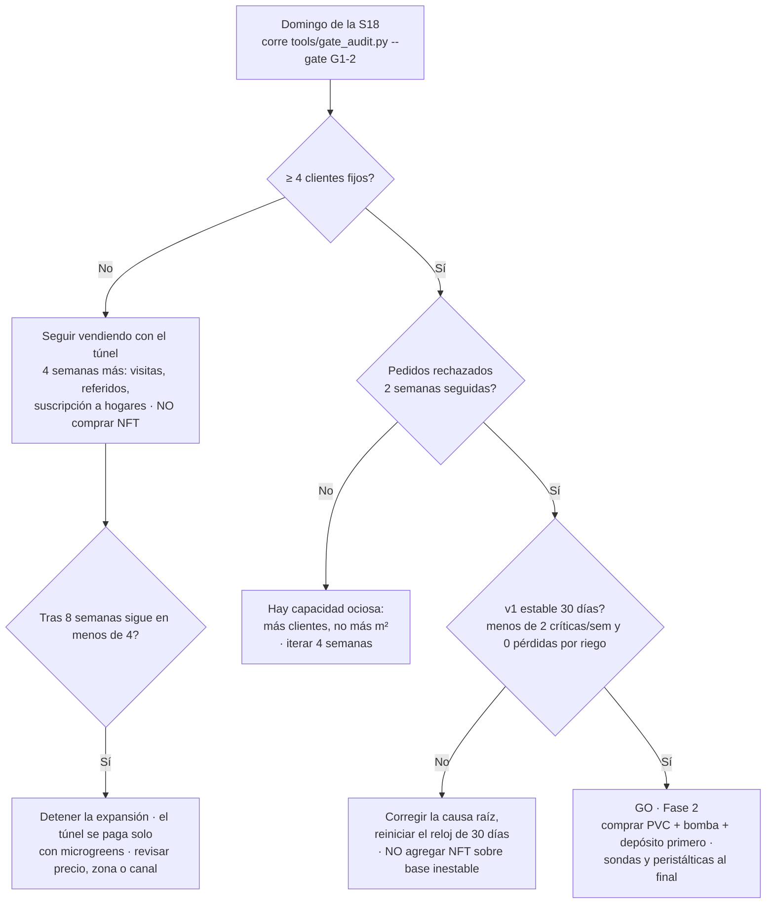

# Pasar el gate G1→2

**En una línea:** al final de la S18 mides tres cosas que un tercero podría auditar — 4–5
clientes fijos, pedidos rechazados dos semanas seguidas y 30 días de automatización v1 con
menos de 2 alarmas críticas por semana y cero pérdidas por riego — y solo con las tres en verde
liberas los ~$34–39k de la Fase 2. Un gate no alcanzado no se renegocia: se itera o se detiene.

!!! info "Antes de empezar"
    - **Tiempo:** 1 h el domingo de la S18 (los datos se acumulan solos desde la S15) · **Costo:** $0 · **Personas:** 1
    - **Necesitas:** `bitacora/ventas.csv` y `bitacora/produccion.csv` al día (llenados el mismo día, nunca de memoria); el histórico de Home Assistant desde el commissioning; `python3 tools/gate_audit.py` ([Software → CLI](../../software/herramientas-cli.md)); el issue del gate abierto con esta tabla pegada.
    - **Prerequisitos:** commissioning de la Fase 1 completo ([túnel](tunel.md), [agua](agua.md), [automatización v1](automatizacion-v1.md)); [cómo funcionan los gates](../../empieza-aqui/como-usar-esta-guia.md); la tabla completa L4 en [Validación → Gates](../../validacion/gates.md).

## Las tres métricas

Del lazo L4 de [06-validación](../../referencia/06-validacion-y-lazos-agenticos.md), con la
fuente de dato y la convención de registro para que `gate_audit.py` las pueda leer:

| # | Métrica | Umbral | Fuente del dato | Convención de registro |
|---|---|---|---|---|
| 1 | **Clientes fijos** | **≥ 4** (meta 4–5) | `bitacora/ventas.csv` | Fijo = recurrente en el sentido de G0→1 (≥ 3 compras semanales consecutivas) **y** con pedido en cada una de las últimas 2 semanas. Un cliente = un restaurante u hogar suscrito, no un chef [POR VERIFICAR: que `tools/gate_audit.py --gate G1-2` use esta misma definición] |
| 2 | **Demanda insatisfecha** | pedidos rechazados por falta de producto **2 semanas seguidas** | `bitacora/ventas.csv` | Cada pedido que no pudiste surtir se registra el mismo día como una fila con `cantidad` = charolas no surtidas, `precio_unit_mxn` = 0, `entregado_a_tiempo` = no y `feedback` = "RECHAZADO sin capacidad" [POR VERIFICAR: que `kpis.py` excluya esas filas del sell-through] |
| 3 | **Automatización v1 estable** | **30 días** con **< 2 alarmas críticas/semana** y **cero** charolas perdidas por fallo de riego | histórico de Home Assistant + `bitacora/produccion.csv` | El reloj arranca el día del commissioning (issue "Automatización v1"). Críticas = tinaco < 20 %, nodo caído, corte de luz con pérdida; una charola perdida por riego lleva `merma_pct` y `observaciones` = "fallo de riego: …" |

## Pasos

1. **Exporta la evidencia comercial.** De `bitacora/ventas.csv`, para cada cliente: semanas
   consecutivas con pedido y si pidió en las últimas 2. Cuenta los "RECHAZADO sin capacidad"
   por semana. *Criterio de listo:* una tabla cliente × semana pegada en el issue; la regla de
   L2 dice que un cliente ancla sin pedir 2 semanas se visita en persona, no por mensaje.
2. **Exporta la evidencia de Home Assistant.** Historial de las entidades de alarma (tinaco
   bajo, nodo caído, corte de luz), del `switch.bomba_riego` y de los 4 capacitivos desde el
   commissioning: 30 días completos. Cuenta las críticas por semana. El paquete de datos es el
   mismo que arma `tools/informe_semanal.py` para el lazo L3; guarda el CSV en el issue.
   *Criterio de listo:* 4–5 semanas con su conteo de críticas; ninguna semana con ≥ 2.
3. **Cruza con la bitácora de producción.** Filtra `observaciones` que contengan "riego" y
   `merma_pct` > 0 en esos 30 días. Una sola charola perdida por fallo de riego reprueba la
   métrica 3 (la regla es cero, no "poco").
4. **Corre la auditoría:** `python3 tools/gate_audit.py --gate G1-2`. Si el resultado difiere
   de tu conteo manual, gana el que tenga la fila de bitácora que lo respalde; corrige la
   bitácora o el script, no el umbral.
5. **Decide con la matriz de arriba y ciérralo en Git:** el issue del gate se cierra con los
   tres números reales y la decisión (Go / iterar N semanas / detener). Los commits son la
   prueba de que no se movieron los postes.

!!! warning "Error típico"
    Medir "demanda insatisfecha" en enero. Con S1 en septiembre, la S18 cae en el cráter del
    sector (−30–50 % de ventas, cierres del 24-dic al 6-ene): usa los datos de
    noviembre–diciembre para las métricas 1 y 2 o extiende el gate a febrero. La métrica 3 (v1
    estable) no se toca: 30 días son 30 días.

!!! danger "Lo que no se negocia"
    - **No agregar NFT sobre una base inestable.** En NFT las raíces cuelgan en una película de
      1–3 mm: sin recirculación, marchitez irreversible en 2–4 h. Si la v1 no aguantó 30 días
      con microgreens en sustrato (que perdonan una hora sin riego), no aguantará albahaca
      ([03 §2.3](../../referencia/03-instalacion.md)).
    - **No comprar sondas de pH/EC ni la batería "para adelantar".** El electrodo de pH caduca
      aunque no lo uses (12–18 meses) y la Fase 2 solo existe si este gate pasa
      ([research/electronica-automatizacion §5](../../research/electronica-automatizacion.md)).

## Qué hacer con cada resultado

| Resultado | Decisión | Qué haces las siguientes semanas |
|---|---|---|
| **3 en verde** | **Go** | Compras de Fase 2 en el orden de [03](../../referencia/03-instalacion.md): PVC sanitario + bomba sumergible + depósito primero; respaldo DC-first y seguridad antes de la primera línea con plantas; sondas y peristálticas al final. [Fase 2 → Índice](../fase-2/index.md) |
| Métrica 1 o 2 en rojo, 3 en verde | Iterar 4 semanas | El túnel ya se paga con microgreens: más visitas con muestra (V4), pedir 1 referido a cada chef contento (baja el CAC ~70 %), lanzar la suscripción a hogares, Mercado el 100. Sell-through < 75 % dos semanas = el problema es venta, no producción: no sembrar más volumen |
| Métrica 3 en rojo | Corregir y reiniciar el reloj | Causa raíz de cada alarma crítica (tabla FMEA-lite de [V3](../../validacion/v03-dry-run.md)); si fue el nodo, revisa alimentación y Wi-Fi; si fue agua, revisa tandeo y tamaño de tinaco; 30 días nuevos desde la corrección |
| 1 y 3 en rojo tras 8 semanas de iterar | Detener la expansión | Operar la Fase 1 como negocio de microgreens sin NFT; revisar precio, zona o canal antes de invertir un peso más. La regla de [07 §El número corregido](../../referencia/07-puntos-ciegos-y-riesgos.md): las fases se financian con el neto realista, no con el optimista |

## Mientras esperas el resultado

Se cotiza, no se compra. Deja listos para la S19:

- **NFT:** tubo PVC **sanitario** 4" Amanco ($415/tramo en Home Depot, no hidráulico cédula 40 a
  $1,401), bomba sumergible 4500 LPH ($1,199 Hydro Environment), tambo HDPE 200 L grado
  alimenticio (~$450–900 aprox., ML), filtro malla 120 ($189–230), canastillas 3" ($12.80 c/u)
  — **comprar canastillas antes de perforar** ([01 §4](../../referencia/01-proveedores-cdmx.md)).
- **Respaldo DC-first:** batería LiFePO4 12.8 V 100 Ah Epcom ($4,459 verificado, Cyberpuerta),
  2 bombas de diafragma 12 V 40–60 W (~$900–1,800 el par, ML), UPS DataShield DS-600 ($1,189)
  si el chico de Fase 1 no tiene puerto de comunicación ([research/electrico-respaldo-seguridad §6](../../research/electrico-respaldo-seguridad.md)).
- **Cadena de frío:** refrigerador usado 9–11 pies (~$4,000 aprox., ML) para producto cortado a
  4–5 °C ([07 §3](../../referencia/07-puntos-ciegos-y-riesgos.md)).
- **Semilla:** albahaca **Nufar** (resistente a fusarium) en Hydrocultura ($549/oz).
- **Comercial:** machote de acuerdo de suministro de 1 página y política de cobro de Fase 2
  ([research/cobranza-b2b](../../research/cobranza-b2b.md)); si vendes cortado, el aviso
  COFEPRIS-05-018 ([Aviso COFEPRIS](../../guias/aviso-cofepris.md)).

## Al terminar

- [ ] Tabla cliente × semana y conteo de rechazados en el issue del gate
- [ ] CSV del histórico de HA (30 días) con el conteo de críticas por semana
- [ ] Filtro de `produccion.csv` por "riego" en esos 30 días: cero pérdidas
- [ ] Salida de `tools/gate_audit.py --gate G1-2` pegada
- [ ] Issue cerrado con los 3 números reales y la decisión escrita
- Registrar: el paquete de evidencia (CSV de ventas, producción y HA) queda versionado en el repo bajo `bitacora/`; es también el material de venta "monitoreo 24/7" para los chefs de Fase 2
- Siguiente paso: [Fase 2 → Índice](../fase-2/index.md) si es Go; si no, [Vender a chefs](../fase-0/ventas.md) y [automatización v1 §6](automatizacion-v1.md) según la métrica en rojo

## Fuentes

- [06-validación §L2 (reglas de decisión), §L4 (gates), §esquema de datos](../../referencia/06-validacion-y-lazos-agenticos.md)
- [00-plan-maestro §mapa de fases](../../referencia/00-plan-maestro.md) · [03-instalación §orden de compra y §2.3](../../referencia/03-instalacion.md)
- [07-puntos ciegos §3, §5, §7, §8, §El número corregido](../../referencia/07-puntos-ciegos-y-riesgos.md) · [Línea de tiempo](../../empieza-aqui/linea-de-tiempo.md)
- [research/electronica-automatizacion §5](../../research/electronica-automatizacion.md) · [research/electrico-respaldo-seguridad §6](../../research/electrico-respaldo-seguridad.md) · [research/cobranza-b2b](../../research/cobranza-b2b.md)
