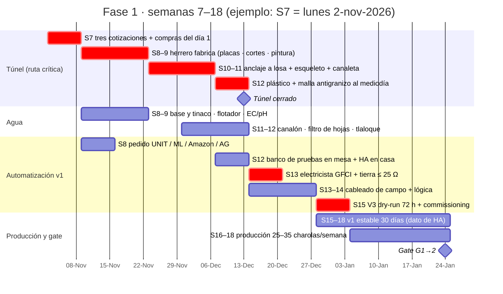

# Fase 1: producir bajo túnel con riego automático

**En una línea:** en 12 semanas (S7–S18) construyes un túnel de 3 × 6 m anclado a la losa con
malla antigranizo, pones el sistema a correr 100 % desde un tinaco de 750 L que se llena con la
lluvia del propio techo, y un ESP32 con Home Assistant riega, ventila y avisa — para vender
25–35 charolas por semana a 4–5 clientes fijos con menos de 2 alarmas críticas a la semana.

!!! info "La fase en números"
    | | |
    |---|---|
    | **Objetivo** | Producción formal y estable: túnel + agua propia + automatización v1 con alarmas que sí llegan |
    | **Inversión** | **$41,634** calculados desde [`bom/partidas.csv`](../../referencia/bom.md); $40,244 en versión austera. Incluye ya la partida de seguridad eléctrica ($4,559) que el BOM viejo presupuestaba en la Fase 2 y esta fase exige en la S13 — ver [compras](compras.md) |
    | **Meta** | $6,000–10,000/mes netos con 25–35 charolas/semana vendidas (siembras lunes y jueves) |
    | **Duración** | Semanas 7–18 (meses 2–4): túnel S7–12, automatización S12–15, 30 días de v1 estable S15–18 |
    | **Ruta crítica** | El herrero (cotizar S7, fabricar S8–9, montar S10–11). Todo lo demás llega antes si se pide el día 1 |
    | **Gate de salida** | [G1→2](gate.md): 4–5 clientes fijos **y** pedidos rechazados 2 semanas seguidas **y** v1 estable 30 días |

Se entra a esta fase **solo con el gate G0→1 pasado** ([Fase 0 → Gate](../fase-0/gate.md)): ya
hay al menos 2 clientes que pagaron 3 semanas seguidas y el margen variable es ≥ 55 %. La
Fase 1 convierte esa demanda probada en producción que no depende de que estés en casa. El
orden de construcción es el de [03-instalación](../../referencia/03-instalacion.md): **la
estructura protege lo demás** (túnel → tinaco → electrónica), y nada entra en producción sin
pasar su checklist de puesta en marcha.

## Cómo se verá

??? note "Leyenda y notas clave del plano"

    --8<-- "assets/diagramas/layout/patio-fase-1.notas.md"

Lectura del plano (supuesto: patio de 10 × 8 m, casa al sur, acceso al norte; si el tuyo
difiere, las reglas que se conservan son las de [Layout del patio](../../diseno/layout-patio.md)):

- **Túnel de 6 × 3 m = 18 m²** con la cumbrera este–oeste, puerta de 0.9 m en la cabecera
  norte (hacia el acceso) y 3 racks Husky adentro con pasillo de 0.94 m. Los empalmes de la
  fachada sur van atornillados, no soldados: la Fase 2 agrega 2 m hacia la casa sin tirar nada.
- **Tinaco de 750 L opaco sobre base firme** (lleno pesa ~750 kg) junto a la coladera, con el
  canalón del alero norte y una segunda canaleta del alero sur llegando por bajantes al filtro
  de hojas y al separador de primeras lluvias. La red solo rellena por flotador.
- **Un solo gabinete IP65 (GAB-1) en el poste sureste** a 1.2 m con el ESP32, el relé de 4
  canales y la fuente de 12 V; el cerebro (mini PC + router + UPS) vive **dentro de la casa**.
  El circuito del patio sale del centro de carga por un breaker GFCI y llega a un contacto
  intemperie con tapa "in-use"; varilla de tierra al pie.
- **Zona de cosecha separada del cultivo** por cortina plástica: mesa de acero inoxidable o
  polietileno, tina de lavado con H2O2, lavamanos y hielera de 45–50 L.

El esqueleto que fabrica el herrero: 3 pórticos (6 columnas de 2.00 m) a 3.0 m con un cabio
intermedio ligero a 1.5 m, cumbrera a 2.49 m, contravientos en ámbar. La malla antigranizo va
**por encima** del plástico con 150 mm de aire. Geometría, lista de cortes y anclaje en
[Estructura del túnel](../../diseno/estructura-tunel.md); modelo paramétrico en
[`hardware/cad/tunel_3x6.scad`](https://github.com/AndresIslas99/HomeGreen/blob/main/hardware/cad/tunel_3x6.scad).

## Las 12 semanas de un vistazo

La producción de la Fase 0 **no se detiene**: el rack sigue bajo techo hasta que el túnel esté
cerrado (S12) y los clientes se siguen surtiendo. Calendario completo con clima y qué hacer si
el herrero se retrasa en [Línea de tiempo](../../empieza-aqui/linea-de-tiempo.md).

!!! warning "Si tu S18 cae en enero"
    Con S1 el 21 de septiembre, el gate cae el 24 de enero: el cráter estructural del sector
    restaurantero (−30–50 % de ventas, [07 §5](../../referencia/07-puntos-ciegos-y-riesgos.md)).
    Mide "demanda insatisfecha" con los datos de noviembre–diciembre o extiende el gate a
    febrero. El reloj de "v1 estable 30 días" no se toca.

## Páginas de la fase (en orden)

| # | Página | Qué logras | Cuándo |
|---|---|---|---|
| 1 | [Comprar los materiales](compras.md) | `bom/fase1.csv` agrupado por semana de la ruta crítica: S7 estructura + agua, S8 electrónica, S12 racks, luces y fitosanitario; decisión herrero vs DIY; un pedido por proveedor | S7, S8, S12 |
| 2 | [Construir y anclar el túnel](tunel.md) | Trazo 3-4-5, esqueleto anclado con placa + 4 anclas 3/8" × 5" por columna, largueros por la cara interior, contravientos, plástico tensado al mediodía entre 3, malla antigranizo encima, cabeceras y puerta | S7–S12 |
| 3 | [Instalar el tinaco y la captación](agua.md) | Tinaco de 750 L sobre base firme, canalón con pendiente 0.5–1 %, filtro de hojas y separador de primeras lluvias, todo el riego desde el tinaco, EC/pH medidos, solicitud a Cosecha de Lluvia | S8–S12 |
| 4 | [Armar la automatización v1](automatizacion-v1.md) | Banco de pruebas en mesa, GFCI + tierra antes del primer relé, gabinete IP65 cableado, Home Assistant con riego por histéresis, ventilación por HR y alarmas; dry-run V3 de 72 h | S12–S15 |
| 5 | [Pasar el gate G1→2](gate.md) | Tres métricas con evidencia de `bitacora/ventas.csv` y del histórico de HA; Go / iterar / detener; cotizaciones de Fase 2 listas | S18 |

!!! danger "Dos cosas que no se negocian en esta fase"
    - **La estructura se ancla siempre.** El plástico es una vela de ~20 m² y las rachas de
      tormenta en CDMX llegan a 50–80 km/h; el problema es la succión, no el peso
      ([research/instalacion-tunel-detalle](../../research/instalacion-tunel-detalle.md)).
    - **Ningún relé se energiza en el patio sin GFCI y tierra física medida (≤ 25 Ω).** El
      patio es "lugar mojado" según la NOM-001-SEDE-2012
      ([research/electrico-respaldo-seguridad §4](../../research/electrico-respaldo-seguridad.md)).
      Esa partida no está en `bom/fase1.csv` (vive en `bom/fase2.csv`): se adelanta a la S13.

## Qué NO es la Fase 1

- **No hay NFT, ni sondas de pH/EC, ni batería LiFePO4.** Eso es Fase 2 y se compra solo si
  G1→2 pasa. La v1 riega microgreens en sustrato: si falla una hora no se pierde nada; en NFT
  sí ([03 §2.3](../../referencia/03-instalacion.md)).
- **No hay "grow lights".** Tubos T8 de 18 W 6500 K a $121, 2 por nivel, 12–14 h/día: un
  cultivo de 10 días no justifica más ([02 §1](../../referencia/02-restricciones-y-requisitos.md)).
- **No se compra el prefabricado.** DIY con PTR sale en $550–750/m² contra $1,200–1,600/m² del
  prefabricado serio; el barato de Mercado Libre no aguanta granizo
  ([research/estructura-invernadero](../../research/estructura-invernadero.md)).
- **No hay crédito largo.** Fase 1: factura semanal, pago a 7 días, remisión firmada en cada
  entrega; crédito a 15 días solo ganado con 8+ semanas puntuales
  ([research/cobranza-b2b](../../research/cobranza-b2b.md)).

## Ritmo semanal en régimen

| Cuándo | Qué | Tiempo |
|---|---|---|
| Diario | Panel de excepciones de HA (alarmas de la noche, fuera de banda), inspección visual, muestreo de germinación, bitácora | 10 min |
| Lunes y jueves | Siembra escalonada (sembrar 15–20 % más de lo comprometido: merma realista 10–20 %) + lavado de charolas | 1.5 h |
| Martes y viernes | Cosecha en la mañana, empaque, ruta de reparto, remisión firmada, factura semanal | 3–4 h |
| Domingo | KPIs L2 (sell-through, merma, entregas a tiempo, recompra), informe del lazo L3, plan de siembra | 30–60 min |
| Mensual | Botón TEST del GFCI; revisar tensión del plástico y la malla; purgar el tlaloque después de cada tormenta | 15 min |

Es el lazo L1/L2 de [06-validación](../../referencia/06-validacion-y-lazos-agenticos.md); el
timesheet honesto de [07 §4](../../referencia/07-puntos-ciegos-y-riesgos.md) dice que la
realidad anda en 14.5–17.5 h/semana con NFT, no en 6–9: mide, no supongas.

!!! tip "Segundo canal desde esta fase"
    Suscripción semanal a hogares (modelo MIJARDIIN, ~$260/semana por 3 clamshells): 10 hogares
    son ~$10,000/mes extra y ningún canal debe pesar más del 60 %
    ([00 §Fase 1](../../referencia/00-plan-maestro.md), [07 §5](../../referencia/07-puntos-ciegos-y-riesgos.md)).

## El gate

| Métrica | Umbral | Fuente del dato | Si falla |
|---|---|---|---|
| Clientes fijos | **4–5** | `bitacora/ventas.csv` | Seguir vendiendo con el túnel ya construido; no comprar NFT |
| Demanda insatisfecha | pedidos rechazados **2 semanas seguidas** | `bitacora/ventas.csv` (convención en [gate](gate.md)) | Más visitas y canal de hogares antes de ampliar |
| Automatización v1 estable | **30 días** con < 2 alarmas críticas/semana y **cero** pérdidas por fallo de riego | histórico de Home Assistant + `bitacora/produccion.csv` | **No agregar NFT sobre una base inestable**; corregir y reiniciar el reloj |

Cómo medirlas, la matriz de decisión y qué cotizar mientras esperas: [gate.md](gate.md).

## Fuentes

- [00-plan-maestro §Fase 1](../../referencia/00-plan-maestro.md) · [03-instalación §Fase 1](../../referencia/03-instalacion.md)
- [06-validación (L0–L4, V3, V7)](../../referencia/06-validacion-y-lazos-agenticos.md) · [07-puntos ciegos](../../referencia/07-puntos-ciegos-y-riesgos.md)
- [research/instalacion-tunel-detalle](../../research/instalacion-tunel-detalle.md) · [research/estructura-invernadero](../../research/estructura-invernadero.md)
- [research/agua-captacion](../../research/agua-captacion.md) · [research/electronica-automatizacion](../../research/electronica-automatizacion.md) · [research/electrico-respaldo-seguridad](../../research/electrico-respaldo-seguridad.md)
- [`bom/fase1.csv`](https://github.com/AndresIslas99/HomeGreen/blob/main/bom/fase1.csv)
