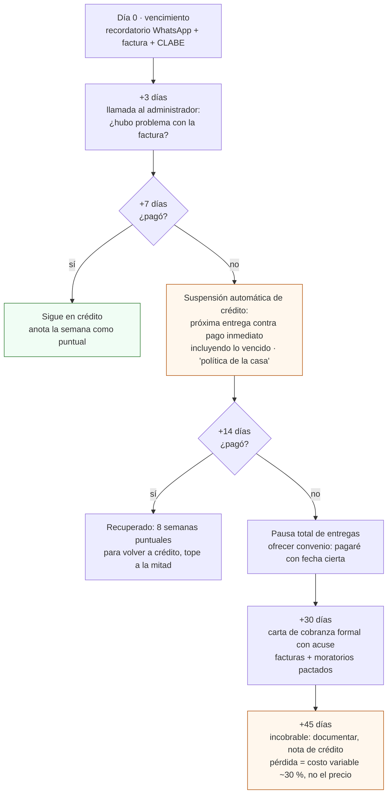

# Vender hierbas, cobrar y no perder producto

**En una línea:** en Fase 2 vendes dos productos (charola viva y hierbas por manojo) a 4–6
restaurantes más un segundo canal de hogares, con crédito solo ganado, remisión firmada en cada
entrega, protocolo de cobranza 7/14/45 y cadena de frío real — porque vender no es cobrar y el
producto cortado a 20–25 °C muere en menos de un día.

!!! info "Antes de empezar"
    - **Tiempo:** 2 h para la hoja de precios de hierbas y el acuerdo; 1.5–2 h/semana de ventas, WhatsApp y cobranza en régimen; 30 min los días 1–5 de cada mes para los REP · **Costo:** refrigerador usado ~$4,000 + hielera ~$1,300 cuando vendas cortado; seguro RC solo si entra hotel ([compras §6](compras.md)) · **Personas:** 1
    - **Necesitas:** hoja de precios actualizada ([guía](../../guias/hoja-de-precios.md)), machote de acuerdo de 1 página (abajo), talonario de remisiones en duplicado, facturador con plantilla PUE/PPD y leyenda 113-E, WhatsApp Business con catálogo, hielera 45–50 L + 4–6 gel packs, termómetro, `bitacora/ventas.csv`.
    - **Prerequisitos:** decisión fiscal tomada ([Antes de gastar un peso](../../empieza-aqui/antes-de-gastar-un-peso.md)); [Fase 0 · Vender a chefs](../fase-0/ventas.md); guías [Facturar CFDI](../../guias/facturar-cfdi.md), [Cobrar y suspender](../../guias/cobrar-y-suspender.md), [Ruta de reparto](../../guias/ruta-de-reparto.md), [Cosechar y empacar](../../guias/cosechar-y-empacar.md).

## 1. Qué vendes y a cuánto

| Producto | Precio defendible (2026) | Cómo se cotiza | Fuente |
|---|---|---|---|
| Charola viva girasol/chícharo | **$90–120 lista**; $70–80 con 4+/semana | Por charola 10 × 20 | [01 §7](../../referencia/01-proveedores-cdmx.md) |
| Charola viva finas (rábano, brócoli, amaranto, arúgula, albahaca micro) | **$130–180** | Por charola | ídem |
| Microgreens cortados (clamshell 100 g) | **$50–90** ($500–900/kg); menudeo $60–140 | Por clamshell; solo bajo pedido, entregado el día de corte | [research/mercado §4](../../research/mercado-precios.md) |
| **Hierbas NFT** (albahaca Nufar/genovesa, hierbabuena, cilantro) | **$20–35 por manojo o pieza, B2B premium** | **Por manojo o planta viva en canastilla, nunca por kilo**: la CEDA vende albahaca a ~$8–15/manojo aprox. y el súper a $15–25; se compite por frescura, consistencia y trazabilidad (dashboard 24/7), no por precio | [research/mercado §3–4](../../research/mercado-precios.md) |
| Arúgula NFT | $400–600/kg aprox. solo dentro de "mezclas del chef" | Por mezcla | ídem |
| Suscripción a hogares | 3 envases $260 · 5 $415 · 7 $560 por semana (benchmark MIJARDIIN, envío incluido) | Prepagada, semanal o quincenal, por WhatsApp | [research/mercado §1](../../research/mercado-precios.md) |

[POR VERIFICAR: precio de albahaca y arúgula en la nave de hortalizas de la CEDA (una mañana) y
el precio del vendedor de microgreens vivos del sur de CDMX en Mercado Libre (ficha MLM-625789531,
bloqueada al scraping) — son los dos números que faltan para cerrar la hoja de precios.]

Pedido mínimo sugerido a restaurante: **$350** (con entrega tercerizada de $29–60 la logística
no debe comer > 15 % del ticket). Ruta propia 2 días fijos (martes y viernes), ~$15–25 por
parada; [DiDi Entrega Light](https://dplnews.com/didi-lanza-servicio-de-entrega-para-pequenos-paquetes-desde-29-pesos-en-mexico/)
desde $29 para reposiciones ≤ 10 km y Uber Flash Moto (~$58 por 5 km) para urgencias.

## 2. Política de pago por fase (imprímela en la hoja de precios)

| Fase | Término | Mecánica | CFDI |
|---|---|---|---|
| Fase 0 | **Contado estricto**: SPEI al entregar o mismo día | Cero excepciones: validas que *pagan*, no que *quieren* | PUE al día |
| Fase 1 | **Cuenta semanal**: corte viernes, pago lunes–martes (máx. 7 días naturales) | Una remisión firmada por entrega, una factura semanal; recordatorio automático lunes 9 am | PUE si pagan en el mes; si cruza de mes sin pago → PPD |
| **Fase 1 tardía / Fase 2** | **Crédito 15 días SOLO ganado**: 8+ semanas de pago puntual | Tope = 2 semanas de pedidos ($2,000–4,000); nunca 2 facturas abiertas; opcional 2–3 % de descuento por pago a 7 días (se ofrece como premio, nunca como recargo) | PPD + REP |
| Cadenas / hoteles / comisariatos | 30 días solo con ticket > $8,000/mes y contrato firmado | Alta como proveedor, orden de compra, contrarrecibo | PPD + REP siempre |

**Reglas de oro** ([research/cobranza §2](../../research/cobranza-b2b.md)):

- Nunca crédito a un restaurante con < 6 meses operando (6 de cada 10 aperturas fracasan).
- **1 factura vencida > 7 días → la siguiente entrega solo de contado; 2 vencidas → pausa total.**
  El producto perecedero no se "recupera"; tu apalancamiento es la siguiente entrega.
- **Ningún cliente > 25–30 % de las ventas** y **ningún canal > 60 %**: el peor impago posible
  debe costar < $3,000 (≈ una semana de un cliente grande).
- Todo por SPEI a cuenta de negocio; efectivo solo en Fase 0 con recibo foliado. El historial
  bancario es tu evidencia.
- **Remisión firmada en CADA entrega**: sin firma de recepción no hay deuda demostrable. La
  factura CFDI sola no prueba el adeudo en juicio; remisión + acuerdo + estados de cuenta sí.

## 3. El acuerdo de suministro de 1 página (resumen del machote)

Se firma **con el administrador o dueño, nunca solo con el chef**, en cuanto un cliente pasa de
3 semanas comprando. Objetivo: un documento que firmen sin mandarlo al abogado. Machote completo
y notas de uso en [research/cobranza §4](../../research/cobranza-b2b.md) (esqueleto legal:
[contrato de suministro de milformatos](https://milformatos.com/contratos/contrato-de-suministro/), gratis).

| Cláusula | Qué fija |
|---|---|
| 1. Partes | Productor (RFC) y restaurante (razón social, RFC) representado por administrador/dueño |
| 2. Producto y pedido | "Fresh sheet" cada domingo 18:00 por WhatsApp; el cliente confirma a más tardar lunes 12:00; mínimo $400/semana; ±20 % sin renegociar |
| 3. Entrega | Martes y/o jueves 9:00–12:00; cosechado el mismo día o charola/canastilla viva; **remisión en duplicado firmada** por quien recibe |
| 4. Aceptación y rechazo | Inspección **al momento**; rechazo con causa se repone en 24 h o se descuenta; **nada de devoluciones después de la firma** (producto vivo). Es la cláusula que más pleitos evita |
| 5. Precio | Lista anexa; revisión trimestral con aviso de 14 días (o semestral por INPC) |
| 6. Pago | Factura semanal (corte viernes); SPEI a 7 días naturales a la CLABE; 2 % por pago ≤ 7 días; vencida → entregas contra pago inmediato; moratorio pactado 3–5 % mensual (sin pacto, el supletorio es 6 % ANUAL) |
| 7. Facturación | CFDI 4.0 con IVA 0 % (vegetales no industrializados); si RESICO-AGAPES, leyenda del art. 113-E noveno párrafo y sin retención del 1.25 % |
| 8. Vigencia | Indefinida; terminación con 14 días de aviso; sin exclusividad |

Adeudos ya generados > $5,000: convertir a **pagaré** ([formato gratuito](https://milformatos.com/empresas-y-negocios/el-pagare/)):
es título ejecutivo y permite juicio ejecutivo mercantil directo. [POR VERIFICAR: tope práctico
del interés moratorio pactado según jurisprudencia — 10 minutos de un abogado antes de firmar el primero.]

## 4. Protocolo de cobranza 7/14/45

Para tickets de $1,000–5,000 la vía judicial es disuasión, no plan de cobro: el plan es
suspensión cortés e inmediata + pagaré + tope de exposición de 2 semanas. En RESICO el ISR se
causa sobre lo **cobrado**: una factura PPD no cobrada no causa impuesto, pero tampoco es
ingreso ([guía Cobrar y suspender](../../guias/cobrar-y-suspender.md)).

**Señales de alerta** (en orden de gravedad; las ves gratis en cada entrega): pide más volumen
y más plazo a la vez · pagos parciales sin acuerdo o cambia de SPEI a efectivo · cambia la razón
social a facturar · rotación del administrador (re-valida el acuerdo la primera semana) · nómina
o renta atrasadas (los meseros lo cuentan) · menú recortado, horario reducido, salón vacío ·
restaurante con < 6 meses pidiendo crédito · "el de pagos no vino" dos semanas seguidas.

## 5. Facturar sin multas

- **PUE** solo si te pagan en el mismo mes de emisión. **PPD** para cualquier crédito que cruce de
  mes, y entonces **REP** (complemento de recepción de pagos) a más tardar el **día 5 natural** del
  mes siguiente al cobro; un solo REP mensual por cliente agrupando sus pagos basta (5 clientes =
  5 REP, 30 min). Multa por no emitirlo: **$22,300–127,530 por comprobante** (art. 83 fracc. VII CFF).
- Trampa clásica: facturar PUE "por comodidad" y cobrar el mes siguiente → carta invitación del SAT.
- CFDI 4.0 con **IVA tasa 0 %** (art. 2-A LIVA, vegetales no industrializados), clave `50404100`,
  unidad `H87` (pieza/charola/manojo) o `KGM`. Leyenda de exención 113-E si eres RESICO-AGAPES:
  sin ella, las personas morales retienen 1.25 %. [POR VERIFICAR con contador: número de la
  regla RMF 2026 de la excepción (¿3.13.26?).] Guía: [Facturar CFDI](../../guias/facturar-cfdi.md).
- Hoja de precios: "Precios con IVA 0 % — producto agrícola fresco".

## 6. Cadena de frío: refrigerador + hielera

Datos duros (mostaza, 2023; [research/puntos-ciegos §(e)](../../research/puntos-ciegos.md)):

| Temperatura de almacenamiento | Vida útil sensorial |
|---|---|
| **5 °C** | **14 días** |
| 10 °C | 4 días |
| 15 °C | 2 días |
| 20–25 °C (un patio en CDMX) | **< 1 día** |

1. **Producto cortado → refrigerador dedicado a 4–5 °C desde la primera hora** (usado, 9–11 ft³,
   ~$3,000–5,000 en ML). No el de la cocina: inocuidad, espacio y lo que ve el chef si visita.
   Suma 25–40 kWh/mes al cálculo DAC ([electrico-respaldo §A.3](electrico-respaldo.md)).
2. **La hielera basta para repartir, no para almacenar:** pre-enfría el producto a 5 °C la noche
   anterior; hielera rígida de 45–50 L con 4–6 gel packs congelados mantiene < 10 °C por 4–6 h,
   de sobra para una ruta de 2–4 h. Hielera limpia y **exclusiva** para producto; nunca junto a
   químicos o gasolina (NOM-251).
3. **Registra la temperatura a la entrega** en la bitácora (p. ej. "3.8 °C, sensor de la hielera")
   y en la remisión: es trazabilidad que ningún competidor encontrado ofrece y lo que respondes
   ante un chef si algo sale mal ([research/inocuidad §5](../../research/inocuidad-operativa.md)).
4. **Zona de corte separada del cultivo** (cortina plástica), mesa de acero inoxidable o
   polietileno, lavamanos con jabón y toallas desechables, etiqueta con lote, fecha de cosecha,
   "conservar de 1 a 4 °C" y "enjuagar antes de consumir" ([guía Cosechar y empacar](../../guias/cosechar-y-empacar.md)).
5. **La charola viva y la canastilla viva de albahaca evitan casi todo esto** — son el formato
   preferente y reducen el rechazo (5–10 % de entregas en los primeros 6 meses con producto
   cortado) casi a cero. El cortado solo bajo pedido, entregado el día de corte.

## 7. Segundo canal: hogares y Mercado el 100

- **Suscripción semanal a hogares** (modelo MIJARDIIN: 3 envases $260, 5 $415, 7 $560, envío
  incluido en zona centro; pedido por WhatsApp). **Prepagada**: es exactamente como el jugador
  establecido de CDMX evita el crédito. 10 hogares ≈ $10,000/mes brutos extra con la misma
  producción y desriesga la dependencia de 4–5 restaurantes ([01 §7](../../referencia/01-proveedores-cdmx.md)).
  Herramienta: WhatsApp Business con catálogo y lista de precios viva.
- **Mercado el 100** (Roma Sur, Plaza del Lanzador/Orizaba, domingos 9:30–14:00): primer mercado
  de productores con certificación orgánica participativa; Microverdes de la Ciudad ya vende
  ahí. Solicita ingreso vía [mercadoel100.org/contacto](https://mercadoel100.org/contacto/)
  [POR VERIFICAR: requisitos de ingreso no publicados; preguntar por correo]. Mientras llega el
  puesto, úsalo como cliente-vitrina (vender a puestos de preparados) y como punto de contacto
  con chefs que compran en persona. Tienda en línea: [tienda.mercadoel100.org](https://tienda.mercadoel100.org/).
- Otros: [Mercado Alternativo](https://mercadoalternativo.org/) (Tlalpan/Xochimilco + reparto),
  bares de coctelería (poco volumen, pagan premium, son vitrina), cafés de especialidad.
- **Estacionalidad:** modela enero–febrero con **−35 %** de ingreso y Semana Santa con −20 %; el
  colchón sale de noviembre–diciembre; muchos restaurantes de autor cierran del 24-dic al 6-ene
  ([07 §5](../../referencia/07-puntos-ciegos-y-riesgos.md)).
- **CAC real:** ~$650 out-of-pocket + 8–10 h por cliente cerrado; churn de 30–50 % anual de la
  cartera. Pide 1 referido a cada chef contento (baja el CAC ~70 %) y formaliza con el
  administrador ([07 §7](../../referencia/07-puntos-ciegos-y-riesgos.md)).

## 8. Seguro: cuándo sí y qué hacer mientras

- **RC de producto formal** ([GNP RC PyMEs](https://www.gnp.com.mx/seguro-de-danos-empresarial-de-responsabilidad-civil-pymes)
  o GMX, ~$3,000–8,000/año aprox., ~$500/mes): **solo cuando un cliente corporativo, hotel o
  comedor lo exija**, o al pasar de ~$25k/mes de ingreso. No está en ningún subtotal de compras.
- **Mientras, autoasegúrate:** fondo de reposición de **$500/mes hasta juntar $10,000** + inocuidad
  documentada (H2O2 en semilla y charolas, análisis anual de agua ~$800–1,500, lote y fecha en cada
  etiqueta, [mock recall V10](../../guias/mock-recall.md) en < 2 h).
- **Declara la actividad a la aseguradora de tu casa** ("agricultura urbana comercial en el
  domicilio"): el uso comercial no declarado puede rescindir la póliza ([07 §11](../../referencia/07-puntos-ciegos-y-riesgos.md)).
- **Aviso de Funcionamiento COFEPRIS** (gratuito, en línea) desde Fase 1: es lo primero que pide
  compras de un hotel ([guía](../../guias/aviso-cofepris.md)).

!!! warning "Errores típicos"
    - **Dar crédito para "no perder al cliente".** El que pide volumen y plazo a la vez te está usando de banco.
    - **Cobrarle al chef.** El cliente es el restaurante; el acuerdo lo firma quien paga.
    - **Facturar PUE y cobrar el mes siguiente**, o emitir el REP "cuando haya tiempo": la multa mínima son 2–3 meses de utilidad.
    - **Cortar albahaca a las 7 am y repartir a las 2 pm sin frío.** A 25 °C ya perdió el día.
    - **Un solo canal (restaurantes) al 100 %** entrando a enero.

## Al terminar

- [ ] Hoja de precios de Fase 2 con hierbas por manojo, política de pago y "IVA 0 %" impresa
- [ ] Acuerdo de 1 página firmado con cada cliente de 3+ semanas (administrador/dueño); talonario de remisiones en uso
- [ ] Plantilla de CFDI con leyenda 113-E (si aplica) y recordatorio de REP los días 1–5
- [ ] Refrigerador a 4–5 °C con termómetro; hielera exclusiva con 6 gel packs; temperatura de entrega en cada remisión
- [ ] WhatsApp Business con catálogo; primeros hogares suscritos; correo enviado a Mercado el 100
- [ ] Fondo de reposición abierto ($500/mes); aseguradora de casa notificada
- **Registrar:** `bitacora/ventas.csv` (`fecha,cliente,producto,cantidad,precio_unit_mxn,entregado_a_tiempo,feedback`) el mismo día; propuesta de `bitacora/cobranza.csv`: `factura,cliente,fecha_emision,fecha_vencimiento,fecha_cobro,monto,pue_ppd,rep_emitido,estado`.
- **Siguiente paso:** 3 meses de régimen medido y [Pasar el gate G2→3](gate.md).

## Fuentes

- [research/cobranza-b2b](../../research/cobranza-b2b.md) (política por fase, machote §4, señales de alerta, protocolo 7/14/45, PUE/PPD/REP, RESICO sobre lo cobrado)
- [research/mercado-precios](../../research/mercado-precios.md) y [01-proveedores §7](../../referencia/01-proveedores-cdmx.md) (precios, hierbas por manojo, suscripción, Mercado el 100, logística)
- [07-puntos ciegos §3, §5, §6, §7, §8, §11](../../referencia/07-puntos-ciegos-y-riesgos.md) y [research/puntos-ciegos §(c)–(e), §(i), §(k)](../../research/puntos-ciegos.md) (cadena de frío, estacionalidad, mermas, CAC, seguros)
- [research/inocuidad-operativa §4–5](../../research/inocuidad-operativa.md) (NOM-251, trazabilidad, temperatura a la entrega)
- [02-restricciones §3–4](../../referencia/02-restricciones-y-requisitos.md) (fiscal, COFEPRIS, seguro RC)
