# Comprar el equipo de la Fase 2 por bloques

**En una línea:** la lista exacta de [`bom/fase2.csv`](https://github.com/AndresIslas99/HomeGreen/blob/main/bom/fase2.csv)
agrupada en 8 bloques con el orden en que se compran (seguridad y respaldo primero, sondas al
final), tres escenarios de presupuesto y la lista de lo que **no** se compra aunque lo
recomiende un video.

!!! info "Antes de empezar"
    - **Tiempo:** 3 h de pedidos en línea + 1 mañana en Home Depot/tlapalería + 1 visita a Hydro Environment (Tlalnepantla, evita paquetería con el PVC y el tambo) · **Costo:** **$27,251** ([BOM](../../referencia/bom.md)) / $24,082 austero. No incluye lo que ya se pagó en la Fase 1 · **Personas:** 1
    - **Necesitas:** el resultado de [G1→2](../fase-1/gate.md) (Go), la lectura de EC/pH del agua de la llave en 3 días distintos (V7: decide si llenas con red filtrada, mezcla o lluvia), el recibo de CFE con el promedio anual de kWh, y 3 cotizaciones de electricista.
    - **Prerequisitos:** [Fase 1 · Compras](../fase-1/compras.md) (ya tienes gabinetes IP65, fuente 12 V, cerebro y tinaco); [Antes de gastar un peso](../../empieza-aqui/antes-de-gastar-un-peso.md).

## Reglas antes de pedir

1. **Compra las canastillas antes que la sierra copa.** El barreno se mide en el CUERPO de la
   canastilla, bajo el labio, y se prueba en un retazo. Una canastilla "de 2 pulgadas" pide
   44–48 mm, nunca 2" exactas (se cae). Con la de 3" del BOM, mide y compra **un solo
   diámetro** de sierra copa, no el kit de 9 piezas ([04-herramientas](../../referencia/04-herramientas.md)).
2. **Seguridad y respaldo antes que la primera línea.** El bloque "respaldo + seguridad" no es
   opcional ni se difiere: es la partida que evita perder el 100 % del NFT en una tarde y
   electrocutar a alguien con las manos mojadas ([03 §2.3](../../referencia/03-instalacion.md)).
3. **Sondas y peristálticas al final.** El NFT corre días en manual (medidor de mano) mientras
   afinas la dosificación; y el electrodo de pH caduca 12–18 meses aunque esté en su caja
   ([research/electrónica](../../research/electronica-automatizacion.md)).
4. **Nutriente genérico, no boutique.** Fórmula para hortalizas de Hydro Environment ($349/m³);
   al pasar de ~2 m³/mes, costal de 25 kg ($202/m³) o sales A/B (~$90–150/m³). Flora Series
   GHE cuesta 10–40× por m³ ([research/NFT](../../research/hidroponia-nft.md)).
5. **Aplica a Cosecha de Lluvia antes de pagar el Tláloc.** Si tu alcaldía califica, SEDEMA
   instala el sistema (~$20k) gratis; convocatoria enero–febrero, INE + CURP + comprobante ≤ 3
   meses + predial ([guía](../../guias/aplicar-cosecha-de-lluvia.md)). El Paquete Básico Tláloc
   ($5,300) se compra solo si no entras al programa.
6. **Lo hidráulico "raro" por Mercado Libre Full con vendedor 4.7★+** (diafragma 12 V,
   peristálticas, solenoides NC, tambo, hielera, refri usado); lo eléctrico verificado en
   Cyberpuerta y Home Depot; una sola visita a Hydro Environment por PVC-no, canastillas,
   foami, nutriente, bomba sumergible y filtro ([01-proveedores](../../referencia/01-proveedores-cdmx.md)).

## Orden de compra

```mermaid
flowchart LR
    A[Semana 1<br/>Seguridad eléctrica:<br/>electricista, GFCI, tierra, tapa in-use] --> B[Semana 1–2<br/>Respaldo DC:<br/>LiFePO4, cargador/EPEVER,<br/>2 bombas 12 V, UPS cerebro]
    B --> C[Semana 2–3<br/>NFT hidráulico:<br/>canastillas → sierra copa →<br/>PVC, tambo, filtro, manifold]
    C --> D[Semana 2–3<br/>Foami + semilla albahaca<br/>+ nutriente + dúplex anticloro]
    D --> E[Semana 4–6<br/>Automatización v2:<br/>PH-4502C, SEN0244, peristálticas,<br/>solenoides, YF-S201, ESP32-CAM]
    E --> F[Semana 4–6<br/>Calibración:<br/>buffers 4.01/6.86, EC 1.413]
    F --> G[Cuando vendas cortado<br/>Cadena de frío:<br/>refri 4–5 °C + hielera]
    G --> H[Etapa 2 · cuando el NFT facture<br/>DFRobot Gravity · Resh ·<br/>seguro RC si entra hotel]
    style A fill:#fff7ed,stroke:#b45309
    style B fill:#fff7ed,stroke:#b45309
    style H fill:#f0fdf4,stroke:#2e7d32
```

Es el orden de [03 §orden de compra](../../referencia/03-instalacion.md) ("PVC + bomba +
depósito → sondas y peristálticas al final") con la partida de continuidad eléctrica movida
al frente, como exige [03 §2.3](../../referencia/03-instalacion.md).

## Lista de compra

Precios en MXN al 12-sep-2026. **Estado:** `verificado` = ficha abierta ese día; `aprox.` =
visto en búsqueda o snippet (Mercado Libre bloqueó el acceso automatizado: confirma en el
navegador antes de pagar). Los renglones sin enlace se compran en tienda física.

=== "1 · NFT (8 líneas de 3 m)"

    | Artículo | Cant. | Precio unit. | Subtotal | Estado | Proveedor | Notas |
    |---|---|---|---|---|---|---|
    | [Tubo PVC **SANITARIO** 4" × 6 m Amanco blanco](https://www.homedepot.com.mx/p/amanco-wavin-tubo-sanitario-11-x-600-cm-blanco-amanco-942842-451963) | 4 | $415 | $1,660 | verificado | Home Depot MX | Medio tramo por línea. NO hidráulico C-40 ($1,401): el NFT corre sin presión; el blanco refleja calor |
    | [Codos 90°/45° + tapas + adaptadores de drenaje 4"](https://www.homedepot.com.mx/p/amanco-wavin-codo-pvc-4-513695-513695) | 1 lote | $600 | $600 | verificado | Home Depot MX | Codo 90° $28.80 · codo 45° $18.31 |
    | [Tubería de distribución ½"–¾" + retorno 2" + 8 válvulas de compuerta](https://www.homedepot.com.mx/b/plomeria/tuberias-y-conexiones/sanitarias) | 1 | $750 | $750 | aprox. | Home Depot / tlapalería | Una válvula por línea; caudal objetivo 1–2 L/min (botella de 1 L + cronómetro) |
    | [Canastilla hidropónica 3"](https://hydroenv.com.mx/producto/canastilla-hidroponica-de-3-pulgadas/) | 80 | $12.80 | $1,024 | verificado | Hydro Environment | 10 por línea. **Comprar ANTES de perforar**; medir el cuerpo bajo el labio |
    | [Sierra copa Truper COBI del diámetro medido + mandril](https://listado.mercadolibre.com.mx/truper-sierra-corta-circulos-bimetalica) | 1 | $300 | $300 | aprox. | Mercado Libre / Amazon MX | Un solo diámetro; se compra DESPUÉS de medir la canastilla |
    | [Bomba sumergible 4500 LPH](https://hydroenv.com.mx/producto/bomba-sumergible-4500-lph-para-hidroponia-y-estanques/) | 1 | $1,199 | $1,199 | verificado | Hydro Environment | 65 W ≈ $45/mes si corriera 24/7. En la arquitectura DC-first queda para **llenado, purga y trasiego**; la recirculación 24/7 la hacen las bombas de 12 V del bloque 5 |
    | [Filtro de malla 120 mesh 1"](https://hydroenv.com.mx/producto/filtro-de-malla-para-riego-de-1-pulgada-con-salida-y-entrada-tipo-macho/) | 1 | $230 | $230 | verificado | Hydro Environment | Entre la bomba y el manifold; lavar cada semana |
    | [Tambo HDPE 200 L grado alimenticio](https://listado.mercadolibre.com.mx/tambos-de-200-litros) | 1 | $700 | $700 | aprox. | Mercado Libre / Plastank | Depósito de solución: tapado, a la sombra, 18–22 °C; cambio completo cada 2–3 semanas |
    | [Semillero de foami agrícola 144 bloques 30 × 30 cm](https://hydroenv.com.mx/producto/semillero-de-foami-agricola-de-144-bloques-30x30-cm/) | 2 | $45.50 | $91 | verificado | Hydro Environment | $0.32/planta. NO peat pellets (sueltan turba y tapan la malla 120) |
    | | | **Subtotal NFT** | **$6,554** | | | Sistema NFT puro con nutriente y calibración: $7,200–8,700 ([research/NFT](../../research/hidroponia-nft.md)) |

    Herramienta del bloque ([04](../../referencia/04-herramientas.md)): cemento PVC 240 mL +
    limpiador + teflón (~$220), lima para desbarbar (~$60), nivel de 24" para la pendiente (ya
    de Fase 1).

=== "2 · Nutrición"

    | Artículo | Cant. | Precio unit. | Subtotal | Estado | Proveedor | Notas |
    |---|---|---|---|---|---|---|
    | [Solución nutritiva para hortalizas 1.5 kg (rinde 1,000 L)](https://hydroenv.com.mx/producto/solucion-nutritiva-para-hortalizas-de-1-5-kg-rinde-para-1000-litros/) | 2 | $349 | $698 | verificado | Hydro Environment | pH 6.2–6.3, CE 1.0–1.5 según ficha. Al pasar de 2 m³/mes: [costal 25 kg $3,359](https://hydroenv.com.mx/producto/solucion-nutritiva-para-hidroponia-hortalizas-en-costal-de-25-kg/) (~$202/m³) o sales A/B (~$90–150/m³) con [nitrato de calcio](https://hydroenv.com.mx/producto/nitrato-de-calcio-para-plantas-1-kg/) SIEMPRE en tanque B |
    | [AquAcid buffer pH− (para la peristáltica)](https://hydroenv.com.mx/producto/aquacid-buffer-para-bajar-ph-regulador-de-ph-para-hidroponia/) | 1 | $516 | $516 | verificado | Hydro Environment | Alternativa barata: ácido fosfórico o cítrico grado alimenticio |
    | | | **Subtotal nutrición** | **$1,214** | | | Gasto recurrente esperado con 1–2 m³/mes de reposición: $200–400/mes con genérico, $90–150 con sales |

=== "3 · Calibración"

    | Artículo | Cant. | Precio unit. | Subtotal | Estado | Proveedor | Notas |
    |---|---|---|---|---|---|---|
    | [Buffer pH 4.01, 120 mL](https://insumoscerveceros.mx/inicio/1305-solucion-para-calibracion-de-ph-buffer-401-120-ml.html) | 2 | $40 | $80 | verificado | Insumos Cerveceros (GDL, envían) | Calibración quincenal, evento en HA |
    | [Sobres de buffer 6.86](https://listado.mercadolibre.com.mx/solucion-buffer-para-calibrar-ph) | 10 | $15 | $150 | aprox. | Mercado Libre | El estándar de las sondas tipo DFRobot |
    | [Solución EC 1,413 µS/cm Hanna HI7031L, 500 mL](https://hannainst.com.mx/soluci%C3%B3n-de-calibraci%C3%B3n-de-ce-1-413-%C2%B5s-3-cm-valor-hi7031l) | 1 | $459.36 | $459 | verificado | Hanna Instruments México | Caduca a 5 años cerrada. Presupuesto anual de calibración + sonda de repuesto ≈ $1,050 |
    | | | **Subtotal calibración** | **$689** | | | |

=== "4 · Automatización v2"

    | Artículo | Cant. | Precio unit. | Subtotal | Estado | Proveedor | Notas |
    |---|---|---|---|---|---|---|
    | [Sonda pH económica PH-4502C + electrodo E201-BNC](https://uelectronics.com/producto/sensor-de-ph-liquido/) | 1 | $329 | $329 | aprox. | UNIT Electronics | **Etapa 1**: validar el lazo de control. Deriva más y dura menos, pero sirve |
    | [Sensor EC/TDS SEN0244](https://uelectronics.com/producto/sensor-tds-meter-v1-0-analogico-sen0244/) | 1 | $450 | $450 | aprox. | UNIT Electronics | Calibrar en mS/cm directo en ESPHome (TDS ≈ EC × 0.5–0.7); sonda en el RETORNO |
    | [Bomba peristáltica 12 V](https://listado.mercadolibre.com.mx/bomba-peristaltica-12v) | 4 | $225 | $900 | aprox. | Mercado Libre | A + B + pH− + 1 repuesto; la manguera interna es consumible |
    | [Válvula solenoide 12 V ½" NC](https://listado.mercadolibre.com.mx/valvula-solenoide-12v-1-2) | 2 | $200 | $400 | aprox. | Mercado Libre / UNIT | Llenado y purga. **NC**: un corte de luz no vacía el tinaco |
    | [ESP32-CAM OV2640 V3 USB-C](https://uelectronics.com/producto/esp32-cam-ov2640-v3-con-interfaz-tipo-c/) | 1 | $260 | $260 | aprox. | UNIT Electronics | Timelapse, inspección remota y detección de movimiento nocturno |
    | [Sensor de flujo YF-S201](https://listado.mercadolibre.com.mx/sensor-de-flujo-de-agua-yf-s201) | 1 | $110 | $110 | aprox. | Tecneu / ML | Watchdog "bomba ON y sin flujo" (≈ 450 pulsos/L) |
    | [Medidor pH + TDS/EC de mano (árbitro de las sondas)](https://listado.mercadolibre.com.mx/medidor-ph-tds-ec) | 1 | $450 | $450 | aprox. | Mercado Libre | Con él operas en manual las primeras semanas. Hanna HI98130 (~$4–6k) solo cuando las hierbas facturen > $6k/mes |
    | [Kit pH DFRobot Gravity — **etapa 2, no ahora**](https://www.geekfactory.mx/producto/kit-sensor-de-ph-para-arduino-gravity-dfrobot/) | 1 | $1,250 | ($1,250) | aprox. | Geek Factory | Se compra cuando el NFT venda. El electrodo caduca 12–18 meses aunque no se use; reemplazo anual ~$400–600 |
    | | | **Subtotal automatización (sin DFRobot)** | **$2,899** | | | El ESP32 DevKit, MOSFETs, relé de 2 canales y gabinete IP65 del nodo vienen del pedido a UNIT / AG de [Fase 1](../fase-1/compras.md); el monitor comercial equivalente (GroLine HI981420) cuesta $15,669 |

=== "5 · Respaldo DC + seguridad eléctrica"

    | Artículo | Cant. | Precio unit. | Subtotal | Estado | Proveedor | Notas |
    |---|---|---|---|---|---|---|
    | [Batería LiFePO4 12.8 V 100 Ah Epcom LI100A12PRO](https://www.cyberpuerta.mx/index.php?cl=search&searchparam=bateria+LiFePO4) | 1 | $4,459 | $4,459 | verificado | Cyberpuerta | 28–30 h de recirculación continua; ~2.5 días en modo 15/15. Entrega a CDMX 3–7 días |
    | [Bomba de diafragma 12 V 40–60 W (principal + respaldo)](https://listado.mercadolibre.com.mx/bomba-diafragma-12v) | 2 | $650 | $1,300 | aprox. | Mercado Libre | **La bomba NFT 24/7 es de 12 V** colgada del bus de batería; el par cuesta menos que un inversor senoidal |
    | [Controlador solar EPEVER LS2024B (hace de cargador)](https://www.cyberpuerta.mx/index.php?cl=search&searchparam=controlador+de+carga+solar) | 1 | $599 | $599 | verificado | Cyberpuerta | Perfil LiFePO4 configurable. Sin panel: [cargador LiFePO4 14.6 V 10–20 A](https://listado.mercadolibre.com.mx/cargador-lifepo4-14.6v-10a) ~$700–1,400 aprox. |
    | [Panel solar 100 W Ugreen 15113 (opcional recomendado)](https://www.cyberpuerta.mx/index.php?cl=search&searchparam=panel+solar+100W) | 1 | $1,049 | $1,049 | verificado | Cyberpuerta | + $158 de envío. Flota la batería sin CFE; corte diurno = sostenible indefinido. **No corre el huerto**: 450–500 Wh/día contra 960 Wh/día de la bomba |
    | [UPS DataShield DS-600 (router + cerebro)](https://www.cyberpuerta.mx/index.php?cl=search&searchparam=DataShield+UPS) | 1 | $1,189 | $1,189 | verificado | Cyberpuerta | 45–90 min con Pi + módem: sin internet no hay alarmas. El KS800PRO ($1,859) trae puerto para la integración NUT |
    | [Breaker GFCI Square D QO120GFI (circuito del patio)](https://www.homedepot.com.mx/s/interruptor%20falla%20a%20tierra) | 1 | $1,159 | $1,159 | verificado | Home Depot MX | Protege TODO el circuito exterior desde el centro de carga. Mínimo aceptable: [contacto GFCI Square D $389](https://www.homedepot.com.mx/s/gfci) aguas arriba de todo |
    | [Tapa intemperie tipo in-use + varilla copperweld 5/8" × 3 m + cable cal. 8](https://www.homedepot.com.mx/s/tapa%20intemperie) | 1 | $900 | $900 | aprox. | Home Depot / tlapalería | NOM-001-SEDE: patio = lugar mojado; tierra ≤ 25 Ω medidos |
    | Electricista certificado (GFCI + tierra + contacto exterior) | 1 | $2,500 | $2,500 | aprox. | Local, 3 cotizaciones | Medio día a un día, llave en mano $1,500–3,500. Pide que deje ≤ 25 Ω medidos con telurómetro |
    | | | **Subtotal respaldo + seguridad** | **$13,155** | | | Rango del informe: $8,500–11,000 mínimo, $11,000–14,500 con solar ([research/eléctrico §6](../../research/electrico-respaldo-seguridad.md)). Fusiblera 12 V, seccionador y gabinete DC: ~$500–900 aprox. en ML/tlapalería (no en el CSV) |

    !!! tip "Variante austera de arranque (cortes ≤ 7 h): ≈ $2,500–2,900"
        [Steren BR-1224 12 V 24 Ah $1,290](https://www.steren.com.mx/catalogsearch/result/?q=bateria+sellada) +
        [cargador BR-700 $406–495](https://www.steren.com.mx/catalogsearch/result/?q=cargador+de+bateria+12v) +
        1 bomba de diafragma 12 V (~$500) + contacto GFCI Estevez ($239). Ampliable a la LiFePO4
        de 100 Ah sin tirar nada. Sustituye a batería + EPEVER + panel + 1 bomba + breaker de la tabla.

=== "6 · Cadena de frío"

    | Artículo | Cant. | Precio unit. | Subtotal | Estado | Proveedor | Notas |
    |---|---|---|---|---|---|---|
    | [Refrigerador usado 9–11 ft³ (producto cortado a 4–5 °C)](https://listado.mercadolibre.com.mx/refrigerador-usado) | 1 | $4,000 | $4,000 | aprox. | Mercado Libre | Cortado a 20–25 °C dura < 1 día; a 5 °C, 14 días. Dedicado, no el de la cocina. Suma 25–40 kWh/mes al cálculo DAC |
    | [Hielera rígida 45–50 L + 6 gel packs (reparto)](https://listado.mercadolibre.com.mx/hielera-45-litros) | 1 | $1,300 | $1,300 | aprox. | ML / Home Depot | Pre-enfriar el producto la noche anterior; < 10 °C por 4–6 h |
    | | | **Subtotal frío** | **$5,300** | | | Se compra cuando vendas producto cortado; la charola viva y la canastilla viva evitan casi todo esto |

=== "7 · Agua (Isla Urbana + anticloro)"

    | Artículo | Cant. | Precio unit. | Subtotal | Estado | Proveedor | Notas |
    |---|---|---|---|---|---|---|
    | [Paquete Básico Tláloc (tlaloque + filtro de hojas + axolote)](https://islaurbana.mx/product/paquete-basico-tlaloc/) | 1 | $5,300 | $5,300 | verificado | Isla Urbana (Coyoacán, tel. 55 5446-4831) | Reemplaza el separador casero de Fase 1. **GRATIS** si entras a Cosecha de Lluvia SEDEMA: aplica primero |
    | [Dúplex sedimento 5 µm + carbón activado 10"](https://www.agualimpia.mx/collections/filtro-para-sedimento-y-carbon-activado) | 1 | $1,000 | $1,000 | aprox. | Agua Limpia / ML | Solo en la línea que llena el tambo NFT (quita el cloro de red, 0.2–1.5 mg/L, que daña raíces). Cartuchos cada 4–6 meses |
    | | | **Subtotal agua** | **$6,300** | | | $1,000 si el Tláloc lo pone SEDEMA |

=== "8 · Semilla de albahaca y libro"

    | Artículo | Cant. | Precio unit. | Subtotal | Estado | Proveedor | Notas |
    |---|---|---|---|---|---|---|
    | [Albahaca Nufar orgánica (resistente a fusarium), 1 oz](https://hydrocultura.com/products/nufar-semillas-organicas-de-albahaca) | 1 | $549 | $549 | verificado | Hydrocultura (tel. 55 9435-6905) | ~20,000 semillas. **Agotada al 12-sep-2026**: vigilar reabasto; es la variedad principal del NFT porque un brote de fusarium contamina todo el sistema recirculante |
    | [Albahaca Genovese (sobre 100) + Italian Large Leaf (3 g)](https://semillasisla.mx/products/albahaca-genovese) | 1 | $95 | $95 | verificado | Semillas ISLA / Hydroenv | Diversificar; morada y limón como línea premium para coctelería |
    | [*Cultivos hidropónicos*, Resh, 5.ª ed. en español](https://latam.casadellibro.com/libro-cultivos-hidroponicos-5-ed-suelo-para-tecnicos-y-agricultores-profesionales-asi-como-para-los/9788484760054/796153) | 1 | $899 | $899 | verificado | Casa del Libro | Con ingresos de Fase 1: el porqué de las bandas de pH/EC. "Últimas unidades"; plan B Buscalibre $1,088 |
    | | | **Subtotal semilla + libro** | **$1,543** | | | Hierbabuena, cilantro y arúgula: sobres de ISLA/Hydrocultura solo cuando un chef las pida |

    !!! warning "Seguro RC de producto: no está en ningún subtotal"
        [RC PyMEs con RC de productos (GNP / GMX)](https://www.gnp.com.mx/seguro-de-danos-empresarial-de-responsabilidad-civil-pymes)
        ~$500/mes (≈ $3,000–8,000/año aprox.) **solo si entra un cliente corporativo u hotel** que
        lo exija, o al pasar de ~$25k/mes de ingreso. Mientras: fondo de reposición de $500/mes
        hasta juntar $10k + inocuidad documentada ([clientes y cobranza §8](clientes-y-cobranza.md)).

## Tres escenarios de presupuesto

Sumas de los bloques de arriba (sin la ampliación del túnel, que se cotiza aparte):

| Escenario | Qué incluye | Total aprox. |
|---|---|---|
| **Recomendado (día 1)** | Bloques 1–8 con LiFePO4 100 Ah, EPEVER + panel, breaker QO120GFI, refri, Tláloc y Resh; sin DFRobot etapa 2 ni seguro | **≈ $37,650** |
| **Completo** | Recomendado + kit DFRobot Gravity ($1,250, etapa 2) | $28,501 |
| **Austero de arranque** | Recomendado con: variante AGM 24 Ah + BR-700 + 1 bomba + contacto GFCI en vez de LiFePO4/EPEVER/panel/2.ª bomba/breaker; sin refri hasta vender cortado; sin Resh | ≈ $26,800 (≈ $21,500 si SEDEMA pone el Tláloc) |

[POR VERIFICAR: la fila TOTAL de `bom/fase2.csv` estima ~$34,000 "sin seguro ni DFRobot etapa 2
ni panel solar"; la suma por bloques de esta página con esas tres exclusiones da ≈ $36,600.
Revisar en el CSV qué otra partida excluye esa cifra y alinear las dos antes del Go.]

Comparación útil: el paquete comercial de Hydro Environment de solo 5 ductos y 25 plantas
cuesta $5,779; el DIY de 8 líneas y 80 sitios cuesta $7,200–8,700 (3× la capacidad por precio
similar) ([research/NFT](../../research/hidroponia-nft.md)).

## Qué NO comprar (aunque lo recomiende un video o un vendedor)

| No compres | Por qué | Qué va en su lugar |
|---|---|---|
| **Flora Series GHE** (trío $1,600 trial / $3,300 galón) | $1,300–8,000 por m³ de solución: 10–40× el genérico. Es producto de autocultivo boutique | Fórmula hortalizas Hydroenv $349/m³ → costal $202/m³ → sales A/B $90–150/m³ |
| **Tubo PVC hidráulico cédula 40** 4" ($1,401/tramo) | Pared para 15.4 kg/cm² de presión; el NFT corre a presión cero. 3.4× el precio | Tubo **sanitario** Amanco 4" blanco $415/tramo |
| **Bomba periférica 0.5 HP como bomba principal** (IUSA $599, Evans $799) | 370–450 W reales las 24 h ≈ 324 kWh/mes: te reclasifica a **DAC** ella sola (~$2,600/mes de recibo); ~55–65 dB de noche; respaldarla exige ~680 Ah de batería (> $30k) | Diafragma 12 V 40–60 W ×2 en el bus de batería; sumergible 65 W para llenado/purga/trasiego (una periférica solo tiene sentido para trasiego cisterna→tinaco o el goteo presurizado de Fase 3) |
| **Kit pH DFRobot Gravity antes de tiempo** ($1,250) | El electrodo caduca 12–18 meses aunque no se use | PH-4502C ($329) para validar el lazo; DFRobot cuando el NFT venda |
| **Hanna HI98130 de mano** (~$4–6k) o **GroLine HI981420** ($15,669) | El stack ESP32 + sondas (~$2–3k) queda validado como decisión económica | Medidor de mano genérico ($450) como árbitro; Hanna solo con hierbas facturando > $6k/mes |
| **UPS de PC o inversor para la bomba** (Forza $939, APC $1,689, Steren INV-1500 $2,842) | Con bomba de 450 W dura 4–8 min y ni arranca el motor; los inversores Steren son de onda modificada | DC-first: batería siempre en paralelo, bomba de 12 V, cero conmutación |
| **Peat pellets (Jiffy) o lana de roca Grodan para germinar** | La turba tapa la malla 120; la lana importada cuesta 5–20× por planta y solo paga en cultivos largos (jitomate) | Foami agrícola 144 bloques $45.50 ($0.32/planta); cilindro 4.3 × 5 cm $2.90 para la canastilla de 3" |
| **Canaleta MGS profesional de Hydrocultura** (por cotización) | Solo se justifica con > 20 líneas o si sale < $700/línea instalada | Pide la cotización por escrito (55 9435-6905) para la ampliación; no detengas la fase por ella |
| **Chícharo a $340/kg de Hydroenv** (sigue vigente desde Fase 0) | $93.50 de semilla por charola: pierde dinero a cualquier precio ≤ $98 | Arvejón grado alimento de la CEDA validado con V1 ([08](../../referencia/08-recetas-y-economia-unitaria.md)) |

!!! warning "Errores típicos"
    - **Perforar con la sierra copa "de 3 pulgadas" sin medir la canastilla.** 80 hoyos
      grandes = 80 canastillas al fondo del tubo. Mide, prueba en un retazo, luego compra la sierra.
    - **Comprar el respaldo "después, cuando haya dinero".** El primer corte de CFE de 1–8 h
      (3–6 al año en CDMX) llega antes que el dinero.
    - **Pagar el Tláloc en enero sin haber mandado el correo a SEDEMA.** La convocatoria es
      enero–febrero y el hardware vale ~$20k.
    - **Llenar el tambo con agua de la llave sin el dúplex anticloro** ni haber medido su EC
      (oriente/sur de CDMX: hasta 0.6–2.5 mS/cm, mala para NFT — [02 §2](../../referencia/02-restricciones-y-requisitos.md)).

## Al terminar

- [ ] Electricista contratado con fecha y alcance escrito (GFCI, tierra ≤ 25 Ω, contacto in-use)
- [ ] Batería, cargador/EPEVER, 2 bombas de 12 V y UPS pedidos; fusiblera y seccionador en la lista de la tlapalería
- [ ] 80 canastillas en mano y diámetro del cuerpo medido y anotado (mm) antes de pedir la sierra copa
- [ ] PVC, tambo, filtro, manifold y foami recogidos; nutriente y AquAcid en anaquel separado y etiquetado
- [ ] Semilla Nufar: pedido o alerta de reabasto puesta; Genovese/ILL como respaldo
- [ ] Correo a programascall@sedema.cdmx.gob.mx enviado (o Tláloc comprado si tu alcaldía no califica)
- **Registrar:** cada compra en `bitacora/compras.csv` con fecha, proveedor, monto y número de pedido (sirve para deducir y para el mock recall de insumos).
- **Siguiente paso:** [Dejar la electricidad segura y con respaldo](electrico-respaldo.md).

## Fuentes

- [`bom/fase2.csv`](https://github.com/AndresIslas99/HomeGreen/blob/main/bom/fase2.csv) (todos los renglones, precios y estados)
- [01-proveedores §3, §4, §5, §6c](../../referencia/01-proveedores-cdmx.md) · [03-instalación §2 y orden de compra](../../referencia/03-instalacion.md) · [04-herramientas §Fase 2](../../referencia/04-herramientas.md)
- [research/hidroponia-nft](../../research/hidroponia-nft.md) (PVC sanitario vs C-40, bombas, nutrientes por m³, foami, calibración, costo total)
- [research/electrico-respaldo-seguridad](../../research/electrico-respaldo-seguridad.md) (BOM del respaldo, variante austera, GFCI/tierra, electricista)
- [research/electronica-automatizacion](../../research/electronica-automatizacion.md) (pH en dos etapas, peristálticas, solenoides NC, ESP32-CAM)
- [research/agua-captacion](../../research/agua-captacion.md) (Isla Urbana, dúplex anticloro, Cosecha de Lluvia)
- [07-puntos ciegos §1, §3, §11](../../referencia/07-puntos-ciegos-y-riesgos.md) (DAC, cadena de frío, seguros)
