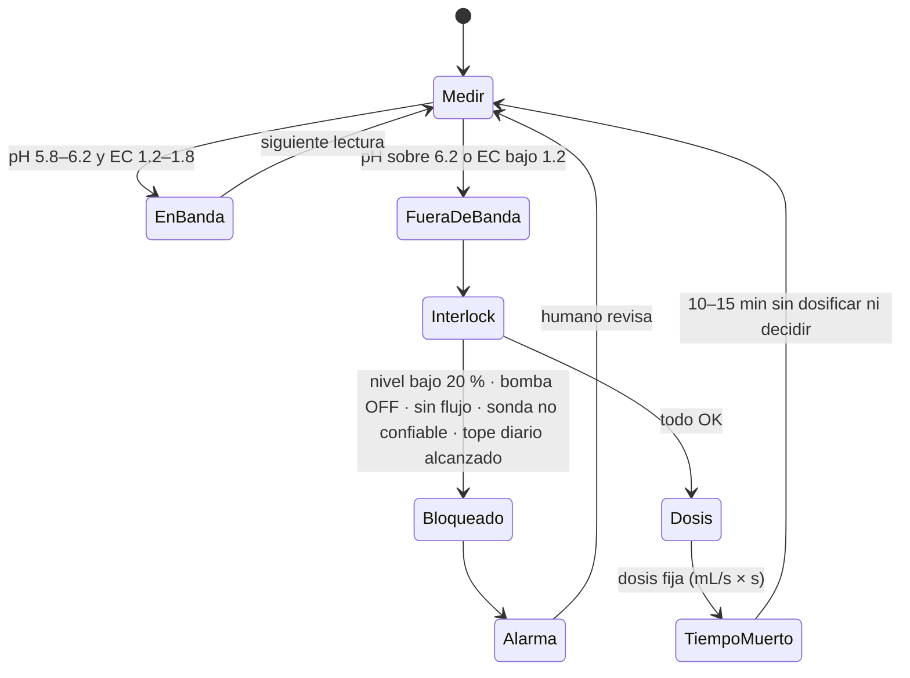

# Dosificar pH y EC automáticamente (nodo NFT v2)

**En una línea:** un ESP32 lee pH y EC en el retorno, dosifica con tres peristálticas al tambo
en dosis fijas pequeñas con 10–15 min de tiempo muerto, se bloquea si el nivel es bajo o la
bomba está apagada, y tú calibras las sondas cada quince días y cambias la solución cada 2–3
semanas — porque una sonda sin calibrar es un generador de números aleatorios.

!!! info "Antes de empezar"
    - **Tiempo:** 1 tarde de banco de pruebas + 1 tarde de instalación en el gabinete + 3 días de dry-run con agua · **Costo:** $2,899 automatización etapa 1 + $689 calibración + $1,214 nutrición ([compras §2–4](compras.md)); ~$1,050/año de calibración y sonda de repuesto · **Personas:** 1
    - **Necesitas:** ESP32 DevKit, placa pH PH-4502C + electrodo E201-BNC, SEN0244, DS18B20, YF-S201, 4 peristálticas 12 V, 2 solenoides ½" NC, MOSFETs de nivel lógico (IRLZ44N o módulo D4184), relé 2 canales, resistencias 1 kΩ / capacitores 100 nF (filtro RC por ADC), gabinete IP65 GAB-2 con prensaestopas, buffers 4.01/6.86, patrón EC 1.413 mS/cm, medidor de mano, jarra graduada, 2 botes para A y B, AquAcid.
    - **Prerequisitos:** [NFT construido y con 48 h de agua](nft.md); [Flashear ESPHome](../../guias/flashear-esphome.md); [Configurar Home Assistant](../../guias/configurar-home-assistant.md); tabla de pines en [software/firmware](../../software/firmware.md).

## El hardware

| Señal | Pin ESP32 | Componente | Notas |
|---|---|---|---|
| pH | GPIO34 (ADC1_6) | Placa PH-4502C, electrodo E201 por BNC | Electrodo en el **retorno**; filtro RC 1 kΩ / 100 nF |
| EC/TDS | GPIO35 (ADC1_7) | SEN0244 | Calibrar en mS/cm directo en ESPHome; en el retorno |
| Voltaje de batería | GPIO36 (ADC1_0) | Divisor 47k/10k (×5.7 en firmware) | 14.6 V → 2.56 V; alimenta el modo ahorro |
| Temperatura de solución | GPIO4 (1-Wire) | DS18B20 sumergido en el tambo | Compensación de pH/EC y alarma > 25 °C |
| Flujo | GPIO27 (pulsos) | YF-S201 (≈ 450 pulsos/L) tras la bomba | Salida Hall a 5 V con divisor 10k/20k |
| Red CFE presente | GPIO23 (INPUT_PULLDOWN) | Cargador USB del patio → optoacoplador | 127 V presente → GPIO23 = 1 |
| Peristáltica A / B / pH− | GPIO25 / GPIO26 / GPIO33 | MOSFET de nivel lógico ×3 | Dosifican al tambo, junto a la succión |
| Solenoide llenado / purga | GPIO12 / GPIO13 | MOSFET ×2, válvulas ½" NC | **GPIO12 es pin de arranque: pull-down obligatorio** |
| K1 bomba principal | GPIO32 | Relé por contacto **NC** | Sin ESP32 o GPIO32 = 0 → bomba ON (fail-safe físico) |
| K2 bomba respaldo | GPIO14 | Relé por contacto NO | GPIO14 = 1 → respaldo ON. Va en GPIO14 porque ese pin emite un pulso al arrancar el ESP32: en el respaldo es un parpadeo, en la principal sería un corte |

GPIO34/35/36 son solo entrada. El nodo se alimenta del bus de batería (fusible F3 de 2 A) vía
buck a 5 V ([alimentación](../../assets/diagramas/electrico/alimentacion-esp32.svg)), así sigue
reportando durante un corte. [POR VERIFICAR: el YAML del informe
([research/eléctrico §5](../../research/electrico-respaldo-seguridad.md)) usa GPIO25/33 para las
bombas, GPIO26 para la red y GPIO34 para la batería; `firmware/esphome/nodo-nft-v2.yaml` debe
seguir la tabla de arriba, que es la del esquema.]

## Pasos

### A. Banco de pruebas (antes del gabinete)

1. **Arma todo en la mesa** con una cubeta de agua: ESP32, placas, MOSFETs, relés, una
   peristáltica y el YF-S201 en un tramo de manguera. Flashea por USB la primera vez
   ([guía](../../guias/flashear-esphome.md)); después todo es OTA. *Criterio de listo:* HA muestra
   pH, EC, temperatura, flujo, voltaje y "red CFE" con valores que cambian al tocar cada sensor.
2. **Calibra las sondas por primera vez** ([guía completa](../../guias/calibrar-sondas-ph-ec.md)):
   pH a 2 puntos con buffers **4.01 y 6.86** (enjuagar con agua destilada entre buffers, nunca
   secar frotando), EC con patrón **1.413 mS/cm**, ambos a temperatura conocida. Contrasta con el
   medidor de mano. *Criterio:* la sonda fija y el de mano difieren ≤ 0.1 pH y ≤ 0.1 mS/cm.
3. **Calibra las peristálticas en mL/s:** 30 s de bombeo a una jarra graduada, 3 veces por
   bomba; anota mL/s de A, B y pH− en el YAML. Sin este número la "dosis fija" es una adivinanza.
4. **Prueba el fail-safe:** con la bomba conectada por K1 (NC), desconecta el ESP32 → la bomba
   debe seguir; reinicia el ESP32 → `restore_mode: RESTORE_DEFAULT_ON` la deja encendida.

### B. Instalar en campo

5. **Sondas en el RETORNO**, dentro del tambo en la boca donde cae la solución mezclada, nunca
   junto a la salida de las peristálticas ni en una línea. El DS18B20 sumergido al lado. Cables
   con el conector hacia arriba, encintados y por prensaestopa: los sensores mueren por
   corrosión del conector, no del sensor ([03 §1.3](../../referencia/03-instalacion.md)).
6. **Peristálticas al tambo, junto a la succión de la bomba** para que mezclen rápido; nunca
   directo a una línea. **A y B en botes separados**: el nitrato de calcio (B) precipita con
   fosfatos y sulfatos (A). pH− (AquAcid o ácido fosfórico grado alimenticio) en bote propio,
   etiquetado, en anaquel aparte de los sanitizantes ([guía de solución](../../guias/preparar-solucion-nutritiva.md)).
7. **Solenoides NC** en el llenado (tinaco → dúplex → SV-1 → tambo) y en la purga (SV-2 → coladera):
   sin luz quedan cerradas y no vacían el tinaco. El YF-S201 va después del filtro y antes del
   manifold. Electrónica en GAB-2 IP65 ([guía](../../guias/montar-gabinete-ip65.md)); bus 12 V y 127 V en gabinetes separados.

### C. La lógica (L0: histéresis con tiempo muerto, sin PID)

8. **Bandas** ([06 §L0](../../referencia/06-validacion-y-lazos-agenticos.md)): pH **5.8–6.2**;
   EC **1.2–1.8 mS/cm** según cultivo (la ficha del nutriente genérico indica CE 1.0–1.5 y pH
   6.2–6.3: arranca abajo de la banda y sube con datos de tus plantas; el porqué está en Resh).
   Temperatura de solución 18–22 °C, alarma > 25 °C.
9. **Regla de dosificación:** fuera de banda → **una dosis fija pequeña** → esperar **10–15 min**
   de mezcla sin dosificar ni decidir → re-medir → decidir otra vez. Nunca dosificación continua:
   sin tiempo muerto el lazo oscila y sobredosifica. pH alto → pH−; EC baja → A y B en la misma
   proporción (mismos mL). Regla de diseño propuesta para el tamaño de la dosis (ajústala en el
   dry-run): la que mueve el pH ≤ 0.1 unidad o la EC ≤ 0.1 mS/cm en 200 L.
10. **Interlocks (bloquean la dosis y, en su caso, la bomba):** nivel del tambo < 20 %; bomba
    comandada OFF; flujo < 2 L/min con bomba ON (línea rota o bomba tapada: no dosifiques a un
    sistema que no mezcla); sonda marcada "no confiable"; tope diario de mL por bomba alcanzado.
11. **Watchdogs** ([06 §L0](../../referencia/06-validacion-y-lazos-agenticos.md)): bomba ON y
    flujo < 2 L/min 60 s → alarma crítica, arranca P-2 y se apaga P-1 (protege la bomba en seco);
    pH o EC sin cambio en 24 h con dosis hechas, o salto > 1.5 unidades en 5 min → sensor "no
    confiable", dosificación automática suspendida, alarma (las sondas baratas fallan *mintiendo*,
    no callando); mL dosificados/día > 2× el promedio móvil de 7 días → alarma (fuga, sonda
    mintiendo o depósito contaminado); nodo sin heartbeat 10 min → alarma. YAML base en
    [`firmware/homeassistant/automations.yaml`](https://github.com/AndresIslas99/HomeGreen/blob/main/firmware/homeassistant/automations.yaml)
    y [software/home-assistant](../../software/home-assistant.md).

### D. Dry-run de dosificación con agua (commissioning)

12. Tambo con agua filtrada, sin plantas. Fuerza pH alto (agua de llave suele estar > 7) y EC
    baja: el lazo debe dosificar pH− y A/B en dosis, esperar, re-medir y converger a banda en
    unas horas sin rebasarla. Anota la curva (HA la grafica). *Criterio:* pH baja y EC sube según
    lo esperado, sin oscilación, y ninguna dosis fuera del tiempo muerto.
13. **Dispara cada interlock a propósito:** baja el nivel < 20 %, apaga la bomba, desconecta el
    electrodo (lectura fija → "no confiable" en 24 h; para acelerar, simula con un valor
    constante en HA), cierra el manifold (sin flujo). *Criterio:* 100 % de los interlocks
    bloquearon la dosis y llegó la alarma al teléfono.
14. Solo entonces: purga, solución nueva, plantas.

### E. Rutina en régimen

| Cada | Qué | Registro |
|---|---|---|
| Día | Panel de excepciones: pH/EC fuera de banda, mL/día, temperatura, flujo | `bitacora/nft.csv` solo si hubo excepción |
| Semana | Lavar filtro malla 120; revisar mangueras de peristálticas (son consumibles) y nivel de A/B/pH− | `bitacora/nft.csv` |
| **Quincena** | **Calibrar pH (4.01/6.86) y EC (1.413)** — evento en el calendario de HA con alarma; contrastar con el medidor de mano | `calibracion` con offset/pendiente |
| **2–3 semanas** | **Cambio completo de solución**: purga a coladera, lavado del tambo, relleno con lluvia/filtrada, solución nueva ([guía](../../guias/cambiar-solucion-nft.md)). Los micronutrientes se desbalancean aunque la EC "se vea bien" | `cambio_solucion`, litros, lote de nutriente |
| Relleno entre cambios | Solo con agua de lluvia o filtrada; el lazo repone EC | `relleno`, litros |
| Año | Electrodo de pH nuevo (~$400–600); cartuchos del dúplex cada 4–6 meses | `bitacora/compras.csv` |

Presupuesto honesto: **~$1,050/año** (2 buffers 4.01 $80 + sobres 6.86 ~$100 + EC 1413 $459 +
sonda ~$400), no los $400 del plan original ([06 §resumen operativo](../../referencia/06-validacion-y-lazos-agenticos.md)).

!!! warning "Errores típicos"
    - **Dosificar a una línea o cerca de la sonda:** picos falsos y oscilación.
    - **Calibrar "cuando se vea raro":** la deriva es lenta e invisible; quincenal en calendario.
    - **A y B en el mismo bote:** precipita el calcio y el bote se vuelve lodo blanco.
    - **Guardar el kit DFRobot "para después":** el electrodo caduca 12–18 meses aunque no se use; se compra cuando el NFT venda ([compras](compras.md)).
    - **Confiar en la EC para saber si la solución está bien:** la EC suma sales, no dice cuáles. Cambio completo cada 2–3 semanas.

## Al terminar

- [ ] Nodo v2 en GAB-2 reportando pH, EC, T, flujo, V_bat y red CFE; fail-safe de K1 probado sin ESP32
- [ ] Sondas calibradas (offset y pendiente anotados) y contrastadas con el medidor de mano ≤ 0.1
- [ ] mL/s de las 3 peristálticas en el YAML; dosis fija elegida con el dry-run
- [ ] Dry-run con agua: convergencia sin oscilación y 100 % de interlocks disparados con alarma
- [ ] Evento quincenal de calibración y evento de cambio de solución en el calendario de HA
- **Registrar:** primera fila de `bitacora/nft.csv` con `evento=dry_run_dosificacion` y la curva exportada de HA adjunta al commit.
- **Siguiente paso:** [Vender hierbas, cobrar y no perder producto](clientes-y-cobranza.md); en paralelo, primer ciclo de albahaca con pH/EC en banda ≥ 90 % del tiempo (dato de HA).

## Fuentes

- [03-instalación §2.2](../../referencia/03-instalacion.md) (sondas en retorno, peristálticas al depósito, histéresis con tiempo muerto, calibración quincenal, cambio de solución)
- [06-validación §L0, watchdogs, resumen operativo](../../referencia/06-validacion-y-lazos-agenticos.md) (bandas, interlocks, deriva de dosificación, presupuesto de calibración)
- [research/electronica-automatizacion](../../research/electronica-automatizacion.md) (pH en dos etapas, SEN0244, peristálticas, solenoides NC)
- [research/electrico-respaldo-seguridad §5](../../research/electrico-respaldo-seguridad.md) (YAML de ESPHome y automatizaciones de HA)
- [research/hidroponia-nft §(e), §(g)](../../research/hidroponia-nft.md) (nutriente, A/B separados, buffers y patrón EC)
- [research/tutoriales-videos §(d)](../../research/tutoriales-videos.md) (componente ESPHome para pH DFRobot, dosificación en mL/s)
- Esquema: [`hardware/electrico/nodo_nft_v2.py`](https://github.com/AndresIslas99/HomeGreen/blob/main/hardware/electrico/nodo_nft_v2.py)
