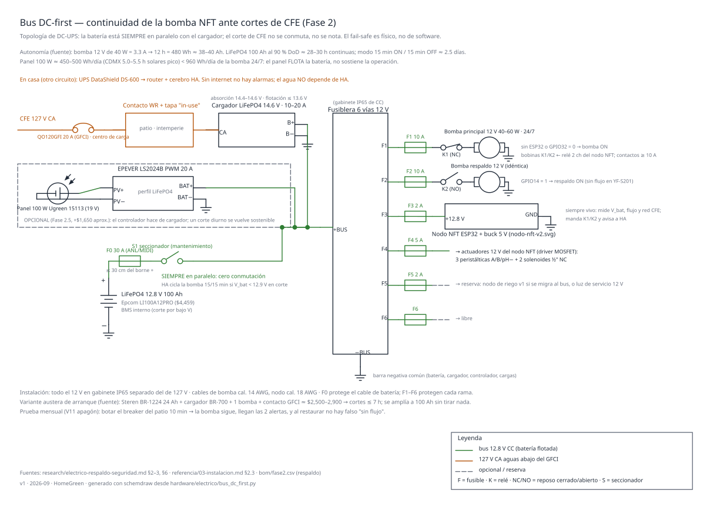
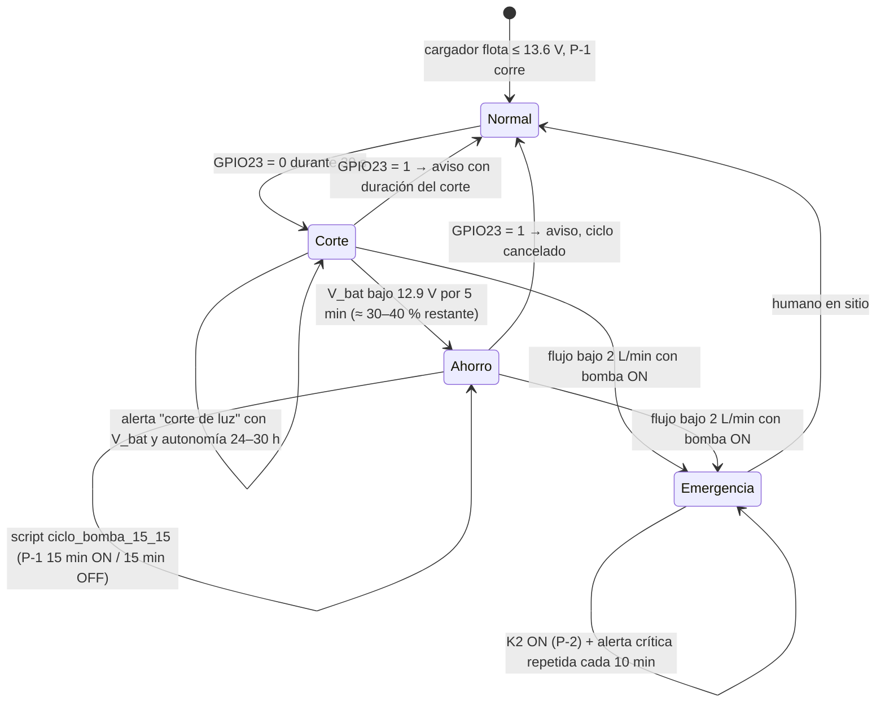
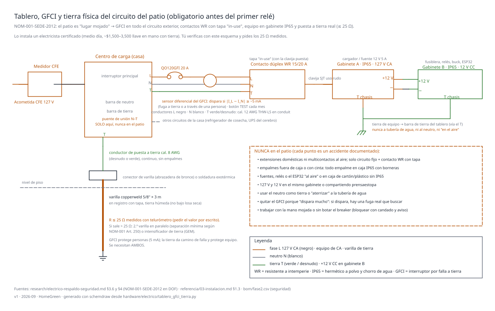

# Dejar la electricidad segura y con respaldo (DC-first)

**En una línea:** antes de sembrar la primera línea, el patio queda con GFCI, tierra física
≤ 25 Ω y gabinetes IP65, y la bomba del NFT pasa a ser de 12 V colgada de una batería LiFePO4
de 100 Ah siempre en paralelo: un corte de CFE de 1–8 h (3–6 al año en CDMX) ni se nota, y el
fail-safe es físico, no de software.

!!! info "Antes de empezar"
    - **Tiempo:** medio día a un día de electricista + 1 tarde para el bus DC + 20 min del primer simulacro · **Costo:** $13,155 el bloque completo con panel y breaker; $8,500–11,000 mínimo; $2,500–2,900 la variante austera ([compras §5](compras.md)) · **Personas:** electricista certificado para el 127 V; tú para el 12 V
    - **Necesitas:** breaker QO120GFI (o contacto GFCI $389), tapa intemperie in-use, varilla copperweld 5/8" × 3 m + conector + cable cal. 8, batería LiFePO4 12.8 V 100 Ah, cargador LiFePO4 14.6 V (o EPEVER LS2024B + panel 100 W), fusiblera de 6 vías + fusible principal + seccionador, 2 bombas de diafragma 12 V 40–60 W, relé de 2 canales, cable de uso rudo, gabinete IP65 para el bus DC, UPS DataShield DS-600, medidor de enchufe Steren HER-432 (~$336).
    - **Prerequisitos:** [Compras](compras.md) bloque 5 en mano; [Fase 1 · Automatización v1](../fase-1/automatizacion-v1.md) estable; guías [Instalar GFCI y tierra](../../guias/instalar-gfci-y-tierra.md), [Armar el respaldo DC](../../guias/armar-respaldo-dc.md), [Montar gabinete IP65](../../guias/montar-gabinete-ip65.md), [Simulacro de apagón](../../guias/simulacro-de-apagon.md).

## Por qué es la partida obligatoria de la fase

- **NFT sin recirculación = marchitez irreversible en 2–4 h** con el túnel a 25–35 °C (6–8 h en
  día nublado, pero no se diseña para el mejor caso). Un corte de una tarde cuesta 6–8 líneas =
  $6,000–10,000/mes de ingreso ([research/eléctrico §1](../../research/electrico-respaldo-seguridad.md)).
- **CDMX tiene 3–6 cortes/año de 1–8 h** (el Tren Ligero acumuló 66 en 18 meses; CFE publica
  mantenimientos semanales de 2–8 h por colonia): tabla de actuario, no paranoia ([07 §2](../../referencia/07-puntos-ciegos-y-riesgos.md)).
- **Un patio mojado con 127 V sin GFCI ni tierra** es el escenario clásico de electrocución
  doméstica; una fuente goteada, el de incendio. La NOM-001-SEDE-2012 lo llama "lugar mojado".
- **El respaldo con inversor está descartado con números:** la periférica de 0.5 HP pediría
  ~680 Ah de batería (> $30,000) y un UPS de PC dura 4–8 min y ni arranca el motor. Con bomba
  de 12 V y 40 W, la batería necesaria cuesta 7× menos.

## La arquitectura



```
CFE 127 V ──[QO120GFI]──> Cargador LiFePO4 en flotación ──┬──> P-1 bomba NFT 12 V 40–60 W (K1 NC, 24/7)
                                                          ├──> P-2 respaldo (K2 NO, por ESP32)
                      LiFePO4 12.8 V 100 Ah ──────────────┤    batería SIEMPRE en paralelo:
                                                          │    el corte no se conmuta, no se nota
                                                          ├──> Nodo NFT v2 (F3 2 A, siempre vivo)
                                                          └──> [opcional] EPEVER LS2024B <── panel 100 W
En casa (otro circuito): UPS DataShield DS-600 ──> router + cerebro (HA)
```

| Elemento | Especificación | Cifra que lo justifica |
|---|---|---|
| Bomba de recirculación | Diafragma 12 V 40–60 W ×2 (~$900–1,800 el par en ML) | 40 W = 3.3 A; 8–16 L/min a 1–2 m de columna sobra para 8 líneas |
| Batería | LiFePO4 12.8 V 100 Ah Epcom LI100A12PRO, $4,459 | 12 h = 480 Wh ≈ 38–40 Ah → 100 Ah al 90 % DoD ≈ **28–30 h continuas**; modo 15/15 ≈ **2.5 días**; 8–10 años de vida |
| Cargador | LiFePO4 14.6 V absorción / flotación ≤ 13.6 V, 10–20 A (~$700–1,400) **o** EPEVER LS2024B $599 con perfil LiFePO4 | El controlador solar hace de cargador y elimina esa partida |
| Panel (opcional recomendado) | Ugreen 100 W $1,049 | CDMX 5.0–5.5 h solares pico → 450–500 Wh/día; la bomba consume ~960 Wh/día: **el panel flota la batería, no corre el huerto**; un corte diurno se vuelve sostenible en modo 15/15 |
| Protección DC | Fusible principal en el borne + seccionador + fusiblera de 6 vías (~$500–900 con gabinete) | Cada salida con su fusible: P-1, P-2, nodo (2 A), reserva |
| Transferencia | K1 por contacto **NC** → P-1; K2 por contacto NO → P-2, comandados por el ESP32 | Sin ESP32, sin Wi-Fi y sin HA la bomba sigue: `restore_mode: RESTORE_DEFAULT_ON` |
| UPS del cerebro | DataShield DS-600 $1,189 (o KS800PRO $1,859 con puerto para NUT) | Pi + módem ~25–35 W → 45–90 min: suficiente para que salgan las alertas |
| Bomba de 127 V | Sumergible 4500 LPH 65 W ($1,199) | Solo llenado, purga y trasiego: tarea no crítica que puede esperar la luz |

=== "Recomendado (28–30 h)"

    LiFePO4 100 Ah + EPEVER LS2024B + panel 100 W + 2 bombas 12 V + QO120GFI + tapa in-use +
    tierra + electricista + UPS: **$11,000–14,500** (con solar); **$8,500–11,000** sin panel, con
    cargador AC y contacto GFCI en lugar de breaker ([research/eléctrico §6](../../research/electrico-respaldo-seguridad.md)).

=== "Austero de arranque (≤ 7 h)"

    Steren BR-1224 12 V 24 Ah ($1,290) + cargador BR-700 ($406–495) + 1 bomba de diafragma
    (~$500) + contacto GFCI Estevez ($239) ≈ **$2,500–2,900**. Cubre cortes de ≤ 7 h en modo
    supervivencia y se amplía a la LiFePO4 de 100 Ah sin tirar nada. Con AGM: 50 % de DoD sano y
    la mitad de ciclos de vida.

=== "Descartado"

    Periférica 0.5 HP + inversor: 550 W reales, inrush 3–6×, ~650 W desde batería, ~680 Ah para
    12 h (7 baterías, ~$31,000), inversor ≥ 1,500 W de onda senoidal pura (los Steren INV son de
    onda modificada). UPS 1000 VA con bomba de 450 W: 4–8 min.

## Qué pasa cuando se va la luz





Las 5 automatizaciones con YAML listo ([research/eléctrico §5](../../research/electrico-respaldo-seguridad.md)
y [`firmware/homeassistant/automations.yaml`](https://github.com/AndresIslas99/HomeGreen/blob/main/firmware/homeassistant/automations.yaml)):

| # | Disparo | Acción |
|---|---|---|
| 1 · **Bomba sin flujo** (crítica) | `flujo_nft < 2 L/min` 2 min con `bomba_nft = on` | Enciende `bomba_respaldo`, notificación crítica: "raíces mueren en 2–4 h" |
| 2 · Corte de CFE | `red_cfe_presente` → off 30 s | Aviso con voltaje de batería y autonomía estimada 24–30 h |
| 3 · Escalación | red off **y** flujo < 2 | `alert` que repite cada 10 min (opcional: llamada vía Twilio/CallMeBot) |
| 4 · Modo ahorro | `v_bateria < 12.9 V` 5 min con red off | `script.ciclo_bomba_15_15`: la película y la esponja retienen humedad entre ciclos |
| 5 · Nodo caído | `flujo_nft` unavailable 5 min | Aviso "sin datos, verifica en sitio" |

Regla de oro: **HA avisa y optimiza; la continuidad del agua nunca depende de que HA esté vivo.**
El detector de red es un cargador USB del patio → optoacoplador → GPIO23; el voltaje de batería
llega por divisor 47k/10k a GPIO36 ([dosificación §hardware](dosificacion-v2.md)).

## Pasos

### A. Seguridad eléctrica del 127 V (electricista certificado)



1. **Pide 3 cotizaciones con alcance escrito:** breaker GFCI QO120GFI en el centro de carga para
   el circuito del patio (o contacto GFCI Square D $389 aguas arriba de todo lo del patio), contacto
   exterior con tapa "in-use" que proteja con la clavija conectada, varilla copperweld 5/8" × 3 m
   con conector y cable desnudo cal. 8 hasta el centro de carga, y **medición con telurómetro
   ≤ 25 Ω** (si no se logra, segunda varilla). Llave en mano $1,500–3,500. *Criterio de listo:*
   el botón TEST del GFCI dispara y el electricista te entrega el valor de resistencia medido.
2. **Cableado de uso rudo (SJT/ST), todo empalme dentro de caja, contactos WR.** Fuentes,
   relés y ESP32 en gabinete IP65 con prensaestopas, nunca "al aire". **Bus 12 V y 127 V en
   gabinetes separados.** ([research/eléctrico §4](../../research/electrico-respaldo-seguridad.md);
   [referencia/normativa](../../referencia/normativa.md)).
3. **Audita el consumo antes de encender nada nuevo:** medidor de enchufe Steren HER-432 7 días
   en el circuito de la casa; lee el promedio anual del recibo CFE; helper de energía en HA con
   alarma en **220 kWh/mes**. Fase 2 bien diseñada suma ~85–90 kWh/mes (bomba 45 W ≈ 32, nodos
   ≈ 7, ventilación ≈ 18, tubos de germinación ≈ 30) + refrigerador 25–40; con un hogar de
   150+ kWh/mes ya rozas los 250 kWh del límite DAC ([07 §1](../../referencia/07-puntos-ciegos-y-riesgos.md)).

### B. Bus DC-first (tú, en 1 tarde)

4. **Monta el gabinete DC** a 30 cm del piso, lejos del 127 V y del agua: batería, cargador (o
   EPEVER), fusible principal en el borne positivo, seccionador, fusiblera de 6 vías. Configura el
   perfil LiFePO4 (absorción 14.4–14.6 V, flotación ≤ 13.6 V). *Criterio:* con CFE presente el bus
   marca ~13.3–13.6 V y la batería no se calienta.
5. **Conecta P-1 por K1 (contacto NC) y P-2 por K2 (NO)** desde salidas fusiladas; nodo NFT por su
   fusible de 2 A y buck a 5 V. Tierra común del 12 V. Válvula check en cada bomba si van en
   paralelo hidráulico ([nft.md §C](nft.md)).
6. **Panel (si lo compraste):** al EPEVER, orientado al sur, sin sombra de mediodía; el
   controlador hace de cargador dual. Sin panel: cargador AC con perfil LiFePO4.
7. **UPS DS-600 en casa:** router + cerebro. Si es KS800PRO, integra NUT en HA y usa su estado
   "OnBattery" como segunda fuente del evento de corte.

### C. Primer simulacro (V11) y rutina mensual

8. **Bota el breaker del patio 10 minutos.** Debe ocurrir: la bomba sigue (bus en batería), llega
   la alerta "corte de luz" a los 30 s con el voltaje, el nodo sigue reportando, y al restaurar
   llega el aviso de restauración **sin** falso "sin flujo". Luego prueba el flujo: cierra el
   manifold 2 min con la bomba ON → arranca P-2 y llega la crítica. *Criterio:* 2 alertas de corte
   + 1 crítica de flujo, cero actuadores en estado inseguro ([validación V11](../../validacion/v11-apagon.md)).
9. **Repite cada mes, en el calendario de HA.** Un respaldo que no se prueba mensualmente es un
   respaldo que falla el día del corte real. Registra fecha, V_bat inicial/final y las alertas
   recibidas en `bitacora/nft.csv` (`evento=simulacro_V11`).
10. **Protocolo para cortes > 12 h** (raros pero ya vistos: mayo 2024 fue de 3 días): modo 15/15
    automático desde 12.9 V; si el bus baja de 12.0 V, riego manual por gravedad desde el tinaco
    a las líneas con manguera cada 30 min, checklist impreso en el gabinete.

!!! warning "Errores típicos"
    - **"Primero el NFT, luego el respaldo."** El primer corte no espera.
    - **Cargador de plomo-ácido en una LiFePO4** (o al revés): perfil equivocado = batería
      arruinada. El BR-700 es para la AGM de la variante austera.
    - **Bomba colgada de un relé NO** en lugar de NC: un ESP32 muerto la deja apagada.
    - **Cerebro y fuente en el túnel:** humedad + robo. Van dentro de casa; a la intemperie solo
      nodos ESP32 de $150 ([07 §10](../../referencia/07-puntos-ciegos-y-riesgos.md)).
    - **Probar el GFCI "una vez" y nunca más:** botón TEST mensual junto con el V11.

## Seguridad física (mientras estás en el tablero)

Equipo robable en Fase 2: ~$8–14k. Mitigación casi gratis ([07 §10](../../referencia/07-puntos-ciegos-y-riesgos.md)):
nada visible desde la calle, cerebro dentro de casa, candado + cadena en el túnel (~$600),
ESP32-CAM con detección de movimiento nocturno y notificación, equipo marcado y fotografiado
con número de serie.

## Al terminar

- [ ] GFCI instalado y probado (TEST); tierra ≤ 25 Ω con valor medido escrito; contacto exterior in-use
- [ ] Bus DC en gabinete propio: batería en flotación (~13.3–13.6 V), fusibles en cada salida, seccionador
- [ ] P-1 por K1 NC y P-2 por K2 NO; fail-safe probado sin ESP32
- [ ] UPS del cerebro; automatizaciones 1–5 cargadas en HA
- [ ] V11 aprobado: bomba siguió, 2 alertas de corte, crítica de flujo, sin falso "sin flujo"
- [ ] Alarma de energía en HA a 220 kWh/mes; consumo base del hogar medido 7 días
- **Registrar:** `bitacora/nft.csv` → `evento=simulacro_V11` (V_bat, alertas, duración); resistencia de tierra y fecha en `docs/diseno/electrico.md` de tu copia.
- **Siguiente paso:** [Construir las 8 líneas NFT](nft.md).

## Fuentes

- [03-instalación §1.3 y §2.3](../../referencia/03-instalacion.md) (GFCI/tierra/IP65, arquitectura DC-first, regla de oro)
- [research/electrico-respaldo-seguridad](../../research/electrico-respaldo-seguridad.md) (dimensionamiento, cotizaciones, NOM-001-SEDE-2012 vía DOF, YAML, BOM del hueco)
- [07-puntos ciegos §1, §2, §10](../../referencia/07-puntos-ciegos-y-riesgos.md) y [research/puntos-ciegos §(a), §(b), §(h)](../../research/puntos-ciegos.md) (DAC, apagones, seguridad)
- [06-validación V3, V11 y watchdogs](../../referencia/06-validacion-y-lazos-agenticos.md)
- Esquemas: [`hardware/electrico/bus_dc_first.py`](https://github.com/AndresIslas99/HomeGreen/blob/main/hardware/electrico/bus_dc_first.py), [`tablero_gfci_tierra.py`](https://github.com/AndresIslas99/HomeGreen/blob/main/hardware/electrico/tablero_gfci_tierra.py) · [Diseño · Eléctrico](../../diseno/electrico.md)
- [`bom/fase2.csv`](https://github.com/AndresIslas99/HomeGreen/blob/main/bom/fase2.csv) (bloques respaldo y seguridad)
