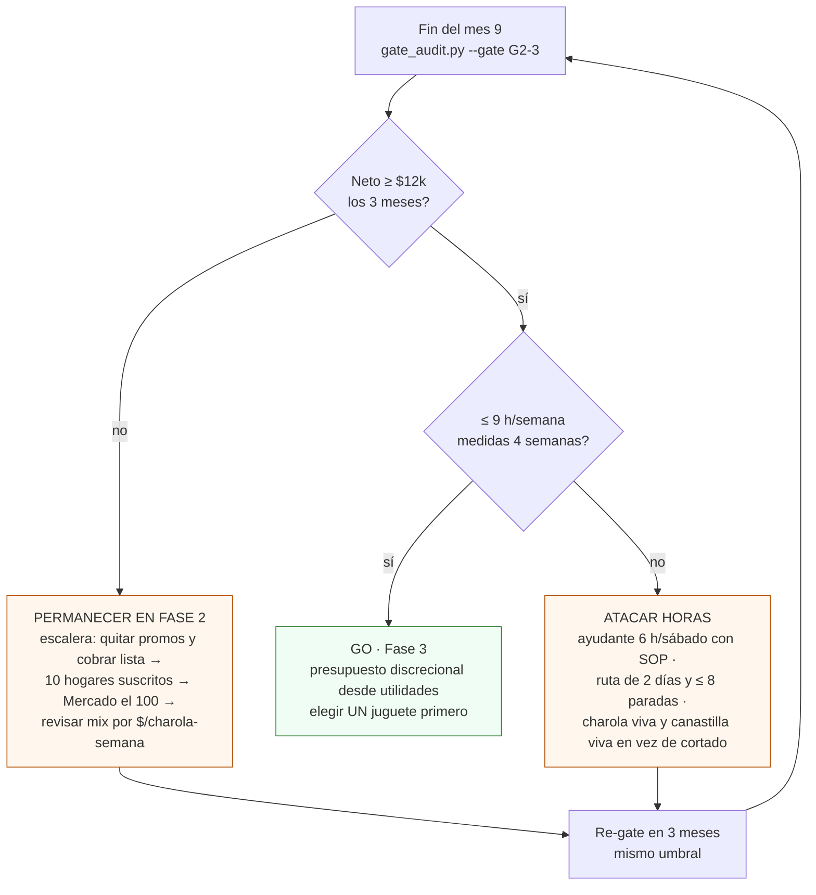

# Pasar el gate G2→3

**En una línea:** al cerrar el mes 9 corres `tools/gate_audit.py` sobre ventas conciliadas,
costos y timesheet, comparas contra los dos umbrales escritos en Git antes de la fase — neto
≥ $12,000/mes por 3 meses y ≤ 9 h/semana medidas — y decides Go a Fase 3 o permanecer en Fase 2
optimizando, sabiendo de antemano que el neto corregido del proyecto ($6,500–11,000) hace de
este gate el más exigente de los cuatro.

!!! info "Antes de empezar"
    - **Tiempo:** 1 h de auditoría + 1 h de decisión con un tercero que pueda leer los números · **Costo:** $0 · **Personas:** 1 + auditor (pareja, socio, contador)
    - **Necesitas:** `bitacora/ventas.csv` conciliada con SPEI de 3 meses, `bitacora/cobranza.csv`, costos del trimestre (insumos, nutriente, calibración, agua, luz con el recibo CFE, reparto, ayudante), `bitacora/timesheet.csv` de 4 semanas (V9), export de HA (pH/EC en banda, alarmas, V11 mensuales), `bitacora/nft.csv`.
    - **Prerequisitos:** commissioning de Fase 2 completo ([index](index.md)); [Timesheet semanal](../../guias/timesheet-semanal.md) 4 semanas seguidas; reglas de gates en [validación/gates](../../validacion/gates.md) y [V9](../../validacion/v09-timesheet.md).

## 1. Las métricas (tal cual están en 06 §L4)

| Gate | Métrica | Umbral | Fuente de dato | Decisión |
|---|---|---|---|---|
| **G2→3** | El sistema se paga solo: neto mensual | **≥ $12,000/mes durante 3 meses consecutivos** | Contabilidad (cobrado, no facturado) | Go a "juguetes" |
| **G2→3 (b)** | Horas del fundador | **≤ 9 h/semana medidas** (V9, 4 semanas cronometrando TODO) | `bitacora/timesheet.csv` | Si falla: atacar el rubro más caro en tiempo antes de escalar |

**Regla dura:** un gate no alcanzado no se renegocia a la baja; se itera o se detiene. Las
condiciones están en Git desde antes de la fase ([06 §L4](../../referencia/06-validacion-y-lazos-agenticos.md)).

Definiciones para que un tercero las audite:

- **Neto** = ingreso **cobrado** en el mes (SPEI conciliado; una factura PPD sin cobro no es
  ingreso) − insumos (semilla, sustrato, nutriente, empaque) − agua, luz (recibo CFE real),
  calibración y mermas − gasolina/entregas − **ayudante, si lo hay** − reposiciones por rechazo −
  fondo de reposición ($500/mes). Misma estructura que la tabla de [00 §números](../../referencia/00-plan-maestro.md),
  con las partidas que 07 agregó.
- **3 meses consecutivos** = meses calendario seguidos, cada uno ≥ $12,000; un mes en $11,900
  reinicia la cuenta. Enero–febrero cuentan con su −35 % real, no ajustado.
- **Horas medidas** = todo lo que haces por el huerto: siembra, cosecha, empaque, lavado, reparto,
  ventas, WhatsApp, cobranza, facturas, calibración, cambio de solución, compras, imprevistos.
  Solo tus horas: las del ayudante ya se restaron del neto como costo. Promedio de 4 semanas
  seguidas, sin excluir la "mala".

## 2. La tensión que debes entender antes de medir

El gate se escribió con el plan original: neto de régimen "$8,000–13,500" y "6–9 h/semana".
[07-puntos ciegos](../../referencia/07-puntos-ciegos-y-riesgos.md) corrigió las dos cifras
con merma 15–20 %, enero −35 %, CAC recurrente y el desglose honesto de tareas:

| | Plan original | Corregido (07) |
|---|---|---|
| Neto de régimen (mes 9–12) | $8,000–13,500/mes | **$6,500–11,000/mes** |
| Horas del fundador (30 charolas + NFT + 4–6 clientes) | 6–9 h/semana | **14.5–17.5 h/semana** |

Es decir: **operando bien, con los supuestos corregidos, lo normal es NO pasar G2→3 en el primer
intento.** Eso no es un fracaso del negocio (a $10k netos entre 65 h/mes son ~$150/h, un buen
negocio secundario); es la diferencia entre "el huerto se paga" y "el huerto se paga solo y sin
ti", que es lo que la Fase 3 exige, porque la Fase 3 es discrecional, no produce ingreso y come
horas.

Ejemplo aritmético con las cifras de 07 (no es una promesa, es para ver qué palanca mueve qué):

| Escenario | Bruto | Costos | Ayudante 6 h/sáb | Neto | Horas fundador | ¿Pasa? |
|---|---|---|---|---|---|---|
| Régimen corregido, sin ayudante | $14,000–21,000 | −$5,300–7,700 (+ mermas/CAC/enero) | $0 | $6,500–11,000 | 14.5–17.5 h | No (a) y no (b) |
| Igual + ayudante | ídem | ídem | −$1,300–1,600 | ~$5,000–9,500 | ~9–11 h | No (a); (b) al límite |
| + precios de lista sin promo + 10 hogares suscritos (~$10k brutos extra a ~21 % de costo variable) | ~$24,000–31,000 | proporcional | −$1,300–1,600 | **~$12,000–18,000** | ~11–13 h (más empaque y reparto) | (a) sí; (b) exige más ayudante o ruta más corta |

Lectura: **la palanca del neto es precio y canal de hogares; la palanca de horas es ayudante y
diseño de ruta.** Ninguna de las dos es "más m²" ([07 §14](../../referencia/07-puntos-ciegos-y-riesgos.md)).

!!! warning "Lo que NO se hace con esta tensión"
    - **No se baja el umbral a $6,500 ni se suben las horas a 15** "porque 07 lo dice". 07
      corrige el pronóstico, no el criterio de entrada a una fase que solo gasta.
    - **No se "cuenta" el neto antes del ayudante** para pasar (b) con las horas del ayudante y
      (a) sin su costo. Las dos métricas se miden en el mismo mes con la misma nómina.
    - **No se toma la Fase 3 "con lo que sobre"** si (a) falla: el presupuesto de la Fase 3 sale
      de utilidades que todavía no existen.

Escríbelo antes de la fase, en este archivo de tu copia: "si en el mes 9 el neto está en
$6,500–11,000 con ≤ 9 h, permanecemos en Fase 2, aplicamos la escalera y re-evaluamos en 3 meses".

## 3. Cómo medirlas

### Con `tools/gate_audit.py`

```bash
python3 tools/gate_audit.py --gate G2-3 \
  --ventas bitacora/ventas.csv --cobranza bitacora/cobranza.csv \
  --costos bitacora/costos.csv --timesheet bitacora/timesheet.csv \
  --desde 2027-04-01 --hasta 2027-06-30
```

Agrega `--guardar` y el informe queda en `bitacora/gates/G2-3-AAAA-MM-DD.md`. Opciones
completas: [software/herramientas-cli § `gate_audit.py`](../../software/herramientas-cli.md#gate_auditpy).

| Paso | Qué hace | Salida |
|---|---|---|
| 1. Cobrado por mes | Cruza `ventas.csv` con `cobranza.csv`: solo importes con `fecha_cobro` dentro del mes | Ingreso cobrado × 3 meses |
| 2. Costos por mes | Suma `costos.csv` por categoría (insumos, servicios, reparto, ayudante, reposiciones, fondo) | Costos × 3 meses |
| 3. Métrica (a) | Neto = 1 − 2 por mes; **PASS** si los 3 meses ≥ $12,000 | Tabla mes × neto |
| 4. Horas | Promedio semanal de `timesheet.csv` en las 4 últimas semanas, por rubro | h/semana total y por rubro |
| 5. Métrica (b) | **PASS** si promedio ≤ 9 h | h/semana y el rubro más caro |
| 6. Apoyo | Sell-through, merma, recompra, entregas a tiempo, cartera > 15 días, % del cliente mayor, % del canal mayor, % del tiempo con pH/EC en banda, V11 del trimestre | Contexto, no gate |
| 7. Informe | Markdown con PASS/FAIL de (a) y (b), tablas y el rubro de horas a atacar | `bitacora/gates/G2-3-AAAA-MM-DD.md` |

### A mano (hoja de cálculo, 30 min)

1. Tabla dinámica de cobros por mes (fecha de cobro, no de factura); resta los costos del mes por
   categoría con los recibos reales (CFE incluido). Tres celdas de neto.
2. Suma el timesheet por semana y por rubro; promedia 4 semanas; señala el rubro mayor.
3. Anota los KPIs de apoyo del [L2](../../referencia/06-validacion-y-lazos-agenticos.md) con
   `tools/kpis.py` ([validación/kpis](../../validacion/kpis.md)).

## 4. Lo que debe estar cerrado además de los números

- [ ] Commissioning de Fase 2 completo: pendientes verificadas, 48 h con agua, dry-run de dosificación, primer ciclo de albahaca con pH/EC en banda ≥ 90 % (dato de HA), V11 aprobado
- [ ] V11 aprobado **cada mes** del trimestre (3 registros en `bitacora/nft.csv`)
- [ ] 6 calibraciones quincenales y 4–6 cambios de solución registrados en el trimestre
- [ ] Cartera: ninguna factura > 15 días vencida al cierre; REP emitidos los días 1–5 de cada mes
- [ ] Ningún cliente > 30 % de las ventas; ningún canal > 60 %; ≥ 1 canal no-restaurante activo
- [ ] Refrigerador a 4–5 °C y temperatura de entrega registrada en cada remisión con producto cortado
- [ ] Ayudante con SOP escrito con fotos (si lo hay); regla anti-burnout (3 semanas > 18 h → contratar o recortar) no disparada
- [ ] Fondo de reposición en marcha; recibo CFE del trimestre con promedio anual < 220 kWh/mes
- [ ] Merma real por especie y por línea NFT anotada (sustituye los supuestos del 08)

## 5. La decisión



- **Go:** ambas pasan. Entonces sí: [Fase 3](../fase-3/index.md) con un tope de gasto escrito
  (sale de utilidades, nunca de deuda ni de la caja de enero) y un solo proyecto a la vez.
- **Permanecer en Fase 2 (neto < $12k):** no es abortar; es operar la escalera de 07 §14 en
  orden: ① subir precios / lista de espera, ② ayudante, ③ densificación con LED **solo con
  contrato PDBT separado**, ④ segunda ubicación o alianza con otro productor, nunca antes de
  8+ clientes recurrentes en lista de espera por 2 meses. Re-gate a los 3 meses con el mismo umbral.
- **Atacar horas (neto sí, horas no):** el timesheet dice cuál rubro; el orden típico es reparto
  (3–4 h) → cosecha/empaque (3.5–4.5 h) → siembra (3 h). Ayudante de sábado, ruta más corta,
  formato vivo. Re-medir 4 semanas.
- **Señal de detener** (no es un umbral del gate, es de salud): 3 semanas seguidas > 18 h sin
  ayudante contratado, o neto < $6,500 dos meses seguidos fuera de enero–febrero → antes de
  cualquier Fase 3, post-mortem de una página y decisión de tamaño del negocio.

!!! warning "Errores típicos"
    - **Usar ingreso facturado en vez de cobrado.** En RESICO ni siquiera es ingreso fiscal.
    - **Olvidar el recibo CFE real.** Si la Fase 2 te mandó a DAC, el neto cae $1,600–2,000/mes.
    - **Cronometrar "una semana buena".** V9 son 4 semanas seguidas, con la mala incluida.
    - **Contar el trabajo de un familiar como $0.** Si no está en el timesheet ni en el costo, el gate miente.

## Al terminar

- [ ] Informe `bitacora/gates/G2-3-AAAA-MM-DD.md` commiteado con PASS/FAIL de (a) y (b)
- [ ] Decisión escrita con fecha: Go / permanecer (qué peldaño de la escalera y fecha del re-gate) / atacar horas (rubro y medida)
- [ ] Si Go: tope de gasto de Fase 3 y el primer proyecto elegido, escritos en tu copia de [Fase 3](../fase-3/index.md)
- **Registrar:** `git commit -m "G2→3: <Go|permanecer|horas> — neto <X/Y/Z>, <H> h/semana"`.
- **Siguiente paso:** [Fase 3 · Consolidación y testbed agtech](../fase-3/index.md) o, si permaneces, de vuelta a [Clientes y cobranza](clientes-y-cobranza.md).

## Fuentes

- [06-validación §L2, §L4, V9, V11](../../referencia/06-validacion-y-lazos-agenticos.md) (métricas, umbrales, regla dura, timesheet)
- [00-plan maestro §mapa de fases y §números](../../referencia/00-plan-maestro.md) (meta de Fase 2, neto original)
- [07-puntos ciegos §4, §5, §13, §14 y "el número corregido"](../../referencia/07-puntos-ciegos-y-riesgos.md) · [research/puntos-ciegos §(d), §(f), §(j), §(l)](../../research/puntos-ciegos.md)
- [08-recetas y economía unitaria](../../referencia/08-recetas-y-economia-unitaria.md) ($/charola-semana, 21 % de costo variable, ingreso revalidado)
- [research/cobranza-b2b §3.2](../../research/cobranza-b2b.md) (ingreso = cobrado) · [research/mercado-precios §5](../../research/mercado-precios.md) (suscripción a hogares)
