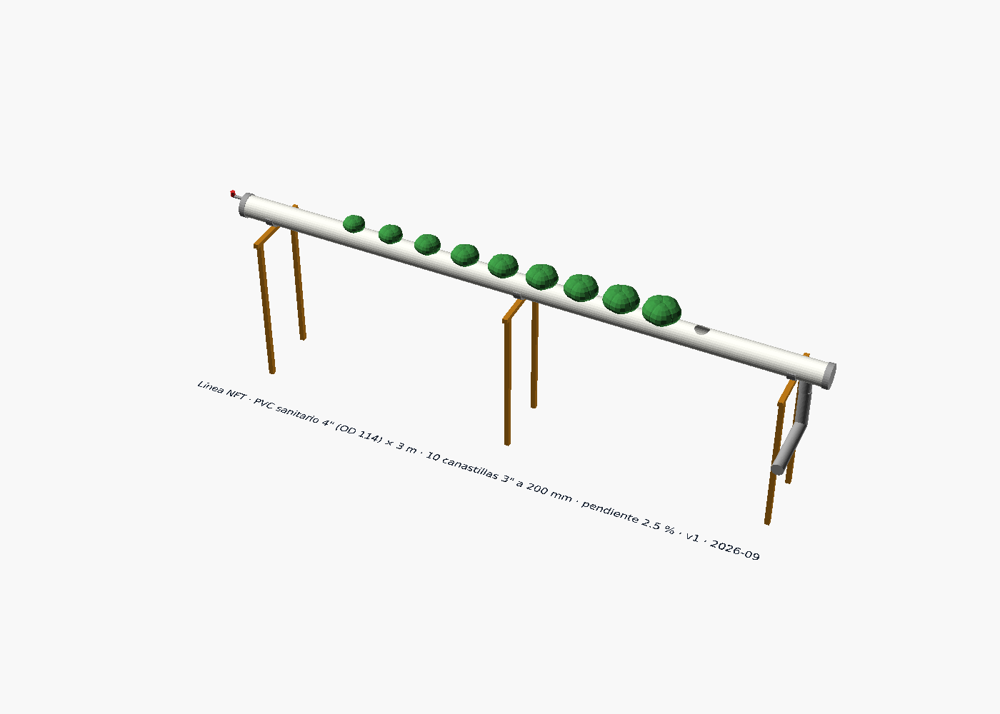

# Construir las 8 líneas NFT

**En una línea:** en 2–3 fines de semana conviertes 4 tramos de PVC sanitario de 4" en 8 líneas
de 3 m con 10 sitios cada una, a 2–3 % de pendiente, con retorno por gravedad a un tambo de
200 L tapado y a la sombra, y las corres 48 h con agua sola antes de que entre una sola raíz.

!!! info "Antes de empezar"
    - **Tiempo:** 2–3 fines de semana (1 para perforar y armar bancadas, 1 para retorno/tambo/manifold, 1 de commissioning) · **Costo:** $6,554 el bloque NFT + $1,214 de nutrición ([compras §1–2](compras.md)); sistema NFT completo $7,200–8,700 · **Personas:** 2 para mover tubos de 6 m y nivelar; 1 para lo demás
    - **Necesitas:** 4 tubos sanitarios 4" × 6 m, codos 90°/45°, tapas, adaptadores de drenaje, tubería ½"–¾" y 2", 8 válvulas de compuerta, 80 canastillas 3", sierra copa del diámetro **medido**, cemento PVC + limpiador, lima, nivel de 24", flexómetro, tambo 200 L, filtro malla 120, 2 bombas de diafragma 12 V ya en el bus DC, bomba sumergible 4500 LPH (llenado/purga), dúplex sedimento + carbón, solenoide NC, semillero foami, botella de 1 L y cronómetro.
    - **Prerequisitos:** [Electricidad segura y con respaldo](electrico-respaldo.md) terminada (GFCI, tierra, bus DC con V11 aprobado); túnel ampliado a 5 × 6 m ([Fase 1 · Túnel](../fase-1/tunel.md) escalado); V7 del agua hecha ([validación V7](../../validacion/v07-agua.md)); guía paso a paso de una línea en [Armar una línea NFT](../../guias/armar-linea-nft.md).

## Cómo funciona lo que vas a construir

La solución sale del tambo (TK-2) por la bomba de 12 V (P-1; P-2 es el respaldo por relevador
de transferencia), pasa el filtro de malla 120 (F-1) y el sensor de flujo (FT-1), sube por ¾"
al manifold y entra por el extremo **alto** de cada línea; corre como película de 1–3 mm bajo
las canastillas y sale por el extremo **bajo** a un retorno de 2" que cae por gravedad al tambo.
Las sondas de pH (AT-1) y EC (AT-2) leen en el retorno, donde la solución ya está mezclada; las
peristálticas dosifican al tambo junto a la succión. El tambo se llena desde el tinaco de 750 L
por un solenoide NC (SV-1) a través del dúplex sedimento + carbón (quita el cloro de red) y se
vacía a la coladera por SV-2 en cada cambio de solución. Detalle en
[Diseño · Hidráulico](../../diseno/hidraulico.md).

Modelo paramétrico en [`hardware/cad/linea_nft.scad`](https://github.com/AndresIslas99/HomeGreen/blob/main/hardware/cad/linea_nft.scad):
el diámetro de perforación del modelo (70 mm) es solo de dibujo; **el real se mide en la
canastilla que compraste**.

## Pasos

### A. Perforar y armar las líneas (fin de semana 1)

1. **Mide la canastilla antes de tocar el tubo.** Con vernier o flexómetro, mide el diámetro del
   CUERPO de la canastilla de 3" justo debajo del labio y anótalo en mm. Compra **una** sierra
   copa de ese diámetro (no el kit). Perfora un retazo de 20 cm, desbarba y prueba: la canastilla
   debe entrar con el labio apoyado y sin bailar. *Criterio de listo:* la canastilla no cae al
   fondo ni queda "sentada" sobre el labio con holgura > 1 mm. Una canastilla "de 2 pulgadas"
   pide 44–48 mm, nunca 2" exactas ([03 §2.1](../../referencia/03-instalacion.md)).
2. **Corta los 4 tramos de 6 m a la mitad** → 8 líneas de 3 m. Marca en cada línea una
   generatriz recta (la línea de perforación) con hilo de gis o regla larga: si los hoyos se
   tuercen, las canastillas quedan inclinadas y las raíces tocan el agua desigual.
3. **Marca los centros:** 10 sitios por línea a **20 cm** entre centros para albahaca y arúgula
   (15 cm para cilantro), dejando margen en los extremos para la tapa y la entrada/salida. *Criterio:*
   los 10 centros caben con la misma separación y la marca queda centrada sobre la generatriz.
4. **Perfora con la sierra copa a velocidad baja** y el tubo bien apoyado (dos caballetes); no
   fuerces: el PVC se calienta y se funde en la rebaba. **Desbarba cada hoyo** con lima o cuchilla:
   las rebabas atoran raíces y flujo. *Criterio:* pasas el dedo y no engancha.
5. **Tapas en ambos extremos.** Cementa la tapa del extremo alto con un pasamuros o niple para la
   manguera de ½"–¾" (entrada) y la del extremo bajo con el adaptador de drenaje 4" → 2" (salida),
   colocado en la parte **inferior** de la tapa para que no quede charco. Limpiador + cemento
   regular bastan (sin presión). Deja curar según el envase antes de mojar.

!!! warning "Error típico: hoyo del diámetro nominal"
    "Canastilla de 3 pulgadas" NO significa sierra copa de 3". El nominal es el labio; el
    cuerpo es menor. Si ya perforaste de más: la única salida es un anillo/adaptador por sitio
    o repetir la línea (medio tramo, $208).

### B. Bancadas, pendiente y retorno (fin de semana 1–2)

6. **Arma dos bancadas de 4 líneas** (bancada A y B en la planta) sobre el PTR del túnel o
   caballetes propios, con soportes cada **≤ 1.5 m** (a 0, 1.5 y 3 m de cada línea) para que
   el tubo no haga panza: agua estancada a media línea = raíces podridas. [POR VERIFICAR:
   `bom/fase2.csv` no incluye PTR ni ménsulas para las bancadas; el informe asume que van sobre
   la estructura del túnel — cotizar con el herrero junto con la ampliación.]
7. **Da la pendiente: 2–3 % (2–3 cm por metro → 6–9 cm entre la entrada y la salida de una
   línea de 3 m).** Mide con el nivel de 24" y una cuña calibrada, o con dos alturas marcadas
   en los soportes; verifica línea por línea. Extremo alto = entrada del manifold; extremo bajo
   = retorno. *Criterio:* al verter 1 L de agua por la entrada, cruza la línea sin detenerse ni
   dejar charco en ningún sitio.
8. **Retorno de 2" por gravedad.** Une las 4 salidas de cada bancada a un colector de 2" con
   codos de 45° (menos turbulencia que 90°) que baja al tambo; el colector también lleva
   pendiente (≥ 1 %) y entra al tambo por la tapa, sin quedar sumergido (una boca sumergida
   sifonea y burbujea sobre las sondas). En la boca del retorno, dentro del tambo, van las
   sondas pH/EC y el DS18B20 ([dosificación](dosificacion-v2.md)).

### C. Tambo, bombas, filtro y manifold (fin de semana 2)

9. **Tambo de 200 L a la sombra, tapado y sobre base firme** (lleno pesa 200 kg). Solución ideal
   18–22 °C; arriba de 25 °C cae el oxígeno disuelto y la albahaca frena. En el sur de CDMX,
   el tambo dentro del túnel actúa de amortiguador térmico; agua < 10 °C frena la albahaca
   ([research/clima](../../research/clima-agronomia.md)). Tinaco de 750 L = agua cruda; tambo =
   solución. No los confundas.
10. **Bombas:** las dos de diafragma 12 V (P-1 principal por contacto NC, P-2 respaldo por NO)
    ya cuelgan del bus de batería ([electrico-respaldo](electrico-respaldo.md)). Succión desde el
    fondo del tambo con cedazo; descarga → **filtro malla 120** (lavar cada semana) → **YF-S201**
    → subida de ¾" al manifold. La sumergible de 4500 LPH (127 V) se queda para llenado, purga y
    trasiego, y como plan B durante el commissioning con agua si el bus DC aún no está.
11. **Manifold de ¾" con una válvula de compuerta por línea.** Ajusta cada línea con **botella de
    1 L y cronómetro**: objetivo **1–2 L/min por línea** (1 L en 30–60 s), 8–16 L/min en total a
    1–2 m de columna. Cierra un poco las líneas cercanas al manifold para que las lejanas reciban
    lo mismo. *Criterio:* las 8 líneas dentro de 1–2 L/min y la película cubre el fondo del tubo
    sin brincar por las canastillas.
12. **Llenado y anticloro.** Del tinaco al tambo: válvula manual → dúplex sedimento 5 µm + carbón
    activado → solenoide ½" NC → tambo. Con el dúplex el cloro de red (0.2–1.5 mg/L) no llega a
    las raíces; los cartuchos se cambian cada 4–6 meses. Si el agua de tu llave dio EC > 0.8 mS/cm
    en V7, llena con lluvia del tinaco o mezcla 50/50 ([02 §2](../../referencia/02-restricciones-y-requisitos.md)).
13. **Purga a la coladera** por SV-2 (o válvula manual de bola en el fondo del tambo): es el
    cambio completo de solución cada 2–3 semanas ([guía](../../guias/cambiar-solucion-nft.md)).

### D. Commissioning: 48 h con agua sola (fin de semana 3)

14. **Llena el tambo con agua (sin nutriente) y arranca la recirculación 48 h.** Revisa a las 1,
    6, 24 y 48 h: fugas en tapas y codos, caudal por línea con la botella, charcos a media línea,
    nivel del tambo (una pérdida de nivel sin fuga visible = evaporación o salpicadura en el
    retorno). *Criterio de listo:* cero fugas, las 8 líneas en 1–2 L/min, sin encharcamiento,
    nivel estable ± 2 cm.
15. **Inyecta fallas** mientras corre (es el V3 del NFT): cierra la válvula de una línea
    (¿avisa el flujo?), apaga P-1 (¿arranca P-2 y llega la alarma "sin flujo"?), baja el nivel del
    tambo por debajo del 20 % (¿se bloquean dosificación y bomba?). Registra en tabla FMEA-lite:
    falla → efecto → detección → respuesta ([validación V3](../../validacion/v03-dry-run.md)).
16. Solo después: vacía, llena con agua filtrada/lluvia, prepara la solución
    ([guía](../../guias/preparar-solucion-nutritiva.md)) y pasa al dry-run de dosificación
    ([dosificación](dosificacion-v2.md)).

### E. Germinar aparte y trasplantar

17. **Germina en foami agrícola**, nunca en la línea: semillero de 144 bloques ($45.50, $0.32 por
    planta), humedecido con agua (no solución) los primeros días, bajo luz indirecta. Albahaca:
    germina a 21–27 °C; **en diciembre–marzo solo con tapete térmico** ([02 §1](../../referencia/02-restricciones-y-requisitos.md)).
    Nufar como variedad principal (resistente a fusarium, el patógeno que contamina sistemas
    recirculantes); Genovese/Italian Large Leaf para diversificar; morada y limón para coctelería.
18. **Trasplanta a la canastilla cuando la raíz asoma por el bloque (10–14 días en albahaca).**
    Un bloque por canastilla (o cilindro de foami 4.3 × 5 cm, $2.90, para la de 3"); la base del
    bloque debe tocar la película, no quedar sumergida. Marca la fecha y el lote en la línea
    (`ALB-AAMMDD-Sxxx-L1` en masking tape, mismo formato que las charolas).
19. **Ritmo:** siembra escalonada semanal para que cada línea entre y salga en oleadas y nunca
    cambies las 8 a la vez. Malla sombra 35 % sobre las hierbas **solo marzo–mayo** (UV 11+);
    el resto del año la albahaca necesita luz para aroma. En Tlalpan alto, Xochimilco o Milpa
    Alta: túnel cerrado de noche en invierno, alarma < 6 °C y masa térmica (2 tambos de 200 L
    negros): **una helada mata todo el NFT de albahaca**.

!!! warning "Errores típicos"
    - **Tambo al sol o destapado:** luz + agua = algas en 3 días, y > 25 °C mata el oxígeno.
    - **Sondas junto a la salida de las peristálticas** en vez de en el retorno: leen picos y el lazo oscila.
    - **Peat pellets en NFT:** sueltan turba que tapa la malla 120 y ensucia la solución.
    - **Cambiar "solo agua" y nunca la solución:** los micronutrientes se desbalancean aunque la EC "se vea bien". Cambio completo cada 2–3 semanas, registrado.
    - **Sembrar sin V11 aprobado:** el primer corte de CFE de 1–8 h llega antes de la primera cosecha.

## Video de apoyo

Construcción física con nomenclatura de tlapalería mexicana (México Verde, en español):

<iframe width="560" height="315" src="https://www.youtube.com/embed/PbnziwkUfus" title="Cómo hacer un sistema hidropónico NFT (México Verde)" frameborder="0" allowfullscreen></iframe>

Dimensionamiento (bomba, pendiente 2 %, espaciamiento) en la guía escrita de Hydro Environment
["NFT y su instalación"](https://hydroenv.com.mx/id102/) y su [video](https://www.youtube.com/watch?v=yY7fvK-wjHg)
([aprendizaje/videos](../../aprendizaje/videos.md)). Ojo: el video usa PVC hidráulico; tú usas
sanitario, que es más barato y suficiente.

## Al terminar

- [ ] 8 líneas con 10 sitios desbarbados, canastilla ajustada, pendiente 2–3 % verificada línea por línea
- [ ] Retorno de 2" con pendiente propia, entrando al tambo sin sumergirse; tambo tapado y a la sombra
- [ ] Caudal 1–2 L/min en las 8 líneas anotado (L/min por línea y posición de cada válvula)
- [ ] 48 h con agua: sin fugas, sin encharcamiento, nivel estable; tabla FMEA-lite de fallas inyectadas
- [ ] Dúplex anticloro y solenoide NC instalados en el llenado; purga probada hasta la coladera
- [ ] Primer semillero de albahaca Nufar en foami con fecha y lote
- **Registrar** en `bitacora/nft.csv` (propuesta de campos): `fecha,evento,linea,caudal_L_min,nivel_tambo_pct,temp_solucion_C,observaciones` — el commissioning es la primera fila.
- **Siguiente paso:** [Dosificar pH/EC automáticamente](dosificacion-v2.md).

## Fuentes

- [03-instalación §2.1 y commissioning Fase 2](../../referencia/03-instalacion.md) (tubo sanitario, perforación, pendiente, soportes, bomba, caudal, germinación)
- [research/hidroponia-nft](../../research/hidroponia-nft.md) (precios, canastillas, foami, filtro, tambo, nutriente)
- [research/clima-agronomia](../../research/clima-agronomia.md) y [02-restricciones §1–2](../../referencia/02-restricciones-y-requisitos.md) (temperatura de solución, heladas, malla sombra, agua y cloro)
- [research/agua-captacion](../../research/agua-captacion.md) (dúplex sedimento + carbón)
- [06-validación V3, V7](../../referencia/06-validacion-y-lazos-agenticos.md)
- [research/tutoriales-videos §(b)](../../research/tutoriales-videos.md) (México Verde, Hydro Environment)
- [`bom/fase2.csv`](https://github.com/AndresIslas99/HomeGreen/blob/main/bom/fase2.csv) · [`hardware/cad/linea_nft.scad`](https://github.com/AndresIslas99/HomeGreen/blob/main/hardware/cad/linea_nft.scad)
