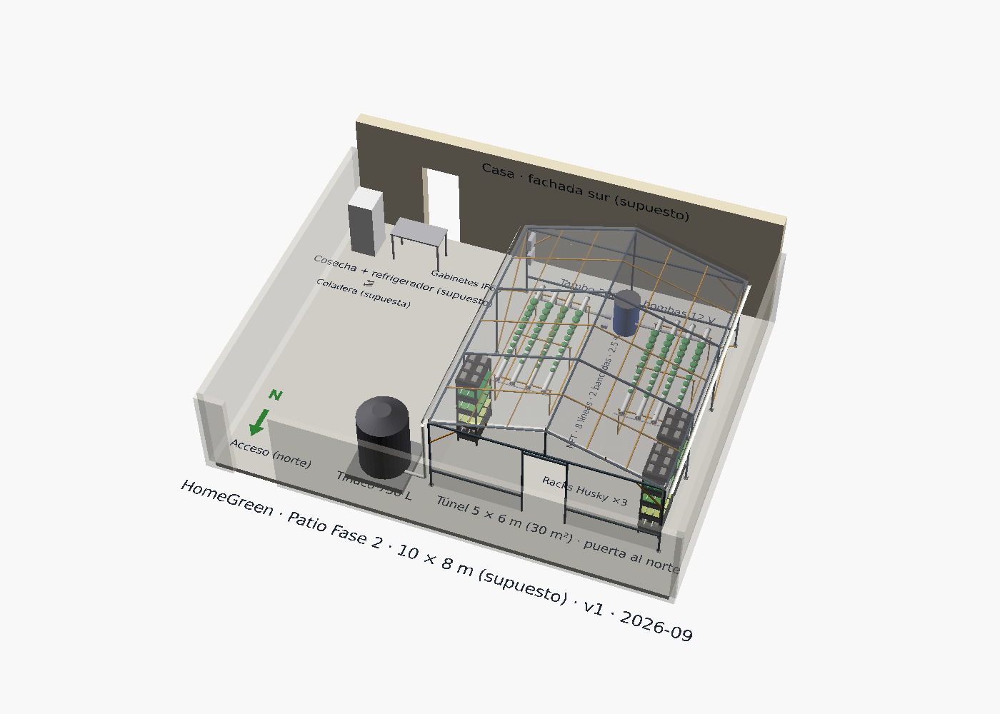

# Fase 3: consolidación y testbed agtech

**En una línea:** solo cuando las fases anteriores se pagan solas (G2→3 aprobado), el patio se
vuelve tu laboratorio: camas elevadas personales con goteo colgado de Home Assistant, un gantry
XY tipo FarmBot y visión con cámara fija — el postre y el banco de pruebas de percepción y
manipulación agtech, con presupuesto discrecional y cero presión comercial. No es el negocio.

!!! info "La fase en números"
    | | |
    |---|---|
    | **Objetivo** | Consolidar la operación (ayudante, SOPs, agente L3 nivel 2) y usar el huerto como testbed de agtech sin poner en riesgo la producción |
    | **Inversión** | **Discrecional**: sale de utilidades de Fase 2, nunca de deuda ni de la caja de enero; tope escrito por ti antes de empezar ([plan maestro](../../referencia/00-plan-maestro.md)) |
    | **Meta** | Cero presión comercial. Métrica de éxito: la producción de Fase 2 no baja ni una semana por culpa de los juguetes |
    | **Duración** | Mes 10 en adelante, un proyecto a la vez |
    | **Prerequisito** | [G2→3](../fase-2/gate.md): neto ≥ $12k/mes × 3 meses con ≤ 9 h/semana medidas |
    | **Gate de salida** | Ninguno (—): es la última fase del plan |

## Condiciones de entrada (todas, no la mayoría)

- [ ] **G2→3 aprobado con las dos métricas** el mismo trimestre; informe en `bitacora/gates/`
- [ ] **Ayudante en marcha** con SOP escrito con fotos (siembra, cosecha, lavado, empaque): la
      Fase 3 come horas del fundador y la regla anti-burnout sigue vigente (3 semanas > 18 h →
      recortar, empezando por los juguetes) ([07 §13](../../referencia/07-puntos-ciegos-y-riesgos.md))
- [ ] **Fondo de reposición de $10,000 completo** ($500/mes desde Fase 2) antes de gastar el
      primer peso discrecional ([07 §11](../../referencia/07-puntos-ciegos-y-riesgos.md))
- [ ] **Consumo eléctrico bajo control:** promedio anual < 220 kWh/mes en el recibo CFE. Si el
      gantry o la iluminación de las camas lo rebasan, **contrato PDBT (negocio) separado** antes,
      no después ([07 §1, §14](../../referencia/07-puntos-ciegos-y-riesgos.md))
- [ ] **Tope de gasto de Fase 3 escrito** en este archivo de tu copia (cifra y fecha), y un solo
      proyecto activo a la vez
- [ ] **V11 mensual y calibración quincenal** siguen en el calendario: los lazos de producción no
      se tocan para hacer experimentos

## Cómo se verá

??? note "Leyenda y notas clave del plano"

    --8<-- "assets/diagramas/layout/patio-fase-3.notas.md"

Todo lo de Fase 2 sigue en su lugar (túnel 5 × 6 m con racks y 8 líneas NFT, tambo, gabinetes,
tinaco con tlaloque, refrigerador y zona de cosecha). Lo nuevo va **fuera del túnel y fuera de la
ruta de producción**: camas elevadas con goteo, una de ellas con el gantry XY encima, y una
cámara fija apuntando a las camas y a las líneas NFT. El patio del dibujo es un supuesto de
10 × 8 m; lo que se conserva: nada de Fase 3 tapa la coladera, cruza el tendido del bus DC ni
quita paso al reparto ([layout del patio](../../diseno/layout-patio.md)).

[POR VERIFICAR: no hay render CAD específico de Fase 3 en el manifiesto de diagramas; el gantry y
las camas se modelan cuando se decida el primer proyecto (`hardware/cad/`).]

## Los tres proyectos (en el orden sugerido)

=== "1 · Camas elevadas con goteo desde HA"

    **Qué es:** 1–3 camas elevadas personales (jitomate, chile, hierbas de sol) con riego por
    goteo controlado por el nodo de riego v1 (un canal libre del relé de 4) y humedad de
    sustrato como en los racks.

    **Por qué primero:** cierra dos cabos sueltos de Fase 2 y casi no cuesta:

    - **Residuos:** produces 100–150 kg/mes de coco con raíces; la composta en tambo alimenta las
      camas (charola con fusarium: a la basura en bolsa cerrada, nunca a la composta) ([07 §12](../../referencia/07-puntos-ciegos-y-riesgos.md)).
    - **La periférica de 0.5 HP** que nunca fue bomba de NFT tiene aquí su único uso sensato:
      riego presurizado de las camas o trasiego cisterna→tinaco ([research/NFT §(c)](../../research/hidroponia-nft.md)).
    - Es el lazo L0 de riego que ya conoces, con otro sustrato.

    **Aprendizaje:** el curso Intagri "Manejo del riego y nutrición de hortalizas hidropónicas"
    ($1,113, 2 h 54 min) está enfocado a fruto: es de esta fase, no de la 2 ([research/libros-cursos](../../research/libros-cursos.md)).

    **Regla:** el goteo de las camas cuelga de HA pero NO del bus de batería: en un corte, el
    respaldo es solo para el NFT.

=== "2 · Gantry XY tipo FarmBot"

    **Qué es:** un pórtico cartesiano sobre una cama (perfil V-slot, motores NEMA 17, firmware
    GRBL o Klipper) con herramienta intercambiable: sembrado puntual, riego dirigido, cámara en
    el cabezal ([plan maestro §Fase 3](../../referencia/00-plan-maestro.md)).

    **Por qué segundo:** es el testbed de **manipulación**; el valor está en aprender cinemática,
    control de motores y una herramienta de siembra, no en producir.

    **Presupuesto:** [POR VERIFICAR: ninguna fuente de este repositorio cotiza perfil V-slot,
    NEMA 17, drivers ni electrónica de control; cotizar en las tiendas maker ya conocidas (UNIT
    Electronics, AG Electrónica) y Mercado Libre, y anotar en `bom/fase3.csv` antes de comprar.]

    **Reglas:** nunca sobre las líneas NFT ni sobre los racks de producción; alimentación desde
    el circuito con GFCI del patio, en su propio gabinete IP65; nada del gantry comparte fusiblera
    con el bus DC del NFT.

=== "3 · Visión con cámara fija"

    **Qué es:** cámara fija (la ESP32-CAM del BOM de Fase 2 o una IP) + modelo ligero en el
    cerebro para **cobertura foliar** por charola y **detección temprana de plagas** (pulgón,
    mosca blanca, moho) antes que el ojo humano ([plan maestro §Fase 3](../../referencia/00-plan-maestro.md)).

    **Por qué es el más valioso:** es el testbed de **percepción** y el único de los tres que
    devuelve algo a la producción: convierte la inspección visual diaria de L1 (2 min) en un
    dato de L0 y alimenta el informe semanal del agente L3 con evidencia.

    **Base ya comprada:** ESP32-CAM ($260) y el mini-PC ThinkCentre usado ($2,500–3,500), que
    "para HA + Grafana + futura visión (Frigate/ESP32-CAM) rinde mucho más que la Pi"
    ([research/electrónica](../../research/electronica-automatizacion.md)). Empieza con timelapse
    y detección de movimiento; el modelo de cobertura foliar viene después, con tu propio
    histórico de fotos etiquetadas por lote.

    **Lazo agéntico nivel 2** ([06 §L3](../../referencia/06-validacion-y-lazos-agenticos.md)):
    dar al agente acceso de *lectura* a la API de HA (incluidas las fotos) y permitirle abrir
    pull requests contra este repositorio con cambios a SOPs, densidades y setpoints propuestos;
    el merge lo haces tú. El PR es el mecanismo de aprobación: el agente nunca ejecuta compras
    ni cambia setpoints solo.

## Qué NO es la Fase 3

- **No es escalar m².** El techo real del negocio es energía (DAC), horas del fundador y agua
  (tandeo), no los 80 m². La escalera de escalamiento (precios → ayudante → LED con PDBT →
  segunda ubicación o alianza) va antes y aparte de cualquier juguete ([07 §14](../../referencia/07-puntos-ciegos-y-riesgos.md)).
- **No es retail.** Vender a Chedraui/La Europea exige alta en su portal, código de barras GS1
  y certificación tipo PrimusGFS o GLOBALG.A.P.; solo si algún día buscas retail, y no es este
  plan ([research/inocuidad §6](../../research/inocuidad-operativa.md)).
- **No es un tercer producto.** Las camas son personales; lo que sobre se regala a vecinos y
  chefs (baja el CAC y la fricción vecinal — [07 §9](../../referencia/07-puntos-ciegos-y-riesgos.md)).
- **No toca los lazos de producción.** Cualquier cambio a riego, dosificación o alarmas sigue
  el protocolo A/B V6: un cambio a la vez, con control, y se adopta solo si mejora ≥ 10 % la
  métrica primaria ([06 §V6](../../referencia/06-validacion-y-lazos-agenticos.md)).

## Ritmo

| Cuándo | Qué | Regla |
|---|---|---|
| Semana | Producción de Fase 2 intacta (siembra lun/jue, cosecha mar/vie, KPIs domingo) | Primero; sin excepción |
| 1 tarde/semana, máximo | El proyecto activo de Fase 3 | Si el timesheet pasa de 18 h tres semanas, el proyecto se pausa |
| Mensual | V11 + revisión del tope de gasto vs. lo gastado | El tope no se mueve dentro del proyecto |
| Trimestral | ¿El proyecto devolvió algo a producción (dato, hora ahorrada, merma evitada)? | Si no, se documenta y se cierra; se abre el siguiente |

## Páginas de la fase

| # | Página | Qué logras | Estado |
|---|---|---|---|
| 1 | Esta página | Condiciones de entrada, los tres proyectos, reglas y ritmo | Lista |
| 2 | Camas elevadas con goteo | Construcción, composta, canal de riego en el nodo v1 | [POR VERIFICAR: se escribe cuando el proyecto se elija; hoy no está en el mapa del sitio] |
| 3 | Gantry XY | BOM `bom/fase3.csv`, mecánica, firmware, herramienta de siembra | ídem |
| 4 | Visión | Cámara, captura por lote, etiquetado, modelo de cobertura foliar, lazo L3 nivel 2 | ídem |

## Fuentes

- [00-plan maestro §Fase 3 y filosofía](../../referencia/00-plan-maestro.md)
- [06-validación §L3 (nivel 2), §V6](../../referencia/06-validacion-y-lazos-agenticos.md)
- [07-puntos ciegos §1, §9, §11, §12, §13, §14](../../referencia/07-puntos-ciegos-y-riesgos.md) · [research/puntos-ciegos §(j), §(l)](../../research/puntos-ciegos.md)
- [research/electronica-automatizacion](../../research/electronica-automatizacion.md) (mini-PC para visión, ESP32-CAM) · [research/hidroponia-nft §(c)](../../research/hidroponia-nft.md) (periférica para camas)
- [research/inocuidad-operativa §6](../../research/inocuidad-operativa.md) (retail) · [research/libros-cursos](../../research/libros-cursos.md) (Intagri riego)
- [Fase 2 · Gate G2→3](../fase-2/gate.md)
