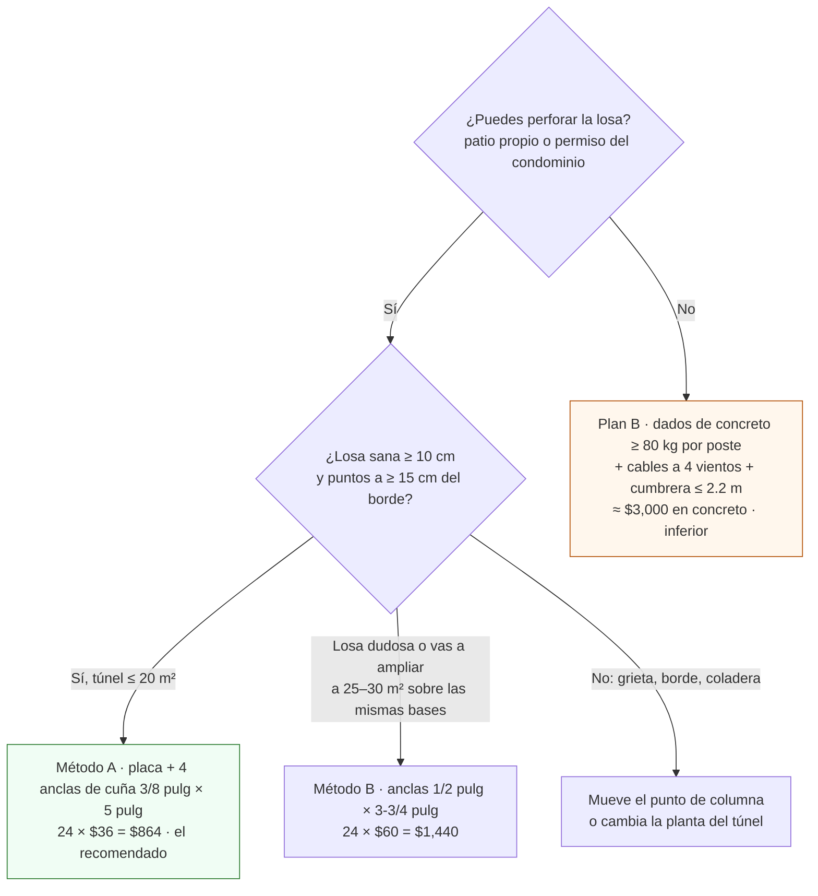

# Anclar el túnel a la losa

**En una línea:** fijas cada columna del túnel a la losa con una placa soldada y 4 anclas de cuña de 3/8" × 5", con el barreno limpio de polvo y el perímetro sellado — porque lo que se lleva un túnel en CDMX no es su peso, es la succión de una vela de ~20 m² con rachas de 50–80 km/h.

!!! info "Antes de empezar"
    - **Tiempo:** se hace dentro del día de **Montaje 1** (herrero + tú, 1 día); los 24 barrenos, anclas y sellado son tu parte (≈ medio día, estimado) · **Costo:** 24 anclas × $36 = **$864** + sellador PU ~$150 aprox. + placas/soldadura del herrero ~$400–800 aprox. ([research/instalacion-tunel-detalle §1](../research/instalacion-tunel-detalle.md)) · **Personas:** 2 mínimo (levantar pórticos), idealmente tú + herrero
    - **Necesitas:** 24 anclas de expansión de cuña 3/8" × 5" ([Home Depot](https://www.homedepot.com.mx/s/ancla%20de%20cu%C3%B1a), $36 c/u), rotomartillo ½" 650 W ([Truper PRO $660](https://www.homedepot.com.mx/p/truper-rotomartillo-1-2-650w-truper-pro-roto-1-2a7-231999)), broca de concreto de 3/8" [POR VERIFICAR: el juego de brocas de ~$215 trae ¼" y 5/16"; confirma que incluya 3/8" (10 mm) o cómprala suelta], sopladora o aspiradora + jeringa/pera para el barreno, llave de 9/16", nivel torpedo magnético, nivel de manguera o láser, calzas metálicas, marcador, sellador PU (Sikaflex) o silicón estructural, lentes y guantes ([04-herramientas](../referencia/04-herramientas.md), [compras Fase 1](../fases/fase-1/compras.md))
    - **Prerequisitos:** trazo con diagonales iguales hecho ([Fase 1 · Túnel, pasos 1–4](../fases/fase-1/tunel.md)); placas base soldadas por el herrero con 4 barrenos de 7/16"; decisión ① de [Antes de gastar un peso](../empieza-aqui/antes-de-gastar-un-peso.md) (¿puedes perforar la losa?); geometría en [Estructura del túnel](../diseno/estructura-tunel.md)

## Qué estás anclando y contra qué

A 80 km/h la presión dinámica del viento es ~300 Pa: sobre un costado de 5 × 2.2 m son ~330 kgf de empuje lateral, y la succión sobre el techo es del mismo orden (estimación del informe, no cálculo estructural). El túnel pesa 150–250 kg. Por eso la guía de Hydro Environment (citando a Oklahoma State University) insiste en que el anclaje debe evitar **tanto el desplazamiento lateral como el levantamiento o volteo**, y en que no se resuelve "únicamente aumentando el peso de las bases" ([research/instalacion-tunel-detalle §1](../research/instalacion-tunel-detalle.md)).

| Método | Qué es | Costo (túnel de 6 columnas) | Veredicto para rachas de 50–80 km/h |
|---|---|---|---|
| **A. Placa + ancla de cuña 3/8" × 5"** | Placa de solera 3/16"–¼" de 10–15 cm soldada al pie, 4 anclas por placa | $864 en anclas + herrero | **El recomendado.** Resiste tracción y cortante; se destuerce (desmontable) |
| B. Ancla de cuña ½" × 3-¾" | Igual, ancla más gruesa | $1,440 en anclas | Si la losa es mala o el túnel crece a 25–30 m² sobre las mismas bases; sobredimensionado para 15–20 m² |
| C. Soldar a herrería existente | Placas a castillos o barandal estructural | Solo mano de obra | Solo como complemento (p. ej. amarrar una cabecera al muro con taquetes) |
| D. Contrapesos sin perforar | Dados de concreto con el poste embebido o espárrago | ~$3,000 + cimbra | Solo en renta/condominio sin permiso; dados ≥ 80 kg por poste, cables a 4 vientos, cumbrera baja |

## Pasos

=== "Método A · placa + anclas de cuña (recomendado)"

    1. **Aprueba los 6 puntos antes de que el herrero suelde nada.** En cada marca del trazo verifica: losa sana (sin grieta ni desconchado), espesor ≥ 10 cm, ≥ 15 cm al borde de la losa, ninguna coladera ni registro debajo, y qué hay bajo el acabado (impermeabilización, tubería de la toma, drenaje, cableado). En patio a nivel de piso el riesgo es bajo; aun así cada ancla se sella después.
       *Criterio de listo:* los 6 puntos marcados con pintura y anotados en el croquis con "OK" y el desnivel de la losa en mm (nivel de manguera).
    2. **Recibe y revisa las placas** que soldó el herrero: solera de 3/16"–¼", 10–15 cm por lado (el modelo usa 100 × 100 mm), **4 barrenos de 7/16" (11 mm)** para el ancla de 3/8" (9.5 mm), fondo anticorrosivo y esmalte en los primeros 30 cm de columna.
       *Criterio de listo:* un ancla pasa por cada barreno con holgura pero sin bailar; la placa apoya plana sobre una superficie lisa.
    3. **Presenta el pórtico en sus marcas** entre 2 personas mínimo, plomea provisionalmente y **marca los 4 barrenos** de cada placa con marcador. Retira el pórtico. Hazlo pórtico por pórtico: no marques los 6 puntos con un pórtico y luego otro.
    4. **Perfora** con el rotomartillo en modo percusión y broca de concreto de 3/8", perpendicular a la losa. Profundidad = longitud de empotramiento + 1 cm: con el ancla de 5" y la placa de solera son **≈ 11 cm** [POR VERIFICAR: profundidad exacta según la ficha del ancla que compres; marca la broca con cinta a esa medida]. Lentes puestos: el concreto salta.
       *Criterio de listo:* una varilla o clavo metido al barreno marca la profundidad correcta en los 4 barrenos de la placa.
    5. **Limpia el polvo del barreno: sopla con jeringa o sopladora y aspira, dos veces.** El polvo reduce la carga de extracción del ancla **hasta a la mitad**; es el paso que casi todo el mundo se salta.
       *Criterio de listo:* la varilla sale limpia y no hay polvo asentado en el fondo (al soplar ya no sale nube).
    6. **Vuelve a presentar el pórtico** con la placa sobre los 4 barrenos. Pon rondana y tuerca en cada ancla al ras de la punta, métela por la placa y golpéala con martillo hasta que la rondana asiente sobre la placa. Deja las 4 tuercas **flojas**.
    7. **Plomea y nivela antes de apretar.** Nivel torpedo en dos caras de la columna; si la losa está desnivelada, calza la placa con **calzas metálicas**, nunca rellenando la losa. Verifica con nivel de manguera que el alero de esta columna queda a la misma altura que la anterior.
       *Criterio de listo:* plomo en las dos caras; alero nivelado entre columnas.
    8. **Aprieta a torque firme con la llave de 9/16" en cruz** (1-3-2-4), en dos pasadas. Al apretar, la cuña se expande y muerde el concreto.
       *Criterio de listo:* la tuerca deja de girar con fuerza normal de brazo, la placa no se levanta al hacer palanca con el pie y ningún ancla gira en su barreno (si gira, el barreno quedó grande o sucio: ver error típico) [POR VERIFICAR: torque de apriete en la ficha del ancla; si tienes torquímetro, úsalo].
    9. **Repite en las 6 columnas** y monta los contravientos (cruz de San Andrés en cada fachada larga + escuadras de esquina) **el mismo día**: es lo que realmente aguanta la racha ([Fase 1 · Túnel, paso 12](../fases/fase-1/tunel.md)).
    10. **Sella** el perímetro de cada placa y la cabeza de cada ancla con sellador PU o silicón estructural, y retoca pintura en soldaduras de campo. Las placas **no deben crear presas**: el agua del patio debe seguir corriendo hacia la coladera.
       *Criterio de listo:* cordón de sellador continuo en las 6 placas; vaso de agua vertido junto a una placa escurre hacia la coladera y no se estanca.
    11. **Foto de cada placa anclada** (las 6) para el issue "Túnel": es tu evidencia si algún día reclamas al herrero o al seguro.

=== "Método B · anclas de ½" (losa dudosa o ampliación)"

    Mismo procedimiento, con estas diferencias:

    - Ancla de expansión de cuña **½" × 3-¾"**, $60 c/u → $1,440 el túnel ([Home Depot](https://www.homedepot.com.mx/s/ancla%20de%20cu%C3%B1a)).
    - Placas con barrenos para ½" y **broca de concreto de ½"**: el rotomartillo de 650 W la mueve, pero más lento; barrenos de mayor diámetro = más polvo = más limpieza.
    - Empotramiento y profundidad de barreno según la ficha del ancla `[POR VERIFICAR: la ficha técnica viene en la caja y en el sitio del fabricante (Hilti, Fischer, Tornillos Marisa); anota marca, modelo, diámetro y profundidad en la bitácora antes de barrenar]`.
    - Úsalo si la losa se ve pobre (desconchados, agregado expuesto) o si la ampliación a 5 × 6 m de Fase 2 va a reutilizar estas mismas bases con más carga ([Estructura del túnel §2](../diseno/estructura-tunel.md)).

=== "Plan B · contrapesos sin perforar (renta / condominio)"

    Solo si **no te autorizan barrenar**. Es inferior y el informe lo dice: la guía de Hydro Environment advierte que el anclaje no se resuelve "únicamente aumentando el peso de las bases".

    1. **Dimensiona:** ≥ 80–100 kg por poste. Un dado colado en cubeta de 19 L pesa ~42 kg y **no basta**; un dado de cimbra 40 × 40 × 25 cm pesa ~85 kg. Saco de concreto premezclado 25 kg = $144 y rinde ~11–12 L; dado de 40 L ≈ 3.5 sacos ≈ $500; **6 dados ≈ $3,000** + cimbra ([Home Depot](https://www.homedepot.com.mx/s/cemento%20gris)).
    2. **Embebe el poste o un espárrago** en el dado al colar; para cimentación permanente el informe cita concreto ≥ 2,500 psi (~17 MPa).
    3. **Baja la cumbrera a ≤ 2.2 m**, triangula bien los largueros y añade **cables a los 4 vientos** por pórtico.
    4. **Cortinas abiertas en tormenta:** con contrapesos, el plástico cerrado es la vela que voltea el dado.
    5. Los dados ocupan piso, son pesados de mover y **no deben tapar coladeras**. Complemento útil: amarrar una cabecera al muro con taquetes al muro (método C).

    Registra en el issue "Túnel" que el anclaje es plan B y por qué: cuando el patio cambie o consigas permiso, migras a placas y anclas sin tirar la estructura.

!!! warning "Error típico: barreno sucio, ancla que gira"
    Si al apretar el ancla gira sin morder, el barreno quedó con polvo o sobredimensionado. No lo "arregles" con más vueltas: saca el ancla, aspira, y si el barreno está flojo mueve el punto 5 cm dentro de la placa (nuevo barreno de 7/16" en la placa) o sube a ancla de ½". Un tornillo cualquiera "en las 4 perforaciones" no es anclaje: placa + ancla de cuña + concreto sano tienen que ser compatibles con la carga.

!!! danger "Nunca"
    - Dejar el esqueleto **sin anclar una noche** ni el plástico puesto sin contravientos: la primera racha lo voltea.
    - Anclar a < 15 cm del borde de la losa o en concreto agrietado.
    - Apretar antes de plomear: la columna queda torcida y la cumbrera no cierra.
    - Perforar sin saber qué hay debajo: una tubería de agua o cableado bajo el acabado.

## Al terminar

- [ ] 6 placas × 4 anclas de cuña 3/8" × 5" apretadas en cruz; ninguna gira
- [ ] Cada columna a plomo en dos caras; aleros nivelados entre sí (nivel de manguera)
- [ ] Contravientos montados el mismo día: al empujar una esquina superior con el cuerpo, el marco no "cabecea"
- [ ] Perímetro de placas y cabezas de ancla sellados con PU; el agua del patio sigue llegando a la coladera
- [ ] Foto de las 6 placas en el issue "Túnel"
- Registrar: issue "Túnel" en GitHub con este checklist y las fotos ([cómo marcar avance](../empieza-aqui/como-usar-esta-guia.md)); si usaste plan B, anótalo ahí con la razón
- Siguiente paso: [Instalar canaleta y captación](instalar-canaleta-y-captacion.md) (antes del plástico) → [Tensar plástico y mallas](tensar-plastico-y-mallas.md)

## Fuentes

- [research/instalacion-tunel-detalle §1 (métodos de anclaje comparados, precios Home Depot, reglas prácticas) y §2 (secuencia de montaje)](../research/instalacion-tunel-detalle.md)
- [referencia/03-instalacion §1.1](../referencia/03-instalacion.md) — anclaje, plan B, viento
- [diseno/estructura-tunel](../diseno/estructura-tunel.md) — placa 100 × 100 mm, 6 columnas / 24 anclas, ampliación
- [referencia/04-herramientas](../referencia/04-herramientas.md) y [research/herramientas](../research/herramientas.md) — rotomartillo, brocas, nivel
- [fases/fase-1/tunel](../fases/fase-1/tunel.md) — trazo y montaje completo
- Guía del proveedor: [Cómo hacer un invernadero para casa: patio, terraza o azotea (Hydro Environment)](https://hydroenv.com.mx/como-hacer-un-invernadero-para-casa-patio-terraza-o-azotea/) — anclaje, cargas de viento, drenaje
