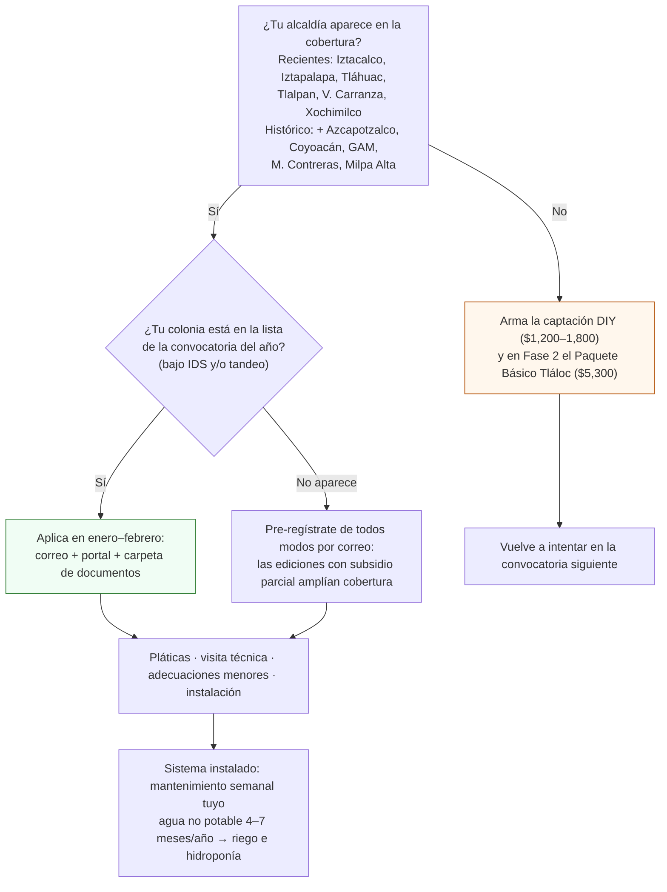

# Aplicar al programa Cosecha de Lluvia

**En una línea:** en enero–febrero registras tu domicilio ante SEDEMA (programascall@sedema.cdmx.gob.mx y el portal del programa); si tu colonia está en la cobertura, te instalan sin costo o con subsidio parcial un sistema de captación de ~$20,000 (tlaloque, filtros, tinaco) que es exactamente la captación pluvial que la Fase 1–2 compra por $1,200–5,300; si no califica, la armas tú y no perdiste más que un correo.

!!! info "Antes de empezar"
    - **Tiempo:** 1 h para armar la carpeta en diciembre; 15 min para el pre-registro; después, pláticas comunitarias y 2 visitas técnicas (SEDEMA e instalador) [POR VERIFICAR: duración y calendario exactos en la convocatoria del año] · **Costo:** $0 en la modalidad gratuita; copago en las ediciones con subsidio parcial [POR VERIFICAR: monto del copago] · **Personas:** 1 (el titular del predio)
    - **Necesitas:** INE vigente · CURP · comprobante de domicilio ≤ 3 meses · boleta predial (hasta 2 años) u Opinión Técnica de Uso de Suelo · correo electrónico · techo con área para captar (el del túnel: 15–30 m²) y espacio para tinaco · disposición a firmar carta compromiso y a dar mantenimiento semanal.
    - **Prerequisitos:** tandeo y alcaldía consultados en [Antes de gastar un peso §4](../empieza-aqui/antes-de-gastar-un-peso.md) · el diseño de captación de [Fase 1 · Agua](../fases/fase-1/agua.md) y [Canaleta y captación](instalar-canaleta-y-captacion.md) (el programa lo complementa, no lo sustituye en el arranque).

## ¿Calificas? Decide en 2 minutos

Cobertura según [research/agua-captacion §c](../research/agua-captacion.md) (convocatorias recientes, confirmadas vía prensa) y [research/normativa-fiscal §e](../research/normativa-fiscal.md) (histórico). [POR VERIFICAR: alcaldías y colonias exactas de la convocatoria 2027 en el [portal del programa](https://cosechalluvia.sedema.cdmx.gob.mx/); los portales de SEDEMA bloquearon la verificación automática en septiembre de 2026.]

## Qué te instalan y cómo encaja con tu diseño

| Elemento | Lo que da el programa | Lo que ya tienes o pones tú |
|---|---|---|
| Captación | Sistema tipo Isla Urbana: tlaloque (separador de primeras lluvias) + filtros + tinaco o cisterna, instalado por SEDEMA y su instalador | Canalón del túnel con pendiente 0.5–1 % y bajada ([Canaleta y captación](instalar-canaleta-y-captacion.md)) |
| Agua | **No potable**, 4–7 meses al año (lluvias de finales de mayo a inicios de octubre) | Es lo que el huerto necesita: riego e hidroponía no requieren potabilidad; EC ~0.02–0.06 mS/cm, la fuente premium para el NFT ([02 §2](../referencia/02-restricciones-y-requisitos.md)) |
| Mantenimiento | Semanal, a tu cargo (carta compromiso) | Limpieza del filtro de hojas y purga del tlaloque; entra en la rutina L1 |
| Valor | ~$20,000 de hardware sin costo (o con subsidio parcial) | Equivale al Paquete Básico Tláloc ($5,300) + tinaco Rotoplas 750 L ($2,051) + la instalación que la Fase 2 presupuesta ([01 §5](../referencia/01-proveedores-cdmx.md)) |

## Pasos

1. **Diciembre: arma la carpeta.** INE vigente, CURP, comprobante de domicilio de menos de 3 meses (el de enero lo renuevas), boleta predial de hasta 2 años u Opinión Técnica de Uso de Suelo. Escanea todo a PDF y guarda copias impresas. *Criterio de listo:* carpeta física y digital con los 4 documentos a nombre del titular del predio.
2. **Primera semana de enero: revisa la convocatoria.** Página del [programa](https://www.sedema.cdmx.gob.mx/programas/programa/cosecha-de-lluvia), [portal de registro](https://cosechalluvia.sedema.cdmx.gob.mx/) y [reglas de operación](https://www.sedema.cdmx.gob.mx/storage/app/media/DGCPCA/gacetareglas-de-operacion-del-programacosecha-de-lluvia.pdf). Confirma alcaldías, colonias, fechas y si hay modalidad de subsidio parcial. *Criterio de listo:* fecha de cierre y modalidad anotadas en el calendario.
3. **Pre-regístrate por correo a programascall@sedema.cdmx.gob.mx** con nombre, domicilio completo, colonia, alcaldía, teléfono y una línea sobre el uso ("vivienda con huerto urbano; riego"). Si el portal está abierto, completa también el registro en línea. *Criterio de listo:* correo enviado con acuse, o número de folio guardado.
4. **Asiste a las pláticas comunitarias** que cite SEDEMA y firma la carta compromiso. *Criterio de listo:* constancia o lista de asistencia firmada; carta compromiso en la carpeta.
5. **Recibe la visita técnica** (SEDEMA y luego el instalador). Ten listo el acceso al techo del túnel y al lugar del tinaco; muéstrales tu canalón y bajada. Haz las **adecuaciones menores** que pidan (base firme para el tinaco, un tramo de bajada) antes de la fecha de instalación. *Criterio de listo:* lista de adecuaciones cumplida y foto enviada si la piden.
6. **Instalación.** Presente el titular; verifica tlaloque, filtro y rebosadero a coladera. Pide el manual de mantenimiento. *Criterio de listo:* primera lluvia capturada sin fugas; fotos del sistema en la carpeta.
7. **Conecta al diseño del huerto y mide.** Flotador o sensor de nivel JSN-SR04T en el tinaco; EC y pH del agua captada (V7: la lluvia debe salir con EC ≪ 0.3 mS/cm); si toca producto que se vende, filtro de sedimentos + desinfección antes del riego final ([Cosechar y empacar](cosechar-y-empacar.md)). *Criterio de listo:* lectura de EC/pH anotada; agua de lluvia entrando al riego de microgreens y al depósito NFT.
8. **Mantenimiento semanal** (carta compromiso): purga el tlaloque tras cada lluvia, limpia el filtro de hojas, revisa el rebosadero. *Criterio de listo:* en el checklist L1 del lunes.

!!! tip "No dependas del programa para arrancar"
    La Fase 1 se construye en noviembre–enero ([Línea de tiempo](../empieza-aqui/linea-de-tiempo.md)) y la lluvia empieza a finales de mayo. Instala la captación DIY de $1,200–1,800 (canalón + separador casero + filtro de hojas) con el [manual Tláloc gratuito](https://www.engineeringforchange.org/wp-content/uploads/2020/07/MANUAL-INSTALACI%C3%93N-KIT-TL%C3%81LOC-12-JUNIO-2019CH.pdf); si el programa te instala, el DIY se convierte en la segunda bajada o se retira.

!!! warning "Errores típicos"
    - **Confundir convocatorias.** "Casa ecológica" (calentadores solares + captación, reportado en Coyoacán y Tlalpan) es un programa distinto; **Altépetl** no aplica a un patio urbano ([research/normativa-fiscal §e](../research/normativa-fiscal.md)).
    - **Llegar en marzo.** La ventana es enero–febrero; documentos listos desde diciembre.
    - **Comprobante de domicilio vencido** o predial a otro nombre: se rechaza en ventanilla.
    - **Contar con la iniciativa de "captación en las 16 alcaldías"** (SEGIAGUA, jun-2026): sigue en comisiones, no cambia la operación actual.
    - **Usar el agua captada en el riego final sin filtrar ni desinfectar.** Es agua no potable: filtro + cloro 0.2–1.5 ppm o UV antes de que toque producto que vendes ([research/inocuidad §4](../research/inocuidad-operativa.md)).

## Al terminar

- [ ] Carpeta con INE, CURP, comprobante ≤ 3 meses y predial (u Opinión Técnica) lista en diciembre
- [ ] Pre-registro enviado en enero–febrero con acuse o folio
- [ ] Pláticas asistidas y carta compromiso firmada
- [ ] Sistema instalado, rebosadero a coladera, fotos en la carpeta
- [ ] EC y pH del agua captada medidos (V7) y mantenimiento semanal en el checklist L1
- **Registrar:** folio, acuse y fechas en la carpeta de Semana 0; lecturas de EC/pH en el registro de agua de [V7](../validacion/v07-agua.md); si el programa no te aceptó, la fecha de la siguiente convocatoria en el calendario.
- **Siguiente paso:** [Fase 1 · Agua](../fases/fase-1/agua.md) (el riego corre 100 % desde el tinaco) y, en Fase 2, decidir si el Paquete Básico Tláloc sigue siendo necesario ([Fase 2 · Compras](../fases/fase-2/compras.md)).

## Fuentes

- [research/agua-captacion §c](../research/agua-captacion.md): qué es el programa, alcaldías recientes, requisitos, ventana enero–febrero, correo y portal, agua no potable 4–7 meses; [página del programa](https://www.sedema.cdmx.gob.mx/programas/programa/cosecha-de-lluvia), [portal](https://cosechalluvia.sedema.cdmx.gob.mx/), [reglas de operación](https://www.sedema.cdmx.gob.mx/storage/app/media/DGCPCA/gacetareglas-de-operacion-del-programacosecha-de-lluvia.pdf), [Nación321](https://www.nacion321.com/centro/como-puedes-inscribirte-al-programa-cosecha-de-lluvia-en-cdmx/), [gobierno.cdmx](https://gobierno.cdmx.gob.mx/noticias/sumate-al-programa-de-cosecha-de-lluvia/).
- [research/normativa-fiscal §e](../research/normativa-fiscal.md): cobertura histórica, subsidio parcial ([nota SEDEMA](https://www.sedema.cdmx.gob.mx/comunicacion/nota/busca-sedema-instalar-10-mil-sistemas-de-cosecha-de-lluvia-bajo-subsidio-parcial)), Altépetl no aplica.
- [02 · Restricciones §2](../referencia/02-restricciones-y-requisitos.md) y [01 · Proveedores §5](../referencia/01-proveedores-cdmx.md): tandeo, lluvia como fuente premium, Paquete Básico Tláloc $5,300, tinaco $2,051.
- [Antes de gastar un peso §4](../empieza-aqui/antes-de-gastar-un-peso.md) y [Línea de tiempo](../empieza-aqui/linea-de-tiempo.md): recordatorio de enero y calendario de Fase 1.
