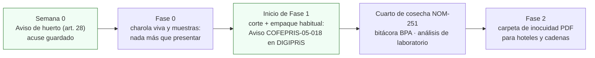

# Presentar los dos avisos: huerto urbano y COFEPRIS-05-018

**En una línea:** dos trámites gratuitos que no son permisos y no esperan aprobación: el aviso de huerto urbano a tu alcaldía (art. 28 de la Ley de Huertos Urbanos, Fase 0), que te da un acuse contra quejas vecinales y derecho a capacitación, y el Aviso de Funcionamiento COFEPRIS-05-018 en DIGIPRiS (inicio de Fase 1, cuando cortas y empacas de forma habitual), que es lo primero que pide el área de compras de un hotel.

!!! info "Antes de empezar"
    - **Tiempo:** aviso de huerto: 1 h de redacción + 1 visita a la alcaldía · aviso COFEPRIS: 1–2 h en línea [POR VERIFICAR: extensión del formulario en DIGIPRiS] · **Costo:** $0 y $0 ([02 §4](../referencia/02-restricciones-y-requisitos.md)) · **Personas:** 1
    - **Necesitas:** para la alcaldía: cuartilla con los datos del huerto por duplicado, identificación y comprobante de domicilio [POR VERIFICAR: documentos que pida tu Ventanilla Única] · para COFEPRIS: RFC del que factura, e.firma [POR VERIFICAR: DIGIPRiS se firma con e.firma], domicilio del establecimiento, descripción del giro y productos, nombre del propietario y del responsable.
    - **Prerequisitos:** [Antes de gastar un peso §5](../empieza-aqui/antes-de-gastar-un-peso.md) (lectura de los arts. 24 y 28) · RFC decidido ([Facturar CFDI](facturar-cfdi.md)) · cuarto de cosecha montado a la vara de la NOM-251 ([Cosechar y empacar](cosechar-y-empacar.md)) antes del aviso COFEPRIS.

## Los dos avisos en una tabla

| | Aviso de huerto urbano | Aviso de Funcionamiento COFEPRIS-05-018 |
|---|---|---|
| Fundamento | Art. 28, Ley de Huertos Urbanos CDMX ([texto en PAOT](https://paot.org.mx/centro/leyes-normas-htmls/ley-de-huertos-2382.html); [Reglamento 2023](https://paot.org.mx/centro/reglamentos/df/pdf/2023/RGTO_LEY_HUERTOS_CDMX_14_04_2023.pdf)); el art. 24 da a cualquier habitante el **derecho** a instalar un huerto en espacio de su propiedad o legítima posesión | Arts. 200 y 200 bis de la Ley General de Salud: "establecimiento de productos y servicios" ([gob.mx COFEPRIS](https://www.gob.mx/cofepris/acciones-y-programas/aviso-de-funcionamiento-de-responsable-sanitario-y-de-modificacion-o-baja)) |
| ¿Obligatorio? | Aviso simple de notificación | **Zona gris**: la producción primaria no; cortar, lavar y empacar de forma habitual sí encaja en los giros avisables (empacado de frutas y legumbres). Recomendación conservadora: preséntalo |
| Cuándo | **Fase 0**, Semana 0 | **Al iniciar Fase 1** (corte y empaque habituales) |
| Dónde | Ventanilla Única o área de medio ambiente de tu alcaldía [POR VERIFICAR: ventanilla y formato propio] | En línea, plataforma **DIGIPRiS** de COFEPRIS [POR VERIFICAR: la URL directa no está en la fuente de verdad; entra desde la página de avisos de COFEPRIS en gob.mx] |
| Costo | $0 | $0 |
| Respuesta | Acuse de recibo | Ninguna: es aviso, no permiso; no caduca; modificaciones y baja también se avisan |
| Qué te da | Escudo ante quejas vecinales; derecho a capacitación gratuita de la alcaldía y asesoría de SEDEMA | Proveedor formal ante hoteles y cadenas; el papel que un verificador usa junto con la NOM-251 |

## Lo que NO necesitas (y te van a querer vender)

| Trámite | Por qué no | Fuente |
|---|---|---|
| Licencia sanitaria o registro de producto | No existen para vegetales frescos | [research/normativa-fiscal §b](../research/normativa-fiscal.md) |
| Aviso SIAPEM / certificado de uso de suelo | Sin local abierto al público no eres establecimiento mercantil; solo si algún día pones mostrador | [02 §4](../referencia/02-restricciones-y-requisitos.md) |
| Certificación SENASICA SRRC/BPA | Voluntaria; usa los [manuales BPA gratuitos](https://www.gob.mx/senasica/documentos/manuales-buenas-practicas-agricolas) como guion de tu bitácora | ídem |
| NOM-051 (etiquetado) | No aplica en B2B (insumo, no preenvasado al consumidor final) | ídem |
| Seguro RC de producto | No obligatorio; cotizar en Fase 2 solo si un hotel lo pide | ídem |

## Pasos A: aviso de huerto urbano (Fase 0)

1. **Lee los arts. 24 y 28** en el [texto de PAOT](https://paot.org.mx/centro/leyes-normas-htmls/ley-de-huertos-2382.html) y el trámite en el [Reglamento 2023](https://paot.org.mx/centro/reglamentos/df/pdf/2023/RGTO_LEY_HUERTOS_CDMX_14_04_2023.pdf). *Criterio de listo:* sabes qué datos pide el aviso. [POR VERIFICAR: numeración vigente de los artículos tras reformas.]
2. **Redacta una cuartilla:** nombre, domicilio, superficie del huerto en m², cultivos (microgreens y hierbas), sistema (rack bajo techo; en Fase 1 túnel ligero con captación pluvial), fecha de inicio y contacto. Firma. *Criterio de listo:* impreso por duplicado.
3. **Entrégalo en la Ventanilla Única** (o área de medio ambiente) y pide que sellen tu copia. Pregunta si tienen formato propio y por la capacitación gratuita. *Criterio de listo:* copia con sello y fecha en la carpeta de Semana 0.
4. **Anota la convocatoria de la [Escuela de Huertos Urbanos de SEDEMA](https://www.sedema.cdmx.gob.mx/comunicacion/nota/sedema-lanza-convocatoria-para-el-seminario-taller-escuela-de-huertos-urbanos)** (~febrero) en el calendario. *Criterio de listo:* recordatorio puesto.

## Pasos B: Aviso de Funcionamiento COFEPRIS-05-018 (inicio de Fase 1)

1. **Confirma que ya cortas y empacas de forma habitual** (clamshells cada semana, no solo charola viva). Si solo vendes charola viva, el producto es una planta viva y la carga sanitaria es mínima; puedes esperar. *Criterio de listo:* decisión anotada con fecha.
2. **Ten el cuarto de cosecha a la vara de la NOM-251** antes de avisar: zona de corte separada, mesa inox o polietileno, lavamanos, bitácora de limpieza firmada, control de fauna ([Cosechar y empacar](cosechar-y-empacar.md), [texto NOM-251](https://sidof.segob.gob.mx/notas/5133449)). El aviso es lo que un verificador usa para presentarse. *Criterio de listo:* checklist de NOM-251 completo.
3. **Reúne los datos del aviso:** RFC y nombre del propietario (el mismo que factura), domicilio del establecimiento (tu patio), giro (empacado de frutas y legumbres / productos y servicios) [POR VERIFICAR: clave de giro que ofrece el formulario], productos (microgreens y hierbas frescas cortadas y empacadas), responsable [POR VERIFICAR: si el giro requiere responsable sanitario; para vegetales frescos normalmente no]. *Criterio de listo:* datos en una hoja antes de abrir el navegador.
4. **Entra a DIGIPRiS desde la [página de avisos de COFEPRIS](https://www.gob.mx/cofepris/acciones-y-programas/aviso-de-funcionamiento-de-responsable-sanitario-y-de-modificacion-o-baja)**, elige "Aviso de Funcionamiento" (formato COFEPRIS-05-018) y llena el formulario. Guías paso a paso de terceros: [BPack](https://bpack.mx/blog/aviso-funcionamiento-cofepris-alimentos) y [Trámite CA Digital](https://www.tramitecadigital.com/sat-impuestos-y-empresas/empresas-y-negocios/aviso-funcionamiento-cofepris/). *Criterio de listo:* acuse descargado en PDF. No esperes respuesta: no la hay.
5. **Toma el curso gratuito de COFEPRIS** [Control sanitario de frutas y hortalizas frescas y/o mínimamente procesadas](https://cursos.aprende.gob.mx/courses/course-v1:COFEPRIS+CSDF26041X+2026_04/about) y un curso de Manejo Higiénico de Alimentos (el estándar del Distintivo H) [POR VERIFICAR: proveedor y costo del curso de manejo higiénico]. *Criterio de listo:* constancias en la carpeta.
6. **Mete el acuse a la carpeta de inocuidad** junto con los análisis de laboratorio (Quibimex o LANISAF) y la bitácora BPA: es el paquete que pide compras de un hotel ([research/inocuidad §6](../research/inocuidad-operativa.md), [Mock recall](mock-recall.md)). *Criterio de listo:* PDF único de 8–10 páginas con el acuse en la página 2.
7. **Avisa modificaciones y baja** por la misma vía si cambias de domicilio, giro o cierras. *Criterio de listo:* cada cambio con su acuse.

!!! warning "Errores típicos"
    - **Buscar "licencia sanitaria" o pagar a un gestor.** No existe licencia para vegetales frescos; el aviso es gratuito y en línea.
    - **Presentar el aviso con un RFC distinto al que factura.** El hotel cruza acuse, CFDI y Constancia de Situación Fiscal.
    - **Avisar antes de tener el cuarto de cosecha en regla.** El aviso te vuelve verificable; la NOM-251 es la vara.
    - **Esperar una "aprobación".** Es un aviso: el acuse es todo.
    - **Confundir aviso de huerto con SIAPEM.** Sin mostrador ni atención al público no hay aviso de establecimiento mercantil.
    - **Vender germinados (alfalfa, soya) al amparo del mismo aviso** sin protocolo serio: categoría de alto riesgo mundial; los microgreens se cortan sobre el sustrato ([02 §4](../referencia/02-restricciones-y-requisitos.md)).

## Al terminar

- [ ] Copia sellada del aviso de huerto en la carpeta de Semana 0
- [ ] Cuarto de cosecha con checklist NOM-251 completo antes del aviso COFEPRIS
- [ ] Acuse del Aviso de Funcionamiento COFEPRIS-05-018 en PDF, con el mismo RFC que factura
- [ ] Constancias de los cursos (COFEPRIS + manejo higiénico) en la carpeta
- [ ] Carpeta de inocuidad iniciada (acuse + análisis + bitácora BPA)
- **Registrar:** fechas y folios de ambos acuses en la carpeta de Semana 0 (son PDF, no filas de bitácora; guárdalos junto a los análisis de laboratorio). En `bitacora/limpieza.csv` (`fecha,que,sanitizante,concentracion,operador`) sigue la hoja de limpieza que la NOM-251 exige ([Lavar y desinfectar](lavar-y-desinfectar-charolas.md)).
- **Siguiente paso:** análisis de agua y producto al arrancar Fase 1 ([research/inocuidad §3](../research/inocuidad-operativa.md)); [Mock recall](mock-recall.md) antes de la primera auditoría de un hotel.

## Fuentes

- [research/normativa-fiscal §b, §d y §e](../research/normativa-fiscal.md): COFEPRIS-05-018 (gratuito, DIGIPRiS, aviso, no caduca), zona gris del empacado, Ley de Huertos Urbanos arts. 24 y 28, SIAPEM no aplica, capacitación SEDEMA.
- [02 · Restricciones §4](../referencia/02-restricciones-y-requisitos.md): tabla de trámites y lo que no es obligatorio.
- [Antes de gastar un peso §5](../empieza-aqui/antes-de-gastar-un-peso.md): redacción y entrega del aviso de huerto.
- [research/inocuidad-operativa §4 y §6](../research/inocuidad-operativa.md): NOM-251 en el cuarto de cosecha, Distintivo H, paquete documental de hoteles; [NORMEX](https://www.normex.com.mx/inocuidad.php).
- [Fase 0 · Gate](../fases/fase-0/gate.md) y [Fase 1 · Gate](../fases/fase-1/gate.md): el aviso COFEPRIS como pendiente al iniciar Fase 1.
