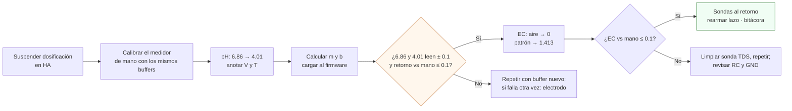

# Calibrar las sondas de pH y EC

**En una línea:** cada quince días sacas las sondas del retorno, calibras el pH a dos puntos con buffers 4.01 y 6.86 y la EC contra el patrón de 1.413 mS/cm, contrastas con el medidor de mano (≤ 0.1 de diferencia) y anotas voltajes y pendiente — porque una sonda barata no falla callando, falla **mintiendo**, y el lazo dosifica sobre lo que la sonda dice.

!!! info "Antes de empezar"
    - **Tiempo:** ~30 min (estimado) **cada 15 días**, como evento de `calendar.huerto` con alarma; +30 min la primera vez (offset de la placa y medidor de mano) · **Costo:** buffer pH 4.01 120 mL **$40** ×2/año ([Insumos Cerveceros](https://insumoscerveceros.mx/inicio/1305-solucion-para-calibracion-de-ph-buffer-401-120-ml.html)), sobres 6.86 ~$15 aprox. ×10 ([Mercado Libre](https://listado.mercadolibre.com.mx/solucion-buffer-para-calibrar-ph)), patrón EC 1.413 mS/cm Hanna HI7031L 500 mL **$459.36** ([Hanna México](https://hannainst.com.mx/soluci%C3%B3n-de-calibraci%C3%B3n-de-ce-1-413-%C2%B5s-3-cm-valor-hi7031l), caduca 5 años cerrada) → ~$650/año; + electrodo de pH de repuesto anual ~$400–600 → **~$1,050/año** ([06 resumen operativo](../referencia/06-validacion-y-lazos-agenticos.md)) · **Personas:** 1
    - **Necesitas:** los tres patrones, agua destilada, 3 vasos limpios etiquetados (4.01 / 6.86 / EC), papel absorbente, medidor pH + TDS/EC de mano (~$450 aprox., [ML](https://listado.mercadolibre.com.mx/medidor-ph-tds-ec)) como **árbitro**, acceso al panel del nodo NFT en Home Assistant y al YAML de ESPHome, la bitácora
    - **Prerequisitos:** nodo v2 flasheado ([Flashear ESPHome](flashear-esphome.md)) y sondas instaladas en el retorno ([Dosificación v2 §B](../fases/fase-2/dosificacion-v2.md)); tabla de pines y entidades en [Firmware ESPHome](../software/firmware.md) y [Datos §2](../diseno/datos.md)

## Los números del firmware que usa esta guía


| Qué | Valor | Dónde está definido |
|---|---|---|
| Entrada de pH (AT-1) | **GPIO34** (ADC1_6), `attenuation: 12db`, filtro RC 1 kΩ / 100 nF; salida Po de la placa PH-4502C **≤ 3.1 V** en todo el rango | [Eléctrico · tabla de pines](../diseno/electrico.md), [Firmware](../software/firmware.md) |
| Entrada de EC (AT-2) | **GPIO35** (ADC1_7), SEN0244 AOUT vía RC; se calibra **en mS/cm** directo, no en ppm | ídem |
| Temperatura de solución (TT-2) | DS18B20 en GPIO4, `sensor.temperatura_solucion` | ídem |
| Entidades en HA | `sensor.ph_nft`, `sensor.ec_nft`; voltaje crudo de cada sonda [POR VERIFICAR: nombre exacto de las entidades de voltaje en firmware.md; esta guía las llama `pH NFT voltaje` y `EC NFT voltaje`] | [Datos §2](../diseno/datos.md) |
| Patrones | pH **4.01** y **6.86** (el 6.86 es el estándar de las sondas DFRobot); EC **1.413 mS/cm** a 25 °C (a otra temperatura, tabla de la etiqueta) | [research/hidroponia-nft §g](../research/hidroponia-nft.md) |
| Tolerancia de aceptación | sonda fija vs medidor de mano **≤ 0.1 pH** y **≤ 0.1 mS/cm** | [Dosificación v2 §A](../fases/fase-2/dosificacion-v2.md) |
| Bandas de operación | pH 5.8–6.2 · EC 1.2–1.8 mS/cm | [06 L0](../referencia/06-validacion-y-lazos-agenticos.md) |
| Watchdog "sonda no confiable" | sin cambio en 24 h con dosis hechas, o salto > 1.5 unidades en 5 min → dosificación suspendida; **rearme manual** tras calibrar | [06 watchdogs](../referencia/06-validacion-y-lazos-agenticos.md), [Control · Lazo 2](../diseno/control.md) |
| Vida del electrodo de pH | cambio **anual**; caduca a los 12–18 meses aunque no se use (no lo compres antes de tiempo) | [research/electronica-automatizacion §3](../research/electronica-automatizacion.md) |

El ESP32 lee un voltaje; la calibración es la recta que convierte ese voltaje en pH (o mS/cm). Dos puntos definen la recta: por eso son dos buffers.



## Pasos

### A. Preparar (5 min)

1. **Suspende la dosificación automática en HA** antes de tocar nada [POR VERIFICAR: nombre del interruptor de mantenimiento en [Home Assistant](../software/home-assistant.md)]. Si no lo haces, sacar la sonda del agua produce un salto > 1.5 y el watchdog la marca "no confiable" de todos modos; mejor que sea a propósito. La bomba de recirculación **sigue**: las raíces no esperan.
2. **Sirve los patrones en los vasos etiquetados**; nunca metas la sonda en el frasco. El sobre de 6.86 se disuelve en agua destilada en el volumen que indica el sobre; el 4.01 y el 1.413 se sirven tal cual. Anota la temperatura de los vasos (deben estar a la del ambiente, cerca de 25 °C; si no, usa la tabla de la etiqueta).
3. **Calibra primero el medidor de mano** con los mismos buffers, según su manual. Es el árbitro: si el árbitro está descalibrado, todo lo que sigue es ruido.

### B. pH a dos puntos (10 min)

4. **Saca el electrodo del retorno**, enjuágalo con agua destilada y **seca por contacto** con papel (nunca frotes el bulbo: se carga estáticamente y tarda minutos en estabilizar).
5. **Buffer 6.86:** sumerge, agita suave 5 s y espera a que el voltaje crudo deje de moverse (típicamente 1–2 min). Anota **V₆.₈₆** y la temperatura.
6. **Enjuaga y seca. Buffer 4.01:** igual. Anota **V₄.₀₁**.
7. **Calcula la recta** (pH = m·V + b):

    ```text
    m = (6.86 − 4.01) / (V₆.₈₆ − V₄.₀₁)        # pendiente, pH por volt (negativa en la PH-4502C)
    b = 6.86 − m · V₆.₈₆                        # offset
    ΔV = V₄.₀₁ − V₆.₈₆                          # "salud" del electrodo: anótala SIEMPRE
    ```

    La primera vez, con el electrodo nuevo, **ΔV es tu referencia**: las calibraciones siguientes se comparan contra ella (ver "cuándo cambiar el electrodo").

8. **Carga la calibración al firmware.** Tres formas; la que usa tu nodo está en [Firmware](../software/firmware.md) [POR VERIFICAR: cuál implementa `nodo-nft-v2.yaml`]:

    === "Opción A · `calibrate_linear` (reflasheo OTA)"

        ```yaml
        # firmware/esphome/nodo-nft-v2.yaml — fragmento ilustrativo; sustituye los V por los tuyos
        sensor:
          - platform: adc
            pin: GPIO34
            attenuation: 12db
            name: "pH NFT"
            id: ph_nft
            update_interval: 5s
            filters:
              - median: { window_size: 15, send_every: 5 }
              - calibrate_linear:
                  - V_6_86 -> 6.86    # p. ej. 2.52 -> 6.86
                  - V_4_01 -> 4.01    # p. ej. 3.05 -> 4.01
        ```

        Cambia los dos pares, guarda y envía por OTA. Sencillo, pero cada calibración es un commit y un reflasheo.

    === "Opción B · offset y pendiente como `number` en HA (sin reflashear)"

        El firmware expone `number.ph_pendiente` y `number.ph_offset` (o equivalentes) y aplica `pH = m·V + b` en una lambda; tú escribes m y b desde el panel de HA y quedan guardados en el ESP32 (`restore_value: true`). Es la forma que no depende de tener la laptop en el patio [POR VERIFICAR: nombres de las entidades en firmware.md].

    === "Opción C · componente r0bb10 (sonda DFRobot, etapa 2)"

        Cuando el NFT venda y pases al kit DFRobot Gravity ($1,250 aprox., [Geek Factory](https://www.geekfactory.mx/producto/kit-sensor-de-ph-para-arduino-gravity-dfrobot/)), el componente externo [ESPHome-DFRobot-pH-Meter](https://github.com/r0bb10/ESPHome-DFRobot-pH-Meter) hace la calibración de 2/3 puntos con **botones en HA**, compensa temperatura y guarda en EEPROM; se instala con 6 líneas de `external_components` ([research/tutoriales-videos §d](../research/tutoriales-videos.md)). Plan B minimalista con `calibrate_linear` puro: [hilo de la comunidad de HA](https://community.home-assistant.io/t/implementing-analog-ph-sensor-of-dfrobot/714202).

9. **Verifica la recta:** con la calibración cargada, vuelve a meter el electrodo en 6.86 y luego en 4.01 (enjuagando entre ambos): `sensor.ph_nft` debe leer cada buffer **± 0.1**. Luego, sonda en el retorno y medidor de mano en la misma agua: **diferencia ≤ 0.1**.
   *Criterio de listo:* los tres números dentro de tolerancia. Si no: buffer nuevo y repetir; si vuelve a fallar, ve a "cuándo cambiar el electrodo".

!!! tip "Primera vez: el offset de la placa PH-4502C"
    La placa trae un potenciómetro de offset. Con el electrodo en el buffer 4.01 (el punto de voltaje más alto en esta placa), ajusta el potenciómetro hasta que Po quede **≤ 3.1 V**: es el rango útil del ADC con `attenuation: 12db` ([Eléctrico](../diseno/electrico.md)). Si Po se sale del rango, el ESP32 lee saturado y "calibra" sobre una pared. No vuelvas a tocar el potenciómetro después: solo cambia m y b.

### C. EC contra patrón (10 min)

10. **Enjuaga la sonda TDS** con destilada y sécala. **En el aire** debe leer **0**: anota el voltaje en aire (V_aire). Si en aire lee distinto de 0, hay ruido en el ADC (revisa el RC y la tierra común) o la sonda está sucia.
11. **Patrón 1.413 mS/cm:** sumerge solo la punta hasta la marca, espera a que estabilice, anota **V₁.₄₁₃** y la temperatura. Carga la recta (V_aire → 0.0, V₁.₄₁₃ → 1.413) con la misma opción que el pH. El patrón vale 1.413 **a 25 °C**; si tu vaso está a otra temperatura, usa el valor de la tabla de la etiqueta del frasco. El firmware compensa la lectura de operación con TT-2 [POR VERIFICAR: coeficiente y fórmula en firmware.md; TDS ≈ EC × 0.5–0.7 si el nodo reporta ppm en algún punto].
12. **Verifica:** `sensor.ec_nft` en el patrón = 1.413 ± 0.1; en el retorno, sonda vs medidor de mano **≤ 0.1 mS/cm**.

### D. Cerrar (5 min)

13. **Enjuaga las dos sondas** y regrésalas al retorno, en la misma posición (boca del retorno dentro del tambo, nunca junto a las peristálticas), con los cables por la prensaestopa y el conector hacia arriba.
14. **Espera lecturas estables** (mediana de 30 s en HA) y **rearma la dosificación** (rearme manual, [Control · Lazo 2](../diseno/control.md)). Vigila la primera hora: ninguna dosis fuera del tiempo muerto de 10–15 min.
15. **Tira los buffers usados** (no regresan al frasco), tapa bien los frascos, anota la fecha de apertura, y programa el siguiente evento en `calendar.huerto` a 15 días.

## Cómo saber que una sonda miente

Las sondas baratas fallan **mintiendo**, no callando: dan un número plausible que ya no tiene relación con el agua. Señales, de la más automática a la más manual:

| Señal | Qué la detecta | Qué hacer |
|---|---|---|
| pH o EC **no cambian en 24 h** aunque hubo dosis | Watchdog (HA) → "no confiable", dosificación suspendida, alarma | Calibrar; si no pasa la verificación, electrodo |
| **Salto > 1.5 unidades en 5 min** | Watchdog | Casi siempre sonda fuera del agua, cable o conector; revisar, calibrar, rearmar |
| **mL dosificados/día > 2× el promedio de 7 días** | Watchdog de deriva | Sonda que lee bajo (pH) o baja (EC) y el lazo persigue un fantasma; contrastar con el medidor de mano **hoy**, no en la quincena |
| Sonda fija vs medidor de mano **> 0.1** en el retorno | Tú, cada quincena (o cuando algo se vea raro) | Calibrar; si tras calibrar sigue > 0.1, electrodo |
| Lectura que **tarda cada vez más en estabilizar** en el buffer, o que sigue derivando dentro del buffer | Tú, al calibrar | Electrodo envejecido; planear el cambio |
| **ΔV cayó** claramente respecto a la primera calibración (electrodo nuevo) | Tú, comparando la bitácora | Electrodo agotado [POR VERIFICAR: umbral en la ficha del E201/DFRobot; práctica de laboratorio: rechazar pendientes muy por debajo de la teórica] |
| pH salta cuando la sonda TDS está energizada, o viceversa | Tú, en el dry-run | Interferencia entre dos sondas analógicas en la misma agua [POR VERIFICAR en el dry-run de dosificación: separar físicamente, alternar lecturas o aislar una de las dos] |
| Plantas que "no responden" a una solución en banda | Rendimiento (L2) | La sonda o el agua base mienten: V7 al agua y calibración fuera de calendario |

**Cuándo cambiar el electrodo de pH** (el consumible caro):

- **Cada año, siempre**, aunque "se vea bien" ([00-plan-maestro](../referencia/00-plan-maestro.md)): presupuestado en los ~$1,050/año.
- Antes, si tras dos calibraciones con buffer nuevo no pasa el ≤ 0.1, si tarda muchos minutos en estabilizar, o si ΔV cayó frente al día 1.
- **No compres el repuesto por adelantado:** el electrodo caduca a los 12–18 meses **aunque no se use**. Compra al mes 10–11 del que está instalado.
- La sonda TDS no tiene bulbo de vidrio: se limpia y dura; si en aire ya no lee 0 después de limpiarla, se cambia (~$450 aprox., [UNIT](https://uelectronics.com/producto/sensor-tds-meter-v1-0-analogico-sen0244/)).

!!! warning "Error típico: calibrar 'cuando se vea raro'"
    La deriva es lenta e invisible; para cuando "se ve raro", el lazo llevó una semana dosificando de más. Quincenal en el calendario con alarma, y la calibración el mismo día que el cambio de solución: la sonda decide la dosis del tanque nuevo.

!!! warning "Error típico: frotar el bulbo, o guardarlo seco"
    Secar el bulbo frotando lo carga y da lecturas que tardan minutos en asentarse; guardarlo seco o en agua destilada lo arruina. Entre usos, siempre húmedo (en el retorno o con su capuchón con solución de almacenamiento). Aquí el electrodo vive en el retorno: el riesgo es la quincena en que lo sacas y lo dejas en la mesa.

!!! warning "Error típico: rearmar sin verificar"
    Volver a activar la dosificación después de una "sonda no confiable" sin calibrar y contrastar es apostar el cultivo a un número aleatorio ([Control · errores típicos](../diseno/control.md)).

## Al terminar

- [ ] Medidor de mano calibrado con los mismos buffers
- [ ] pH: V₆.₈₆, V₄.₀₁, m, b y ΔV anotados; 6.86 y 4.01 leen ± 0.1 con la recta cargada; retorno vs mano ≤ 0.1
- [ ] EC: V_aire = 0, V₁.₄₁₃ anotado con temperatura; patrón lee 1.413 ± 0.1; retorno vs mano ≤ 0.1
- [ ] Sondas de vuelta en la boca del retorno; dosificación rearmada; primera hora sin dosis fuera de tiempo muerto
- [ ] Siguiente calibración en `calendar.huerto` (+15 días); buffers usados desechados
- Registrar en `bitacora/nft.csv`: `evento=calibracion`, `temp_solucion_C`, y en `observaciones`: `pH V6.86=… V4.01=… m=… b=… dV=… mano=… | EC Vaire=… V1413=… T=… mano=… | electrodo instalado AAAA-MM-DD` (así el ΔV de hoy se compara con el del día 1)
- Siguiente paso: [Cambiar la solución del NFT](cambiar-solucion-nft.md) (el mismo día, si toca) o [Preparar la solución](preparar-solucion-nutritiva.md)

## Fuentes

- [referencia/06-validacion](../referencia/06-validacion-y-lazos-agenticos.md) — calibración quincenal con 4.0/6.86 y 1.413, watchdog de sonda no confiable, deriva de dosificación, presupuesto ~$1,050/año
- [referencia/03-instalacion §2.2](../referencia/03-instalacion.md) — calibración quincenal, cambio de sonda anual, sondas en el retorno
- [research/hidroponia-nft §g](../research/hidroponia-nft.md) — buffers 4.01 (Insumos Cerveceros), sobres 6.86, patrón Hanna HI7031L, presupuesto anual
- [research/electronica-automatizacion §3](../research/electronica-automatizacion.md) — PH-4502C en dos etapas, SEN0244 en mS/cm, caducidad del electrodo, medidor de mano como árbitro (`bom/fase2.csv`)
- [research/tutoriales-videos §d](../research/tutoriales-videos.md) — componente r0bb10, hilo de calibrate_linear
- [diseno/electrico](../diseno/electrico.md) (GPIO34/35, 12db, RC, Po ≤ 3.1 V) · [diseno/control](../diseno/control.md) (Lazo 2, rearme manual) · [diseno/datos §2](../diseno/datos.md) (entidades) · [fases/fase-2/dosificacion-v2](../fases/fase-2/dosificacion-v2.md) (tolerancia ≤ 0.1, rutina)
