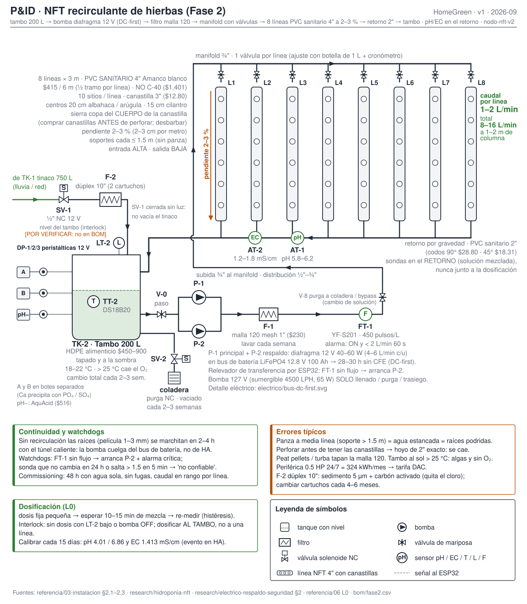
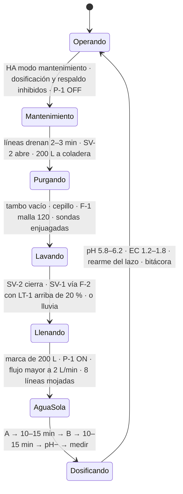

# Cambiar la solución del NFT

**En una línea:** cada 2–3 semanas paras la bomba, purgas los 200 L a la coladera, lavas tambo y filtro, rellenas con lluvia o agua sin cloro, preparas solución nueva y rearmas el lazo — con el menor tiempo posible sin recirculación, porque los micronutrientes se desbalancean aunque la EC "se vea bien" y las raíces en película no aguantan 2–4 h con el túnel caliente.

!!! info "Antes de empezar"
    - **Tiempo:** ~1.5–2 h en total (estimado): purga y lavado ~30 min (objetivo de esta guía: **≤ 30 min sin flujo**), llenado 20–30 min, solución nueva ~45 min con sus esperas. Hazlo **temprano en la mañana o al atardecer**, nunca al mediodía con el túnel caliente · **Costo:** ~$70 de fórmula genérica por tanque (≈ $40 con costal, $18–30 con sales A/B) + 200 L de agua ([Preparar la solución](preparar-solucion-nutritiva.md)) · **Personas:** 1
    - **Necesitas:** todo lo de [Preparar la solución nutritiva](preparar-solucion-nutritiva.md) (nutriente pesado, cubetas A/B, pH−, medidor de mano calibrado), cepillo de cerda suave, cubeta, H2O2 al 3 % (solo si hay biofilm o algas), manguera, guantes, el tinaco con **≥ 40 % (≥ 300 L)** en `LT-1`, acceso a HA
    - **Prerequisitos:** sondas calibradas ese mismo día o dentro de la quincena ([Calibrar sondas](calibrar-sondas-ph-ec.md)); secuencia y tags en [Hidráulico §5.3](../diseno/hidraulico.md); rutina en régimen en [Dosificación v2 §E](../fases/fase-2/dosificacion-v2.md); modo mantenimiento en [Home Assistant](../software/home-assistant.md)

## Qué pasa en el sistema

Cada cambio manda **200 L de golpe** a la coladera y pide otros 200 L del tinaco de 750 L; por eso el cambio se programa con `LT-1 ≥ 40 %` y, en temporada de lluvias, **después de una tormenta** (agua con EC 0.02–0.06, gratis) ([Hidráulico §4](../diseno/hidraulico.md)).

## Pasos

### A. El día anterior

1. **Confirma la fecha en `calendar.huerto`:** cada **2–3 semanas** desde el último cambio, alineada con la calibración quincenal (calibra primero: la sonda decide la dosis del tanque nuevo). Revisa `LT-1 ≥ 40 %`; si tu colonia tiene tandeo y el tinaco va bajo, espera a que rellene o a la tormenta.
2. **Deja todo listo:** nutriente pesado y etiquetado (300 g de genérica, o A 200 g / B 160 g), pH− y cubetas a la mano, medidor de mano calibrado, hora elegida (mañana temprano o atardecer). Revisa en HA `sensor.temperatura_solucion`: si pasa de 25 °C de manera sostenida, el cambio no es "cuando toque", es **hoy**.

### B. Parar y purgar (objetivo ≤ 30 min sin flujo)

3. **Activa el modo mantenimiento en HA:** suspende la dosificación automática, inhibe el respaldo por flujo cero (para que apagar P-1 a propósito no arranque P-2 ni dispare la alerta crítica) y apaga P-1 (`switch.bomba_nft` OFF energiza K1) [POR VERIFICAR: nombre y alcance del modo mantenimiento en home-assistant.md; el watchdog "bomba sin flujo" solo debe evaluar con bomba comandada ON]. **Anota la hora de paro.**
4. **Espera 2–3 min** a que las 8 líneas drenen por el retorno al tambo.
5. **Abre SV-2** (o la válvula manual de bola del fondo) y deja ir los 200 L a la coladera. Mientras drena:
    - **Lava F-1 (malla 120):** raíces finas y sedimento; enjuaga a contracorriente. Es la limpieza semanal, que aquí cae en el cambio.
    - **Revisa las mangueras internas de las peristálticas** (consumibles) y el nivel de los botes A / B / pH−.
    - **Revisa la succión y el cedazo** de P-1/P-2 en el fondo del tambo.
6. **Lava el tambo** con cepillo y agua limpia hasta que las paredes no estén resbalosas. Si hubo biofilm, algas u olor: **H2O2 al 3 % y triple enjuague** (el mismo sanitizante de las charolas, [03 §0.3](../referencia/03-instalacion.md)); nada de jabón ni cloro sin triple enjuague, porque el residuo se va a las raíces. **Enjuaga las sondas** con agua limpia sin frotar el bulbo de pH.
   *Criterio de listo:* tambo sin película en las paredes ni sedimento en el fondo; F-1 limpio; SV-2 cerrada.

### C. Llenar y arrancar

7. **Cierra SV-2 y llena:** SV-1 desde el tinaco a través del dúplex sedimento 5 µm + carbón activado (con `LT-1 > 20 %`, el interlock lo exige), o directamente lluvia, hasta la **marca de 200 L** (o `LT-2` alto). Si tu agua de red dio > 0.8 mS/cm en [V7](../validacion/v07-agua.md), solo lluvia o mezcla 50/50.
8. **Arranca P-1** y verifica en HA `sensor.flujo_nft > 2 L/min`; recorre las 8 líneas: película en todas, sin fugas en tapas ni codos, retorno cayendo al tambo sin sumergirse. **Anota la hora:** hora de arranque − hora de paro = **tiempo sin flujo** (va a la bitácora; si pasó de 30 min, la próxima vez prepara más cosas la víspera).
   *Criterio de listo:* flujo en HA y las 8 líneas mojadas de punta a punta; con tiempo, botella de 1 L: 30–60 s por línea.

### D. Solución nueva

9. **Sigue [Preparar la solución nutritiva](preparar-solucion-nutritiva.md):** A (o genérica) → 10–15 min → B → 10–15 min → pH− en dosis chicas → medir. Objetivo pH 5.8–6.2, EC 1.2–1.8 mS/cm, 18–22 °C; sonda y medidor de mano ≤ 0.1.
10. **Sal del modo mantenimiento y rearma la dosificación automática.** Vigila la primera hora: el lazo no debe disparar dosis antes de cumplir el tiempo muerto ni oscilar.
    *Criterio de listo:* una hora en banda sin dosis, o con una sola dosis chica seguida de 10–15 min de espera.

### E. Registrar

11. `bitacora/nft.csv`: `evento=cambio_solucion`, `nivel_tambo_pct=100`, `temp_solucion_C`, y en `observaciones`: `litros=200 | agua base y su EC | producto y lote | gramos | pH y EC finales | sin flujo = NN min | estado de raíces (blancas / cafés) | biofilm sí/no`. Programa el siguiente cambio en `calendar.huerto` (+2–3 semanas).

## Entre cambios: relleno, y cuándo adelantar el cambio

- **Relleno solo con agua de lluvia o filtrada**, nunca con solución "a mano": el lazo repone la EC con las peristálticas. Registra `evento=relleno` y los litros ([Dosificación v2 §E](../fases/fase-2/dosificacion-v2.md)).
- **Adelanta el cambio** si ves cualquiera de estas señales (no esperes la fecha):

| Señal | Por qué | Fuente |
|---|---|---|
| pH o EC fuera de banda que **no responden** a las dosis | Solución desbalanceada o sonda mintiendo; en ambos casos el tanque ya no es confiable | [Hidráulico §5.3](../diseno/hidraulico.md) |
| mL dosificados/día **> 2× el promedio de 7 días** | Fuga, sonda mintiendo o depósito contaminado | [06 watchdogs](../referencia/06-validacion-y-lazos-agenticos.md) |
| Solución **> 25 °C** sostenida, turbia o con olor | Oxígeno disuelto bajo; la biología del tambo se dispara | [03 §2.1](../referencia/03-instalacion.md) |
| Raíces cafés o babosas en una línea | Riesgo de fusarium (contamina todo el sistema recirculante); retira la línea, cambia y sanitiza | [research/clima-agronomia §6](../research/clima-agronomia.md) |
| EC del agua base cambió (nuevo lote de red, tinaco recién rellenado por SACMEX) | La fórmula se calculó sobre otra agua | [research/agua-captacion §e](../research/agua-captacion.md) |

!!! danger "Error típico: cambiar al mediodía"
    Con el túnel caliente, la marchitez sin recirculación es irreversible en 2–4 h; media hora al mediodía de abril es mucho más agresiva que media hora a las 7 de la mañana. Y una bomba que no vuelve a arrancar por una válvula cerrada se descubre en 2 min si te quedas, en 3 h si te fuiste a desayunar.

!!! warning "Error típico: 'solo rellenar' y nunca cambiar"
    Rellenar con agua y dejar que el lazo reponga EC funciona entre cambios, no en lugar de ellos: la EC suma sales sin distinguir cuáles, y los micronutrientes se desbalancean aunque la EC "se vea bien". Cambio completo cada 2–3 semanas, registrado ([03 §2.2](../referencia/03-instalacion.md)).

!!! warning "Error típico: olvidar rearmar (o rearmar sin verificar)"
    Con el lazo suspendido, el pH del tanque nuevo se va solo en un día. Y rearmar sin que la sonda coincida con el medidor de mano es dosificar a ciegas ([Calibrar sondas](calibrar-sondas-ph-ec.md)).

!!! warning "Error típico: purgar sin tinaco"
    Vaciar los 200 L con `LT-1` bajo en día de tandeo deja el NFT seco. `LT-1 ≥ 40 %` antes de abrir SV-2, siempre.

## Al terminar

- [ ] Tiempo sin flujo anotado (objetivo ≤ 30 min); las 8 líneas con película y `sensor.flujo_nft > 2 L/min`
- [ ] Tambo y F-1 limpios; sondas enjuagadas y en la boca del retorno
- [ ] Solución nueva en banda (pH 5.8–6.2, EC 1.2–1.8, 18–22 °C); sonda vs medidor de mano ≤ 0.1
- [ ] Modo mantenimiento desactivado; dosificación rearmada y una hora sin oscilación
- [ ] Fila en `bitacora/nft.csv` con `evento=cambio_solucion` y siguiente fecha en `calendar.huerto`
- Siguiente paso: rutina de [Dosificación v2 §E](../fases/fase-2/dosificacion-v2.md); cada mes, [Simulacro de apagón](simulacro-de-apagon.md)

## Fuentes

- [referencia/03-instalacion §2.1–2.2](../referencia/03-instalacion.md) — cambio completo cada 2–3 semanas, micronutrientes, temperatura, tiempo crítico sin flujo, H2O2 3 %
- [diseno/hidraulico §4 y §5.3](../diseno/hidraulico.md) — secuencia purga/llenado, LT-1 ≥ 40 %, tras tormenta, SV-1/SV-2, F-1 semanal, F-2 cada 4–6 meses
- [fases/fase-2/dosificacion-v2 §E](../fases/fase-2/dosificacion-v2.md) — rutina, relleno solo con agua, registro
- [referencia/06-validacion](../referencia/06-validacion-y-lazos-agenticos.md) — watchdogs de deriva y sonda no confiable
- [research/hidroponia-nft §d–e](../research/hidroponia-nft.md) — 200 L para 8 líneas, renovación, costo del nutriente
- [research/agua-captacion §e](../research/agua-captacion.md) · [research/clima-agronomia §6](../research/clima-agronomia.md) (fusarium, Nufar) · [research/electrico-respaldo-seguridad §1](../research/electrico-respaldo-seguridad.md) (marchitez en 2–4 h)
