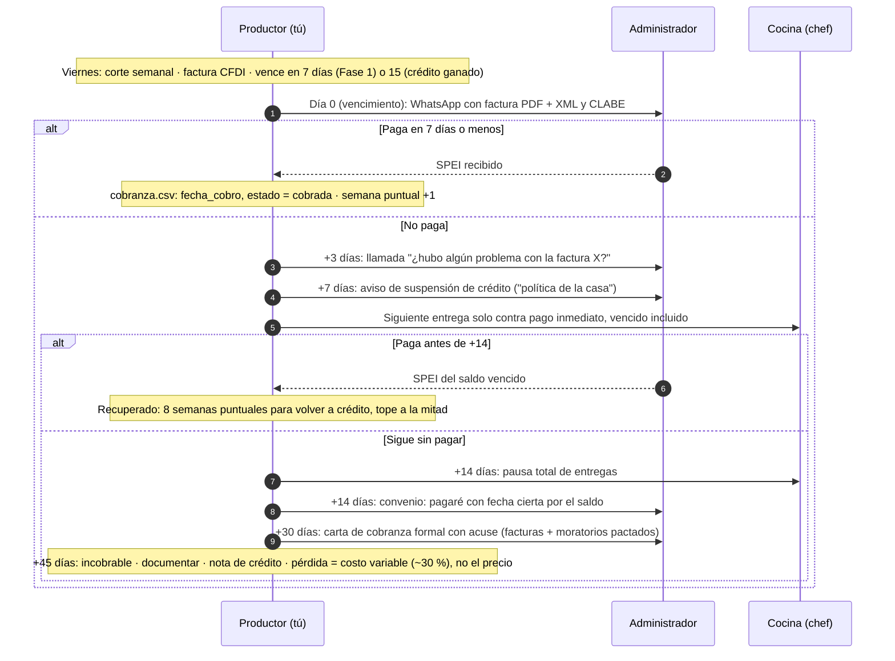

# Cobrar a tiempo y suspender sin drama

**En una línea:** remisión firmada en cada entrega, factura semanal, recordatorio el día de vencimiento y una regla mecánica que no se negocia: 7 días vencida = la siguiente entrega solo contra pago, 14 = pausa total, 45 = incobrable; con tope de 2 semanas de producto por cliente, el peor impago posible cuesta menos de $3,000 y nunca se come la caja de la siguiente fase.

!!! info "Antes de empezar"
    - **Tiempo:** 15 min los lunes (recordatorios y conciliación) dentro de las 1.5–2 h/semana de ventas y cobranza en régimen ([07 §4](../referencia/07-puntos-ciegos-y-riesgos.md)); 20 min para firmar el acuerdo con cada cliente · **Costo:** $0 (talonario de remisiones en duplicado de papelería; machotes gratuitos) · **Personas:** 1
    - **Necesitas:** talonario de remisiones en duplicado · acuerdo de suministro de 1 página (machote abajo) · CLABE de la cuenta de negocio · WhatsApp Business con recordatorio programado · `bitacora/cobranza.csv` · formato de [pagaré](https://milformatos.com/empresas-y-negocios/el-pagare/) impreso por si hace falta.
    - **Prerequisitos:** [Hoja de precios](hoja-de-precios.md) con el pie de condiciones de la fase · [Facturar CFDI](facturar-cfdi.md) · cliente con contactos del chef **y** del administrador ([Visitar a un chef](visitar-a-un-chef.md)).

## La política por fase (lo que va impreso en la hoja)

| Fase | Término | Mecánica | CFDI |
|---|---|---|---|
| **Fase 0** (semanas 1–6) | **Contado estricto**: SPEI al entregar o el mismo día; efectivo solo con recibo foliado | Muestra gratis solo la primera semana. Cero excepciones: validas que **pagan**, no que quieren | PUE al día |
| **Fase 1** (meses 2–4) | **Cuenta semanal**: corte viernes, pago lunes–martes (máximo 7 días naturales) | Una remisión firmada por entrega; una factura semanal; recordatorio automático lunes 9:00 | PUE si pagan en el mes; PPD si cruza de mes |
| **Fase 1 tardía / Fase 2** | **Crédito a 15 días solo ganado**: 8+ semanas de pago puntual | Tope = 2 semanas de pedidos ($2,000–4,000); nunca 2 facturas abiertas; 2–3 % de descuento por pago ≤ 7 días, ofrecido como premio | PPD + REP |
| Cadenas, hoteles, comisariatos | 30 días solo con ticket > $8,000/mes y contrato firmado | Alta como proveedor, orden de compra, contrarrecibo | PPD + REP siempre |

Reglas de oro ([research/cobranza §2](../research/cobranza-b2b.md)):

- **Nunca crédito a un restaurante con menos de 6 meses operando** (6 de cada 10 aperturas fracasan; [07 §5](../referencia/07-puntos-ciegos-y-riesgos.md)).
- **Ningún cliente > 25–30 % de tus ventas** y ningún canal > 60 %: perder al peor pagador cuesta una semana de producto, no el mes.
- **Exposición máxima por cliente = 2 semanas de producto.** Con tickets de $400–1,500/semana, tu peor escenario es $800–3,000 de precio, es decir $250–1,000 de costo variable real.
- El apalancamiento del proveedor de perecederos es **la continuidad**, no el abogado: si no llegas el martes, al chef se le rompe el mise en place. Úsalo con cortesía, pero úsalo.
- Todo por SPEI a la cuenta de negocio: el historial bancario es tu evidencia y tu score.

## El acuerdo de suministro de 1 página (machote completo)

Se firma **con el administrador o el dueño, nunca solo con el chef**, en cuanto un cliente pasa de 3 semanas comprando. Objetivo: que lo firmen sin mandarlo al abogado. Esqueleto legal mexicano: el [contrato de suministro gratuito de milformatos](https://milformatos.com/contratos/contrato-de-suministro/) (le faltan las cláusulas de pago, rechazo y terminación; este machote las agrega con las prácticas de las guías WSDA y UC ANR). No es asesoría legal ([research/cobranza §4](../research/cobranza-b2b.md)).

**ACUERDO DE SUMINISTRO SEMANAL — [MARCA DEL HUERTO]**

> **1. Partes.** [Nombre/razón social del productor], RFC ___ ("el Productor") y [razón social del restaurante], RFC ___, representado por [administrador/dueño] ("el Cliente").
>
> **2. Producto y pedido.** El Productor envía lista de disponibilidad ("fresh sheet") cada [domingo 18:00] por WhatsApp/correo. El Cliente confirma pedido a más tardar [lunes 12:00]. Pedido mínimo semanal: $[400] MXN. Variaciones de ±20 % sobre el pedido confirmado no requieren renegociación.
>
> **3. Entrega.** [Martes y/o jueves, 9:00–12:00] en [dirección]. Producto cosechado el mismo día o charola viva. Cada entrega se acompaña de remisión en duplicado firmada por quien recibe.
>
> **4. Aceptación y rechazo.** El Cliente inspecciona AL MOMENTO de la entrega. Producto rechazado con causa (calidad, error de pedido) se repone en máx. 24 h o se descuenta de la factura semanal, a elección del Cliente. **No se aceptan rechazos ni devoluciones posteriores a la recepción firmada** (producto vivo/perecedero).
>
> **5. Precio.** Según lista anexa. Revisión trimestral; ajustes con aviso de 14 días naturales. *(Alternativa: ajuste semestral por INPC.)*
>
> **6. Pago.** Factura semanal (corte [viernes]); pago por transferencia SPEI a más tardar [7] días naturales tras la factura, a la cuenta CLABE ___. Pago a 7 días o menos: descuento de [2] %. Factura vencida: las entregas siguientes se realizan contra pago inmediato hasta regularizar; interés moratorio pactado del [3–5] % mensual sobre saldos vencidos.
>
> **7. Facturación.** CFDI 4.0 con IVA 0 % (vegetales no industrializados). [Si RESICO-AGAPES: la factura incluye la leyenda de exención del art. 113-E noveno párrafo y NO procede retención de ISR del 1.25 %.]
>
> **8. Vigencia.** Indefinida; cualquiera de las partes puede terminar con aviso de 14 días. Sin exclusividad para ninguna de las partes.
>
> Firmas: ____________ / ____________ Fecha: ______

Notas de uso:

- La **cláusula 4** es la que más pleitos evita: en perecederos el rechazo solo en recepción es el estándar; la remisión firmada es la prueba de aceptación.
- La **cláusula 6** encapsula toda la política: crédito corto explícito, suspensión automática pactada (por eso es exigible) y moratorios por escrito (sin pacto, el supletorio del Código de Comercio es 6 % **anual**). [POR VERIFICAR: tope práctico del moratorio pactado según jurisprudencia; 10 minutos de un abogado antes de firmar el primero.]
- Los corchetes de las cláusulas 2 y 3 se ajustan a tu [hoja de precios](hoja-de-precios.md): mínimo $350 por entrega y ruta martes y viernes 9:00–12:00 son los valores de esta wiki; el machote original dice $400 y martes/jueves.
- Adeudos ya generados > $5,000: convertir a **pagaré** con fecha cierta ([formato gratuito](https://milformatos.com/empresas-y-negocios/el-pagare/)): es título ejecutivo y permite juicio ejecutivo mercantil directo, sin discutir primero la existencia de la deuda.
- El acuerdo **no** garantiza volumen ni obliga a comprar: fija reglas (día de pedido, rechazo, plazo) y te da papel firmado si hay impago. Un contrato de volumen duro es contraproducente a esta escala.

## El protocolo 7/14/45

Para tickets de $1,000–5,000 la vía judicial es disuasión, no plan de cobro: el juicio ordinario mercantil con la remisión firmada como prueba puede tardar "desde meses hasta años" ([Expansión](https://expansion.mx/finanzas-personales/2024/11/29/que-hacer-si-no-me-pagan-una-factura)); el ejecutivo mercantil exige pagaré, letra o cheque ([UPLAW](https://www.uplaw.com.mx/post/qué-puede-hacer-una-pyme-cuando-sus-clientes-no-le-pagan)). El plan de cobro real es suspensión cortés e inmediata + pagaré + tope de exposición. En RESICO no pagaste ISR por lo no cobrado: la pérdida es el costo variable del producto, no el precio de venta.

## Señales de alerta (las ves gratis en cada entrega)

En orden de gravedad ([research/cobranza §5](../research/cobranza-b2b.md)):

| Señal | Qué haces |
|---|---|
| 1. Pide **más volumen y más plazo a la vez** | Volumen sube solo con historial intacto; el plazo no se mueve. Te están usando de banco |
| 2. **Pagos parciales sin acuerdo** o cambia de SPEI a efectivo | Siguiente entrega contra pago del saldo completo |
| 3. **Cambia la razón social** a la que piden facturar (RFC nuevo, S.A. recién constituida) | Saldo anterior a pagaré antes de facturar a la nueva; crédito en cero con la nueva |
| 4. **Rotación del administrador o dueño** (no solo del chef) | Re-valida el acuerdo la primera semana del reemplazo |
| 5. **Nómina o renta atrasadas** (los meseros lo cuentan), proveedores grandes solo de contado, el gas no les surte | Contado hasta nuevo aviso |
| 6. **Caída visible**: menú recortado, horario reducido, reseñas cayendo, salón vacío en hora pico | Reduce el tope de exposición a 1 semana |
| 7. Restaurante con **< 6 meses** que pide crédito de entrada | No. Contado, sin excepción |
| 8. **"El de pagos no vino"** dos semanas seguidas | Una vez es normal; dos es política de la casa: suspensión de crédito |

## Pasos

1. **Cada entrega: remisión en duplicado firmada por quien recibe** (cliente, fecha, producto, cantidad, precio, lote, total, temperatura si es cortado). Sin firma de recepción no hay deuda demostrable; la factura CFDI sola no prueba el adeudo en juicio. *Criterio de listo:* tu copia firmada en la carpeta antes de arrancar la moto ([Ruta de reparto](ruta-de-reparto.md)).
2. **Fase 0: SPEI antes de irte o el mismo día.** Si no llegó, la siguiente entrega es contra pago, sin drama: "política de la casa". *Criterio de listo:* comprobante en el teléfono; `bitacora/ventas.csv` con la venta y `cobranza.csv` con `estado = cobrada`.
3. **Viernes: factura semanal y fila en `cobranza.csv`** con `fecha_vencimiento` (7 o 15 días según lo ganado). *Criterio de listo:* PUE/PPD coherente con la fecha ([Facturar CFDI](facturar-cfdi.md)).
4. **Programa el recordatorio del día de vencimiento** en WhatsApp Business (factura adjunta + CLABE); lunes 9:00 en Fase 1. *Criterio de listo:* mensaje programado el mismo día que emites la factura.
5. **Martes: concilia el estado de cuenta** y marca `cobrada` o `vencida`. *Criterio de listo:* ninguna factura con `estado = emitida` y vencimiento pasado.
6. **Aplica el protocolo sin excepciones** (diagrama de arriba): +3 llamada al administrador, +7 suspensión de crédito, +14 pausa total y pagaré, +30 carta con acuse, +45 incobrable. *Criterio de listo:* cada paso con fecha en `observaciones` de `cobranza.csv`.
7. **Revisa la exposición el domingo, junto con los KPIs L2:** saldo abierto por cliente ≤ 2 semanas de pedidos; ningún cliente > 25–30 % de las ventas; cartera > 15 días = 0 en Fase 1. *Criterio de listo:* tres números anotados; si uno falla, el lunes se corrige (contado, tope reducido o nuevo cliente).
8. **Firma el acuerdo** con el administrador o dueño cuando un cliente pasa de 3 semanas comprando; anexa la hoja de precios vigente. *Criterio de listo:* acuerdo firmado y Constancia de Situación Fiscal en la carpeta del cliente.
9. **Cliente recuperado:** vuelve a crédito tras 8 semanas puntuales, con tope a la mitad. **Cliente que quebró debiendo:** documenta, nota de crédito y no persigas a la S.A. quebrada; la única defensa real era el tope de exposición. *Criterio de listo:* `estado = incobrable` con monto y fecha; lección en `observaciones`.

!!! warning "Errores típicos"
    - **Dar crédito para "no perder al cliente".** Un cliente que quiere pero no paga no cuenta para ningún gate.
    - **Cobrarle al chef o firmar solo con él.** El cliente es el restaurante; el acuerdo lo firma quien paga.
    - **Anunciar recargo por crédito.** El descuento por pronto pago es un premio; la lista es la lista.
    - **"Esta vez sí" a un pago parcial** sin fecha del resto. El parcial sin acuerdo es la señal 2.
    - **Aceptar efectivo sin recibo foliado** o en una cuenta personal: pierdes la evidencia bancaria.
    - **Esperar al abogado.** Para $1,000–5,000 la suspensión inmediata cobra más facturas que cualquier demanda.
    - **No mirar el local.** La entrega semanal es una inspección gratuita del cliente.

## Al terminar

- [ ] Remisión firmada por cada entrega, archivada por cliente
- [ ] `cobranza.csv` conciliado los martes; cero facturas vencidas sin acción fechada
- [ ] Saldo abierto por cliente ≤ 2 semanas de pedidos; ningún cliente > 25–30 % de ventas
- [ ] Acuerdo firmado con administrador/dueño en todo cliente de 3+ semanas
- [ ] Recordatorio automático activo para cada factura emitida
- **Registrar:** `bitacora/cobranza.csv` (`factura,cliente,fecha_emision,fecha_vencimiento,fecha_cobro,monto,pue_ppd,rep_emitido,estado,observaciones`); en `bitacora/ventas.csv`, `feedback` con cualquier señal de alerta vista en el local. KPIs de apoyo al gate: cartera > 15 días y % del cliente mayor ([Fase 2 · Gate](../fases/fase-2/gate.md)).
- **Siguiente paso:** [Facturar CFDI](facturar-cfdi.md) para los REP de los cobros a crédito; [Visitar a un chef](visitar-a-un-chef.md) para reponer la cartera (churn de 30–50 % anual, [07 §7](../referencia/07-puntos-ciegos-y-riesgos.md)).

## Fuentes

- [research/cobranza-b2b §1, §2, §4 y §5](../research/cobranza-b2b.md): cómo pagan los restaurantes ([WSDA, Selling to Restaurants](https://cms.agr.wa.gov/WSDAKentico/Documents/DO/RM/RM/16_SellingToRestaurants.pdf)), política por fase, machote de acuerdo, señales de alerta, protocolo 7/14/45, marco legal ([UPLAW](https://www.uplaw.com.mx/post/qué-puede-hacer-una-pyme-cuando-sus-clientes-no-le-pagan), [Expansión](https://expansion.mx/finanzas-personales/2024/11/29/que-hacer-si-no-me-pagan-una-factura)), pagaré y contrato de [milformatos](https://milformatos.com/contratos/contrato-de-suministro/).
- [07 · Puntos ciegos §5, §7 y §8](../referencia/07-puntos-ciegos-y-riesgos.md): mercado 2026, churn, "vender no es cobrar".
- [Fase 0 · Vender a chefs §6](../fases/fase-0/ventas.md) y [Fase 2 · Clientes y cobranza §2–4](../fases/fase-2/clientes-y-cobranza.md): contado en Fase 0, resumen del acuerdo, esquema de `cobranza.csv`.
- [06 · Validación §L2](../referencia/06-validacion-y-lazos-agenticos.md): KPIs semanales y regla "cliente ancla sin pedir 2 semanas → visita".
- [research/mercado-precios §1](../research/mercado-precios.md): MIJARDIIN cobra suscripción prepagada; benchmark de "contado primero".
