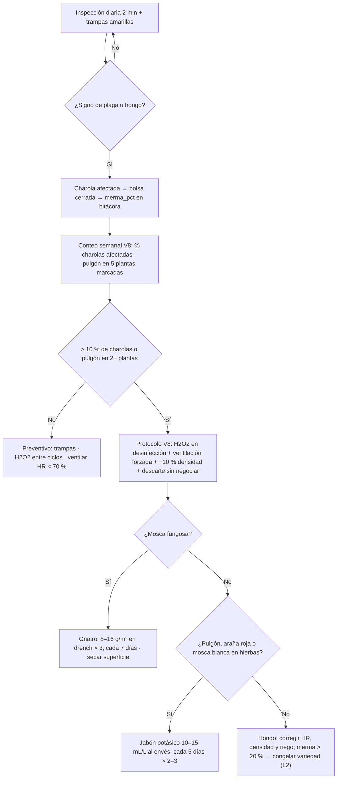

# Controlar plagas y moho sin agroquímicos

**En una línea:** trampas amarillas, higiene, ventilación y tres productos de bajo impacto (jabón potásico, Bti y H2O2) cubren las cuatro plagas reales de la CDMX; el umbral V8 (más de 10 % de charolas afectadas) decide cuándo pasas de vigilar a actuar, y la charola con moho se tira sin negociar.

!!! info "Antes de empezar"
    - **Tiempo:** 2 min diarios de inspección (lazo L1) + 15 min semanales de conteo V8 + 30 min por aplicación · **Costo:** botiquín ~$600 = jabón potásico 1 kg **$250 verificado** ([Soluciones Naturales Pro](https://solucionesnaturalespro.com.mx/product/jabon-potasico/)) + trampas amarillas ~$150 aprox. ([búsqueda ML](https://listado.mercadolibre.com.mx/trampas-amarillas-pegajosas)) + H2O2 35 % 1 L ~$200 aprox. ([búsqueda ML](https://listado.mercadolibre.com.mx/peroxido-de-hidrogeno-35%25-grado-alimenticio-oxigeno-liquido)); Gnatrol DG (Bti) 500 g ~$800 aprox. ([ficha Valent](http://www.valent.mx/productos/insecticidas/gnatrol), [`bom/fase1.csv`](https://github.com/AndresIslas99/HomeGreen/blob/main/bom/fase1.csv)); fumigador de presión previa 1.5–2 L ~$250–450 aprox. ([04 · Herramientas](../referencia/04-herramientas.md)) · **Personas:** 1
    - **Necesitas:** lo anterior + atomizador exclusivo para H2O2 + guantes de nitrilo + bolsas para descarte + plumón para numerar trampas + termohigrómetro (HR).
    - **Prerequisitos:** [Lavar y desinfectar charolas](lavar-y-desinfectar-charolas.md) · densidad ajustada por temporada ([Sembrar una charola](sembrar-una-charola.md)) · en Fase 1, ventilación por histéresis de HR ([Automatización v1](../fases/fase-1/automatizacion-v1.md)).

## Las plagas de la CDMX y cuándo aparecen

Calendario de riesgo adaptado de [research/clima-agronomía §5, §7 y síntesis](../research/clima-agronomia.md) (■ = riesgo; ■■■ = pico; las filas de mosca fungosa y pulgón se derivan del texto de §7, no de su tabla):

| Riesgo | E | F | M | A | M | J | J | A | S | O | N | D |
|---|---|---|---|---|---|---|---|---|---|---|---|---|
| Hongos / HR alta (ventilar) | | | | | ■ | ■■ | ■■■ | ■■■ | ■■■ | ■■ | | |
| Mosca fungosa (sustrato húmedo) | | | | | | ■■ | ■■ | ■■ | ■■ | ■ | | |
| Araña roja / secado (HR baja) | ■ | ■ | ■■ | ■■ | ■ | | | | | | ■ | ■ |
| Pulgón en hierbas (primavera) | | | ■ | ■■ | ■■ | ■ | | | | | | |

| Plaga | Cómo la reconoces | Dónde | Respuesta |
|---|---|---|---|
| **Moho / damping-off / fusarium** | Pelusa **azul, verde o negra**, "telaraña gris", olor fétido, plántulas dobladas en la base. Los pelos radiculares **blancos y uniformes** al destape son normales | Charolas en junio–septiembre (HR 70–89 %); NFT | Charola a la basura en bolsa cerrada; H2O2 entre ciclos; ventilar; −10 % de densidad; riego solo por abajo |
| **Mosca fungosa** (*Bradysia*, *Lycoriella*) | Mosquitos negros pequeños que salen al mover charolas; larvas en el coco húmedo | Sustrato siempre mojado; sustrato usado acumulado | Trampas amarillas; secar la superficie entre riegos; Gnatrol 8–16 g/m² × 3; sustrato usado fuera el mismo día |
| **Pulgón** (también mosca blanca y trips) | Brotes tiernos y envés deformados, melaza pegajosa | Albahaca y hierbas NFT (Fase 2), primavera | Jabón potásico 10–15 mL/L al envés, cada 5 días × 2–3; preventivo quincenal en primavera |
| **Araña roja** | Punteado amarillo, telaraña fina en el envés | Albahaca en secas calientes (marzo–mayo, HR baja) | Jabón potásico; subir HR con riego, no con aspersión sobre el follaje |

**Umbral V8** ([06 · V8](../referencia/06-validacion-y-lazos-agenticos.md)): **>10 % de charolas con cualquier signo de hongo, o pulgón en 2 o más de 5 plantas marcadas** dispara el protocolo. Merma >20 % dos semanas: congelar la variedad nueva y revisar densidad (L2).

!!! danger "Lo que se come crudo solo admite bajo impacto"
    - Solo productos registrados y de bajo impacto (jabón potásico, Bti, H2O2, Bacter-F); **nunca rodenticida dentro del área de producto** ni insecticidas de síntesis.
    - Gnatrol DG: registrado en México, OMRI/orgánico, **reentrada 4 h**.
    - Jabón potásico va a las hierbas (albahaca, NFT). En microgreens de ciclo de 10 días la respuesta es descartar la charola y corregir la causa, no rociar. [POR VERIFICAR: intervalo a cosecha del jabón potásico en la etiqueta del fabricante antes de aplicarlo a cualquier cosa que se venda en <7 días]
    - H2O2 35 % es corrosivo: diluir siempre; guantes y gafas.

## Pasos

1. **Monta el monitoreo.** Una trampa amarilla pegajosa por rack (o cada 5 m²), numerada y con fecha; en Fase 2, marca 5 plantas de albahaca con cinta para el conteo de pulgón. *Criterio de listo:* cada trampa tiene número y fecha; sabes cuántas moscas tenía la semana pasada.
2. **Inspecciona 2 minutos al día (L1).** Moho vs raíces; mosquitos al mover charolas; hojas deformes o pegajosas; HR del termohigrómetro. *Criterio de listo:* revisaste todos los niveles y la HR está anotada si pasó de 70 %.
3. **Descarta al momento.** Charola con pelusa u olor: bolsa cerrada, fuera del área, `merma_pct` en la bitácora. Con fusarium, nunca a la composta. El costo de una charola es ruido; el de una entrega rechazada, no. *Criterio de listo:* la charola ya no está en el rack y la fila dice por qué.
4. **Cuenta cada semana (V8).** `% afectadas = charolas con signo ÷ charolas en el rack × 100`; conteo de moscas por trampa; pulgón en las 5 plantas marcadas. *Criterio de listo:* los tres números están escritos y comparados con el umbral.
5. **Corrige la causa antes de aplicar nada.** HR >70 % → ventilación por histéresis (SHT31) y forzada 10 min/h en temporada de lluvia; junio–septiembre → −10 % de densidad; riego solo por abajo; deja secar la superficie del sustrato entre riegos; sustrato usado fuera el mismo día; mallas en ventanas y túnel; cero mascotas; trampas mecánicas perimetrales numeradas con registro quincenal. *Criterio de listo:* la HR nocturna vuelve a <70 % y las charolas nuevas van con la densidad ajustada.
6. **Aplica según la plaga** (pestañas abajo). *Criterio de listo:* dosis, fecha y charolas o m² tratados anotados.
7. **Registra y cierra.** Semana siguiente: si el % bajó del umbral, vuelve a preventivo; si no, repite la aplicación y sube el caso al informe L3. *Criterio de listo:* dos semanas seguidas bajo el 10 %.

=== "Mosca fungosa · Gnatrol DG (Bti)"

    - **Dosis:** 8–16 g/m² en drench (en el agua del riego por abajo), **3 aplicaciones cada 7 días**. Una charola 1020 mide 0.125 m²: **1–2 g por charola** (cálculo a partir de la dosis por m²). [POR VERIFICAR: litros de agua por gramo en la etiqueta del envase]
    - **Cuándo comprarlo:** antes de junio. Cuando la mosca aparece ya vas tarde; con producción activa en temporada de lluvias es inevitable.
    - **Acompañamiento obligatorio:** dejar secar la superficie del sustrato entre riegos y sacar el sustrato usado el mismo día (ahí se cría).
    - **Alternativa:** VectoBac WDG (Bti, $1,633 verificado en [Sanidec](https://www.sanidec.com.mx/product-page/vectobac-vectobac-wdg-larvicida-biologico)) si Gnatrol escasea.

=== "Pulgón, mosca blanca, trips, araña roja · Jabón potásico"

    - **Dosis:** 10–15 mL/L foliar **al envés**, con fumigador de presión previa; **cada 5 días, 2–3 aplicaciones**; preventivo quincenal en primavera sobre albahaca.
    - **Dónde:** hierbas y albahaca del NFT (Fase 2). En microgreens: descarte + causa, no aspersión.
    - **Araña roja (marzo–mayo):** además del jabón, sube la HR del túnel con riego al piso o masa de agua, nunca mojando el follaje.
    - Fabricante mexicano: [Soluciones Naturales Pro](https://solucionesnaturalespro.com.mx/product/jabon-potasico/) ($80/250 g · $160/500 g · $250/kg, verificado); alternativa [búsqueda ML](https://listado.mercadolibre.com.mx/jabon-potasico-insecticida) $150–350 aprox./L.

=== "Hongos y bacterias · H2O2 (y Bacter-F)"

    - **Superficies:** H2O2 3 % en charolas, tijeras y mesa entre ciclos ([guía](lavar-y-desinfectar-charolas.md)).
    - **Agua de riego:** 25–100 ppm de H2O2 como antifúngico; con H2O2 al 35 % son ≈0.7–2.9 mL por 10 L de agua (cálculo a partir de la concentración). Diluir siempre.
    - **NFT (Fase 2):** albahaca **Nufar** (resistente a *Fusarium oxysporum*) como variedad principal y H2O2 en las líneas al cambio de ciclo ([Cambiar la solución NFT](cambiar-solucion-nft.md)).
    - **Refuerzo opcional:** Bacter-F bactericida/fungicida orgánico, $684.90/L verificado en [Hydro Environment](https://hydroenv.com.mx/categoria-de-productos/grow-shop/); primero agota higiene + H2O2 + ventilación.
    - **Bt kurstaki** solo si aparecieran orugas (poco probable en microgreens).

!!! warning "Errores típicos"
    - **Confundir pelos radiculares blancos con moho** y tirar charolas buenas; o al revés, "esperar a ver" con pelusa verde y contagiar el rack.
    - **Comprar el Bti cuando ya hay moscas.** Cómpralo en mayo.
    - **Rociar sin corregir HR, densidad y riego:** la plaga vuelve a la semana.
    - **Dejar el sustrato usado en el patio** o compostar una charola con fusarium.
    - **Rodenticida o insecticida "de ferretería" cerca del producto.** Un chef lo huele y un verificador lo anota.
    - **No registrar el % semanal:** sin número no hay umbral, y sin umbral cada decisión es una corazonada.

## Al terminar

- [ ] Trampas numeradas y fechadas, una por rack
- [ ] Inspección diaria hecha; charolas afectadas descartadas en bolsa cerrada
- [ ] Conteo V8 semanal: % de charolas afectadas, moscas por trampa, pulgón en 5 plantas
- [ ] Causa corregida (HR, densidad, riego, residuos) antes de aplicar producto
- [ ] Aplicaciones con dosis, fecha y reentrada respetada
- **Registrar:** en `bitacora/produccion.csv`, `merma_pct` y causa en `observaciones` de cada charola descartada (`moho verde dia 6; tirada`); el % semanal de V8, el conteo de trampas y la acción tomada en tu hoja de V8 ([Validación · V8](../validacion/v08-sanitaria.md)) para que el informe L3 los vea. Con merma >20 % la variedad nueva se congela ([06 · L2](../referencia/06-validacion-y-lazos-agenticos.md)).
- **Siguiente paso:** [Lavar y desinfectar charolas](lavar-y-desinfectar-charolas.md) (doble pasada a las que tuvieron moho) y, en temporada de lluvia, revisar el lazo de ventilación en [Automatización v1](../fases/fase-1/automatizacion-v1.md).

## Fuentes

- [research/clima-agronomía §5, §7 y calendario de riesgo](../research/clima-agronomia.md): plagas dominantes, dosis (jabón potásico 10–15 mL/L; Gnatrol 8–16 g/m² × 3; H2O2 25–100 ppm), trampas 1 por rack/5 m², ventilación por HR >70 %, −10 % de densidad en lluvias, Nufar; precios y proveedores.
- [06 · Validación](../referencia/06-validacion-y-lazos-agenticos.md): lazo L0 de ventilación (HR <75 %, forzado 10 min/h en lluvia), inspección L1 (moho vs raíces), KPI de merma L2, método V8.
- [research/inocuidad-operativa §4](../research/inocuidad-operativa.md): control de fauna en NOM-251 (mallas, cero mascotas, trampas mecánicas numeradas, nunca rodenticida en área de producto), charolas con fusarium fuera el mismo día.
- [07 · Puntos ciegos §12](../referencia/07-puntos-ciegos-y-riesgos.md): sustrato usado y mosca fungosa.
- [research/recetas-produccion-economia §1](../research/recetas-produccion-economia.md): Bootstrap Farmer sobre moho (densidad excesiva, humedad 40–60 %, semillas sucias).
- Guías externas citadas por las fuentes: [microgreens.com.mx](https://microgreens.com.mx/como-cultivar-microgreens.html) (moho vs pelos radiculares) y [FES Zaragoza UNAM: control ecológico en huertos urbanos CDMX](https://www.zaragoza.unam.mx/plagas-control-huertos-urbanos-cdmx/).
