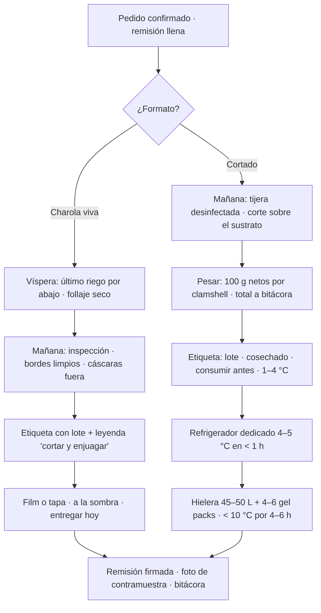

# Cosechar y empacar: charola viva o clamshell

**En una línea:** la mañana de la entrega conviertes la charola en producto con lote: viva (etiqueta + film, sin cadena de frío, casi cero rechazo) o cortada (tijera sobre el sustrato, 100 g por clamshell, refrigerador a 4–5 °C dentro de la primera hora), en un cuarto de cosecha que aguanta la vara de la NOM-251.

!!! info "Antes de empezar"
    - **Tiempo:** charola viva 5 min · charola cortada 15–20 min (corte, pesado, empaque); en régimen 3.5–4.5 h/semana para 30 charolas ([07 §4](../referencia/07-puntos-ciegos-y-riesgos.md)) · **Costo:** charola viva ~$1.00 de etiqueta + film ([08](../referencia/08-recetas-y-economia-unitaria.md)); cortado: clamshell PET 8 oz $3.50 aprox. ([búsqueda ML](https://listado.mercadolibre.com.mx/clamshell)) + etiqueta; solo para cortado: refrigerador usado 9–11 pies ~$4,000 aprox. y hielera 45–50 L + 6 gel packs ~$1,300 aprox. ([`bom/fase2.csv`](https://github.com/AndresIslas99/HomeGreen/blob/main/bom/fase2.csv)) · **Personas:** 1
    - **Necesitas:** tijera recta inox de cocina ($90 aprox.) · báscula de cocina 1 g ($120 aprox., [ML](https://listado.mercadolibre.com.mx/bascula-digital-cocina)) · guantes de nitrilo y cofia · mesa de acero inoxidable o tabla de polietileno (no madera) · H2O2 3 % o cloro 200 ppm para mesa y tijera · clamshells · etiquetas (tiraje chico 200–500: [Dushi](https://www.imprentacdmx.com/servicios-de-impresion/impresion-de-etiquetas-adhesivas/) · [Pop México](https://popmexico.com.mx/collections/etiquetas-adhesivas)) · film o tapa para charola viva · hielera + gel packs · termómetro de cocina · talonario de remisiones · teléfono para la foto de contramuestra. Compras en [Fase 0](../fases/fase-0/compras.md) y [01 §1](../referencia/01-proveedores-cdmx.md).
    - **Prerequisitos:** charola en su día de cosecha ([Sembrar una charola](sembrar-una-charola.md)) · mesa y tijera desinfectadas ([Lavar y desinfectar](lavar-y-desinfectar-charolas.md)) · pedido confirmado y forma de pago acordada (Fase 0: SPEI contra entrega, [Fase 0 · Ventas](../fases/fase-0/ventas.md)).

## Charola viva o cortado: decide antes de cortar

| | Charola viva (formato preferente) | Cortado en clamshell (solo bajo pedido) |
|---|---|---|
| Precio de lista B2B | $90–120 girasol/chícharo · $130–180 finas | $50–90 por clamshell de 100 g ($500–900/kg) |
| Por charola de rábano (~283 g) | 1 venta | 2.5–3 clamshells → $125–270 menos $10.50 de envases |
| Cadena de frío | **No la necesita**: sigue viva | Refrigerador dedicado a 4–5 °C desde la primera hora; hielera en ruta |
| Vida | El chef corta conforme usa | 5 °C: 14 días · 10 °C: 4 días · 15 °C: 2 días · 20–25 °C: **menos de 1 día** |
| Trabajo | 5 min | +30 min de corte y empaque por charola: paga mejor por charola, peor por hora |
| Rechazo | Casi cero | 5–10 % de entregas en los primeros 6 meses (marchitez, spec) |
| Cuándo | Restaurantes, siempre que acepten | Suscripción a hogares, clientes que no aceptan charola, muestras |

Fuentes: [07 §3 y §6](../referencia/07-puntos-ciegos-y-riesgos.md), [research/recetas §4](../research/recetas-produccion-economia.md), [research/mercado-precios](../research/mercado-precios.md).



## El cuarto de cosecha según NOM-251 (lo mínimo defendible)

La NOM-251-SSA1-2009 ([texto oficial](https://sidof.segob.gob.mx/notas/5133449)) es obligatoria para quien procesa alimentos; cortar y empacar cuenta como proceso y COFEPRIS la verifica con el Aviso de Funcionamiento. Traducción a un cuarto de 6–10 m² ([research/inocuidad §4](../research/inocuidad-operativa.md)):

| Rubro | Qué haces |
|---|---|
| Área | Zona de corte y empaque separada del cultivo (aunque sea con cortina plástica); piso y paredes lavables; nunca cosechar sobre tierra descubierta |
| Superficies y utensilios | Mesa inox o tabla de polietileno; tijera de acero; lavar + desinfectar (H2O2 3 % o cloro 200 ppm) antes y después de cada cosecha; hoja de limpieza firmada |
| Agua | Riego de las últimas 48 h y enjuague de utensilios con agua potable o desinfectada; si usas pluvial: filtro + cloro 0.2–1.5 ppm o UV antes de que toque producto |
| Manos e higiene | Estación con jabón líquido, agua corriente y toallas desechables antes de entrar; gel al 70 % solo como refuerzo; cofia, sin anillos ni pulseras, uñas cortas; no cosechar con heridas descubiertas, diarrea o gripe |
| Fauna | Mallas; **cero mascotas** en cultivo y empaque; trampas mecánicas numeradas en perímetro con registro quincenal; nunca rodenticida dentro del área |
| Químicos y residuos | Sanitizantes y nutrientes en anaquel aparte, etiquetados; bote con tapa y pedal; charola con fusarium fuera el mismo día |
| Producto terminado | 1–4 °C; hielera limpia y exclusiva; nunca junto a químicos o gasolina |
| Registros | Curso de Manejo Higiénico de Alimentos; todas las bitácoras guardadas ≥12 meses |

!!! tip "Etiquetado: la NOM-051 no te aplica en B2B"
    Charola viva es una planta y el corte a restaurante es insumo a granel, no producto preenvasado al consumidor final; sin tabla nutrimental ni sellos ([02 · Restricciones](../referencia/02-restricciones-y-requisitos.md)). Aun así, etiqueta siempre: marca, variedad, fecha de cosecha, lote y contacto. Solo si un día vendes clamshells cerrados al menudeo, revisita NOM-051.

## Pasos

1. **La víspera: prepara.** Confirma pedido, formato y hora; llena la remisión; congela 4–6 gel packs; riega por abajo por última vez (la charola viva viaja con sustrato húmedo y follaje seco); verifica que el refrigerador dedicado marque 4–5 °C. *Criterio de listo:* gel packs sólidos, termómetro del refri en 4–5 °C, remisión escrita.
2. **Prepara el cuarto de cosecha.** Lava y desinfecta mesa y tijera; lávate las manos con jabón; cofia, guantes, sin anillos. *Criterio de listo:* superficies secas y limpias; hoja de limpieza firmada con hora.
3. **Inspecciona y decide cada charola.** Pelusa azul, verde o negra, olor fétido o plántulas caídas en la base = charola fuera, en bolsa cerrada, con `merma_pct` en la bitácora. En girasol sacude o retira las cáscaras pegadas. *Criterio de listo:* follaje erguido, verde, seco al tacto, sin manchas ni olor.
4. **Si es charola viva:** limpia los bordes y el fondo de la charola lisa, pega la etiqueta con el código de lote copiado del masking y la leyenda de enjuague, cubre con film o tapa y déjala a la sombra hasta salir. No la riegues por arriba ni la dejes al sol. Si la charola no regresa, cóbrala o pide depósito (amortización ~$2.50/charola). *Criterio de listo:* la charola no gotea al inclinarla un poco; la etiqueta se lee completa.
5. **Si es cortado: corta en la mañana.** Tijera justo sobre el sustrato, sin tocar semilla ni raíz; corta por franjas hacia un recipiente limpio. **No laves el producto**: se entrega seco y la etiqueta traslada el enjuague al cliente. *Criterio de listo:* en el recipiente no hay sustrato, cáscaras ni semillas.
6. **Pesa y empaca.** Tara el clamshell en la báscula; **100 g netos** por envase, sin compactar; cierra. Una charola de rábano (~283 g) da 2.5–3 clamshells; una de girasol (300–500 g), 3–5. Pesa el total de la charola para `rendimiento_g`. *Criterio de listo:* cada envase marca 100 g o más, nunca menos; el total quedó anotado.
7. **Etiqueta con el machote** (abajo). "Consumir antes de" = fecha de cosecha + 7 días: la mitad de los 14 días que dura a 5 °C, para absorber ruta y refrigerador del cliente. *Criterio de listo:* lote idéntico al masking de la charola; fechas correctas.
8. **Al frío dentro de la primera hora.** Refrigerador dedicado a 4–5 °C (no el de la casa: inocuidad, espacio y auditoría visual del cliente). Si la ruta sale muy temprano, corta la víspera y pre-enfría toda la noche. *Criterio de listo:* producto en el refri menos de 60 min después del corte; temperatura anotada.
9. **Reparto en hielera.** Del refri directo a la hielera rígida de 45–50 L con 4–6 gel packs: mantiene <10 °C por 4–6 h, de sobra para una ruta de 2–4 h. Hielera exclusiva para producto. *Criterio de listo:* termómetro en la hielera <10 °C al llegar; producto entregado el día del corte.
10. **Entrega y evidencia.** Remisión firmada en **cada** entrega (sin firma de recepción no hay deuda demostrable); mide y anota la temperatura del producto al entregar; foto de charolas + etiqueta como contramuestra; cobro SPEI contra entrega en Fase 0. *Criterio de listo:* remisión firmada, foto en el teléfono y temperatura anotada antes de irte.
11. **Post-cosecha.** Sustrato usado sale del área el mismo día (composta en tambo, orgánicos de la alcaldía o huertos comunitarios; con fusarium, basura en bolsa cerrada); charola a la pila de lavado; bitácora al momento. *Criterio de listo:* cero sustrato en el área de producción al terminar.

## Machote de etiqueta

Clamshell o bolsa, 7 × 5 cm ([research/inocuidad §5](../research/inocuidad-operativa.md)):

```
MICROGREEN DE GIRASOL — [MARCA]
Lote: GIR-260914-S047-R2N3
Cosechado: 24-sep-2026   Consumir antes de: 01-oct-2026
Peso neto: 100 g   Conservar de 1 a 4 °C
Producto cultivado sin agroquímicos. Se recomienda
enjuagar y desinfectar antes de consumir.
Productor: [Nombre/razón social] · CDMX
Tel/WhatsApp: [__] · [correo]
```

Charola viva (misma leyenda, sin fecha de caducidad):

```
CHAROLA VIVA DE GIRASOL — [MARCA]
Lote: GIR-260914-S047-R2N3
Sembrado: 14-sep-2026   Entregado: 24-sep-2026
Cortar sobre el sustrato conforme se use; enjuagar y
desinfectar antes de consumir. Luz indirecta, sin sol
directo; regar solo por abajo. Charola retornable.
Productor: [Nombre/razón social] · CDMX
Tel/WhatsApp: [__] · [correo]
```

El lote `GIR-260914-S047-R2N3` = girasol · sembrado 14-sep-2026 · costal S047 · rack 2, nivel 3. Con él, un problema se rastrea en minutos hacia atrás (qué costal) y hacia adelante (qué clientes): es lo que demuestras en el [simulacro de retiro V10](../validacion/v10-mock-recall.md).

!!! warning "Errores típicos"
    - **Cortar en la tarde con calor** o dejar el producto cortado sobre la mesa "mientras terminas": a 20–25 °C dura menos de un día.
    - **Usar el refrigerador de la casa** o transportar en la misma hielera que el súper.
    - **Lavar el producto cortado** antes de empacar; se entrega seco y el cliente enjuaga.
    - **Regar la charola viva por arriba** para que "se vea fresca": llega con moho.
    - **Entregar sin remisión firmada** o con etiqueta sin lote: sin firma no cobras; sin lote no rastreas.
    - **Vender cortado por default.** Paga peor por hora y carga toda la cadena de frío; la charola viva es tu formato.

## Al terminar

- [ ] Charolas con moho u olor descartadas y registradas como merma
- [ ] Cada charola pesada (`rendimiento_g`) aunque se entregue viva
- [ ] Etiquetas con lote idéntico al masking; cortado con "consumir antes de" y "1 a 4 °C"
- [ ] Cortado en refrigerador a 4–5 °C en <1 h y en hielera <10 °C hasta entregar
- [ ] Remisión firmada, temperatura de entrega y foto de contramuestra por cada cliente
- [ ] Sustrato usado fuera del área y charolas en la pila de lavado
- **Registrar en `bitacora/produccion.csv`:** `fecha_cosecha`, `rendimiento_g`, `merma_pct`, `destino`, `precio_mxn`; en `observaciones` formato, remisión y temperatura (ejemplo: `viva; remision 0231; entrega 11:20`; o `cortado 3 clam 100 g; refri 4.5C; entrega 3.8C`). **En `bitacora/ventas.csv`:** `fecha,cliente,producto,cantidad,precio_unit_mxn,entregado_a_tiempo,feedback`.
- **Siguiente paso:** [Lavar y desinfectar charolas](lavar-y-desinfectar-charolas.md) hoy mismo; [Cobrar y suspender](cobrar-y-suspender.md) si la remisión no se pagó contra entrega.

## Fuentes

- [research/inocuidad-operativa §2, §4 y §5](../research/inocuidad-operativa.md): leyenda de enjuague, NOM-251 en cuarto de cosecha, lote, machote de etiqueta, contramuestra, mock recall.
- [07 · Puntos ciegos §3, §6, §8 y §12](../referencia/07-puntos-ciegos-y-riesgos.md) y [research/puntos-ciegos](../research/puntos-ciegos.md): vida útil por temperatura (mostaza, 2023, [PubMed](https://pubmed.ncbi.nlm.nih.gov/36836750/)), refrigerador dedicado, hielera y gel packs, remisión firmada, rechazos, residuos.
- [08 · Recetas](../referencia/08-recetas-y-economia-unitaria.md) y [research/recetas §4](../research/recetas-produccion-economia.md): rendimientos, clamshells por charola, amortización de charola, precios de lista.
- [02 · Restricciones](../referencia/02-restricciones-y-requisitos.md) y [research/normativa-fiscal](../research/normativa-fiscal.md): NOM-051 no aplica en B2B; Aviso de Funcionamiento COFEPRIS.
- [03 · Instalación §0.3](../referencia/03-instalacion.md): cosecha con tijera sobre el sustrato en la mañana de la entrega.
- [`bom/fase0.csv`](https://github.com/AndresIslas99/HomeGreen/blob/main/bom/fase0.csv) y [`bom/fase2.csv`](https://github.com/AndresIslas99/HomeGreen/blob/main/bom/fase2.csv): tijera, báscula, clamshells, etiquetas, refrigerador, hielera.
