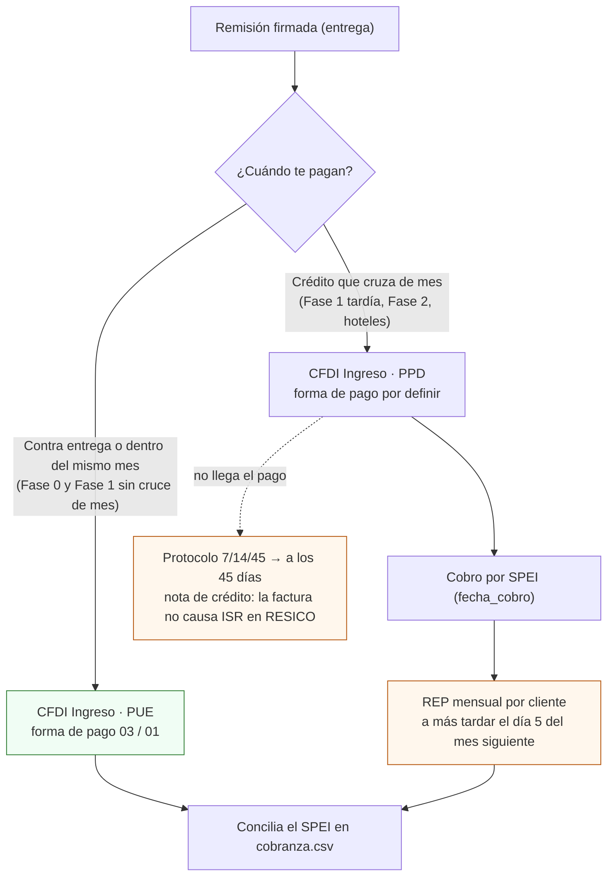

# Facturar cada venta con CFDI 4.0 a IVA 0 %

**En una línea:** cada remisión firmada se convierte en un CFDI 4.0 con IVA tasa 0 % (vegetal no industrializado), clave `50404100`, unidad `H87` o `KGM`, método PUE si te pagan en el mes o PPD si el crédito cruza de mes, con la leyenda del art. 113-E si tributas en RESICO-AGAPES; y los días 1–5 de cada mes emites el REP de lo cobrado a crédito, porque la multa por no hacerlo ($22,300–127,530 por comprobante) vale 2–3 meses de utilidad del huerto.

!!! info "Antes de empezar"
    - **Tiempo:** 5–10 min por factura; 30 min los días 1–5 de cada mes para los REP (5 clientes = 5 REP) ([research/cobranza §3](../research/cobranza-b2b.md)) · **Costo:** $0 con el facturador gratuito del SAT [POR VERIFICAR: si tu volumen lo justifica, un PAC de pago; ninguna fuente de esta wiki cotiza PACs] · **Personas:** 1
    - **Necesitas:** RFC y régimen decididos ([Antes de gastar un peso §2](../empieza-aqui/antes-de-gastar-un-peso.md)) · certificado de sello digital o e.firma vigentes [POR VERIFICAR con tu contador qué exige tu facturador] · Constancia de Situación Fiscal de cada cliente (razón social, RFC, régimen y código postal) · remisión firmada de la entrega · CLABE de la cuenta de negocio · plantilla con la leyenda del art. 113-E (abajo) · `bitacora/cobranza.csv`.
    - **Prerequisitos:** [Hoja de precios](hoja-de-precios.md) (la factura dice lo mismo que la hoja) · [Cobrar y suspender](cobrar-y-suspender.md) (la política de pago decide PUE o PPD) · no emitas nada hasta resolver desde qué RFC facturas.

## Desde qué RFC facturas (la decisión que cambia todo)

| Situación | Régimen | Qué cambia en la factura | Fuente |
|---|---|---|---|
| **No eres** socio ni accionista de ninguna persona moral | Persona física, actividad **exclusivamente agrícola**, **RESICO** (AGAPES) | ISR $0 hasta $900,000/año **cobrados**; leyenda de exención 113-E en cada CFDI para que las personas morales no retengan 1.25 %; opción de no presentar declaraciones mensuales [POR VERIFICAR con contador la regla exacta de la RMF 2026] | [02 §3](../referencia/02-restricciones-y-requisitos.md), [research/normativa-fiscal §a](../research/normativa-fiscal.md) |
| **Sí eres** socio o accionista (art. 113-E, fracc. I LISR) | RESICO PF **vetado**. Facturas desde la empresa existente (persona moral) o como PF con actividad empresarial | Sin exención ni leyenda; ISR corporativo sobre utilidad con deducciones reales; IVA sigue a 0 % | [research/cobranza §3.3](../research/cobranza-b2b.md) |
| Otra persona física del hogar, no socia, opera y factura de verdad | RESICO AGAPES a su nombre | Igual que la primera fila; la operación debe ser genuina de esa persona | ídem |

Lo que no cambia en ningún caso: **IVA tasa 0 %** (art. 2-A, fracc. I, inciso a) LIVA: "animales y vegetales que no estén industrializados"; cortar, lavar y empacar en fresco no industrializa; deshidratar o marinar sí) y que **el cliente es el restaurante, no el chef**: la factura va a la razón social de la Constancia de Situación Fiscal.

!!! danger "Tasa 0 % no es 'exento'"
    A 0 % acreditas el IVA de tus insumos (coco, charolas, clamshells); marcado como exento, no. Configura el impuesto como IVA trasladado con tasa 0 %, nunca como "exento" ni "no objeto" [POR VERIFICAR con contador el campo exacto en tu facturador].

## Los campos del CFDI, uno por uno

| Campo | Qué pones | Por qué / fuente |
|---|---|---|
| Tipo de comprobante | Ingreso | Venta de producto |
| Emisor | Tu RFC, nombre o razón social y régimen según la decisión de arriba | [02 §3](../referencia/02-restricciones-y-requisitos.md) |
| Receptor | Razón social, RFC, régimen fiscal y código postal **tal como aparecen en la Constancia de Situación Fiscal** del restaurante | CFDI 4.0 rechaza datos que no coinciden; pídesela al administrador en la primera entrega ([research/inocuidad §6](../research/inocuidad-operativa.md)) |
| Uso del CFDI | `G01` adquisición de mercancías o `G03` gastos en general (el que te indique el cliente) | [research/normativa-fiscal §a](../research/normativa-fiscal.md) |
| Clave de producto (c_ClaveProdServ) | `50404100` Hierbas frescas (albahaca, hierbabuena, cilantro); alternativa `50171548` Hierbas frescas. Microgreens: la clase de hortaliza más cercana de la familia `5040…` [POR VERIFICAR: buscar "brotes" en el [catálogo del SAT](https://wwwmat.sat.gob.mx/consultas/53693/catalogo-de-productos-y-servicios) o en [veinte.mx](https://veinte.mx/catalogos/buscar) y fijar una sola clave con tu contador] | Catálogo del Anexo 20 ([buscador gncys](http://www.gncys.com/Anexo20/claveprodserv?q=hierbas)) |
| Clave de unidad | `H87` pieza: charola viva, clamshell, manojo, canastilla · `KGM` kilogramo: solo si vendes cortado por peso | [research/normativa-fiscal §a](../research/normativa-fiscal.md) |
| Cantidad y valor unitario | Los de la remisión firmada, con el precio exacto de la [hoja](hoja-de-precios.md) | La factura y la hoja dicen lo mismo |
| Descripción | "Charola viva de microgreens de girasol 10×20, lote GIR-260914-S047-R2N3, entregada 24-sep-2026, remisión 0231" | El lote en la factura cierra la trazabilidad del [mock recall](mock-recall.md) |
| Leyenda (en la descripción o en observaciones) | Si RESICO-AGAPES: *"Los ingresos que ampara este comprobante se encuentran en el supuesto de exención a que se refiere el artículo 113-E, noveno párrafo de la Ley del ISR"* | Sin la leyenda, la persona moral retiene 1.25 % (art. 113-J LISR; regla 3.13.26 RMF 2026 según ResicoCalc, 3.13.33 en RMF 2022 según IDC [POR VERIFICAR número vigente con contador]) |
| Impuestos | IVA trasladado, tasa **0 %**; sin retención de ISR si lleva la leyenda | Art. 2-A LIVA |
| Método de pago | `PUE` si el pago cae **en el mismo mes** de emisión · `PPD` si el crédito cruza de mes | Regla PUE/PPD ([research/cobranza §3.1](../research/cobranza-b2b.md)) |
| Forma de pago | `03` transferencia · `01` efectivo (solo Fase 0, con recibo foliado) · en PPD la forma de pago queda "por definir" hasta el REP [POR VERIFICAR en tu facturador la clave que usa] | ídem |
| Moneda | MXN | — |
| Complemento de pago (REP) | Solo para PPD: un CFDI de tipo Pago por cada cobro, o **uno mensual por cliente** agrupando sus pagos, a más tardar el **día 5 natural** del mes siguiente al cobro | Regla 2.7.1.32 RMF 2026; sin prórroga en 2026 ([Tesio](https://tesio.com.mx/blog/prorroga-complemento-pago-2026/), [Grupo CerVel](https://grupocervel.com/blog/complemento-de-pago)) |

## PUE, PPD o REP: el flujo

En RESICO el ISR se causa sobre lo **efectivamente cobrado** (art. 113-E, quinto párrafo): una factura PPD emitida y no cobrada no causa impuesto, pero tampoco es ingreso. La caja de la Fase 2 se construye con lo cobrado, no con lo facturado ([research/cobranza §3.2](../research/cobranza-b2b.md)).

## Pasos

1. **Resuelve el RFC con tu contador antes de la primera factura** (1 h): ¿eres socio o accionista? Elige la fila de la tabla de arriba. *Criterio de listo:* régimen y RFC emisor escritos en la carpeta de Semana 0; en Fase 0, mientras no esté resuelto, entregas con remisión y cobras por SPEI [POR VERIFICAR con contador cómo se declaran esas ventas].
2. **Configura una plantilla en el facturador** con: IVA 0 %, clave `50404100` (o la clase de hortaliza que fijes), unidad `H87`, uso `G01`, método PUE, y la leyenda 113-E como texto fijo si aplica. *Criterio de listo:* la vista previa de la plantilla muestra la leyenda y "IVA 0 %".
3. **Pide la Constancia de Situación Fiscal al administrador** en la primera entrega y guárdala junto al acuerdo de suministro. *Criterio de listo:* razón social, RFC, régimen y CP capturados como cliente en el facturador.
4. **Factura desde la remisión firmada, no de memoria.** Fase 0: una factura PUE por entrega, el mismo día. Fase 1–2: una factura semanal (corte viernes) que agrupa las remisiones de la semana, una línea por producto y lote. *Criterio de listo:* cada línea de la factura tiene una remisión firmada detrás.
5. **Elige PUE o PPD con la regla del mes, no por comodidad.** Si el vencimiento (7 o 15 días) cae en el mes siguiente, es PPD desde el inicio. *Criterio de listo:* método de pago coherente con `fecha_vencimiento` en `bitacora/cobranza.csv`.
6. **Manda PDF + XML por WhatsApp o correo al administrador** con la CLABE y la fecha de vencimiento en el mismo mensaje. *Criterio de listo:* mensaje enviado el día de la factura; fila en `cobranza.csv` con `estado = emitida`.
7. **Concilia cada pago contra el estado de cuenta** (martes, tras el corte de viernes): anota `fecha_cobro` y cambia `estado` a `cobrada`. *Criterio de listo:* cero facturas con `estado = emitida` cuyo dinero ya está en la cuenta.
8. **Días 1–5 de cada mes: emite los REP** de todos los cobros del mes anterior sobre facturas PPD, uno por cliente. Pon la alarma el día 1. *Criterio de listo:* `rep_emitido = si` en todas las filas PPD con `fecha_cobro` del mes pasado.
9. **Cancela o emite nota de crédito solo con causa documentada:** rechazo en recepción (cláusula 4 del acuerdo) o incobrable a los 45 días. *Criterio de listo:* el motivo está en `observaciones` de `cobranza.csv` [POR VERIFICAR con contador: cuándo procede nota de crédito y cuándo cancelación del CFDI].
10. **Archiva** XML + PDF + remisión firmada + comprobante SPEI por factura, en una carpeta por cliente y mes. *Criterio de listo:* cualquier factura se recupera con sus cuatro documentos en menos de 2 minutos [POR VERIFICAR con contador el plazo legal de conservación].

!!! warning "Errores típicos"
    - **Facturar PUE "por comodidad" y cobrar el mes siguiente.** El SAT detecta la PUE sin pago bancario correlacionado y manda carta invitación ([research/cobranza §3.1](../research/cobranza-b2b.md)).
    - **Emitir el REP "cuando haya tiempo".** Multa de $22,300 a $127,530 por comprobante (art. 83, fracc. VII CFF); reincidencia, clausura preventiva de 3 a 15 días.
    - **Olvidar la leyenda 113-E** siendo RESICO-AGAPES: te retienen 1.25 % en cada pago de una persona moral.
    - **Facturar como RESICO PF siendo accionista.** Es la única contingencia real con el SAT de este negocio ([02 §3](../referencia/02-restricciones-y-requisitos.md)).
    - **Marcar el IVA como exento** en lugar de tasa 0 %: pierdes el acreditamiento de insumos.
    - **Facturar al chef, o a un RFC "nuevo" a mitad de la relación.** El cambio de razón social a facturar es señal de alerta de insolvencia ([Cobrar y suspender](cobrar-y-suspender.md)).
    - **Procesar el producto** (deshidratar, marinar, mezclar con aderezo): rompe el 0 % de IVA y la actividad agrícola.

## Al terminar

- [ ] Régimen y RFC emisor decididos con contador; plantilla con IVA 0 %, clave, unidad y leyenda (si aplica)
- [ ] Una remisión firmada detrás de cada línea facturada
- [ ] PUE solo si el pago cae en el mes; PPD en cualquier crédito que cruce de mes
- [ ] REP de todos los cobros PPD del mes anterior emitidos antes del día 5
- [ ] XML, PDF, remisión y SPEI archivados por cliente y mes
- **Registrar en `bitacora/cobranza.csv`** (esquema propuesto en [Fase 2 · Clientes y cobranza](../fases/fase-2/clientes-y-cobranza.md)): `factura,cliente,fecha_emision,fecha_vencimiento,fecha_cobro,monto,pue_ppd,rep_emitido,estado,observaciones` (`estado`: `emitida` / `cobrada` / `vencida` / `incobrable`). Y en `bitacora/ventas.csv` el `precio_unit_mxn` real de cada entrega.
- **Siguiente paso:** [Cobrar y suspender](cobrar-y-suspender.md) (recordatorio el día de vencimiento y protocolo 7/14/45); los días 1–5, los REP.

## Fuentes

- [research/cobranza-b2b §3](../research/cobranza-b2b.md): PUE/PPD, REP día 5 (regla 2.7.1.32 RMF 2026), multas del art. 83 CFF, ISR sobre lo cobrado, retención 1.25 % y leyenda, exclusión de socios; textos oficiales de [LISR](https://www.diputados.gob.mx/LeyesBiblio/pdf/LISR.pdf), [LIVA](https://www.diputados.gob.mx/LeyesBiblio/pdf/LIVA.pdf) y [CFF](https://www.diputados.gob.mx/LeyesBiblio/pdf/CFF.pdf).
- [research/normativa-fiscal §a](../research/normativa-fiscal.md) y [02 · Restricciones §3](../referencia/02-restricciones-y-requisitos.md): RESICO AGAPES, IVA 0 %, claves `50404100`/`50171548`, unidades `KGM`/`H87`, usos `G01`/`G03`; [ResicoCalc](https://resicocalc.com/blog/resico-para-agapes-actividades-primarias), [IDC — excepción de retención](https://idconline.mx/fiscal-contable/2022/04/26/excepcion-de-retencion-a-resicos-pf-agapes).
- [Antes de gastar un peso §2](../empieza-aqui/antes-de-gastar-un-peso.md): la pregunta al contador y los cuatro parámetros del CFDI.
- [Fase 0 · Vender a chefs §6](../fases/fase-0/ventas.md) y [Fase 2 · Clientes y cobranza §5](../fases/fase-2/clientes-y-cobranza.md): factura PUE al día en Fase 0; esquema de `cobranza.csv`.
- [research/inocuidad-operativa §6](../research/inocuidad-operativa.md): Constancia de Situación Fiscal y CFDI 4.0 en el paquete documental de hoteles.
