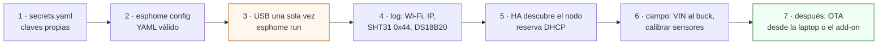

# Flashear un nodo con ESPHome

**En una línea:** en una hora conviertes un ESP32 de $130 en el nodo de riego (o el NFT, o el de
ambiente): creas tus secretos, validas el YAML del repo, lo grabas por USB una sola vez, compruebas
en el log que cada sensor responde, lo adoptas en Home Assistant con su IP reservada y, desde ese
momento, todo cambio entra por OTA sin bajar al patio.

!!! info "Antes de empezar"
    - **Tiempo:** 1 h el primer nodo (incluye descargar el toolchain), 30 min los siguientes; 10 min por actualización OTA · **Costo:** $0 en software; ESP32 DevKit V1 30 pines **$126–139 aprox.** ([UNIT Electronics](https://uelectronics.com/producto/esp32-devkit-v1-30-pines-usb-c-microusb/), [`bom/fase1.csv`](https://github.com/AndresIslas99/HomeGreen/blob/main/bom/fase1.csv)); cable USB **de datos** (el de tu celular si carga y transfiere archivos) · **Personas:** 1
    - **Necesitas:** el ESP32 en la mesa con su buck ajustado a **5.0 V** y **sin VIN conectado** ([Diseño eléctrico §5](../diseno/electrico.md)); laptop con Python 3.11+ o el add-on de ESPHome en HA; multímetro; el YAML del nodo ([`firmware/esphome/`](https://github.com/AndresIslas99/HomeGreen/tree/main/firmware/esphome)) y [`secrets.example.yaml`](https://github.com/AndresIslas99/HomeGreen/blob/main/firmware/esphome/secrets.example.yaml); los sensores del nodo conectados (aunque sea en protoboard) para ver que aparecen en el log.
    - **Prerequisitos:** [Firmware ESPHome](../software/firmware.md) (tabla de pines y qué hace cada nodo), [Software](../software/index.md) (red de 2.4 GHz, versiones ≥ 2025.1), [Diseño eléctrico](../diseno/electrico.md) (buck, divisores, tierra en estrella). Home Assistant puede instalarse antes o después ([Configurar Home Assistant](configurar-home-assistant.md)); el nodo funciona sin él.



## Pasos

### A. Preparar los secretos (10 min, una sola vez)

1. **Copia `secrets.example.yaml` a `secrets.yaml`** en la misma carpeta `firmware/esphome/` (ESPHome lo busca junto al YAML). Con el add-on: menú ⋮ → *Secrets* y pega ahí el contenido. *Criterio de listo:* el archivo existe y `secrets.yaml` **no** aparece en `git status` `[POR VERIFICAR: agrega firmware/esphome/secrets.yaml al .gitignore del repo; hoy no está]`.
2. **Genera una clave API distinta por nodo:** `openssl rand -base64 32` en la terminal (o el botón *Generate* del add-on) para `api_key_riego`, `api_key_ambiente` y `api_key_nft`. Una `ota_password` larga y una `ap_password` de ≥ 8 caracteres. *Criterio de listo:* ninguna clave es la del ejemplo (ESPHome las rechaza por formato).
3. **Escribe el Wi-Fi de 2.4 GHz** entre comillas (SSID y contraseña). Si tu red emite 2.4 y 5 GHz con el mismo nombre, el ESP32 se conecta solo a la de 2.4; si el router "fuerza" 5 GHz, crea una red separada de 2.4.

### B. Validar sin compilar (5 min)

4. **Instala ESPHome** si vas por laptop:
   ```bash
   python3 -m venv ~/esphome-venv && source ~/esphome-venv/bin/activate
   pip install esphome && esphome version
   ```
   Con el add-on: Ajustes → Complementos → Tienda → ESPHome → Instalar → Iniciar → *Mostrar en la barra lateral*.
5. **Valida el YAML del nodo:**
   ```bash
   cd HomeGreen/firmware/esphome
   esphome config nodo-riego-v1.yaml      # o nodo-nft-v2.yaml / nodo-ambiente.yaml
   ```
   En el add-on: *+ New device* → nombre exacto (`nodo-riego-v1`) → ESP32 → *Edit* → reemplaza todo por el YAML del repo → *Validate*. *Criterio de listo:* termina en "Configuration is valid" sin "Failed config". Un secret faltante o una clave mal formada se ven aquí, no en el patio.

!!! warning "Error típico: pines de otro nodo"
    Cada YAML lleva su tabla de pines en la cabecera y coincide con los esquemas de
    [Diseño eléctrico](../diseno/electrico.md). Si adaptas un pin (p. ej. otro GPIO para el relé),
    cámbialo en el YAML, en el script `hardware/electrico/*.py` y en la tabla de
    [firmware.md](../software/firmware.md): los tres lugares, mismo commit.

### C. Grabar por USB, una sola vez (15–30 min)

6. **Confirma con el multímetro** que el buck entrega 5.0 V y **desconecta VIN**: para el primer flasheo el ESP32 se alimenta solo del USB. Nunca USB y VIN a la vez ([electrico.md → errores típicos](../diseno/electrico.md)).
7. **Conecta el cable USB de datos.** En Linux y macOS el puente serie se reconoce solo; en Windows puede pedir driver `[POR VERIFICAR: mira el chip junto al conector del DevKit, CP2102 o CH340, y descarga el driver de su fabricante]`.
8. **Flashea:**
   ```bash
   esphome run nodo-riego-v1.yaml
   ```
   Elige el puerto serie (`/dev/ttyUSB0`, `/dev/cu.usbserial…` o `COMx`). Desde el add-on: *Install → Plug into this computer* (Chrome o Edge, que tienen Web Serial). La primera compilación descarga el toolchain de ESP-IDF (cientos de MB): buen internet y paciencia. Si se queda en "Connecting…", **mantén presionado BOOT** en la placa hasta que empiece a escribir y suelta.
   *Criterio de listo:* "Successfully uploaded program" y el mismo comando abre el log por USB.

!!! warning "Error típico: cable de carga"
    Muchos cables micro-USB o USB-C solo cargan. Si la laptop no ve ningún puerto nuevo al
    conectar la placa, cambia de cable antes de sospechar del ESP32.

### D. Leer el log y adoptar en Home Assistant (10 min)

9. **Lee el log** (`esphome logs nodo-riego-v1.yaml` si lo cerraste). Debes ver, en este orden: `WiFi Connected` con la IP; `Found i2c device at address 0x44` (SHT31, nodos riego y ambiente); `Found sensors:` con la dirección `0x…` del DS18B20; y, en el NFT, `Nodo NFT v2 listo. Bomba principal=ON`. Un sensor que no aparece se arregla ahora, en la mesa ([firmware.md → problemas frecuentes](../software/firmware.md)).
10. **Adopta el nodo en HA:** Ajustes → Dispositivos e integraciones → aparece "descubierto" por mDNS → *Configurar* → pega la clave API de ese nodo si no la toma del add-on. *Criterio de listo:* el dispositivo lista sus entidades con los nombres de [datos.md §2](../diseno/datos.md) (`sensor.humedad_sustrato_n1`, `switch.bomba_riego`, …) y `Nodo … estado` está en ON.
11. **Reserva la IP** en el router con la MAC que imprime el log (reserva DHCP): el OTA y las automatizaciones no deben depender de que cambie. Anota IP y MAC en `bitacora/electrico.csv`.

### E. A campo y calibración (30 min, con el nodo ya en su gabinete)

12. **Desconecta el USB y conecta VIN al buck.** Al arrancar en campo el nodo de riego deja todos los relés **OFF** y el nodo NFT deja la bomba principal **ON** (K1 NC + `RESTORE_DEFAULT_ON`): es lo esperado ([control.md](../diseno/control.md)). *Criterio de listo:* `Nodo … señal WiFi` mejor que −70 dBm con el gabinete cerrado; si no, mueve el punto de acceso `[POR VERIFICAR en tu patio]`.
13. **Calibra en este orden** (procedimientos en [firmware.md → Calibrar sensores](../software/firmware.md)): capacitivos seco/húmedo uno por uno (los dos voltajes van a `substitutions:` y se flashean por OTA); geometría del tinaco (`number.tinaco_altura_sensor_a_fondo`, `tinaco_altura_agua_max`, sin reflashear); en el NFT, pH y EC con [Calibrar sondas pH/EC](calibrar-sondas-ph-ec.md), mL/s de cada peristáltica con probeta y el factor de batería contra el multímetro. Cada valor a `bitacora/electrico.csv`.

### F. Actualizar por OTA (todas las veces siguientes, 10 min)

14. **Edita, valida, envía:**
    ```bash
    esphome config nodo-riego-v1.yaml && esphome run nodo-riego-v1.yaml   # elige "OTA (nodo-riego-v1.local)"
    ```
    En el add-on: *Install → Wirelessly*. Pide `ota_password`. El firmware viejo sigue corriendo hasta que el nuevo está verificado; entonces el nodo se reinicia solo.
15. **Cuándo:** con el riego en "reposo", sin dosis en curso (`Estado dosificacion` = "midiendo / en banda"), nunca en un corte de luz ni la víspera de una entrega. *Criterio de listo:* `Nodo … version ESPHome` cambió y tu ajuste se ve en HA.

!!! warning "Error típico: creer que `initial_value` cambió el setpoint"
    Los `number` y `switch` del nodo tienen `restore_value: true`: el ESP32 conserva lo que
    guardó en su flash aunque flashees un `initial_value` distinto. Cambia el valor **desde HA**,
    obsérvalo 24–48 h y después commitea el YAML con la evidencia
    ([firmware.md → Cambiar setpoints](../software/firmware.md)).

!!! warning "Error típico: el nodo NFT no arranca en campo"
    Arranca en la mesa por USB y no en el gabinete: GPIO12 quedó alto al encender. Pull-down de
    10 kΩ y MOSFET en SV-1, nunca un módulo relé activo en bajo en ese pin
    ([firmware.md](../software/firmware.md)).

## Al terminar

- [ ] `secrets.yaml` con claves propias, fuera de Git; `esphome config` válido para cada nodo
- [ ] Log del primer arranque con Wi-Fi, IP, SHT31 (0x44) y DS18B20 detectados
- [ ] Nodo adoptado en HA con las entidades de [datos.md §2](../diseno/datos.md); IP reservada en el router
- [ ] En campo: relés OFF (riego) o bomba ON (NFT) al arrancar; señal Wi-Fi > −70 dBm
- [ ] Una actualización OTA hecha y verificada por versión
- Registrar en `bitacora/electrico.csv` (`fecha,evento,gabinete,rama,valor_medido,unidad,quien,observaciones`): `evento = flasheo` (versión de ESPHome, IP y MAC en `observaciones`) y las calibraciones (`calibracion_capacitivo`, `calibracion_ph`, `calibracion_ec`, `calibracion_peristaltica`, `v_bateria`).
- Siguiente paso: [Configurar Home Assistant](configurar-home-assistant.md) → [Home Assistant](../software/home-assistant.md) (automatizaciones y dashboard) → [Dry-run V3](../validacion/v03-dry-run.md).

## Fuentes

- [software/firmware.md](../software/firmware.md) — tabla de pines, instalación, flasheo USB/OTA, calibración y problemas frecuentes (esta guía es su versión de checklist).
- [referencia/03-instalacion.md §1.3](../referencia/03-instalacion.md) — banco de pruebas primero, USB la primera vez y OTA después.
- [diseno/electrico.md](../diseno/electrico.md) — buck a 5.0 V, nunca USB y VIN a la vez, GPIO12, tierra en estrella; [diseno/control.md](../diseno/control.md) — estado seguro al arrancar.
- [diseno/datos.md §2](../diseno/datos.md) — nombres de entidades que debe mostrar HA.
- [research/electronica-automatizacion.md §2](../research/electronica-automatizacion.md) — ESP32 DevKit V1 en UNIT ($126–139 aprox.).
- [research/tutoriales-videos.md §c](../research/tutoriales-videos.md) — guía SmartHomeScene (capacitivo + ESPHome) y repo makstech como referencias.
- [`firmware/esphome/secrets.example.yaml`](https://github.com/AndresIslas99/HomeGreen/blob/main/firmware/esphome/secrets.example.yaml).
