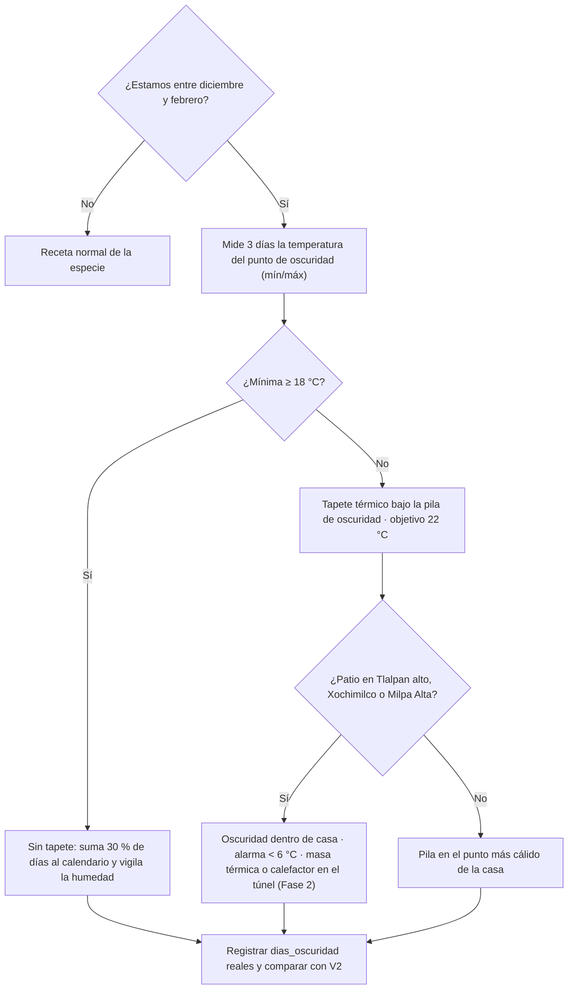

# Germinar en invierno (diciembre a febrero)

**En una línea:** de diciembre a febrero la CDMX baja de los 18 °C que necesita la semilla; un tapete térmico de ~$380, un termómetro y 30–50 % más de días en el calendario mantienen el flujo de charolas sin girasol podrido ni fechas de entrega incumplidas.

!!! info "Antes de empezar"
    - **Tiempo:** 30 min de montaje una sola vez + 2–6 días más por ciclo · **Costo:** tapete térmico de germinación 20 × 50 cm $380 aprox. ([búsqueda ML](https://listado.mercadolibre.com.mx/tapete-termico-germinacion), [`bom/fase1.csv`](https://github.com/AndresIslas99/HomeGreen/blob/main/bom/fase1.csv); rango $250–450 aprox.) · termohigrómetro $150–199 ([Steren](https://www.steren.com.mx/casa-y-oficina/termometros-digitales)) · opcional Fase 1: tubos T8 18 W 6500K $121 c/u ([JWJ Light](https://jwjlight.mx/producto/tubo-led-t8-18w-120-cm/)) y relé del nodo ESP32 (con él, un "cuarto de germinación" a 22 °C cuesta <$1,000) · **Personas:** 1
    - **Necesitas:** tapete térmico · termohigrómetro con sonda · charolas tapa y pesos de 2–4 kg · un rincón interior de la casa · (Fase 1) DS18B20 o SHT31 en el nodo de riego y un canal de relé libre ([Fase 1 · Automatización v1](../fases/fase-1/automatizacion-v1.md)).
    - **Prerequisitos:** [Sembrar una charola](sembrar-una-charola.md) · temperatura del punto de cultivo medida 3 días ([03 §0.1](../referencia/03-instalacion.md)).

## Qué pasa en invierno (normales SMN 1991–2020)

| Mes | Máx (°C) | Mín (°C) | Media (°C) |
|---|---|---|---|
| Diciembre | 22.4 | 8.4 | 15.4 |
| Enero | 22.2 | 8.3 | 15.3 |
| Febrero | 24.3 | 9.5 | 16.9 |

Tacubaya (centro-poniente, [normales](https://smn.conagua.gob.mx/tools/RESOURCES/Normales_Climatologicas/Normales9120/df/nor9120_09048.txt)). En el sur es peor: mínimas normales de 5.7–6.4 °C en Tlalpan y 5.2–6.3 °C en Milpa Alta, con extremas de **−1 °C y −4 °C** ([research/clima §2](../research/clima-agronomia.md)).

Lo que eso le hace a una charola:

- **Óptimo de germinación: 18–24 °C.** Por debajo de 14 °C es lenta; arriba de 27 °C, desordenada ([03 §0.1](../referencia/03-instalacion.md)). Johnny's germina a 24 °C de sustrato y luego baja a 16 °C.
- **Ciclos 30–50 % más largos:** 8–10 días pasan a 12–16. La semilla no muere, pero girasol y chícharo fríos y húmedos se pudren.
- **Amaranto y albahaca micro sufren por debajo de 18 °C nocturnos:** calendarízalos de abril a octubre.
- **Luz:** el día más corto dura 10 h 58 min (21-dic), pero noviembre–febrero es la época más soleada (cielos despejados). Sin lámparas es viable en Fase 0 si el rack ve una buena ventana; para calidad pareja en 4 niveles, T8 12–14 h/día (Fase 1).
- **Demanda:** enero es un cráter (−30 a −50 % de ventas del sector, [07 §5](../referencia/07-puntos-ciegos-y-riesgos.md)): siembra menos volumen y usa el mes para experimentos V6.

## Pasos

1. **Mide el punto de oscuridad 3 días (mínima y máxima).** Termohigrómetro junto a la pila, lectura en la mañana. *Criterio de listo:* tienes 3 mínimas escritas; si todas son ≥18 °C, no necesitas tapete, solo más días.
2. **Mueve la fase de oscuridad dentro de casa**, al punto más cálido y lejos de ventanas de noche; la fase de luz puede seguir en el rack. *Criterio de listo:* mínima nocturna ≥18 °C en el termohigrómetro.
3. **Instala el tapete bajo la pila de oscuridad.** Charola lisa directamente sobre el tapete, 3–4 charolas apiladas con su peso (el apilado conserva calor); la sonda del termómetro en el sustrato de la charola más alejada del tapete. Objetivo **22 °C**, nunca arriba de 24 °C (sube la presión de enfermedad). *Criterio de listo:* la sonda marca entre 20 y 24 °C a las 2 h y a la mañana siguiente. [POR VERIFICAR: potencia en W y si el tapete trae termostato; leer la ficha del vendedor antes de comprar; sin termostato, contrólalo con timer o con el relé del ESP32]
4. **Automatiza en Fase 1.** DS18B20 en el sustrato + canal de relé del nodo de riego: histéresis alrededor de 22 °C (p. ej. ON a 21 °C, OFF a 23 °C), alarma en Home Assistant fuera del rango óptimo (p. ej. si baja de 18 °C o sube de 26 °C). *Criterio de listo:* el tapete enciende y apaga solo y la gráfica de 24 h se queda dentro de la banda.
5. **Recalcula el calendario.** Suma 30–50 % a los días de cada especie (girasol: oscuridad 3–4 días en vez de 2–3; cosecha día 12–16 en vez de 8–12). Siembra 2–4 días antes para la misma fecha de entrega y avisa al chef si una entrega se mueve. *Criterio de listo:* fechas de cosecha esperada reescritas en tu plan de siembra.
6. **Controla la humedad, no la subas.** En frío se evapora menos: atomiza en oscuridad solo si la superficie se ve seca (1×/día suele bastar) y riega por abajo con agua a temperatura del cuarto, no de la llave en la madrugada (el agua <10 °C frena brutalmente a las plantas; en NFT de albahaca es letal). *Criterio de listo:* superficie húmeda sin agua libre; sin olor agrio en la pila.
7. **Da luz suficiente al destapar.** Rack junto a la ventana más luminosa; si no la hay o produces en 4 niveles, 2 tubos T8 18 W 6500K por nivel, 12–14 h/día con timer o relé. *Criterio de listo:* tallos cortos y cotiledones verdes a las 48 h del destape; tallos estirados y pálidos = falta luz.
8. **Si estás en el sur de la ciudad:** oscuridad siempre dentro de casa, alarma de temperatura <6 °C en el túnel, cerrarlo de noche y, en Fase 2, masa térmica (2 tambos de 200 L negros) o calefactor de 500 W en relé para las ~10 noches críticas del año; una helada mata todo el NFT de albahaca. *Criterio de listo:* ninguna noche con <6 °C sin alarma recibida.
9. **Registra y compara.** `dias_oscuridad` y `fecha_cosecha` reales; en `observaciones`, `tapete 22C`. Corre un V2 de invierno (3 charolas de rábano, CV <15 %) antes de prometer volúmenes de invierno. *Criterio de listo:* tienes rendimiento medio y CV de invierno por especie.

!!! warning "Errores típicos"
    - **Tapete sin termómetro.** Un tapete a tope pasa de 27 °C: germinación desordenada y pudrición. El termómetro es parte del equipo, no opcional.
    - **Pila de oscuridad en el patio de noche** "porque de día hace calor": la mínima es la que manda.
    - **Atomizar 2×/día por costumbre** en frío: agua que no se evapora es moho.
    - **Sembrar amaranto o albahaca micro en enero** y culpar a la semilla.
    - **No mover las fechas de entrega.** Un ciclo de 12 días prometido a 9 es una entrega fallida.

## Al terminar

- [ ] 3 mínimas del punto de oscuridad medidas y anotadas
- [ ] Tapete con sonda de temperatura entre 20 y 24 °C (o sin tapete, mínima ≥18 °C)
- [ ] Calendario de siembras recalculado con +30–50 % de días
- [ ] Riego reducido y con agua a temperatura del cuarto
- [ ] Luz: ventana o T8 12–14 h/día
- [ ] Sur de CDMX: alarma <6 °C activa
- **Registrar en `bitacora/produccion.csv`:** `dias_oscuridad` y `fecha_cosecha` reales, `observaciones` con `tapete 22C` y la temperatura mínima del ciclo; rendimiento y CV de invierno por especie ([V2](../validacion/v02-rendimiento.md)).
- **Siguiente paso:** [Sembrar una charola](sembrar-una-charola.md) con la receta ajustada; en Fase 1, el lazo de temperatura en [Automatización v1](../fases/fase-1/automatizacion-v1.md).

## Fuentes

- [research/clima-agronomía §2, §4 y §8](../research/clima-agronomia.md): normales SMN de Tacubaya, Tlalpan y Milpa Alta; óptimo 18–24 °C; ciclos 30–50 % más largos; tapete térmico y cuarto de germinación a 22 °C; fotoperiodo y T8; rutina invernal del sur.
- [03 · Instalación §0.1 y §0.3](../referencia/03-instalacion.md): medir 3 días el punto, <14 °C lenta / >27 °C desordenada, tapete o punto más cálido en dic–feb.
- [research/recetas-produccion-economia §2](../research/recetas-produccion-economia.md): Johnny's (24 °C para germinar, luego 16 °C; >24 °C sube enfermedad); amaranto y albahaca abril–octubre.
- [07 · Puntos ciegos §5](../referencia/07-puntos-ciegos-y-riesgos.md): enero −30 a −50 % de demanda.
- [06 · Validación](../referencia/06-validacion-y-lazos-agenticos.md): lazos de histéresis L0, V2, V6.
- [`bom/fase1.csv`](https://github.com/AndresIslas99/HomeGreen/blob/main/bom/fase1.csv): tapete térmico, tubos T8, relé.
