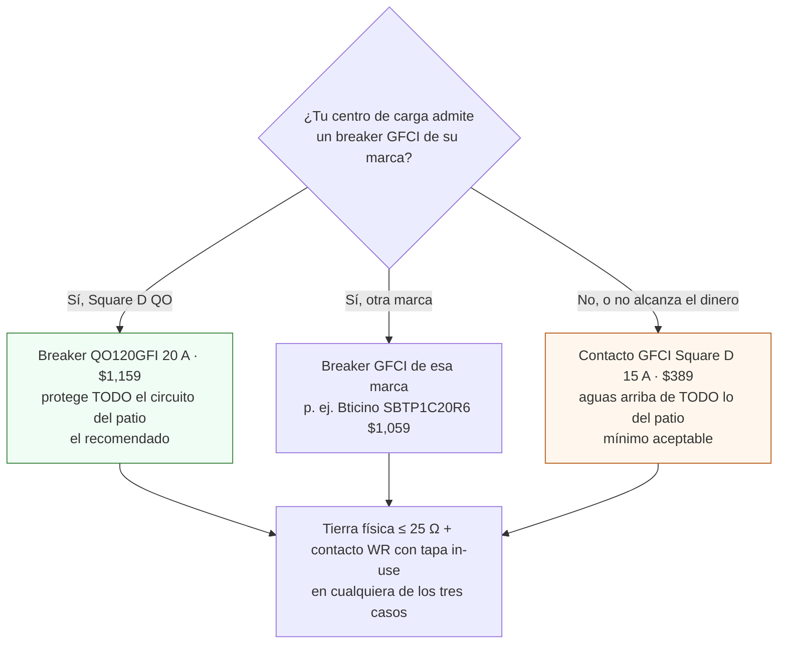

# Instalar GFCI y tierra física en el circuito del patio

**En una línea:** contratas medio día de electricista certificado para que el circuito del patio salga de un breaker GFCI, termine en un contacto de intemperie con tapa "in-use" y tenga una varilla de tierra con **≤ 25 Ω medidos**; tú defines el alcance por escrito, supervisas y recibes con checklist — porque agua + 127 V + manos mojadas es el accidente doméstico clásico, y ningún relé del patio se energiza antes de esto.

!!! info "Antes de empezar"
    - **Tiempo:** 1 semana para juntar 3 cotizaciones · medio día a 1 día de electricista · 30 min tuyos de recepción · **Costo:** breaker Square D QO120GFI **$1,159** (mínimo aceptable: contacto GFCI Square D **$389**) + tapa intemperie tipo "in-use" ~$249 aprox. + varilla copperweld 5/8" × 3 m con conector y cable cal. 8 ~$400–800 aprox. + electricista **~$1,500–3,500** llave en mano con tierra (solo GFCI + contacto: ~$500–900 de mano de obra, 2–3 h) ≈ **$3,300–5,800**; el BOM presupuesta $4,559 ([`bom/fase2.csv`](https://github.com/AndresIslas99/HomeGreen/blob/main/bom/fase2.csv), [compras Fase 2 §5](../fases/fase-2/compras.md)) · **Personas:** electricista + tú
    - **Necesitas:** el recibo de CFE (para saber qué centro de carga y qué marca de breakers tienes), la ubicación del contacto WR y de GAB-A (pared de la casa bajo el cobertizo, a 1.5 m, con cordón de uso rudo de 1 m al contacto, según [Layout del patio · Fase 1](../diseno/layout-patio.md)) [POR VERIFICAR: [Fase 1 · Automatización v1](../fases/fase-1/automatizacion-v1.md) ubica GAB-1 en el poste sureste a 1.2 m; replantea con tu patio real antes de perforar], un multímetro ([Steren MUL-005 $99](https://www.steren.com.mx/multimetro-compacto-economico.html)), el esquema de abajo impreso, celular para fotos y `bitacora/electrico.csv`
    - **Prerequisitos:** decisiones eléctricas de [Antes de gastar un peso](../empieza-aqui/antes-de-gastar-un-peso.md); túnel montado o al menos trazado ([Fase 1 · Túnel](../fases/fase-1/tunel.md)) para saber dónde va el contacto; lectura de [Diseño eléctrico §4](../diseno/electrico.md)

## Qué estás instalando y por qué


Tres piezas, y ninguna sustituye a otra ([research/eléctrico §4](../research/electrico-respaldo-seguridad.md)):

| Pieza | Qué hace | Qué exige la NOM-001-SEDE-2012 (nivel divulgativo) | Cómo se cumple en el patio |
|---|---|---|---|
| **GFCI** (interruptor por falla a tierra) | Compara la corriente que sale por la fase con la que regresa por el neutro; si difieren en ~5 mA (fuga a tierra o a través de una persona) corta en milisegundos. **Protege personas** | Contactos de 15/20 A y 127 V en exteriores y donde hay agua llevan protección GFCI (Art. 210-8) [POR VERIFICAR: numeración exacta en el texto del DOF] | Breaker QO120GFI en el centro de carga para **todo** el circuito del patio, o contacto GFCI aguas arriba de todo |
| **Contacto de intemperie** | Mantiene el agua fuera del contacto **con la clavija puesta** | El patio es "lugar mojado" (Art. 406: instalaciones "sometidas a saturación con agua"): cubierta a prueba de intemperie que proteja con la clavija conectada; contacto marcado WR | Tapa tipo "in-use" (burbuja) con contacto dúplex 2P+T; clavija SJT de uso rudo; todo empalme dentro de caja |
| **Tierra física** | Da camino de baja resistencia a la corriente de falla para que el breaker dispare y el chasis no quede energizado. **Protege equipo** (y a la persona que lo toca) | "Principio fundamental de seguridad" (Art. 250): electrodo de tierra, conductor hasta el centro de carga, **≤ 25 Ω para electrodo único**; si no se logra, segunda varilla | Varilla copperweld 5/8" × 3 m + conector de bronce o soldadura exotérmica + cable cal. 8 continuo hasta la barra de tierra |

Texto de la norma en el DOF: [NOM-001-SEDE-2012](https://dof.gob.mx/nota_detalle.php?codigo=5280607&fecha=29/11/2012). Formalmente la NOM se verifica vía UVIE en instalaciones nuevas o comerciales; en tu casa nadie va a inspeccionar el patio. Se cumple porque es lo que evita electrocutar a alguien, y porque un negocio de alimentos que recibe chefs necesita ese estándar para su responsabilidad civil.



## Quién hace qué

| Tarea | Electricista | Tú |
|---|---|---|
| Definir el alcance y las partidas | — | Sí: la lista del paso 1, por escrito |
| Comprar breaker, tapa, varilla, cable | Puede (pídelo desglosado en la cotización) | Mejor tú, con los enlaces del paso 2: sabes qué modelo y qué precio es |
| Trabajar en el centro de carga (breaker, barra de tierra, puente N–T) | **Solo él** | Nunca: es el único punto que sigue vivo con el principal abajo |
| Tender conductores en conduit, empalmes en caja, contacto WR | Sí | Supervisas con el checklist del paso 4 |
| Clavar la varilla y unir el conductor cal. 8 | Sí | Eliges el punto (tierra húmeda, accesible) y verificas que quede en registro |
| Medir la resistencia de tierra con telurómetro | Sí | Pides el valor **por escrito** |
| Probar el botón TEST del GFCI | Sí, la primera vez | Tú, cada mes ([Simulacro de apagón](simulacro-de-apagon.md)) |
| Continuidad chasis → barra de tierra con multímetro | Sí | Tú, en la recepción y cada vez que abras un gabinete |
| Montar gabinetes, cablear el 12 V | — | Tú ([Montar gabinete IP65](montar-gabinete-ip65.md)) |

## Pasos

1. **Escribe el alcance y pide 3 cotizaciones.** Manda el mismo texto a los tres (apps tipo Cronoshare o recomendación de vecinos; referencia nacional de instalación completa $200–270/m² en [Cronoshare](https://www.cronoshare.com.mx/cuanto-cuesta/instalacion-electrica), que no aplica directo al patio):

    ```text
    Circuito nuevo de 127 V para patio (lugar mojado, NOM-001-SEDE):
    1. Breaker GFCI 20 A (Square D QO120GFI o equivalente de mi marca) en el centro de carga, circuito dedicado.
    2. Conductores cal. 12 AWG THW-LS (L negro, N blanco, T verde/desnudo) en conduit hasta el patio, ≈ __ m, sin empalmes fuera de caja.
    3. Contacto dúplex resistente a intemperie (WR) con tapa tipo "in-use" (protege con la clavija puesta) a 1.5 m en el punto que te señalo (pared bajo el cobertizo, junto al gabinete de 127 V).
    4. Tierra física: varilla copperweld 5/8" × 3 m completa, conector de bronce o soldadura exotérmica, conductor cal. 8 continuo hasta la barra de tierra del centro de carga, en registro con tapa.
    5. Medición de resistencia de tierra con telurómetro: entrego ≤ 25 Ω por escrito; si sale más, segunda varilla o intensificador (cotizar aparte).
    6. Prueba del botón TEST del GFCI delante de mí.
    Material lo compro yo (o desglósalo). Cotiza mano de obra y tiempo.
    ```

    *Criterio de listo:* 3 cotizaciones con las 6 partidas y fecha; la de en medio suele ser la buena. Rango esperado: $1,500–3,500 llave en mano con tierra ([research/eléctrico §3.8](../research/electrico-respaldo-seguridad.md)).

2. **Compra el material antes del día de la cita** (todo verificado el 12-sep-2026 salvo donde dice aprox.):

    | Partida | Producto | Precio | Dónde | Nota |
    |---|---|---|---|---|
    | GFCI (recomendado) | Breaker Square D QO120GFI 20 A | **$1,159** | [Home Depot MX](https://www.homedepot.com.mx/s/interruptor%20falla%20a%20tierra) | QO115GFI de 15 A $1,179; Bticino SBTP1C15R6/C20R6 $1,059. **Confirma la marca de tu centro de carga antes de comprar** [POR VERIFICAR: abre la tapa del tablero y lee la marca; el breaker debe ser de esa marca] |
    | GFCI (mínimo) | Contacto dúplex GFCI Square D 15 A | **$389** | [Home Depot MX](https://www.homedepot.com.mx/s/gfci) | Estevez $239–489. Solo si no cabe el breaker; va aguas arriba de todo lo del patio |
    | Contacto exterior | Tapa de exteriores VETO con contacto doble 2P+T (in-use) | ~$249 aprox. | [Home Depot MX](https://www.homedepot.com.mx/s/tapa%20intemperie) | Precio interpretado del formato en centavos de la ficha: confirma en tienda |
    | Electrodo | Varilla copperweld 5/8" × 3 m + conector | ~$250–450 aprox. | [Mercado Libre](https://listado.mercadolibre.com.mx/varilla-copperweld-5-8-3-metros) o tlapalería/materiales eléctricos | La varilla CMP de 72.5 cm de Home Depot ($69 aprox.) **no** es la estándar para NOM. Kit intensificador (GEM) +$250–400 si el suelo es seco |
    | Conductor de tierra | Cable cal. 8 AWG desnudo o verde, la longitud mínima entre varilla y tablero | en el ~$400–800 del electrodo | Tlapalería / [AG Electrónica](https://agelectronica.com) | Continuo, sin empalmes |
    | Cable del contacto al gabinete | Extensión o cable SJT 3 × 14 AWG de uso rudo, 3 m | dentro del material de soporte (~$1,000, [compras Fase 1](../fases/fase-1/compras.md)) | AG Electrónica / tlapalería | Nunca extensión doméstica ni multicontacto al aire |

3. **Elige el punto del contacto y la ruta del conduit** con el electricista, antes de que perfore nada: contacto a **1.5 m** en la pared de la casa bajo el cobertizo, donde va GAB-A: cordón SJT de 1 m del contacto al gabinete y, de ahí, la troncal aérea a 2.2 m con mensajero de acero lleva 127 V y 12 V al túnel ([Layout del patio · Fase 1](../diseno/layout-patio.md), [Montar gabinete IP65](montar-gabinete-ip65.md)); bajo techo, fuera del alcance de los nebulizadores y del goteo; ruta del conduit por muro, no cruzando el paso ni bajo la canaleta [POR VERIFICAR: [Fase 1 · Automatización v1 paso 11](../fases/fase-1/automatizacion-v1.md) pone GAB-1 en el poste sureste a 1.2 m y el layout en la columna NE a 2.0 m; decide con el patio real y corrige la página que no aplique]; longitud ≤ 18 m para cal. 12 a 20 A (la carga real es < 5 A: sobra; [Diseño eléctrico · tabla de cableado](../diseno/electrico.md)). *Criterio de listo:* punto marcado con pintura y metros de conduit anotados en la cotización.

4. **El día de la instalación, supervisa estos 9 puntos** (imprime esta lista; no hace falta que sepas de electricidad para verlos):

    - [ ] Breaker principal **abajo y bloqueado** (candado o cinta + aviso) antes de abrir el centro de carga; nadie trabaja con la mano mojada
    - [ ] El GFCI queda **en el centro de carga**, alimentando solo el circuito del patio (si es contacto GFCI: es el **primero** del circuito, y todo lo demás cuelga de sus terminales LOAD)
    - [ ] Tres conductores cal. 12 en conduit: **L negro, N blanco, T verde o desnudo**; cero empalmes fuera de caja, cero cinta como aislamiento
    - [ ] Contacto **WR** con la tapa "in-use" cerrando **con una clavija puesta**; la terminal de tierra del contacto conectada de verdad al conductor verde (no "al aire")
    - [ ] El **puente neutro–tierra existe solo en el centro de carga principal**; en el patio N y T nunca se tocan (si se unen, el GFCI dispara "sin razón" y el neutro carga la tierra)
    - [ ] Varilla de **3 m completa** clavada (no cortada ni doblada), en tierra húmeda o jardín, **no bajo losa seca**, con la punta en un **registro con tapa** para poder revisarla
    - [ ] Unión varilla–cable con **abrazadera de bronce apretada o soldadura exotérmica**; cable cal. 8 **continuo** hasta la barra de tierra del tablero, sin empalmes
    - [ ] Tierra de equipo: el verde del cable de uso rudo llega a la bornera de tierra del gabinete A y a cualquier chasis metálico; **nunca a la tubería de agua ni al neutro**
    - [ ] Todo lo que se abrió quedó cerrado: tapa del tablero atornillada, registros con tapa, conduit sellado en las entradas

5. **Prueba el botón TEST del GFCI** (el electricista la primera vez, tú cada mes):

    === "Breaker QO120GFI"

        1. Conecta una carga visible al contacto del patio (una lámpara o un cargador con LED).
        2. Con el breaker **ON**, oprime el botón **TEST** del breaker (según la hoja de instrucciones del modelo). *Esperado:* la palanca salta a la posición de disparo y la lámpara se apaga **al instante**.
        3. Rearma: lleva la palanca a **OFF** por completo y luego a **ON** [POR VERIFICAR: secuencia exacta de rearme en la hoja del QO120GFI]. La lámpara enciende.
        4. Si no dispara, o dispara y no rearma: el breaker está mal cableado (neutro del circuito debe ir al breaker, no a la barra) o defectuoso. No se recibe.

    === "Contacto GFCI"

        1. Conecta la lámpara al propio contacto GFCI y a uno de los contactos aguas abajo.
        2. Oprime **TEST**: se apagan **los dos** (el aguas abajo demuestra que el circuito completo cuelga de LOAD). Oprime **RESET**: encienden.
        3. Si el aguas abajo no se apaga, el electricista lo cableó a LINE: corrígelo antes de recibir.

    Si el electricista trae probador de contactos con botón GFCI, pídele que lo use también: confirma polaridad y tierra en el contacto en un solo paso.

6. **Medición de la tierra.** El telurómetro clava dos picas auxiliares a varios metros de la varilla y mide la resistencia del electrodo (método de caída de potencial). Pide que lo haga **delante de ti** y que anote el valor, la fecha y el método en la nota. *Criterio de listo:* **≤ 25 Ω**. Si sale más: segunda varilla en paralelo (separación mínima según Art. 250 [POR VERIFICAR: distancia en el texto de la NOM-001]) o intensificador de tierra (GEM), y se vuelve a medir. En época seca (nov–abr) el suelo mide más: si estás en el límite, riega el registro antes de medir y anota que fue así.

    !!! tip "Lo que sí puedes comprobar tú, con multímetro (orientativo, no sustituye al telurómetro)"
        - **Continuidad de tierra**, con el breaker del patio **abajo**: multímetro en ohms/continuidad entre la terminal de tierra del contacto WR (o el chasis del gabinete) y la barra de tierra del tablero → pita, lectura cercana a **0 Ω** (menos de 1 Ω). Si marca decenas de ohms o nada, hay un empalme flojo o el verde no llega.
        - **Voltajes en el contacto**, con el breaker arriba, puntas en buen estado y **una sola mano** cerca del contacto: L–N ≈ 127 V, L–T ≈ 127 V, **N–T ≈ 0 V** (unos pocos volts como máximo). Si N–T da decenas de volts o L–T da 0, la tierra no está conectada.

7. **Recibe con documento.** Antes de pagar el resto, ten en la mano: nota o recibo con **valor de resistencia de tierra (Ω)**, modelo del breaker o contacto GFCI, calibre de los conductores, metros de conduit y fecha; foto del centro de carga con el GFCI, del contacto con la tapa cerrada sobre una clavija y del registro de la varilla. Esto es lo que enseñas si un día un cliente hotelero, una aseguradora o un perito preguntan.

!!! warning "Error típico: quitar o puentear el GFCI porque 'dispara mucho'"
    Un GFCI que dispara está detectando una fuga real: una fuente goteada, un cable pelado en el tinaco, un contacto sin tapa, un puente N–T en el patio. Se busca la fuga con el circuito desenergizado (desconecta las cargas una por una y rearma hasta encontrar la que dispara); **nunca** se sustituye por un breaker normal. Lo mismo con la tierra: "aterrizar" al tubo del agua o al neutro no es tierra, es un accidente esperando.

!!! danger "Nunca en el patio"
    - Extensiones domésticas ni multicontactos al aire; solo circuito fijo + contacto WR con tapa in-use y clavija SJT de uso rudo.
    - Empalmes fuera de caja o con cinta: todo empalme en caja IP65 con borneras.
    - Fuentes, relés o el ESP32 "al aire" o en caja sin IP65 ([Montar gabinete IP65](montar-gabinete-ip65.md)).
    - 127 V y 12 V en el mismo gabinete o compartiendo prensaestopa.
    - Abrir el centro de carga tú: eso lo hace el electricista, con el principal abajo.

## Al terminar

- [ ] GFCI instalado (breaker en el centro de carga o contacto aguas arriba de todo); botón TEST dispara y rearma; las cargas aguas abajo se apagan con el TEST
- [ ] Contacto WR con tapa in-use cerrada sobre una clavija; N y T separados en el patio; puente N–T solo en el tablero
- [ ] Varilla copperweld 5/8" × 3 m en registro con tapa; cable cal. 8 continuo; **≤ 25 Ω por escrito** con fecha y método
- [ ] Continuidad tierra ≈ 0 Ω desde el contacto hasta la barra del tablero (tu multímetro); N–T ≈ 0 V
- [ ] Nota del electricista + 3 fotos guardadas con la bitácora
- Registrar en `bitacora/electrico.csv` (campos `fecha,evento,gabinete,rama,valor_medido,unidad,quien,observaciones`, [Diseño eléctrico](../diseno/electrico.md)): una fila `evento=tierra_ohm` con el valor medido (`unidad=ohm`, `quien=` nombre del electricista) y una `evento=test_gfci` con `valor_medido=OK` y el modelo del GFCI en `observaciones`
- Siguiente paso: [Montar gabinete IP65](montar-gabinete-ip65.md) → [Fase 1 · Automatización v1](../fases/fase-1/automatizacion-v1.md) (o, en Fase 2, [Armar el respaldo DC](armar-respaldo-dc.md)); repite el TEST del GFCI cada mes con el [Simulacro de apagón](simulacro-de-apagon.md)

## Fuentes

- [research/electrico-respaldo-seguridad §3.6 (cotizaciones GFCI, tapa, varilla), §3.8 (electricista) y §4 (NOM-001-SEDE-2012, lugares mojados, ≤ 25 Ω)](../research/electrico-respaldo-seguridad.md)
- [referencia/03-instalacion §1.3](../referencia/03-instalacion.md) — seguridad eléctrica obligatoria antes del primer relé
- [diseno/electrico §4 y tabla de cableado](../diseno/electrico.md) — esquema del tablero, calibres, protecciones, errores típicos
- [fases/fase-2/compras §5](../fases/fase-2/compras.md) y [`bom/fase2.csv`](https://github.com/AndresIslas99/HomeGreen/blob/main/bom/fase2.csv) — partidas de seguridad
- [referencia/normativa](../referencia/normativa.md) — resumen normativo del proyecto
- Texto de la NOM-001-SEDE-2012 en el DOF: <https://dof.gob.mx/nota_detalle.php?codigo=5280607&fecha=29/11/2012> · Programa Casa Segura (educación en seguridad eléctrica): <https://programacasasegura.org>
