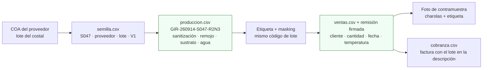

# Correr un simulacro de retiro (mock recall) en menos de 2 horas

**En una línea:** una vez al año (y antes de la primera auditoría de un hotel) eliges un lote al azar y demuestras con cronómetro, en menos de 2 horas, de qué costal de semilla salió y a qué clientes llegó, con remisiones firmadas y fotos; si la bitácora está bien llevada tardas 30 minutos, y si no, hoy es el día de enterarte.

!!! info "Antes de empezar"
    - **Tiempo:** 2 h máximo cronometradas (meta real: < 1 h) + 30 min de informe; 1 vez al año, V10 ([06 §V10](../referencia/06-validacion-y-lazos-agenticos.md)) · **Costo:** $0 · **Personas:** 1; mejor 2 (uno elige el lote y cronometra, otro rastrea)
    - **Necesitas:** `bitacora/produccion.csv`, `bitacora/semilla.csv`, `bitacora/ventas.csv`, `bitacora/cobranza.csv` · carpeta de remisiones firmadas · fotos de contramuestra por entrega · COA de los costales (`bitacora/coa/Sxxx.pdf`) · cronómetro · plantilla de informe (abajo).
    - **Prerequisitos:** lote `VAR-AAMMDD-Slote-pos` en masking desde la charola #1 ([Sembrar una charola](sembrar-una-charola.md)) · el mismo lote en la etiqueta ([Cosechar y empacar](cosechar-y-empacar.md)) · remisión firmada con lote en cada entrega ([Ruta de reparto](ruta-de-reparto.md)) · costal con `S001…` y COA en `semilla.csv` ([Prueba de germinación](prueba-de-germinacion.md)).

## Qué demuestra: hacia atrás y hacia adelante



| Dirección | Pregunta que respondes | Dónde está la respuesta |
|---|---|---|
| **Hacia atrás** (un chef reporta un problema con el lote X) | ¿De qué costal salió? ¿Qué sanitización, remojo, sustrato y agua llevó? ¿Qué otras charolas comparten costal, sustrato o agua? | `produccion.csv` → `semilla.csv` + COA; `observaciones` de la charola |
| **Hacia adelante** (el proveedor avisa que el costal S047 salió contaminado) | ¿Qué charolas se sembraron con S047? ¿Cuáles se vendieron, a quién, cuándo? ¿Cuáles siguen en el rack o en el refrigerador? | `produccion.csv` (filtro `lote_semilla = S047`) → `ventas.csv` + remisiones |

La referencia internacional es la regla de trazabilidad FSMA 204 (EE. UU.), que pone a germinados y hojas frescas en la lista de alta prioridad con requisitos de lote similares a este diseño ([research/inocuidad §5](../research/inocuidad-operativa.md)); en México, el paquete documental de hoteles con Distintivo H incluye "descripción del sistema de lotes y política de retiro" ([research/inocuidad §6](../research/inocuidad-operativa.md)).

## Pasos (con el cronómetro corriendo)

1. **T+0: elige el lote al azar.** Sin mirar, un número entre 1 y el total de filas de `produccion.csv` de los últimos 60 días (dado, generador o "la fila 37"). Anota el `siembra_id` y arranca el cronómetro. *Criterio de listo:* código escrito y hora de inicio anotada; nadie eligió un lote "cómodo".
2. **T+10 min: rastrea hacia atrás.** De la fila del lote: `lote_semilla`, `densidad_g`, `dias_oscuridad`, y en `observaciones` la sanitización (método, temperatura, minutos, operador), remojo, lote de paca de coco y fuente de agua. En `semilla.csv`: proveedor, lote del proveedor, fecha de compra, resultado V1 y si hay COA (abre el PDF). *Criterio de listo:* proveedor + lote del proveedor + COA (o "sin COA") escritos en el informe.
3. **T+25 min: lista las charolas hermanas.** Filtra `produccion.csv` por el mismo `lote_semilla`; después por la misma fecha de siembra (misma paca de coco y misma agua de remojo). Cuenta: sembradas, cosechadas, descartadas (`merma_pct`), en rack, en refrigerador. *Criterio de listo:* una tabla con cada charola hermana y su estado.
4. **T+45 min: rastrea hacia adelante.** Para cada charola vendida: `destino` y `precio_mxn` en `produccion.csv`, la fila en `ventas.csv`, la remisión firmada (número, quién recibió, temperatura) y la foto de contramuestra. *Criterio de listo:* por cada charola vendida, cliente + fecha + remisión + foto; ninguna charola "sin destino".
5. **T+60 min: cuadra las cantidades.** Sembradas = vendidas + descartadas + en existencia. Si no cuadra, el hueco es el hallazgo del simulacro. *Criterio de listo:* ecuación escrita con los cuatro números.
6. **T+75 min: redacta el aviso a clientes** con el machote de abajo, aunque no lo mandes (es simulacro). Incluye qué producto, qué lote, qué fechas de entrega y qué hacer. *Criterio de listo:* mensaje listo para copiar en WhatsApp a cada cliente afectado, con nombre del administrador y del chef.
7. **T+90 min: decide la contención.** Qué charolas hermanas retirarías del rack o del refrigerador, qué muestra mandarías al laboratorio (Quibimex, [research/inocuidad §3](../research/inocuidad-operativa.md)) y si el costal se bloquea. *Criterio de listo:* tres decisiones escritas.
8. **T+120 min máximo: para el cronómetro y llena el informe.** Tiempo total, huecos encontrados, acciones correctivas con fecha. Criterio de aceptación de V10: **< 2 h**, 100 % de las charolas del costal ubicadas y las cantidades cuadran. *Criterio de listo:* informe en `bitacora/inocuidad/mock-recall-AAAA-MM-DD.md` y una copia en la carpeta de inocuidad.
9. **Corrige lo que falló esta semana**, no el año que entra: remisiones sin lote, `destino` vacío, fotos que no se guardaron, costales sin COA. *Criterio de listo:* cada hueco tiene una acción con fecha y responsable (tú).

## Machote de aviso a clientes (simulacro o real)

```
[MARCA] · Aviso de retiro preventivo
Producto: charola viva / clamshell de microgreens de [variedad]
Lote: [GIR-260914-S047-R2N3]   Entregado: [24-sep-2026], remisión [0231]
Motivo: [aviso del proveedor de semilla / resultado de laboratorio / simulacro anual]
Qué hacer: no usar el producto de ese lote; apartarlo en bolsa cerrada;
paso a recogerlo y repongo [hoy / mañana] sin costo.
Cualquier otro lote entregado no está afectado.
[Nombre] · [WhatsApp] · [fecha y hora]
```

## Machote de informe

| Campo | Ejemplo |
|---|---|
| Fecha y hora de inicio / fin | 2027-03-14 10:02 / 10:41 |
| Lote elegido y cómo | `RAB-270228-S051-R1N3`, fila 37 de `produccion.csv` por dado |
| Hacia atrás: costal, proveedor, lote del proveedor, COA, V1 | S051, Hydro Environment, 2027-01-B04, COA sí (`bitacora/coa/S051.pdf`), 91 % |
| Charolas hermanas (mismo costal): sembradas / vendidas / descartadas / en existencia | 18 / 15 / 2 / 1 |
| Hacia adelante: clientes, fechas, remisiones, fotos | Restaurante A (3, rem. 0288–0290, fotos sí) · Restaurante B (…) |
| Cuadre | 18 = 15 + 2 + 1, cuadra |
| Tiempo total | 39 min |
| Huecos | 1 remisión sin temperatura; foto faltante del 2027-03-02 |
| Acciones correctivas y fecha | Campo de temperatura obligatorio en el talonario nuevo (esta semana); foto antes de firmar |

## La carpeta de inocuidad para hoteles

El informe del simulacro va dentro del PDF único de 8–10 páginas que pide compras de un hotel o cadena ([research/inocuidad §6](../research/inocuidad-operativa.md)):

1. Constancia de Situación Fiscal + muestra de CFDI 4.0 ([Facturar CFDI](facturar-cfdi.md)).
2. Acuse del Aviso de Funcionamiento COFEPRIS-05-018 ([Aviso COFEPRIS](aviso-cofepris.md)).
3. Resultados de laboratorio de producto (mesófilos, E. coli, *Salmonella*) y de agua, con menos de 6 meses, de laboratorio con EMA o Tercero Autorizado ([Quibimex](https://laboratorioquibimex.com/); monitoreo económico de agua en [LANISAF](https://lanisaf.chapingo.mx/), $542–607/muestra).
4. Ficha técnica por producto: variedad, presentación, vida de anaquel (5 °C: 14 días), conservación, foto.
5. Carta de garantía de inocuidad + descripción del sistema de lotes + política de retiro + **este informe de simulacro**.
6. Constancias de capacitación (Manejo Higiénico de Alimentos, curso COFEPRIS).
7. Si lo piden: póliza de RC de producto (Fase 2, ~$3,000–8,000/año aprox., cotizar).

Ningún microproductor de microgreens encontrado en CDMX llega con esto más el dashboard de monitoreo 24/7: es la diferencia que justifica el precio premium ([research/inocuidad §6](../research/inocuidad-operativa.md)).

!!! warning "Errores típicos"
    - **Elegir un lote "bonito".** El simulacro sirve porque es al azar; si eliges, mides tu memoria, no tu sistema.
    - **Bitácora llenada de memoria el domingo.** `destino` vacío o `siembra_id` que no coincide con la etiqueta es el hallazgo más común; la regla es 30 s por evento, el mismo día ([06 · Esquema de datos](../referencia/06-validacion-y-lazos-agenticos.md)).
    - **Remisión sin lote o sin firma.** Sin lote no rastreas; sin firma no demuestras la entrega.
    - **Costal sin `Sxxx`.** Semilla "del mismo proveedor" no es un lote; cada costal tiene su consecutivo el día que llega.
    - **No guardar la foto de contramuestra**, o guardarla sin fecha en el nombre.
    - **Hacerlo solo cuando el hotel lo pida.** Se hace una vez al año con calendario; la auditoría te encuentra ya entrenado.

## Al terminar

- [ ] Lote elegido al azar y cronómetro detenido en < 2 h (meta: < 1 h)
- [ ] Hacia atrás: costal, proveedor, lote del proveedor y COA identificados
- [ ] Hacia adelante: cada charola vendida con cliente, remisión firmada y foto
- [ ] Cuadre sembradas = vendidas + descartadas + existencia
- [ ] Informe guardado y huecos con acción correctiva fechada
- **Registrar:** informe en `bitacora/inocuidad/mock-recall-AAAA-MM-DD.md` (propuesta de esta guía; formato de la tabla de arriba) y copia en la carpeta de inocuidad PDF; en `bitacora/produccion.csv`, corrige `destino` u `observaciones` de las filas con huecos sin borrar el original (anota "corregido en mock recall AAAA-MM-DD").
- **Siguiente paso:** [V10 · Simulacro de retiro](../validacion/v10-mock-recall.md) para la evidencia del gate; repetir en 12 meses y antes de cada alta como proveedor de hotel o cadena.

## Fuentes

- [research/inocuidad-operativa §5 y §6](../research/inocuidad-operativa.md): código de lote, campos por charola, contramuestra, mock recall anual < 2 h, FSMA 204, paquete documental de hoteles y Distintivo H; laboratorios [Quibimex](https://laboratorioquibimex.com/) y [LANISAF](https://lanisaf.chapingo.mx/).
- [06 · Validación §V10 y Esquema de datos](../referencia/06-validacion-y-lazos-agenticos.md): criterio < 2 h, formato `VAR-AAMMDD-Slote-posición`, `produccion.csv` y `ventas.csv`.
- [Diseño · Datos](../diseno/datos.md): esquema de `bitacora/semilla.csv` (proveedor, lote del proveedor, COA, V1).
- [07 · Puntos ciegos §11](../referencia/07-puntos-ciegos-y-riesgos.md): la trazabilidad como autoseguro; 7 recalls del sector en EUA.
- [research/normativa-fiscal §b](../research/normativa-fiscal.md): manuales BPA de SENASICA como plantilla de bitácora; microgreens vs germinados.
