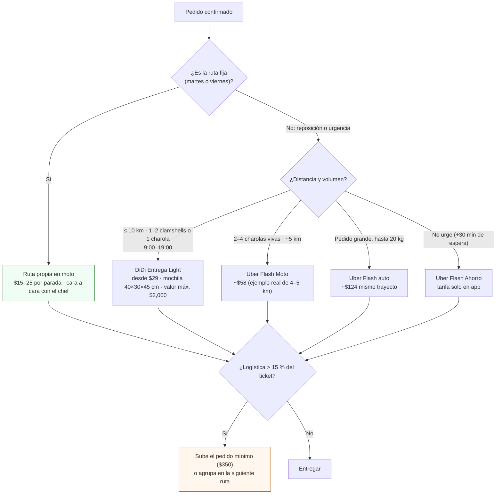

# Armar la ruta de reparto

**En una línea:** dos días fijos por semana (martes y viernes), 6–10 paradas en un radio de 5–8 km, hielera fría para lo cortado y charolas vivas sin apilar, remisión firmada y foto en cada puerta; cuesta $15–25 por parada en moto propia y solo se terceriza (DiDi Entrega Light desde $29, Uber Flash Moto ~$58) una reposición o una urgencia.

!!! info "Antes de empezar"
    - **Tiempo:** 1.5–2 h por ruta en tráfico de CDMX, 3–4 h/semana en régimen ([07 §4](../referencia/07-puntos-ciegos-y-riesgos.md)) · **Costo:** gasolina y desgaste ~$15–25 por parada, $800–1,200/mes según el plan ([research/mercado §7](../research/mercado-precios.md)); hielera rígida 45–50 L + 6 gel packs ~$1,300 aprox. ([`bom/fase2.csv`](https://github.com/AndresIslas99/HomeGreen/blob/main/bom/fase2.csv), [búsqueda ML](https://listado.mercadolibre.com.mx/hielera-45-litros)) · **Personas:** 1
    - **Necesitas:** moto o bici con caja/mochila rígida · hielera exclusiva para producto + 4–6 gel packs congelados · termómetro de cocina · talonario de remisiones en duplicado · teléfono con el pedido de cada cliente, CLABE y `bitacora/ventas.csv` · film o tapas para charolas vivas · charolas vacías para el intercambio.
    - **Prerequisitos:** producto listo la mañana de la entrega ([Cosechar y empacar](cosechar-y-empacar.md)) · pedidos confirmados el lunes 12:00 (o jueves para el viernes) · más de 3 clientes activos (antes, la entrega va dentro de la visita: [Visitar a un chef](visitar-a-un-chef.md)).

## Propia o tercerizada: decide por parada

| Opción | Costo | Sirve para | Fuente |
|---|---|---|---|
| Ruta propia en moto, 2 días fijos | ~$15–25 por parada en ruta de 6–10 clientes, radio 5–8 km | Todo el reparto de régimen; el contacto cara a cara es la retención | [research/mercado §7](../research/mercado-precios.md) (estimación propia del informe) |
| [DiDi Entrega Light](https://dplnews.com/didi-lanza-servicio-de-entrega-para-pequenos-paquetes-desde-29-pesos-en-mexico/) (moto o bici) | Desde **$29**; máx. 10 km; 9:00–19:00; paquete tipo mochila 40×30×45 cm; valor máx. $2,000 | Clamshells sueltos; una charola viva 10×20 cabe justa [POR VERIFICAR: confirmar con el repartidor que la charola viaja plana] | ídem |
| Uber Flash Moto | **$57.66** en el ejemplo real San Miguel Chapultepec → Reforma 222 (~4–5 km) | 2–4 charolas vivas | [iProfesional](https://www.iprofesional.com/tecnologia/319179-uber-flash-como-funciona-y-cuanto-sale-el-servicio-de-envios) |
| [Uber Flash auto](https://www.uber.com/mx/es/b/courier-services/mexico-city-df-mx/) (hasta 20 kg) | **$124** mismo ejemplo | Pedido grande punto a punto; no sirve para ruta de varios clientes | ídem |
| [Uber Flash Ahorro](https://www.sdpnoticias.com/negocios/uber-flash-ahorro-disponible-en-cdmx-asi-funciona/) | Más barato aceptando hasta +30 min; tarifa solo en app | Reposiciones no urgentes | ídem |

Con $29–60 por envío tercerizado, el pedido mínimo de **$350** es lo que mantiene la logística por debajo del 15 % del ticket ([Hoja de precios](hoja-de-precios.md)).

## Pasos

1. **La víspera: arma la lista de paradas.** Una fila por cliente: pedido, formato (viva / cortado), ventana pactada (9:00–12:00), quién recibe, si hay charolas por recoger. Ordena por cercanía: primero el cliente más lejano en dirección de salida y regresas cerrando el círculo, o por zona (Roma–Condesa–Juárez–Polanco un día, Coyoacán–San Ángel otro) ([research/mercado §6](../research/mercado-precios.md)). Congela 4–6 gel packs. *Criterio de listo:* lista de 6–10 paradas con hora estimada; gel packs sólidos.
2. **Llena las remisiones antes de salir.** Cliente, fecha, producto, cantidad, precio unitario, lote (`siembra_id`), total; deja el espacio de firma y de temperatura. *Criterio de listo:* una remisión en duplicado por parada, sin espacios en blanco salvo firma y temperatura.
3. **Carga en este orden.** Cortado: del refrigerador (4–5 °C) directo a la hielera con los gel packs, sin abrirla hasta la primera parada; mantiene < 10 °C por 4–6 h, de sobra para 2–4 h de ruta. Charolas vivas: **sin apilar**, con film o tapa, planas en caja rígida, follaje seco y sustrato húmedo; nunca al sol. Nada de producto junto a gasolina o químicos (NOM-251). *Criterio de listo:* termómetro dentro de la hielera; las charolas no se mueven al inclinar la caja.
4. **Sal a las 8:30 y entrega entre 9:00 y 12:00.** Es la ventana del acuerdo de suministro (cláusula 3) y la hora en que el chef o el sous chef ya están y aún no hay servicio ([research/cobranza §4](../research/cobranza-b2b.md)). Reparte primero lo cortado; las charolas vivas aguantan toda la ruta. *Criterio de listo:* última parada antes de las 12:00.
5. **En cada puerta, la misma rutina de 4 minutos:** (a) quien recibe inspecciona al momento: el rechazo solo procede en recepción; (b) mide y anota la temperatura del cortado en la remisión; (c) firma en duplicado, una copia se queda; (d) foto de charolas + etiqueta como contramuestra; (e) recoges las charolas vacías de la semana pasada; (f) en Fase 0, SPEI al momento o el mismo día. *Criterio de listo:* remisión firmada, temperatura, foto y charolas de regreso antes de arrancar.
6. **Mira el local mientras entregas.** Menú recortado, salón vacío en hora pico, "el de pagos no vino", camioneta del gas que no surte: son señales de alerta gratis, una vez por semana ([Cobrar y suspender](cobrar-y-suspender.md)). *Criterio de listo:* cualquier señal anotada en `feedback`.
7. **Si algo falla en ruta:** charola volteada, cortado que llegó a > 10 °C o pedido incompleto, no lo entregues; ofrece reposición en 24 h por DiDi Entrega Light o en la siguiente ruta, y anótalo como rechazo (presupuesto: 5–10 % de entregas en los primeros 6 meses, [07 §6](../referencia/07-puntos-ciegos-y-riesgos.md)). *Criterio de listo:* el cliente sabe a qué hora llega la reposición.
8. **Al llegar: registra y lava.** `bitacora/ventas.csv` con `entregado_a_tiempo` por cliente; charolas recogidas a la pila de lavado; hielera vacía, lavada y abierta para que seque. *Criterio de listo:* bitácora del día llena antes de comer; hielera seca.

!!! tip "Mantén el radio"
    El plan fija 5 km; el reparto propio sigue siendo lo más barato hasta 8 km. Un cliente a 12 km "porque paga bien" cuesta 40 min extra por ruta y te empuja a tercerizar ($29–124 por envío). Si el patio está al sur, arranca por Coyoacán–San Ángel ([research/mercado §6](../research/mercado-precios.md)).

!!! warning "Errores típicos"
    - **Abrir la hielera en cada semáforo** o llevar cortado fuera de la hielera "porque es la primera parada": a 20–25 °C dura menos de un día.
    - **Apilar charolas vivas** para que quepan: llegan aplastadas y con moho a los dos días.
    - **Entregar sin firma "porque el chef estaba ocupado".** Sin remisión firmada no hay deuda demostrable ni prueba de aceptación.
    - **Tomar la ruta de varios clientes con Uber Flash.** Es punto a punto; cada parada extra es otro viaje.
    - **Cambiar de día "por esta semana".** El chef planea su mise en place con tu martes; la continuidad es tu único apalancamiento.
    - **Usar la hielera del súper o del paseo.** Hielera limpia y exclusiva para producto.

## Al terminar

- [ ] 100 % de las entregas dentro de la ventana 9:00–12:00 (KPI L2: meta 100 %, rojo < 90 %)
- [ ] Remisión firmada, temperatura y foto de contramuestra por cada parada
- [ ] Charolas de la semana anterior recogidas y en la pila de lavado
- [ ] Ningún cortado entregado a > 10 °C; rechazos anotados con causa
- [ ] Costo de la ruta anotado (gasolina o envíos tercerizados) para el margen variable (meta ≥ 60 %)
- **Registrar:** `bitacora/ventas.csv` (`fecha,cliente,producto,cantidad,precio_unit_mxn,entregado_a_tiempo,feedback`); en `feedback` la temperatura de entrega y cualquier señal de alerta del local. Horas de reparto en el [timesheet](timesheet-semanal.md).
- **Siguiente paso:** [Lavar y desinfectar charolas](lavar-y-desinfectar-charolas.md) hoy; [Facturar CFDI](facturar-cfdi.md) con las remisiones firmadas.

## Fuentes

- [research/mercado-precios §6–7](../research/mercado-precios.md) y [01 · Proveedores §7](../referencia/01-proveedores-cdmx.md): zonas, costos por parada, DiDi Entrega Light, Uber Flash Moto/auto/Ahorro, pedido mínimo $350.
- [07 · Puntos ciegos §3, §4, §6 y §8](../referencia/07-puntos-ciegos-y-riesgos.md) y [research/puntos-ciegos §(e)–(f)](../research/puntos-ciegos.md): hielera y gel packs, horas de reparto, rechazos, remisión firmada.
- [research/inocuidad-operativa §4–5](../research/inocuidad-operativa.md): transporte según NOM-251, temperatura a la entrega, contramuestra fotográfica.
- [research/cobranza-b2b §4–5](../research/cobranza-b2b.md): ventana de entrega, rechazo solo en recepción, señales de alerta en el local.
- [06 · Validación §L2](../referencia/06-validacion-y-lazos-agenticos.md): KPI de entregas a tiempo y margen variable.
- [`bom/fase2.csv`](https://github.com/AndresIslas99/HomeGreen/blob/main/bom/fase2.csv): hielera 45–50 L + 6 gel packs.
