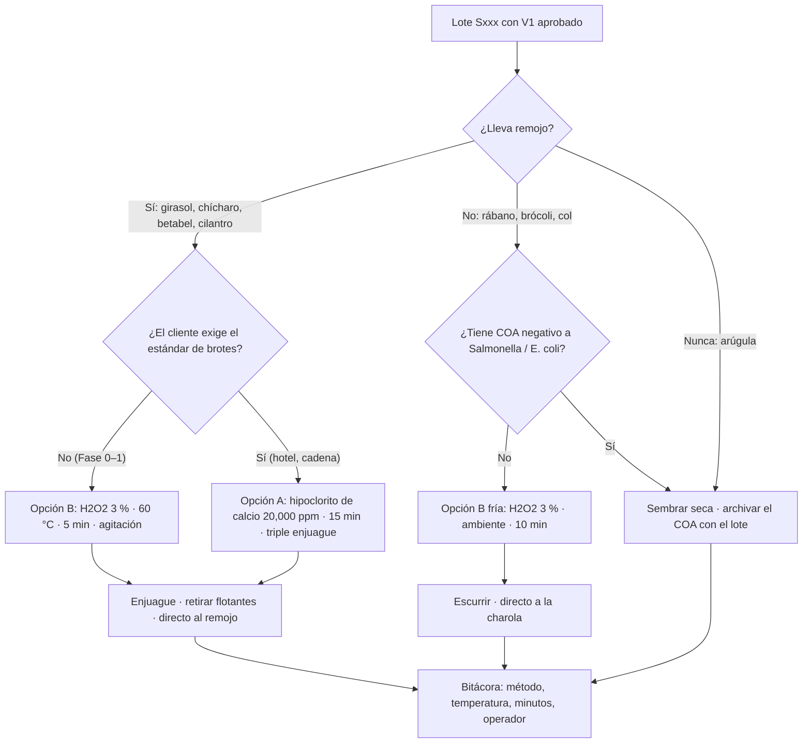

# Sanitizar semilla antes de remojar

**En una línea:** un baño de 5–15 minutos que ataca el riesgo real del negocio (el remojo tibio de girasol o chícharo con semilla contaminada es una incubadora de *Salmonella* y *E. coli* O157:H7) y deja en la bitácora el dato que un chef con Distintivo H o un hotel te va a pedir.

!!! info "Antes de empezar"
    - **Tiempo:** 15 min activos (Opción B) · 30 min (Opción A, con triple enjuague) · **Costo:** ~$0.30/charola en desinfección ([08](../referencia/08-recetas-y-economia-unitaria.md)); insumos de [`bom/fase0.csv`](https://github.com/AndresIslas99/HomeGreen/blob/main/bom/fase0.csv): agua oxigenada 3 % de farmacia $30 aprox. el frasco · hipoclorito de calcio 65 % 1 kg $250 aprox. ([búsqueda ML](https://listado.mercadolibre.com.mx/hipoclorito-de-calcio) o tienda de albercas) · termómetro de cocina $150 aprox. · **Personas:** 1
    - **Necesitas:** báscula 0.1 g · jarra graduada · cubeta de 19 L marcada en litros, exclusiva para semilla · colador · termómetro de cocina · olla o baño maría · guantes de nitrilo ($369 verificado en [Home Depot](https://www.homedepot.com.mx/p/forte-caja-de-100-guantes-medianos-de-nitrilo-desechables-para-uso-rudo-93252-206899), desde ~$180 en ML) · gafas · agua potable (garrafón, o de la red hervida o filtrada) · cronómetro del teléfono.
    - **Prerequisitos:** lote con V1 aprobado ([Prueba de germinación](prueba-de-germinacion.md)); código de lote interno `Sxxx` escrito en el costal y ligado en el registro de semilla al proveedor, su lote y su COA si existe ([research/inocuidad §5](../research/inocuidad-operativa.md)).

## Qué tratamiento le toca a cada semilla

Regla de decisión de [research/inocuidad-operativa §2](../research/inocuidad-operativa.md): el riesgo lo pone el remojo, no la especie.

| Semilla | Remojo | Riesgo | Tratamiento |
|---|---|---|---|
| Girasol | 8–12 h | Alto | **Siempre.** Opción B en Fase 0; Opción A cuando un hotel o cadena pida el estándar de brotes |
| Chícharo | 8–24 h | Alto | **Siempre.** Opción A o B |
| Betabel / acelga | 4–8 h | Medio | Opción B si hay remojo |
| Cilantro (entera) | 2–4 h | Medio | Opción B 5–10 min (una de las "semillas sucias" de Bootstrap Farmer, junto con girasol y chícharo) |
| Rábano, brócoli, col | sin remojo | Bajo–medio | Opción B fría 10 min, o semilla con COA del proveedor |
| Arúgula | **nunca** (mucílago) | Bajo | Sin inmersión: semilla con COA o carta de "sin tratamiento", siembra seca |

!!! danger "Química que no se mezcla"
    - **Nunca juntes cloro (hipoclorito) con ácidos ni con peróxido**; usa cubetas distintas y etiquetadas.
    - Hipoclorito de calcio: solución cáustica y oxidante. Guantes de nitrilo, gafas, exterior o zona ventilada; desecha diluida.
    - H2O2 al 35 % es corrosivo: diluye 1:11 para llegar a 3 % (1 parte de 35 % + 11 partes de agua), con guantes y gafas.
    - Nunca almacenes semilla húmeda después de tratarla: va directo al remojo o a la charola.

## Pasos

=== "Opción B · H2O2 3 % (estándar de Fase 0)"

    Protocolo tipo UC ANR Pub. 8151 para brotes caseros: menos letal que los 20,000 ppm de cloro, razonable para microgreens cortados en aéreo con higiene de proceso. El insumo es el agua oxigenada de cualquier farmacia (o H2O2 35 % grado alimenticio diluido 1:11, [búsqueda ML](https://listado.mercadolibre.com.mx/peroxido-de-hidrogeno-35%25-grado-alimenticio-oxigeno-liquido)).

    1. **Pesa la semilla del día y prepara el volumen.** Suficiente H2O2 3 % para cubrir toda la semilla con margen y poder agitarla (p. ej. 3 charolas de girasol = 405 g de semilla). *Criterio de listo:* la semilla cabe holgada en el recipiente y queda sumergida por completo.
    2. **Precalienta el H2O2 3 % a 60 °C** en baño maría, con el termómetro dentro. *Criterio de listo:* el termómetro marca 60 °C al momento de meter la semilla. Para rábano y brócoli (sensibles) sáltate el calor: temperatura ambiente.
    3. **Sumerge y agita 5 minutos** (10 min en frío para rábano/brócoli) con cuchara o colador, cronómetro corriendo. La agitación es parte del tratamiento: sin ella quedan bolsas de aire con semilla sin tratar. *Criterio de listo:* 5:00 en el cronómetro, sin semilla pegada al fondo o a las paredes.
    4. **Retira flotantes y basura.** Semilla hueca, palitos y cáscaras flotan: fuera. *Criterio de listo:* superficie sin nada flotando.
    5. **Enjuaga en colador con agua potable** hasta que deje de hacer espuma y no huela. *Criterio de listo:* el agua sale clara y sin olor.
    6. **Pasa directo al remojo (girasol, chícharo, betabel) o a la charola (rábano, brócoli).** Remojo en agua potable, 8–12 h; cámbiala si pasa de 12 h; lava y desinfecta la cubeta entre lotes. *Criterio de listo:* la semilla nunca estuvo húmeda y parada más de lo que dura el remojo.
    7. **Registra** (ver "Al terminar").

=== "Opción A · Hipoclorito de calcio 20,000 ppm (estándar duro)"

    El tratamiento de referencia de la industria de brotes (guías FDA 1999/2017; el marco vigente 21 CFR 112.142(e) exige "tratamiento científicamente válido" sin fijar un químico). Úsalo cuando un cliente hotelero pida el estándar duro. [POR VERIFICAR: la cifra de 20,000 ppm y el texto de §112.142(e): FDA respondió 401 al fetch y eCFR redirigió; confirmar en navegador con las URL de la sección "gaps" de research/inocuidad-operativa.md]

    1. **Valida primero el lote con 200 + 200 semillas** (tratadas vs sin tratar) en [prueba de germinación](prueba-de-germinacion.md): el hipoclorito puede bajar la germinación en lotes viejos. *Criterio de listo:* la tratada mantiene el umbral de V1 (≥85 %; girasol y chícharo ≥80 %); si cae, ese lote se trata con Opción B.
    2. **Prepara la solución al momento:** **31 g de hipoclorito de calcio al 65 % por litro de agua potable** (28.6 g/L si tu producto es al 70 %) = ~20,000 ppm de cloro libre. Volumen mínimo **5 L de solución por kg de semilla**. *Criterio de listo:* pesaste el granular en la báscula de 0.1 g y mediste el agua con la jarra; anotaste gramos y litros.
    3. **Sumerge 15 minutos con agitación continua.** *Criterio de listo:* 15:00 en el cronómetro sin dejar de mover.
    4. **Escurre y haz triple enjuague con agua potable.** *Criterio de listo:* el tercer enjuague no huele a cloro.
    5. **Directo al remojo o a la siembra.** No almacenes semilla húmeda. *Criterio de listo:* misma regla que la Opción B.
    6. **Desecha la solución diluida**, lava la cubeta y guarda el granular cerrado, seco y lejos de ácidos y peróxido.

=== "Opción C · Ácido peracético (Fase 2, con flujo de caja)"

    Productos tipo SaniDate 5.0 / Tsunami 100 se usan en brotes según etiqueta. En México vía distribuidores de químicos sanitarios o [búsqueda ML](https://listado.mercadolibre.com.mx/acido-peracetico) ($400–900 aprox. por 1 L al 15 %, no verificado). Dosis y tiempo: **los de la etiqueta del fabricante para semilla**; misma regla de 200 + 200 semillas antes del primer lote y mismo enjuague y registro. [POR VERIFICAR: precio y disponibilidad en CDMX; Mercado Libre bloqueó la verificación]

!!! warning "Errores típicos"
    - **Saltarse el baño "porque la semilla es orgánica" o "porque viene de Hydro Environment".** La contaminación viene del campo y del costal, no del precio.
    - **Tratar y guardar la semilla húmeda para mañana.** El tratamiento termina en el remojo o en la charola, no en una bolsa.
    - **Reusar la solución** para el segundo lote del día: se prepara al momento, una vez por lote.
    - **Remojar con agua de la llave sin hervir ni filtrar** o dejar el remojo más de 12 h sin cambiarla.
    - **Sumergir arúgula.** El mucílago la vuelve gel; para ella el control es el COA del proveedor.
    - **Opción A sin la prueba de 200 + 200.** Un lote viejo puede bajar de umbral y perderías la charola completa.

## Complementos que van con cualquier opción

- **Compra semilla con Certificado de Análisis (COA)** cuando exista (negativo a *Salmonella*/*E. coli* en 375 g compuestos) y **guarda el número de lote de cada costal**: es la mitad de tu trazabilidad.
- **Charolas, tijeras y cubeta de remojo** lavadas y desinfectadas entre lotes ([guía](lavar-y-desinfectar-charolas.md)).
- **Charola viva:** véndela con la leyenda "cortar y enjuagar antes de consumir"; traslada el lavado al cliente y te protege ([Cosechar y empacar](cosechar-y-empacar.md)).
- Capacitación gratuita: video de tratamiento de semilla y manual *Safer Sprout Production* de la [Sprout Safety Alliance](https://www.iit.edu/ssa); marco técnico en la [guía FDA 2022 sobre semilla para germinar](https://www.fda.gov/regulatory-information/search-fda-guidance-documents/guidance-industry-reducing-microbial-food-safety-hazards-production-seed-sprouting).

## Al terminar

- [ ] Método, temperatura y minutos anotados (p. ej. `H2O2 3% 60C 5min`)
- [ ] Flotantes retirados y enjuague hecho hasta agua clara y sin olor
- [ ] Semilla ya en remojo (≤12 h) o ya en la charola: nada húmedo guardado
- [ ] Cubeta y colador lavados y desinfectados antes del siguiente lote
- [ ] Solución desechada; químicos guardados separados y etiquetados
- **Registrar en `bitacora/produccion.csv`**, columna `observaciones` de cada charola del lote: método, temperatura, minutos y operador (ejemplo: `H2O2 3% 60C 5min op AI; remojo 10h agua garrafon`). En el registro de semilla (`bitacora/semilla.csv`, ver [prueba de germinación](prueba-de-germinacion.md)): proveedor, lote del proveedor y si hay COA.
- **Siguiente paso:** [Sembrar una charola](sembrar-una-charola.md).

## Fuentes

- [research/inocuidad-operativa §1–2](../research/inocuidad-operativa.md): protocolos A/B/C, dosis, volúmenes, insumos y dónde comprarlos; gaps de verificación.
- [03 · Instalación §0.3](../referencia/03-instalacion.md): sanitización dentro del SOP de siembra.
- [08 · Recetas](../referencia/08-recetas-y-economia-unitaria.md) y [research/recetas-produccion-economia §1](../research/recetas-produccion-economia.md): semillas "sucias" (Bootstrap Farmer), costo de desinfección por charola.
- [`bom/fase0.csv`](https://github.com/AndresIslas99/HomeGreen/blob/main/bom/fase0.csv): agua oxigenada, hipoclorito de calcio, termómetro, guantes.
