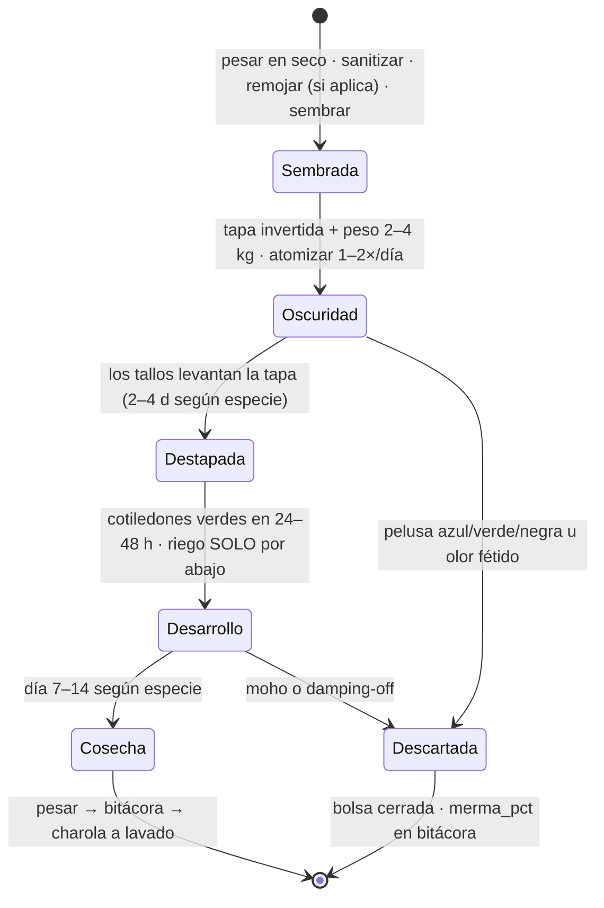

# Sembrar una charola de microgreens

**En una línea:** en 10–15 minutos de trabajo activo (más un remojo de 8–12 h si es girasol) dejas una charola 1020 pesada, sanitizada, etiquetada con su lote y en oscuridad con peso; la densidad exacta que pongas hoy decide si esa charola se vende a $90–180 o se tira por moho.

!!! info "Antes de empezar"
    - **Tiempo:** 10–15 min activos por charola + 8–12 h de remojo pasivo (solo girasol, chícharo y betabel) · **Costo variable por charola** ([08 · Recetas](../referencia/08-recetas-y-economia-unitaria.md)): girasol CEDA $9.10 · girasol Al Natural $29.50 · rábano $49.30 · arúgula $35.30 (semilla + coco $2.20 + agua/energía $1.00 + desinfección $0.30 + etiqueta $1.00) · **Personas:** 1
    - **Necesitas:** charola 10×20 perforada + charola lisa ($60/pza aprox., [Al Natural](https://www.alnatural.com.mx/tienda/charolas-de-germinacion-venta-mayoreo) · [búsqueda ML](https://listado.mercadolibre.com.mx/charolas-para-microgreens)) · polvillo de coco para germinación 50 L ($115, [Hydro Environment](https://hydroenv.com.mx/producto/polvillo-de-coco-para-germinacion-50-l-sustrato-organico/), ~$2.10/charola) · semilla que pasó V1 (ver pestañas) · báscula de precisión 0.1 g ($180 aprox., [ML](https://listado.mercadolibre.com.mx/bascula-de-precision-0.1g)) · atomizador 1 L ($80 aprox., [Home Depot](https://www.homedepot.com.mx/s/atomizador)) · cubeta de remojo marcada en litros · peso de 2–4 kg (otra charola con agua o un ladrillo envuelto en bolsa) · masking + plumón indeleble · `bitacora/produccion.csv` abierto. La lista completa con precios está en [Fase 0 · Compras](../fases/fase-0/compras.md).
    - **Prerequisitos:** [Prueba de germinación](prueba-de-germinacion.md) del lote (no se siembra semilla sin V1) · [Sanitizar semilla](sanitizar-semilla.md) · [Lavar y desinfectar charolas](lavar-y-desinfectar-charolas.md) · rack montado y nivelado ([Fase 0 · Montaje](../fases/fase-0/montaje.md)).

## El ciclo completo, animado

## La receta por especie (charola 1020, 25 × 50 cm)

Tabla de [08 · Recetas y economía unitaria](../referencia/08-recetas-y-economia-unitaria.md) (síntesis de Johnny's Yield Trial 2017, Bootstrap Farmer y True Leaf Market). Gramos de semilla **seca**.

| Especie | Semilla g/charola | Remojo | Oscuridad | Días a cosecha | Rendimiento g/charola | Merma plan | Cuándo sembrarla |
|---|---|---|---|---|---|---|---|
| **Girasol** | **120–150** | 8–12 h | 2–3 d con peso | 8–12 | 300–500 (estimado: pesa las primeras 6) | 5–10 % | Desde la semana 1: ancla de volumen |
| **Rábano** | **25–30** | no | 2–3 d | 7–10 | **225–325 (medido)** | 2–5 % | Desde la semana 1: mejor $/charola-semana ($82) |
| **Arúgula** | **10–12** | **NUNCA** (mucílago) | 3–4 d | 10–14 | 200–285 | 5–8 % | Desde la semana 2: segunda fina ($70/charola-semana) |
| Amaranto | 8–12 | no | 2–4 d | 14–18 | 120–200 | 10–15 % | 1 charola de prueba de color; solo abril–octubre |
| Brócoli | 13–18 | no | 2–3 d | 9–13 | 250–330 | 5–10 % | Segunda ola, cuando Hydrocultura cotice |
| Betabel | 25–35 | 4–8 h | 6–8 d (el más largo) | 13–18 | 180–270 | 8–12 % | Segunda ola, poco volumen |
| Cilantro (entera) | 30–40 | 2–4 h + H2O2 | 7–9 d | 18–24 | 140–200 | 8–12 % | Solo bajo pedido confirmado (21 días de rack) |
| Chícharo | 250–300 | 6–24 h | 3–5 d | 9–13 | 350–600 (estimado) | 3–8 % | **NO** hasta validar arvejón grado alimento de CEDA ($93.50 de semilla por charola con la de Hydro Environment) |

!!! tip "Ajuste por temporada"
    - **Junio–septiembre** (HR 70–80 %, picos de 89 %): siembra **~10 % menos denso** (girasol ~120 g, rábano ~25 g, arúgula ~10 g), riega solo por abajo desde el destape y ventila. La densidad que funciona en marzo se enmohece en julio.
    - **Diciembre–febrero** (noches de 8–9 °C en el centro, 5–6 °C en el sur): la germinación se alarga 30–50 %. Sigue [Germinar en invierno](germinar-en-invierno.md).
    - Fuente: [research/clima-agronomía §4–5](../research/clima-agronomia.md).

## Pasos

1. **Escribe el código de lote en masking y pégalo en la charola lisa.** Formato `VAR-AAMMDD-Slote-posición`: `GIR-260921-S001-R1N5` = girasol, sembrado el 21-sep-2026, costal S001, rack 1 nivel 5. *Criterio de listo:* el código está en la charola y en una fila nueva de `bitacora/produccion.csv` antes de tocar la semilla.
2. **Pesa la semilla seca con la báscula de 0.1 g.** Usa el gramaje de la tabla (o el ajustado por temporada). *Criterio de listo:* el número de la báscula es el que escribes en `densidad_g`; nunca "a ojo".
3. **Sanitiza y, si aplica, remoja.** Girasol y chícharo SIEMPRE: H2O2 3 % a 60 °C, 5 min con agitación, enjuague y retiro de flotantes ([guía](sanitizar-semilla.md)); rábano y brócoli, 10 min a temperatura ambiente; arúgula, nunca en agua. Remojo de girasol 8–12 h en agua potable; cámbiala si pasa de 12 h y lava la cubeta entre lotes. *Criterio de listo:* semilla escurrida, sin olor agrio, sin flotantes.
4. **Hidrata el coco y llena la charola perforada.** Capa de ~3 cm (0.8–1 L de sustrato hidratado), compactada suave y nivelada con la mano o una regla. *Criterio de listo:* al apretar un puño de coco escurren apenas unas gotas; la superficie queda plana de esquina a esquina (una charola desnivelada encharca una esquina y ahí nace el moho).
5. **Siembra al voleo, en una sola capa uniforme.** Reparte de orilla a orilla: en girasol las semillas se tocan sin encimarse; en rábano y arúgula queda aire entre semilla y semilla. *Criterio de listo:* vista desde arriba no hay montones ni claros.
6. **Atomiza y tapa con peso.** Atomiza hasta que la semilla brille de humedad, sin encharcar. Mete la perforada dentro de la lisa, pon encima otra charola invertida y sobre ella el peso de 2–4 kg: el peso fuerza raíces parejas y tallos rectos. *Criterio de listo:* la pila queda estable y la semilla no se ve.
7. **Oscuridad con peso, 2–4 días según especie.** Nivel superior del rack (o el punto más cálido de la casa en invierno). Atomiza 1–2 veces al día levantando la tapa un momento. *Criterio de listo para destapar:* los tallos amarillos levantan la tapa y el peso; las raíces blancas y parejas cubren el sustrato.
8. **Destapa a luz indirecta y cambia a riego por abajo.** Desde hoy el agua va **entre las dos charolas**: vierte agua en la lisa, deja que la perforada absorba y tira el sobrante; sustrato húmedo, nunca encharcado, nunca agua sobre el follaje. Sin sol directo de mediodía (a 2,240 msnm quema hojas tiernas). *Criterio de listo:* en 24–48 h los cotiledones pasan de amarillo a verde y el follaje está seco al tacto.
9. **Registra el destape.** Anota los `dias_oscuridad` reales. *Criterio de listo:* la fila tiene siembra, variedad, lote, densidad y días de oscuridad; solo falta la cosecha.
10. **Inspecciona 2 minutos al día hasta la cosecha.** Pelusa azul, verde o negra u olor fétido = charola a la basura en bolsa cerrada; pelos radiculares blancos y uniformes son normales. *Criterio de listo:* la charola llega a [Cosechar y empacar](cosechar-y-empacar.md) el día 8–12 (girasol) o 7–10 (rábano) con follaje limpio, verde y erguido.

## Receta exacta de las tres especies de arranque

=== "Girasol"

    **Ancla de volumen.** Precio de lista de charola viva: $90–120 ([01 §7](../referencia/01-proveedores-cdmx.md)).

    | Parámetro | Valor |
    |---|---|
    | Semilla | **135 g secos** (rango 120–150 g); junio–septiembre ~120 g |
    | Costo de semilla por charola | $4.60 con semilla de CEDA ($34/kg, [Mayoreo Online](https://mayoreo.online/products/semilla-de-girasol-con-cascara-jumbo)) · $25.00 con específica para microgreens ($185/kg, [Al Natural](https://www.alnatural.com.mx/tienda/semilla-de-girasol-para-microgreens)) |
    | Sanitización | **Siempre**: H2O2 3 % a 60 °C, 5 min con agitación, enjuague, retirar flotantes |
    | Remojo | 8–12 h en agua potable; cambiar el agua si pasa de 12 h; lavar la cubeta entre lotes |
    | Oscuridad | 2–3 días con peso de 2–4 kg |
    | Destape | Cuando los tallos levantan la tapa; luz indirecta; riego solo por abajo |
    | Cosecha | Día 8–12 (ideal 10); 300–500 g esperados: **pesa las primeras 6 charolas** (nadie ha publicado este dato medido) |
    | Merma de planeación | 5–10 % (semilla "sucia": cáscaras pegadas, moho si pasas de 200 g/charola) |

    Lo que solo pasa con girasol:

    - **Cáscaras pegadas al cotiledón:** se sacuden o se retiran a mano al cosechar. Es una métrica secundaria del A/B de semilla.
    - **La trampa "presoaked":** las guías que dicen 250 g hablan de semilla ya remojada (pesa 1.5–1.8×). Con 250 g secos la charola se enmohece.
    - **Prueba A/B CEDA vs específica** en las primeras 6 charolas ([Fase 0 · Siembra](../fases/fase-0/siembra.md)): misma densidad, mismo remojo, posiciones alternadas. Si CEDA pasó V1 ≥80 %, rinde ≥90 % de la específica y su CV es <15 %, recompra costal de 5 kg ($140) o bulto ($24/kg): la semilla baja de $25 a $4.60 por charola.

=== "Rábano"

    **La mejor $/charola-semana ($82) y la especie más noble para aprender.** Precio de lista (fina): $130–180.

    | Parámetro | Valor |
    |---|---|
    | Semilla | **28 g** (rango 25–30 g); junio–septiembre ~25 g |
    | Costo de semilla por charola | $44.80 (Champion a $1.60/g en el escalón 453+ g, [Hydro Environment](https://hydroenv.com.mx/producto/gramo-de-semilla-de-rabano-var-champion/)); medio kilo alcanza ~18 charolas |
    | Sanitización | Opción B fría: H2O2 3 % a temperatura ambiente, 10 min, enjuague; o semilla con COA del proveedor |
    | Remojo | **No** |
    | Oscuridad | 2–3 días con peso |
    | Cosecha | Día 7–10 (Johnny's midió 8–9.5 días); **225–325 g medidos** |
    | Merma de planeación | 2–5 % |

    Lo que solo pasa con rábano:

    - Germina casi completo y parejo: si una charola de rábano sale despareja, el problema es tu proceso (nivelación, riego, peso), no la semilla. Por eso es la especie del ensayo V2 (3 charolas, CV <15 %, [V2](../validacion/v02-rendimiento.md)).
    - Confirma por WhatsApp con Hydro Environment que la semilla a granel viene **sin tratamiento químico** antes de comprarla para consumo ([research/semillas](../research/semillas-sustrato-charolas.md)).

=== "Arúgula"

    **Segunda fina de arranque ($70/charola-semana).** Precio de lista (fina): $130–180.

    | Parámetro | Valor |
    |---|---|
    | Semilla | **11 g** (rango 10–12 g); junio–septiembre ~10 g |
    | Costo de semilla por charola | $30.80 ($2.80/g en el escalón 453+ g, [Hydro Environment](https://hydroenv.com.mx/producto/gramo-de-semilla-arugula/)); es 4.7× el precio internacional: solo para arrancar, presiona cotización a [Hydrocultura](https://hydrocultura.com/collections/semillas-para-microgreens-o-microvegetales) |
    | Sanitización | Sin inmersión (el mucílago la vuelve gel): semilla con COA o carta de "sin tratamiento" del proveedor y siembra seca. [POR VERIFICAR: pedir por WhatsApp a Hydro Environment/Hydrocultura si entregan COA negativo a *Salmonella*/*E. coli* del lote] |
    | Remojo | **NUNCA** |
    | Oscuridad | 3–4 días con peso |
    | Riego | **Solo por fondo desde el destape** (tallo frágil) |
    | Cosecha | Día 10–14; 200–285 g (28× su semilla: el mejor multiplicador del trial de Johnny's) |
    | Merma de planeación | 5–8 % |

    Lo que solo pasa con arúgula:

    - Al atomizar la semilla seca se forma una capa gelatinosa: es el mucílago, no moho. Con 11 g bien repartidos respira; encimada, se vuelve costra.
    - Es la más sensible a mojar el follaje: después del destape, ni una atomización "de más".

!!! warning "Errores típicos"
    - **Densidad "a ojo" o copiada de una guía con semilla remojada.** Pesa siempre en seco; 250 g de girasol secos es moho garantizado.
    - **Remojar arúgula** (gelatina) o **remojar girasol más de 12 h sin cambiar el agua** (olor agrio, pudrición).
    - **Charola desnivelada o coco compactado de más:** encharca una esquina y ahí nace el moho.
    - **Quitar el peso demasiado pronto:** tallos torcidos y raíces flojas. Espera a que los tallos levanten la tapa solos.
    - **Mojar el follaje después del destape.** Desde ese día el riego es solo por abajo.
    - **Sembrar sin V1 ni código de lote.** Sin lote no hay trazabilidad ni A/B; sin V1 siembras "a ver qué pasa".
    - **Sembrar chícharo de Hydro Environment "para probar":** $93.50 de semilla por charola; la prueba cuesta más que lo que vende ([08 · Reglas](../referencia/08-recetas-y-economia-unitaria.md)).

## Video de referencia

Playlist de tutoriales por variedad de On The Grow (girasol, chícharo, rábano, brócoli; en inglés). Su [guía escrita de charolas 10×20](https://onthegrow.net/blogs/microgreens/how-to-grow-microgreens-10x20-trays-complete-guide) es la consulta rápida sin video, y su [guía gratuita de densidades por charola](https://onthegrow.net/products/free-tray-specific-microgreen-seeding-guide-pdf) (checkout de $0) es la cuarta fuente de la tabla. Más en [Aprendizaje · Videos](../aprendizaje/videos.md).

<iframe width="560" height="315" src="https://www.youtube.com/embed/videoseries?list=PLkEXI0BumyG5OBbqj_wXM6gnPB6gJ4alW" title="On The Grow — How to Grow Microgreens: tutoriales por variedad" frameborder="0" allowfullscreen></iframe>

## Al terminar

- [ ] Código de lote en masking sobre la charola y en la bitácora
- [ ] Semilla pesada en seco con báscula de 0.1 g (el dato está en `densidad_g`)
- [ ] Girasol/chícharo sanitizados y remojados ≤12 h; rábano sanitizado en frío; arúgula sembrada seca
- [ ] Sustrato nivelado, charola perforada dentro de la lisa, tapa invertida + peso de 2–4 kg
- [ ] Charola en el nivel de oscuridad con recordatorio de atomizar 1–2×/día
- **Registrar en `bitacora/produccion.csv`** el mismo día (30 s): `siembra_id`, `fecha_siembra`, `variedad`, `lote_semilla`, `densidad_g`; al destapar, `dias_oscuridad`; en `observaciones` la sanitización, las horas de remojo y el lote de coco. Ejemplo de fila recién sembrada: `GIR-260921-S001-R1N5,2026-09-21,girasol,S001,135,,,,,,,H2O2 3% 60C 5min; remojo 8h; coco C-2026-09`
- **Siguiente paso:** [Cosechar y empacar](cosechar-y-empacar.md) el día 7–14 según especie. Si es tu primera semana, el calendario de siembras lunes/jueves está en [Fase 0 · Siembra](../fases/fase-0/siembra.md).

## Fuentes

- [08 · Recetas y economía unitaria](../referencia/08-recetas-y-economia-unitaria.md) y [research/recetas-produccion-economia](../research/recetas-produccion-economia.md): densidades, remojo, oscuridad, días, rendimientos, notas por especie, costo variable.
- [03 · Instalación §0.3](../referencia/03-instalacion.md): SOP de siembra (doble charola, peso, riego por abajo).
- [06 · Validación](../referencia/06-validacion-y-lazos-agenticos.md): V1, V2, V6, formato de `siembra_id` y esquema de la bitácora.
- [research/clima-agronomía §4–5](../research/clima-agronomia.md): ajuste de densidad junio–septiembre y germinación en invierno.
- [research/inocuidad-operativa §2 y §5](../research/inocuidad-operativa.md): sanitización por especie, codificación de lote.
- [research/semillas-sustrato-charolas](../research/semillas-sustrato-charolas.md) y [research/tutoriales-videos](../research/tutoriales-videos.md): proveedores, coco por charola, playlist de On The Grow.
