# Tensar el plástico y montar las mallas

**En una línea:** entre 3 personas, al mediodía con sol y sin viento, subes el lienzo de plástico UV de una sola pieza, lo fijas con perfil y alambre zigzag solo en tramos rectos, y montas la malla antigranizo 10–20 cm por encima — un plástico flojo es un latigazo que se rasga, y un plástico sin malla no sobrevive la granizada de agosto.

!!! info "Antes de empezar"
    - **Tiempo:** medio día (Montaje 2) + **1 h de re-tensado al tercer día** de sol y viento; el perfil se puede atornillar la tarde anterior · **Costo:** plástico UV cal. 720 blanco 25 % sombra, 6.2 m de ancho, 8 m × $215 = **$1,720**; perfil Polygrap ~14 tramos de 2 m × $95 = **$1,330**; zigzag 3 kg × $103 = **$309** (≈ 22.5 m/kg); malla antigranizo 40 m × $40 = **$1,600** (3.7 m de ancho); grapas para cortina $29.90 c/u; malacate opcional $529 ([research/instalacion-tunel-detalle §5](../research/instalacion-tunel-detalle.md), [`bom/fase1.csv`](../referencia/bom.md)) · **Personas:** **3** (mínimo; lo dice explícito la guía del proveedor)
    - **Necesitas:** plástico [Hydro Environment 6.2 m](https://hydroenv.com.mx/producto/metro-de-plastico-para-invernadero-25-sombra-6-2-m-de-ancho-cal-720/) (o el de 8.4 m a $299/m si quieres faldón hasta el piso), [perfil Polygrap 2 m](https://hydroenv.com.mx/producto/perfil-para-invernadero-polygrap-tramo-de-2-metros/), [alambre zigzag por kilo](https://hydroenv.com.mx/producto/alambre-zig-zag-para-invernadero-por-kilo-aprox-22-5-m/), [malla antigranizo por metro (Capi Agrícola)](https://www.capiagricola.com.mx/product/malla-antigranizo-negra-3-70-m-x-metro/), postes cortos de PTR 1" y alambre galvanizado para la malla, cinta reparadora, taladro con autoperforantes, segueta para el perfil, pinzas, cúter, flexómetro, cuerda, 2 escaleras estables, guantes y lentes
    - **Prerequisitos:** esqueleto anclado y con contravientos ([Anclar el túnel](anclar-el-tunel.md)); canalón ya montado en los aleros ([Instalar canaleta y captación](instalar-canaleta-y-captacion.md)); pintura seca; [Fase 1 · Túnel](../fases/fase-1/tunel.md) pasos 15–21 son el resumen de esta guía

## Cómo queda

Tres capas, de adentro hacia afuera: **malla antiáfidos fija por el interior de los laterales**, **plástico UV** (techo fijo + laterales libres como cortina enrollable) y **malla antigranizo por fuera del techo**, separada 10–20 cm (150 mm en el modelo) sobre postes cortos y alambre galvanizado. La malla sombra 35 % ($129/m) va encima **solo de marzo a mayo** ([02-restricciones §1](../referencia/02-restricciones-y-requisitos.md)).

```mermaid
flowchart LR
    P[Perfil en tramos rectos<br/>tarde anterior o mañana] --> L[Subir el lienzo<br/>3 personas, mediodía]
    L --> E[Esquinas provisionales<br/>con zigzag corto] --> C[Centrar: mismo sobrante<br/>en aleros y cabeceras]
    C --> T[Tensar y fijar: cumbrera y aleros,<br/>luego cabeceras] --> M[Malla antigranizo<br/>por fuera, 10–20 cm]
    M --> A[Malla antiáfidos interior<br/>+ cortinas laterales] --> R[Re-tensar al 3er día<br/>de sol y viento]
    style L fill:#fff7ed,stroke:#b45309
    style R fill:#f0fdf4,stroke:#2e7d32
```

## Pasos

### El día anterior: perfil sujetador

1. **Pasa la mano por el exterior de cabios, largueros y columnas.** Cualquier filo, escoria de soldadura o tornillo que sobresalga hacia afuera se lima o se voltea hoy; mañana será el punto donde el plástico se rasga. Los largueros van por la cara interior justo por esto ([Fase 1 · Túnel, paso 10](../fases/fase-1/tunel.md)).
   *Criterio de listo:* la mano recorre todo el perímetro y la cumbrera sin engancharse.
2. **Atornilla el perfil Polygrap (C-22) con autoperforantes solo en tramos rectos:** largueros perimetrales de alero, travesaños de cabecera y postes. **Nunca siguiendo la curva del arco ni el quiebre del cabio.** Canal hacia afuera. En el larguero bajo lateral, canal hacia **adentro** si ahí solo vas a fijar malla (así el plástico lateral queda libre como cortina). Corta los tramos de 2 m a medida con segueta y desbarba el corte. Separación de autoperforantes según la guía del proveedor [POR VERIFICAR: en la guía "Instala mallas y plásticos" de Hydro Environment].
   *Criterio de listo:* perfil continuo en todo el perímetro y cabeceras; ningún tornillo con la cabeza dentro del canal (traba el zigzag).

### Montaje 2: el lienzo (3 personas, mediodía, sol, sin viento)

3. **Espera el día correcto aunque pierdas dos.** Mediodía con sol y **sin viento**; en temporada de lluvias, por la mañana (la tormenta es vespertina). Ten a las 3 personas confirmadas y las escaleras puestas.
4. **Desenrolla el lienzo de una sola pieza (8 m × 6.2 m)** sobre piso limpio junto al túnel, sin arrastrarlo sobre grava ni tornillos. 6.2 m cubren las dos aguas de 1.59 m más faldones de ~1.5 m por lado que llegan al rodapié de 0.50 m [POR VERIFICAR con el corte real: si quieres faldón hasta el piso, ancho de 8.4 m a $299/m]. Si el fabricante marca la cara exterior (tratamiento UV), identifícala ahora [POR VERIFICAR: ficha del plástico].
5. **Súbelo entre 3:** una persona arriba por fuera (escalera estable, alguien abajo), una adentro y una alimentando desde el suelo. Si el lienzo no pasa la cumbrera a mano, amarra una cuerda a una esquina y jala desde el otro lado.
6. **Sujeta provisionalmente las 4 esquinas** con tramos cortos de zigzag (20–30 cm) en el perfil. Todavía no tenses.
7. **Centra:** mide el sobrante en los dos aleros (debe ser igual) y en las dos cabeceras (igual). Corrige antes de fijar nada más.
   *Criterio de listo:* diferencias de sobrante ≤ 5 cm entre lados opuestos.
8. **Tensa y fija con zigzag, primero cumbrera y largueros de alero (a lo largo), luego las cabeceras.** Mete el alambre en el canal con el plástico dentro, avanzando **desde el centro hacia los extremos**, mientras la persona de enfrente jala el lienzo parejo: así las arrugas salen por los extremos en vez de quedar atrapadas en diagonal. **El truco térmico de la guía:** se tensa con el calor de mediodía; al enfriar, el plástico se contrae y queda como tambor.
   *Criterio de listo:* al golpear con la palma suena a tambor, sin bolsas ni arrugas diagonales; ningún tramo de zigzag suelto ni con el plástico fuera del canal.
9. **Corta el sobrante dejando margen** (≥ 10 cm fuera del perfil): el tercer día vas a re-tensar y necesitas de dónde jalar. Nunca al ras el primer día.

### Mallas

10. **Malla antigranizo por ENCIMA del plástico, a 10–20 cm** (150 mm en el modelo), sobre postes cortos de PTR 1" fijados a cabios y cumbrera y alambre galvanizado tensado entre ellos; fíjala con sujetadores o un segundo zigzag en un perfil propio. Paños de 3.7 m de ancho a lo largo del techo, traslapados; que escurra hacia los aleros. Va montada **antes de mayo y no se desmonta temprano**: el pico estadístico de granizo en CDMX es **agosto** ([research/clima-agronomia §1](../research/clima-agronomia.md)). Guía de 11 pasos: [EyouAgro, instalación de malla antigranizo](https://eyouagro.com/faqs/hail-netting-installation/) (no verificada en la investigación).
    *Criterio de listo:* con la mano apoyada encima, la malla no toca el plástico en ningún punto; no hay bolsas donde se acumule granizo.
11. **Malla antiáfidos fija por el interior de los laterales** (sobre el perfil del larguero bajo con canal hacia adentro) [POR VERIFICAR: no está en `bom/fase1.csv`; cotizar por metro en Hydro Environment en la misma ida de las compras S7].
12. **Cortinas laterales:** el plástico lateral queda libre y se enrolla sobre un tubo ligero con **grapas para cortina ($29.90 c/u)** o, si quieres mecanizarlo, **malacate ($529)**. Se abren de día para ventilar (junio–septiembre la HR de 70–89 % exige ventilar) y se cierran de noche y en tormenta.
    *Criterio de listo:* la cortina sube y baja sin atorarse en el zigzag; cerrada, traslapa el rodapié.
13. **Malla sombra 35 %** ($129/m, [Hydro Environment](https://hydroenv.com.mx/producto/malla-sombra-por-metro-al-35-de-3-7-m-de-ancho/)) por encima, **solo marzo–mayo** (UV 11+); quítala el resto del año: la albahaca necesita luz para aroma y los microgreens van bajo techo de todos modos.

### Tercer día

14. **Re-tensa todo** después de 2–3 días de sol y viento: zigzag del plástico, malla y cortinas. Es cuando aparecen las bolsas que el primer día no se veían. Ahora sí recorta sobrantes.
15. **Prueba con manguera a presión** sobre techo y laterales 10 min: sin goteo adentro, sin bolsas de agua en el techo (pendiente de 30 %: el agua debe correr al canalón) ([03-instalación, commissioning Fase 1](../referencia/03-instalacion.md)).
16. **Cinta reparadora a la mano:** cualquier pinchazo se parcha el mismo día por las dos caras; un pinchazo sin parche es el inicio de una rasgadura con la siguiente racha.

!!! warning "Error típico: 'aprovechar' el martes con viento"
    Recibir el plástico un martes en la tarde con viento y subirlo "porque ya está aquí". Con viento el lienzo es una vela que arrastra a la persona de la escalera y queda con arrugas que son el punto de rasgadura. Espera al mediodía sin viento.

!!! warning "Error típico: perfil siguiendo el arco, o solo grapas"
    El perfil y el zigzag van únicamente en tramos rectos; en la curva o el quiebre del cabio el plástico se apoya, no se fija. Y nunca "solo grapas": el plástico se tensa con perfil zigzag o listones atornillados ([03-instalación §1.1](../referencia/03-instalacion.md)).

!!! warning "Error típico: tensar en tarde fría"
    Tensado con el plástico frío, al primer sol se dilata y quedan bolsas que juntan agua y granizo. Por eso el mediodía no es capricho.

## Al terminar

- [ ] Plástico de una pieza, centrado, tenso "como tambor" al tercer día; zigzag continuo en cumbrera, aleros y cabeceras
- [ ] Ninguna arista, escoria ni tornillo toca el plástico por fuera
- [ ] Malla antigranizo separada 10–20 cm, sin tocar el plástico, montada antes de mayo
- [ ] Malla antiáfidos interior y cortinas enrollables funcionando (abren/cierran sin atorarse)
- [ ] Prueba de manguera 10 min: sin goteo ni bolsas; cinta reparadora guardada en el gabinete
- Registrar: fotos del techo y de las cortinas en el issue "Túnel"; fecha de montaje de la malla antigranizo y recordatorio en el calendario de HA para **no desmontarla antes de octubre**
- Siguiente paso: [Fase 1 · Túnel, cabeceras y puerta](../fases/fase-1/tunel.md) → mudar racks adentro → [Instalar el tinaco y la captación](../fases/fase-1/agua.md)

## Fuentes

- [research/instalacion-tunel-detalle §2 (pasos 11–15: perfil, lienzo, zigzag, mallas, cortinas) y §5 (precios de plástico, perfil, zigzag)](../research/instalacion-tunel-detalle.md)
- [research/estructura-invernadero](../research/estructura-invernadero.md) — plástico bien tensado con perfil zigzag, malla antigranizo separada 10–20 cm, faldones enrollables
- [referencia/03-instalacion §1.1](../referencia/03-instalacion.md) · [referencia/02-restricciones §1](../referencia/02-restricciones-y-requisitos.md) (granizo, UV, malla sombra) · [research/clima-agronomia §1–3](../research/clima-agronomia.md)
- Guía del proveedor: [Paso a paso: instala mallas y plásticos al invernadero (Hydro Environment)](https://hydroenv.com.mx/paso-a-paso-instala-mallas-y-plasticos-al-invernadero/) y su [video de armado](https://www.youtube.com/watch?v=kShJ07HwPDw)
- [research/tutoriales-videos §e](../research/tutoriales-videos.md) — guía EyouAgro de malla antigranizo
