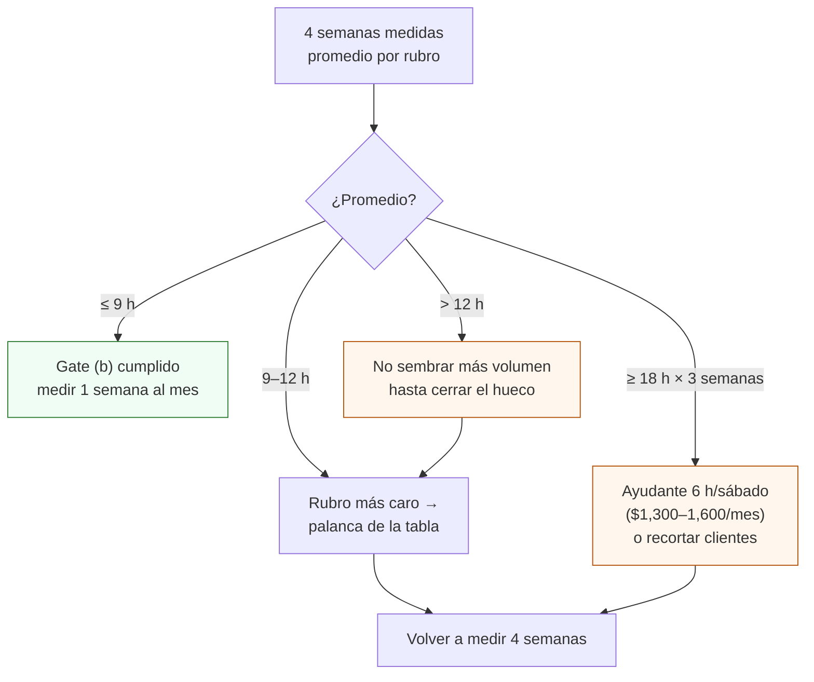

# Llevar el timesheet semanal (V9)

**En una línea:** durante 4 semanas cronometras todo lo que el huerto te quita (siembra, cosecha, lavado, reparto, ventas y cobranza, sistema, compras) en `bitacora/timesheet.csv`, para saber si son las 6–9 h que promete el plan o las 14.5–17.5 h que da la cuenta honesta; ese número decide si subes precio, contratas un ayudante o recortas clientes antes de escalar un solo m², y si 3 semanas seguidas pasas de 18 h, está prohibido aguantar.

!!! info "Antes de empezar"
    - **Tiempo:** 30 s por evento + 10 min el domingo; 4 semanas seguidas y luego una semana al mes ([Diseño · Datos](../diseno/datos.md)) · **Costo:** $0 · **Personas:** 1
    - **Necesitas:** `bitacora/timesheet.csv` con el esquema de abajo · cronómetro del teléfono · la lista de rubros fija (no la cambies a media medición) · hoja de cálculo o `tools/gate_audit.py` para el promedio [POR VERIFICAR: interfaz del script cuando esté en el repositorio; la lógica está en [Fase 2 · Gate §3](../fases/fase-2/gate.md)].
    - **Prerequisitos:** operación en régimen (Fase 1 con 25–35 charolas/semana, o Fase 2 con NFT) · rutina de bitácora de [Cómo usar esta guía](../empieza-aqui/como-usar-esta-guia.md) · [V9](../validacion/v09-timesheet.md).

## Los rubros y lo que la cuenta honesta espera

Desglose de régimen Fase 1–2 (30 charolas/semana + 6–8 líneas NFT + 4–6 clientes) de [07 §4](../referencia/07-puntos-ciegos-y-riesgos.md) y [research/puntos-ciegos §(f)](../research/puntos-ciegos.md):

| `rubro` | Qué incluye | h/semana esperadas | Guía |
|---|---|---|---|
| `siembra` | Pesar, sanitizar, remojar, hidratar coco, sembrar, apilar (2 sesiones) | 3.0 | [Sembrar una charola](sembrar-una-charola.md) |
| `cosecha_empaque` | Inspección, corte, pesado, etiqueta, refrigerador; hierbas NFT | 3.5–4.5 | [Cosechar y empacar](cosechar-y-empacar.md) |
| `lavado` | Lavar y desinfectar charolas, mesa, tijera, hielera | 1.5 | [Lavar y desinfectar](lavar-y-desinfectar-charolas.md) |
| `reparto` | Cargar, ruta (2 × 1.5–2 h en tráfico), remisiones, recoger charolas | 3.0–4.0 | [Ruta de reparto](ruta-de-reparto.md) |
| `ventas_cobranza` | WhatsApp con chefs, fresh sheet del domingo, visitas, facturas, REP, conciliación | 1.5–2.0 | [Cobrar y suspender](cobrar-y-suspender.md) |
| `sistema` | Calibrar sondas, limpiar depósito, ajustes de HA, cambio de solución | 1.0–1.5 | [Calibrar sondas](calibrar-sondas-ph-ec.md) |
| `compras` | Insumos, imprevistos, ir por semilla o coco | 1.0 | [Fase 1 · Compras](../fases/fase-1/compras.md) |
| `otro` | Todo lo demás (vecinos, alcaldía, laboratorio, informe L3) | — | |
| **Total** | | **14.5–17.5** | |

La automatización quita riego, ventilación y vigilancia (5–8 h que serían, y muchos sustos), **pero no siembra, no corta, no lava, no reparte y no cobra**. Las "6–9 h/semana" del plan solo se cumplen en Fase 0–1 chica (10–15 charolas, sin NFT, 2 clientes).

## El esquema de `bitacora/timesheet.csv` (propuesta de esta guía)

```csv
fecha,semana,rubro,minutos,unidades,observaciones
2027-04-05,2027-W14,siembra,85,10,"10 charolas: 6 girasol + 4 rabano; remojo aparte"
2027-04-06,2027-W14,reparto,110,6,"ruta martes 6 paradas; 20 min de trafico extra en Insurgentes"
2027-04-06,2027-W14,ventas_cobranza,25,3,"3 facturas + recordatorios; 1 conciliacion"
2027-04-11,2027-W14,sistema,40,,"calibracion quincenal pH/EC"
```

- `minutos`: tiempo cronometrado, de puerta a puerta (el reparto incluye cargar y descargar; la siembra incluye limpiar).
- `unidades`: charolas (siembra, cosecha, lavado), paradas (reparto), facturas o visitas (ventas); vacío si no aplica. Sirve para el costo por charola: `minutos / unidades`.
- `semana`: ISO (`AAAA-Wnn`) para que `gate_audit.py` promedie por semana y por rubro ([Fase 2 · Gate §3](../fases/fase-2/gate.md)).
- Una fila por sesión, escrita al terminar la sesión; nunca reconstruida el domingo.

## Umbrales y qué hacer con el número

| Promedio de 4 semanas | Lectura | Acción |
|---|---|---|
| **≤ 9 h** | Cumple el gate G2→3 (b) ([06 §L4](../referencia/06-validacion-y-lazos-agenticos.md)) | Nada que cambiar; mide una semana al mes |
| 9–12 h | Lo que el plan prometía "más o menos" | Ataca el rubro más caro con la tabla de palancas |
| **> 12 h** | "La automatización tiene un hueco o el proceso tiene un desperdicio" ([06 §V9](../referencia/06-validacion-y-lazos-agenticos.md)) | Se ataca el rubro más caro **antes** de escalar volumen; no se siembra más |
| 14.5–17.5 h | Lo que la cuenta honesta predice en régimen ([07 §4](../referencia/07-puntos-ciegos-y-riesgos.md)) | A $10k netos/mes ÷ 65 h ≈ $150/h: compáralo con tu tarifa antes de escalar m² en lugar de precio |
| **≥ 18 h tres semanas seguidas** | Regla anti-burnout ([07 §13](../referencia/07-puntos-ciegos-y-riesgos.md)) | **Contratas o recortas clientes. Prohibido aguantar.** Ayudante fijo 6 h/sábado con SOP con fotos ≈ $1,300–1,600/mes (~$55/h), ~15 % del neto |

!!! info "El gate se escribió con el plan optimista"
    G2→3 pide ≤ 9 h medidas; la cuenta honesta da 14.5–17.5 h. No se renegocia el gate a la baja: se mide, y si el neto es bueno pero las horas no, permaneces en Fase 2 aplicando la escalera (precio → ayudante → LED solo con contrato PDBT → segunda ubicación) y re-evalúas en 3 meses ([Fase 2 · Gate](../fases/fase-2/gate.md), [07 §14](../referencia/07-puntos-ciegos-y-riesgos.md)).



## Palancas por rubro (qué mueves cuando un rubro se dispara)

| Rubro disparado | Palanca con datos de esta wiki |
|---|---|
| `cosecha_empaque` | Vender **charola viva** en lugar de cortado: 5 min vs 15–20 min por charola y sin cadena de frío ([Cosechar y empacar](cosechar-y-empacar.md)); cortado solo bajo pedido |
| `reparto` | Radio ≤ 5–8 km, 2 días fijos, pedido mínimo $350, paradas ordenadas por zona; un cliente a 12 km cuesta 40 min por ruta ([Ruta de reparto](ruta-de-reparto.md)) |
| `siembra` | Dos sesiones fijas (lunes y jueves), semilla pesada por adelantado en bolsas por charola, coco hidratado en tanda |
| `lavado` | Lavar en tanda el día de cosecha, no charola por charola; pila de remojo con jabón mientras cosechas ([Lavar y desinfectar](lavar-y-desinfectar-charolas.md)) |
| `ventas_cobranza` | Fresh sheet única del domingo por lista de difusión, recordatorios programados, REP agrupado por cliente los días 1–5, un referido por chef contento (CAC −70 %) ([07 §7](../referencia/07-puntos-ciegos-y-riesgos.md)) |
| `sistema` | Calibración quincenal en el calendario con alarma de HA, no "cuando se ve raro"; cambio de solución cada 2–3 semanas el mismo día ([Calibrar sondas](calibrar-sondas-ph-ec.md)) |
| `compras` | Pedido grande mensual (semilla en costal de 5 kg, coco por tarima al escalar) en lugar de idas semanales ([01 · Proveedores](../referencia/01-proveedores-cdmx.md)) |

## Pasos

1. **Fija la lista de rubros y la semana de arranque** (lunes). No agregues ni renombres rubros durante las 4 semanas. *Criterio de listo:* encabezado del CSV escrito y `semana` de inicio anotada.
2. **Cronometra cada sesión de puerta a puerta.** Arranca el cronómetro al empezar (incluye preparar y limpiar) y párala al terminar. Sesiones interrumpidas: dos filas. *Criterio de listo:* la fila se escribe antes de pasar a otra cosa, con `unidades`.
3. **Cuenta también lo invisible:** WhatsApp con chefs desde el sillón, la llamada al administrador que no pagó, la ida por gel packs, los 20 minutos del informe L3. Va todo. *Criterio de listo:* ningún día con horas de huerto y cero filas.
4. **Domingo, 10 min: suma por rubro y total de la semana.** Calcula `minutos / unidades` en siembra, cosecha y reparto. Anota la cifra junto a los KPIs L2. *Criterio de listo:* 8 números (7 rubros + total) en la fila de resumen o en la hoja.
5. **Semana 4: promedia y compara con la tabla de umbrales.** Identifica el rubro más caro y su palanca. *Criterio de listo:* promedio de 4 semanas, rubro mayor y una acción escrita con fecha.
6. **Aplica la palanca y vuelve a medir 4 semanas.** Un solo cambio a la vez (V6). *Criterio de listo:* el rubro atacado bajó ≥ 10 % sin subir otro.
7. **Mantén una semana de medición al mes** en régimen y las 4 semanas completas antes de cada gate. *Criterio de listo:* `timesheet.csv` tiene al menos una semana completa por mes.

!!! warning "Errores típicos"
    - **Reconstruir el domingo de memoria.** Siempre sale menos de lo real; el timesheet es de cronómetro, no de estimación.
    - **Contar solo "trabajo en el patio".** Reparto, WhatsApp y cobranza son 4.5–6 h/semana y son las que nadie cuenta.
    - **Cambiar rubros a media medición.** Las 4 semanas dejan de ser comparables.
    - **Optimizar el rubro chico** porque es fácil. Se ataca el más caro en tiempo.
    - **"Aguantar" tres semanas de 18 h.** Punto de quiebre típico del fundador único: mes 4–6 ([07 §13](../referencia/07-puntos-ciegos-y-riesgos.md)).
    - **Escalar m² en lugar de precio** con 15 h/semana ya comprometidas: el techo real es horas-fundador, energía y agua ([07 §14](../referencia/07-puntos-ciegos-y-riesgos.md)).

## Al terminar

- [ ] 4 semanas seguidas con una fila por sesión y `unidades` donde aplica
- [ ] Promedio semanal total y por rubro calculado; rubro más caro identificado
- [ ] Acción sobre el rubro más caro escrita con fecha (o ayudante contratado si ≥ 18 h × 3)
- [ ] Ninguna semana con horas de huerto y cero filas
- [ ] Una semana de medición al mes agendada en régimen
- **Registrar:** `bitacora/timesheet.csv` (`fecha,semana,rubro,minutos,unidades,observaciones`); el promedio de 4 semanas y el rubro mayor en el informe del gate (`bitacora/gates/`, [Fase 2 · Gate](../fases/fase-2/gate.md)).
- **Siguiente paso:** [V9 · Timesheet honesto](../validacion/v09-timesheet.md) para la evidencia del gate; si el rubro mayor es reparto, [Ruta de reparto](ruta-de-reparto.md); si es cosecha, pasa clientes a charola viva ([Cosechar y empacar](cosechar-y-empacar.md)).

## Fuentes

- [07 · Puntos ciegos §4, §13 y §14](../referencia/07-puntos-ciegos-y-riesgos.md) y [research/puntos-ciegos §(f), §(j) y §(l)](../research/puntos-ciegos.md): desglose de 14.5–17.5 h, $150/h, regla de 18 h, ayudante $1,300–1,600/mes, escalera de escalamiento.
- [06 · Validación §V9 y §L4](../referencia/06-validacion-y-lazos-agenticos.md): 4 semanas cronometrando todo, umbral > 12 h, gate G2→3 ≤ 9 h.
- [Fase 2 · Gate §3](../fases/fase-2/gate.md) y [Diseño · Datos](../diseno/datos.md): cómo se promedia el timesheet, frecuencia 4 semanas y luego mensual.
- [00 · Plan maestro](../referencia/00-plan-maestro.md): "6–9 h/semana según el plan; se verifica con V9".
