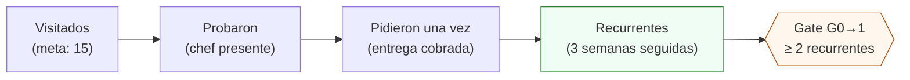

# Visitar a un chef con muestra

**En una línea:** llegas sin cita entre martes y jueves de 10 a 12, abres una muestra cortada esa mañana, dices tu guion de 90 segundos, respondes las 10 objeciones de siempre sin regalar margen ni crédito, y sales con el WhatsApp del chef **y del administrador** más una fila nueva en el embudo; es la actividad que decide si hay Fase 1.

!!! info "Antes de empezar"
    - **Tiempo:** 1.5–2 h por visita con traslado; la ronda de 15 restaurantes son 22–30 h repartidas en las semanas 3–6 · **Costo:** ~$650 de bolsillo por cliente cerrado (15 muestras ~$750 + transporte ~$900 + re-visitas ~$300, entre 2–3 clientes) ([07 §7](../referencia/07-puntos-ciegos-y-riesgos.md)) · **Personas:** 1
    - **Necesitas:** muestra cortada esa mañana (clamshell de ~100 g con girasol + rábano) · 1 charola viva de exhibición · hielera 45–50 L con 4–6 gel packs ([`bom/fase2.csv`](https://github.com/AndresIslas99/HomeGreen/blob/main/bom/fase2.csv), ~$1,300 aprox.) · [hoja de precios](hoja-de-precios.md) impresa · WhatsApp Business con catálogo · talonario de remisiones en duplicado · `bitacora/prospectos.csv` en el teléfono.
    - **Prerequisitos:** producto de la semana 2 en adelante ([Fase 0 · Primeras siembras](../fases/fase-0/siembra.md)) · lista de 15 restaurantes mapeados ([Fase 0 · Vender a chefs](../fases/fase-0/ventas.md)) · decisión fiscal tomada antes de la primera factura ([Antes de gastar un peso](../empieza-aqui/antes-de-gastar-un-peso.md)) · el video de Donny Greens visto (abajo).

## Qué llevas (revísalo antes de arrancar la moto)

| Qué | Para qué | Detalle |
|---|---|---|
| Clamshell de muestra, ~100 g, girasol + rábano | Que el chef **pruebe** | Cortado esa mañana; etiqueta con lote, "cosechado el", "conservar de 1 a 4 °C" y "enjuagar antes de consumir" ([Cosechar y empacar](cosechar-y-empacar.md)) |
| Charola viva de exhibición | Que **vea y corte** el formato preferente | No la dejes salvo pedido cobrado; regresa a la hielera del día siguiente como muestra viva otra vez |
| Hielera con gel packs | Que la muestra llegue fría | < 10 °C por 4–6 h; a 20–25 °C el cortado muere en menos de 1 día ([07 §3](../referencia/07-puntos-ciegos-y-riesgos.md)) |
| Hoja de precios impresa, 1 página | Que quede algo en la cocina | Lista corregida $90–120 / $130–180 / $50–90, condiciones de pago, WhatsApp ([Hoja de precios](hoja-de-precios.md)) |
| Teléfono con catálogo de WhatsApp Business y foto del rack | Que vea que es real y a cuántos km está | La foto del dashboard de Home Assistant vende trazabilidad: ningún competidor encontrado la ofrece ([research/mercado §7](../research/mercado-precios.md)) |
| Talonario de remisiones | Por si el chef pide "déjame dos charolas hoy" | Se entrega y se transfiere: SPEI contra entrega en Fase 0 |
| `bitacora/prospectos.csv` | Registrar antes de subirte a la moto | `restaurante,zona,tipo,chef,administrador,whatsapp,mejor_horario,fecha_visita,probo,pidio,semanas_seguidas,notas` |

Zonas y perfil de los 15: corredor Roma–Condesa–Juárez–Polanco (9–10) y Coyoacán–San Ángel (4–5); cocina de autor, brunch, pokés y ensaladas, coctelería, dark kitchens; nada con menos de 6 meses operando ([research/mercado §6](../research/mercado-precios.md), [Fase 0 · Vender a chefs](../fases/fase-0/ventas.md)).

## Pasos

1. **Llega sin cita, martes a jueves de 10:00 a 12:00.** Es la ventana antes del servicio de comida; lunes cierran muchos, viernes ya están en el arranque del fin de semana. Pregunta por el chef o el sous chef. *Criterio de listo:* estás frente a quien decide qué entra a la cocina, o sabes a qué hora vuelve.
2. **Si el chef no está: deja muestra + hoja + WhatsApp y pregunta el horario.** No hagas el pitch al mesero. Anota `mejor_horario` y regresa esa semana. *Criterio de listo:* fila en `prospectos.csv` con hora de regreso.
3. **Di el guion de 90 segundos** (abajo). Abre la muestra en los primeros 30 s y cállate mientras prueba. *Criterio de listo:* el chef probó girasol y rábano y dijo algo concreto (sabor, tamaño, uso).
4. **Responde objeciones con la tabla de abajo**, sin bajar de la lista ni ofrecer crédito. *Criterio de listo:* ninguna respuesta tuya contradijo la hoja de precios que le dejaste.
5. **Cierra con fecha y con dos contactos.** Pide el WhatsApp del chef **y** el del administrador o dueño: el cliente es el restaurante, no el chef (rotación de chefs = riesgo #4 del plan). Di cuándo cae la primera entrega o cuándo vuelves. *Criterio de listo:* dos números guardados y una fecha dicha en voz alta.
6. **Si pide ahí mismo:** remisión en duplicado firmada por quien recibe y SPEI al momento o el mismo día; muestra gratis solo la primera semana. *Criterio de listo:* remisión firmada y comprobante de SPEI en el teléfono antes de irte.
7. **Registra en la moto, no en la noche.** `probo`, `pidio`, `notas` (qué usan hoy, a cuánto, qué platillos). *Criterio de listo:* la fila está completa antes de la siguiente parada.
8. **A las 48–72 h manda un solo mensaje:** foto de la charola del día + "¿algo que cambiarías del producto?". Meta: que respondan ≥ 50 % ([06 §L2](../referencia/06-validacion-y-lazos-agenticos.md)). *Criterio de listo:* mensaje enviado con fecha en `notas`.

## El guion de 90 segundos

| Segundos | Qué dices | Por qué |
|---|---|---|
| 0–10 | "Hola chef, soy [nombre]. Produzco microgreens en mi patio en [colonia], a [X] km de aquí. Esto lo corté hoy a las 7." | Cercanía + frescura: es lo único en lo que la CEDA no compite ([research/mercado §3](../research/mercado-precios.md)) |
| 10–30 | Abres el clamshell: "Prueba el girasol y el rábano." **Silencio.** | El producto vende; tú estorbas |
| 30–50 | "Entrego cada martes y viernes. Te la dejo **viva en charola**: cortas lo que usas y te dura una semana en la cocina; o cortada el mismo día si prefieres. Sin mínimo el primer mes." | Oferta gancho del plan ([00 §Fase 0](../referencia/00-plan-maestro.md)); la charola viva evita cadena de frío y rechazo |
| 50–70 | "¿Qué usan hoy y cuánto les cuesta?" | Único dato que te dice contra quién compites y a qué precio; va a `notas` |
| 70–90 | "Te dejo la hoja. ¿Me pasas tu WhatsApp y el del administrador para mandarles la disponibilidad el domingo? ¿Te cae bien la primera charola el martes?" | Cierre con fecha y con el contacto que paga |

Lo que **no** va en el guion: precios por kilo, la palabra "crédito", la historia completa del ESP32. Si pregunta por la tecnología, enseña el dashboard en 15 s: "temperatura y humedad del cultivo 24/7; cada charola tiene lote y sé de qué costal salió".

## Objeciones y respuestas

| Objeción | Respuesta | Fuente del dato |
|---|---|---|
| "Ya tengo proveedor." | "Perfecto, no te pido que lo cambies. Prueba una charola dos semanas junto al que usas y compara cómo llega el viernes." Deja la muestra y vuelve en 72 h. | Conversión fría 10–20 %: se gana con prueba, no con discurso ([06 §V4](../referencia/06-validacion-y-lazos-agenticos.md)) |
| "Está caro." | "Una charola de 300–500 g a $90–120 sale en $0.18–0.40 por gramo; el clamshell de súper cuesta $60–140 por 100 g. Y no tiras nada: cortas lo que usas." No bajes de lista; el precio de volumen ($70–80) es con 4+ charolas/semana. | Lista corregida; $60–90 solo como promo del primer mes ([research/mercado §4](../research/mercado-precios.md)) |
| "Dame crédito, así trabajamos con todos." | "El primer mes es contra entrega; a partir de 8 semanas puntuales manejo cuenta semanal y luego 15 días. Es la política de la casa, no es personal." | Fase 0 contado estricto; crédito solo ganado ([research/cobranza §2](../research/cobranza-b2b.md)) |
| "Mándame todo por WhatsApp." | "Claro." Mandas catálogo + hoja en ese momento, frente a él, y agendas: "¿te marco el jueves a las 10?" | Sin fecha no hay seguimiento; el CAC ya cuesta 8–10 h por cliente ([07 §7](../referencia/07-puntos-ciegos-y-riesgos.md)) |
| "No uso microgreens." | "¿Y en bebidas o postres? Los bares de coctelería los usan de garnish; brunch y ensaladas también." Si de verdad no, agradece y pide un referido. | Perfil que compra: autor, brunch, coctelería, eventos, hoteles ([research/mercado §6](../research/mercado-precios.md)) |
| "¿Me das factura?" | "Sí, CFDI 4.0 con IVA 0 % porque es producto agrícola fresco: pagas exactamente lo de la hoja." | Art. 2-A LIVA; clave 50404100 ([Facturar CFDI](facturar-cfdi.md)) |
| "¿Es seguro? ¿Cómo lo lavas?" | "Desinfecto la semilla con peróxido antes de remojar, cada charola lleva lote y sé de qué costal salió; la etiqueta dice 'enjuagar antes de consumir'. Si te sirve, te paso mi carpeta de inocuidad cuando la tenga completa." | Protocolo H2O2, lote, análisis en Fase 1 ([research/inocuidad §2 y §5](../research/inocuidad-operativa.md)) |
| "¿Dónde pongo una charola viva?" | "Sombra o luz indirecta, nunca sol directo; riego por abajo un dedo de agua cada dos días; cortas sobre el sustrato. Te dura la semana y me llevo la charola en la siguiente entrega." | Etiqueta de charola viva ([Cosechar y empacar](cosechar-y-empacar.md)) |
| "Eso lo decide el dueño / la administradora." | "Perfecto, ¿me pasas su WhatsApp? Le mando la hoja y la foto de la muestra que probaste hoy." | Formalizar con quien paga ([00 §Riesgos](../referencia/00-plan-maestro.md)) |
| "Usamos muy poquito." | "Por eso la charola viva: usas 30 g al día y sigue creciendo. Sin mínimo el primer mes; después el pedido mínimo es de $350 para que la entrega valga la pena." | Pedido mínimo $350; logística ≤ 15 % del ticket ([research/mercado §7](../research/mercado-precios.md)) |
| "¿Tienes albahaca / hierbas?" | "En unos meses, en hidroponía, por manojo. Hoy te resuelvo microgreens; te aviso cuando salga la primera cosecha." | Hierbas NFT en Fase 2, $20–35 por manojo ([01 §7](../referencia/01-proveedores-cdmx.md)) |

!!! warning "Errores típicos"
    - **Bajar el precio en la cocina.** El rábano a $60 deja 18 % y el brócoli 5 %; solo el girasol con semilla de CEDA aguanta ese precio ([08 · Recetas](../referencia/08-recetas-y-economia-unitaria.md)). La promo es del primer mes y solo en girasol.
    - **Prometer crédito "para entrar".** Un cliente que quiere pero no paga no cuenta para el gate G0→1.
    - **Salir solo con el número del chef.** En 6 meses cambia y el acuerdo se va con él.
    - **Llegar a la 1 de la tarde.** En pleno servicio nadie prueba nada; te dan el "mándamelo por WhatsApp".
    - **Muestra marchita.** Vende lo contrario de lo que quieres: hielera con gel packs, siempre.
    - **Hablar del ESP32 antes que del sabor.** La tecnología entra en 15 s y solo si preguntan.

## Registro del embudo

Cada visita es una fila en `bitacora/prospectos.csv`; cada domingo, una fila en `bitacora/embudo.csv` con las cuatro cifras acumuladas: **visitados → probaron → pidieron una vez → recurrentes (3 semanas seguidas cobradas)**. Es el smoke test V4 ([06 §V4](../referencia/06-validacion-y-lazos-agenticos.md)):

Reglas de lectura escritas de antemano:

- Muestras gratis y pedidos no cobrados **no** cuentan como "pidieron".
- Conversión esperable visitado → recurrente: 10–20 %. Con 15 visitas reales y 0 recurrentes, el problema es producto, precio o zona: se pivota **antes** de la Fase 1.
- Cliente que no pide 2 semanas → visita presencial, no mensaje.
- 2 quejas del mismo tipo → cambia el producto esa misma semana.
- Cliente contento → pide **1 referido**: baja el CAC ~70 % ([07 §7](../referencia/07-puntos-ciegos-y-riesgos.md)).
- Cliente que pasa de 3 semanas → firma el acuerdo de suministro de 1 página con el administrador ([Cobrar y suspender](cobrar-y-suspender.md)).

Antes de la primera ronda, el video que cubre exactamente esta visita (Donny lleva 7 años viviendo de vender microgreens por entrega semanal):

<iframe width="560" height="315" src="https://www.youtube.com/embed/MoSDSE8j7k8" title="Donny Greens — cómo vender microgreens a restaurantes" frameborder="0" allowfullscreen></iframe>

Complemento: su [playlist de negocio](https://www.youtube.com/playlist?list=PLA09_1g6En1FVnk3eu93LeIVCFNjqSTu0) ([research/tutoriales-videos §a](../research/tutoriales-videos.md)).

## Al terminar

- [ ] Fila completa en `bitacora/prospectos.csv` por cada restaurante visitado (con `mejor_horario` si el chef no estaba)
- [ ] WhatsApp del chef **y** del administrador guardados en cada restaurante donde probaron
- [ ] Ninguna promesa de precio o plazo fuera de la [hoja de precios](hoja-de-precios.md)
- [ ] Remisión firmada y SPEI conciliado por cada pedido levantado en la visita
- [ ] Mensaje de seguimiento de 48–72 h agendado
- **Registrar:** el domingo, `bitacora/embudo.csv` (`semana,visitados,probaron,pidieron,recurrentes`) y cada entrega en `bitacora/ventas.csv` (`fecha,cliente,producto,cantidad,precio_unit_mxn,entregado_a_tiempo,feedback`).
- **Siguiente paso:** [Armar la ruta de reparto](ruta-de-reparto.md) cuando pasen de 3 clientes; [Cobrar y suspender](cobrar-y-suspender.md) desde la primera remisión.

## Fuentes

- [00 · Plan maestro §Fase 0](../referencia/00-plan-maestro.md): horario sin cita, oferta gancho, embudo, "el cliente es el restaurante".
- [06 · Validación §L2 y V4](../referencia/06-validacion-y-lazos-agenticos.md): conversión esperable, reglas de decisión, KPI de feedback.
- [07 · Puntos ciegos §5 y §7](../referencia/07-puntos-ciegos-y-riesgos.md) y [research/puntos-ciegos §(d) y §(k)](../research/puntos-ciegos.md): CAC real, referidos, mercado 2026.
- [research/mercado-precios §2–7](../research/mercado-precios.md) y [01 · Proveedores §7](../referencia/01-proveedores-cdmx.md): precios de menudeo y B2B, perfil de cliente, zonas, pedido mínimo.
- [research/cobranza-b2b §1–2](../research/cobranza-b2b.md): contado en Fase 0, crédito ganado, remisión firmada.
- [research/inocuidad-operativa §2, §5 y §6](../research/inocuidad-operativa.md): argumento de inocuidad, etiqueta, carpeta para hoteles.
- [research/tutoriales-videos §a](../research/tutoriales-videos.md): Donny Greens.
