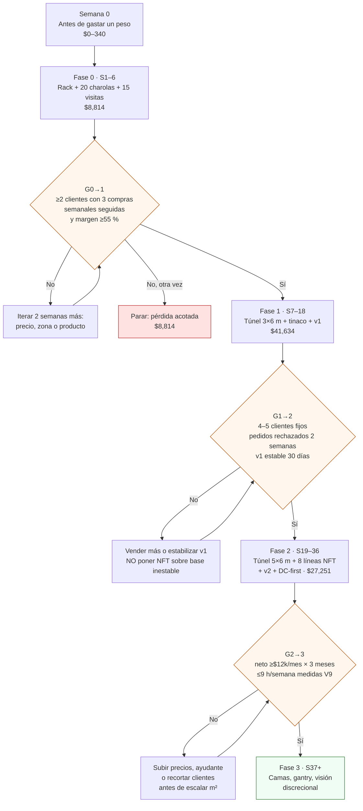

# HomeGreen: huerto comercial automatizado en un patio de CDMX

**En tres líneas:** un huerto de microgreens (ciclo de 7–14 días) y hierbas en NFT en un patio de 80 m² de la Ciudad de México, que vende charola viva y hierbas frescas a restaurantes y hogares. Se construye por fases y **cada fase se paga con lo que vendió la anterior**: nada se compra antes de pasar su gate. La automatización es DIY (ESP32 + ESPHome + Home Assistant, ~$3–5k MXN) y el fail-safe del agua es físico, no de software.

Esta wiki es una brújula, no un libro. Cada página te dice qué comprar (con enlace y precio verificado al 12-sep-2026), cómo instalarlo, cómo operarlo y cómo saber que quedó bien.

## Empieza aquí

[Antes de gastar un peso](empieza-aqui/antes-de-gastar-un-peso.md){ .md-button .md-button--primary }
[Línea de tiempo: 40 semanas](empieza-aqui/linea-de-tiempo.md){ .md-button }
[Fase 0: validación comercial](fases/fase-0/index.md){ .md-button }

!!! tip "Si solo tienes 10 minutos"
    Lee [Antes de gastar un peso](empieza-aqui/antes-de-gastar-un-peso.md) y haz la acción ③ (medir tu consumo eléctrico y leer el promedio del recibo CFE). Es la que evita el error más caro del proyecto: caer en tarifa DAC.

## Mapa de fases

Las cifras de inversión muestran el rango del [plan maestro](referencia/00-plan-maestro.md) y, en negritas, el total del BOM verificado con precios reales ([`bom/fase0.csv`](https://github.com/AndresIslas99/HomeGreen/blob/main/bom/fase0.csv), [`fase1.csv`](https://github.com/AndresIslas99/HomeGreen/blob/main/bom/fase1.csv), [`fase2.csv`](https://github.com/AndresIslas99/HomeGreen/blob/main/bom/fase2.csv)).

| Fase | Qué construyes | Cuándo | Inversión MXN (plan → BOM verificado) | Meta | Gate de salida |
|---|---|---|---|---|---|
| [0 · Validación comercial](fases/fase-0/index.md) | Rack bajo techo, 20 charolas 10×20, muestras a 15 restaurantes | Semanas 1–6 | **$8,814** | 2 clientes recurrentes | **G0→1:** ≥2 clientes con 3 compras semanales seguidas **y** margen variable ≥55 % |
| [1 · Túnel + automatización v1](fases/fase-1/index.md) | Túnel PTR 3×6 m con malla antigranizo, tinaco + captación pluvial, nodo ESP32 de riego y ambiente | Semanas 7–18 (meses 2–4) | **$41,634** | $6–10k/mes netos con 25–35 charolas/semana | **G1→2:** 4–5 clientes fijos, pedidos rechazados 2 semanas seguidas, v1 estable 30 días |
| [2 · NFT + automatización v2](fases/fase-2/index.md) | Túnel 5×6 m, 8 líneas NFT de PVC sanitario, pH/EC automáticos, respaldo DC-first, refrigerador dedicado | Semanas 19–36 (meses 5–9) | **$27,251** | $12–18k/mes netos del plan; realista $6,500–11,000 | **G2→3:** neto ≥$12k/mes × 3 meses con ≤9 h/semana medidas |
| [3 · Consolidación](fases/fase-3/index.md) | Camas elevadas, gantry o visión: testbed agtech | Semana 37+ (mes 10+) | discrecional | cero presión comercial | — |

Total acumulado: **$77,699 MXN en ~9 meses, condicionado a ventas.** Si G0→1 falla, la pérdida total es el BOM de Fase 0 ($8,814, de los cuales el rack, las básculas y los libros son revendibles) y termina el experimento. Los gates completos, con fuente de dato y regla de decisión, están en [Validación → Gates](validacion/gates.md).

## El camino y sus gates

Un gate no alcanzado no se renegocia a la baja: se itera o se detiene ([06 §L4](referencia/06-validacion-y-lazos-agenticos.md)).

## Cómo se verá

Plantas 2D del patio por fase. Suponen un patio de 10 × 8 m con la casa al sur y el acceso al norte; ajusta las cotas a tu predio en [Diseño → Layout del patio](diseno/layout-patio.md).

| Fase 0 · rack bajo techo | Fase 1 · túnel 3×6 m + tinaco |
|---|---|
|  |  |

| Fase 2 · túnel 5×6 m + NFT | Fase 3 · consolidación |
|---|---|
|  |  |

El render sale del modelo paramétrico OpenSCAD en `hardware/cad/`; los esquemas eléctricos, el P&ID hidráulico y el alzado del rack están en [Diseño](diseno/index.md).

## Los 6 números que cambian el plan

Correcciones con datos duros al plan original. Cada una cambia una compra o una decisión; el detalle está en [07 · Puntos ciegos](referencia/07-puntos-ciegos-y-riesgos.md), [01 · Proveedores](referencia/01-proveedores-cdmx.md) y [08 · Recetas y economía](referencia/08-recetas-y-economia-unitaria.md).

| # | El número | Qué cambia |
|---|---|---|
| 1 | **Tarifa DAC.** La bomba periférica de 0.5 HP del plan consume ~324 kWh/mes: supera sola el umbral de 250 kWh/mes de tarifa 1 y multiplica el recibo hasta 5× (~$2,600/mes). | Bomba de diafragma **12 V DC de 40–60 W** colgada de una batería LiFePO4 (arquitectura DC-first): ~32 kWh/mes, y un apagón no mata el NFT. Ver [Fase 2 → Eléctrico y respaldo](fases/fase-2/electrico-respaldo.md). |
| 2 | **PVC sanitario.** Tubo sanitario 4" Amanco a $415/tramo, no hidráulico cédula 40 a $1,401 (3.4×). | El NFT corre sin presión; 8 líneas salen en ~$7,200–8,700, 3× la capacidad del paquete comercial de $5,779. Ver [Armar una línea NFT](guias/armar-linea-nft.md). |
| 3 | **Precios de venta.** Charola viva $90–120 lista (no $60–90); clamshell 100 g $50–90 ($500–900/kg, no $250–450/kg); hierbas por manojo $20–35. | Con la lista corregida el costo variable queda en 15–30 %; con la original, rábano dejaba 18 % y chícharo perdía. Ver [Hoja de precios](guias/hoja-de-precios.md). |
| 4 | **Chícharo.** Con semilla a $340/kg y 275 g por charola, la semilla cuesta $93.50/charola: margen de −$8 a +$22 y $4.50 por charola-semana de rack. | No arrancar con chícharo hasta validar arvejón grado alimento de CEDA (~$40–60/kg). El mejor uso del rack es **rábano ($82/charola-semana)**, luego arúgula y girasol con semilla CEDA. |
| 5 | **Racks y Fase 1 reales.** Un rack que aguanta charolas mojadas cuesta $2,000–2,600 (Husky $2,019), no $1,200–1,800; la Fase 1 completa con iluminación T8, UPS y la partida de seguridad eléctrica sale en $41,634, no $18–28k. El proveedor "Hunab" no existe: es Hanlob y no vende antigranizo. | Malla antigranizo con Capi Agrícola ($40/m) o Hydro Environment; presupuesto de Fase 1 con el BOM, no con el plan. Ver [Fase 1 → Compras](fases/fase-1/compras.md). |
| 6 | **Neto realista.** Con merma 15–20 %, enero −35 %, CAC recurrente (~$650 + 8–10 h por cliente) y 15 h/semana reales (no 6–9), el neto de régimen baja de $8,000–13,500 a **$6,500–11,000/mes**. | Las fases se financian con este número. El timesheet V9 y los gates se evalúan contra esta base, no contra la optimista. |

## Esta semana

Cinco acciones que cuestan $0–340 en total y deciden cosas que después cuestan miles. Detalle paso a paso en [Antes de gastar un peso](empieza-aqui/antes-de-gastar-un-peso.md).

| # | Acción | Tiempo | Costo | Decisión que desbloquea |
|---|---|---|---|---|
| ① | Escritura, régimen de condominio y uso de suelo del predio (SEDUVI) | 2 h | $0 | ¿Puedo anclar un túnel en este patio, o toca asamblea y dados de concreto? |
| ② | Una pregunta al contador: "¿soy socio o accionista de alguna persona moral?" | 30 min | $0 | Régimen fiscal: RESICO agrícola (ISR $0 hasta $900k cobrados) o facturar desde tu empresa |
| ③ | Medidor de enchufe Steren HER-432 y lectura del promedio de 12 meses en el recibo CFE | 15 min + 7 días | $336.40 | ¿Cabe la Fase 2 bajo los 250 kWh/mes de tarifa 1, o necesitas contrato PDBT? |
| ④ | Tandeo de tu colonia (SACMEX) y EC/pH de la llave del patio 3 días distintos | 45 min | $0 con medidor prestado (~$400 si lo adelantas de Fase 2) | Tinaco de 750 L o 1,100 L; agua del NFT: red filtrada, mezcla o lluvia |
| ⑤ | Aviso de huerto a la alcaldía, inscripción al curso Intagri (hoy $0) y descarga de manuales | 2 h | $0 | Escudo legal ante vecinos y criterio técnico para la Fase 2 sin gastar |

## Índice del sitio

| Sección | Para qué la usas |
|---|---|
| [Empieza aquí](empieza-aqui/antes-de-gastar-un-peso.md) | Semana 0, [cómo usar esta guía](empieza-aqui/como-usar-esta-guia.md) y la [línea de tiempo](empieza-aqui/linea-de-tiempo.md) de 40 semanas con hitos y calendario climático |
| [Fases](fases/fase-0/index.md) | Una carpeta por fase: compras exactas, montaje, operación, ventas y gate. Cada índice de fase trae "cómo se verá" (planta + render 3D) |
| [Guías](guias/sembrar-una-charola.md) | Una tarea = una página: sembrar, sanitizar semilla, cosechar, anclar el túnel, armar una línea NFT, calibrar sondas, instalar GFCI y tierra, flashear ESPHome, visitar a un chef, facturar CFDI, cobrar y suspender, mock recall |
| [Diseño](diseno/index.md) | Arquitectura: [eléctrico](diseno/electrico.md) (esquemas y pines), [hidráulico](diseno/hidraulico.md) (P&ID), [control](diseno/control.md) (lazos e histéresis), [datos](diseno/datos.md), [layout del patio](diseno/layout-patio.md), [estructura del túnel](diseno/estructura-tunel.md), [rack y charolas](diseno/rack-y-charolas.md) |
| [Validación](validacion/index.md) | Lazos L0–L4, métodos V1–V11 con checklist, [KPIs](validacion/kpis.md) y [gates](validacion/gates.md) |
| [Software](software/index.md) | [Firmware ESPHome](software/firmware.md) listo para flashear, [Home Assistant](software/home-assistant.md) (automatizaciones y dashboard), [herramientas CLI](software/herramientas-cli.md) para KPIs, informe semanal y auditoría de gates |
| [Aprendizaje](aprendizaje/videos.md) | [Videos](aprendizaje/videos.md) verificados e incrustados, [libros](aprendizaje/libros.md) y [cursos](aprendizaje/cursos.md) por fase |
| [Referencia](referencia/bom.md) | [BOM por fase](referencia/bom.md), [normativa](referencia/normativa.md), [clima](referencia/clima.md), [glosario](referencia/glosario.md), [FAQ](referencia/faq.md), los 9 documentos base (00–08) y los 17 informes de investigación con fuentes |

## Cuatro reglas que no se negocian

1. **Vender antes de construir.** Cada fase se financia con la anterior; los gates se escriben y se versionan en Git antes de gastar ([06 §L4](referencia/06-validacion-y-lazos-agenticos.md)).
2. **Fail-safe físico, no de software.** La bomba del NFT cuelga del bus de batería; Home Assistant avisa y optimiza, pero el agua nunca depende de que esté vivo ([03 §2.3](referencia/03-instalacion.md)).
3. **Todo desde el tinaco, nunca de la toma.** CDMX tiene tandeo en ~10 alcaldías; el sistema corre 100 % de reserva propia y la red solo rellena ([02 §2](referencia/02-restricciones-y-requisitos.md)).
4. **Operar como sistema de control.** Todo se mide y se registra en `bitacora/*.csv`; un lazo agéntico semanal convierte los datos en decisiones y el humano aprueba ([06 §L3](referencia/06-validacion-y-lazos-agenticos.md)).

## Fuentes

- [00 · Plan maestro](referencia/00-plan-maestro.md): mapa de fases, metas y gates.
- [07 · Puntos ciegos y riesgos](referencia/07-puntos-ciegos-y-riesgos.md): DAC, apagones, cadena de frío, horas reales, neto corregido.
- [01 · Proveedores CDMX](referencia/01-proveedores-cdmx.md) y [08 · Recetas y economía unitaria](referencia/08-recetas-y-economia-unitaria.md): precios y economía por charola.
- [06 · Validación y lazos agénticos](referencia/06-validacion-y-lazos-agenticos.md): gates L4 y métodos V1–V11.
- BOM verificados: [`bom/fase0.csv`](https://github.com/AndresIslas99/HomeGreen/blob/main/bom/fase0.csv) · [`bom/fase1.csv`](https://github.com/AndresIslas99/HomeGreen/blob/main/bom/fase1.csv) · [`bom/fase2.csv`](https://github.com/AndresIslas99/HomeGreen/blob/main/bom/fase2.csv).
