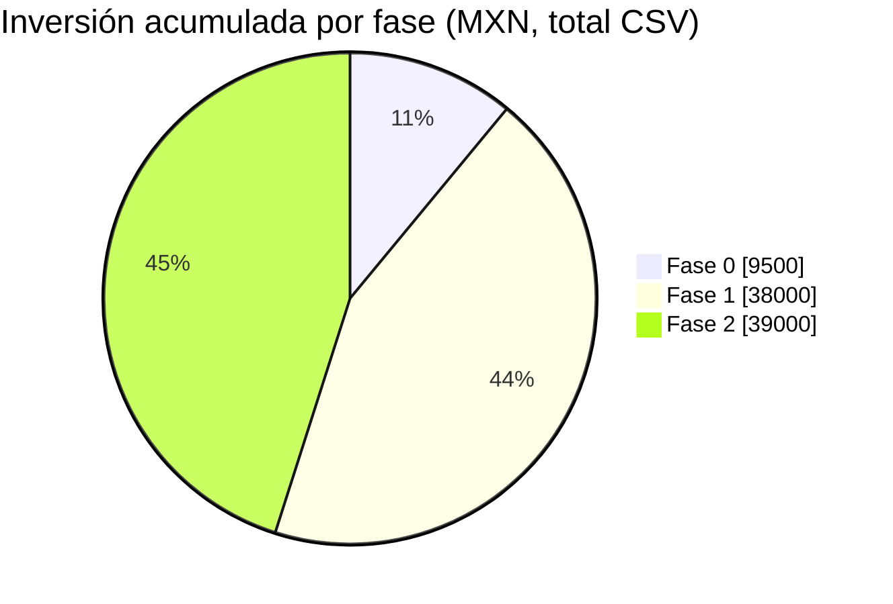

# BOM por fase (listas de materiales)

**En una línea:** las tres listas de materiales del proyecto, generadas tal cual desde los CSV del
repositorio (`bom/fase0.csv`, `fase1.csv`, `fase2.csv`), con enlace clicable por renglón, estado del
precio y totales; si un precio cambia, se corrige el CSV y esta página se regenera con
un script de una sola pasada [POR VERIFICAR: incorporar `gen_bom.py` (stdlib) a `tools/` junto a `check_links.py`; hoy la página se regeneró a mano desde los CSV].

!!! info "Cómo leer estas tablas"
    - **verificado** = el precio se confirmó abriendo la ficha del producto el 12-sep-2026.
      **aprox.** = precio visto en resultados de búsqueda o rango de mercado; confírmalo en el carrito
      antes de pagar (Mercado Libre, Amazon y UNIT bloquean la verificación automática).
    - Los textos de ítem y notas son **literalmente los del CSV** (sin acentos), para que la tabla y el
      archivo nunca se contradigan. Los enlaces "búsqueda" llevan a un listado, no a una ficha fija.
    - "Sin enlace en el CSV" = compra en tienda física; no se inventan URLs.
    - Precios en MXN con IVA al 12-sep-2026. Fuente de cada renglón y alternativas:
      [01-proveedores-cdmx](01-proveedores-cdmx.md) y los informes de `docs/research/` enlazados en **Fuentes**.
    - Cada fase se compra **solo al pasar el gate anterior** ([06 §L4](06-validacion-y-lazos-agenticos.md)); dentro de la
      fase, el orden de compra está en [03 §Orden de compra](03-instalacion.md).

## Resumen de las tres fases

| Fase | Total CSV (MXN) | Rango realista según las notas del CSV | Descarga |
|---|---|---|---|
| 0 · Validación comercial | ~$9,500 | $6,700 (austera: rack Adir, sin libros, rábano/betabel 250 g) – $9,500 | [`fase0.csv`](https://github.com/AndresIslas99/HomeGreen/blob/main/bom/fase0.csv) |
| 1 · Túnel + agua + automatización v1 | ~$38,000 | $31,000 (2 racks, DHT22) – $34,000–42,000 | [`fase1.csv`](https://github.com/AndresIslas99/HomeGreen/blob/main/bom/fase1.csv) |
| 2 · NFT + v2 + respaldo eléctrico + frío | ~$39,000 | $34,000 (sin seguro, DFRobot etapa 2 ni panel) – $39,000 | [`fase2.csv`](https://github.com/AndresIslas99/HomeGreen/blob/main/bom/fase2.csv) |
| **Acumulado 0–2** | **~$86,500** | **~$72,000–90,500** | — |

El plan original hablaba de $60–90k acumulados ([00-plan-maestro](00-plan-maestro.md)); los CSV
lo confirman en el extremo alto porque incluyen lo que el plan no presupuestaba: racks reales
($2,019 c/u), iluminación T8, respaldo eléctrico DC, GFCI + tierra física y cadena de frío
([07-puntos-ciegos](07-puntos-ciegos-y-riesgos.md)).

## Fase 0 · Validación comercial (rack bajo techo)

Archivo fuente: [`bom/fase0.csv`](https://github.com/AndresIslas99/HomeGreen/blob/main/bom/fase0.csv) (botón **Raw** o **Download** en GitHub para descargarlo). Página de compras de la fase: [Fase 0 → Compras](../fases/fase-0/compras.md).

| # | Categoría | Ítem | Cant. | Precio unit. (MXN) | Subtotal (MXN) | Estado | Proveedor / enlace | Notas |
|---|---|---|---|---|---|---|---|---|
| 1 | rack | Estante Husky 5 niveles 183x91.4x45.7 cm (362.9 kg/repisa) | 1 | $2,019 | $2,019 | **verificado** | [Home Depot MX](https://www.homedepot.com.mx/p/husky-estante-de-5-niveles-de-acero-183-x-914-x-457-cm-negro-zrop361872-5llb-150281) | Opcion economica: rack Adir 5 niveles ~$1300 aprox en ML (menos rigido; suficiente para Fase 0) |
| 2 | charolas | Charola 10x20 CON drenaje | 10 | $60 | $600 | aprox. | [Al Natural / ML](https://www.alnatural.com.mx/tienda/charolas-de-germinacion-venta-mayoreo) | Cotizar mayoreo por WhatsApp; confirmar perforacion |
| 3 | charolas | Charola 10x20 SIN drenaje (riego por fondo y blackout) | 10 | $60 | $600 | aprox. | [Al Natural / ML (búsqueda)](https://listado.mercadolibre.com.mx/charolas-para-microgreens) | Flujo doble charola: perforada dentro de lisa |
| 4 | semilla | Girasol grado alimento CEDA (prueba A/B) | 1 kg | $34 | $34 | **verificado** | [Mayoreo Online (Central de Abastos)](https://mayoreo.online/products/semilla-de-girasol-con-cascara-jumbo) | V1 obligatoria: si germina &gt;=80% recomprar costal 5 kg ($140) o bulto ($24/kg) |
| 5 | semilla | Girasol especifico microgreens (prueba A/B) | 1 kg | $185 | $185 | **verificado** | [Al Natural Grow Shop](https://www.alnatural.com.mx/tienda/semilla-de-girasol-para-microgreens) | El control del A/B contra la semilla de CEDA |
| 6 | semilla | Chicharo Early Perfection a granel | 1 kg | $340 | $340 | **verificado** | [Hydro Environment](https://hydroenv.com.mx/producto/gramo-de-semilla-de-chicharo-variedad-early-perfection/) | Escalon 453+ g ($0.34/g); confirmar sin tratamiento quimico |
| 7 | semilla | Rabano Champion a granel | 500 g | $1.60/g | $800 | **verificado** | [Hydro Environment](https://hydroenv.com.mx/producto/gramo-de-semilla-de-rabano-var-champion/) | Rinde ~25-30 g de semilla por charola |
| 8 | semilla | Betabel Early Wonder a granel | 500 g | $1.60/g | $800 | **verificado** | [Hydro Environment](https://hydroenv.com.mx/producto/gramo-de-semilla-de-betabel-o-remolacha-variedad-early-wonder/) | Ciclo mas largo que rabano; sembrar menos volumen |
| 9 | semilla | Brocoli para brotes | 1 bolsa | $201 | $201 | **verificado** | [Hydrocultura](https://hydrocultura.com/collections/semillas-para-microgreens-o-microvegetales) | NO comprar en Hydroenv ($3500/kg); confirmar gramaje de bolsa por WhatsApp 55 9435-6905 |
| 10 | semilla | Variedades finas para muestras (amaranto/mostaza/cilantro) | 2-3 sobres | $100 | $300 | aprox. | [Semillas ISLA (CDMX) / Hydrocultura](https://semillasisla.mx/collections/microgreens) | Solo muestras a chefs; granel cuando haya pedido recurrente |
| 11 | sustrato | Polvillo de coco para germinacion 50 L | 2 | $115 | $230 | **verificado** | [Hydro Environment](https://hydroenv.com.mx/producto/polvillo-de-coco-para-germinacion-50-l-sustrato-organico/) | ~$2.10/charola; al escalar: tarima 20 blocks lavados Hydrocultura |
| 12 | operacion | Bascula digital de cocina 1 g / 5-10 kg | 1 | $120 | $120 | aprox. | [Mercado Libre (búsqueda)](https://listado.mercadolibre.com.mx/bascula-digital-cocina) | Pesar cosecha (dato de bitacora) |
| 13 | operacion | Bascula de precision 0.1 g / 500 g | 1 | $180 | $180 | aprox. | [Mercado Libre (búsqueda)](https://listado.mercadolibre.com.mx/bascula-de-precision-0.1g) | Dosificar semilla por charola |
| 14 | operacion | Tijera recta inox de cocina | 1 | $90 | $90 | aprox. | tienda física (súper) · sin enlace en el CSV | Mejor que tijera de jardin para microgreens |
| 15 | operacion | Atomizador 1 L | 2 | $80 | $160 | aprox. | [Home Depot (búsqueda)](https://www.homedepot.com.mx/s/atomizador) | Uno EXCLUSIVO para H2O2 etiquetado |
| 16 | sanidad | Guantes de nitrilo caja 100 | 1 | $250 | $250 | aprox. | [ML / Home Depot](https://www.homedepot.com.mx/p/forte-caja-de-100-guantes-medianos-de-nitrilo-desechables-para-uso-rudo-93252-206899) | $369 verificado HD; cajas desde ~$180 en ML |
| 17 | sanidad | H2O2 35% grado alimenticio 1 L | 1 | $200 | $200 | aprox. | [Mercado Libre (búsqueda)](https://listado.mercadolibre.com.mx/peroxido-de-hidrogeno-35%25-grado-alimenticio-oxigeno-liquido) | Diluir SIEMPRE; desinfeccion de charolas |
| 18 | empaque | Clamshell PET 8 oz | 100 | $3.50 | $350 | aprox. | [Mercado Libre (búsqueda)](https://listado.mercadolibre.com.mx/clamshell) | Al escalar: cotizar fabricante Iztapalapa (Burbumoldes / Empaques Etesa) |
| 19 | empaque | Etiquetas adhesivas tiraje chico | 200-500 | — | $600 | aprox. | [Dushi / Pop Mexico (CDMX)](https://www.imprentacdmx.com/servicios-de-impresion/impresion-de-etiquetas-adhesivas/) | Marca + variedad + fecha de cosecha + lote + contacto |
| 20 | sanidad | Agua oxigenada 3% farmacia (sanitizacion de semilla) | 2 | $30 | $60 | aprox. | tienda física (farmacia) · sin enlace en el CSV | Protocolo: 5 min a 60 C con agitacion + enjuague (girasol/chicharo SIEMPRE) |
| 21 | sanidad | Hipoclorito de calcio 65% 1 kg (estandar duro 20000 ppm) | 1 | $250 | $250 | aprox. | [Mercado Libre / tienda de albercas (búsqueda)](https://listado.mercadolibre.com.mx/hipoclorito-de-calcio) | 31 g/L 15 min + triple enjuague; para clientes hotel |
| 22 | sanidad | Termometro de cocina (precalentado 60 C + temp de entregas) | 1 | $150 | $150 | aprox. | tienda física o [búsqueda ML](https://listado.mercadolibre.com.mx) · sin enlace en el CSV | Tambien registra la cadena de frio en bitacora |
| 23 | libros | Microgreens: The Insiders Secrets (Donny Greens) | 1 | $396.60 | $397 | **verificado** | [Amazon MX](https://www.amazon.com.mx/Microgreens-Insiders-Building-Successful-Microgreen/dp/191366600X) | El libro de VENDER a chefs; leer antes de las visitas |
| 24 | libros | El jardinero horticultor (Fortier en espanol) | 1 | $488 | $488 | **verificado** | [El Pendulo (8 sucursales CDMX)](https://pendulo.com/libro/jardinero-horticultor-el_393665) | Siembras escalonadas y canal directo |

**Suma de renglones numéricos:** $9,404 MXN · **Total declarado en el CSV:** ~9500 MXN · **Renglones:** 24 (10 verificados, 14 aprox.).

!!! note "Nota del CSV sobre el total"
    Escenario recomendado con sanitizacion e inocuidad; version austera (rack Adir + sin libros + rabano/betabel 250 g) ~$6700

??? info "Subtotal por categoría"
    | Categoría | Subtotal (MXN) | % |
    |---|---|---|
    | semilla | $2,660 | 28 % |
    | rack | $2,019 | 21 % |
    | charolas | $1,200 | 13 % |
    | empaque | $950 | 10 % |
    | sanidad | $910 | 10 % |
    | libros | $885 | 9 % |
    | operacion | $550 | 6 % |
    | sustrato | $230 | 2 % |

## Fase 1 · Túnel, agua, racks y automatización v1

Archivo fuente: [`bom/fase1.csv`](https://github.com/AndresIslas99/HomeGreen/blob/main/bom/fase1.csv) (botón **Raw** o **Download** en GitHub para descargarlo). Página de compras de la fase: [Fase 1 → Compras](../fases/fase-1/compras.md).

| # | Categoría | Ítem | Cant. | Precio unit. (MXN) | Subtotal (MXN) | Estado | Proveedor / enlace | Notas |
|---|---|---|---|---|---|---|---|---|
| 1 | estructura | PTR 1.5x1.5 pulg cal 14 x 6 m | 15 | $382.85 | $5,743 | **verificado** | [Sodimac (5+ pzas) / Aceros Crea (volumen)](https://www.sodimac.com.mx/sodimac-mx/product/433713/ptr-1-1-2x1-1-2-calibre-14/433713) | Tunel 3x6 m a dos aguas; disenar empalmes para ampliar a 5x6 en Fase 2 |
| 2 | estructura | PTR 1 pulg largueros | 4 | $275 | $1,100 | aprox. | [Sodimac / tlapaleria](https://www.sodimac.com.mx/sodimac-mx/category/cat11448/PTR) | Largueros ligeros y contravientos |
| 3 | estructura | Soldadura o herrero + primario + tornilleria | 1 | $2,000 | $2,000 | aprox. | herrero local (3 cotizaciones) · sin enlace en el CSV | Herrero cobra $200-400/dia y trae equipo (evita comprar esmeriladora) |
| 4 | estructura | Anclaje: placas 10x10 + anclas de cuna 3/8 x 3 | 6 postes | $180 | $1,100 | aprox. | [tlapaleria / Home Depot (búsqueda)](https://www.homedepot.com.mx/s/taquete) | 2-4 anclas por placa sobre firme de concreto; NUNCA sin anclar (rachas 50-80 km/h) |
| 5 | cubierta | Plastico UV cal 720 blanco lechoso 25% sombra 6.2 m ancho | 8 m | $215 | $1,720 | **verificado** | [Hydro Environment](https://hydroenv.com.mx/producto/metro-de-plastico-para-invernadero-25-sombra-6-2-m-de-ancho-cal-720/) | Alternativa mitad de precio: corte 7.2x10 m invernaderosMX $1100 (confirmar espesor y garantia UV) |
| 6 | cubierta | Malla antigranizo 3.7 m ancho | 40 m | $40 | $1,600 | **verificado** | [Capi Agricola](https://www.capiagricola.com.mx/product/malla-antigranizo-negra-3-70-m-x-metro/) | Montada 10-20 cm SOBRE el plastico; instalada antes de mayo; pico estadistico agosto |
| 7 | cubierta | Perfil zigzag + resorte + cinta reparadora + canaleta PVC | 1 | $1,100 | $1,100 | aprox. | [Hydroenv / tlapaleria](https://hydroenv.com.mx/plastico-para-invernadero-y-campo/) | La canaleta nace con la estructura (alimenta captacion pluvial) |
| 8 | racks | Estante Husky 5 niveles 183x91.4x45.7 | 3 | $2,019 | $6,057 | **verificado** | [Home Depot MX](https://www.homedepot.com.mx/p/husky-estante-de-5-niveles-de-acero-183-x-914-x-457-cm-negro-zrop361872-5llb-150281) | Forrar entrepanos de MDF con plastico o charola; produccion escalonada lun/jue |
| 9 | agua | Tinaco Rotoplas Resistec 750 L | 1 | $2,051 | $2,051 | **verificado** | [rotoplas.com.mx](https://rotoplas.com.mx/products/almacenamiento/tinacos/) | Alcaldia con tandeo duro: subir a Plus+ 1100 L ($3774); sombreado u opaco |
| 10 | agua | Captacion pluvial DIY (canaleta + tlaloque casero PVC 4 + filtro hojas) | 1 | $1,500 | $1,500 | aprox. | [tlapaleria](https://www.engineeringforchange.org/wp-content/uploads/2020/07/MANUAL-INSTALACI%C3%93N-KIT-TL%C3%81LOC-12-JUNIO-2019CH.pdf) | Manual oficial gratis; en Fase 2 se reemplaza por Paquete Basico Tlaloc; aplicar a Cosecha de Lluvia SEDEMA en ene-feb |
| 11 | automatizacion | ESP32 DevKit V1 30 pines | 3 | $130 | $390 | aprox. | [UNIT Electronics](https://uelectronics.com/producto/esp32-devkit-v1-30-pines-usb-c-microusb/) | 2 nodos + 1 repuesto; confirmar precio en carrito |
| 12 | automatizacion | SHT31 (T/HR ambiente) | 2 | $300 | $600 | aprox. | [Mercado Libre](https://articulo.mercadolibre.com.mx/MLM-2050379399-modulo-de-sensor-de-humedad-sht31-temperatura-sht31-d-microc-_JM) | Upgrade sobre DHT22: no deriva con HR alta sostenida del tunel |
| 13 | automatizacion | DS18B20 sumergible | 3 | $35 | $105 | aprox. | [UNIT Electronics](https://uelectronics.com/producto/ds18b20-sensor-de-temperatura-digital-de-acero-inoxidable-sumergible/) | Comprar 3: es el sensor que mas se maltrata |
| 14 | automatizacion | Sensor capacitivo humedad sustrato pack x10 | 1 | $300 | $300 | aprox. | [Amazon MX](https://www.amazon.com.mx/GalaxyElec-capacitivo-resistente-corrosi%C3%B3n-anal%C3%B3gico/dp/B082HV1JMG) | 20-30% salen malos; sellar borde de PCB con esmalte; conector hacia arriba |
| 15 | automatizacion | Modulo rele 4 canales optoacoplado | 2 | $110 | $220 | aprox. | [UNIT Electronics](https://uelectronics.com/producto/relevador-5v-de-1-a-8-canales/) | Riego + ventilador + luces + reserva |
| 16 | automatizacion | Fuente 12V 5A Steren ELI-1260 (circuito critico) | 1 | $399 | $399 | **verificado** | [Steren](https://www.steren.com.mx/eliminador-regulado-de-12-vcc-5-a.html) | Para intemperie: Mean Well IP67 XLG-75-12-A en UNIT |
| 17 | automatizacion | Bomba diafragma 12V con presostato | 1 | $350 | $350 | aprox. | [Mercado Libre (búsqueda)](https://listado.mercadolibre.com.mx/bomba-de-agua-diafragma-12v) | Da presion para nebulizar |
| 18 | automatizacion | Kit nebulizadores/microaspersores | 1 | $250 | $250 | aprox. | [Mercado Libre (búsqueda)](https://listado.mercadolibre.com.mx/nebulizadores-de-riego) | 10-30 boquillas con manguera |
| 19 | automatizacion | JSN-SR04T nivel de tinaco | 1 | $150 | $150 | aprox. | [UNIT Electronics](https://uelectronics.com/producto/sensor-ultrasonico-jns-sr04t/) | Zona muerta ~20 cm sobre nivel maximo |
| 20 | automatizacion | Cerebro: mini PC ThinkCentre usado i5/8GB/SSD | 1 | $3,000 | $3,000 | aprox. | [Mercado Libre (búsqueda)](https://listado.mercadolibre.com.mx/mini-pc-lenovo-thinkcentre) | Alternativa: Pi 5 4GB $3069 verificado Cyberpuerta; mini PC rinde mas para HA+Grafana+Frigate |
| 21 | automatizacion | UPS chico para el cerebro | 1 | $900 | $900 | aprox. | [ML / Cyberpuerta (búsqueda)](https://listado.mercadolibre.com.mx/no-break-500va) | Notificacion de corte de luz + HA sigue alarmando |
| 22 | automatizacion | Gabinete IP65 ~300x300x90 + prensaestopas | 2 | $350 | $700 | aprox. | [Mercado Libre (búsqueda)](https://listado.mercadolibre.com.mx/gabinete-plastico-exterior-ip65) | Nodo del tunel y nodo de bomba |
| 23 | automatizacion | Material de soporte (cable/borneras/fusibles/termofit/cinchos) | 1 | $1,000 | $1,000 | aprox. | [AG Electronica (Rep. de El Salvador 20-F Centro)](https://agelectronica.com) | Comprar en persona; de paso conocer el proveedor de emergencia mismo-dia |
| 24 | iluminacion | Tubo LED T8 18W 120cm 6500K | 8 | $121 | $968 | **verificado** | [JWJ Light](https://jwjlight.mx/producto/tubo-led-t8-18w-120-cm/) | 2 por nivel; NO pagar grow lights para ciclo de 10 dias; +canaletas y cable ~$400 |
| 25 | clima | Tapete termico de germinacion | 1 | $380 | $380 | aprox. | [Mercado Libre (búsqueda)](https://listado.mercadolibre.com.mx/tapete-termico-germinacion) | Para dic-feb (germinacion a 22 C); automatizable con rele |
| 26 | clima | Malla sombra 35% 3.7 m ancho | 6 m | $129 | $774 | **verificado** | [Hydro Environment](https://hydroenv.com.mx/producto/malla-sombra-por-metro-al-35-de-3-7-m-de-ancho/) | SOLO marzo-mayo (UV extremo); quitar el resto del ano |
| 27 | fitosanitario | Jabon potasico 1 kg | 1 | $250 | $250 | **verificado** | [Soluciones Naturales Pro](https://solucionesnaturalespro.com.mx/product/jabon-potasico/) | Pulgon/mosca blanca/trips: 10-15 ml/L al enves |
| 28 | fitosanitario | Trampas amarillas pegajosas | 1 paquete | $150 | $150 | aprox. | [Mercado Libre (búsqueda)](https://listado.mercadolibre.com.mx/trampas-amarillas-pegajosas) | 1 por rack; el indicador temprano mas barato |
| 29 | fitosanitario | Gnatrol DG (Bti) 500 g | 1 | $800 | $800 | aprox. | [Valent / ML](http://www.valent.mx/productos/insecticidas/gnatrol) | Comprar ANTES de la primera temporada de lluvias (mosca fungosa) |
| 30 | herramientas | Fase 1 (rotomartillo + brocas + taquetes + niveles + IP65 ya arriba) | 1 | $1,600 | $1,600 | aprox. | [04-herramientas](04-herramientas.md) · sin enlace en el CSV | Si suelda herrero: sin esmeriladora ni careta |

**Suma de renglones numéricos:** $37,257 MXN · **Total declarado en el CSV:** ~38000 MXN · **Renglones:** 30 (9 verificados, 21 aprox.).

!!! note "Nota del CSV sobre el total"
    Rango realista $34000-42000; el plan decia $18-28k pero subestimaba racks ($2k c/u reales) e iluminacion; recortable: 2 racks en vez de 3 y DHT22 en vez de SHT31 =&gt; ~$31000

??? info "Subtotal por categoría"
    | Categoría | Subtotal (MXN) | % |
    |---|---|---|
    | estructura | $9,943 | 27 % |
    | automatizacion | $8,364 | 22 % |
    | racks | $6,057 | 16 % |
    | cubierta | $4,420 | 12 % |
    | agua | $3,551 | 10 % |
    | herramientas | $1,600 | 4 % |
    | fitosanitario | $1,200 | 3 % |
    | clima | $1,154 | 3 % |
    | iluminacion | $968 | 3 % |

## Fase 2 · NFT, dosificación v2, respaldo eléctrico y cadena de frío

Archivo fuente: [`bom/fase2.csv`](https://github.com/AndresIslas99/HomeGreen/blob/main/bom/fase2.csv) (botón **Raw** o **Download** en GitHub para descargarlo). Página de compras de la fase: [Fase 2 → Compras](../fases/fase-2/compras.md).

| # | Categoría | Ítem | Cant. | Precio unit. (MXN) | Subtotal (MXN) | Estado | Proveedor / enlace | Notas |
|---|---|---|---|---|---|---|---|---|
| 1 | nft | Tubo PVC SANITARIO 4 pulg x 6 m Amanco blanco | 4 | $415 | $1,660 | **verificado** | [Home Depot MX](https://www.homedepot.com.mx/p/amanco-wavin-tubo-sanitario-11-x-600-cm-blanco-amanco-942842-451963) | SANITARIO no hidraulico C-40 ($1401): NFT corre sin presion; blanco refleja calor |
| 2 | nft | Codos 90/45 + tapas + adaptadores drenaje 4 pulg | 1 lote | $600 | $600 | **verificado** | [Home Depot MX](https://www.homedepot.com.mx/p/amanco-wavin-codo-pvc-4-513695-513695) | Codo 90 $28.80 / codo 45 $18.31 |
| 3 | nft | Tuberia distribucion 1/2-3/4 + retorno 2 pulg + valvulas compuerta por linea | 1 | $750 | $750 | aprox. | [Home Depot / tlapaleria](https://www.homedepot.com.mx/b/plomeria/tuberias-y-conexiones/sanitarias) | Caudal objetivo 1-2 L/min por linea (botella 1 L + cronometro) |
| 4 | nft | Canastilla hidroponica 3 pulg | 80 | $12.80 | $1,024 | **verificado** | [Hydro Environment](https://hydroenv.com.mx/producto/canastilla-hidroponica-de-3-pulgadas/) | Comprar ANTES de perforar; medir cuerpo bajo el labio para la sierra copa |
| 5 | nft | Sierra copa Truper COBI del diametro medido + mandril | 1 | $300 | $300 | aprox. | [Mercado Libre / Amazon MX (búsqueda)](https://listado.mercadolibre.com.mx/truper-sierra-corta-circulos-bimetalica) | Tipico 44-48 mm para canastilla de 2 pulg (aqui 3 pulg: medir); un solo diametro |
| 6 | nft | Bomba sumergible 4500 LPH | 1 | $1,199 | $1,199 | **verificado** | [Hydro Environment](https://hydroenv.com.mx/producto/bomba-sumergible-4500-lph-para-hidroponia-y-estanques/) | 65 W ~$45/mes de luz vs periferica 370 W ~$260/mes; opcion redundante: 2 genericas ML en paralelo |
| 7 | nft | Filtro malla 120 mesh 1 pulg | 1 | $230 | $230 | **verificado** | [Hydro Environment](https://hydroenv.com.mx/producto/filtro-de-malla-para-riego-de-1-pulgada-con-salida-y-entrada-tipo-macho/) | En el retorno antes de la bomba |
| 8 | nft | Tambo HDPE 200 L grado alimenticio (deposito solucion) | 1 | $700 | $700 | aprox. | [Mercado Libre / Plastank (búsqueda)](https://listado.mercadolibre.com.mx/tambos-de-200-litros) | Bajo sombra; solucion ideal 18-22 C; cambio completo cada 2-3 semanas |
| 9 | nft | Semillero foami agricola 144 bloques | 2 | $45.50 | $91 | **verificado** | [Hydro Environment](https://hydroenv.com.mx/producto/semillero-de-foami-agricola-de-144-bloques-30x30-cm/) | $0.32/planta; NO peat pellets (tapan filtro) |
| 10 | nutricion | Solucion nutritiva hortalizas 1.5 kg (rinde 1000 L) | 2 | $349 | $698 | **verificado** | [Hydro Environment](https://hydroenv.com.mx/producto/solucion-nutritiva-para-hortalizas-de-1-5-kg-rinde-para-1000-litros/) | Al pasar de 2 m3/mes: costal 25 kg ($202/m3) o sales A/B (~$90-150/m3); DESCARTAR Flora Series GHE (10-40x) |
| 11 | nutricion | AquAcid buffer pH- (para peristaltica) | 1 | $516 | $516 | **verificado** | [Hydro Environment](https://hydroenv.com.mx/producto/aquacid-buffer-para-bajar-ph-regulador-de-ph-para-hidroponia/) | Alternativa barata: acido fosforico/citrico grado alimenticio |
| 12 | calibracion | Buffer pH 4.01 120 mL | 2 | $40 | $80 | **verificado** | [Insumos Cerveceros](https://insumoscerveceros.mx/inicio/1305-solucion-para-calibracion-de-ph-buffer-401-120-ml.html) | Calibracion quincenal (evento en HA) |
| 13 | calibracion | Sobres buffer 6.86 | 10 | $15 | $150 | aprox. | [Mercado Libre (búsqueda)](https://listado.mercadolibre.com.mx/solucion-buffer-para-calibrar-ph) | El estandar de las sondas DFRobot |
| 14 | calibracion | Solucion EC 1413 uS Hanna HI7031L 500 mL | 1 | $459.36 | $459 | **verificado** | [Hanna Instruments Mexico](https://hannainst.com.mx/soluci%C3%B3n-de-calibraci%C3%B3n-de-ce-1-413-%C2%B5s-3-cm-valor-hi7031l) | Caducidad 5 anos cerrada; presupuesto anual calibracion+sonda ~$1050 |
| 15 | automatizacion | Sonda pH economica PH-4502C + electrodo E201-BNC | 1 | $329 | $329 | aprox. | [UNIT Electronics](https://uelectronics.com/producto/sensor-de-ph-liquido/) | Etapa 1: validar el lazo de control |
| 16 | automatizacion | Kit pH DFRobot Gravity (etapa 2 cuando el NFT venda) | 1 | $1,250 | $1,250 | aprox. | [Geek Factory](https://www.geekfactory.mx/producto/kit-sensor-de-ph-para-arduino-gravity-dfrobot/) | El electrodo caduca 12-18 meses aunque no se use: no comprar antes de tiempo; reemplazo anual ~$400-600 |
| 17 | automatizacion | Sensor EC/TDS SEN0244 | 1 | $450 | $450 | aprox. | [UNIT Electronics](https://uelectronics.com/producto/sensor-tds-meter-v1-0-analogico-sen0244/) | Calibrar en mS/cm directo en ESPHome; sondas en el RETORNO |
| 18 | automatizacion | Bomba peristaltica 12V | 4 | $225 | $900 | aprox. | [Mercado Libre (búsqueda)](https://listado.mercadolibre.com.mx/bomba-peristaltica-12v) | A + B + pH- + 1 repuesto; manguera interna es consumible |
| 19 | automatizacion | Valvula solenoide 12V 1/2 NC | 2 | $200 | $400 | aprox. | [Mercado Libre / UNIT (búsqueda)](https://listado.mercadolibre.com.mx/valvula-solenoide-12v-1-2) | NC: un corte de luz no vacia el tinaco |
| 20 | automatizacion | ESP32-CAM OV2640 V3 USB-C | 1 | $260 | $260 | aprox. | [UNIT Electronics](https://uelectronics.com/producto/esp32-cam-ov2640-v3-con-interfaz-tipo-c/) | Timelapse e inspeccion remota |
| 21 | automatizacion | Sensor de flujo YF-S201 | 1 | $110 | $110 | aprox. | [Tecneu / ML (búsqueda)](https://listado.mercadolibre.com.mx/sensor-de-flujo-de-agua-yf-s201) | Watchdog bomba tapada / linea rota |
| 22 | agua | Paquete Basico Tlaloc (tlaloque + filtro hojas + axolote) | 1 | $5,300 | $5,300 | **verificado** | [Isla Urbana (Coyoacan)](https://islaurbana.mx/product/paquete-basico-tlaloc/) | Reemplaza el separador casero de Fase 1; GRATIS si entra Cosecha de Lluvia SEDEMA |
| 23 | agua | Duplex sedimento 5um + carbon activado 10 pulg | 1 | $1,000 | $1,000 | aprox. | [Agua Limpia / ML](https://www.agualimpia.mx/collections/filtro-para-sedimento-y-carbon-activado) | Solo en la linea que llena el deposito NFT (quita cloro); cartuchos cada 4-6 meses |
| 24 | medicion | Medidor pH + TDS/EC de mano (arbitro de sondas) | 1 | $450 | $450 | aprox. | [Mercado Libre (búsqueda)](https://listado.mercadolibre.com.mx/medidor-ph-tds-ec) | Hanna HI98130 (~$4-6k) solo cuando las hierbas facturen &gt;$6k/mes |
| 25 | semilla | Albahaca Nufar organica (resistente a fusarium) 1 oz | 1 | $549 | $549 | **verificado** | [Hydrocultura](https://hydrocultura.com/products/nufar-semillas-organicas-de-albahaca) | ~20000 semillas; agotada al 12-sep-2026: vigilar reabasto |
| 26 | semilla | Albahaca Genovese (sobre 100) + Italian Large Leaf (3 g) | 1 | $95 | $95 | **verificado** | [Semillas ISLA / Hydroenv](https://semillasisla.mx/products/albahaca-genovese) | Diversificar; morada y limon como linea premium cocteleria |
| 27 | libros | Cultivos hidroponicos (Resh 5a ed espanol) | 1 | $899 | $899 | **verificado** | [Casa del Libro](https://latam.casadellibro.com/libro-cultivos-hidroponicos-5-ed-suelo-para-tecnicos-y-agricultores-profesionales-asi-como-para-los/9788484760054/796153) | Comprar con ingresos de Fase 1; el porque de las bandas pH/EC |
| 28 | respaldo | Bateria LiFePO4 12.8V 100Ah Epcom LI100A12PRO | 1 | $4,459 | $4,459 | **verificado** | [Cyberpuerta](https://www.cyberpuerta.mx/index.php?cl=search&searchparam=bateria+LiFePO4) | 28-30 h de recirculacion continua; variante austera: AGM 24Ah Steren ~$1290 |
| 29 | respaldo | Bomba diafragma 12V 40-60W (principal + respaldo) | 2 | $650 | $1,300 | aprox. | [Mercado Libre (búsqueda)](https://listado.mercadolibre.com.mx/bomba-diafragma-12v) | ARQUITECTURA DC-FIRST: la bomba NFT 24/7 es de 12V colgada del bus de bateria; la de 127V solo llenado/purga |
| 30 | respaldo | Controlador solar EPEVER LS2024B (hace de cargador) | 1 | $599 | $599 | **verificado** | [Cyberpuerta](https://www.cyberpuerta.mx/index.php?cl=search&searchparam=controlador+de+carga+solar) | Perfil LiFePO4 configurable |
| 31 | respaldo | Panel solar 100W Ugreen (opcional recomendado) | 1 | $1,049 | $1,049 | **verificado** | [Cyberpuerta](https://www.cyberpuerta.mx/index.php?cl=search&searchparam=panel+solar+100W) | Flota la bateria sin CFE; corte diurno = sostenible indefinido |
| 32 | respaldo | UPS DataShield DS-600 (router + cerebro) | 1 | $1,189 | $1,189 | **verificado** | [Cyberpuerta](https://www.cyberpuerta.mx/index.php?cl=search&searchparam=DataShield+UPS) | Sin internet no hay alarmas |
| 33 | seguridad | Breaker GFCI Square D QO120GFI (circuito del patio) | 1 | $1,159 | $1,159 | **verificado** | [Home Depot MX (búsqueda)](https://www.homedepot.com.mx/s/interruptor%20falla%20a%20tierra) | Alternativa minima: contacto GFCI Square D $389 |
| 34 | seguridad | Tapa intemperie tipo in-use + varilla copperweld 5/8x3m + cable cal 8 | 1 | $900 | $900 | aprox. | [Home Depot / tlapaleria (búsqueda)](https://www.homedepot.com.mx/s/tapa%20intemperie) | NOM-001: patio = lugar mojado; tierra &lt;=25 ohms medidos |
| 35 | seguridad | Electricista certificado (GFCI + tierra + contacto exterior) | 1 | $2,500 | $2,500 | aprox. | electricista local (3 cotizaciones) · sin enlace en el CSV | Medio dia-dia llave en mano $1500-3500 |
| 36 | frio | Refrigerador usado 9-11 pies (producto cortado a 4-5 C) | 1 | $4,000 | $4,000 | aprox. | [Mercado Libre (búsqueda)](https://listado.mercadolibre.com.mx/refrigerador-usado) | Cortado a 20-25 C dura &lt;1 dia; a 5 C 14 dias; suma 25-40 kWh/mes al calculo DAC |
| 37 | frio | Hielera rigida 45-50 L + 6 gel packs (reparto) | 1 | $1,300 | $1,300 | aprox. | [ML / Home Depot (búsqueda)](https://listado.mercadolibre.com.mx/hielera-45-litros) | Pre-enfriar producto la noche anterior; &lt;10 C por 4-6 h |
| 38 | seguro | RC PyMEs con RC de productos (cotizar GNP/GMX) | 1 | — | $500/mes | aprox. | [GNP / GMX](https://www.gnp.com.mx/seguro-de-danos-empresarial-de-responsabilidad-civil-pymes) | Solo si entra cliente corporativo/hotel; ~$3000-8000/ano |

**Suma de renglones numéricos:** $38,904 MXN · **Total declarado en el CSV:** ~39000 MXN · **Renglones:** 38 (19 verificados, 19 aprox.).

Renglones no sumados (subtotal no numérico en el CSV): RC PyMEs con RC de productos (cotizar GNP/GMX) (500/mes).

!!! note "Nota del CSV sobre el total"
    Incluye respaldo electrico + seguridad + cadena de frio (~$18500 extra que el plan original no presupuestaba); sin seguro ni DFRobot etapa 2 ni panel solar: ~$34000; el sistema NFT puro (8 lineas) sigue en ~$7200-8700 — 3x la capacidad del paquete comercial de $5779

??? info "Subtotal por categoría"
    | Categoría | Subtotal (MXN) | % |
    |---|---|---|
    | respaldo | $8,596 | 22 % |
    | nft | $6,554 | 17 % |
    | agua | $6,300 | 16 % |
    | frio | $5,300 | 14 % |
    | seguridad | $4,559 | 12 % |
    | automatizacion | $3,699 | 10 % |
    | nutricion | $1,214 | 3 % |
    | libros | $899 | 2 % |
    | calibracion | $689 | 2 % |
    | semilla | $644 | 2 % |
    | medicion | $450 | 1 % |
    | seguro | (no sumado: subtotal no numérico) | — |

## Qué NO está en los CSV (y dónde vive)

| Partida | Por qué no está | Dónde se estima |
|---|---|---|
| Herramientas (rotomartillo, cautín, sierra copa…) | Se compran por fase y muchas ya las tiene un maker | [04-herramientas](04-herramientas.md): $2,900–4,100 (maker) · $6,000–7,700 (desde cero) |
| Análisis de laboratorio (agua/producto) | Gasto recurrente, no de capital | [research/inocuidad-operativa](../research/inocuidad-operativa.md): ~$6,000–10,000/año; LANISAF $542–607/muestra verificado |
| Mano de obra del herrero (Fase 1) | Está dentro del renglón "Soldadura o herrero" ($2,000 aprox.) | [research/instalacion-tunel-detalle](../research/instalacion-tunel-detalle.md): 2–4 días, $2,500–4,000 aprox. |
| Ayudante 6 h/sábado desde el mes 4 | Gasto operativo | [07 §13](07-puntos-ciegos-y-riesgos.md): ~$1,300–1,600/mes |
| Calibración anual (buffers + sonda pH de repuesto) | Recurrente | [01 §4](01-proveedores-cdmx.md): ~$1,050/año |
| Medidor de consumo Steren HER-432 (Semana 0) | Se compra antes de la Fase 0 | [Antes de gastar un peso](../empieza-aqui/antes-de-gastar-un-peso.md): $336.40 |
| Consumo eléctrico y agua mensual | Operativo | [clima](clima.md) y [07 §1](07-puntos-ciegos-y-riesgos.md): Fase 1 ~13 kWh/mes; Fase 2 ~85–90 kWh/mes |

## Cómo actualizar la BOM

1. Edita el CSV correspondiente en `bom/` (una fila por ítem; columna `estado_precio` = `verificado` o `aprox`).
2. Regenera esta página con el script (stdlib, Python 3.11): `python3 tools/gen_bom.py` [POR VERIFICAR: ruta final del script].
3. Corre `python3 tools/check_links.py` para validar que los enlaces nuevos respondan
   ([Herramientas CLI](../software/herramientas-cli.md)).
4. Si cambia un total, actualiza la tabla "Inversión" del índice de la fase
   ([Fase 0](../fases/fase-0/index.md) · [Fase 1](../fases/fase-1/index.md) · [Fase 2](../fases/fase-2/index.md)).

## Fuentes

- [`bom/fase0.csv`](https://github.com/AndresIslas99/HomeGreen/blob/main/bom/fase0.csv) · [`bom/fase1.csv`](https://github.com/AndresIslas99/HomeGreen/blob/main/bom/fase1.csv) · [`bom/fase2.csv`](https://github.com/AndresIslas99/HomeGreen/blob/main/bom/fase2.csv)
- [01-proveedores-cdmx](01-proveedores-cdmx.md) · [03-instalacion](03-instalacion.md) · [04-herramientas](04-herramientas.md)
- Informes: [semillas-sustrato-charolas](../research/semillas-sustrato-charolas.md) ·
  [estructura-invernadero](../research/estructura-invernadero.md) · [electronica-automatizacion](../research/electronica-automatizacion.md) ·
  [hidroponia-nft](../research/hidroponia-nft.md) · [agua-captacion](../research/agua-captacion.md) ·
  [electrico-respaldo-seguridad](../research/electrico-respaldo-seguridad.md) · [clima-agronomia](../research/clima-agronomia.md) ·
  [inocuidad-operativa](../research/inocuidad-operativa.md) · [puntos-ciegos](../research/puntos-ciegos.md)
