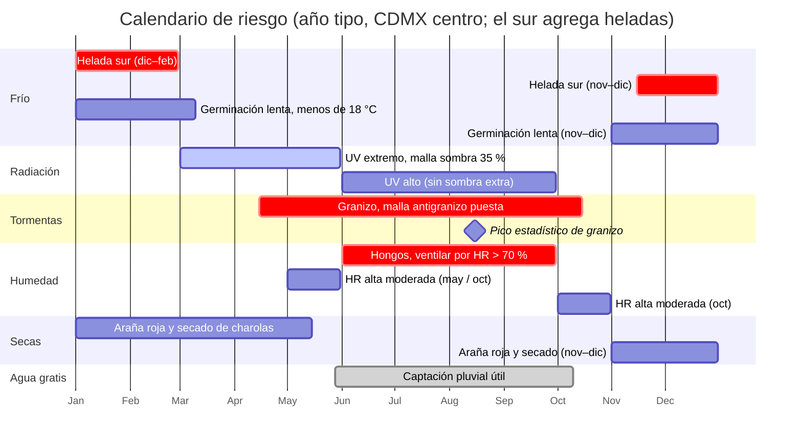

# Clima CDMX para el huerto (2,240 msnm)

**En una línea:** los números duros del clima de la Ciudad de México (normales SMN 1991–2020,
estación Tacubaya) traducidos a decisiones: qué meses germinas sin ayuda, cuándo va la malla
antigranizo y la sombra, dónde sí hiela, cuánta luz hay en invierno y qué automatización importa
más en cada temporada.

!!! info "Cómo usar esta página"
    - Datos **[verificados]** el 12-sep-2026 en las normales climatológicas del SMN y en el estudio de
      granizadas del Instituto de Geografía UNAM; lo demás viene de prensa y guías de proveedores
      (fuentes al final). Precios "aprox." = sin confirmar en ficha.
    - Tacubaya (2,309 msnm) representa el centro-poniente urbano. Si tu patio está en el sur alto
      (Tlalpan, Xochimilco, Milpa Alta), usa la sección de heladas: ahí sí congela.
    - Detalle completo: [research/clima-agronomia](../research/clima-agronomia.md).

## Tabla mensual (SMN Tacubaya 9048, normales 1991–2020) [verificado]

| Mes | Máx (°C) | Mín (°C) | Media (°C) | Lluvia (mm) | Germinación de microgreens (óptimo 18–24 °C) | Riesgo dominante |
|---|---|---|---|---|---|---|
| Ene | 22.2 | 8.3 | 15.3 | 11.9 | Lenta: ciclos +30–50 %; tapete térmico | Frío nocturno, helada en el sur, aire seco |
| Feb | 24.3 | 9.5 | 16.9 | 5.7 | Lenta | Frío, helada en el sur; mes más seco |
| Mar | 26.2 | 11.1 | 18.7 | 11.8 | Sin ayuda | UV extremo empieza; secado de charolas |
| Abr | 27.5 | 13.1 | 20.3 | 24.2 | Sin ayuda | UV 11+; máximas de 27–28 °C; instalar malla antigranizo |
| May | 27.2 | 13.7 | 20.5 | 59.4 | Sin ayuda | Inicio de lluvias (28-may); primeras granizadas |
| Jun | 25.8 | 13.8 | 19.8 | 132.5 | Sin ayuda | HR 70–80 %: hongos; granizo |
| Jul | 24.7 | 13.0 | 18.8 | 174.0 | Sin ayuda | HR alta, hongos, mosca fungosa; granizo |
| Ago | 24.6 | 13.2 | 18.9 | 175.6 | Sin ayuda | **Pico estadístico de granizo**; HR alta |
| Sep | 23.7 | 13.1 | 18.4 | 158.1 | Sin ayuda | HR alta; granizo; tormentas |
| Oct | 23.4 | 11.8 | 17.6 | 71.3 | Sin ayuda (límite) | Fin de lluvias (10-oct); HR baja de golpe |
| Nov | 22.8 | 9.9 | 16.4 | 17.4 | Empieza a alargarse | Cielos despejados; noches frías; sin sombra |
| Dic | 22.4 | 8.4 | 15.4 | 5.0 | Lenta; tapete térmico | Helada en el sur; girasol/chícharo fríos se pudren |
| **Anual** | 24.6 | 11.6 | 18.1 | **846.9** | 8 meses sin ayuda, 4 con tapete | — |

Lectura: de **marzo a octubre** el patio es una cámara de germinación gratis (18–20 °C de media);
de **diciembre a febrero** las noches de 8–9 °C (centro) o 5–6 °C (sur) alargan un ciclo de 8–10
días a 12–16 y suben la pudrición de girasol y chícharo. Con [tapete térmico](https://listado.mercadolibre.com.mx/tapete-termico-germinacion)
(~$250–450 aprox.) + relé del ESP32 armas un "cuarto de germinación" a 22 °C por menos de $1,000
([Germinar en invierno](../guias/germinar-en-invierno.md)).

## Granizo: 2–3 días al año que pueden costar el túnel

- **Estadística dura (Instituto de Geografía UNAM, 1981–2017):** Tacubaya registró 101 días con
  granizo en ~34 años (0.8 % de los días) = **~2–3 días/año en un punto fijo**; temporada activa
  mayo–septiembre; **máximo de frecuencia en agosto** (no en mayo). Prensa local: 5–6 eventos
  severos por temporada ([SciELO](https://www.scielo.org.mx/scielo.php?script=sci_arttext_plus&pid=S0188-46112023000300102&lng=es&tlng=es&nrm=iso) ·
  [Investigaciones Geográficas UNAM](https://www.investigacionesgeograficas.unam.mx/index.php/rig/article/view/60741/54710)).
- **Es hiperlocal y rota por toda la ciudad:** mayo 2026 golpeó Azcapotzalco, Benito Juárez,
  Cuauhtémoc, GAM, Iztacalco, Iztapalapa y V. Carranza ([Heraldo](https://heraldodemexico.com.mx/nacional/2026/5/1/fuerte-granizo-azota-la-cdmx-hoy-de-mayo-lista-de-alcaldias-afectadas-fotos-805469.html));
  septiembre 2026: Coyoacán, Iztapalapa, M. Contreras, Milpa Alta, Tláhuac. El sur-oriente
  montañoso suma tormenta orográfica. **Ninguna alcaldía está a salvo.**
- **Decisión:** malla antigranizo desde Fase 1, **montada 10–20 cm por encima del plástico**,
  instalada **antes de mayo** y **no desmontada antes de octubre**. ~40 m lineales × $40/m
  ([Capi Agrícola, 3.7 m de ancho, verificado](https://www.capiagricola.com.mx/product/malla-antigranizo-negra-3-70-m-x-metro/)) =
  **$1,600** ([`bom/fase1.csv`](bom.md)). Techo a dos aguas con pendiente ≥ 25 % para que el
  granizo escurra: las bolsas de hielo acumulado son la causa #1 de colapso de plástico
  ([Tensar plástico y mallas](../guias/tensar-plastico-y-mallas.md)).

## Heladas: el sur congela, el centro no [verificado]

| Estación SMN (altitud) | Mín. normal dic | ene | feb | Mín. extrema registrada | Zona que representa |
|---|---|---|---|---|---|
| [Tacubaya 9048](https://smn.conagua.gob.mx/tools/RESOURCES/Normales_Climatologicas/Normales9120/df/nor9120_09048.txt) (2,309 msnm) | 8.4 °C | 8.3 °C | 9.5 °C | sin heladas típicas en zona urbana (isla de calor) | Centro, poniente, norte urbano |
| [Tlalpan 9020](https://smn.conagua.gob.mx/tools/RESOURCES/Normales_Climatologicas/Normales9120/df/nor9120_09020.txt) (2,296 msnm) | 6.4 °C | 5.7 °C | 6.4 °C | **−1.0 °C** (dic-1996) | Tlalpan alto, Coyoacán sur, Pedregal |
| [Milpa Alta 9032](https://smn.conagua.gob.mx/tools/RESOURCES/Normales_Climatologicas/Normales9120/df/nor9120_09032.txt) (2,420 msnm) | 5.7 °C | 5.2 °C | 6.3 °C | **−4.0 °C** (ene-2006) | Milpa Alta, Xochimilco alto, Tláhuac sur |

Inviernos recientes lo confirman: febrero 2026, alerta roja con −2 a 0 °C en Milpa Alta, Tlalpan y
Xochimilco ([La Jornada](https://www.jornada.com.mx/noticia/2026/02/23/capital/alerta-por-frio-y-heladas-en-cdmx-cinco-alcaldias-con-temperaturas-bajo-cero));
diciembre 2025, madrugadas de 1–6 °C en alcaldías del sur ([El Financiero](https://www.elfinanciero.com.mx/cdmx/2025/12/17/jueves-helado-para-cdmx-estas-alcaldias-amaneceran-con-frio-de-1-a-6-grados-este-18-de-diciembre/)).

| Si tu patio está en… | Riesgo invernal | Qué hacer |
|---|---|---|
| Centro / norte / poniente urbano | Heladas prácticamente nulas | Solo germinación lenta dic–feb: tapete térmico |
| Tlalpan alto, Xochimilco, Milpa Alta, Tláhuac sur | Heladas ligeras reales dic–feb; **una sola helada mata todo el NFT de albahaca** (daño visible < 12–15 °C) | Cerrar el túnel de noche en invierno; alarma en HA a < 6 °C; masa térmica (2 tambos negros de 200 L dentro del túnel) o calefactor de 500 W en relé para las ~10 noches críticas; depósito NFT dentro del túnel y aislado (agua < 10 °C frena la albahaca) |

Catálogo de estaciones para ubicar la tuya: [SMN estaciones CDMX](https://smn.conagua.gob.mx/tools/RESOURCES/Normales_Climatologicas/catalogo/cat_df.html).

## Radiación UV: +20–25 % que a nivel del mar

- Por altitud la atmósfera filtra menos UV (+10–12 % por cada 1,000 m). De **marzo a septiembre
  el índice UV llega a 11+ ("extremadamente alto")**; la ciudad ha activado alerta púrpura en
  primavera (abril 2025). Horas críticas: **11:00–16:00**
  ([Excélsior](https://www.excelsior.com.mx/nacional/radiacion-extrema-ciudad-mexico-riesgo-uv) ·
  [Infobae](https://www.infobae.com/mexico/2025/04/02/cdmx-activa-alerta-purpura-por-altos-niveles-de-radiacion-uv-asi-puedes-protegerte/)).
  Monitoreo en tiempo real: [Índice UV, Dirección de Monitoreo Atmosférico CDMX](http://www.aire.cdmx.gob.mx/default.php?opc=%27ZaBhnmI%3D&dc=%27aA%3D%3D).
- **Microgreens: nunca sol directo de mediodía** (recalienta la charola, evapora el agua y quema
  hojas tiernas; [guía microgreens.com.mx](https://microgreens.com.mx/como-cultivar-microgreens.html)).
  Luz natural indirecta o LED.
- **Hierbas:** malla sombra **35 %** para hoja y albahaca; 50 % solo plántulas o radiación muy alta;
  no dejar el mismo sombreo fijo todo el año ([guía Hydroenv](https://hydroenv.com.mx/malla-sombra-tipos-porcentajes-usos-y-como-elegir-la-adecuada/)).

| Temporada | Sombreo de hierbas | Microgreens |
|---|---|---|
| Mar–may (secas calientes, UV extremo) | Malla sombra 35 % quitable sobre el túnel: 6 m × $129/m = ~$800 ([Hydroenv, verificado](https://hydroenv.com.mx/producto/malla-sombra-por-metro-al-35-de-3-7-m-de-ancho/)) | Bajo techo / luz indirecta; riego por abajo; nunca charolas al sol |
| Jun–sep | Solo la malla antigranizo (~10–25 % de sombra) + nubosidad; **no** sumar sombra (la albahaca necesita luz para aroma) | Igual |
| Nov–feb | Sin malla sombra: máxima luz posible | Igual |

## Lluvia y humedad: la temporada de hongos (y de agua gratis)

- **Temporada: 28 de mayo al 10 de octubre**; núcleo junio–septiembre con 132–176 mm/mes y 118 días
  de lluvia al año. Patrón: mañana soleada, tormenta vespertina corta e intensa
  ([Weather Spark](https://es.weatherspark.com/y/5674/Clima-promedio-en-Ciudad-de-M%C3%A9xico-M%C3%A9xico-durante-todo-el-a%C3%B1o)).
- **HR en temporada: 70–80 % promedio, picos de ~89 %**; en secas (nov–abr) baja mucho
  ([climate-data.org](https://en.climate-data.org/north-america/mexico/federal-district/mexico-city-1093/) ·
  [PAOT](https://paot.org.mx/centro/libros/mayo02/Rmayo3.pdf)). La albahaca quiere HR 50–70 %; con
  80 %+ nocturno en túnel cerrado, el hongo (Pythium/Fusarium/Rhizoctonia en charolas, botrytis en
  albahaca) está garantizado sin ventilación.
- **Mitigaciones, en orden:** ① ventilación forzada por histéresis de HR > 70 % con el SHT31 (es la
  automatización más importante del proyecto, más que el riego); ② sembrar ~10 % menos denso
  jun–sep; ③ riego solo por abajo; ④ H2O2 entre ciclos y secado al sol; ⑤ tirar la charola con moho
  (telaraña gris, olor fétido) sin dudar y distinguirla de los pelos radiculares blancos normales
  ([Control de plagas](../guias/control-de-plagas.md), [V8 Sanitaria](../validacion/v08-sanitaria.md)).
- **Lado bueno:** 847 mm/año sobre 15–30 m² de techo del túnel son **~8,800–17,500 L/año**
  captables con EC ~0.02–0.06 mS/cm: la fuente premium del NFT
  ([Fase 1 → Agua](../fases/fase-1/agua.md), [research/agua-captacion](../research/agua-captacion.md)).

## Fotoperiodo y lámparas

- Día más corto **10 h 58 min** (21-dic); más largo **13 h 18 min** (21-jun). Latitud 19° N = variación
  moderada; nov–feb es la época **más soleada** por cielos despejados
  ([Weather Spark](https://es.weatherspark.com/y/5674/Clima-promedio-en-Ciudad-de-M%C3%A9xico-M%C3%A9xico-durante-todo-el-a%C3%B1o)).
- Los microgreens no son fotoperiódicos; importa el total de luz: 12–16 h/día con LED a 15–20 cm
  ([microgreens.com.mx](https://microgreens.com.mx/como-cultivar-microgreens.html)).
- **Fase 0 sin lámparas es viable** con buena luz indirecta. **Fase 1** (25–35 charolas/semana en rack
  de 4 niveles): 2 tubos T8 18 W 6500K por nivel = 8 tubos ≈ $968
  ([JWJ Light $121 c/u, verificado](https://jwjlight.mx/producto/tubo-led-t8-18w-120-cm/)) + canaletas y
  cable ~$400; encendidos 12–14 h con el relé del ESP32; consumo ~1.9 kWh/día ≈ $60–90/mes. **No
  pagar "grow lights"** para un cultivo de 10 días; el 6500K estándar rinde igual.
- Albahaca (Fase 2): germina a 21–27 °C; en CDMX nunca hay óptimo nocturno natural (mínimas < 15 °C),
  por eso va en túnel cerrado de noche con NFT templado; semillero invernal solo con tapete térmico
  ([guía Hydroenv albahaca](https://hydroenv.com.mx/guia-completa-para-el-cultivo-de-la-albahaca-ocimum-basilicum/) ·
  [drygair](https://drygair.com/es/blog-es/albahaca-invernadero/)). Variedad principal del NFT:
  **Nufar F1**, resistente a *Fusarium oxysporum* ([Corona Seeds](https://coronaseeds.com/seeds/basil-nufar/)).

## Plagas por temporada

| Plaga | Cuándo | Señal | Control de bajo impacto |
|---|---|---|---|
| Pulgón (albahaca) | Primavera y todo el año en brotes tiernos | Hojas deformes, melaza | Jabón potásico 10–15 ml/L al envés, 2–3 aplicaciones cada 5 días ([Soluciones Naturales Pro $250/kg, verificado](https://solucionesnaturalespro.com.mx/product/jabon-potasico/)) |
| Mosca fungosa (*Bradysia*) | Jun–sep, sustrato de coco siempre húmedo | Adultos en trampas amarillas; larvas en sustrato | Dejar secar superficie entre riegos + Gnatrol DG (Bti) 8–16 g/m² × 3 semanas; **comprarlo antes de la primera temporada de lluvias** ([ficha Valent](http://www.valent.mx/productos/insecticidas/gnatrol)) |
| Fusarium / damping-off | Jun–sep (HR alta) y charolas frías dic–feb | Cuello podrido, moho gris con olor | Ventilar, densidad −10 %, H2O2 en charolas y líneas, tirar charola, Nufar en NFT |
| Araña roja | Secas calientes mar–may (HR baja) | Punteado y telaraña fina en albahaca | Jabón potásico; subir HR moderadamente |
| Monitoreo permanente | Todo el año | — | Trampas amarillas pegajosas, 1 por rack (~$150, [ML](https://listado.mercadolibre.com.mx/trampas-amarillas-pegajosas)); libro descargable de la [FES Zaragoza UNAM](https://www.zaragoza.unam.mx/plagas-control-huertos-urbanos-cdmx/) |

## Calendario de riesgo anual

Versión en tabla (■ = riesgo; más cuadros = más riesgo), tomada del informe:

| Riesgo | E | F | M | A | M | J | J | A | S | O | N | D |
|---|---|---|---|---|---|---|---|---|---|---|---|---|
| Helada (sur CDMX) | ■■ | ■■ | · | | | | | | | | ■ | ■■ |
| Germinación lenta (< 18 °C) | ■■ | ■■ | ■ | | | | | | | | ■ | ■■ |
| UV extremo (malla 35 %) | | | ■■ | ■■ | ■■ | ■ | ■ | ■ | ■ | | | |
| Granizo (malla antigranizo) | | | | ■ | ■■ | ■■ | ■■ | ■■■ | ■■ | ■ | | |
| Hongos / HR alta (ventilar) | | | | | ■ | ■■ | ■■■ | ■■■ | ■■■ | ■■ | | |
| Araña roja / secado (HR baja) | ■ | ■ | ■■ | ■■ | ■ | | | | | | ■ | ■ |

## Qué hacer cada mes (calendario operativo)

| Mes | Acciones de clima |
|---|---|
| Ene | Tapete térmico en germinación; sin malla sombra; en el sur: túnel cerrado de noche y alarma < 6 °C; vigilar araña roja; **aplicar a Cosecha de Lluvia** (convocatoria ene–feb) |
| Feb | Igual que enero; convocatoria de la Escuela de Huertos Urbanos (~febrero); mes más seco: revisar nivel del tinaco |
| Mar | Montar malla sombra 35 % sobre las hierbas; charolas fuera del sol de mediodía; riego por abajo por el secado |
| Abr | **Instalar o revisar la malla antigranizo** (antes de mayo); comprar Gnatrol antes de las lluvias; máximas de 27–28 °C: ventilar el túnel de día |
| May | Inicio de lluvias (28-may): purga de primeras lluvias lista, filtro de hojas limpio; trampas amarillas nuevas; quitar malla sombra al cierre del mes |
| Jun | Activar ventilación por HR > 70 %; sembrar ~10 % menos denso; solo riego por abajo; inspección diaria de moho |
| Jul | Igual; captación pluvial al máximo (174 mm); revisar tensión del plástico tras cada tormenta |
| Ago | **Pico de granizo: no desmontar la malla**; HR máxima; forzar ventilación 10 min/h |
| Sep | Igual que agosto; tormentas y alertas SGIRPC; revisar anclajes |
| Oct | Fin de lluvias (10-oct); HR cae: volver a densidad normal; cambiar solución NFT y limpiar depósito tras la temporada |
| Nov | Máxima luz natural, sin sombra; noches frías: empezar tapete térmico en el sur; preparar colchón de caja para enero |
| Dic | Heladas en el sur (cerrar túnel de noche); germinación lenta; cuesta de enero de restaurantes: sembrar menos las últimas dos semanas |

## Implicaciones de diseño por fase

| Fase | Decisión que sale del clima | Página |
|---|---|---|
| 0 | Rack bajo techo con luz indirecta, sin lámparas; tapete térmico solo si arrancas dic–feb | [Fase 0 → Montaje](../fases/fase-0/montaje.md) |
| 1 | Malla antigranizo 10–20 cm sobre el plástico cal. 720 blanco lechoso 25 % sombra; techo a dos aguas ≥ 25 %; canaleta al tinaco desde el día 1; T8 6500K; SHT31 + ventilador por histéresis de HR | [Fase 1 → Túnel](../fases/fase-1/tunel.md) · [Automatización v1](../fases/fase-1/automatizacion-v1.md) |
| 2 | Túnel cerrado de noche en invierno; depósito NFT a la sombra y aislado (solución 18–22 °C); Nufar contra fusarium; malla sombra 35 % solo mar–may; en el sur, masa térmica o calefactor en relé | [Fase 2 → NFT](../fases/fase-2/nft.md) |
| Todas | Riego por abajo, H2O2 entre ciclos, trampas amarillas, Bti antes de lluvias | [Control de plagas](../guias/control-de-plagas.md) |

## Fuentes

- Normales SMN 1991–2020: [Tacubaya 9048](https://smn.conagua.gob.mx/tools/RESOURCES/Normales_Climatologicas/Normales9120/df/nor9120_09048.txt) ·
  [Tlalpan 9020](https://smn.conagua.gob.mx/tools/RESOURCES/Normales_Climatologicas/Normales9120/df/nor9120_09020.txt) ·
  [Milpa Alta 9032](https://smn.conagua.gob.mx/tools/RESOURCES/Normales_Climatologicas/Normales9120/df/nor9120_09032.txt)
- Granizo: [SciELO / Investigaciones Geográficas UNAM](https://www.scielo.org.mx/scielo.php?script=sci_arttext_plus&pid=S0188-46112023000300102&lng=es&tlng=es&nrm=iso)
- [research/clima-agronomia](../research/clima-agronomia.md) · [02-restricciones-y-requisitos §1](02-restricciones-y-requisitos.md) ·
  [research/agua-captacion](../research/agua-captacion.md) · [research/estructura-invernadero](../research/estructura-invernadero.md)
