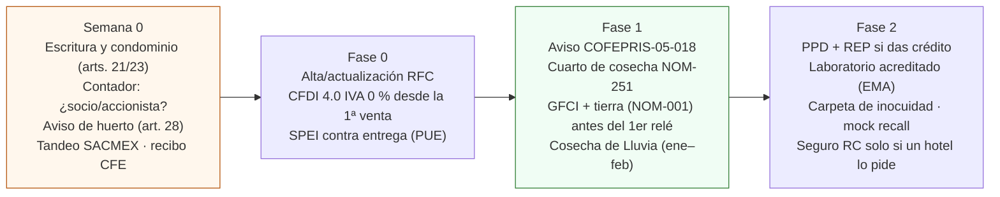
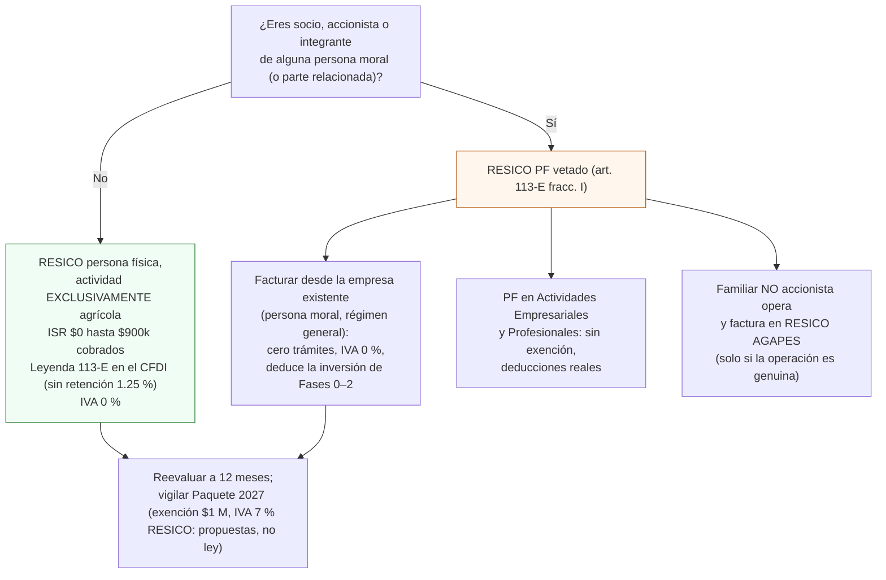

# Normativa, trámites y apoyos (CDMX 2026)

**En una línea:** todo lo que la ley te pide, te recomienda o te regala para producir microgreens y
hierbas en un patio de CDMX y venderlos a restaurantes con factura: qué es obligatorio, cuándo se
hace, cuánto cuesta y el enlace oficial; la carga real es casi cero si vendes producto fresco no
transformado, B2B, sin local abierto al público.

!!! info "Cómo leer esta página"
    - **Obligatorio** = la ley lo exige para operar o facturar. **Recomendado** = no es requisito, pero
      abre clientes (hoteles, cadenas) o te protege. **No aplica** = te lo van a querer vender; no lo
      compres.
    - Verificado el 12-sep-2026 contra textos oficiales (LISR, LIVA, CFF, DOF, PAOT) y portales gob.mx.
      Los números de regla de la RMF cambian cada año: lo marcado [POR VERIFICAR] se confirma con tu
      contador antes de la primera factura.
    - No es asesoría legal ni fiscal. Fuentes completas:
      [research/normativa-fiscal](../research/normativa-fiscal.md), [research/cobranza-b2b](../research/cobranza-b2b.md),
      [research/inocuidad-operativa](../research/inocuidad-operativa.md), [research/electrico-respaldo-seguridad](../research/electrico-respaldo-seguridad.md).

## Cuándo se hace cada trámite

## Tabla maestra

| Qué | Fundamento | ¿Obligatorio? | Cuándo | Costo (MXN) | Enlace oficial | Guía interna |
|---|---|---|---|---|---|---|
| **Régimen fiscal RESICO persona física con actividad agrícola (AGAPES)** | Art. 113-E LISR, noveno párrafo: ISR $0 hasta $900,000/año efectivamente cobrados; tasas 1.00–2.50 % solo sobre el excedente hasta $3.5 M | Decisión obligatoria antes de la primera factura; el régimen es el más favorable del sistema | Semana 0 | $0 (honorarios del contador aparte) | [LISR (PDF Cámara de Diputados)](https://www.diputados.gob.mx/LeyesBiblio/pdf/LISR.pdf) · [ResicoCalc AGAPES 2026](https://resicocalc.com/blog/resico-para-agapes-actividades-primarias) | [Antes de gastar un peso §2](../empieza-aqui/antes-de-gastar-un-peso.md) |
| **Candado: socio o accionista de persona moral** | Art. 113-E fracc. I LISR: excluye del RESICO PF a socios, accionistas o integrantes de personas morales y partes relacionadas (art. 90) | Obligatorio verificarlo: facturar en RESICO siendo accionista es la única contingencia fiscal cara de este negocio | Semana 0 | $0 | [IDC: socio o accionista en RESICO](https://idconline.mx/fiscal-contable/2021/12/13/socio-o-accionista-de-persona-moral-puede-tributar-en-el-resico) · [IDC 2025](https://idconline.mx/fiscal-contable/2025/05/20/personas-fisicas-pueden-entrar-al-resico-tras-ser-socios) | [Facturar CFDI](../guias/facturar-cfdi.md) |
| **Actividad agrícola = microgreens y hierbas frescas** | Art. 16 fracc. III CFF: siembra, cultivo, cosecha y primera enajenación sin transformación industrial (cortar, lavar y empacar en fresco no transforma; deshidratar o marinar sí) | Define el régimen y la tasa 0 % | Permanente | — | [CFF (PDF)](https://www.diputados.gob.mx/LeyesBiblio/pdf/CFF.pdf) | [08-recetas](08-recetas-y-economia-unitaria.md) |
| **CFDI 4.0 con IVA tasa 0 %** | Art. 2-A fracc. I inciso a) LIVA: vegetales no industrializados (cortados, frescos, refrigerados o empacados siguen sin industrializar). Tasa 0 % ≠ exento: acreditas IVA de insumos | **Obligatorio** desde la primera venta | Fase 0 | $0 + facturador | [LIVA (PDF)](https://www.diputados.gob.mx/LeyesBiblio/pdf/LIVA.pdf) · [SAT art. 2-A](https://wwwmatnp.sat.gob.mx/articulo/06071/articulo-2-a) · [catálogo c_ClaveProdServ](https://wwwmat.sat.gob.mx/consultas/53693/catalogo-de-productos-y-servicios) | [Facturar CFDI](../guias/facturar-cfdi.md) |
| Claves y unidades del CFDI | `50404100` hierbas frescas · `50171548` hierbas frescas · unidad `KGM` (corte) o `H87` (pieza/charola) | Obligatorio elegir una clave válida | Fase 0 | $0 | [buscador Anexo 20 (gncys)](http://www.gncys.com/Anexo20/claveprodserv?q=hierbas) | [Facturar CFDI](../guias/facturar-cfdi.md) |
| **Retención 1.25 % de ISR por personas morales** | Art. 113-J LISR: el restaurante persona moral retiene 1.25 % a un RESICO PF, **salvo** leyenda de exención del art. 113-E noveno párrafo en el CFDI (regla 3.13.26 RMF 2026 [POR VERIFICAR: número vigente; en RMF 2022 era 3.13.33]) | Obligatorio configurar la leyenda si eres AGAPES exento | Fase 0, en la plantilla del facturador | $0 | [IDC: excepción de retención AGAPES](https://idconline.mx/fiscal-contable/2022/04/26/excepcion-de-retencion-a-resicos-pf-agapes) | [Facturar CFDI](../guias/facturar-cfdi.md) |
| **PUE / PPD y complemento de pago (REP)** | Art. 29-A CFF; regla 2.7.1.32 RMF 2026 (DOF 28-dic-2025): PUE si te pagan en el mes de emisión; crédito que cruza de mes = PPD + REP **a más tardar el día 5 natural del mes siguiente** al cobro; sin prórroga en 2026. Multa por no emitir REP: $22,300–127,530 por comprobante (art. 83 fracc. VII CFF) | **Obligatorio** en cuanto das crédito | Fase 1 tardía / Fase 2 | $0 (30 min al mes: un REP agrupado por cliente) | [Grupo CerVel: complemento de pago](https://grupocervel.com/blog/complemento-de-pago) · [Tesio: sin prórroga 2026](https://tesio.com.mx/blog/prorroga-complemento-pago-2026/) · [SenHub](https://senhub.mx/blog/que-es-complemento-de-pago) | [Cobrar y suspender](../guias/cobrar-y-suspender.md) |
| Declaraciones en RESICO AGAPES | Con ingresos ≤ $900k y CFDI bien emitidos, la RMF releva de declaraciones mensuales y anual [POR VERIFICAR: regla exacta con el contador] | Facilidad, no obligación | Permanente | $0 | [ResicoCalc](https://resicocalc.com/blog/resico-para-agapes-actividades-primarias) | — |
| **Aviso de huerto urbano a la alcaldía** | Arts. 24 y 28, Ley de Huertos Urbanos CDMX (+ Reglamento 2023): derecho a instalar un huerto en propiedad o legítima posesión; aviso simple de notificación [POR VERIFICAR: numeración vigente tras reformas] | Aviso simple; recomendado presentarlo y guardar el acuse | Semana 0 | $0 | [Ley (PAOT)](https://paot.org.mx/centro/leyes-normas-htmls/ley-de-huertos-2382.html) · [Reglamento 2023 (PDF PAOT)](https://paot.org.mx/centro/reglamentos/df/pdf/2023/RGTO_LEY_HUERTOS_CDMX_14_04_2023.pdf) | [Aviso COFEPRIS y huerto](../guias/aviso-cofepris.md) |
| **Ley de Propiedad en Condominio, arts. 21 y 23** | Art. 21: prohibido destinar la unidad a usos distintos de la Escritura Constitutiva o afectar la tranquilidad; art. 23: azoteas de uso general son propiedad común (túnel en área común = acuerdo de asamblea) | Obligatorio revisarlo **antes** de invertir en Fase 1 si el patio es condominio | Semana 0 | $0 | [Texto vigente (Justia)](https://mexico.justia.com/estados/df/leyes/ley-de-propiedad-en-condominio-de-inmuebles-para-el-distrito-federal/) | [Antes de gastar un peso §1](../empieza-aqui/antes-de-gastar-un-peso.md) |
| Uso de suelo (SEDUVI) y SIAPEM | Sin local abierto al público no eres establecimiento mercantil: **no** requiere aviso SIAPEM ni certificado de uso de suelo. Solo si pones mostrador: aviso de giro de bajo impacto en línea (~10 min) | No aplica sin mostrador | Solo si abres venta directa | $0 el aviso; certificado de zonificación ~$1,500–2,000 aprox. vía gestores [POR VERIFICAR] | [SIAPEM](https://siapem.cdmx.gob.mx/) · [SEDECO](https://www.sedeco.cdmx.gob.mx/tramites/sistema-electronico-de-avisos-y-permisos-de-establecimientos-mercantiles-siapem) | [Antes de gastar un peso §1](../empieza-aqui/antes-de-gastar-un-peso.md) |
| **Aviso de Funcionamiento COFEPRIS-05-018** | Arts. 200 y 200 bis Ley General de Salud: gratuito, en línea (DIGIPRiS), es aviso (no permiso), no caduca. Zona gris: la producción primaria no lo requiere; cortar, lavar y empacar de forma habitual sí encaja en giros avisables | **Recomendado** (conservador) al empezar a cortar y empacar | Inicio de Fase 1 | $0 | [COFEPRIS: avisos de funcionamiento](https://www.gob.mx/cofepris/acciones-y-programas/aviso-de-funcionamiento-de-responsable-sanitario-y-de-modificacion-o-baja) · [guía BPack](https://bpack.mx/blog/aviso-funcionamiento-cofepris-alimentos) | [Aviso COFEPRIS](../guias/aviso-cofepris.md) |
| Licencia sanitaria / registro sanitario de producto | No existen para vegetales frescos sin procesar | **No aplica** | — | — | [COFEPRIS](https://www.gob.mx/cofepris/acciones-y-programas/aviso-de-funcionamiento-de-responsable-sanitario-y-de-modificacion-o-baja) | — |
| **NOM-251-SSA1-2009** (prácticas de higiene en el proceso de alimentos) | Obligatoria para quien procesa/vende alimentos; es la vara con la que un verificador mide tu cuarto de corte y empaque (superficies lavables, lavamanos, control de fauna, 1–4 °C, bitácoras ≥ 12 meses) | **Obligatoria** si empacas; guía de diseño del cuarto de cosecha | Fase 1 | $0 (cumplimiento con mesa inox/polietileno, lavamanos, bitácora) | [Texto DOF](https://dof.gob.mx/normasOficiales/3980/salud/salud.htm) · [SIDOF](https://sidof.segob.gob.mx/notas/5133449) | [Cosechar y empacar](../guias/cosechar-y-empacar.md) |
| **NOM-051-SCFI/SSA1-2010** (etiquetado) | Aplica a alimentos **preenvasados** destinados al **consumidor**; excluye textualmente productos a granel y envasados en punto de venta. B2B a restaurantes = insumo, no aplica; charola viva = planta | **No aplica en B2B**; sí si vendes clamshells cerrados a retail (entonces también NOM-030 contenido neto) | Solo en retail | — | [Texto DOF NOM-051](https://dof.gob.mx/normasOficiales/4010/seeco11_C/seeco11_C.htm) | [Cosechar y empacar](../guias/cosechar-y-empacar.md) |
| Etiqueta comercial simple (marca, variedad, fecha de cosecha, lote, contacto, "enjuagar antes de consumir") | Práctica de mercado; los chefs y auditorías de cadenas la piden | Recomendada desde la primera entrega | Fase 0 | ~$400–800 aprox. por tiraje de 200–500 | — | [Mock recall](../guias/mock-recall.md) |
| SENASICA: SRRC / BPA / BUMA | Esquemas **voluntarios** de certificación de inocuidad agrícola; los manuales BPA gratuitos son la plantilla de tu bitácora | No obligatorio; usar los manuales como guion | Fase 1 | Manuales $0; certificación no la amerita tu escala | [Manuales BPA SENASICA](https://www.gob.mx/senasica/documentos/manuales-buenas-practicas-agricolas) · [Certificación SRRC](https://www.gob.mx/senasica/documentos/procedimiento-de-certificacion-en-sistemas-de-reduccion-de-riesgos-de-contaminacion) | [Sanitizar semilla](../guias/sanitizar-semilla.md) |
| Sanitización de semilla (girasol y chícharo) | Marco de referencia FDA (semilla para germinar; 21 CFR 112 Subparte M exige "tratamiento científicamente válido") | Buena práctica no obligatoria en México; **imprescindible** para el riesgo real (remojo tibio = incubadora de Salmonella/E. coli) | Cada lote | ~$60 (agua oxigenada 3 %) o ~$250 (hipoclorito de calcio 65 %) | [FDA: guía semilla para germinar 2022](https://www.fda.gov/regulatory-information/search-fda-guidance-documents/guidance-industry-reducing-microbial-food-safety-hazards-production-seed-sprouting) · [Sprout Safety Alliance](https://www.iit.edu/ssa) | [Sanitizar semilla](../guias/sanitizar-semilla.md) |
| Análisis microbiológico de agua y producto | Sin norma que te lo exija; lo pide el área de compras de hoteles (antigüedad < 6 meses, laboratorio con EMA / Tercero Autorizado COFEPRIS) | Recomendado desde 2 clientes fijos | Fase 1 | LANISAF $542–607/muestra (verificado); Quibimex cotizar; ~$6,000–10,000/año | [LANISAF](https://lanisaf.chapingo.mx/) · [Quibimex](https://laboratorioquibimex.com/) · [padrón EMA](https://www.ema.org.mx/portal_v3/) | [V8 Sanitaria](../validacion/v08-sanitaria.md) |
| Curso "Control sanitario de frutas y hortalizas frescas" (COFEPRIS) y Manejo Higiénico de Alimentos | Capacitación; el estándar del Distintivo H exige evidencia de capacitación del proveedor | Recomendado | Fase 1 | $0 el de COFEPRIS; el de manejo higiénico [POR VERIFICAR: proveedor y costo] | [curso COFEPRIS](https://cursos.aprende.gob.mx/courses/course-v1:COFEPRIS+CSDF26041X+2026_04/about) | [Cursos](../aprendizaje/cursos.md) |
| Distintivo H (NMX-F-605-NORMEX-2018) | Certificación del **restaurante/hotel**, no tuya; su lista de verificación obliga al cliente a controlar proveedores: te pedirán análisis, bitácoras, aviso COFEPRIS y visita | Es del cliente; prepara la carpeta de inocuidad | Fase 2 | $0 preparar carpeta | [NORMEX inocuidad](https://www.normex.com.mx/inocuidad.php) | [Mock recall](../guias/mock-recall.md) |
| **NOM-001-SEDE-2012** (instalaciones eléctricas) | Patio = "lugar mojado": contactos exteriores con GFCI (~5 mA), tapa intemperie tipo "in-use", equipo en gabinete IP65, puesta a tierra con electrodo (varilla 5/8"×3 m) y resistencia ≤ 25 Ω [POR VERIFICAR: numeración exacta de artículos 210-8, 406, 110-11, 250] | Formalmente vía UVIE en obra nueva/comercial; en tu casa nadie inspecciona, **se cumple porque evita electrocutar a alguien** | Antes del primer relé en el patio (Fase 1) | Breaker GFCI QO120GFI $1,159 o contacto GFCI $389; tapa ~$249; varilla + cable ~$400–800; electricista ~$1,500–3,500 | [Texto DOF NOM-001-SEDE-2012](https://dof.gob.mx/nota_detalle.php?codigo=5280607&fecha=29/11/2012) · [Programa Casa Segura](https://programacasasegura.org) | [Instalar GFCI y tierra](../guias/instalar-gfci-y-tierra.md) |
| Tarifa CFE 1 → DAC | Promedio móvil de 12 meses > 250 kWh/mes reclasifica a DAC (~$6.63/kWh región Central + cargo fijo ~$145/mes vs ~$1.125/kWh subsidiado) | No es trámite: es restricción de diseño (bomba 12 V de 40–60 W, no periférica 0.5 HP) | Semana 0 medir; alarma en HA a 220 kWh | Medidor Steren HER-432 $336.40 | [CFE tarifa 1](https://app.cfe.mx/Aplicaciones/CCFE/Tarifas/TarifasCRECasa/Tarifas/Tarifa1.aspx) · [CFE DAC](https://app.cfe.mx/Aplicaciones/CCFE/Tarifas/TarifasCRECasa/Tarifas/TarifaDAC.aspx) | [Antes de gastar un peso §3](../empieza-aqui/antes-de-gastar-un-peso.md) |
| Contrato PDBT (negocio) separado con CFE | Sin subsidio (~$4–5.5/kWh aprox. [POR VERIFICAR: tarifa 2026]) pero sin castigo DAC y deducible | Solo si escalas con LED (> 250 kWh/mes) | Fase 3 / escalamiento | Trámite CFE [POR VERIFICAR: costo y requisitos] | [CFE tarifas](https://app.cfe.mx/Aplicaciones/CCFE/Tarifas/TarifasCRECasa/Tarifas/Tarifa1.aspx) | [07 §14](07-puntos-ciegos-y-riesgos.md) |
| Ruido (NADF-005-AMBT-2013) | Límites del orden de 65 dB(A) día / 62 dB(A) noche en colindancia [POR VERIFICAR: valores vigentes] | Riesgo bajo: bombas 12 V, peristálticas y ventiladores son silenciosos; bomba sobre hule | Permanente | $0 | [POR VERIFICAR: texto oficial en Gaceta CDMX] | [07 §9](07-puntos-ciegos-y-riesgos.md) |
| Agua: captación pluvial doméstica | Legal, promovida y subsidiada por el gobierno de la ciudad; no hay pago de derechos por cosechar lluvia de tu techo. Un pozo sí requeriría concesión CONAGUA (no aplica) | Sin trámite | Fase 1 | DIY ~$1,200–1,800; Paquete Básico Tláloc $5,300 | [lineamientos captación pluvial (gob.mx PDF)](https://www.gob.mx/cms/uploads/attachment/file/152776/LINEAMIENTOS_CAPTACI_N_PLUVIAL.pdf) | [Instalar canaleta y captación](../guias/instalar-canaleta-y-captacion.md) |
| **Programa Cosecha de Lluvia (SEDEMA)** | Instala sistemas de captación (tlaloque + filtros + tinaco/cisterna) gratis o con subsidio parcial en alcaldías y colonias elegibles (histórico: Iztacalco, Iztapalapa, Tláhuac, Tlalpan, V. Carranza, Xochimilco y otras). Requisitos: mayor de edad, CURP, INE, comprobante ≤ 3 meses, predial u opinión de uso de suelo, carta compromiso, pláticas y visitas técnicas | Apoyo: aplica si tu colonia califica | Convocatoria **enero–febrero** | $0 (sistema de ~$20k) | [Programa](https://www.sedema.cdmx.gob.mx/programas/programa/cosecha-de-lluvia) · [portal](https://cosechalluvia.sedema.cdmx.gob.mx/) · [reglas de operación (PDF)](https://www.sedema.cdmx.gob.mx/storage/app/media/DGCPCA/gacetareglas-de-operacion-del-programacosecha-de-lluvia.pdf) · programascall@sedema.cdmx.gob.mx | [Aplicar a Cosecha de Lluvia](../guias/aplicar-cosecha-de-lluvia.md) |
| Tandeo (SACMEX) | ~10 alcaldías / 284 colonias con tandeo formal 2025–2026; consulta horarios por colonia | No es trámite: define el tamaño del tinaco (750 vs 1,100 L) | Semana 0 | $0 | [Agua en tu Colonia (SACMEX)](https://aguaentucolonia.sacmex.cdmx.gob.mx) | [Fase 1 → Agua](../fases/fase-1/agua.md) |
| Altépetl Bienestar 2026 (SEDEMA/DGCORENADR) | Reglas de operación GOCDMX 30-ene-2026: solo habitantes del **Suelo de Conservación** en 9 alcaldías; sin componente de agricultura urbana en patios | **No aplica** | — | — | [Reglas 2026 (PDF GOCDMX)](https://proyectos.sedema.cdmx.gob.mx/datos/storage/app/media/gacetas/GOCDMX_26-01-30_DGCORENADR.pdf) · [página SEDEMA](https://sedema.cdmx.gob.mx/programas/programa/altepetl) | — |
| Capacitación gratuita (Ley de Huertos Urbanos) y Escuela de Huertos Urbanos SEDEMA | Derecho a capacitación de la alcaldía y asesoría de SEDEMA; seminario-taller de 48 h con certificado oficial (cupo 40, registro ~febrero–marzo) | Apoyo opcional; networking con la escena huertera CDMX | Convocatoria ~febrero | $0 | [convocatoria Escuela de Huertos Urbanos](https://www.sedema.cdmx.gob.mx/comunicacion/nota/sedema-lanza-convocatoria-para-el-seminario-taller-escuela-de-huertos-urbanos) · [nota SEDEMA huertos](https://www.sedema.cdmx.gob.mx/comunicacion/nota/avanza-instalacion-de-huertos-urbanos-en-unidades-habitacionales-de-la-ciudad-de-mexico) | [Cursos](../aprendizaje/cursos.md) |
| SADER Producción para el Bienestar | Cultivos prioritarios y padrón rural | **No aplica** | — | — | citado en reglas Altépetl | — |
| Seguro de responsabilidad civil de producto | No obligatorio; lo piden cadenas, hoteles y comedores corporativos en su alta de proveedor. GNP RC PyMEs lo incluye (modalidad Automático: ventas ≤ $25 M, SA hasta $1.5 M); GMX como adicional (< 5 % de la póliza) | Recomendado solo con cliente corporativo | Fase 2 | ~$3,000–8,000/año aprox. (cotizar; presupuestar ≤ $500/mes) | [GNP RC PyMEs](https://www.gnp.com.mx/seguro-de-danos-empresarial-de-responsabilidad-civil-pymes) · [GMX](https://www.gmx.com.mx/blog-gmx/proteger-tu-pyme-con-un-seguro-de-responsabilidad-civil-es-de-ley.html) | [Fase 2 → Clientes y cobranza](../fases/fase-2/clientes-y-cobranza.md) |
| Seguro de casa-habitación | El uso comercial no declarado puede excluir o rescindir la cobertura: declarar "agricultura urbana comercial en el domicilio" | Recomendado si ya tienes póliza | Semana 0 | $0 avisar | — | [07 §11](07-puntos-ciegos-y-riesgos.md) |
| Acuerdo de suministro de 1 página + remisión firmada + pagaré | Código de Comercio supletorio (sin pacto, moratorios de 6 % anual); pagaré = título ejecutivo (LGTOC) → juicio ejecutivo mercantil. La remisión firmada es la prueba de entrega | Recomendado: firmar con el administrador al pasar 3 semanas de compras; remisión en **cada** entrega | Fase 0–1 | $0 (machotes gratuitos) | [Milformatos: contrato de suministro](https://milformatos.com/contratos/contrato-de-suministro/) · [pagaré](https://milformatos.com/empresas-y-negocios/el-pagare/) · [UPLAW](https://www.uplaw.com.mx/post/qué-puede-hacer-una-pyme-cuando-sus-clientes-no-le-pagan) | [Cobrar y suspender](../guias/cobrar-y-suspender.md) |
| Separación de residuos orgánicos (sustrato usado) | En CDMX la separación de orgánicos es obligatoria [POR VERIFICAR: norma y fracción exacta]; 100–150 kg/mes de coco con raíces | Obligatoria como residuo; composta propia o huertos comunitarios | Fase 1 | $0 | [POR VERIFICAR: norma ambiental de residuos sólidos CDMX] | [07 §12](07-puntos-ciegos-y-riesgos.md) |
| Importación de semilla (brassicas a precio internacional) | Requiere permiso fitosanitario SENASICA y mínimos de compra | Solo en Fase 2+ como palanca de margen | Fase 2+ | [POR VERIFICAR: costo del permiso] | [SENASICA productos vegetales](https://www.gob.mx/senasica/acciones-y-programas/alimentos-de-origen-agricola) | [08-recetas](08-recetas-y-economia-unitaria.md) |
| Catálogo de proveedores CANIRAC | Registro como proveedor ante la cámara restaurantera | Opcional; costo y proceso no publicados | Fase 2 | [POR VERIFICAR: llama a CANIRAC y pregunta cuota anual y requisitos de alta como proveedor; anota fecha y con quién hablaste] | [portal CANIRAC](https://portal.canirac.org.mx/catalogo-proveedores/) | [Visitar a un chef](../guias/visitar-a-un-chef.md) |

## Fiscal: el árbol de decisión

Reglas de facturación que no cambian con la rama elegida: IVA **tasa 0 %** (no "exento"), clave
`50404100`, unidad `KGM` o `H87`, uso de CFDI del cliente `G01` o `G03`, **PUE** solo si te pagan el
mismo mes, **PPD + REP mensual agrupado los días 1–5** para cualquier crédito que cruce de mes. En
RESICO el ISR se causa sobre lo **cobrado**: una factura PPD no cobrada no es ingreso. Detalle y
política de cobro por fase en [research/cobranza-b2b §2–3](../research/cobranza-b2b.md).

!!! danger "El único error fiscal caro"
    Facturar como persona física en RESICO siendo accionista de una persona moral. Todo lo demás de
    esta página (aviso COFEPRIS, BPA, laboratorio, seguro) son inversiones de credibilidad comercial,
    no requisitos.

## Sanitario en tres frases

1. **No existe licencia sanitaria ni registro para vegetales frescos.** Lo único plausible es el
   Aviso de Funcionamiento COFEPRIS-05-018 ($0, en línea, sin aprobación) cuando cortas y empacas
   de forma habitual ([Aviso COFEPRIS](../guias/aviso-cofepris.md)).
2. **La NOM-251 es la vara del cuarto de cosecha** (zona de corte separada, mesa inox o polietileno,
   lavamanos, 1–4 °C, bitácoras ≥ 12 meses) y la NOM-051 no aplica en B2B
   ([Cosechar y empacar](../guias/cosechar-y-empacar.md)).
3. **Tu "seguro" real es la inocuidad documentada:** semilla sanitizada (girasol y chícharo siempre),
   charolas con H2O2, lote `VAR-AAMMDD-Slote-pos` en cada charola y etiqueta, análisis de laboratorio
   acreditado y un simulacro de retiro al año ([Sanitizar semilla](../guias/sanitizar-semilla.md),
   [Mock recall](../guias/mock-recall.md)). Los microgreens se cortan sobre el sustrato: riesgo menor
   que los germinados; no vendas germinados de alfalfa/soya sin protocolo serio.

## Paquete documental que pide un hotel o cadena (Fase 2)

PDF único de 8–10 páginas, en este orden: constancia de situación fiscal · acuse del aviso COFEPRIS ·
resultados de laboratorio (< 6 meses, lab con EMA o Tercero Autorizado) · ficha técnica por producto ·
carta de garantía de inocuidad + sistema de lotes y política de retiro · constancias de capacitación ·
(si lo exigen) póliza RC de producto y alta como proveedor con 30 días de crédito y contrato. Fuente:
[research/inocuidad-operativa §6](../research/inocuidad-operativa.md).

## Lo que NO necesitas (y te van a querer vender)

| Te ofrecen | Por qué no |
|---|---|
| "Licencia sanitaria" o gestor para COFEPRIS | No existe para vegetales frescos; el aviso es gratis y en línea |
| Aviso SIAPEM / certificado de uso de suelo | Sin mostrador no eres establecimiento mercantil |
| Certificación SRRC/BPA/PrimusGFS/GLOBALG.A.P. | Voluntarias; solo retail o exportación las exigen |
| Etiquetado NOM-051 con sellos y tabla nutrimental | No aplica a insumo B2B; un vegetal fresco sin aditivos ni siquiera genera sellos |
| Seguro RC "obligatorio" | No lo es; solo cuando un corporativo lo pida |
| Programa Altépetl / SADER | No cubren patios urbanos |
| Concesión CONAGUA | Solo para pozos; la lluvia de tu techo es libre |

## Pendientes de verificación humana

- Número vigente en RMF 2026 de la regla de excepción de retención 1.25 % (¿3.13.26?) y de la
  facilidad de no presentar declaraciones < $900k: confirmar con contador.
- Texto literal vigente de los arts. 24 y 28 de la Ley de Huertos Urbanos y el formato de aviso en
  tu alcaldía.
- Criterio oficial COFEPRIS sobre si el empacado casero de vegetales frescos exige el aviso 05-018.
- Alcaldías y colonias elegibles en la convocatoria 2027 de Cosecha de Lluvia.
- Límites exactos de ruido NADF-005-AMBT-2013 y norma de separación de residuos CDMX.
- Precio real de la póliza RC (solo rangos de mercado) y proceso de alta en CANIRAC.
- Propuestas del Paquete 2027 (exención $1 M / IVA 7 % RESICO): son propuestas, no ley; vigilar
  ([El Contribuyente](https://www.elcontribuyente.mx/2026/09/iva-de-7-para-resico-que-significa-realmente-la-propuesta-del-sat/),
  [B2B México](https://www.b2bmexico.net/post/reformas-resico-2027-iva-opcional-del-7-nuevos-l%C3%ADmites-y-beneficios)).

## Fuentes

- [research/normativa-fiscal](../research/normativa-fiscal.md) · [research/cobranza-b2b](../research/cobranza-b2b.md) ·
  [research/inocuidad-operativa](../research/inocuidad-operativa.md) · [research/electrico-respaldo-seguridad](../research/electrico-respaldo-seguridad.md) ·
  [research/agua-captacion](../research/agua-captacion.md) · [research/puntos-ciegos](../research/puntos-ciegos.md)
- [02-restricciones-y-requisitos](02-restricciones-y-requisitos.md) · [07-puntos-ciegos-y-riesgos](07-puntos-ciegos-y-riesgos.md)
