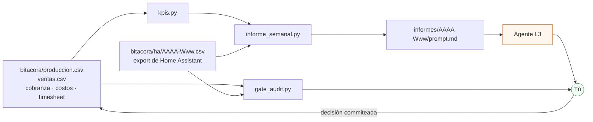

# Herramientas CLI

**En una línea:** cuatro scripts de Python sin dependencias convierten la bitácora en
decisiones — KPIs de la semana, el paquete que lee el agente, el veredicto Go/No-Go de un
gate y la revisión de que los enlaces de esta wiki sigan vivos.

!!! info "Antes de empezar"
    - **Tiempo:** 10 min para instalarlos; después, 2 min por comando. · **Costo:** $0 (solo Python). · **Personas:** 1
    - **Necesitas:** Python 3.11 o más nuevo (`python3 --version`), el repositorio clonado y `bitacora/produccion.csv` y `bitacora/ventas.csv` con datos reales.
    - **Prerequisitos:** [Cómo usar esta guía](../empieza-aqui/como-usar-esta-guia.md) (cómo se lleva la bitácora), [Diseño de datos](../diseno/datos.md) (esquema de los CSV).

!!! tip "Cero instalación"
    Los cuatro usan **solo la biblioteca estándar de Python 3.11**. No hay `pip install`, ni
    entorno virtual, ni `requirements.txt`. Se corren desde la raíz del repositorio:
    `python3 tools/<script>.py`. `requirements-docs.txt` es únicamente para construir esta
    wiki con MkDocs, no para las herramientas.

## Cuál uso y cuándo

| Script | Responde a | Cuándo se corre | Entrada | Salida |
|---|---|---|---|---|
| [`kpis.py`](#kpispy) | ¿Cómo va el negocio esta semana? | Domingo, lazo **L2** | `bitacora/produccion.csv`, `ventas.csv` | Tabla Markdown por semana ISO + alertas |
| [`informe_semanal.py`](#informe_semanalpy) | ¿Qué le doy de comer al agente? | Domingo, lazo **L3**, después de `kpis.py` | Lo anterior + exports de HA | Carpeta `informes/AAAA-Www/` con `prompt.md` listo para pegar |
| [`gate_audit.py`](#gate_auditpy) | ¿Puedo gastar en la siguiente fase? | Al cerrar una fase, lazo **L4** | Bitácora del periodo | Informe Markdown con **GO / NO-GO** y evidencia (salida 0 / 1) |
| [`check_links.py`](#check_linkspy) | ¿Siguen vivos los enlaces de compra? | Cada semana (automático) o antes de un PR | `docs/**/*.md` + `README.md` | Tabla Markdown por estado (salida 1 solo si hay muertos) |

Las capas L0–L4 y por qué cada una escala hacia arriba en vez de resolver dos veces:
[06 · Validación y lazos agénticos](../referencia/06-validacion-y-lazos-agenticos.md) y
[Software · Quién manda en cada capa](index.md#quien-manda-en-cada-capa).



`informe_semanal.py` y `gate_audit.py` **importan `kpis.py`**: los tres viven juntos en
`tools/` y no se mueven por separado.

---

## `kpis.py`

Calcula los seis KPIs del lazo comercial semanal (L2) por semana ISO y los pinta con
semáforo (`verde` / `ambar` / `ROJO`) contra las metas de
[06 §L2](../referencia/06-validacion-y-lazos-agenticos.md). Detalle de cada KPI y su
interpretación: [Validación · KPIs](../validacion/kpis.md).

```bash
# La foto completa desde que empezaste
python3 tools/kpis.py

# Solo las últimas 4 semanas, con la semilla de CEDA ya validada por V1
python3 tools/kpis.py --semanas 4 --costo girasol=9.10

# Para un tablero o un script
python3 tools/kpis.py --json > kpis.json
```

**Opciones**

| Opción | Default | Para qué |
|---|---|---|
| `--produccion RUTA` | `bitacora/produccion.csv` | Otra bitácora (p. ej. `bitacora/ejemplo/produccion.csv` para ver cómo se lee) |
| `--ventas RUTA` | `bitacora/ventas.csv` | Ídem |
| `--semanas N` | todas | Muestra solo las últimas N semanas ISO |
| `--costo VARIEDAD=MXN` | tabla del 08 | Sobrescribe el costo variable por charola; repetible |
| `--reparto MXN` | `20` | Costo por parada de reparto ($15–25 según [08](../referencia/08-recetas-y-economia-unitaria.md)) |
| `--contar-muestras` | off | Incluye las muestras en el denominador del sell-through |
| `--json` | off | JSON en lugar de Markdown |

**Convenciones que el script da por hechas** (escribe la bitácora así o los números mienten):

- `destino` decide qué cuenta como venta. `muestra` = CAC deliberado, sale del denominador
  del sell-through; `casa`, `basura` y vacío cuentan como **no vendida**; cualquier otro
  valor (el nombre del cliente) es venta.
- `merma_pct = 100` marca una charola **tirada**; ese es el numerador de la merma. La merma
  de corte (hojas que no se empacan) va en un valor menor y no cuenta como charola perdida.
- El costo variable sale del texto de `producto` en `ventas.csv`: `charola girasol` → costo
  de la variedad; si dice `clamshell` o `cortado` → costo de la charola ÷ 2.75 + $3.50 del
  envase; `manojo` o `canastilla` (hierbas NFT) **no tienen costo en el 08** y el script lo
  avisa en vez de inventarlo (pásalo con `--costo`).
- Variedades que reconoce: girasol, chícharo, rábano, betabel, brócoli, amaranto, cilantro,
  arúgula, albahaca, hierbabuena. Sin acentos ni mayúsculas importa.
- Costos por charola que trae de fábrica ([08 §Economía](../referencia/08-recetas-y-economia-unitaria.md)):
  girasol $29.50 · chícharo $98.00 · rábano $49.30 · betabel $52.50 · brócoli $57.00 ·
  amaranto $7.50 · cilantro $20.25 · arúgula $35.30. **Son los conservadores, con semilla
  cara.** En cuanto V1 valide la semilla de CEDA, corre con `--costo girasol=9.10`: es la
  diferencia entre 38 % y 65 % de margen.
- `entregado_a_tiempo` y `feedback` se cuentan **por parada** (fecha + cliente), no por
  renglón: tres productos en una entrega son una sola parada.
- El script **no clasifica quejas**; cuenta paradas con `feedback` no vacío. Si quieres
  contarlas, escribe el texto empezando con `QUEJA:` (`QUEJA: marchito el martes`) y
  cuéntalas con `grep -c 'QUEJA:' bitacora/ventas.csv`.
- Una fila de `ventas.csv` cuyo `feedback` empieza con `RECHAZADO` es un pedido que no
  pudiste surtir: no cuenta como venta y es la evidencia del criterio (2) del gate G1→2.

Tolera CSV vacíos, inexistentes o con columnas de más: avisa y sigue. Un CSV con datos de
ejemplo (6 semanas de Fase 0, con su moho y su entrega tarde) está en
`bitacora/ejemplo/` — úsalo para ver la salida antes de tener datos propios:

```bash
python3 tools/kpis.py --produccion bitacora/ejemplo/produccion.csv \
                      --ventas bitacora/ejemplo/ventas.csv
```

---

## `informe_semanal.py`

Arma el paquete del lazo agéntico L3. **No llama a ninguna API ni gasta un peso**: deja una
carpeta `informes/AAAA-Www/` con los CSV del periodo, los KPIs y un `prompt.md` que pegas en
Claude (o en una sesión de Claude Code por cron). El contrato exacto del prompt es el de
[06 §L3](../referencia/06-validacion-y-lazos-agenticos.md): el agente responde en ≤ 1 página
con anomalías, causa probable, un experimento V6, plan de siembra y el riesgo de la semana.

```bash
# La semana ISO de hoy
python3 tools/informe_semanal.py

# La última semana que tenga datos (lo normal si lo corres el lunes)
python3 tools/informe_semanal.py --semana auto

# Con la telemetría de Home Assistant y los experimentos abiertos
python3 tools/informe_semanal.py --semana 2027-W14 \
  --ha bitacora/ha/ \
  --experimentos bitacora/validacion/v06-experimentos.csv
```

Deja en `informes/AAAA-Www/`:

| Archivo | Qué trae |
|---|---|
| `produccion.csv`, `ventas.csv` | Extracto de la semana analizada y las 4 anteriores (el contrato pide comparar contra 4 semanas) |
| `ha-*.csv` | Copia de lo que pasaste con `--ha` |
| `kpis.md` | Los KPIs L2 de esas semanas, por variedad, con alertas |
| `prompt.md` | Contrato L3 + contexto + KPIs + experimentos + los CSV en línea. **Este es el archivo que se pega.** |

**Opciones**: `--semana AAAA-Www` (o `auto`), `--semanas-previas N` (4), `--ha CSV|DIR…`,
`--experimentos CSV`, `--salida CARPETA` (`informes/`), `--max-filas-inline N` (400),
más `--produccion`, `--ventas`, `--costo`, `--reparto` y `--contar-muestras` igual que en
`kpis.py`.

!!! warning "`informes/` está en `.gitignore`"
    El paquete es desechable: se regenera con el mismo comando. Lo que **sí** se commitea es
    la respuesta del agente y tu decisión, en `bitacora/informes/AAAA-Www.md`. Ese archivo es
    la memoria del proyecto; el paquete, no.

!!! danger "El agente propone, tú commiteas"
    Nada de lo que devuelva el agente toca el firmware ni Home Assistant. Un setpoint nuevo
    se aprueba, se cambia desde el dashboard y **después** se commitea en el YAML con su
    evidencia ([Firmware → Cambiar setpoints](firmware.md#cambiar-setpoints)).

---

## `gate_audit.py`

Evalúa un gate de fase (lazo L4) contra la bitácora e imprime **GO / NO-GO** con la
evidencia que lo sostiene. Los umbrales son los de
[06 §L4](../referencia/06-validacion-y-lazos-agenticos.md) y **no se negocian desde la línea
de comandos**: el script mide, no opina. Los criterios de cada gate, en
[Validación · Gates](../validacion/gates.md).

=== "G0→1 (Fase 0 → 1)"

    ```bash
    python3 tools/gate_audit.py --gate G0-1 \
      --ventas bitacora/ventas.csv --produccion bitacora/produccion.csv \
      --desde 2026-09-21 --hasta 2026-10-30 --guardar
    ```

    Mide **(a)** clientes con ≥ 3 compras semanales consecutivas (umbral ≥ 2) y **(b)**
    margen variable en ventas reales ≥ 55 %. Imprime la matriz cliente × semana con los
    importes, para que la racha se vea.

=== "G1→2 (Fase 1 → 2)"

    ```bash
    python3 tools/gate_audit.py --gate G1-2 \
      --ha bitacora/ha/2027-W05.csv bitacora/ha/2027-W06.csv --guardar
    # sin export de HA, con el conteo a mano:
    python3 tools/gate_audit.py --gate G1-2 --criticas-por-semana 2027-W05=1,2027-W06=0
    ```

    Mide **(1)** ≥ 4 clientes fijos, **(2)** pedidos rechazados por falta de producto dos
    semanas seguidas (filas con `feedback` que empieza con `RECHAZADO`) y **(3)** la
    automatización v1 estable 30 días: < 2 alarmas críticas por semana y **cero** charolas
    perdidas por fallo de riego.

=== "G2→3 (Fase 2 → 3)"

    ```bash
    python3 tools/gate_audit.py --gate G2-3 \
      --cobranza bitacora/cobranza.csv --costos bitacora/costos.csv \
      --timesheet bitacora/timesheet.csv \
      --desde 2027-04-01 --hasta 2027-06-30 --guardar
    ```

    Mide **(a)** neto ≥ $12,000/mes tres meses seguidos — cobrado de verdad, cruzando
    `fecha_cobro` y `estado = cobrada` de `cobranza.csv` contra `costos.csv`, no facturado — y
    **(b)** ≤ 9 h/semana medidas, promedio de 4 semanas de `timesheet.csv` (V9).

**Códigos de salida:** `0` = GO · `1` = NO-GO **o datos insuficientes** · `2` = error de uso.
Un NO-GO por falta de datos se lee igual que un NO-GO: no puedes gastar lo que no puedes
demostrar.

**Opciones comunes:** `--desde` / `--hasta` (AAAA-MM-DD; por defecto, todo el rango de la
bitácora), `--costo VARIEDAD=MXN`, `--reparto MXN`, `--guardar` (escribe el informe en
`bitacora/gates/<GATE>-<hoy>.md`), `--dir-gates CARPETA`, `--salida RUTA.md`.

!!! tip "El informe del gate se commitea"
    `--guardar` deja el Markdown en `bitacora/gates/`. Ese archivo, con fecha y evidencia, es
    lo que evita renegociar el gate contigo mismo tres meses después. Commitéalo aunque —
    sobre todo si — el veredicto es NO-GO.

**Esquemas que espera** (columnas mínimas; las de más se ignoran):

```text
bitacora/cobranza.csv   factura,cliente,fecha_emision,fecha_vencimiento,fecha_cobro,monto,pue_ppd,rep_emitido,estado
bitacora/costos.csv     fecha,categoria,concepto,monto
bitacora/timesheet.csv  fecha,semana,rubro,minutos
```

Los tres están como plantilla vacía en `bitacora/`. `cobranza.csv` lo llenas en
[Cobrar y suspender](../guias/cobrar-y-suspender.md); `timesheet.csv`, en
[Timesheet semanal](../guias/timesheet-semanal.md); las categorías de `costos.csv` son las de
[Fase 2 · Gate](../fases/fase-2/gate.md): insumos, servicios, reparto, ayudante,
reposiciones, fondo.

---

## `check_links.py`

Extrae todas las URL `http(s)` de `docs/**/*.md` y `README.md`, las deduplica y las verifica
(HEAD y, si falla, GET) con User-Agent de navegador, 2 reintentos y 8 hilos.

```bash
# Toda la wiki (~680 URL, unos 3-6 min)
python3 tools/check_links.py

# Solo lo que hay que arreglar
python3 tools/check_links.py --only-dead

# Guardar el reporte e incluir los enlaces de los BOM
python3 tools/check_links.py --salida enlaces.md --incluir 'bom/*.csv'

# Solo listar qué URL hay y dónde, sin tocar la red
python3 tools/check_links.py --listar
```

El último reporte está publicado en la wiki: [Referencia → Verificación de enlaces](../referencia/enlaces.md).

**Los cuatro estados**

| Estado | Qué pasó | Qué haces |
|---|---|---|
| `ok` | 2xx directo | Nada |
| `redirect` | 2xx tras redirección (anota la URL final) | Si el destino cambió de producto, actualiza el enlace |
| `blocked` | 401/403/429/503, 5xx, error TLS, o dominio dinámico que no se verifica (`listado.mercadolibre.com.mx`, buscadores, redes sociales) | **Revísalo a mano.** Casi siempre es anti-bot, no un enlace roto |
| `dead` | 404/410, DNS inexistente, timeout, conexión rechazada, o video de YouTube marcado "no disponible" | Arréglalo: busca el producto equivalente y corrige la fila del BOM y la página |

**La salida es 1 únicamente si hay `dead`.** Un `blocked` no rompe el build: Mercado Libre y
Cloudflare responden 403 a cualquier script y eso no significa que el producto no exista.

**Opciones:** `--raiz RUTA`, `--incluir GLOB` (repetible), `--only-dead`, `--salida ARCHIVO.md`,
`--listar`, `--max N`, `--timeout S` (15), `--reintentos N` (2), `--hilos N` (8),
`--dinamico DOMINIO` (tratar otro dominio como no verificable).

!!! warning "Un enlace muerto es una partida del BOM que ya no puedes comprar"
    Los precios de los proveedores de CDMX caducan y los catálogos se reorganizan. Cuando
    `check_links.py` marque un `dead` en un enlace de compra, no basta con borrarlo: hay que
    encontrar el equivalente, anotar el precio nuevo **con la fecha** en `bom/*.csv` o en
    [01 · Proveedores CDMX](../referencia/01-proveedores-cdmx.md), y abrir el PR.

---

## Automatización: los dos workflows

| Workflow | Cuándo corre | Qué hace | Si falla |
|---|---|---|---|
| [`.github/workflows/docs.yml`](https://github.com/AndresIslas99/HomeGreen/blob/main/.github/workflows/docs.yml) | Push a `main` y cada PR que toque `docs/`, `mkdocs.yml` o `requirements-docs.txt` | `mkdocs build --strict` y, solo desde `main`, publica en GitHub Pages | El `--strict` convierte en error cualquier enlace interno roto, imagen ausente o página fuera del `nav`. Arréglalo antes de mezclar |
| [`.github/workflows/links.yml`](https://github.com/AndresIslas99/HomeGreen/blob/main/.github/workflows/links.yml) | Lunes 7:00 CDMX, y a mano con *Run workflow* | `check_links.py` sobre toda la wiki; sube `enlaces.md` como artefacto (90 días) | Solo falla con `dead`. Descarga el artefacto, corrige las filas y abre el PR |

La primera vez que se publique la wiki hay que habilitarla: **Settings → Pages → Source:
GitHub Actions**. Para verla en local, sin Actions:

```bash
pip install -r requirements-docs.txt
mkdocs serve          # http://127.0.0.1:8000
mkdocs build --strict # lo mismo que valida el PR
```

## Al terminar

- [ ] `python3 tools/kpis.py --produccion bitacora/ejemplo/produccion.csv --ventas bitacora/ejemplo/ventas.csv` imprime la tabla con semáforo (prueba de que Python está bien)
- [ ] Tu `bitacora/produccion.csv` y `ventas.csv` tienen los encabezados exactos y al menos una fila real
- [ ] El domingo está agendado: `kpis.py` → `informe_semanal.py` → pegar `prompt.md` → commitear la decisión en `bitacora/informes/`
- [ ] `bitacora/gates/` existe y el primer informe de gate se guarda con `--guardar`, salga GO o NO-GO
- Registrar en bitácora: la decisión del lazo L3 en `bitacora/informes/AAAA-Www.md`; el veredicto del gate en `bitacora/gates/`
- Siguiente paso: [Validación · KPIs](../validacion/kpis.md) para leer cada número, o [Validación · Gates](../validacion/gates.md) para el siguiente gate

## Fuentes

- [referencia/06-validacion-y-lazos-agenticos.md](../referencia/06-validacion-y-lazos-agenticos.md) — capas L0–L4, metas de los KPIs, contrato del informe L3, criterios de los gates.
- [referencia/08-recetas-y-economia-unitaria.md](../referencia/08-recetas-y-economia-unitaria.md) — costo variable por charola y costo de reparto por parada.
- [validacion/kpis.md](../validacion/kpis.md) y [validacion/gates.md](../validacion/gates.md) — la lógica que estos scripts implementan.
- [diseno/datos.md](../diseno/datos.md) — esquema de los CSV y de los exports de Home Assistant.
- [software/index.md](index.md) — dónde encaja cada herramienta en la arquitectura.
